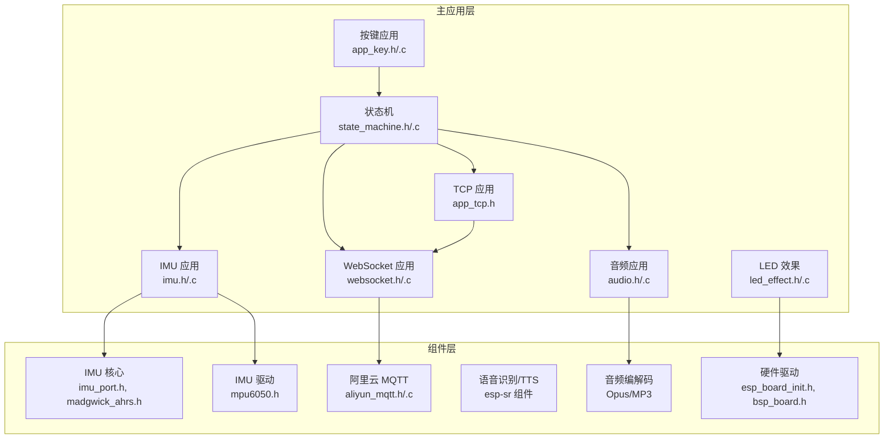
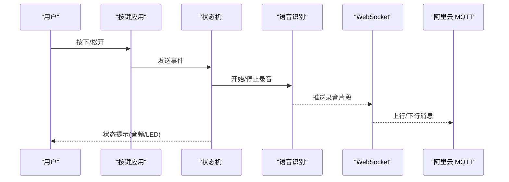
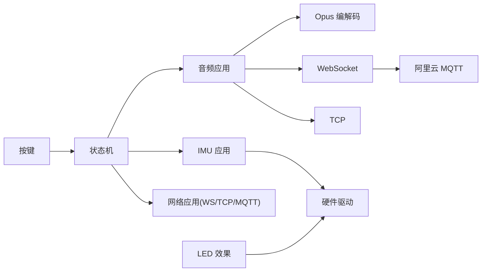

# API 参考手册

<cite>
**本文档引用的文件**
- [audio.h](file://main/app/audio/audio.h)
- [audio_private.h](file://main/app/audio/audio_private.h)
- [opus_codec_port.c](file://main/app/audio/opus_codec_port.c)
- [imu.h](file://main/app/imu/imu.h)
- [imu.c](file://main/app/imu/imu.c)
- [imu_port.h](file://components/IMU/core/imu_port.h)
- [madgwick_ahrs.h](file://components/IMU/core/madgwick_ahrs.h)
- [mpu6050.h](file://components/IMU/drivers/mpu6050/mpu6050.h)
- [websocket.h](file://main/app/websocket/websocket.h)
- [websocket.c](file://main/app/websocket/websocket.c)
- [app_tcp.h](file://main/app/tcp/app_tcp.h)
- [state_machine.h](file://main/app/state_machine/state_machine.h)
- [state_machine.c](file://main/app/state_machine/state_machine.c)
- [aliyun_mqtt.h](file://components/aliyun_mqtt/include/aliyun_mqtt.h)
- [aliyun_mqtt.c](file://components/aliyun_mqtt/src/aliyun_mqtt.c)
- [esp_board_init.h](file://components/hardware_driver/include/esp_board_init.h)
- [bsp_board.h](file://components/hardware_driver/boards/include/bsp_board.h)
- [led_effect.h](file://main/app/led_strip/led_effect.h)
- [led_effect.c](file://main/app/led_strip/led_effect.c)
- [app_key.h](file://main/app/key/app_key.h)
- [app_key.c](file://main/app/key/app_key.c)
</cite>

## 目录
1. [简介](#简介)
2. [项目结构](#项目结构)
3. [核心组件](#核心组件)
4. [架构总览](#架构总览)
5. [详细组件分析](#详细组件分析)
6. [依赖关系分析](#依赖关系分析)
7. [性能考虑](#性能考虑)
8. [故障排除指南](#故障排除指南)
9. [结论](#结论)
10. [附录](#附录)

## 简介
本参考手册面向开发者与集成工程师，系统梳理项目中的公共 API，覆盖音频处理、硬件控制、网络通信与状态管理四大领域。文档提供函数签名、参数说明、返回值定义、使用示例、线程安全与性能特征、错误处理策略、版本兼容性与废弃接口迁移指南以及最佳实践建议。

## 项目结构
项目采用按功能域分层的模块化组织方式：
- 主应用层：音频、IMU、按键、LED、状态机、TCP、WebSocket、WiFi 等应用模块
- 组件层：IMU 核心算法与驱动、阿里云 MQTT 客户端、语音识别与 TTS、Opus/MP3 音频编解码、硬件驱动板级支持包等
- 外部库：ESP-IDF、ESP-SR、Opus、libogg、helix-mp3 等

图表来源
- [audio.h:1-22](file://main/app/audio/audio.h#L1-L22)
- [imu.h](file://main/app/imu/imu.h)
- [websocket.h](file://main/app/websocket/websocket.h)
- [app_tcp.h:1-8](file://main/app/tcp/app_tcp.h#L1-L8)
- [state_machine.h:1-34](file://main/app/state_machine/state_machine.h#L1-L34)
- [imu_port.h](file://components/IMU/core/imu_port.h)
- [madgwick_ahrs.h](file://components/IMU/core/madgwick_ahrs.h)
- [mpu6050.h:24-101](file://components/IMU/drivers/mpu6050/mpu6050.h#L24-L101)
- [aliyun_mqtt.h](file://components/aliyun_mqtt/include/aliyun_mqtt.h)
- [esp_board_init.h](file://components/hardware_driver/include/esp_board_init.h)
- [bsp_board.h](file://components/hardware_driver/boards/include/bsp_board.h)

章节来源
- [audio.h:1-22](file://main/app/audio/audio.h#L1-L22)
- [imu.h](file://main/app/imu/imu.h)
- [websocket.h](file://main/app/websocket/websocket.h)
- [app_tcp.h:1-8](file://main/app/tcp/app_tcp.h#L1-L8)
- [state_machine.h:1-34](file://main/app/state_machine/state_machine.h#L1-L34)

## 核心组件
本节概述四大领域的公共 API 能力与职责边界：
- 音频处理 API：音量控制、播放、编解码注册、事件通知、OPUS 编解码桥接
- 硬件控制 API：IMU 角度获取、按键初始化、LED 效果控制、板级硬件初始化
- 网络通信 API：TCP 服务、WebSocket 连接、MQTT 通道、数据收发与状态回调
- 状态管理 API：事件队列、状态机切换、录音开始/结束消息推送

章节来源
- [audio.h:8-21](file://main/app/audio/audio.h#L8-L21)
- [audio_private.h:77-125](file://main/app/audio/audio_private.h#L77-L125)
- [imu.c:77-81](file://main/app/imu/imu.c#L77-L81)
- [app_key.h:1-1](file://main/app/key/app_key.h#L1-L1)
- [led_effect.h](file://main/app/led_strip/led_effect.h)
- [app_tcp.h:1-8](file://main/app/tcp/app_tcp.h#L1-L8)
- [websocket.h](file://main/app/websocket/websocket.h)
- [aliyun_mqtt.h](file://components/aliyun_mqtt/include/aliyun_mqtt.h)
- [state_machine.h:6-34](file://main/app/state_machine/state_machine.h#L6-L34)

## 架构总览
系统以“状态机”为核心协调器，按键事件触发录音流程；录音数据通过 WebSocket 或 TCP 传输；IMU 提供姿态角用于交互或控制；LED 与音频提供反馈；MQTT 作为云端通道。

图表来源
- [state_machine.c:83-115](file://main/app/state_machine/state_machine.c#L83-L115)
- [websocket.c:58-71](file://main/app/websocket/websocket.c#L58-L71)
- [aliyun_mqtt.h](file://components/aliyun_mqtt/include/aliyun_mqtt.h)

## 详细组件分析

### 音频处理 API
- 功能范围
  - 音量设置、音频播放、OPUS 文件播放
  - 解码器/编码器操作注册、OPUS 编码数据获取
  - 音频事件通知、WebSocket 数据接收处理、OPUS 解码器复位
  - 自定义读取接口 mread 与音频启动/结束事件

- 公共接口清单
  - 音量设置：audio_set_volume(uint8_t volume)
  - 播放：audio_play(const void *src, uint8_t volume)
  - OPUS 文件播放：audio_play_opus_file(const char *file_name)
  - 注册解码器：decoder_ops_register(audio_decoder_t *decoder)
  - 注册编码器：encoder_ops_register(audio_encoder_t *encoder)
  - 初始化：audio_init(void) -> esp_err_t
  - 获取 OPUS 编码数据：audio_get_opus_encode_data(uint8_t *out_buf, uint16_t req_len) -> esp_err_t
  - WebSocket 数据处理：ws_recv_data_handler(const char *data, size_t len)
  - OPUS 解码器复位：opus_decoder_reset(audio_decoder_t *decoder)
  - 自定义读取：mread(char *buf, uint16_t len) -> size_t
  - 音频事件：audio_start_event(), audio_end_event()

- 参数与返回值约定
  - volume：0~100（平台特定，需遵循设备能力）
  - src/out_buf：音频数据指针，长度由调用方保证
  - file_name：以空字符结尾的字符串路径
  - out_buf+req_len：输出缓冲区与请求长度，返回值指示是否满足需求
  - data+len：WebSocket 接收的数据块
  - 返回值：统一采用 esp_err_t，非零表示错误

- 使用示例（步骤化）
  - 初始化音频：调用 audio_init() 并检查返回值
  - 注册编解码器：decoder_ops_register()/encoder_ops_register()
  - 设置音量：audio_set_volume(80)
  - 播放本地 OPUS 文件：audio_play_opus_file("/sdcard/sound.opus")
  - 从 WebSocket 接收数据：ws_recv_data_handler(data, len)，随后可调用 audio_get_opus_encode_data(...) 获取编码数据
  - 录音事件：在状态机中触发 audio_start_event()/audio_end_event()

- 线程安全与并发
  - 音频 API 通常在任务上下文中调用；编解码器注册后应避免在多任务并发修改
  - mread 与 ws_recv_data_handler 在中断或异步回调中可能被调用，需确保内部互斥与缓冲安全

- 性能特征
  - OPUS 编码/解码延迟低，适合实时语音场景
  - 音频播放与录制受采样率、声道数、比特率影响，建议与硬件能力匹配

- 错误处理
  - 所有返回值需判错；当 req_len 不足时，需扩容缓冲区后重试
  - OPUS 解码器异常时调用 opus_decoder_reset() 重置

- 版本兼容性与废弃接口
  - 当前未发现明确废弃接口；若未来升级编解码库，请优先保持函数签名兼容

章节来源
- [audio.h:8-21](file://main/app/audio/audio.h#L8-L21)
- [audio_private.h:77-125](file://main/app/audio/audio_private.h#L77-L125)
- [opus_codec_port.c:395-409](file://main/app/audio/opus_codec_port.c#L395-L409)

### 硬件控制 API
- IMU 角度获取
  - 函数：imu_get_angles(float *out_pitch, float *out_roll) -> esp_err_t
  - 说明：返回当前姿态角（弧度或角度视实现而定），输出指针可为空则忽略对应值
  - 使用：在主循环或定时任务中周期读取，结合状态机进行交互

- 板级硬件初始化
  - 函数：esp_board_init()（头文件声明）用于初始化目标板硬件资源
  - 说明：I2C、GPIO、ADC 等外设配置由底层驱动完成

- LED 效果控制
  - 接口：led_effect.h 中定义效果枚举与控制函数（如播放、停止、设置颜色等）
  - 说明：与状态机联动，提供视觉反馈

- 按键初始化
  - 函数：button_init(void)
  - 说明：初始化按键输入，配合状态机事件驱动录音流程

- IMU 驱动与选择
  - IMU 核心接口：imu_port.h 定义驱动上下文与接口
  - 算法：madgwick_ahrs.h 提供姿态解算算法
  - 设备驱动：mpu6050.h 定义设备寄存器与配置枚举

- 使用示例（步骤化）
  - 初始化板级硬件：调用 esp_board_init()
  - 初始化 IMU：配置 I2C、安装驱动、选择具体 IMU 驱动并初始化
  - 读取角度：imu_get_angles(&pitch, &roll)
  - 控制 LED：根据状态机状态调用 LED 效果 API

- 线程安全与并发
  - IMU 角度读取应在任务中串行访问，避免竞态
  - LED 效果 API 若涉及共享资源，需加锁

- 性能特征
  - IMU 更新频率受采样与滤波算法影响，建议在低优先级任务中轮询

- 错误处理
  - I2C 参数配置与驱动安装失败时返回错误码，需日志记录并重试或降级

章节来源
- [imu.c:54-81](file://main/app/imu/imu.c#L54-L81)
- [imu.c:77-81](file://main/app/imu/imu.c#L77-L81)
- [esp_board_init.h](file://components/hardware_driver/include/esp_board_init.h)
- [bsp_board.h](file://components/hardware_driver/boards/include/bsp_board.h)
- [led_effect.h](file://main/app/led_strip/led_effect.h)
- [app_key.h:1-1](file://main/app/key/app_key.h#L1-L1)
- [imu_port.h](file://components/IMU/core/imu_port.h)
- [madgwick_ahrs.h](file://components/IMU/core/madgwick_ahrs.h)
- [mpu6050.h:24-101](file://components/IMU/drivers/mpu6050/mpu6050.h#L24-L101)

### 网络通信 API
- WebSocket
  - 初始化/销毁：ws_init()/ws_deinit()
  - 连接状态：ws_is_connected() -> bool
  - 发送：ws_send_text()/ws_send_bin()/ws_send_jpeg_binary()
  - 注册回调：ws_register_data_handler()/ws_register_state_handler()
  - 内部互斥：使用信号量保护状态切换与发送队列

- TCP
  - 服务端：tcp_server_init()
  - 发送：tcp_send_data(const char *data, int len) -> int
  - 关联任务：tcp_register_key_task(TaskHandle_t handle)

- 阿里云 MQTT
  - 接口：aliyun_mqtt.h 声明客户端初始化、发布/订阅、断线重连等
  - 说明：与 WebSocket 协同，实现云端消息通道

- 使用示例（步骤化）
  - WebSocket：初始化 -> 注册回调 -> 连接 -> 发送文本/二进制 -> 断线重连
  - TCP：初始化服务端 -> 注册按键任务 -> 发送数据
  - MQTT：初始化客户端 -> 订阅主题 -> 发布消息

- 线程安全与并发
  - WebSocket 内部使用互斥量保护状态；发送通过队列异步进行
  - TCP 发送需注意阻塞与超时

- 性能特征
  - WebSocket 适合小包高频数据；JPEG 二进制发送需评估带宽
  - TCP 适合大块数据传输

- 错误处理
  - 发送失败返回负值或错误码；连接断开需触发重连机制

章节来源
- [websocket.h](file://main/app/websocket/websocket.h)
- [websocket.c:58-71](file://main/app/websocket/websocket.c#L58-L71)
- [websocket.c:632-657](file://main/app/websocket/websocket.c#L632-L657)
- [websocket.c:659-664](file://main/app/websocket/websocket.c#L659-L664)
- [websocket.c:666-679](file://main/app/websocket/websocket.c#L666-L679)
- [app_tcp.h:1-8](file://main/app/tcp/app_tcp.h#L1-L8)
- [aliyun_mqtt.h](file://components/aliyun_mqtt/include/aliyun_mqtt.h)

### 状态管理 API
- 状态机
  - 事件类型：EVENT_KEY_PRESS_DOWN、EVENT_KEY_UP
  - 状态：STATE_IDLE、STATE_RECORDING
  - 接口：state_machine_init()、state_machine_send_event()、state_machine_get_current_state()

- 流程
  - 空闲 -> 按键按下 -> 发送录音开始消息 -> 启动录音 -> 录音中
  - 录音中 -> 按键松开 -> 停止录音 -> 发送录音结束消息 -> 回到空闲

- 使用示例（步骤化）
  - 初始化状态机 -> 注册事件 -> 在按键 ISR 中投递事件 -> 状态机任务处理并调用录音与消息发送

- 线程安全与并发
  - 事件通过 FreeRTOS 队列传递，内部无全局共享状态；发送事件与获取状态需在任务间同步

- 性能特征
  - 事件驱动，低开销；录音时长上限由状态机常量设定

- 错误处理
  - 队列创建失败返回错误；未连接时发送消息需降级处理

章节来源
- [state_machine.h:6-34](file://main/app/state_machine/state_machine.h#L6-L34)
- [state_machine.c:24-35](file://main/app/state_machine/state_machine.c#L24-L35)
- [state_machine.c:37-42](file://main/app/state_machine/state_machine.c#L37-L42)
- [state_machine.c:44-47](file://main/app/state_machine/state_machine.c#L44-L47)
- [state_machine.c:83-115](file://main/app/state_machine/state_machine.c#L83-L115)

## 依赖关系分析
- 音频子系统依赖 Opus 编解码与 WebSocket/TCP 传输链路
- 状态机协调音频、IMU、按键与网络通信
- 硬件驱动为 IMU 与 LED/按键提供基础能力
- MQTT 作为可选上行通道，与 WebSocket 并行存在

图表来源
- [state_machine.c:83-115](file://main/app/state_machine/state_machine.c#L83-L115)
- [audio.h:8-21](file://main/app/audio/audio.h#L8-L21)
- [websocket.c:58-71](file://main/app/websocket/websocket.c#L58-L71)
- [app_tcp.h:1-8](file://main/app/tcp/app_tcp.h#L1-L8)
- [aliyun_mqtt.h](file://components/aliyun_mqtt/include/aliyun_mqtt.h)
- [esp_board_init.h](file://components/hardware_driver/include/esp_board_init.h)

## 性能考虑
- 音频
  - 采样率与帧长直接影响 CPU 占用与延迟；建议与硬件能力匹配
  - OPUS 编码参数（比特率、复杂度）影响压缩比与质量
- IMU
  - 更新频率与滤波算法平衡实时性与稳定性
- 网络
  - WebSocket 小包高频传输需关注协议开销；JPEG 二进制传输需评估带宽
  - TCP 适合批量数据，注意粘包与拆包
- 状态机
  - 事件队列深度与任务栈大小需合理配置，避免阻塞

## 故障排除指南
- 音频
  - 无法获取 OPUS 编码数据：检查 req_len 是否过小，必要时扩容缓冲区
  - 播放无声：确认音量设置、播放源格式与设备初始化
- IMU
  - 初始化失败：检查 I2C 配置、引脚与驱动安装返回值
  - 角度异常：确认校准流程与滤波参数
- 网络
  - WebSocket 未连接：检查初始化与连接状态回调；必要时触发重连
  - TCP 发送失败：检查对端是否在线与缓冲区大小
- 状态机
  - 事件丢失：检查队列深度与投递时机；确保任务优先级合适

章节来源
- [opus_codec_port.c:395-409](file://main/app/audio/opus_codec_port.c#L395-L409)
- [imu.c:54-81](file://main/app/imu/imu.c#L54-L81)
- [websocket.c:632-657](file://main/app/websocket/websocket.c#L632-L657)
- [websocket.c:659-664](file://main/app/websocket/websocket.c#L659-L664)
- [app_tcp.h:1-8](file://main/app/tcp/app_tcp.h#L1-L8)
- [state_machine.c:24-35](file://main/app/state_machine/state_machine.c#L24-L35)

## 结论
本参考手册系统化梳理了音频、硬件、网络与状态管理四类 API，明确了接口职责、参数约束、错误处理与性能特征。建议在实际集成中遵循线程安全与资源管理规范，并结合硬件能力优化参数配置。

## 附录
- 最佳实践
  - 所有公共 API 调用均需检查返回值
  - 在中断或异步回调中避免长时间阻塞操作
  - 对共享资源使用互斥量保护
  - 合理设置任务优先级与栈大小
- 版本与兼容性
  - 当前未发现废弃接口；升级第三方库时优先保持 API 兼容
- 迁移指南
  - 若更换编解码器：保持注册接口一致，调整内部实现
  - 若更换网络协议：保持发送/接收接口一致，调整底层实现