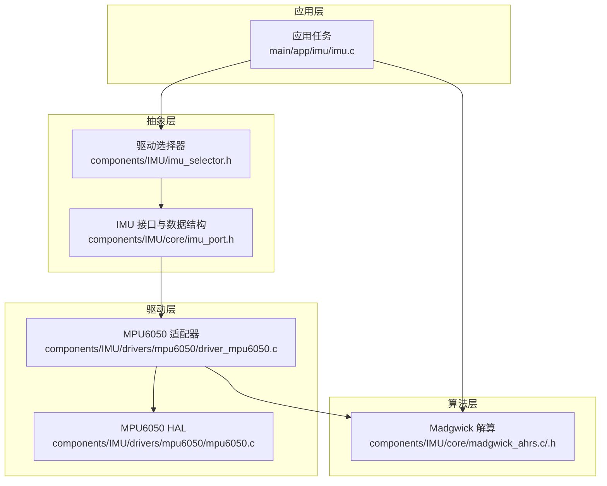
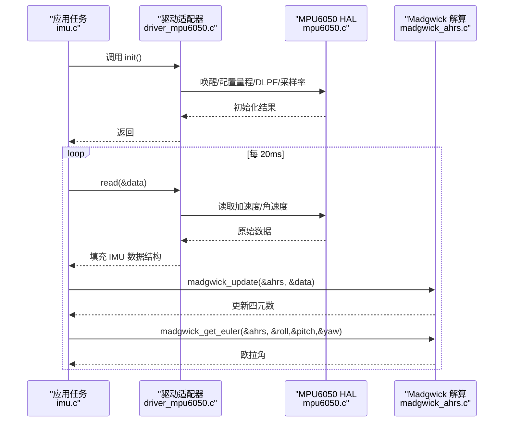
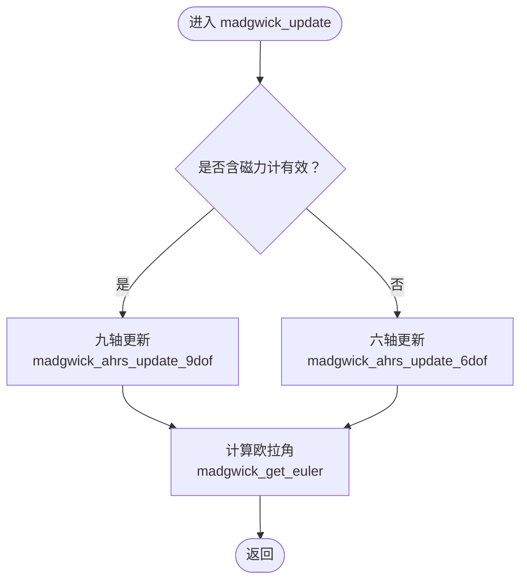
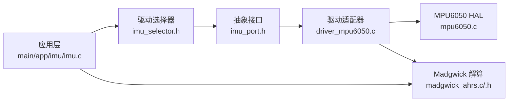

# 传感器 API

<cite>
**本文引用的文件**
- [components/IMU/core/imu_port.h](file://components/IMU/core/imu_port.h)
- [components/IMU/core/madgwick_ahrs.h](file://components/IMU/core/madgwick_ahrs.h)
- [components/IMU/core/madgwick_ahrs.c](file://components/IMU/core/madgwick_ahrs.c)
- [components/IMU/drivers/mpu6050/mpu6050.h](file://components/IMU/drivers/mpu6050/mpu6050.h)
- [components/IMU/drivers/mpu6050/mpu6050.c](file://components/IMU/drivers/mpu6050/mpu6050.c)
- [components/IMU/drivers/mpu6050/driver_mpu6050.c](file://components/IMU/drivers/mpu6050/driver_mpu6050.c)
- [components/IMU/imu_selector.h](file://components/IMU/imu_selector.h)
- [components/IMU/CMakeLists.txt](file://components/IMU/CMakeLists.txt)
- [main/app/imu/imu.h](file://main/app/imu/imu.h)
- [main/app/imu/imu.c](file://main/app/imu/imu.c)
</cite>

## 目录
1. [简介](#简介)
2. [项目结构](#项目结构)
3. [核心组件](#核心组件)
4. [架构总览](#架构总览)
5. [详细组件分析](#详细组件分析)
6. [依赖关系分析](#依赖关系分析)
7. [性能考量](#性能考量)
8. [故障排查指南](#故障排查指南)
9. [结论](#结论)
10. [附录](#附录)

## 简介
本文件为传感器系统的 API 文档，聚焦 IMU 传感器的数据读取接口、姿态解算函数与校准方法，覆盖初始化配置、数据获取频率设置、精度调节参数、姿态角计算、滤波器配置以及异常处理接口。同时给出传感器数据格式、单位换算与坐标系定义，并提供多传感器数据融合与实时监控的实现思路与示例路径。

## 项目结构
IMU 子系统采用“抽象驱动 + 具体实现 + 算法解算”的分层设计：
- 抽象层：统一数据结构与驱动接口，屏蔽硬件差异
- 驱动层：以 MPU6050 为例的具体硬件驱动与适配器
- 算法层：Madgwick AHRS 解算，支持六轴/九轴自适应
- 应用层：任务调度、参数配置与姿态输出

图表来源
- [main/app/imu/imu.c:83-115](file://main/app/imu/imu.c#L83-L115)
- [components/IMU/imu_selector.h:12-12](file://components/IMU/imu_selector.h#L12-L12)
- [components/IMU/core/imu_port.h:22-27](file://components/IMU/core/imu_port.h#L22-L27)
- [components/IMU/drivers/mpu6050/driver_mpu6050.c:116-124](file://components/IMU/drivers/mpu6050/driver_mpu6050.c#L116-L124)
- [components/IMU/drivers/mpu6050/mpu6050.c:95-104](file://components/IMU/drivers/mpu6050/mpu6050.c#L95-L104)
- [components/IMU/core/madgwick_ahrs.c:284-300](file://components/IMU/core/madgwick_ahrs.c#L284-L300)

章节来源
- [components/IMU/CMakeLists.txt:1-28](file://components/IMU/CMakeLists.txt#L1-L28)
- [components/IMU/core/imu_port.h:14-27](file://components/IMU/core/imu_port.h#L14-L27)
- [components/IMU/drivers/mpu6050/driver_mpu6050.c:20-62](file://components/IMU/drivers/mpu6050/driver_mpu6050.c#L20-L62)

## 核心组件
- 统一数据结构与驱动接口
  - 定义 IMU 数据结构与有效性标志，抽象驱动接口，便于替换不同硬件
- MPU6050 HAL 与适配器
  - 提供 I2C 读写、唤醒/睡眠、量程配置、DLPF 与采样率分频设置
  - 适配器封装为统一驱动接口，负责数据采集与上下文管理
- Madgwick AHRS 解算
  - 支持六轴/九轴自适应融合，提供欧拉角输出
- 应用层任务
  - 初始化 I2C 与驱动，循环读取数据并进行解算，周期性打印姿态

章节来源
- [components/IMU/core/imu_port.h:8-27](file://components/IMU/core/imu_port.h#L8-L27)
- [components/IMU/drivers/mpu6050/mpu6050.h:140-200](file://components/IMU/drivers/mpu6050/mpu6050.h#L140-L200)
- [components/IMU/drivers/mpu6050/driver_mpu6050.c:65-94](file://components/IMU/drivers/mpu6050/driver_mpu6050.c#L65-L94)
- [components/IMU/core/madgwick_ahrs.h:6-14](file://components/IMU/core/madgwick_ahrs.h#L6-L14)
- [main/app/imu/imu.c:83-115](file://main/app/imu/imu.c#L83-L115)

## 架构总览
IMU 读取与解算的关键流程如下：

图表来源
- [main/app/imu/imu.c:83-115](file://main/app/imu/imu.c#L83-L115)
- [components/IMU/drivers/mpu6050/driver_mpu6050.c:65-94](file://components/IMU/drivers/mpu6050/driver_mpu6050.c#L65-L94)
- [components/IMU/drivers/mpu6050/mpu6050.c:392-432](file://components/IMU/drivers/mpu6050/mpu6050.c#L392-L432)
- [components/IMU/core/madgwick_ahrs.c:284-322](file://components/IMU/core/madgwick_ahrs.c#L284-L322)

## 详细组件分析

### 统一数据结构与驱动接口
- 数据结构字段
  - 加速度三轴、角速度三轴、磁力计三轴（六轴时磁力计为 0）
  - 运动强度指标、数据有效性标志
- 驱动接口
  - init/read/deinit 三个函数指针，屏蔽硬件差异
- 硬件配置结构体
  - I2C 端口、引脚、时钟频率、中断引脚、设备地址

章节来源
- [components/IMU/core/imu_port.h:14-27](file://components/IMU/core/imu_port.h#L14-L27)
- [components/IMU/core/imu_port.h:29-48](file://components/IMU/core/imu_port.h#L29-L48)

### 驱动选择器
- 提供获取当前激活驱动实例的入口，由构建系统通过 Kconfig 决定编译哪一份驱动实现
- 返回静态只读结构体指针，贯穿生命周期

章节来源
- [components/IMU/imu_selector.h:6-12](file://components/IMU/imu_selector.h#L6-L12)

### MPU6050 HAL 与适配器
- HAL 功能
  - 设备识别、唤醒/睡眠、量程配置、温度读取
  - I2C 读写寄存器、中断状态查询、DLPF 与采样率分频设置
- 适配器功能
  - 初始化：创建设备句柄、唤醒、配置量程、设置 DLPF、采样率分频
  - 读取：从 HAL 读取加速度与角速度，填充统一数据结构
  - 反初始化：释放设备句柄与信号量
  - 等待数据就绪：可选中断模式下的信号量等待

章节来源
- [components/IMU/drivers/mpu6050/mpu6050.h:140-200](file://components/IMU/drivers/mpu6050/mpu6050.h#L140-L200)
- [components/IMU/drivers/mpu6050/mpu6050.c:95-104](file://components/IMU/drivers/mpu6050/mpu6050.c#L95-L104)
- [components/IMU/drivers/mpu6050/driver_mpu6050.c:20-62](file://components/IMU/drivers/mpu6050/driver_mpu6050.c#L20-L62)
- [components/IMU/drivers/mpu6050/driver_mpu6050.c:65-94](file://components/IMU/drivers/mpu6050/driver_mpu6050.c#L65-L94)
- [components/IMU/drivers/mpu6050/driver_mpu6050.c:109-113](file://components/IMU/drivers/mpu6050/driver_mpu6050.c#L109-L113)

### Madgwick AHRS 解算
- 输入
  - 统一 IMU 数据结构（加速度、角速度；若含磁力计则九轴）
- 自适应策略
  - 根据数据标志判断磁力计有效性，自动切换六轴或九轴算法
- 输出
  - 四元数状态与欧拉角（roll/pitch/yaw）
- 关键参数
  - beta：滤波增益，影响收敛速度与稳态噪声
  - sample_freq：采样频率，用于积分更新

图表来源
- [components/IMU/core/madgwick_ahrs.c:284-322](file://components/IMU/core/madgwick_ahrs.c#L284-L322)
- [components/IMU/core/madgwick_ahrs.c:23-147](file://components/IMU/core/madgwick_ahrs.c#L23-L147)
- [components/IMU/core/madgwick_ahrs.c:153-279](file://components/IMU/core/madgwick_ahrs.c#L153-L279)

章节来源
- [components/IMU/core/madgwick_ahrs.h:6-14](file://components/IMU/core/madgwick_ahrs.h#L6-L14)
- [components/IMU/core/madgwick_ahrs.c:284-322](file://components/IMU/core/madgwick_ahrs.c#L284-L322)

### 应用层 API 与任务
- 初始化
  - 配置 I2C 参数并安装驱动
  - 获取驱动并初始化传感器
- 启动任务
  - 创建任务循环读取数据、解算姿态并周期性打印
- 查询姿态
  - 提供获取 pitch/roll 的接口

章节来源
- [main/app/imu/imu.c:42-75](file://main/app/imu/imu.c#L42-L75)
- [main/app/imu/imu.c:112-115](file://main/app/imu/imu.c#L112-L115)
- [main/app/imu/imu.h:10-14](file://main/app/imu/imu.h#L10-L14)

## 依赖关系分析
- 组件耦合
  - 应用层仅依赖抽象接口与选择器，不直接依赖具体驱动
  - 驱动适配器依赖 HAL 与抽象接口
  - 解算模块依赖抽象数据结构
- 编译期选择
  - 通过 CMake 与 Kconfig 在编译阶段选择驱动实现

图表来源
- [main/app/imu/imu.c:83-115](file://main/app/imu/imu.c#L83-L115)
- [components/IMU/imu_selector.h:12-12](file://components/IMU/imu_selector.h#L12-L12)
- [components/IMU/core/imu_port.h:22-27](file://components/IMU/core/imu_port.h#L22-L27)
- [components/IMU/drivers/mpu6050/driver_mpu6050.c:116-124](file://components/IMU/drivers/mpu6050/driver_mpu6050.c#L116-L124)
- [components/IMU/drivers/mpu6050/mpu6050.c:95-104](file://components/IMU/drivers/mpu6050/mpu6050.c#L95-L104)
- [components/IMU/core/madgwick_ahrs.c:284-300](file://components/IMU/core/madgwick_ahrs.c#L284-L300)

章节来源
- [components/IMU/CMakeLists.txt:5-17](file://components/IMU/CMakeLists.txt#L5-L17)

## 性能考量
- 采样率与滤波
  - 适配器设置采样率为 50 Hz，DLPF 为 3（对应加速度带宽约 44 Hz，陀螺仪带宽约 42 Hz）
  - 采样率与解算频率需匹配，避免积分误差累积
- 计算复杂度
  - Madgwick 每帧执行常数次三角函数与归一化，开销较低，适合嵌入式实时运行
- 重试与健壮性
  - 读取失败时有限重试，避免阻塞主循环
- 中断优化
  - 适配器预留中断信号量机制，可进一步降低轮询开销（当前示例使用轮询）

章节来源
- [components/IMU/drivers/mpu6050/driver_mpu6050.c:42-44](file://components/IMU/drivers/mpu6050/driver_mpu6050.c#L42-L44)
- [components/IMU/core/madgwick_ahrs.c:124-147](file://components/IMU/core/madgwick_ahrs.c#L124-L147)
- [main/app/imu/imu.c:90-108](file://main/app/imu/imu.c#L90-L108)

## 故障排查指南
- I2C 初始化失败
  - 检查引脚配置、上拉电阻与时钟频率
- 传感器无法唤醒/配置
  - 确认设备地址、电源与连接；查看 HAL 返回值
- 读取数据为零或异常
  - 检查量程设置与 DLPF；确认采样率分频与实际频率一致
- 解算结果发散或跳变
  - 调整 beta 增益；确保样本频率稳定；检查加速度数据有效性
- 日志定位
  - 适配器与解算模块均包含错误日志输出，可据此定位问题

章节来源
- [main/app/imu/imu.c:54-65](file://main/app/imu/imu.c#L54-L65)
- [components/IMU/drivers/mpu6050/driver_mpu6050.c:33-40](file://components/IMU/drivers/mpu6050/driver_mpu6050.c#L33-L40)
- [components/IMU/core/madgwick_ahrs.c:220-222](file://components/IMU/core/madgwick_ahrs.c#L220-L222)

## 结论
本 IMU 子系统通过抽象接口与驱动适配器实现了硬件无关的数据采集，结合 Madgwick 解算提供了稳定的姿态估计能力。通过合理的采样率与滤波参数设置，可在资源受限的嵌入式平台上实现低延迟、高鲁棒性的姿态解算。建议在实际部署中根据应用场景进一步优化 beta 增益与采样策略，并考虑启用中断以降低 CPU 占用。

## 附录

### API 规范与数据格式
- 统一数据结构字段
  - 加速度：单位 g
  - 角速度：单位 dps
  - 磁力计：单位 uT（六轴时为 0）
  - 运动强度：整型指标
  - 数据有效性标志：加速/角速度/磁力计
- 坐标系约定
  - X 轴指向机头方向
  - Y 轴指向右侧
  - Z 轴向下（右手坐标系）
- 欧拉角顺序
  - 采用 XYZ 顺序（Roll-Pitch-Yaw）

章节来源
- [components/IMU/core/imu_port.h:14-20](file://components/IMU/core/imu_port.h#L14-L20)
- [components/IMU/core/madgwick_ahrs.c:302-322](file://components/IMU/core/madgwick_ahrs.c#L302-L322)

### 初始化与配置接口
- I2C 初始化（应用层）
  - 配置端口、引脚、时钟频率并安装驱动
- 传感器初始化（驱动层）
  - 唤醒、配置量程、设置 DLPF、采样率分频
- 驱动注册与选择
  - 通过选择器获取当前驱动实例

章节来源
- [main/app/imu/imu.c:42-75](file://main/app/imu/imu.c#L42-L75)
- [components/IMU/drivers/mpu6050/driver_mpu6050.c:20-62](file://components/IMU/drivers/mpu6050/driver_mpu6050.c#L20-L62)
- [components/IMU/imu_selector.h:12-12](file://components/IMU/imu_selector.h#L12-L12)

### 数据获取与姿态解算流程
- 读取数据
  - 通过驱动 read 接口获取统一数据结构
- 解算姿态
  - 调用 madgwick_update 更新四元数
  - 调用 madgwick_get_euler 获取欧拉角
- 实时监控
  - 任务周期性打印姿态与运动强度

章节来源
- [components/IMU/drivers/mpu6050/driver_mpu6050.c:65-94](file://components/IMU/drivers/mpu6050/driver_mpu6050.c#L65-L94)
- [components/IMU/core/madgwick_ahrs.c:284-322](file://components/IMU/core/madgwick_ahrs.c#L284-L322)
- [main/app/imu/imu.c:83-115](file://main/app/imu/imu.c#L83-L115)

### 多传感器数据融合与实时监控
- 多传感器融合
  - 通过扩展驱动接口与数据结构，可接入多个 IMU 并进行加权融合
  - 建议在应用层维护多个驱动实例与解算器，按时间戳同步后融合
- 实时监控
  - 任务中周期性打印姿态角与运动强度，便于观察稳定性与响应特性
  - 可扩展为上报到云端或本地显示界面

章节来源
- [main/app/imu/imu.c:100-104](file://main/app/imu/imu.c#L100-L104)