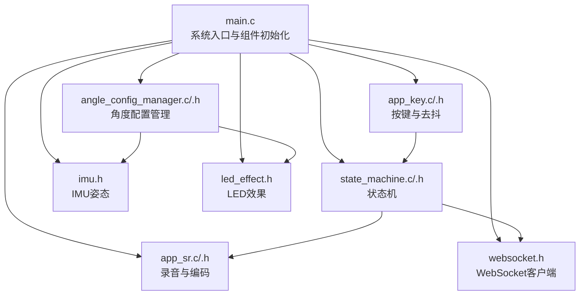
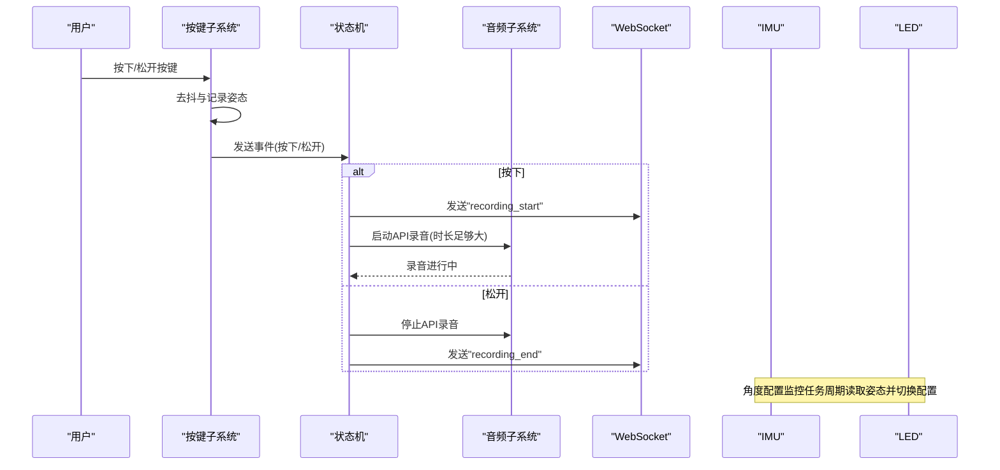
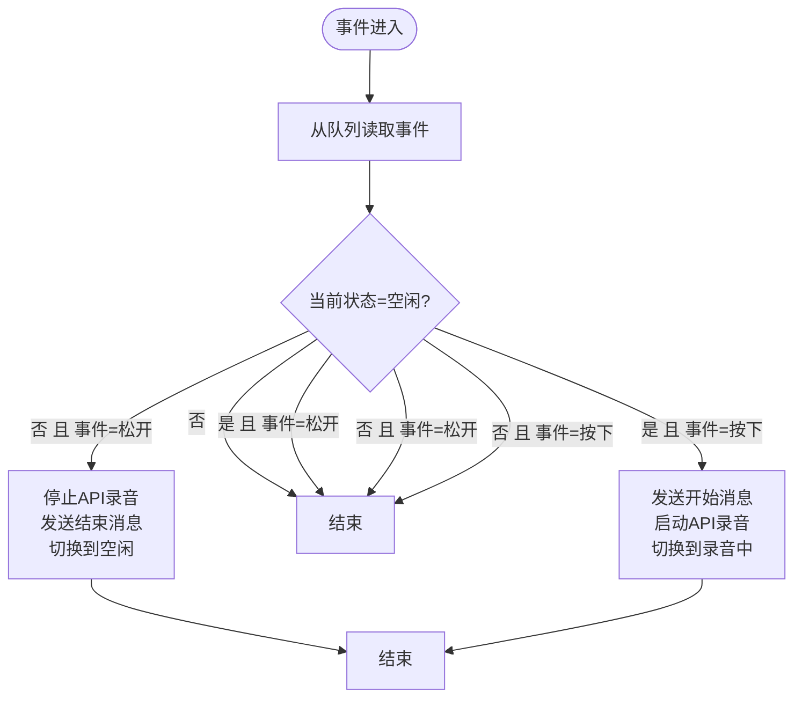
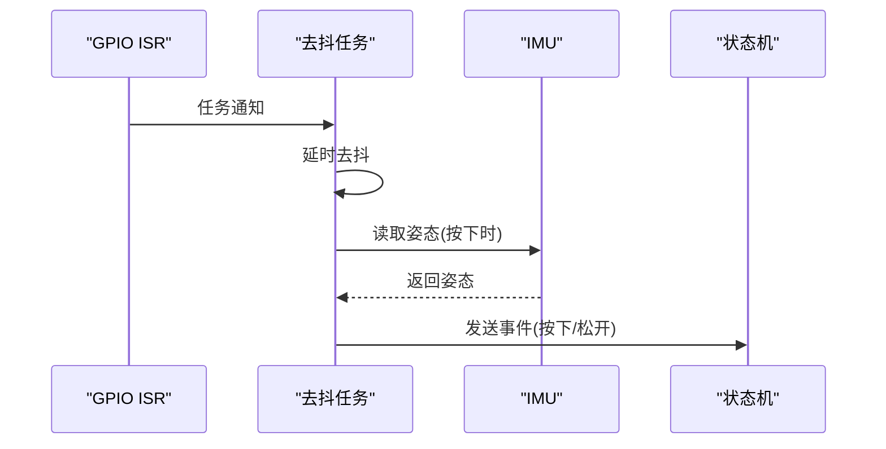
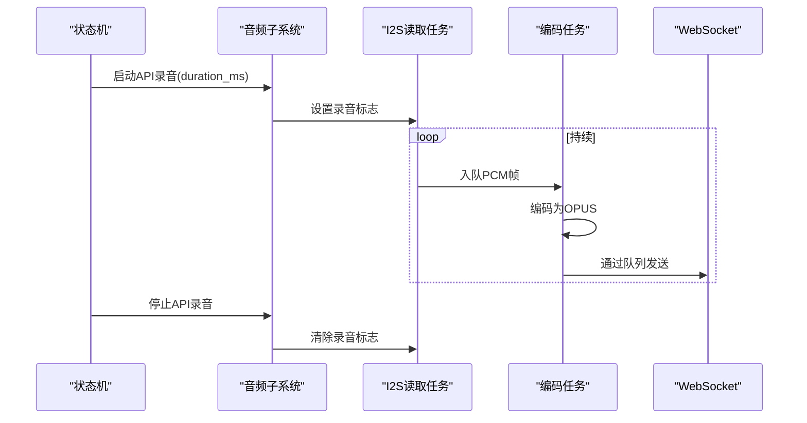
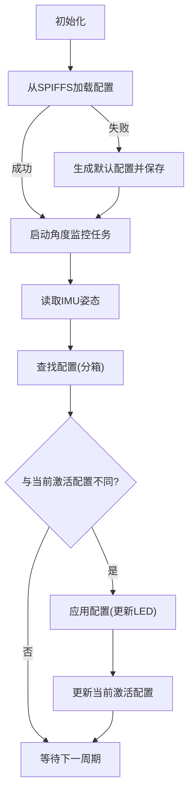
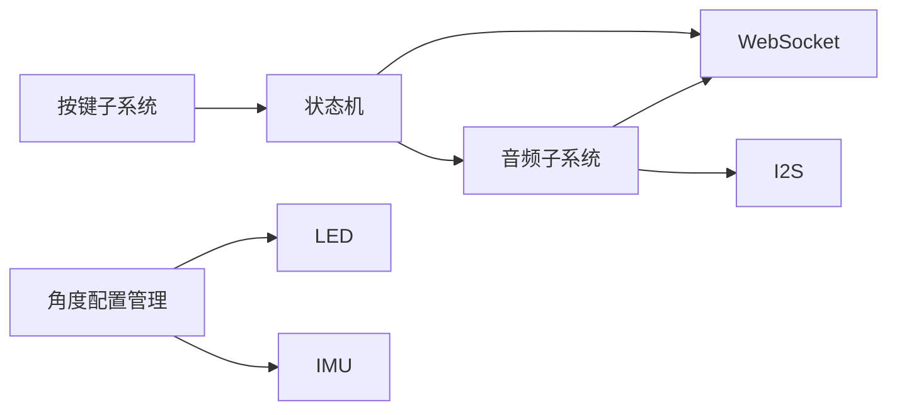

# 状态管理 API

<cite>
**本文引用的文件**
- [main.c](file://main/main.c)
- [state_machine.h](file://main/app/state_machine/state_machine.h)
- [state_machine.c](file://main/app/state_machine/state_machine.c)
- [app_key.h](file://main/app/key/app_key.h)
- [app_key.c](file://main/app/key/app_key.c)
- [app_sr.h](file://main/app/audio/app_sr.h)
- [app_sr.c](file://main/app/audio/app_sr.c)
- [websocket.h](file://main/app/websocket/websocket.h)
- [imu.h](file://main/app/imu/imu.h)
- [led_effect.h](file://main/app/led_strip/led_effect.h)
- [angle_config_manager.h](file://main/app/angle/angle_config_manager.h)
- [angle_config_manager.c](file://main/app/angle/angle_config_manager.c)
- [audio.h](file://main/app/audio/audio.h)
- [audio.c](file://main/app/audio/audio.c)
</cite>

## 目录
1. [简介](#简介)
2. [项目结构](#项目结构)
3. [核心组件](#核心组件)
4. [架构总览](#架构总览)
5. [详细组件分析](#详细组件分析)
6. [依赖关系分析](#依赖关系分析)
7. [性能考量](#性能考量)
8. [故障排查指南](#故障排查指南)
9. [结论](#结论)
10. [附录](#附录)

## 简介
本文件面向“状态管理 API”的使用者与维护者，系统性梳理状态机事件处理、状态转换与回调接口；说明状态定义、事件类型与转换条件的配置方法；介绍角度配置管理的参数设置、配置加载与动态更新接口；提供状态查询、事件发送与异步处理的具体实现示例；展示状态持久化、配置备份与恢复机制的使用方法；并说明线程安全的状态访问与并发控制策略。文档以仓库现有代码为依据，结合调用关系与数据流进行深入分析。

## 项目结构
本项目采用模块化组织，状态管理相关的关键模块包括：
- 状态机：负责按键事件驱动的状态流转与异步处理
- 按键子系统：按键去抖、事件上报与IMU角度记录
- 音频子系统：录音启停、编码与WebSocket传输
- 角度配置管理：基于IMU姿态的灯光配置映射与热更新
- WebSocket：与远端通信的连接、发送与回调注册
- IMU与LED：姿态读取与灯光效果应用

图表来源
- [main.c:33-60](file://main/main.c#L33-L60)
- [state_machine.c:24-35](file://main/app/state_machine/state_machine.c#L24-L35)
- [app_key.c:72-104](file://main/app/key/app_key.c#L72-L104)
- [app_sr.c:56-74](file://main/app/audio/app_sr.c#L56-L74)
- [angle_config_manager.c:195-204](file://main/app/angle/angle_config_manager.c#L195-L204)
- [websocket.h:57-107](file://main/app/websocket/websocket.h#L57-L107)
- [imu.h:10-13](file://main/app/imu/imu.h#L10-L13)
- [led_effect.h:6-8](file://main/app/led_strip/led_effect.h#L6-L8)

章节来源
- [main.c:33-60](file://main/main.c#L33-L60)

## 核心组件
- 状态机
  - 事件类型：按键按下、按键松开
  - 状态：空闲、录音中
  - 功能：事件入队、状态切换、录音启停、WebSocket消息发送
- 按键子系统
  - 事件来源：GPIO中断+去抖任务
  - 行为：记录按键时的姿态，发送对应事件
- 音频子系统
  - API录音：由状态机触发，支持手动停止
  - I2S读取与编码：后台任务持续采集并入队
- 角度配置管理
  - 配置加载/保存：SPIFFS JSON文件
  - 角度分箱：俯仰/横滚二维离散化
  - 动态更新：监控任务按当前姿态切换配置
- WebSocket
  - 连接、发送文本/二进制、状态回调、数据回调
- IMU与LED
  - 姿态读取、灯光配置应用

章节来源
- [state_machine.h:6-17](file://main/app/state_machine/state_machine.h#L6-L17)
- [state_machine.c:83-115](file://main/app/state_machine/state_machine.c#L83-L115)
- [app_key.c:22-70](file://main/app/key/app_key.c#L22-L70)
- [app_sr.h:32-49](file://main/app/audio/app_sr.h#L32-L49)
- [app_sr.c:76-99](file://main/app/audio/app_sr.c#L76-L99)
- [angle_config_manager.h:6-18](file://main/app/angle/angle_config_manager.h#L6-L18)
- [angle_config_manager.c:44-93](file://main/app/angle/angle_config_manager.c#L44-L93)
- [websocket.h:37-107](file://main/app/websocket/websocket.h#L37-L107)
- [imu.h:10-13](file://main/app/imu/imu.h#L10-L13)
- [led_effect.h:6-8](file://main/app/led_strip/led_effect.h#L6-L8)

## 架构总览
下图展示了从按键到状态机、再到录音与网络交互的整体流程，以及角度配置的动态更新路径。

图表来源
- [app_key.c:56-66](file://main/app/key/app_key.c#L56-L66)
- [state_machine.c:59-81](file://main/app/state_machine/state_machine.c#L59-L81)
- [state_machine.c:83-115](file://main/app/state_machine/state_machine.c#L83-L115)
- [app_sr.c:76-94](file://main/app/audio/app_sr.c#L76-L94)
- [websocket.h:57-84](file://main/app/websocket/websocket.h#L57-L84)
- [angle_config_manager.c:177-193](file://main/app/angle/angle_config_manager.c#L177-L193)

## 详细组件分析

### 状态机组件
- 事件类型与状态
  - 事件：按键按下、按键松开
  - 状态：空闲、录音中
- 转换规则
  - 空闲 + 按下 → 录音中（发送开始消息、启动录音、切换状态）
  - 录音中 + 松开 → 空闲（停止录音、发送结束消息、切换状态）
- 异步处理
  - 使用队列接收事件，任务循环处理，保证线程安全
  - 通过回调函数发送WebSocket消息，避免阻塞状态机任务
- 关键接口
  - 初始化：创建事件队列与状态机任务
  - 发送事件：将事件投递至队列
  - 查询状态：返回当前状态（供调试）

图表来源
- [state_machine.c:83-115](file://main/app/state_machine/state_machine.c#L83-L115)

章节来源
- [state_machine.h:6-32](file://main/app/state_machine/state_machine.h#L6-L32)
- [state_machine.c:24-47](file://main/app/state_machine/state_machine.c#L24-L47)
- [state_machine.c:83-115](file://main/app/state_machine/state_machine.c#L83-L115)

### 按键子系统
- 功能要点
  - GPIO中断触发+任务通知，避免阻塞ISR
  - 去抖延时与电平检测，稳定按键状态
  - 按下时记录当前IMU姿态，便于后续配置绑定
  - 将事件转发给状态机
- 并发与线程安全
  - ISR仅做通知，不进行耗时操作
  - 去抖任务负责状态判断与事件发送

图表来源
- [app_key.c:22-70](file://main/app/key/app_key.c#L22-L70)
- [app_key.c:56-66](file://main/app/key/app_key.c#L56-L66)
- [imu.h:10-13](file://main/app/imu/imu.h#L10-L13)

章节来源
- [app_key.h:1-1](file://main/app/key/app_key.h#L1-L1)
- [app_key.c:72-104](file://main/app/key/app_key.c#L72-L104)
- [app_key.c:22-70](file://main/app/key/app_key.c#L22-L70)

### 音频子系统（录音与编码）
- API录音
  - 启动：设置录音标志，I2S读取任务持续将PCM帧入队
  - 停止：清除录音标志，不再入队
  - 查询：返回是否处于API录音状态
- 编码与传输
  - I2S读取任务持续运行，按帧大小读取并入队
  - 编码任务从队列取帧，编码后写入环形缓冲区，供WebSocket发送

图表来源
- [app_sr.c:22-54](file://main/app/audio/app_sr.c#L22-L54)
- [app_sr.c:76-99](file://main/app/audio/app_sr.c#L76-L99)
- [audio.c:699-800](file://main/app/audio/audio.c#L699-L800)

章节来源
- [app_sr.h:32-49](file://main/app/audio/app_sr.h#L32-L49)
- [app_sr.c:56-99](file://main/app/audio/app_sr.c#L56-L99)
- [audio.c:699-800](file://main/app/audio/audio.c#L699-L800)

### 角度配置管理
- 配置模型
  - 默认配置与区域配置矩阵：按俯仰/横滚分箱存储
  - 当前激活配置：用于检测变更并触发更新
- 生命周期
  - 初始化：尝试从SPIFFS加载配置，失败则生成默认配置并保存
  - 监控任务：周期读取IMU姿态，查找对应配置，若变更则应用并更新当前激活配置
- 动态更新
  - 保存接口：按当前姿态更新配置并落盘，若当前姿态匹配则立即应用
  - 读取接口：按当前姿态或默认配置返回JSON字符串

图表来源
- [angle_config_manager.c:44-93](file://main/app/angle/angle_config_manager.c#L44-L93)
- [angle_config_manager.c:177-193](file://main/app/angle/angle_config_manager.c#L177-L193)
- [angle_config_manager.c:162-175](file://main/app/angle/angle_config_manager.c#L162-L175)

章节来源
- [angle_config_manager.h:6-18](file://main/app/angle/angle_config_manager.h#L6-L18)
- [angle_config_manager.c:195-204](file://main/app/angle/angle_config_manager.c#L195-L204)
- [angle_config_manager.c:44-93](file://main/app/angle/angle_config_manager.c#L44-L93)
- [angle_config_manager.c:162-175](file://main/app/angle/angle_config_manager.c#L162-L175)

### WebSocket 接口
- 连接与状态
  - 启动/停止连接、检查连接状态
  - 状态变化回调：连接、断开、重连、错误
- 数据收发
  - 发送文本/二进制数据
  - 数据回调注册：接收远端消息
- 在状态机中的应用
  - 录音开始/结束消息通过该接口发送

章节来源
- [websocket.h:37-107](file://main/app/websocket/websocket.h#L37-L107)
- [state_machine.c:59-81](file://main/app/state_machine/state_machine.c#L59-L81)

### IMU 与 LED
- IMU
  - 初始化与启动任务，提供姿态读取接口
- LED
  - 初始化、暂停控制、从JSON配置更新效果

章节来源
- [imu.h:10-13](file://main/app/imu/imu.h#L10-L13)
- [led_effect.h:6-8](file://main/app/led_strip/led_effect.h#L6-L8)

## 依赖关系分析
- 组件耦合
  - 状态机依赖按键事件、音频子系统与WebSocket
  - 角度配置管理依赖IMU与LED
  - 音频子系统依赖I2S与WebSocket队列
- 并发与同步
  - 事件通过队列传递，避免直接共享内存
  - 配置更新通过互斥量保护共享缓冲区
  - ISR仅做轻量通知，避免阻塞

图表来源
- [main.c:33-60](file://main/main.c#L33-L60)
- [state_machine.c:37-42](file://main/app/state_machine/state_machine.c#L37-L42)
- [app_key.c:62-66](file://main/app/key/app_key.c#L62-L66)
- [angle_config_manager.c:167-174](file://main/app/angle/angle_config_manager.c#L167-L174)

## 性能考量
- 事件处理
  - 队列深度与任务栈大小适配事件频率，避免阻塞
- 音频路径
  - I2S读取与编码分离，减少相互影响
  - 环形缓冲区与互斥量保护，避免数据竞争
- 角度监控
  - 100ms周期读取，兼顾实时性与功耗
- SPIFFS IO
  - 配置保存采用一次性写入，降低碎片化风险

## 故障排查指南
- 状态机无法响应按键
  - 检查按键初始化与ISR注册是否完成
  - 确认去抖任务已创建且优先级足够高
- 录音未启动/停止异常
  - 确认API录音接口被正确调用与停止
  - 检查I2S读取任务是否运行
- WebSocket消息未发送
  - 检查连接状态与发送接口返回值
  - 确认状态机在对应事件中调用了发送函数
- 配置未生效
  - 检查当前姿态是否落在目标分箱
  - 确认SPIFFS文件存在且JSON格式正确
- 线程死锁或数据竞争
  - 检查互斥量获取/释放是否成对出现
  - 确认ISR中未执行耗时操作

章节来源
- [app_key.c:72-104](file://main/app/key/app_key.c#L72-L104)
- [app_sr.c:76-99](file://main/app/audio/app_sr.c#L76-L99)
- [websocket.h:57-84](file://main/app/websocket/websocket.h#L57-L84)
- [angle_config_manager.c:195-204](file://main/app/angle/angle_config_manager.c#L195-L204)
- [audio.c:325-354](file://main/app/audio/audio.c#L325-L354)

## 结论
本状态管理系统以事件驱动为核心，通过按键事件触发状态机，进而协调录音与网络交互，并结合角度配置管理实现基于IMU姿态的灯光动态切换。系统采用队列与任务分离的设计，配合互斥量与SPIFFS持久化，满足嵌入式平台的实时性与可靠性需求。建议在生产环境中进一步完善日志分级、错误回退与配置校验机制。

## 附录

### API 一览与使用示例（路径指引）
- 状态机
  - 初始化：[state_machine_init:24-35](file://main/app/state_machine/state_machine.c#L24-L35)
  - 发送事件：[state_machine_send_event:37-42](file://main/app/state_machine/state_machine.c#L37-L42)
  - 查询状态：[state_machine_get_current_state:44-47](file://main/app/state_machine/state_machine.c#L44-L47)
- 按键
  - 初始化：[button_init:72-104](file://main/app/key/app_key.c#L72-L104)
  - 获取最后记录角度：[button_get_last_recorded_angle:113-117](file://main/app/key/app_key.c#L113-L117)
- 音频（API录音）
  - 启动：[app_sr_start_api_recording:76-84](file://main/app/audio/app_sr.c#L76-L84)
  - 停止：[app_sr_stop_api_recording:86-94](file://main/app/audio/app_sr.c#L86-L94)
  - 查询：[app_sr_is_api_recording:96-99](file://main/app/audio/app_sr.c#L96-L99)
- 角度配置管理
  - 初始化：[angle_config_manager_init:195-204](file://main/app/angle/angle_config_manager.c#L195-L204)
  - 保存配置：[angle_config_save_for_angle:162-175](file://main/app/angle/angle_config_manager.c#L162-L175)
- WebSocket
  - 启动/停止/发送/状态检查：[ws_start/ws_stop/ws_send_text/ws_is_connected:57-84](file://main/app/websocket/websocket.h#L57-L84)
  - 回调注册：[ws_register_data_handler/ws_register_state_handler:89-96](file://main/app/websocket/websocket.h#L89-L96)
- IMU/LED
  - IMU：[imu_init/imu_start_task/imu_get_angles:10-13](file://main/app/imu/imu.h#L10-L13)
  - LED：[led_init/led_set_paused/led_update_config_from_json:6-8](file://main/app/led_strip/led_effect.h#L6-L8)