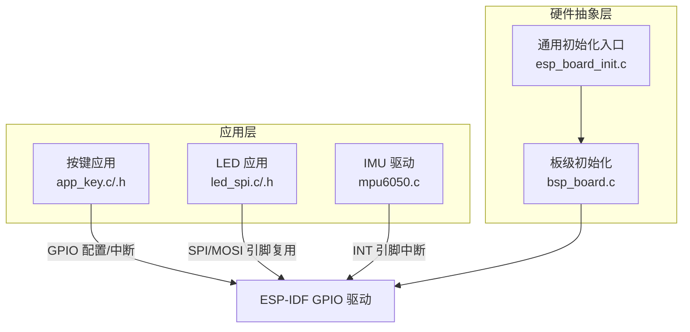
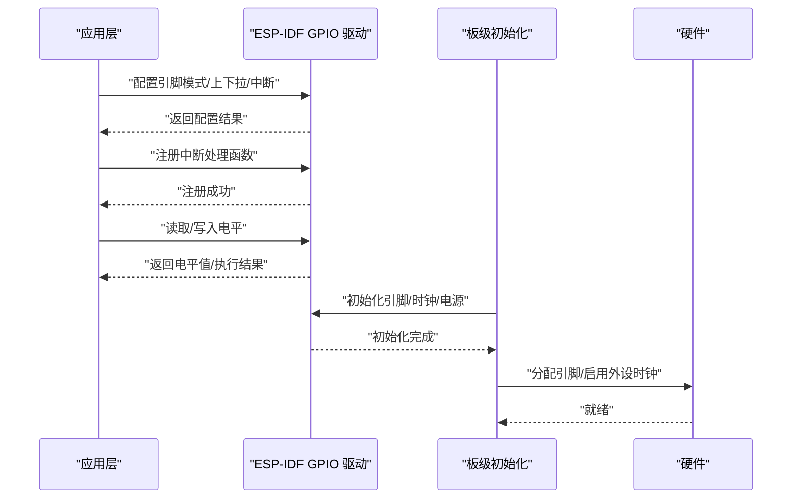
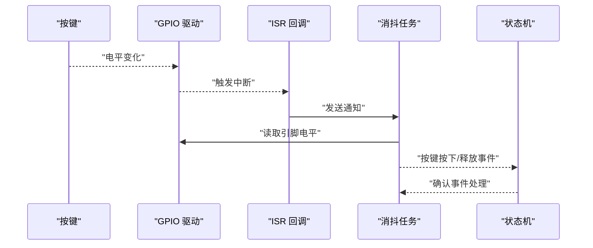
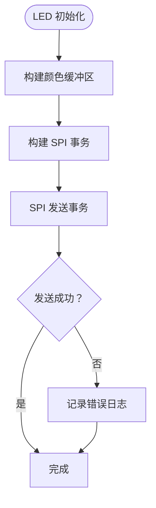
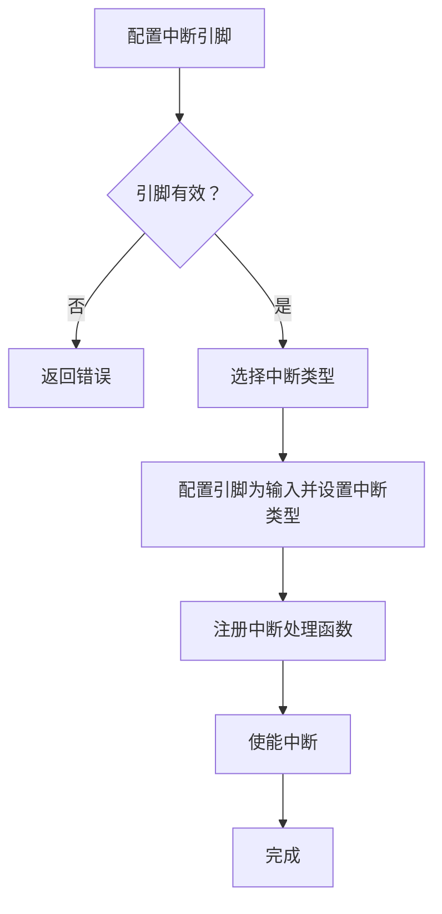
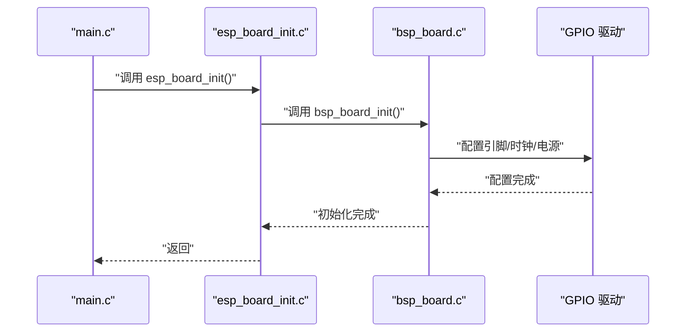
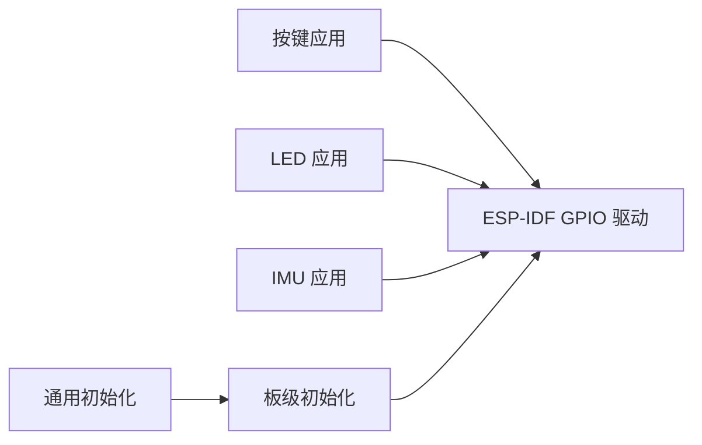

# GPIO 控制 API

<cite>
**本文引用的文件**
- [main/app/key/app_key.c](file://main/app/key/app_key.c)
- [main/app/key/app_key.h](file://main/app/key/app_key.h)
- [main/app/led_strip/led_spi.h](file://main/app/led_strip/led_spi.h)
- [main/app/led_strip/led_spi.c](file://main/app/led_strip/led_spi.c)
- [components/IMU/drivers/mpu6050/mpu6050.c](file://components/IMU/drivers/mpu6050/mpu6050.c)
- [components/hardware_driver/boards/esp32-s3/bsp_board.c](file://components/hardware_driver/boards/esp32-s3/bsp_board.c)
- [components/hardware_driver/esp_board_init.c](file://components/hardware_driver/esp_board_init.c)
- [components/hardware_driver/boards/include/bsp_board.h](file://components/hardware_driver/boards/include/bsp_board.h)
- [components/hardware_driver/include/esp_board_init.h](file://components/hardware_driver/include/esp_board_init.h)
- [main/main.c](file://main/main.c)
</cite>

## 目录
1. [简介](#简介)
2. [项目结构](#项目结构)
3. [核心组件](#核心组件)
4. [架构总览](#架构总览)
5. [详细组件分析](#详细组件分析)
6. [依赖关系分析](#依赖关系分析)
7. [性能考虑](#性能考虑)
8. [故障排查指南](#故障排查指南)
9. [结论](#结论)
10. [附录](#附录)

## 简介
本文件面向 GPIO 控制 API 的使用与实现，聚焦于以下方面：
- 引脚初始化、输入输出配置与电平控制
- 引脚编号定义、模式设置与中断配置接口
- 复用功能、时钟配置与电源管理的实现细节
- 配置示例、引脚冲突避免与硬件保护机制
- 不同硬件平台（以 ESP32-S3 为例）的正确配置与最佳实践

## 项目结构
本项目的 GPIO 使用主要分布在如下模块：
- 按键输入与中断处理：按键初始化、消抖与事件上报
- LED 控制：通过 SPI 复用引脚输出 LED 数据
- IMU 中断：MPU6050 中断引脚配置与 ISR 注册
- 板级初始化：统一的硬件平台初始化入口

图表来源
- [main/app/key/app_key.c:72-104](file://main/app/key/app_key.c#L72-L104)
- [main/app/led_strip/led_spi.h:1-28](file://main/app/led_strip/led_spi.h#L1-L28)
- [components/IMU/drivers/mpu6050/mpu6050.c:215-293](file://components/IMU/drivers/mpu6050/mpu6050.c#L215-L293)
- [components/hardware_driver/boards/esp32-s3/bsp_board.c:168-90](file://components/hardware_driver/boards/esp32-s3/bsp_board.c#L168-L90)
- [components/hardware_driver/esp_board_init.c:29-31](file://components/hardware_driver/esp_board_init.c#L29-L31)

章节来源
- [main/app/key/app_key.c:1-117](file://main/app/key/app_key.c#L1-L117)
- [main/app/led_strip/led_spi.h:1-28](file://main/app/led_strip/led_spi.h#L1-L28)
- [components/IMU/drivers/mpu6050/mpu6050.c:215-293](file://components/IMU/drivers/mpu6050/mpu6050.c#L215-L293)
- [components/hardware_driver/boards/esp32-s3/bsp_board.c:168-90](file://components/hardware_driver/boards/esp32-s3/bsp_board.c#L168-L90)
- [components/hardware_driver/esp_board_init.c:29-31](file://components/hardware_driver/esp_board_init.c#L29-L31)

## 核心组件
- 按键输入与中断处理：提供按键初始化、消抖与事件上报能力，使用 ESP-IDF GPIO 驱动进行配置与 ISR 注册。
- LED 控制：通过 SPI 接口将 LED 数据经由 MOSI 引脚输出，实现 LED 灯带控制。
- IMU 中断：对 MPU6050 的中断引脚进行输入模式配置，并注册中断处理函数。
- 板级初始化：统一的硬件平台初始化入口，确保各外设引脚与时钟资源正确分配。

章节来源
- [main/app/key/app_key.c:72-104](file://main/app/key/app_key.c#L72-L104)
- [main/app/led_strip/led_spi.h:1-28](file://main/app/led_strip/led_spi.h#L1-L28)
- [components/IMU/drivers/mpu6050/mpu6050.c:215-293](file://components/IMU/drivers/mpu6050/mpu6050.c#L215-L293)
- [components/hardware_driver/esp_board_init.c:29-31](file://components/hardware_driver/esp_board_init.c#L29-L31)

## 架构总览
GPIO 控制在本项目中遵循“应用层 → HAL 层 → 板级初始化”的分层设计：
- 应用层负责具体业务逻辑（按键、LED、IMU），通过 ESP-IDF GPIO 接口完成引脚配置与中断管理。
- HAL 层封装底层硬件差异，提供统一的 GPIO 配置与复用能力。
- 板级初始化负责在启动阶段完成引脚分配、时钟与电源管理，避免引脚冲突并保证系统稳定性。

图表来源
- [main/app/key/app_key.c:72-104](file://main/app/key/app_key.c#L72-L104)
- [components/hardware_driver/boards/esp32-s3/bsp_board.c:168-90](file://components/hardware_driver/boards/esp32-s3/bsp_board.c#L168-L90)

## 详细组件分析

### 按键输入与中断处理（GPIO 输入 + ISR）
- 引脚编号与模式：使用常量定义按键引脚编号，配置为输入模式并启用内部上拉电阻；支持双边沿触发中断。
- 中断处理：安装全局 ISR 服务，注册中断回调，采用通知机制唤醒消抖任务；在消抖任务中读取电平并上报事件。
- 消抖策略：在任务中对中断信号进行去抖处理，避免机械按键抖动导致的误触发。
- 电平控制：通过读取引脚电平判断按键状态变化，记录角度信息并发送状态机事件。

图表来源
- [main/app/key/app_key.c:22-104](file://main/app/key/app_key.c#L22-L104)

章节来源
- [main/app/key/app_key.c:1-117](file://main/app/key/app_key.c#L1-L117)
- [main/app/key/app_key.h:1-1](file://main/app/key/app_key.h#L1-L1)

### LED 控制（GPIO 复用为 SPI MOSI）
- 引脚编号：LED 数据线复用为 SPI 的 MOSI 引脚，通过宏定义集中管理。
- 初始化：应用层提供 LED 初始化接口，内部完成 SPI 设备与缓冲区准备。
- 数据传输：构建 SPI 事务，将颜色缓冲区数据通过 SPI 发送至 LED 灯带。
- 清屏与获取缓冲：提供清屏与获取内部缓冲区指针的接口，便于批量更新与调试。

图表来源
- [main/app/led_strip/led_spi.c:80-92](file://main/app/led_strip/led_spi.c#L80-L92)
- [main/app/led_strip/led_spi.h:1-28](file://main/app/led_strip/led_spi.h#L1-L28)

章节来源
- [main/app/led_strip/led_spi.h:1-28](file://main/app/led_strip/led_spi.h#L1-L28)
- [main/app/led_strip/led_spi.c:75-103](file://main/app/led_strip/led_spi.c#L75-L103)

### IMU 中断（GPIO 输入 + ISR 注册）
- 引脚有效性检查：在用户配置中断引脚时，先验证引脚是否有效。
- 中断类型选择：根据配置选择上升沿或下降沿触发。
- 配置与注册：配置引脚为输入模式并设置中断类型，随后注册中断处理函数并使能中断。
- 电平控制：通过读取引脚电平辅助判断中断源或进行调试。

图表来源
- [components/IMU/drivers/mpu6050/mpu6050.c:215-293](file://components/IMU/drivers/mpu6050/mpu6050.c#L215-L293)

章节来源
- [components/IMU/drivers/mpu6050/mpu6050.c:215-293](file://components/IMU/drivers/mpu6050/mpu6050.c#L215-L293)

### 板级初始化（GPIO 时钟/电源与引脚分配）
- 统一入口：提供通用初始化函数，内部调用板级初始化函数。
- 板级实现：在板级初始化中完成引脚分配、时钟启用与电源管理，确保外设正常工作。
- 启动集成：主程序在启动阶段调用通用初始化函数，确保 GPIO 与其他外设在系统早期即处于正确状态。

图表来源
- [main/main.c:38-38](file://main/main.c#L38-L38)
- [components/hardware_driver/esp_board_init.c:29-31](file://components/hardware_driver/esp_board_init.c#L29-L31)
- [components/hardware_driver/boards/esp32-s3/bsp_board.c:168-90](file://components/hardware_driver/boards/esp32-s3/bsp_board.c#L168-L90)
- [components/hardware_driver/boards/include/bsp_board.h:23-23](file://components/hardware_driver/boards/include/bsp_board.h#L23-L23)
- [components/hardware_driver/include/esp_board_init.h:6-6](file://components/hardware_driver/include/esp_board_init.h#L6-L6)

章节来源
- [main/main.c:38-38](file://main/main.c#L38-L38)
- [components/hardware_driver/esp_board_init.c:29-31](file://components/hardware_driver/esp_board_init.c#L29-L31)
- [components/hardware_driver/boards/esp32-s3/bsp_board.c:168-90](file://components/hardware_driver/boards/esp32-s3/bsp_board.c#L168-L90)
- [components/hardware_driver/boards/include/bsp_board.h:23-23](file://components/hardware_driver/boards/include/bsp_board.h#L23-L23)
- [components/hardware_driver/include/esp_board_init.h:6-6](file://components/hardware_driver/include/esp_board_init.h#L6-L6)

## 依赖关系分析
- 应用层依赖 ESP-IDF GPIO 驱动进行引脚配置与中断管理。
- LED 应用依赖 SPI 主机接口，同时复用 MOSI 引脚。
- IMU 应用依赖 GPIO 驱动进行中断引脚配置与 ISR 注册。
- 板级初始化统一协调 GPIO、时钟与电源，避免引脚冲突。

图表来源
- [main/app/key/app_key.c:72-104](file://main/app/key/app_key.c#L72-L104)
- [main/app/led_strip/led_spi.c:80-92](file://main/app/led_strip/led_spi.c#L80-L92)
- [components/IMU/drivers/mpu6050/mpu6050.c:215-293](file://components/IMU/drivers/mpu6050/mpu6050.c#L215-L293)
- [components/hardware_driver/esp_board_init.c:29-31](file://components/hardware_driver/esp_board_init.c#L29-L31)

章节来源
- [main/app/key/app_key.c:72-104](file://main/app/key/app_key.c#L72-L104)
- [main/app/led_strip/led_spi.c:80-92](file://main/app/led_strip/led_spi.c#L80-L92)
- [components/IMU/drivers/mpu6050/mpu6050.c:215-293](file://components/IMU/drivers/mpu6050/mpu6050.c#L215-L293)
- [components/hardware_driver/esp_board_init.c:29-31](file://components/hardware_driver/esp_board_init.c#L29-L31)

## 性能考虑
- 中断处理：ISR 中仅做轻量处理（发送通知），耗时逻辑放入任务中执行，降低中断延迟。
- 消抖策略：在任务中进行去抖，避免在 ISR 中进行复杂计算。
- SPI 写入：批量更新 LED 缓冲区后再一次性传输，减少 SPI 事务次数。
- 引脚复用：合理规划引脚用途，避免同一引脚被多个外设同时使用造成冲突。

## 故障排查指南
- 按键无响应
  - 检查引脚配置是否为输入模式并启用上拉电阻。
  - 确认中断已安装且回调已注册，且未被重复安装。
  - 查看消抖任务是否正常运行，确认通知机制有效。
- LED 不亮
  - 检查 LED 初始化是否完成，SPI 事务参数是否正确。
  - 确认引脚复用为 MOSI，且 SPI 时钟与极性配置符合 LED 驱动要求。
- IMU 中断异常
  - 确认中断引脚有效且配置为输入模式。
  - 检查中断类型选择是否与硬件连接一致（上升沿/下降沿）。
  - 确认中断已使能且 ISR 已注册。
- 引脚冲突
  - 在板级初始化阶段统一规划引脚分配，避免多个外设共享同一引脚。
  - 使用 SDK 配置选项与引脚保留机制，减少冲突风险。

章节来源
- [main/app/key/app_key.c:72-104](file://main/app/key/app_key.c#L72-L104)
- [main/app/led_strip/led_spi.c:80-92](file://main/app/led_strip/led_spi.c#L80-L92)
- [components/IMU/drivers/mpu6050/mpu6050.c:215-293](file://components/IMU/drivers/mpu6050/mpu6050.c#L215-L293)
- [components/hardware_driver/boards/esp32-s3/bsp_board.c:168-90](file://components/hardware_driver/boards/esp32-s3/bsp_board.c#L168-L90)

## 结论
本项目通过清晰的分层设计与统一的板级初始化，实现了 GPIO 引脚的可靠配置与管理。按键、LED 与 IMU 等外设均基于 ESP-IDF GPIO 驱动进行标准化接入，具备良好的可维护性与可移植性。建议在实际部署中严格遵循引脚分配与复用策略，结合中断与消抖机制，确保系统的稳定性与实时性。

## 附录
- 引脚编号定义
  - 按键引脚编号：在按键应用中以常量形式定义，便于集中管理与修改。
  - LED 引脚编号：通过宏定义集中声明，便于跨模块引用。
- 模式设置与中断配置
  - 输入模式 + 上拉电阻：适用于按键与 IMU 中断引脚。
  - 双边沿触发：按键应用采用双边沿触发以捕获电平变化。
- 复用功能与时钟配置
  - LED 数据线复用为 SPI MOSI 引脚，需确保 SPI 时钟与极性配置正确。
  - 板级初始化负责引脚分配与外设时钟启用，避免冲突。
- 电源管理
  - 在板级初始化中完成电源与时钟配置，确保外设在系统早期即处于可用状态。

章节来源
- [main/app/key/app_key.c:10-12](file://main/app/key/app_key.c#L10-L12)
- [main/app/led_strip/led_spi.h:7-9](file://main/app/led_strip/led_spi.h#L7-L9)
- [components/hardware_driver/boards/esp32-s3/bsp_board.c:168-90](file://components/hardware_driver/boards/esp32-s3/bsp_board.c#L168-L90)