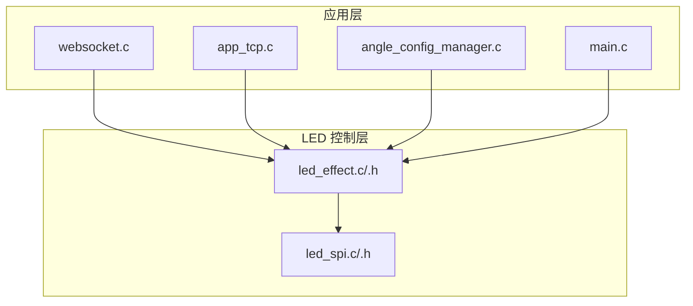
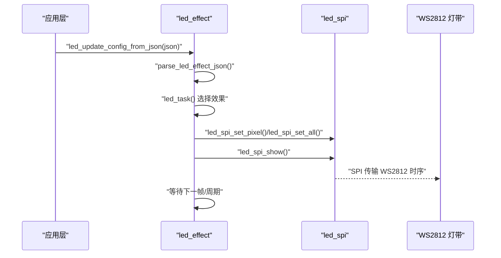
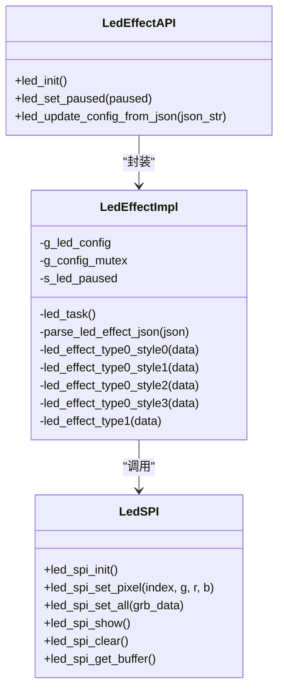
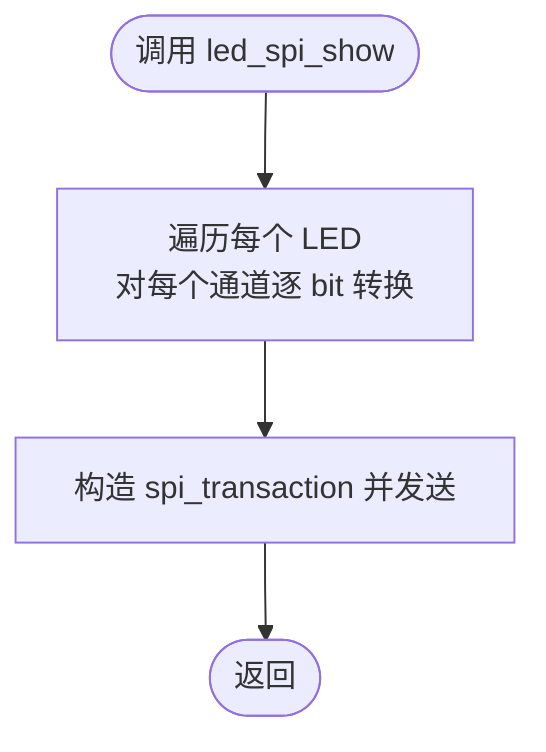
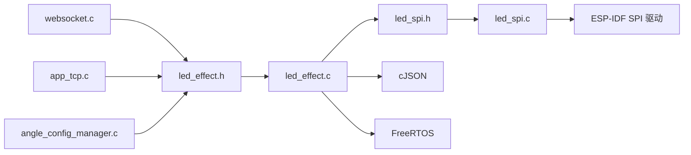

# LED 控制 API

<cite>
**本文引用的文件**
- [main.c](file://main/main.c)
- [led_effect.h](file://main/app/led_strip/led_effect.h)
- [led_effect.c](file://main/app/led_strip/led_effect.c)
- [led_spi.h](file://main/app/led_strip/led_spi.h)
- [led_spi.c](file://main/app/led_strip/led_spi.c)
- [websocket.c](file://main/app/websocket/websocket.c)
- [app_tcp.c](file://main/app/tcp/app_tcp.c)
- [angle_config_manager.c](file://main/app/angle/angle_config_manager.c)
</cite>

## 目录
1. [简介](#简介)
2. [项目结构](#项目结构)
3. [核心组件](#核心组件)
4. [架构总览](#架构总览)
5. [详细组件分析](#详细组件分析)
6. [依赖关系分析](#依赖关系分析)
7. [性能考量](#性能考量)
8. [故障排查指南](#故障排查指南)
9. [结论](#结论)
10. [附录](#附录)

## 简介
本文件为 LED 控制相关 API 的技术文档，覆盖 LED 初始化、效果配置、颜色设置与动画参数管理。文档详细说明 LED 效果类型与样式、RGB 颜色配置、亮度调节与刷新频率控制，并给出 LED 配置文件解析、SPI 通信接口及硬件驱动实现的说明。同时提供实际使用示例，展示如何创建自定义 LED 效果、批量更新 LED 状态以及处理 LED 故障情况。

## 项目结构
LED 控制功能位于 main/app/led_strip 目录下，主要由以下模块组成：
- led_effect.c/.h：LED 效果调度与解析，负责接收 JSON 配置、解析参数、选择并执行具体效果。
- led_spi.c/.h：底层 SPI 驱动，负责将颜色缓冲区转换为 WS2812 时序并通过 SPI 发送。

此外，多个上层模块通过调用 LED API 来实现 LED 效果控制：
- websocket.c：WebSocket 接收客户端指令并更新 LED 配置。
- app_tcp.c：TCP 接收网络指令并更新 LED 配置。
- angle_config_manager.c：角度配置变更时触发 LED 效果更新。
- main/main.c：系统启动时初始化 LED 子系统。

图表来源
- [led_effect.c:397-441](file://main/app/led_strip/led_effect.c#L397-L441)
- [led_spi.c:36-66](file://main/app/led_strip/led_spi.c#L36-L66)
- [websocket.c:231-245](file://main/app/websocket/websocket.c#L231-L245)
- [app_tcp.c](file://main/app/tcp/app_tcp.c#L218)
- [angle_config_manager.c](file://main/app/angle/angle_config_manager.c#L170)
- [main.c](file://main/main.c#L42)

章节来源
- [led_effect.h:1-10](file://main/app/led_strip/led_effect.h#L1-L10)
- [led_effect.c:1-441](file://main/app/led_strip/led_effect.c#L1-L441)
- [led_spi.h:1-28](file://main/app/led_strip/led_spi.h#L1-L28)
- [led_spi.c:1-103](file://main/app/led_strip/led_spi.c#L1-L103)
- [websocket.c:231-245](file://main/app/websocket/websocket.c#L231-L245)
- [app_tcp.c](file://main/app/tcp/app_tcp.c#L218)
- [angle_config_manager.c](file://main/app/angle/angle_config_manager.c#L170)
- [main.c](file://main/main.c#L42)

## 核心组件
- LED 效果调度器（led_effect）：提供初始化、暂停/恢复、从 JSON 更新配置等接口；内部维护全局配置、互斥量与任务句柄；根据 type/style 选择具体效果实现。
- LED SPI 驱动（led_spi）：提供像素级与批量写入、显示刷新、清屏、缓冲区访问等接口；内部完成 GRB 颜色缓冲到 WS2812 位时序的转换并通过 SPI 发送。

章节来源
- [led_effect.h:6-8](file://main/app/led_strip/led_effect.h#L6-L8)
- [led_effect.c:436-441](file://main/app/led_strip/led_effect.c#L436-L441)
- [led_spi.h:11-27](file://main/app/led_strip/led_spi.h#L11-L27)
- [led_spi.c:36-103](file://main/app/led_strip/led_spi.c#L36-L103)

## 架构总览
LED 控制采用“配置解析 + 效果调度 + SPI 驱动”的分层设计：
- 应用层通过 WebSocket/TCP/角度管理等入口下发 JSON 配置。
- led_effect 解析 JSON 并更新全局配置，触发效果切换。
- led_spi 将颜色数据转换为 WS2812 时序并通过 SPI 输出。
- 任务循环在后台持续执行当前效果，支持暂停与配置热更新。

图表来源
- [led_effect.c:69-81](file://main/app/led_strip/led_effect.c#L69-L81)
- [led_effect.c:84-122](file://main/app/led_strip/led_effect.c#L84-L122)
- [led_effect.c:397-434](file://main/app/led_strip/led_effect.c#L397-L434)
- [led_spi.c:68-92](file://main/app/led_strip/led_spi.c#L68-L92)

## 详细组件分析

### LED 效果 API
- 初始化
  - led_init：创建 LED 效果任务，初始化互斥量，启动默认配置与 SPI。
- 暂停/恢复
  - led_set_paused：设置暂停标志，任务进入空转等待。
- 配置更新
  - led_update_config_from_json：解析 JSON，更新全局配置并置位配置变更标志以中断当前效果。

JSON 配置字段说明（来自解析逻辑）：
- type：效果类型（整数），当前实现支持 0/1。
- data.duration：效果总时长（毫秒），决定周期与步进速度。
- data.cycles：循环次数，0 则使用默认值。
- data.color_st：起始颜色，数组 [R, G, B]。
- data.color_ed：结束颜色，数组 [R, G, B]。
- data.style：样式编号（整数），type=0 时支持 0/1/2/3；type=1 时支持 0/1。
- data.order：方向（0/1），影响流水方向。
- data.sum：中心区域宽度（像素），用于 type=1 的跑马灯。
- data.pram.surge_intensity：参数对象，不同效果含义不同（如抖动强度、拖尾长度、亮度百分比等）。

章节来源
- [led_effect.h:6-8](file://main/app/led_strip/led_effect.h#L6-L8)
- [led_effect.c:64-81](file://main/app/led_strip/led_effect.c#L64-L81)
- [led_effect.c:84-122](file://main/app/led_strip/led_effect.c#L84-L122)

#### 类型与样式说明
- type=0：多样式效果集合
  - style=0：两色瞬变闪烁（无过渡）
  - style=1：活泼跳变（随机抖动）
  - style=2：奇幻波浪（流水灯/拖尾）
  - style=3：科技脉冲（高频爆闪）
- type=1：流水跑马灯
  - style=0：纯色背景流动
  - style=1：保留端部的跑马灯

章节来源
- [led_effect.c:125-150](file://main/app/led_strip/led_effect.c#L125-L150)
- [led_effect.c:152-194](file://main/app/led_strip/led_effect.c#L152-L194)
- [led_effect.c:196-239](file://main/app/led_strip/led_effect.c#L196-L239)
- [led_effect.c:241-292](file://main/app/led_strip/led_effect.c#L241-L292)
- [led_effect.c:294-395](file://main/app/led_strip/led_effect.c#L294-L395)

#### 效果实现类图

图表来源
- [led_effect.h:6-8](file://main/app/led_strip/led_effect.h#L6-L8)
- [led_effect.c:436-441](file://main/app/led_strip/led_effect.c#L436-L441)
- [led_spi.h:11-27](file://main/app/led_strip/led_spi.h#L11-L27)

### LED SPI 通信接口
- led_spi_init：分配 DMA 内存，初始化 SPI2，配置 MOSI 引脚与时钟。
- led_spi_set_pixel：设置指定索引的像素颜色（GRB 顺序）。
- led_spi_set_all：批量设置全部像素颜色（GRB 连续字节）。
- led_spi_show：构建 WS2812 位时序并发送。
- led_spi_clear：清空缓冲并刷新。
- led_spi_get_buffer：返回内部颜色缓冲指针（用于直接写入）。

WS2812 时序实现要点：
- 使用 3.2 MHz 时钟，每个比特映射为 1 字节（0x80 或 0xE0），满足高电平时间要求。
- 每个 LED 需要 24 字节（3 通道 × 8 bit），总长度为 LED_NUMBERS × 24 字节。

章节来源
- [led_spi.h:7-27](file://main/app/led_strip/led_spi.h#L7-L27)
- [led_spi.c:36-66](file://main/app/led_strip/led_spi.c#L36-L66)
- [led_spi.c:68-103](file://main/app/led_strip/led_spi.c#L68-L103)

#### SPI 数据流图

图表来源
- [led_spi.c:20-34](file://main/app/led_strip/led_spi.c#L20-L34)
- [led_spi.c:80-92](file://main/app/led_strip/led_spi.c#L80-L92)

### 配置文件解析与参数管理
- JSON 解析：支持 type、data.duration、data.cycles、data.color_st、data.color_ed、data.style、data.order、data.sum、data.pram.surge_intensity、data.pram.sum 等字段。
- 参数校验与默认值：对越界参数进行裁剪或赋予默认值，确保运行安全。
- 线程安全：使用互斥量保护全局配置，避免竞态条件。
- 实时更新：通过配置变更标志中断当前效果，立即应用新配置。

章节来源
- [led_effect.c:84-122](file://main/app/led_strip/led_effect.c#L84-L122)
- [led_effect.c:69-81](file://main/app/led_strip/led_effect.c#L69-L81)

## 依赖关系分析
- led_effect.c 依赖 led_spi.h 提供的底层接口。
- led_effect.c 依赖 cJSON 进行 JSON 解析。
- led_effect.c 依赖 FreeRTOS 提供的任务与信号量。
- led_spi.c 依赖 ESP-IDF 的 SPI 主机驱动与内存分配接口。
- 上层模块（websocket、tcp、angle）通过 led_update_config_from_json 与 led_set_paused 与 LED 子系统交互。

图表来源
- [led_effect.c:1-9](file://main/app/led_strip/led_effect.c#L1-L9)
- [led_spi.c:1-5](file://main/app/led_strip/led_spi.c#L1-L5)
- [websocket.c:231-245](file://main/app/websocket/websocket.c#L231-L245)
- [app_tcp.c](file://main/app/tcp/app_tcp.c#L218)
- [angle_config_manager.c](file://main/app/angle/angle_config_manager.c#L170)

章节来源
- [led_effect.c:1-9](file://main/app/led_strip/led_effect.c#L1-L9)
- [led_spi.c:1-5](file://main/app/led_strip/led_spi.c#L1-L5)

## 性能考量
- 任务优先级与核心亲和：LED 任务创建时绑定到特定核心，避免与高负载任务抢占。
- DMA 内存：颜色缓冲与 SPI 位扩展缓冲均使用 DMA 友好内存，降低 CPU 占用。
- 位扩展策略：在 show 前一次性构建位序列，减少重复计算。
- 刷新频率：WS2812 时序由 SPI 时钟决定，3.2 MHz 下可满足多数动态效果需求；若需更高帧率，可考虑提高时钟或优化像素写入路径。
- 功耗控制：可通过 surge_intensity 控制亮度（0-100），在 style=3 中按比例降低亮度。

章节来源
- [led_spi.c:36-66](file://main/app/led_strip/led_spi.c#L36-L66)
- [led_spi.c:80-92](file://main/app/led_strip/led_spi.c#L80-L92)
- [led_effect.c:241-292](file://main/app/led_strip/led_effect.c#L241-L292)

## 故障排查指南
常见问题与处理建议：
- SPI 发送失败
  - 现象：日志输出 SPI transmit failed。
  - 处理：检查 MOSI 引脚连接、SPI 时钟配置与 DMA 内存分配是否成功。
- 内存分配失败
  - 现象：初始化阶段日志提示内存分配失败。
  - 处理：确认系统可用 DMA 内存充足，适当减少 LED 数量或释放其他内存占用。
- 效果未生效
  - 现象：更新 JSON 后无变化。
  - 处理：确认已调用 led_update_config_from_json；检查 type/style 是否在支持范围内；确认未处于暂停状态。
- 画面异常（颜色错乱）
  - 现象：颜色顺序错误或亮度异常。
  - 处理：确认颜色输入顺序为 GRB；检查 surge_intensity 与亮度计算逻辑；核对 LED_NUMBERS 宏定义与实际灯带数量一致。

章节来源
- [led_spi.c:40-43](file://main/app/led_strip/led_spi.c#L40-L43)
- [led_spi.c:89-91](file://main/app/led_strip/led_spi.c#L89-L91)
- [led_effect.c:64-67](file://main/app/led_strip/led_effect.c#L64-L67)
- [led_spi.h:7-8](file://main/app/led_strip/led_spi.h#L7-L8)

## 结论
LED 控制子系统通过清晰的分层设计实现了灵活的效果调度与稳定的底层驱动。应用层仅需提供符合规范的 JSON 配置即可动态切换效果；底层 SPI 驱动保证了 WS2812 时序的正确性与传输效率。通过互斥量与任务机制，系统具备良好的并发安全性与实时性。

## 附录

### API 一览表
- led_init：初始化 LED 子系统与任务。
- led_set_paused：暂停/恢复 LED 效果。
- led_update_config_from_json：从 JSON 更新 LED 配置。
- led_spi_init：初始化 SPI 驱动。
- led_spi_set_pixel：设置单个像素颜色。
- led_spi_set_all：批量设置像素颜色。
- led_spi_show：刷新显示。
- led_spi_clear：清屏。
- led_spi_get_buffer：获取颜色缓冲指针。

章节来源
- [led_effect.h:6-8](file://main/app/led_strip/led_effect.h#L6-L8)
- [led_spi.h:11-27](file://main/app/led_strip/led_spi.h#L11-L27)

### 使用示例（路径指引）
- 创建自定义 LED 效果
  - 步骤：准备 JSON 配置（含 type、style、color_st/color_ed、duration、cycles、pram 等），调用 led_update_config_from_json。
  - 示例路径：[led_effect.c:69-81](file://main/app/led_strip/led_effect.c#L69-L81)，[led_effect.c:84-122](file://main/app/led_strip/led_effect.c#L84-L122)
- 批量更新 LED 状态
  - 步骤：准备 GRB 连续数据，调用 led_spi_set_all 后 led_spi_show。
  - 示例路径：[led_spi.c:75-78](file://main/app/led_strip/led_spi.c#L75-L78)，[led_spi.c:80-92](file://main/app/led_strip/led_spi.c#L80-L92)
- 处理 LED 故障
  - 步骤：检查 SPI 发送错误日志、内存分配状态与 JSON 配置合法性。
  - 示例路径：[led_spi.c:89-91](file://main/app/led_strip/led_spi.c#L89-L91)，[led_spi.c:40-43](file://main/app/led_strip/led_spi.c#L40-L43)，[led_effect.c:64-67](file://main/app/led_strip/led_effect.c#L64-L67)

### 实际集成点
- WebSocket 接收与更新
  - 路径：[websocket.c:231-245](file://main/app/websocket/websocket.c#L231-L245)
- TCP 接收与更新
  - 路径：[app_tcp.c](file://main/app/tcp/app_tcp.c#L218)
- 角度配置变更触发
  - 路径：[angle_config_manager.c](file://main/app/angle/angle_config_manager.c#L170)，[angle_config_manager.c](file://main/app/angle/angle_config_manager.c#L184)
- 系统启动初始化
  - 路径：[main.c](file://main/main.c#L42)