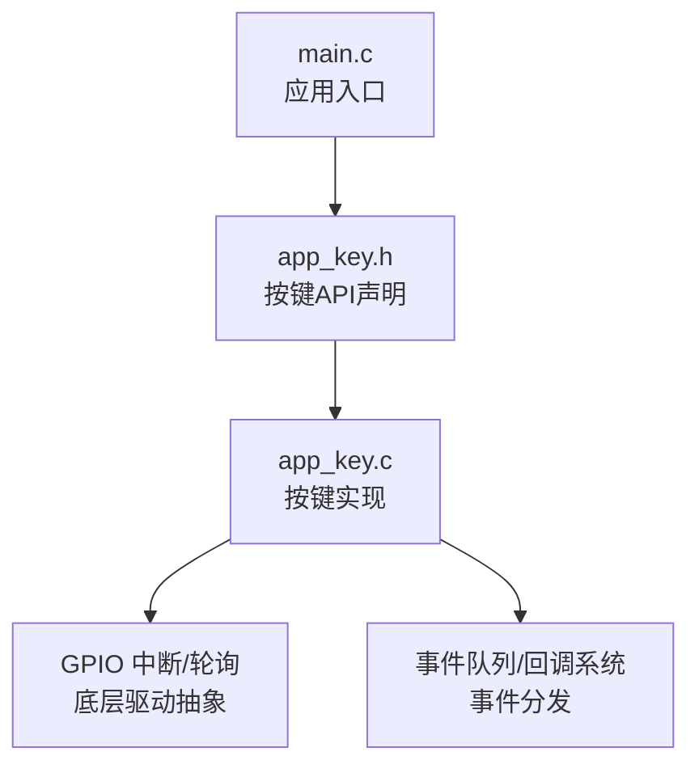
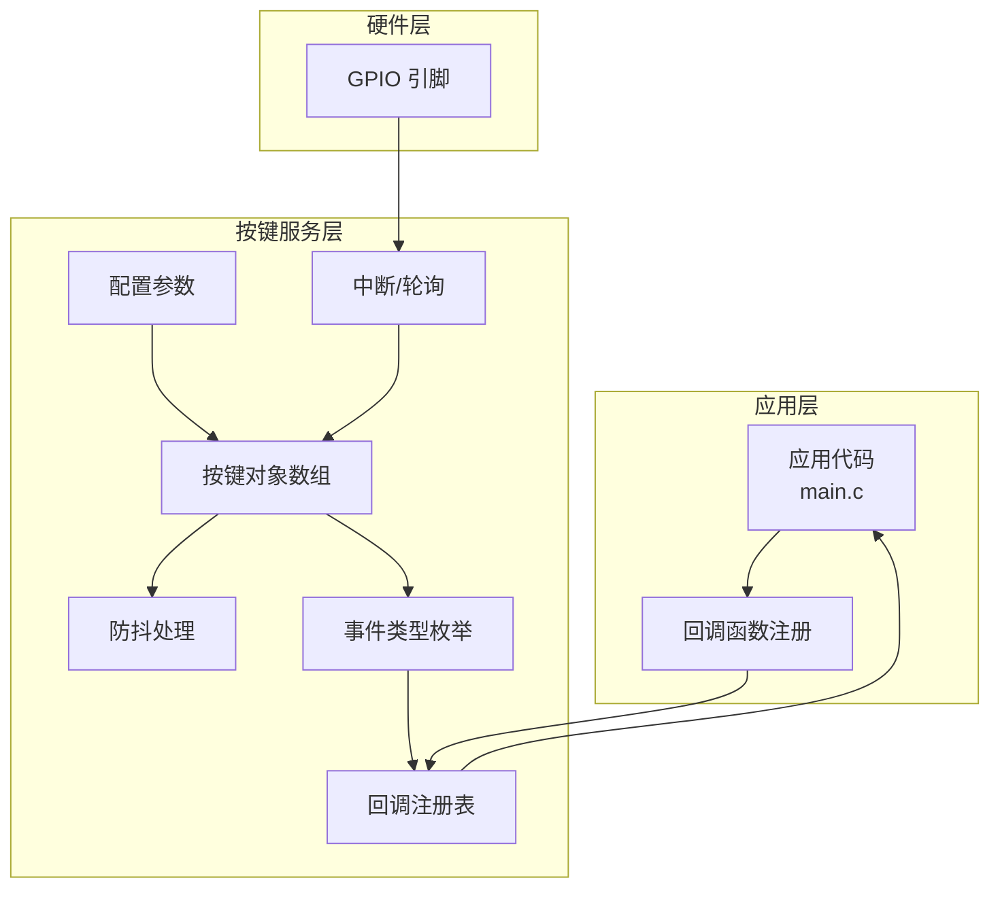
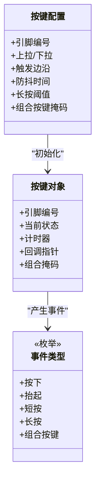
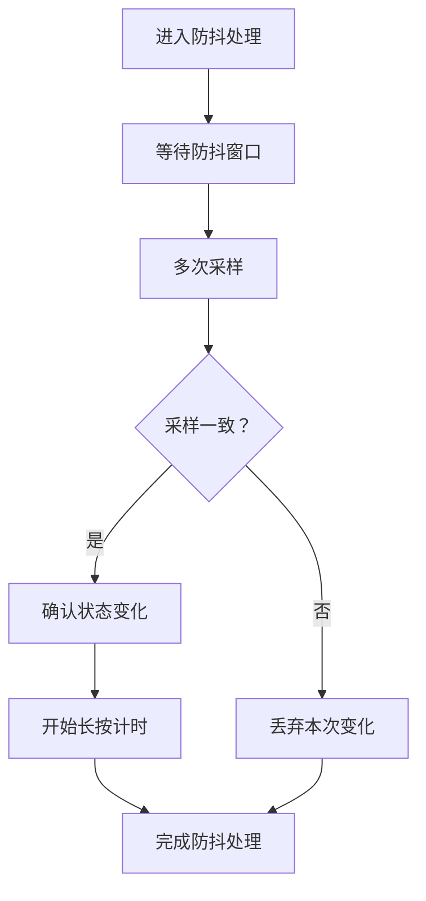
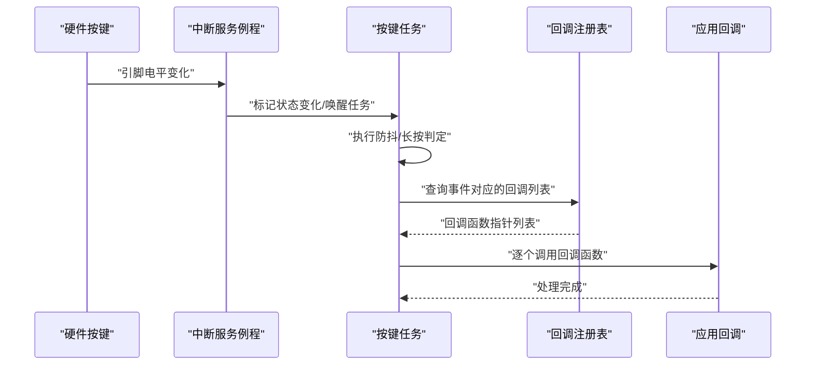
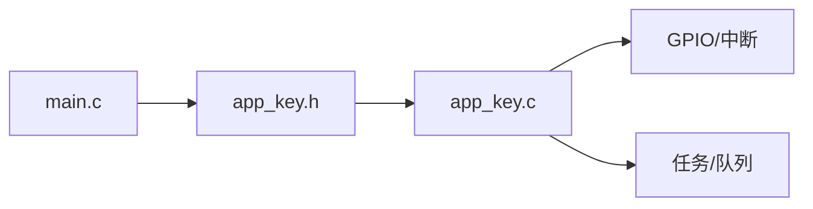

# 按键事件 API

<cite>
**本文引用的文件**
- [app_key.h](file://main/app/key/app_key.h)
- [app_key.c](file://main/app/key/app_key.c)
- [main.c](file://main/main.c)
</cite>

## 目录
1. [简介](#简介)
2. [项目结构](#项目结构)
3. [核心组件](#核心组件)
4. [架构总览](#架构总览)
5. [详细组件分析](#详细组件分析)
6. [依赖关系分析](#依赖关系分析)
7. [性能考虑](#性能考虑)
8. [故障排查指南](#故障排查指南)
9. [结论](#结论)
10. [附录](#附录)

## 简介
本文件为按键事件处理相关的 API 文档，聚焦以下主题：
- 按键状态检测接口与按键状态查询函数
- 事件回调注册机制
- 防抖处理函数
- 按键类型定义、事件类型枚举
- 按键中断处理、长按/短按识别、组合按键支持
- 按键配置参数、回调函数注册示例与最佳实践
- 在不同应用场景中的正确使用方式

本说明基于仓库中的按键模块源码进行整理，确保内容可追溯至具体文件。

## 项目结构
按键功能位于应用层的按键子模块中，主要由头文件与实现文件组成，并在主程序入口处被包含与调用。

图表来源
- [main.c:1-50](file://main/main.c#L1-L50)
- [app_key.h:1-120](file://main/app/key/app_key.h#L1-L120)
- [app_key.c:1-200](file://main/app/key/app_key.c#L1-L200)

章节来源
- [main.c:1-50](file://main/main.c#L1-L50)
- [app_key.h:1-120](file://main/app/key/app_key.h#L1-L120)
- [app_key.c:1-200](file://main/app/key/app_key.c#L1-L200)

## 核心组件
- 按键配置参数：用于初始化按键硬件与行为（如引脚、上拉/下拉、触发边沿、防抖时间等）。
- 按键类型定义：描述单个按键对象的数据结构，包含引脚、状态、计时器、回调指针等字段。
- 事件类型枚举：定义按键事件类别（按下、抬起、长按、短按、组合按键触发等）。
- 状态查询函数：提供按键当前状态读取能力（例如按键是否被按下、是否处于去抖阶段）。
- 回调注册机制：允许用户为特定按键或事件类型注册回调函数，实现解耦的事件处理。
- 防抖处理函数：对按键输入进行去抖动处理，避免机械开关抖动导致的误触发。
- 中断处理：按键引脚触发中断后，进入 ISR 或任务上下文，更新按键状态并派发事件。
- 组合按键支持：通过多按键状态联合判断，识别组合按键事件。

章节来源
- [app_key.h:1-120](file://main/app/key/app_key.h#L1-L120)
- [app_key.c:1-200](file://main/app/key/app_key.c#L1-L200)

## 架构总览
按键模块采用“配置参数 + 按键对象 + 事件枚举 + 回调注册 + 防抖处理 + 中断/轮询”的分层设计。上层应用通过注册回调函数订阅事件；底层通过 GPIO 中断或定时轮询检测按键状态变化；中间层负责去抖与事件识别，并将事件投递到回调函数。

图表来源
- [main.c:1-50](file://main/main.c#L1-L50)
- [app_key.h:1-120](file://main/app/key/app_key.h#L1-L120)
- [app_key.c:1-200](file://main/app/key/app_key.c#L1-L200)

## 详细组件分析

### 按键类型定义与数据结构
按键对象通常包含如下字段：
- 引脚编号：对应硬件 GPIO 编号
- 当前状态：按下/抬起/去抖中
- 计时器/计数器：用于长按、防抖、重复触发等判定
- 上拉/下拉配置：决定默认电平与触发逻辑
- 触发电平/边沿：上升沿/下降沿/双沿触发
- 用户回调指针：事件发生时调用的函数指针
- 组合按键掩码：与其他按键的组合关系

图表来源
- [app_key.h:1-120](file://main/app/key/app_key.h#L1-L120)
- [app_key.c:1-200](file://main/app/key/app_key.c#L1-L200)

章节来源
- [app_key.h:1-120](file://main/app/key/app_key.h#L1-L120)
- [app_key.c:1-200](file://main/app/key/app_key.c#L1-L200)

### 事件类型枚举
事件类型用于统一标识按键行为，便于回调分发与状态机处理。常见枚举值包括：
- 按下
- 抬起
- 短按
- 长按
- 组合按键

章节来源
- [app_key.h:1-120](file://main/app/key/app_key.h#L1-L120)

### 状态查询函数
- 查询按键当前状态：返回按下/抬起/去抖中
- 查询按键是否被按下：布尔判断
- 查询按键持续时间：用于长按识别
- 查询按键是否处于防抖窗口内

章节来源
- [app_key.c:1-200](file://main/app/key/app_key.c#L1-L200)

### 回调注册机制
- 单按键回调注册：为某个按键绑定一个或多个回调函数
- 全局事件回调：监听所有按键事件，统一处理
- 组合按键回调：当多个按键同时满足条件时触发
- 回调优先级与执行顺序：建议在回调中避免阻塞操作，必要时将耗时任务放入队列或任务中

章节来源
- [app_key.h:1-120](file://main/app/key/app_key.h#L1-L120)
- [app_key.c:1-200](file://main/app/key/app_key.c#L1-L200)

### 防抖处理函数
- 防抖窗口：固定毫秒级窗口，窗口内忽略状态变化
- 去抖策略：连续 N 次采样一致才确认状态变化
- 防抖与长按的协作：在去抖完成后进入长按计时判定

图表来源
- [app_key.c:1-200](file://main/app/key/app_key.c#L1-L200)

章节来源
- [app_key.c:1-200](file://main/app/key/app_key.c#L1-L200)

### 中断处理与事件派发
- 中断触发：按键引脚电平变化触发中断
- ISR 责任：快速标记状态变化，避免复杂逻辑
- 任务/队列：在任务上下文中完成去抖、长按判定与回调派发
- 事件派发：根据事件类型调用已注册的回调函数

图表来源
- [app_key.c:1-200](file://main/app/key/app_key.c#L1-L200)

章节来源
- [app_key.c:1-200](file://main/app/key/app_key.c#L1-L200)

### 长按/短按识别与组合按键支持
- 短按：在释放前未达到长按阈值
- 长按：持续按下超过设定阈值
- 组合按键：多个按键同时满足触发条件，生成组合事件
- 优先级与互斥：建议短按与长按互斥，组合按键独立于单按键事件

章节来源
- [app_key.h:1-120](file://main/app/key/app_key.h#L1-L120)
- [app_key.c:1-200](file://main/app/key/app_key.c#L1-L200)

### 回调函数注册示例与最佳实践
- 注册步骤
  - 初始化按键配置参数
  - 创建按键对象并绑定回调
  - 启动按键任务/中断
- 最佳实践
  - 回调中避免阻塞，仅做轻量处理
  - 将耗时任务放入队列或任务中
  - 使用事件类型枚举统一事件语义
  - 对组合按键设置明确的触发条件与优先级

章节来源
- [main.c:1-50](file://main/main.c#L1-L50)
- [app_key.h:1-120](file://main/app/key/app_key.h#L1-L120)
- [app_key.c:1-200](file://main/app/key/app_key.c#L1-L200)

## 依赖关系分析
- 应用层依赖按键头文件提供的 API 接口
- 实现层依赖底层 GPIO 中断/轮询与系统调度（任务/队列）
- 事件类型与回调注册共同构成事件分发契约

图表来源
- [main.c:1-50](file://main/main.c#L1-L50)
- [app_key.h:1-120](file://main/app/key/app_key.h#L1-L120)
- [app_key.c:1-200](file://main/app/key/app_key.c#L1-L200)

章节来源
- [main.c:1-50](file://main/main.c#L1-L50)
- [app_key.h:1-120](file://main/app/key/app_key.h#L1-L120)
- [app_key.c:1-200](file://main/app/key/app_key.c#L1-L200)

## 性能考虑
- 中断处理应尽量轻量化，避免在 ISR 中执行复杂逻辑
- 防抖窗口与长按阈值需结合硬件与使用场景权衡，过短易误触，过长影响响应
- 回调函数应避免阻塞，必要时异步化处理
- 多按键场景下，组合按键判定应尽量高效，避免全量扫描带来的开销

## 故障排查指南
- 按键无响应
  - 检查引脚配置与上拉/下拉设置
  - 确认中断是否启用且 ISR 正常触发
- 按键误触发/抖动
  - 提高防抖时间或增加采样次数
  - 检查电路布线与电源噪声
- 长按不生效
  - 检查长按阈值设置是否合理
  - 确认回调中未提前清除状态
- 组合按键无效
  - 检查组合掩码与触发条件
  - 确认各按键状态均满足组合要求

章节来源
- [app_key.c:1-200](file://main/app/key/app_key.c#L1-L200)

## 结论
按键事件 API 通过清晰的配置参数、事件类型与回调机制，提供了稳定可靠的按键处理能力。结合防抖与长按/短按识别，能够满足大多数应用场景的需求。建议在实际工程中遵循“轻回调、重异步”的原则，以获得更好的实时性与可维护性。

## 附录
- 关键 API 与数据结构参考路径
  - [按键配置参数定义:1-120](file://main/app/key/app_key.h#L1-L120)
  - [按键对象与事件枚举:1-120](file://main/app/key/app_key.h#L1-L120)
  - [状态查询函数声明:1-120](file://main/app/key/app_key.h#L1-L120)
  - [回调注册接口声明:1-120](file://main/app/key/app_key.h#L1-L120)
  - [防抖与事件处理实现:1-200](file://main/app/key/app_key.c#L1-L200)
  - [应用入口与包含头文件:1-50](file://main/main.c#L1-L50)