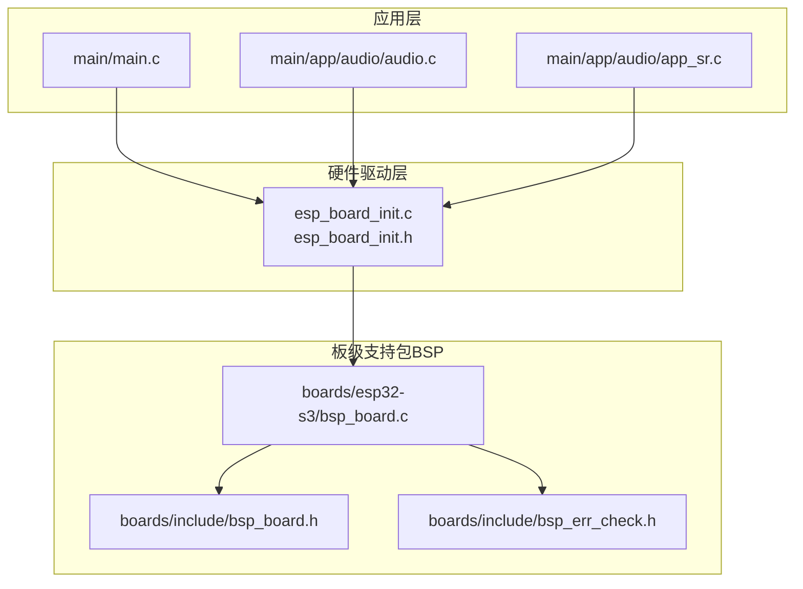
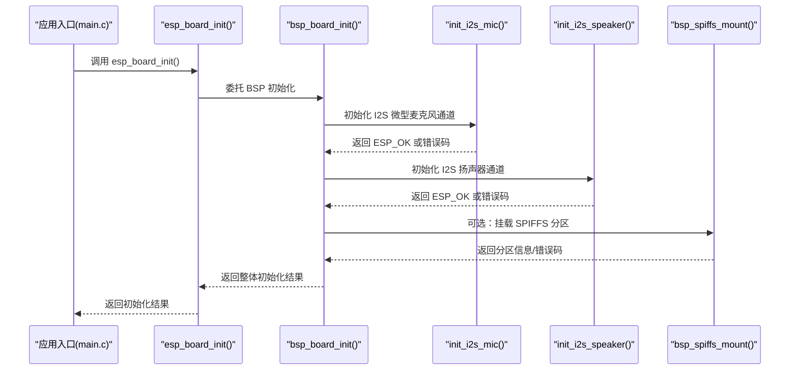
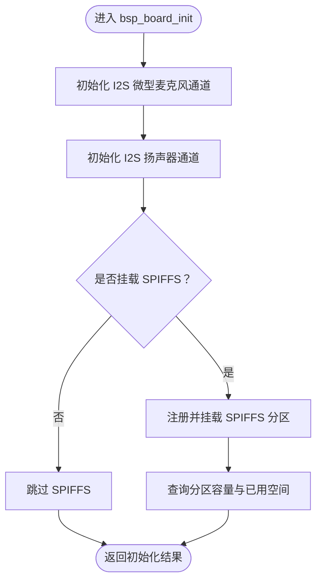
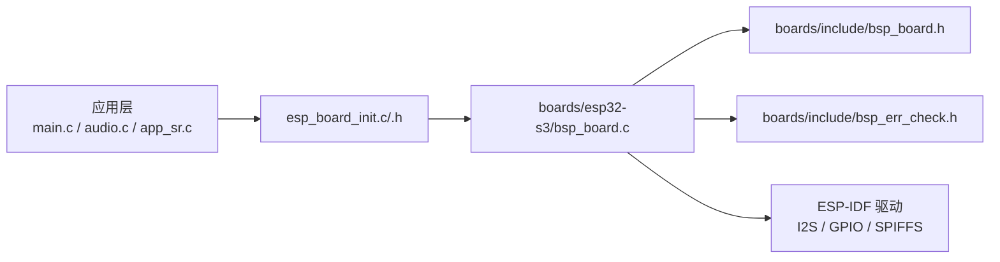

# 硬件初始化 API

<cite>
**本文引用的文件**
- [components/hardware_driver/esp_board_init.c](file://components/hardware_driver/esp_board_init.c)
- [components/hardware_driver/include/esp_board_init.h](file://components/hardware_driver/include/esp_board_init.h)
- [components/hardware_driver/boards/include/bsp_board.h](file://components/hardware_driver/boards/include/bsp_board.h)
- [components/hardware_driver/boards/esp32-s3/bsp_board.c](file://components/hardware_driver/boards/esp32-s3/bsp_board.c)
- [components/hardware_driver/boards/include/bsp_err_check.h](file://components/hardware_driver/boards/include/bsp_err_check.h)
- [main/main.c](file://main/main.c)
- [main/app/audio/audio.c](file://main/app/audio/audio.c)
- [main/app/audio/app_sr.c](file://main/app/audio/app_sr.c)
- [build/config/sdkconfig.h](file://build/config/sdkconfig.h)
</cite>

## 目录
1. [简介](#简介)
2. [项目结构](#项目结构)
3. [核心组件](#核心组件)
4. [架构总览](#架构总览)
5. [详细组件分析](#详细组件分析)
6. [依赖关系分析](#依赖关系分析)
7. [性能考虑](#性能考虑)
8. [故障排查指南](#故障排查指南)
9. [结论](#结论)
10. [附录](#附录)

## 简介
本文件面向硬件初始化相关的 API 文档，聚焦于系统硬件初始化流程、外设配置与资源分配、硬件抽象层接口、板级支持包（BSP）配置与初始化顺序管理。文档同时覆盖不同硬件平台的初始化差异、配置参数与兼容性处理方法，并给出硬件检测、错误处理与初始化状态查询的实现要点。最后提供系统启动过程中初始化流程的最佳实践与调用方式。

## 项目结构
硬件初始化相关代码主要分布在以下模块：
- 硬件驱动层：对外提供统一的初始化与外设操作 API
- 板级支持包（BSP）：封装具体平台的引脚、时钟、DMA、I2S 等配置
- 应用入口与示例：在系统启动阶段调用初始化 API

图表来源
- [components/hardware_driver/esp_board_init.c:1-35](file://components/hardware_driver/esp_board_init.c#L1-L35)
- [components/hardware_driver/include/esp_board_init.h:1-15](file://components/hardware_driver/include/esp_board_init.h#L1-L15)
- [components/hardware_driver/boards/include/bsp_board.h:1-33](file://components/hardware_driver/boards/include/bsp_board.h#L1-L33)
- [components/hardware_driver/boards/esp32-s3/bsp_board.c:1-176](file://components/hardware_driver/boards/esp32-s3/bsp_board.c#L1-L176)
- [components/hardware_driver/boards/include/bsp_err_check.h:1-59](file://components/hardware_driver/boards/include/bsp_err_check.h#L1-L59)
- [main/main.c:1-60](file://main/main.c#L1-L60)

章节来源
- [components/hardware_driver/esp_board_init.c:1-35](file://components/hardware_driver/esp_board_init.c#L1-L35)
- [components/hardware_driver/include/esp_board_init.h:1-15](file://components/hardware_driver/include/esp_board_init.h#L1-L15)
- [components/hardware_driver/boards/include/bsp_board.h:1-33](file://components/hardware_driver/boards/include/bsp_board.h#L1-L33)
- [components/hardware_driver/boards/esp32-s3/bsp_board.c:1-176](file://components/hardware_driver/boards/esp32-s3/bsp_board.c#L1-L176)
- [components/hardware_driver/boards/include/bsp_err_check.h:1-59](file://components/hardware_driver/boards/include/bsp_err_check.h#L1-L59)
- [main/main.c:1-60](file://main/main.c#L1-L60)

## 核心组件
- 统一初始化入口
  - esp_board_init：系统级初始化入口，负责调用 BSP 初始化函数，完成 I2S 麦克风与扬声器通道、SPIFFS 文件系统的准备等。
- I2S 外设封装
  - esp_i2s_read/esp_i2s_write：对 BSP 层 I2S 读写接口的薄封装，便于上层直接调用。
- SPIFFS 文件系统
  - esp_spiffs_mount/esp_spiffs_unmount：挂载/卸载 SPIFFS 分区，支持格式化失败策略配置。
- BSP 接口与平台实现
  - bsp_board.h：定义 I2S 引脚、采样率、DMA 缓冲区大小等平台常量；声明 BSP API。
  - bsp_board.c（ESP32-S3）：实现 I2S 微型麦克风与扬声器通道初始化、SPIFFS 注册与信息查询、平台初始化主流程。
- 错误检查宏
  - bsp_err_check.h：根据配置决定在错误时返回错误码或断言，保证初始化链路的健壮性。

章节来源
- [components/hardware_driver/esp_board_init.c:10-35](file://components/hardware_driver/esp_board_init.c#L10-L35)
- [components/hardware_driver/include/esp_board_init.h:7-15](file://components/hardware_driver/include/esp_board_init.h#L7-L15)
- [components/hardware_driver/boards/include/bsp_board.h:9-33](file://components/hardware_driver/boards/include/bsp_board.h#L9-L33)
- [components/hardware_driver/boards/esp32-s3/bsp_board.c:169-176](file://components/hardware_driver/boards/esp32-s3/bsp_board.c#L169-L176)
- [components/hardware_driver/boards/include/bsp_err_check.h:16-54](file://components/hardware_driver/boards/include/bsp_err_check.h#L16-L54)

## 架构总览
系统启动时，应用入口调用统一初始化 API，该 API 再委托给 BSP 完成具体平台的硬件配置与资源分配。初始化流程包括 I2S 通道（麦克风/扬声器）配置、DMA 参数设置、GPIO 引脚映射、SPIFFS 分区注册与容量查询等。

图表来源
- [main/main.c:30-45](file://main/main.c#L30-L45)
- [components/hardware_driver/esp_board_init.c:30-35](file://components/hardware_driver/esp_board_init.c#L30-L35)
- [components/hardware_driver/boards/esp32-s3/bsp_board.c:169-176](file://components/hardware_driver/boards/esp32-s3/bsp_board.c#L169-L176)
- [components/hardware_driver/boards/esp32-s3/bsp_board.c:22-60](file://components/hardware_driver/boards/esp32-s3/bsp_board.c#L22-L60)
- [components/hardware_driver/boards/esp32-s3/bsp_board.c:62-104](file://components/hardware_driver/boards/esp32-s3/bsp_board.c#L62-L104)
- [components/hardware_driver/boards/esp32-s3/bsp_board.c:130-160](file://components/hardware_driver/boards/esp32-s3/bsp_board.c#L130-L160)

## 详细组件分析

### 统一初始化 API（esp_board_init）
- 功能概述
  - 提供系统级硬件初始化入口，内部委托 BSP 完成平台特定的初始化工作。
- 典型调用位置
  - 主程序入口与音频相关模块均通过包含头文件后直接调用该函数。
- 错误处理
  - 返回值遵循 ESP-IDF 的错误约定，上层应检查返回值以判断初始化是否成功。

章节来源
- [components/hardware_driver/esp_board_init.c:30-35](file://components/hardware_driver/esp_board_init.c#L30-L35)
- [main/main.c:30-45](file://main/main.c#L30-L45)
- [main/app/audio/audio.c:1-30](file://main/app/audio/audio.c#L1-L30)
- [main/app/audio/app_sr.c:1-30](file://main/app/audio/app_sr.c#L1-L30)

### I2S 外设封装（esp_i2s_read/esp_i2s_write）
- 功能概述
  - 对 BSP 层 I2S 读写接口进行薄封装，屏蔽底层通道句柄细节，便于上层直接进行音频数据收发。
- 数据流
  - 读取：从 I2S 微型麦克风通道读取 PCM 数据到缓冲区。
  - 写入：向 I2S 扬声器通道写入 PCM 数据。
- 关键参数
  - 缓冲长度与采样率需与 BSP 中的配置一致，避免溢出或欠载。

章节来源
- [components/hardware_driver/esp_board_init.c:20-28](file://components/hardware_driver/esp_board_init.c#L20-L28)
- [components/hardware_driver/include/esp_board_init.h:9-11](file://components/hardware_driver/include/esp_board_init.h#L9-L11)
- [components/hardware_driver/boards/esp32-s3/bsp_board.c:110-126](file://components/hardware_driver/boards/esp32-s3/bsp_board.c#L110-L126)

### SPIFFS 文件系统封装（esp_spiffs_mount/esp_spiffs_unmount）
- 功能概述
  - 提供 SPIFFS 分区的挂载与卸载能力，支持在挂载失败时按配置选择格式化。
- 关键行为
  - 挂载时查询分区总容量与已用空间，便于诊断与容量管理。
  - 卸载时注销分区，释放资源。

章节来源
- [components/hardware_driver/esp_board_init.c:10-18](file://components/hardware_driver/esp_board_init.c#L10-L18)
- [components/hardware_driver/include/esp_board_init.h:12-14](file://components/hardware_driver/include/esp_board_init.h#L12-L14)
- [components/hardware_driver/boards/esp32-s3/bsp_board.c:130-165](file://components/hardware_driver/boards/esp32-s3/bsp_board.c#L130-L165)

### BSP 接口与平台实现（ESP32-S3）
- 平台常量
  - I2S 引脚定义：INMP441（MIC）、MAX98357A（Speaker）的 WCLK/BCLK/DIN 引脚。
  - 采样率与 DMA：接收采样率、发送采样率、DMA 描述符数量与帧长度。
- I2S 初始化流程
  - 创建通道：分别针对 I2S_NUM_0（接收）与 I2S_NUM_1（发送）。
  - 配置时钟与槽位：数据位宽、槽位位宽、单声道模式、字时钟宽度、端序等。
  - GPIO 映射：BCLK/WS/DIN/WCLK 等引脚绑定。
  - 启用通道：完成初始化后启用通道。
- SPIFFS 初始化流程
  - 注册分区：指定挂载路径、分区标签、最大文件数、挂载失败策略。
  - 查询信息：获取分区总容量与已用空间，用于诊断与容量监控。

图表来源
- [components/hardware_driver/boards/esp32-s3/bsp_board.c:169-176](file://components/hardware_driver/boards/esp32-s3/bsp_board.c#L169-L176)
- [components/hardware_driver/boards/esp32-s3/bsp_board.c:22-60](file://components/hardware_driver/boards/esp32-s3/bsp_board.c#L22-L60)
- [components/hardware_driver/boards/esp32-s3/bsp_board.c:62-104](file://components/hardware_driver/boards/esp32-s3/bsp_board.c#L62-L104)
- [components/hardware_driver/boards/esp32-s3/bsp_board.c:130-160](file://components/hardware_driver/boards/esp32-s3/bsp_board.c#L130-L160)

章节来源
- [components/hardware_driver/boards/include/bsp_board.h:9-33](file://components/hardware_driver/boards/include/bsp_board.h#L9-L33)
- [components/hardware_driver/boards/esp32-s3/bsp_board.c:169-176](file://components/hardware_driver/boards/esp32-s3/bsp_board.c#L169-L176)
- [components/hardware_driver/boards/esp32-s3/bsp_board.c:22-104](file://components/hardware_driver/boards/esp32-s3/bsp_board.c#L22-L104)
- [components/hardware_driver/boards/esp32-s3/bsp_board.c:130-165](file://components/hardware_driver/boards/esp32-s3/bsp_board.c#L130-L165)

### 错误处理与兼容性
- 错误处理策略
  - BSP 层通过自定义宏在“错误即断言”与“返回错误码”之间切换，取决于配置项。
  - 初始化链路中任一环节失败，均会向上返回错误码，便于上层统一处理。
- 兼容性处理
  - BSP 常量集中定义，便于在不同平台移植时仅修改头文件常量即可适配。
  - I2S 采样率与 DMA 参数与上层音频处理模块（如语音识别）保持一致，避免采样率不匹配导致的异常。

章节来源
- [components/hardware_driver/boards/include/bsp_err_check.h:16-54](file://components/hardware_driver/boards/include/bsp_err_check.h#L16-L54)
- [components/hardware_driver/boards/include/bsp_board.h:19-22](file://components/hardware_driver/boards/include/bsp_board.h#L19-L22)
- [build/config/sdkconfig.h:942-943](file://build/config/sdkconfig.h#L942-L943)

## 依赖关系分析
- 组件耦合
  - 应用层仅依赖统一初始化 API 与 I2S/SPIFFS 封装，不直接接触 BSP 实现，降低耦合度。
  - BSP 实现依赖 ESP-IDF 的 I2S、GPIO、SPIFFS 等驱动，形成平台相关依赖。
- 外部依赖
  - I2S 标准模式与通道句柄由 ESP-IDF 提供。
  - SPIFFS 注册/查询由 ESP-IDF 提供。
- 潜在循环依赖
  - 当前结构为单向依赖（应用 → 驱动 → BSP），无循环依赖风险。

图表来源
- [main/main.c:1-60](file://main/main.c#L1-L60)
- [components/hardware_driver/esp_board_init.c:1-35](file://components/hardware_driver/esp_board_init.c#L1-L35)
- [components/hardware_driver/boards/esp32-s3/bsp_board.c:1-176](file://components/hardware_driver/boards/esp32-s3/bsp_board.c#L1-L176)
- [components/hardware_driver/boards/include/bsp_board.h:1-33](file://components/hardware_driver/boards/include/bsp_board.h#L1-L33)
- [components/hardware_driver/boards/include/bsp_err_check.h:1-59](file://components/hardware_driver/boards/include/bsp_err_check.h#L1-L59)

章节来源
- [main/main.c:1-60](file://main/main.c#L1-L60)
- [components/hardware_driver/esp_board_init.c:1-35](file://components/hardware_driver/esp_board_init.c#L1-L35)
- [components/hardware_driver/boards/esp32-s3/bsp_board.c:1-176](file://components/hardware_driver/boards/esp32-s3/bsp_board.c#L1-L176)
- [components/hardware_driver/boards/include/bsp_board.h:1-33](file://components/hardware_driver/boards/include/bsp_board.h#L1-L33)
- [components/hardware_driver/boards/include/bsp_err_check.h:1-59](file://components/hardware_driver/boards/include/bsp_err_check.h#L1-L59)

## 性能考虑
- DMA 参数优化
  - DMA 描述符数量与帧长度影响中断频率与 CPU 占用，需结合音频处理周期权衡。
- 采样率一致性
  - 接收与发送采样率需与上层音频算法一致，避免重采样开销与失真。
- 自动清空机制
  - 发送通道启用自动清空可避免播放停不下来的副作用，但需确保回调逻辑正确。
- SPIFFS 访问
  - 大文件读写建议在空闲时段进行，避免与音频实时性冲突。

## 故障排查指南
- 初始化失败
  - 检查返回值并定位失败环节（I2S 通道创建/启用、SPIFFS 注册）。
  - 若开启“错误即断言”，可在断言处查看具体错误来源。
- I2S 无声/杂音
  - 确认引脚映射与槽位配置一致；检查采样率与 DMA 参数是否匹配。
- SPIFFS 无法挂载
  - 查看挂载失败策略配置；确认分区标签与挂载路径一致；必要时执行格式化。
- 日志与诊断
  - SPIFFS 成功后会打印分区容量与已用空间，便于容量评估与问题定位。

章节来源
- [components/hardware_driver/boards/include/bsp_err_check.h:16-54](file://components/hardware_driver/boards/include/bsp_err_check.h#L16-L54)
- [components/hardware_driver/boards/esp32-s3/bsp_board.c:130-165](file://components/hardware_driver/boards/esp32-s3/bsp_board.c#L130-L165)
- [components/hardware_driver/boards/esp32-s3/bsp_board.c:22-104](file://components/hardware_driver/boards/esp32-s3/bsp_board.c#L22-L104)

## 结论
本硬件初始化 API 通过统一入口与薄封装，将平台相关细节隐藏在 BSP 层，实现了良好的可移植性与可维护性。配合明确的初始化顺序、完善的错误处理与诊断信息，能够满足多平台、多外设场景下的快速集成与稳定运行。

## 附录

### API 一览表
- esp_board_init：系统级初始化入口
- esp_i2s_read：从 I2S 微型麦克风读取音频数据
- esp_i2s_write：向 I2S 扬声器写入音频数据
- esp_spiffs_mount：挂载 SPIFFS 分区
- esp_spiffs_unmount：卸载 SPIFFS 分区

章节来源
- [components/hardware_driver/include/esp_board_init.h:7-15](file://components/hardware_driver/include/esp_board_init.h#L7-L15)
- [components/hardware_driver/esp_board_init.c:10-35](file://components/hardware_driver/esp_board_init.c#L10-L35)

### 系统启动与初始化最佳实践
- 在应用入口尽早调用 esp_board_init，确保后续音频与存储功能可用。
- 对返回值进行检查，失败时记录日志并采取降级策略。
- 根据实际硬件选择合适的采样率与 DMA 参数，避免性能瓶颈。
- SPIFFS 挂载建议在初始化早期完成，以便上层模块直接访问存储。

章节来源
- [main/main.c:30-45](file://main/main.c#L30-L45)
- [components/hardware_driver/esp_board_init.c:30-35](file://components/hardware_driver/esp_board_init.c#L30-L35)
- [components/hardware_driver/boards/esp32-s3/bsp_board.c:169-176](file://components/hardware_driver/boards/esp32-s3/bsp_board.c#L169-L176)