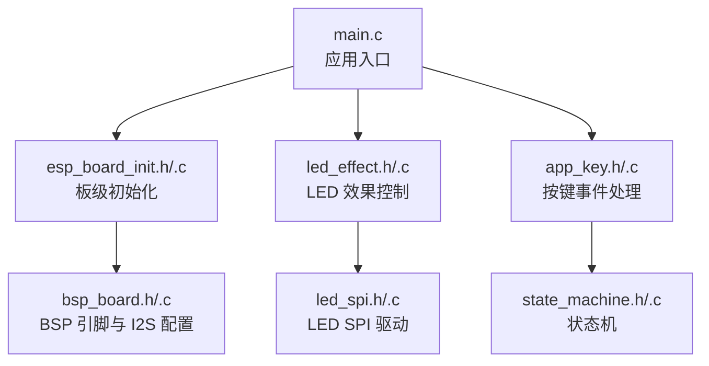
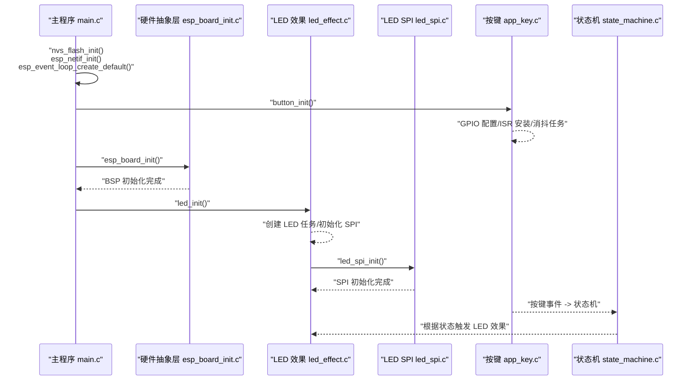
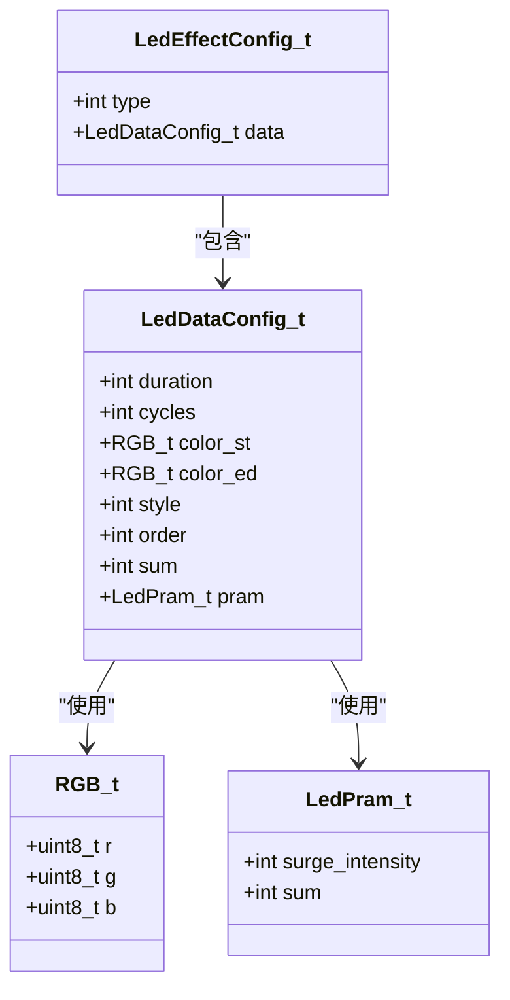
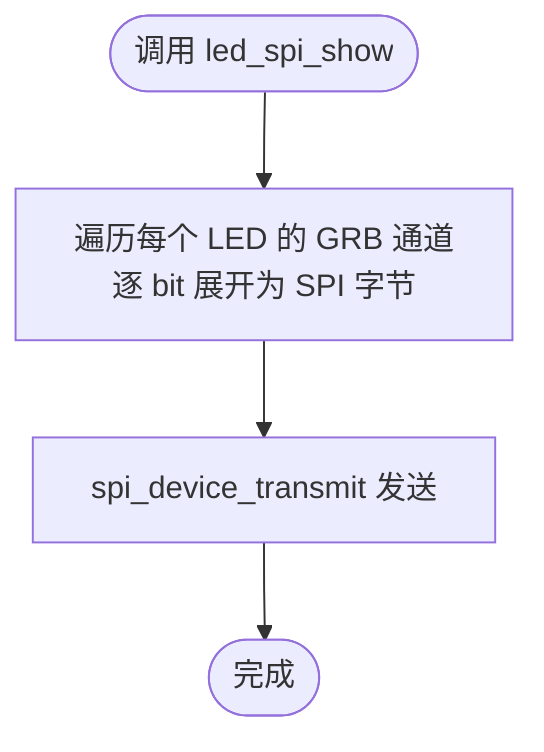
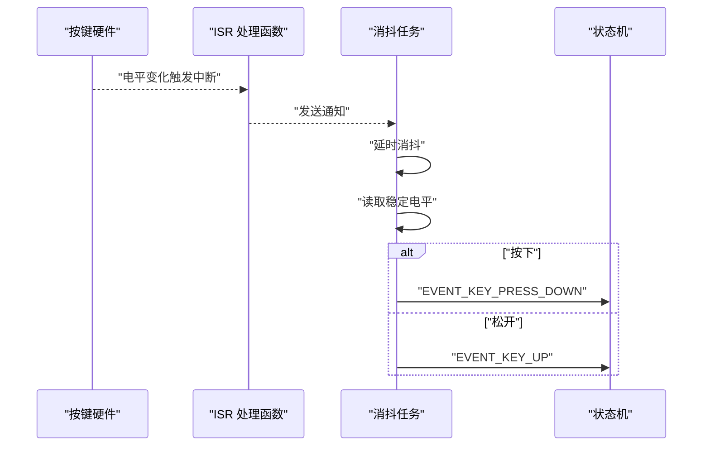
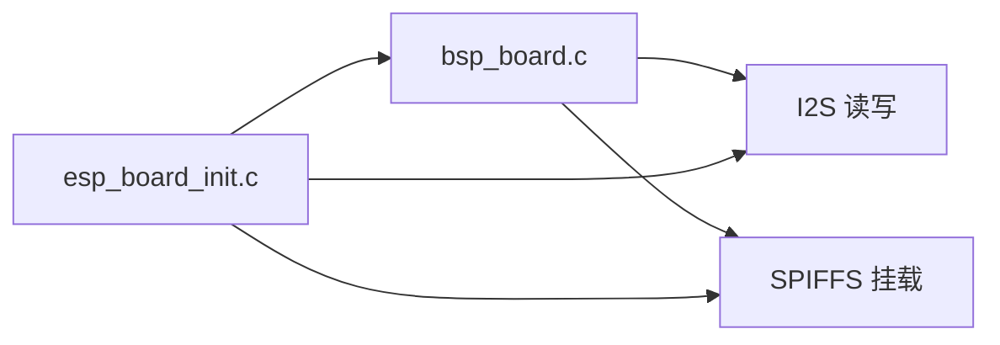
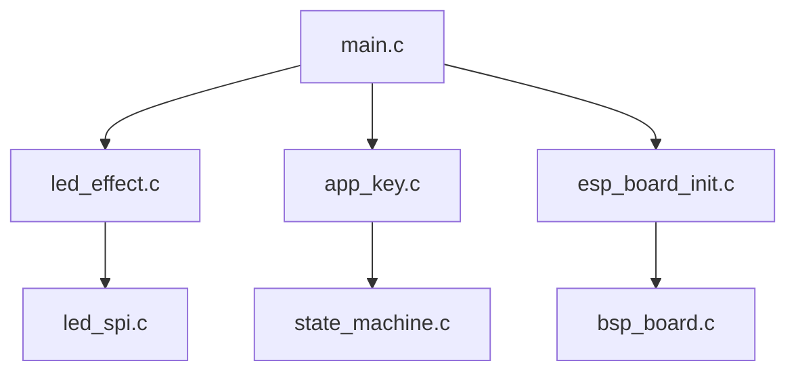
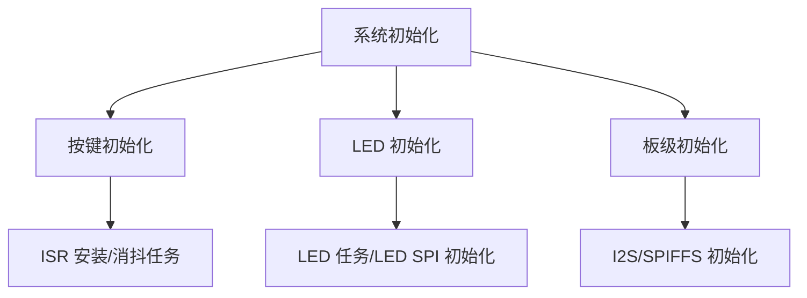

# 硬件控制 API

<cite>
**本文引用的文件**
- [main.c](file://main/main.c)
- [led_effect.h](file://main/app/led_strip/led_effect.h)
- [led_effect.c](file://main/app/led_strip/led_effect.c)
- [led_spi.h](file://main/app/led_strip/led_spi.h)
- [led_spi.c](file://main/app/led_strip/led_spi.c)
- [app_key.h](file://main/app/key/app_key.h)
- [app_key.c](file://main/app/key/app_key.c)
- [esp_board_init.h](file://components/hardware_driver/include/esp_board_init.h)
- [esp_board_init.c](file://components/hardware_driver/esp_board_init.c)
- [bsp_board.h](file://components/hardware_driver/boards/include/bsp_board.h)
- [bsp_board.c](file://components/hardware_driver/boards/esp32-s3/bsp_board.c)
- [state_machine.h](file://main/app/state_machine/state_machine.h)
- [state_machine.c](file://main/app/state_machine/state_machine.c)
</cite>

## 目录
1. [简介](#简介)
2. [项目结构](#项目结构)
3. [核心组件](#核心组件)
4. [架构总览](#架构总览)
5. [详细组件分析](#详细组件分析)
6. [依赖关系分析](#依赖关系分析)
7. [性能考虑](#性能考虑)
8. [故障排查指南](#故障排查指南)
9. [结论](#结论)
10. [附录](#附录)

## 简介
本文件面向硬件控制相关 API 的使用与移植，重点覆盖以下内容：
- LED 控制接口：包括 LED 效果配置、颜色设置、动画参数与亮度控制接口
- 按键事件处理：按键状态检测、事件回调注册与防抖处理
- GPIO 操作函数：按键引脚配置、中断服务与任务协作
- 硬件初始化流程：LED SPI 初始化、按键 GPIO 初始化、I2S/存储等板级资源初始化
- 硬件抽象层（HAL）：通过硬件驱动层统一不同硬件平台的差异，便于移植

## 项目结构
本项目采用“应用层 + 硬件抽象层 + 板级支持包”的分层设计：
- 应用层：LED 效果、按键处理、状态机、音频、网络等模块
- 硬件抽象层：统一 I2S、SPI、GPIO 等外设访问
- 板级支持包（BSP）：针对具体硬件平台（如 ESP32-S3）的引脚定义与外设初始化

**图示来源**
- [main.c:33-59](file://main/main.c#L33-L59)
- [esp_board_init.h:7-14](file://components/hardware_driver/include/esp_board_init.h#L7-L14)
- [esp_board_init.c:30-33](file://components/hardware_driver/esp_board_init.c#L30-L33)
- [led_effect.h:6-8](file://main/app/led_strip/led_effect.h#L6-L8)
- [led_spi.h:10-26](file://main/app/led_strip/led_spi.h#L10-L26)
- [app_key.h:1](file://main/app/key/app_key.h#L1)
- [state_machine.h:6-32](file://main/app/state_machine/state_machine.h#L6-L32)
- [bsp_board.h:9-31](file://components/hardware_driver/boards/include/bsp_board.h#L9-L31)

**章节来源**
- [main.c:33-59](file://main/main.c#L33-L59)
- [esp_board_init.h:7-14](file://components/hardware_driver/include/esp_board_init.h#L7-L14)
- [esp_board_init.c:30-33](file://components/hardware_driver/esp_board_init.c#L30-L33)
- [led_effect.h:6-8](file://main/app/led_strip/led_effect.h#L6-L8)
- [led_spi.h:10-26](file://main/app/led_strip/led_spi.h#L10-L26)
- [app_key.h:1](file://main/app/key/app_key.h#L1)
- [state_machine.h:6-32](file://main/app/state_machine/state_machine.h#L6-L32)
- [bsp_board.h:9-31](file://components/hardware_driver/boards/include/bsp_board.h#L9-L31)

## 核心组件
- LED 效果控制：提供 LED 初始化、暂停/恢复、从 JSON 更新配置等接口；内部通过 LED SPI 驱动刷新像素
- LED SPI 驱动：负责将 GRB 像素数据转换为 WS2812 时序并通过 SPI 发送
- 按键事件处理：按键 GPIO 配置、中断服务、消抖任务与状态机事件联动
- 硬件抽象层：统一 I2S 读写、SPIFFS 挂载/卸载、板级初始化
- 板级支持包：定义硬件引脚、采样率、DMA 参数等，屏蔽平台差异

**章节来源**
- [led_effect.h:6-8](file://main/app/led_strip/led_effect.h#L6-L8)
- [led_spi.h:10-26](file://main/app/led_strip/led_spi.h#L10-L26)
- [app_key.c:72-104](file://main/app/key/app_key.c#L72-L104)
- [esp_board_init.h:7-14](file://components/hardware_driver/include/esp_board_init.h#L7-L14)
- [bsp_board.h:9-31](file://components/hardware_driver/boards/include/bsp_board.h#L9-L31)

## 架构总览
系统启动时，主程序完成 NVS、网络、事件循环初始化后，依次调用各子系统初始化函数。LED 子系统在独立任务中运行，按键子系统通过中断触发消抖任务，最终将事件投递至状态机。

**图示来源**
- [main.c:33-59](file://main/main.c#L33-L59)
- [esp_board_init.c:30-33](file://components/hardware_driver/esp_board_init.c#L30-L33)
- [led_effect.c:436-441](file://main/app/led_strip/led_effect.c#L436-L441)
- [led_spi.c:36-66](file://main/app/led_strip/led_spi.c#L36-L66)
- [app_key.c:72-104](file://main/app/key/app_key.c#L72-L104)
- [state_machine.c:24-35](file://main/app/state_machine/state_machine.c#L24-L35)

## 详细组件分析

### LED 控制 API
- 接口清单
  - led_init：创建 LED 效果任务并初始化 SPI
  - led_set_paused：暂停/恢复 LED 效果任务
  - led_update_config_from_json：从 JSON 更新 LED 效果配置
- 数据结构
  - RGB_t：颜色分量（R/G/B）
  - LedDataConfig_t：效果参数集合（持续时间、循环次数、起止颜色、样式、参数、顺序、总和等）
  - LedEffectConfig_t：效果类型与数据组合
- 关键实现要点
  - 使用互斥信号量保护配置更新
  - 支持多类型多样式效果：两色瞬变闪烁、活泼跳变、奇幻波浪、科技脉冲
  - 支持亮度控制（通过颜色分量缩放）
  - 通过 led_spi_set_pixel/led_spi_show 刷新像素
- JSON 配置字段
  - type：效果类型（0/1）
  - data.duration：总时长（毫秒）
  - data.cycles：循环次数
  - data.color_st/color_ed：起止颜色（数组，三通道）
  - data.style：样式编号
  - data.order：顺序（0/1）
  - data.pram.surge_intensity：强度/拖尾长度/亮度百分比
  - data.sum：中心区域像素数

**图示来源**
- [led_effect.c:18-44](file://main/app/led_strip/led_effect.c#L18-L44)

**章节来源**
- [led_effect.h:6-8](file://main/app/led_strip/led_effect.h#L6-L8)
- [led_effect.c:64-81](file://main/app/led_strip/led_effect.c#L64-L81)
- [led_effect.c:84-122](file://main/app/led_strip/led_effect.c#L84-L122)
- [led_effect.c:126-292](file://main/app/led_strip/led_effect.c#L126-L292)
- [led_effect.c:436-441](file://main/app/led_strip/led_effect.c#L436-L441)

### LED SPI 驱动 API
- 接口清单
  - led_spi_init：分配 DMA 缓冲区并初始化 SPI2
  - led_spi_set_pixel：设置单个 LED 的 GRB 值
  - led_spi_set_all：批量设置全部 LED 的 GRB 数据
  - led_spi_show：构建位扩展数据并通过 SPI 发送
  - led_spi_clear：清空所有 LED
  - led_spi_get_buffer：获取内部颜色缓冲区指针
- 关键实现要点
  - 使用 DMA 内存分配（MALLOC_CAP_DMA | MALLOC_CAP_INTERNAL）
  - 将每个像素的 8bit 通道按位展开为 0x80/0xE0 的 SPI 字节序列
  - 时钟频率约 3.2MHz，满足 WS2812 时序要求
  - 默认 LED 数量 30，MOSI 引脚 19（原 RMT 引脚）

**图示来源**
- [led_spi.c:20-34](file://main/app/led_strip/led_spi.c#L20-L34)
- [led_spi.c:80-92](file://main/app/led_strip/led_spi.c#L80-L92)

**章节来源**
- [led_spi.h:10-26](file://main/app/led_strip/led_spi.h#L10-L26)
- [led_spi.c:36-66](file://main/app/led_strip/led_spi.c#L36-L66)
- [led_spi.c:68-78](file://main/app/led_strip/led_spi.c#L68-L78)
- [led_spi.c:80-92](file://main/app/led_strip/led_spi.c#L80-L92)
- [led_spi.c:94-99](file://main/app/led_strip/led_spi.c#L94-L99)
- [led_spi.c:101-103](file://main/app/led_strip/led_spi.c#L101-L103)

### 按键事件处理 API
- 接口清单
  - button_init：配置按键 GPIO、安装 ISR、创建消抖任务
  - button_reset_record_flag：重置按键标志
  - button_get_last_recorded_angle：获取按键记录的 IMU 角度
- 关键实现要点
  - GPIO 配置：输入模式、内部上拉、任意边沿触发
  - ISR：仅发送任务通知，避免在 ISR 中执行耗时操作
  - 消抖：固定延时（默认 30ms）后读取稳定电平，仅在电平变化时处理
  - 事件投递：按键按下记录 IMU 角度并发送事件至状态机；松开发送释放事件
  - 引脚：默认 GPIO4

**图示来源**
- [app_key.c:22-30](file://main/app/key/app_key.c#L22-L30)
- [app_key.c:33-70](file://main/app/key/app_key.c#L33-L70)
- [app_key.c:72-104](file://main/app/key/app_key.c#L72-L104)
- [state_machine.h:6-11](file://main/app/state_machine/state_machine.h#L6-L11)

**章节来源**
- [app_key.h:1](file://main/app/key/app_key.h#L1)
- [app_key.c:72-104](file://main/app/key/app_key.c#L72-L104)
- [app_key.c:107-117](file://main/app/key/app_key.c#L107-L117)
- [state_machine.h:6-11](file://main/app/state_machine/state_machine.h#L6-L11)

### 硬件抽象层与板级支持
- 硬件抽象层接口
  - esp_board_init：统一板级初始化
  - esp_i2s_read/write：I2S 读写封装
  - esp_spiffs_mount/unmount：SPIFFS 挂载/卸载
- 板级支持包（以 ESP32-S3 为例）
  - 引脚定义：MIC/扬声器相关引脚与采样率
  - I2S 初始化：麦克风输入与扬声器输出通道配置
  - SPIFFS 配置：挂载点、分区标签、格式化策略

**图示来源**
- [esp_board_init.c:30-33](file://components/hardware_driver/esp_board_init.c#L30-L33)
- [esp_board_init.c:20-28](file://components/hardware_driver/esp_board_init.c#L20-L28)
- [esp_board_init.c:10-18](file://components/hardware_driver/esp_board_init.c#L10-L18)
- [bsp_board.c:169-175](file://components/hardware_driver/boards/esp32-s3/bsp_board.c#L169-L175)
- [bsp_board.c:110-126](file://components/hardware_driver/boards/esp32-s3/bsp_board.c#L110-L126)
- [bsp_board.c:130-160](file://components/hardware_driver/boards/esp32-s3/bsp_board.c#L130-L160)

**章节来源**
- [esp_board_init.h:7-14](file://components/hardware_driver/include/esp_board_init.h#L7-L14)
- [esp_board_init.c:30-33](file://components/hardware_driver/esp_board_init.c#L30-L33)
- [esp_board_init.c:20-28](file://components/hardware_driver/esp_board_init.c#L20-L28)
- [esp_board_init.c:10-18](file://components/hardware_driver/esp_board_init.c#L10-L18)
- [bsp_board.h:9-31](file://components/hardware_driver/boards/include/bsp_board.h#L9-L31)
- [bsp_board.c:169-175](file://components/hardware_driver/boards/esp32-s3/bsp_board.c#L169-L175)
- [bsp_board.c:110-126](file://components/hardware_driver/boards/esp32-s3/bsp_board.c#L110-L126)
- [bsp_board.c:130-160](file://components/hardware_driver/boards/esp32-s3/bsp_board.c#L130-L160)

## 依赖关系分析
- 组件耦合
  - LED 效果依赖 LED SPI 驱动进行像素刷新
  - 按键事件通过状态机与 LED 效果解耦
  - 硬件抽象层与板级支持包之间为单向依赖
- 外部依赖
  - FreeRTOS 任务/信号量/队列
  - ESP-IDF 驱动：SPI、GPIO、I2S、SPIFFS
- 潜在环路
  - 未发现直接循环依赖；事件通过队列传递，避免环路

**图示来源**
- [main.c:33-59](file://main/main.c#L33-L59)
- [led_effect.c:436-441](file://main/app/led_strip/led_effect.c#L436-L441)
- [led_spi.c:36-66](file://main/app/led_strip/led_spi.c#L36-L66)
- [app_key.c:72-104](file://main/app/key/app_key.c#L72-L104)
- [state_machine.c:24-35](file://main/app/state_machine/state_machine.c#L24-L35)
- [esp_board_init.c:30-33](file://components/hardware_driver/esp_board_init.c#L30-L33)
- [bsp_board.c:169-175](file://components/hardware_driver/boards/esp32-s3/bsp_board.c#L169-L175)

**章节来源**
- [main.c:33-59](file://main/main.c#L33-L59)
- [led_effect.c:436-441](file://main/app/led_strip/led_effect.c#L436-L441)
- [led_spi.c:36-66](file://main/app/led_strip/led_spi.c#L36-L66)
- [app_key.c:72-104](file://main/app/key/app_key.c#L72-L104)
- [state_machine.c:24-35](file://main/app/state_machine/state_machine.c#L24-L35)
- [esp_board_init.c:30-33](file://components/hardware_driver/esp_board_init.c#L30-L33)
- [bsp_board.c:169-175](file://components/hardware_driver/boards/esp32-s3/bsp_board.c#L169-L175)

## 性能考虑
- LED 刷新
  - 使用 DMA 内存与一次性传输减少 CPU 占用
  - 位扩展在内存中完成，避免频繁系统调用
- 按键消抖
  - ISR 仅做轻量通知，耗时逻辑在任务中完成
  - 固定延时消抖，降低抖动影响
- 状态机
  - 事件通过队列异步处理，避免阻塞按键任务

[本节为通用指导，无需列出具体文件来源]

## 故障排查指南
- LED 不显示或显示异常
  - 检查 led_spi_init 是否成功分配 DMA 内存
  - 确认 MOSI 引脚与 LED 连接正确
  - 验证 led_spi_show 是否被周期性调用
- 按键无响应或误触发
  - 检查 GPIO 配置是否启用上拉
  - 确认 ISR 已安装且未重复安装
  - 调整消抖延时参数
- I2S/存储初始化失败
  - 查看 BSP 初始化日志与返回值
  - 确认分区标签与挂载点配置

**章节来源**
- [led_spi.c:36-66](file://main/app/led_strip/led_spi.c#L36-L66)
- [led_spi.c:80-92](file://main/app/led_strip/led_spi.c#L80-L92)
- [app_key.c:72-104](file://main/app/key/app_key.c#L72-L104)
- [bsp_board.c:169-175](file://components/hardware_driver/boards/esp32-s3/bsp_board.c#L169-L175)

## 结论
本项目通过清晰的分层设计实现了稳定的硬件控制能力：LED 效果与 SPI 驱动分离、按键事件与状态机解耦、硬件抽象层屏蔽平台差异。开发者可通过本文档快速集成与扩展 LED 控制、按键事件与 GPIO 操作，并基于硬件抽象层实现跨平台移植。

[本节为总结性内容，无需列出具体文件来源]

## 附录

### 硬件初始化流程（步骤化）
- 初始化系统环境
  - NVS、网络、事件循环初始化
- 初始化按键与 LED
  - 按键 GPIO 配置、ISR 安装、消抖任务创建
  - LED 任务创建与 SPI 初始化
- 板级初始化
  - I2S 麦克风/扬声器通道初始化
  - SPIFFS 挂载（可选）

**图示来源**
- [main.c:33-59](file://main/main.c#L33-L59)
- [app_key.c:72-104](file://main/app/key/app_key.c#L72-L104)
- [led_effect.c:436-441](file://main/app/led_strip/led_effect.c#L436-L441)
- [led_spi.c:36-66](file://main/app/led_strip/led_spi.c#L36-L66)
- [esp_board_init.c:30-33](file://components/hardware_driver/esp_board_init.c#L30-L33)
- [bsp_board.c:169-175](file://components/hardware_driver/boards/esp32-s3/bsp_board.c#L169-L175)

### 硬件抽象层使用示例（伪代码）
- 初始化板级资源
  - 调用 esp_board_init 完成 I2S/SPIFFS 等初始化
- 读写 I2S
  - 使用 esp_i2s_read/esp_i2s_write 访问音频数据
- 挂载/卸载 SPIFFS
  - 使用 esp_spiffs_mount/esp_spiffs_unmount 管理存储

**章节来源**
- [esp_board_init.h:7-14](file://components/hardware_driver/include/esp_board_init.h#L7-L14)
- [esp_board_init.c:30-33](file://components/hardware_driver/esp_board_init.c#L30-L33)
- [esp_board_init.c:20-28](file://components/hardware_driver/esp_board_init.c#L20-L28)
- [esp_board_init.c:10-18](file://components/hardware_driver/esp_board_init.c#L10-L18)