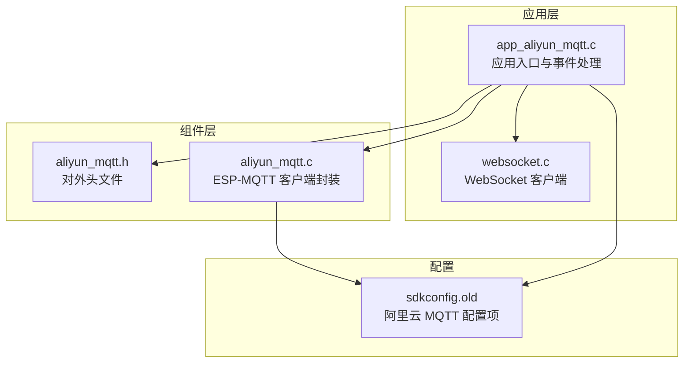
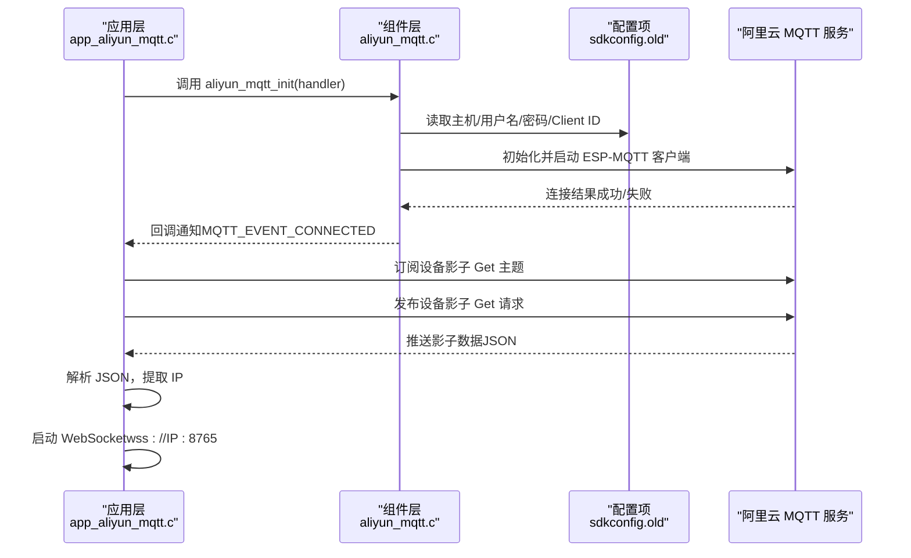
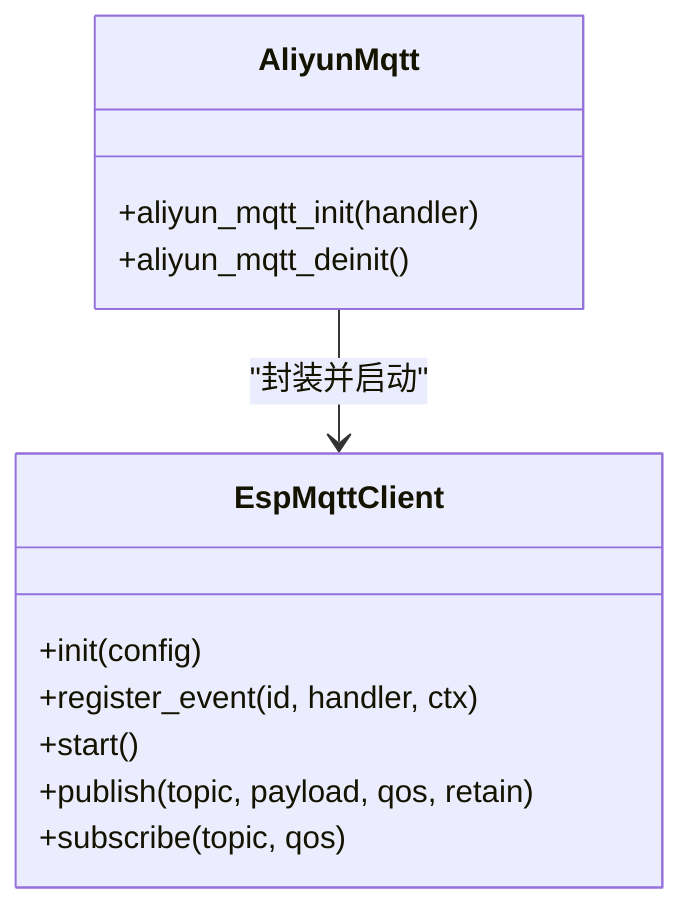
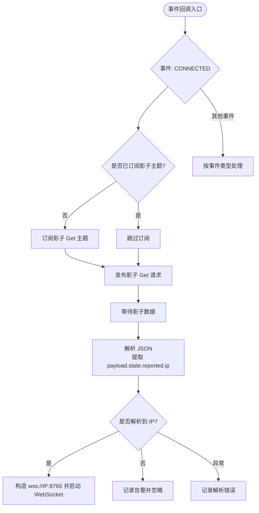
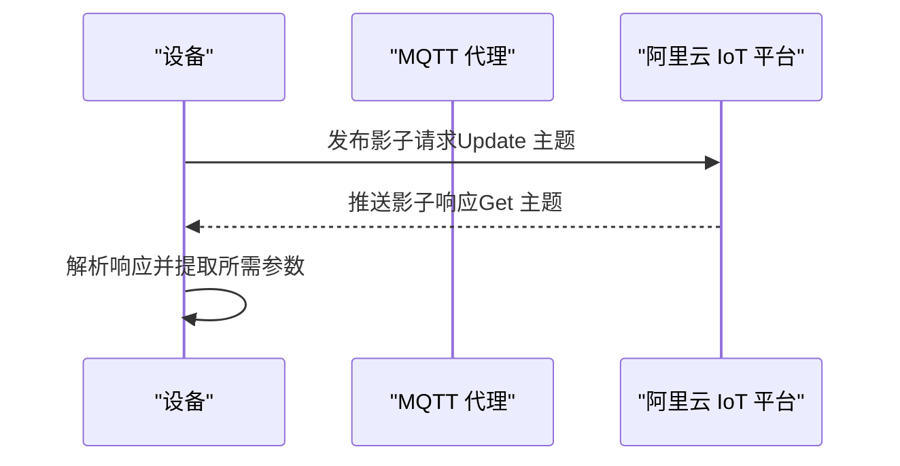
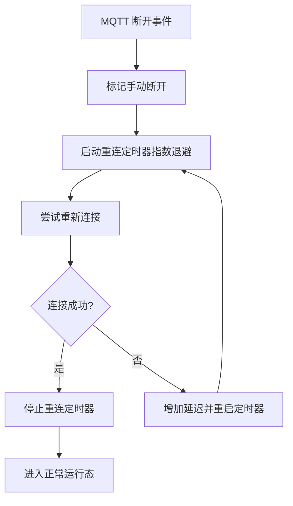
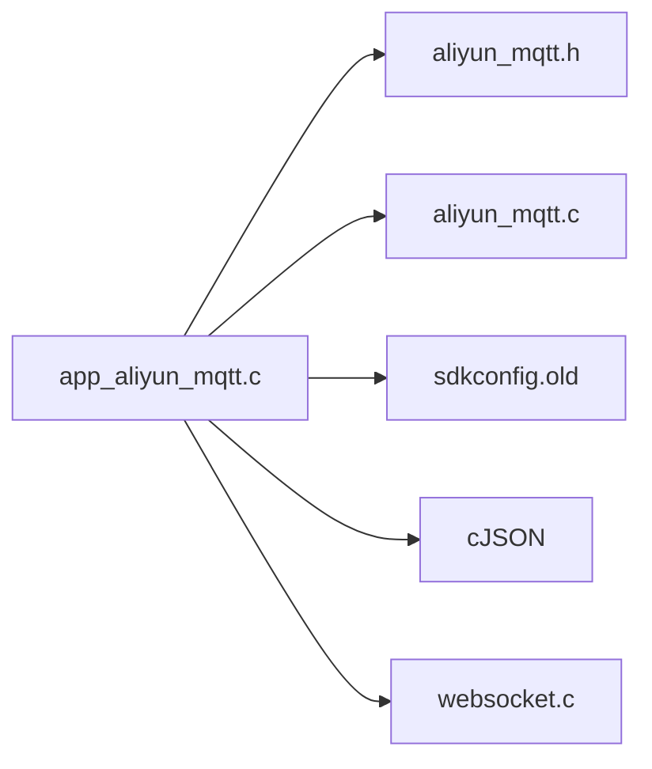

# MQTT 通信 API

<cite>
**本文引用的文件**
- [aliyun_mqtt.h](file://components/aliyun_mqtt/include/aliyun_mqtt.h)
- [aliyun_mqtt.c](file://components/aliyun_mqtt/src/aliyun_mqtt.c)
- [Aliyun MQTT.md](file://components/aliyun_mqtt/doc/Aliyun MQTT.md)
- [app_aliyun_mqtt.c](file://main/app/aliyun/app_aliyun_mqtt.c)
- [app_aliyun_mqtt.h](file://main/app/aliyun/app_aliyun_mqtt.h)
- [sdkconfig.old](file://sdkconfig.old)
- [websocket.c](file://main/app/websocket/websocket.c)
- [websocket.h](file://main/app/websocket/websocket.h)
</cite>

## 目录
1. [简介](#简介)
2. [项目结构](#项目结构)
3. [核心组件](#核心组件)
4. [架构总览](#架构总览)
5. [详细组件分析](#详细组件分析)
6. [依赖关系分析](#依赖关系分析)
7. [性能与可靠性](#性能与可靠性)
8. [故障排查指南](#故障排查指南)
9. [结论](#结论)
10. [附录](#附录)

## 简介
本文件面向使用阿里云物联网平台的嵌入式设备开发者，系统性梳理基于 ESP-IDF 的 MQTT 云端通信 API 设计与实现，覆盖以下要点：
- 客户端初始化、连接建立与认证配置
- 主题订阅、消息发布与回调函数注册
- 设备影子管理（属性上报与命令响应）
- 消息格式与 JSON 结构定义
- 自动重连、心跳保活与网络异常处理
- 设备认证、TLS 加密与安全连接配置
- 云端指令解析、本地处理与状态同步

## 项目结构
该项目采用“组件层 + 应用层”的分层组织方式：
- 组件层：封装阿里云 MQTT 客户端初始化与生命周期管理
- 应用层：负责事件回调、主题订阅、设备影子交互、以及与 WebSocket 的联动

**图表来源**
- [aliyun_mqtt.h:1-28](file://components/aliyun_mqtt/include/aliyun_mqtt.h#L1-L28)
- [aliyun_mqtt.c:1-82](file://components/aliyun_mqtt/src/aliyun_mqtt.c#L1-L82)
- [app_aliyun_mqtt.c:1-193](file://main/app/aliyun/app_aliyun_mqtt.c#L1-L193)
- [sdkconfig.old:2180-2193](file://sdkconfig.old#L2180-L2193)

**章节来源**
- [aliyun_mqtt.h:1-28](file://components/aliyun_mqtt/include/aliyun_mqtt.h#L1-L28)
- [aliyun_mqtt.c:1-82](file://components/aliyun_mqtt/src/aliyun_mqtt.c#L1-L82)
- [app_aliyun_mqtt.c:1-193](file://main/app/aliyun/app_aliyun_mqtt.c#L1-L193)
- [sdkconfig.old:2180-2193](file://sdkconfig.old#L2180-L2193)

## 核心组件
- 阿里云 MQTT 组件（aliyun_mqtt）
  - 提供初始化与反初始化接口，内部完成 ESP-MQTT 客户端的配置、事件注册与启动
- 应用层 MQTT 示例（app_aliyun_mqtt）
  - 注册事件回调，处理连接、订阅、发布、数据接收等
  - 实现设备影子请求与解析，联动 WebSocket 连接
- 配置项（sdkconfig）
  - 包含阿里云 MQTT 主机、端口、用户名、密码、Client ID 以及各类主题名

**章节来源**
- [aliyun_mqtt.h:8-26](file://components/aliyun_mqtt/include/aliyun_mqtt.h#L8-L26)
- [aliyun_mqtt.c:25-68](file://components/aliyun_mqtt/src/aliyun_mqtt.c#L25-L68)
- [app_aliyun_mqtt.c:65-181](file://main/app/aliyun/app_aliyun_mqtt.c#L65-L181)
- [sdkconfig.old:2180-2193](file://sdkconfig.old#L2180-L2193)

## 架构总览
下图展示了从应用初始化到事件驱动处理的整体流程。

**图表来源**
- [aliyun_mqtt.c:25-68](file://components/aliyun_mqtt/src/aliyun_mqtt.c#L25-L68)
- [app_aliyun_mqtt.c:65-181](file://main/app/aliyun/app_aliyun_mqtt.c#L65-L181)
- [sdkconfig.old:2180-2193](file://sdkconfig.old#L2180-L2193)

## 详细组件分析

### 组件一：阿里云 MQTT 客户端封装（aliyun_mqtt）
- 功能职责
  - 读取配置项中的服务器地址、用户名、Client ID、密码
  - 初始化 ESP-MQTT 客户端并注册事件回调
  - 启动连接；提供去初始化接口释放资源
- 关键点
  - 使用 ESP-IDF 内置的 MQTT 客户端库进行连接与事件管理
  - 通过事件处理器将连接状态、订阅确认、发布确认、数据到达、错误等通知上抛给应用层

**图表来源**
- [aliyun_mqtt.c:25-68](file://components/aliyun_mqtt/src/aliyun_mqtt.c#L25-L68)
- [aliyun_mqtt.h:16-23](file://components/aliyun_mqtt/include/aliyun_mqtt.h#L16-L23)

**章节来源**
- [aliyun_mqtt.h:8-26](file://components/aliyun_mqtt/include/aliyun_mqtt.h#L8-L26)
- [aliyun_mqtt.c:25-68](file://components/aliyun_mqtt/src/aliyun_mqtt.c#L25-L68)

### 组件二：应用层事件处理与设备影子交互（app_aliyun_mqtt）
- 功能职责
  - 注册事件回调，处理连接、断开、订阅、取消订阅、发布、数据、错误等事件
  - 在连接成功后订阅设备影子 Get 主题，并主动请求设备影子
  - 解析影子 JSON，提取云端下发的 IP 地址，触发 WebSocket 连接
- 关键点
  - 仅在首次连接时订阅影子主题，避免重复订阅
  - 影子请求采用标准方法字段，发布到影子 Update 主题
  - 使用 JSON 解析库对 payload.state.reported.ip 字段进行提取

**图表来源**
- [app_aliyun_mqtt.c:65-181](file://main/app/aliyun/app_aliyun_mqtt.c#L65-L181)

**章节来源**
- [app_aliyun_mqtt.c:44-63](file://main/app/aliyun/app_aliyun_mqtt.c#L44-L63)
- [app_aliyun_mqtt.c:65-181](file://main/app/aliyun/app_aliyun_mqtt.c#L65-L181)

### 组件三：设备影子管理（属性上报与命令响应）
- 属性上报
  - 使用属性上报主题进行设备属性上传，主题由配置项提供
- 命令响应
  - 云端命令通常通过用户 Topic 下发，设备侧在应用层解析并执行，返回相应结果
- 设备影子
  - 通过 Update/Get 主题进行影子请求与接收，用于同步设备期望状态或获取云端下发的动态参数（如 WebSocket 服务器地址）

**图表来源**
- [app_aliyun_mqtt.c:44-63](file://main/app/aliyun/app_aliyun_mqtt.c#L44-L63)
- [sdkconfig.old:2187-2192](file://sdkconfig.old#L2187-L2192)

**章节来源**
- [app_aliyun_mqtt.c:44-63](file://main/app/aliyun/app_aliyun_mqtt.c#L44-L63)
- [sdkconfig.old:2187-2192](file://sdkconfig.old#L2187-L2192)

### 组件四：消息格式与 JSON 规范
- 设备影子请求
  - 请求体包含方法字段，用于标识操作类型（如 get）
- 影子响应
  - 响应体包含 payload/state/reported 字段，其中 reported 为设备上报的当前状态
  - 示例字段：ip（字符串），用于指示 WebSocket 服务器地址
- 其他主题
  - 属性上报与命令响应的主题由配置项提供，具体负载结构需遵循阿里云平台规范

**章节来源**
- [app_aliyun_mqtt.c:53-54](file://main/app/aliyun/app_aliyun_mqtt.c#L53-L54)
- [app_aliyun_mqtt.c:114-156](file://main/app/aliyun/app_aliyun_mqtt.c#L114-L156)
- [sdkconfig.old:2187-2192](file://sdkconfig.old#L2187-L2192)

### 组件五：自动重连机制、心跳保活与网络异常处理
- MQTT 层
  - 通过 ESP-MQTT 客户端的事件回调感知断开与错误，应用层可在断开事件中触发重连策略
- WebSocket 层
  - 提供完整的自动重连机制：指数退避、最大重连次数、定时器控制、互斥保护
  - 支持心跳保活（Ping）与网络超时配置
- 建议
  - 在 MQTT 断开事件中触发 WebSocket 重连任务，确保网络恢复后自动恢复双向通信

**图表来源**
- [websocket.c:335-338](file://main/app/websocket/websocket.c#L335-L338)
- [websocket.c:444-450](file://main/app/websocket/websocket.c#L444-L450)
- [websocket.c:505-536](file://main/app/websocket/websocket.c#L505-L536)

**章节来源**
- [websocket.c:335-338](file://main/app/websocket/websocket.c#L335-L338)
- [websocket.c:444-450](file://main/app/websocket/websocket.c#L444-L450)
- [websocket.c:505-536](file://main/app/websocket/websocket.c#L505-L536)

### 组件六：设备认证、TLS 加密与安全连接配置
- 设备认证
  - 使用 Client ID、用户名、密码进行认证，Client ID 中包含安全模式与签名方法等参数
- TLS 加密
  - WebSocket 客户端支持 SSL/TLS，可配置自签名证书与跳过 CN 校验选项
  - 项目中提供了自签名证书 PEM，便于开发与测试环境使用
- 建议
  - 生产环境建议使用受信 CA 证书并启用严格校验

**章节来源**
- [sdkconfig.old:2182-2186](file://sdkconfig.old#L2182-L2186)
- [websocket.h:14-35](file://main/app/websocket/websocket.h#L14-L35)
- [websocket.c:359-370](file://main/app/websocket/websocket.c#L359-L370)

## 依赖关系分析
- 组件耦合
  - 应用层依赖阿里云 MQTT 组件提供的初始化与事件回调接口
  - 应用层通过配置项集中管理主题与认证参数，降低硬编码风险
- 外部依赖
  - ESP-MQTT 客户端库：负责底层网络与协议栈
  - cJSON：用于 JSON 解析
  - WebSocket 客户端库：用于与云端 WebSocket 服务通信

**图表来源**
- [app_aliyun_mqtt.c:25-27](file://main/app/aliyun/app_aliyun_mqtt.c#L25-L27)
- [aliyun_mqtt.h:1-28](file://components/aliyun_mqtt/include/aliyun_mqtt.h#L1-L28)
- [aliyun_mqtt.c:10-11](file://components/aliyun_mqtt/src/aliyun_mqtt.c#L10-L11)
- [sdkconfig.old:2180-2193](file://sdkconfig.old#L2180-L2193)

**章节来源**
- [app_aliyun_mqtt.c:25-27](file://main/app/aliyun/app_aliyun_mqtt.c#L25-L27)
- [aliyun_mqtt.c:10-11](file://components/aliyun_mqtt/src/aliyun_mqtt.c#L10-L11)
- [sdkconfig.old:2180-2193](file://sdkconfig.old#L2180-L2193)

## 性能与可靠性
- 连接与事件处理
  - 使用事件驱动模型，避免阻塞；在回调中尽量减少耗时操作，必要时投递任务或队列
- JSON 解析
  - 仅在匹配到影子主题时解析，降低解析开销
- 重连与心跳
  - WebSocket 提供指数退避与定时器控制，建议结合 MQTT 断线事件统一调度
- 资源管理
  - 在去初始化阶段销毁 MQTT 客户端，防止句柄泄漏

[本节为通用指导，不直接分析具体文件]

## 故障排查指南
- 无法连接到 MQTT 服务
  - 检查配置项中的主机、端口、用户名、密码与 Client ID 是否正确
  - 查看事件回调日志，确认是否收到连接失败事件
- 无法订阅或发布
  - 确认主题名称与权限配置一致；检查事件回调中的订阅/发布确认事件
- 影子数据未到达
  - 确认已订阅影子 Get 主题且仅订阅一次；检查请求是否成功发布
  - 检查 JSON 解析路径是否与平台响应一致
- WebSocket 无法建立
  - 检查解析出的 IP 是否有效；确认证书配置与网络可达性
  - 查看重连日志，确认是否达到最大重连次数

**章节来源**
- [app_aliyun_mqtt.c:65-181](file://main/app/aliyun/app_aliyun_mqtt.c#L65-L181)
- [websocket.c:335-338](file://main/app/websocket/websocket.c#L335-L338)

## 结论
该实现以清晰的分层设计将 MQTT 客户端封装与应用逻辑解耦，配合设备影子与 WebSocket 的联动，满足设备与云端的双向通信需求。通过事件驱动与自动重连机制，系统具备良好的健壮性与可维护性。建议在生产环境中进一步完善主题命名规范、JSON 结构校验与证书严格校验策略。

[本节为总结性内容，不直接分析具体文件]

## 附录

### API 参考

- 初始化与去初始化
  - 函数：aliyun_mqtt_init
  - 参数：事件回调函数指针
  - 行为：初始化并启动 MQTT 客户端
  - 返回：无
  - 来源：[aliyun_mqtt.h:16](file://components/aliyun_mqtt/include/aliyun_mqtt.h#L16)

  - 函数：aliyun_mqtt_deinit
  - 行为：销毁 MQTT 客户端并释放资源
  - 返回：无
  - 来源：[aliyun_mqtt.h:23](file://components/aliyun_mqtt/include/aliyun_mqtt.h#L23)

- 应用层入口与影子请求
  - 函数：app_aliyun_mqtt_init
  - 行为：注册事件回调并触发初始化
  - 返回：无
  - 来源：[app_aliyun_mqtt.h:3](file://main/app/aliyun/app_aliyun_mqtt.h#L3)

  - 函数：request_device_shadow
  - 行为：向影子 Update 主题发布 get 请求
  - 返回：无
  - 来源：[app_aliyun_mqtt.h:5](file://main/app/aliyun/app_aliyun_mqtt.h#L5)

### 配置项清单（来自 sdkconfig）
- 服务器地址与端口
  - 配置项：CONFIG_AliYun_MQTT_HOST_URL
  - 默认值：见文件
  - 来源：[sdkconfig.old:2182](file://sdkconfig.old#L2182)

- 认证信息
  - 配置项：CONFIG_AliYun_MQTT_CLIENT_ID、CONFIG_AliYun_MQTT_USERNAME、CONFIG_AliYun_MQTT_PASSWORD
  - 默认值：见文件
  - 来源：[sdkconfig.old:2184-2186](file://sdkconfig.old#L2184-L2186)

- 主题名称
  - 属性上报主题：CONFIG_AliYun_PUBLISH_TOPIC_USER_POST
  - 用户 GET 主题：CONFIG_AliYun_SUBSCRIBE_TOPIC_USER_GET
  - 用户 DATA 主题：CONFIG_AliYun_PUBLISH_TOPIC_USER_UPDATE
  - 属性上报回复主题：CONFIG_AliYun_PUBLISH_TOPIC_USER_POST_REPLY
  - 设备影子 Update 主题：CONFIG_AliYun_SHADOW_UPDATE_TOPIC
  - 设备影子 Get 主题：CONFIG_AliYun_SHADOW_GET_TOPIC
  - 来源：[sdkconfig.old:2187-2192](file://sdkconfig.old#L2187-L2192)

### 事件类型（来自应用层事件处理）
- 连接建立：MQTT_EVENT_CONNECTED
- 连接断开：MQTT_EVENT_DISCONNECTED
- 订阅确认：MQTT_EVENT_SUBSCRIBED
- 取消订阅：MQTT_EVENT_UNSUBSCRIBED
- 发布确认：MQTT_EVENT_PUBLISHED
- 数据到达：MQTT_EVENT_DATA
- 错误事件：MQTT_EVENT_ERROR
- 来源：[app_aliyun_mqtt.c:69-179](file://main/app/aliyun/app_aliyun_mqtt.c#L69-L179)