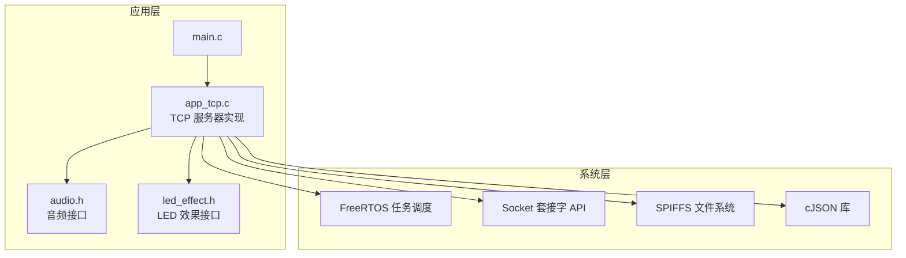
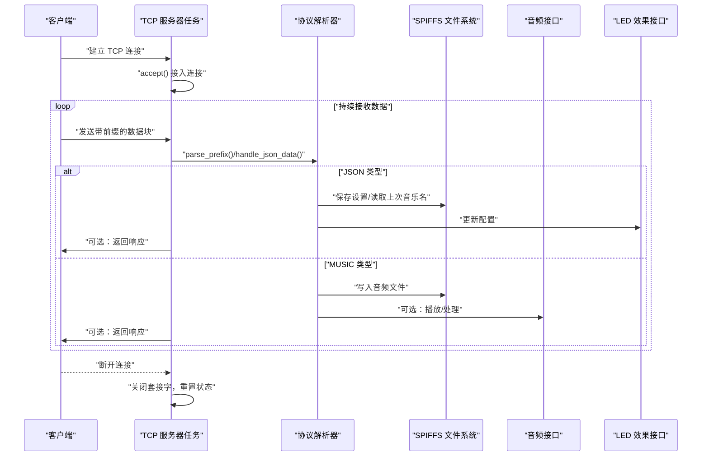
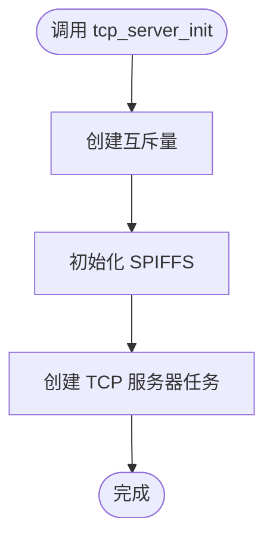
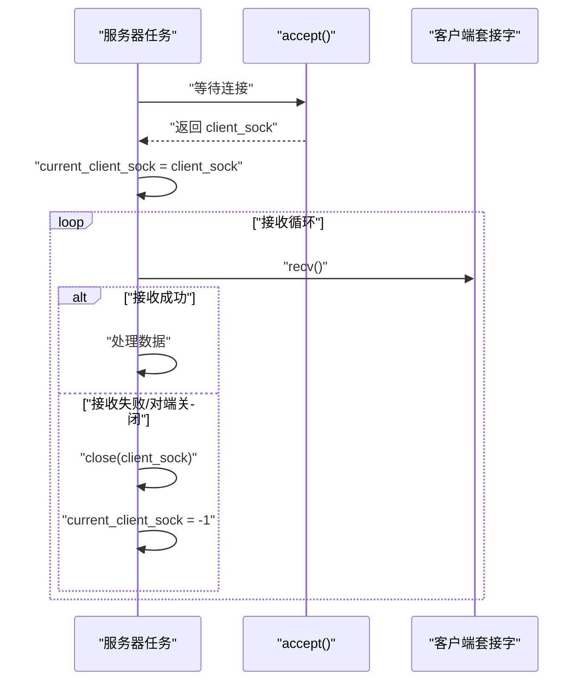
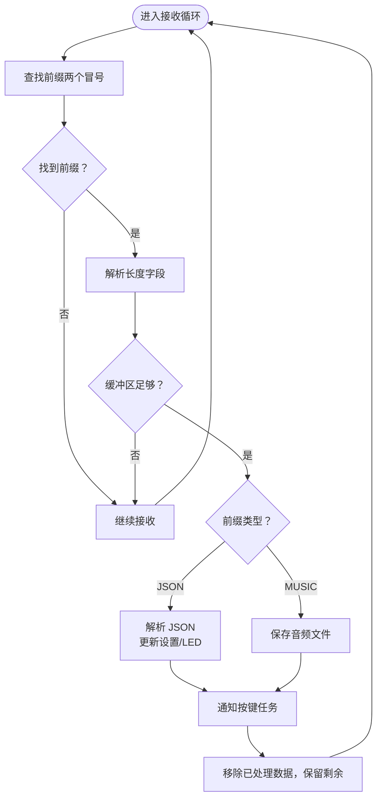
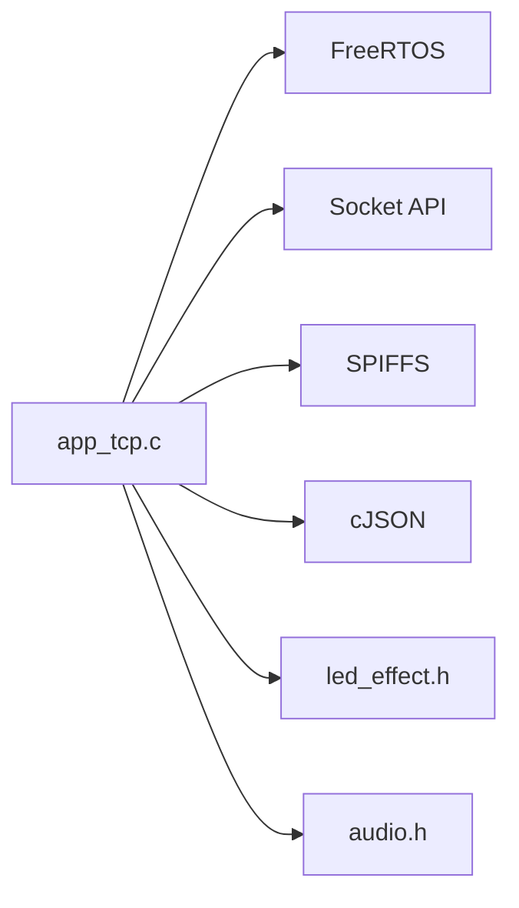

# TCP 通信 API

<cite>
**本文引用的文件**
- [app_tcp.h](file://main/app/tcp/app_tcp.h)
- [app_tcp.c](file://main/app/tcp/app_tcp.c)
- [audio.h](file://main/app/audio/audio.h)
- [led_effect.h](file://main/app/led_strip/led_effect.h)
</cite>

## 目录
1. [简介](#简介)
2. [项目结构](#项目结构)
3. [核心组件](#核心组件)
4. [架构总览](#架构总览)
5. [详细组件分析](#详细组件分析)
6. [依赖关系分析](#依赖关系分析)
7. [性能考虑](#性能考虑)
8. [故障排查指南](#故障排查指南)
9. [结论](#结论)
10. [附录](#附录)

## 简介
本文件面向 TCP 服务器通信模块，提供从初始化、端口绑定与监听、客户端连接接入、会话管理到数据收发的完整 API 文档。文档覆盖以下主题：
- 服务器初始化与监听配置
- 客户端连接接入与会话管理
- 数据收发与协议解析（前缀标记、JSON、音频）
- 连接池与并发处理（单连接串行处理）
- 资源回收与 SPIFFS 文件存储
- 网络异常处理、超时与断线恢复
- 性能监控、流量统计与调试工具使用

## 项目结构
TCP 服务器位于应用层子目录，采用 FreeRTOS 任务驱动的单连接串行处理模型，结合本地 SPIFFS 存储与 JSON 配置管理。

图表来源
- [app_tcp.c:290-352](file://main/app/tcp/app_tcp.c#L290-L352)
- [app_tcp.c:354-359](file://main/app/tcp/app_tcp.c#L354-L359)

章节来源
- [app_tcp.h:1-8](file://main/app/tcp/app_tcp.h#L1-L8)
- [app_tcp.c:25-35](file://main/app/tcp/app_tcp.c#L25-L35)

## 核心组件
- 初始化与监听
  - 接口：tcp_server_init()
  - 功能：创建互斥量、初始化 SPIFFS、启动 TCP 服务器任务
  - 端口：固定端口 8080；最大连接队列 5
- 发送接口
  - 接口：tcp_send_data(const char*, int)
  - 功能：向当前活跃客户端发送数据
  - 并发：通过互斥量保护当前客户端套接字
- 关键任务注册
  - 接口：tcp_register_key_task(TaskHandle_t)
  - 功能：注册按键任务句柄，用于事件通知

章节来源
- [app_tcp.h:4-6](file://main/app/tcp/app_tcp.h#L4-L6)
- [app_tcp.c:354-359](file://main/app/tcp/app_tcp.c#L354-L359)
- [app_tcp.c:65-86](file://main/app/tcp/app_tcp.c#L65-L86)
- [app_tcp.c:59-63](file://main/app/tcp/app_tcp.c#L59-L63)

## 架构总览
TCP 服务器采用“单任务监听 + 单连接串行处理”模式：
- 服务器任务负责创建套接字、绑定端口、进入监听状态
- 接受连接后，直接在当前任务内循环接收数据，不创建额外客户端处理任务
- 使用前缀标记区分数据类型（JSON/MUSIC），并按协议解析与处理
- 成功处理后可通知按键任务触发后续动作

图表来源
- [app_tcp.c:290-352](file://main/app/tcp/app_tcp.c#L290-L352)
- [app_tcp.c:177-195](file://main/app/tcp/app_tcp.c#L177-L195)
- [app_tcp.c:197-222](file://main/app/tcp/app_tcp.c#L197-L222)
- [app_tcp.c:224-244](file://main/app/tcp/app_tcp.c#L224-L244)

## 详细组件分析

### 初始化与监听配置
- 初始化流程
  - 创建互斥量以保护当前客户端套接字
  - 初始化 SPIFFS 分区，确保设置文件与音频文件可读写
  - 启动 TCP 服务器任务，任务栈大小为 6KB
- 监听配置
  - 地址族：AF_INET
  - 绑定地址：任意 IP（INADDR_ANY）
  - 端口：8080
  - 监听队列：5
- 错误处理
  - socket/bind/listen 失败时记录错误并退出任务

图表来源
- [app_tcp.c:354-359](file://main/app/tcp/app_tcp.c#L354-L359)
- [app_tcp.c:107-133](file://main/app/tcp/app_tcp.c#L107-L133)

章节来源
- [app_tcp.c:354-359](file://main/app/tcp/app_tcp.c#L354-L359)
- [app_tcp.c:290-307](file://main/app/tcp/app_tcp.c#L290-L307)

### 客户端连接接入与会话管理
- 接入流程
  - 服务器任务阻塞等待 accept() 返回新连接
  - 记录当前活跃客户端套接字（无锁直接赋值，因单任务串行）
  - 进入接收循环，直到对端关闭或错误
- 会话状态
  - current_client_sock：当前活跃客户端套接字
  - client_sock_mutex：发送路径上的互斥保护
  - 断开后重置为 -1

图表来源
- [app_tcp.c:310-351](file://main/app/tcp/app_tcp.c#L310-L351)

章节来源
- [app_tcp.c:310-351](file://main/app/tcp/app_tcp.c#L310-L351)

### 数据收发与协议解析
- 前缀标记格式
  - JSON:NNNNNN:... 或 MUSIC:NNNNNN:...
  - 其中 NNNNNN 表示数据长度（十进制）
- 解析流程
  - 在接收缓冲区内查找两个冒号，提取长度字段
  - 当缓冲区累计长度达到“前缀长度 + 数据长度”时，判定为完整数据帧
  - 根据前缀类型分别处理 JSON 或 MUSIC
- JSON 处理
  - 解析 JSON，提取 data.music 字段
  - 若缺失则读取上次音乐名并回填
  - 保存设置到 SPIFFS 设置文件
  - 调用 LED 配置更新接口
- 音频处理
  - 以 data.music 作为文件名，写入 /spiffs/{music}.mp3
  - 写入完整性校验
- 发送接口
  - 通过互斥量保护 current_client_sock
  - 调用 send() 发送数据
  - 失败时记录 errno

图表来源
- [app_tcp.c:320-347](file://main/app/tcp/app_tcp.c#L320-L347)
- [app_tcp.c:177-195](file://main/app/tcp/app_tcp.c#L177-L195)
- [app_tcp.c:197-222](file://main/app/tcp/app_tcp.c#L197-L222)
- [app_tcp.c:224-244](file://main/app/tcp/app_tcp.c#L224-L244)
- [app_tcp.c:65-86](file://main/app/tcp/app_tcp.c#L65-L86)

章节来源
- [app_tcp.c:320-347](file://main/app/tcp/app_tcp.c#L320-L347)
- [app_tcp.c:177-195](file://main/app/tcp/app_tcp.c#L177-L195)
- [app_tcp.c:197-222](file://main/app/tcp/app_tcp.c#L197-L222)
- [app_tcp.c:224-244](file://main/app/tcp/app_tcp.c#L224-L244)
- [app_tcp.c:65-86](file://main/app/tcp/app_tcp.c#L65-L86)

### 连接池与并发处理
- 连接池
  - 监听队列为 5，支持最多 5 个待接入连接排队
- 并发模型
  - 服务器任务在单线程内处理一个客户端的完整生命周期
  - 不创建额外客户端处理任务，避免多任务竞争
  - 通过互斥量保护发送路径中的共享变量
- 资源回收
  - 对端断开或错误时关闭套接字并清空当前客户端状态

章节来源
- [app_tcp.c:26-27](file://main/app/tcp/app_tcp.c#L26-L27)
- [app_tcp.c:310-351](file://main/app/tcp/app_tcp.c#L310-L351)
- [app_tcp.c:356](file://main/app/tcp/app_tcp.c#L356)

### 资源回收机制
- 文件系统
  - SPIFFS 初始化时自动格式化失败重试，确保分区可用
  - 设置文件与音频文件均通过标准文件 IO 写入
- 内存与句柄
  - 服务器任务栈大小为 6KB，满足单连接处理需求
  - 互斥量仅在发送路径使用，避免长时间持锁

章节来源
- [app_tcp.c:107-133](file://main/app/tcp/app_tcp.c#L107-L133)
- [app_tcp.c:356](file://main/app/tcp/app_tcp.c#L356)

### 网络异常处理、超时与断线恢复
- 异常处理
  - socket/bind/listen 失败时记录错误并退出任务
  - 发送失败时记录 errno
  - 接收返回非正数视为断开或错误
- 超时
  - 未设置显式 recv 超时；可通过在上层增加 select/recv 超时策略扩展
- 断线恢复
  - 服务器任务在断开后重置状态，等待下一次连接
  - 可在上层客户端实现指数退避重连策略

章节来源
- [app_tcp.c:292-306](file://main/app/tcp/app_tcp.c#L292-L306)
- [app_tcp.c:80-84](file://main/app/tcp/app_tcp.c#L80-L84)
- [app_tcp.c:321](file://main/app/tcp/app_tcp.c#L321)

### 客户端身份验证、权限控制与访问限制
- 身份验证
  - 未实现用户名/密码或证书认证
- 权限控制
  - 未实现基于用户角色的命令授权
- 访问限制
  - 未实现 IP 白名单/黑名单、速率限制等
- 建议
  - 可在接入阶段增加鉴权握手，或在 JSON 中携带令牌字段进行校验

章节来源
- [app_tcp.c:310-351](file://main/app/tcp/app_tcp.c#L310-L351)

### 性能监控、流量统计与调试工具
- 日志输出
  - 使用 ESP_LOGI/ESP_LOGE 输出关键事件与错误
  - 支持原始数据十六进制与可打印字符预览
- 流量统计
  - 未内置字节计数统计
- 调试建议
  - 可在 JSON 处理前后增加时间戳与长度统计
  - 可在发送路径增加发送字节数统计

章节来源
- [app_tcp.c:36](file://main/app/tcp/app_tcp.c#L36)
- [app_tcp.c:88-105](file://main/app/tcp/app_tcp.c#L88-L105)

## 依赖关系分析
- 外部库
  - FreeRTOS：任务、互斥量、通知机制
  - Socket API：TCP 套接字操作
  - SPIFFS：本地文件存储
  - cJSON：JSON 解析与序列化
- 内部接口
  - LED 配置更新：led_update_config_from_json(...)
  - 音频处理：由音频子系统提供（本模块仅触发）

图表来源
- [app_tcp.c:10-24](file://main/app/tcp/app_tcp.c#L10-L24)
- [app_tcp.c:197-222](file://main/app/tcp/app_tcp.c#L197-L222)

章节来源
- [app_tcp.c:10-24](file://main/app/tcp/app_tcp.c#L10-L24)
- [app_tcp.c:197-222](file://main/app/tcp/app_tcp.c#L197-L222)

## 性能考虑
- 单连接串行处理简化了并发复杂度，适合低并发场景
- 接收缓冲区大小为 4KB，建议根据实际数据大小调整
- JSON 处理与文件写入均为同步阻塞，建议在上层增加异步队列解耦
- 可考虑启用 Nagle 或 TCP_NODELAY 以优化小包传输

## 故障排查指南
- 无法绑定端口
  - 检查端口占用与权限
  - 查看 socket/bind/listen 失败日志
- 无法接收数据
  - 检查客户端是否正确发送“前缀:长度:数据”
  - 查看 recv 返回值与 errno
- JSON 解析失败
  - 检查 JSON 结构与 data.music 字段
  - 查看设置文件是否存在且可读
- 音频文件写入失败
  - 检查 SPIFFS 分区容量与权限
  - 确认文件路径与长度匹配

章节来源
- [app_tcp.c:292-306](file://main/app/tcp/app_tcp.c#L292-L306)
- [app_tcp.c:321](file://main/app/tcp/app_tcp.c#L321)
- [app_tcp.c:202-205](file://main/app/tcp/app_tcp.c#L202-L205)
- [app_tcp.c:231-244](file://main/app/tcp/app_tcp.c#L231-L244)

## 结论
本 TCP 服务器模块提供了简洁可靠的单连接处理能力，具备前缀协议解析、JSON 配置下发与音频文件落盘功能。对于高并发与安全需求，可在现有基础上扩展多连接并发模型、鉴权与访问控制、以及更完善的错误恢复与性能监控机制。

## 附录

### API 参考

- 初始化与监听
  - 名称：tcp_server_init
  - 作用：初始化互斥量、SPIFFS，启动服务器任务
  - 参数：无
  - 返回：无
  - 章节来源
    - [app_tcp.c:354-359](file://main/app/tcp/app_tcp.c#L354-L359)

- 发送数据
  - 名称：tcp_send_data
  - 作用：向当前活跃客户端发送数据
  - 参数：data（数据指针）、len（长度）
  - 返回：实际发送字节数，失败返回负值
  - 章节来源
    - [app_tcp.c:65-86](file://main/app/tcp/app_tcp.c#L65-L86)

- 注册按键任务
  - 名称：tcp_register_key_task
  - 作用：注册按键任务句柄，用于事件通知
  - 参数：handle（任务句柄）
  - 返回：无
  - 章节来源
    - [app_tcp.c:59-63](file://main/app/tcp/app_tcp.c#L59-L63)

- 协议格式
  - JSON:NNNNNN:...
  - MUSIC:NNNNNN:...
  - 其中 NNNNNN 为数据长度（十进制）
  - 章节来源
    - [app_tcp.c:177-195](file://main/app/tcp/app_tcp.c#L177-L195)

- JSON 处理流程
  - 解析 JSON，提取 data.music
  - 缺失时读取上次音乐名并回填
  - 保存设置到 /spiffs/setting.json
  - 更新 LED 配置
  - 章节来源
    - [app_tcp.c:197-222](file://main/app/tcp/app_tcp.c#L197-L222)

- 音频文件处理
  - 以 data.music 为文件名写入 /spiffs/{music}.mp3
  - 写入完整性校验
  - 章节来源
    - [app_tcp.c:224-244](file://main/app/tcp/app_tcp.c#L224-L244)