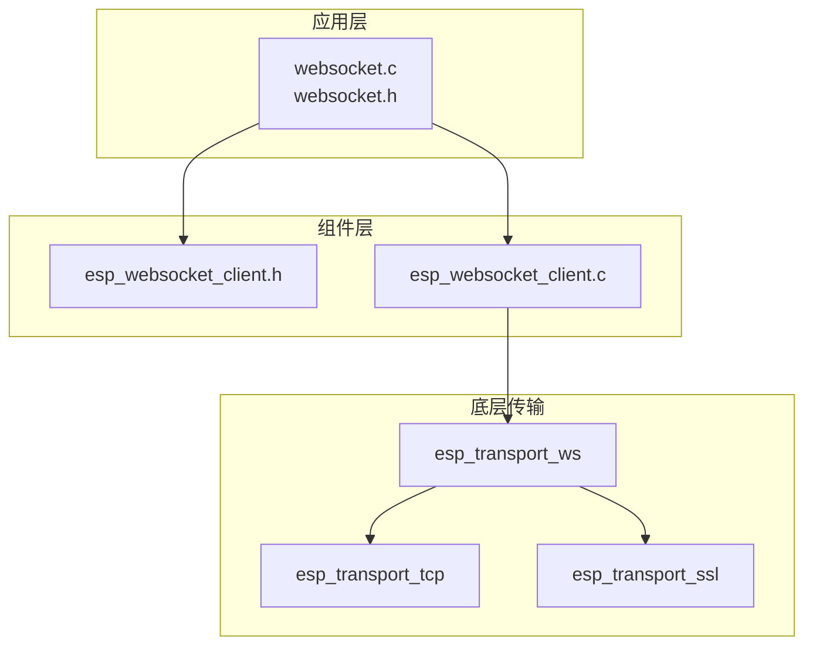
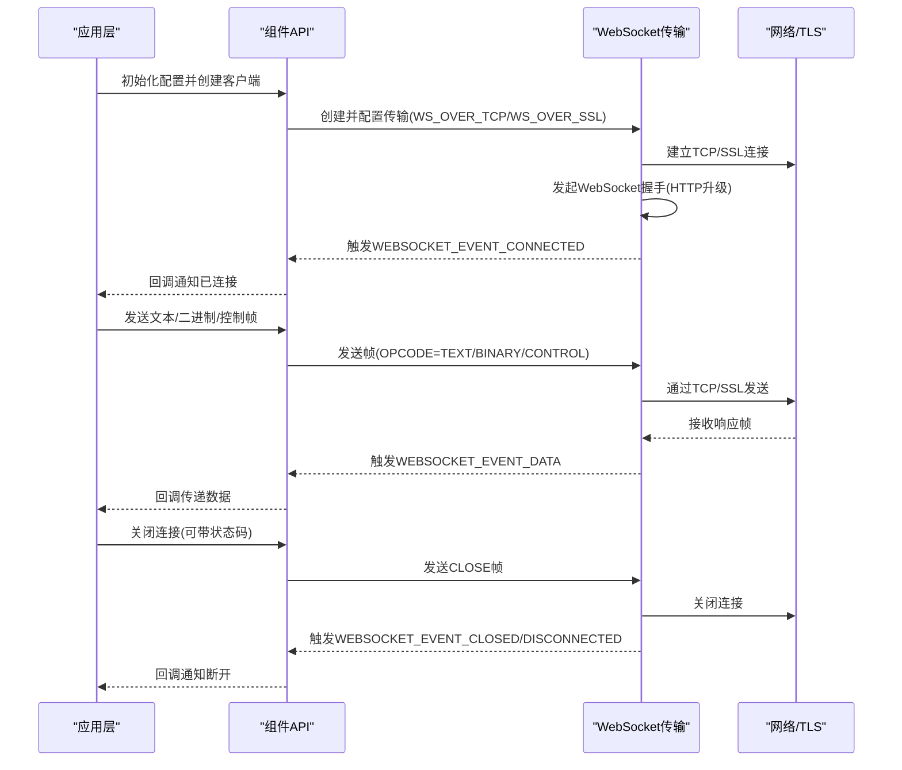
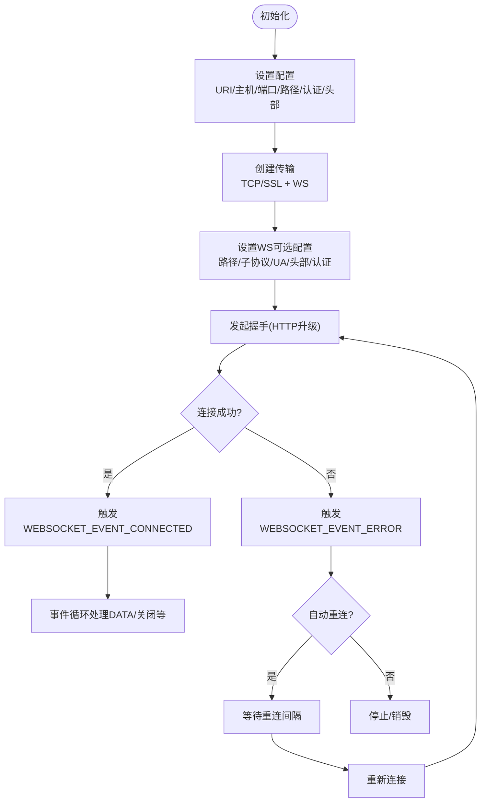
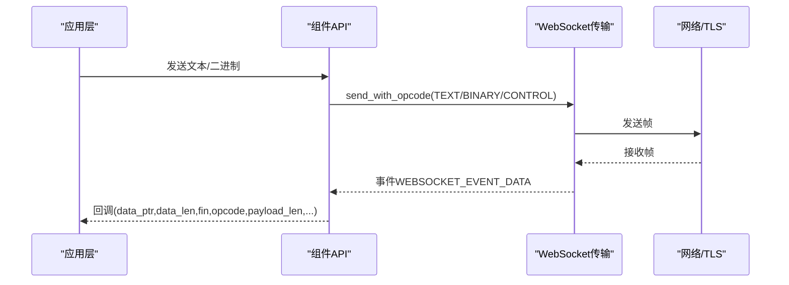
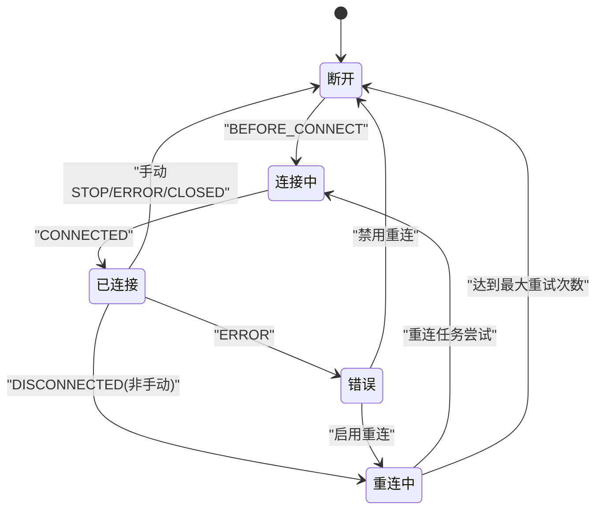
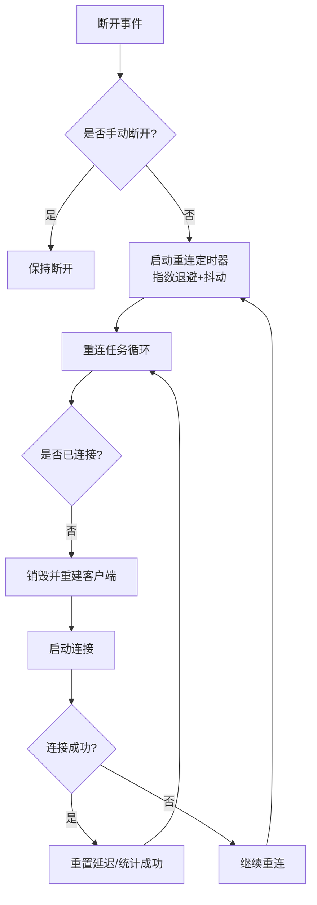
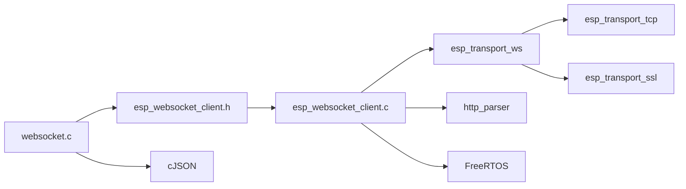

# WebSocket 通信 API

<cite>
**本文引用的文件**
- [esp_websocket_client.h](file://components/esp_websocket_client/esp_websocket_client.h)
- [esp_websocket_client.c](file://components/esp_websocket_client/esp_websocket_client.c)
- [websocket.h](file://main/app/websocket/websocket.h)
- [websocket.c](file://main/app/websocket/websocket.c)
</cite>

## 目录
1. [简介](#简介)
2. [项目结构](#项目结构)
3. [核心组件](#核心组件)
4. [架构总览](#架构总览)
5. [详细组件分析](#详细组件分析)
6. [依赖关系分析](#依赖关系分析)
7. [性能考虑](#性能考虑)
8. [故障排查指南](#故障排查指南)
9. [结论](#结论)
10. [附录](#附录)

## 简介
本文件面向 ESP-IDF 项目中的 WebSocket 客户端实现，提供完整的实时通信 API 文档。内容覆盖客户端初始化、连接建立与握手协议、消息收发与事件回调、连接状态管理、自动重连与异常处理、数据帧格式与文本/二进制处理、URL 配置与 SSL/TLS 支持、心跳检测与保活策略、错误码与日志调试方法等。

## 项目结构
WebSocket 相关代码主要分布在两个层次：
- 组件层：提供标准的 ESP-IDF WebSocket 客户端接口与实现，位于 components/esp_websocket_client。
- 应用层：在 main/app/websocket 提供封装与业务集成，包括事件处理、重连策略、状态机与发送队列等。

**图表来源**
- [websocket.c:359-389](file://main/app/websocket/websocket.c#L359-L389)
- [esp_websocket_client.c:496-599](file://components/esp_websocket_client/esp_websocket_client.c#L496-L599)
- [esp_websocket_client.h:141-233](file://components/esp_websocket_client/esp_websocket_client.h#L141-L233)

**章节来源**
- [websocket.c:359-389](file://main/app/websocket/websocket.c#L359-L389)
- [esp_websocket_client.c:496-599](file://components/esp_websocket_client/esp_websocket_client.c#L496-L599)
- [esp_websocket_client.h:141-233](file://components/esp_websocket_client/esp_websocket_client.h#L141-L233)

## 核心组件
- WebSocket 客户端句柄与事件系统
  - 句柄类型：esp_websocket_client_handle_t
  - 事件基：WEBSOCKET_EVENTS
  - 事件 ID：WEBSOCKET_EVENT_*（连接、断开、数据、错误、关闭、握手前/后等）
- 配置结构体：esp_websocket_client_config_t
  - 支持 URI、主机、端口、路径、认证、子协议、用户代理、附加头部
  - 传输类型：TCP 或 SSL
  - SSL/TLS：服务端证书校验、客户端证书/私钥、证书包、CN 校验开关
  - 心跳与保活：ping 间隔、pong 超时、TCP keep-alive
  - 重连与网络超时：自动重连开关、重连间隔、网络操作超时
  - 缓冲区大小、任务优先级/栈大小、用户上下文
- 发送接口族
  - 文本：esp_websocket_client_send_text(...)
  - 二进制：esp_websocket_client_send_bin(...)
  - 分片：partial/continuation/fin 组合
  - 自定义 opcode：esp_websocket_client_send_with_opcode(...)
  - 关闭：esp_websocket_client_close(...) 与带状态码的关闭
- 连接状态与查询
  - esp_websocket_client_is_connected(...)
  - 心跳间隔查询/设置：esp_websocket_client_get/set_ping_interval_sec(...)
  - 重连超时查询/设置：esp_websocket_client_get/set_reconnect_timeout(...)
- 事件注册与注销
  - esp_websocket_register_events(...)
  - esp_websocket_unregister_events(...)

**章节来源**
- [esp_websocket_client.h:24-481](file://components/esp_websocket_client/esp_websocket_client.h#L24-L481)
- [esp_websocket_client.c:681-800](file://components/esp_websocket_client/esp_websocket_client.c#L681-L800)

## 架构总览
WebSocket 客户端采用“应用封装 + 组件 API + 传输适配”的分层设计：
- 应用层负责业务逻辑、事件回调、重连与保活策略
- 组件层提供统一的 WebSocket 客户端生命周期与发送/接收抽象
- 传输层通过 esp_transport_ws 在 TCP/SSL 上实现 WebSocket 协议

**图表来源**
- [websocket.c:505-555](file://main/app/websocket/websocket.c#L505-L555)
- [esp_websocket_client.c:1212-1279](file://components/esp_websocket_client/esp_websocket_client.c#L1212-L1279)
- [esp_websocket_client.c:1309-1319](file://components/esp_websocket_client/esp_websocket_client.c#L1309-L1319)

## 详细组件分析

### 客户端初始化与连接建立
- 初始化
  - esp_websocket_client_init(...)：分配句柄、事件循环、互斥量、缓冲区、状态位
  - 设置 keep-alive、接口名、锁策略
  - 解析 transport 与 scheme（ws/wss），默认端口 80/443
- 连接启动
  - esp_websocket_client_start(...)：创建传输列表（TCP/SSL + WS），设置可选配置（路径、子协议、用户代理、头部、认证）
  - 触发 WEBSOCKET_EVENT_BEFORE_CONNECT → 握手 → 成功后 WEBSOCKET_EVENT_CONNECTED
- 断开与销毁
  - esp_websocket_client_stop(...)：直接关闭 TCP 连接（无关闭帧）
  - esp_websocket_client_close(...)：发送 CLOSE 帧并等待对端关闭
  - esp_websocket_client_destroy(...)：释放资源

**图表来源**
- [esp_websocket_client.c:681-800](file://components/esp_websocket_client/esp_websocket_client.c#L681-L800)
- [esp_websocket_client.c:496-599](file://components/esp_websocket_client/esp_websocket_client.c#L496-L599)
- [esp_websocket_client.c:1212-1279](file://components/esp_websocket_client/esp_websocket_client.c#L1212-L1279)

**章节来源**
- [esp_websocket_client.c:681-800](file://components/esp_websocket_client/esp_websocket_client.c#L681-L800)
- [esp_websocket_client.c:496-599](file://components/esp_websocket_client/esp_websocket_client.c#L496-L599)
- [esp_websocket_client.c:1212-1279](file://components/esp_websocket_client/esp_websocket_client.c#L1212-L1279)

### 消息发送与接收
- 发送接口
  - 文本/二进制：esp_websocket_client_send_text(...) / esp_websocket_client_send_bin(...)
  - 分片：partial/continuation/fin 组合；支持自定义 opcode
  - 错误处理：写入失败时记录 TLS/套接字错误并触发断开
- 接收与事件
  - 事件类型：WEBSOCKET_EVENT_DATA（含 fin、opcode、payload_len、offset）
  - 应用层示例：解析文本 JSON，执行 LED 控制或音频事件；二进制透传给音频模块

**图表来源**
- [esp_websocket_client.c:1309-1360](file://components/esp_websocket_client/esp_websocket_client.c#L1309-L1360)
- [websocket.c:182-245](file://main/app/websocket/websocket.c#L182-L245)

**章节来源**
- [esp_websocket_client.c:1309-1360](file://components/esp_websocket_client/esp_websocket_client.c#L1309-L1360)
- [websocket.c:182-245](file://main/app/websocket/websocket.c#L182-L245)

### 事件回调与状态管理
- 事件注册
  - esp_websocket_register_events(...)：注册 ANY 事件或指定事件
  - 事件回调中区分：WEBSOCKET_EVENT_CONNECTED/DISCONNECTED/DATA/ERROR/CLOSED/BEFORE_CONNECT
- 应用层状态机
  - WS_STATE_DISCONNECTED/CONNECTING/CONNECTED/RECONNECTING/ERROR
  - 状态切换通过 ws_set_state(...) 与可选的状态回调通知
- 数据回调
  - 文本：解析 JSON 并执行 LED 控制或音频事件
  - 二进制：透传至音频模块或图像处理

**图表来源**
- [websocket.c:94-108](file://main/app/websocket/websocket.c#L94-L108)
- [websocket.c:137-278](file://main/app/websocket/websocket.c#L137-L278)

**章节来源**
- [websocket.c:94-108](file://main/app/websocket/websocket.c#L94-L108)
- [websocket.c:137-278](file://main/app/websocket/websocket.c#L137-L278)

### 自动重连与异常处理
- 组件层
  - 自动重连：disable_auto_reconnect=false 时，在断开后按 reconnect_timeout_ms 等待并重启
  - 异常：WEBSOCKET_EVENT_ERROR，携带 error_type、TLS/套接字错误码
- 应用层
  - 手动重连：ws_reconnect_task() 循环检查连接状态并重建客户端
  - 指数退避与抖动：当前延迟按 1.5 倍增长，不超过最大值，加入随机抖动
  - 手动断开标记：避免重连任务在手动断开场景下误触发

**图表来源**
- [websocket.c:281-348](file://main/app/websocket/websocket.c#L281-L348)
- [websocket.c:292-320](file://main/app/websocket/websocket.c#L292-L320)
- [websocket.c:359-389](file://main/app/websocket/websocket.c#L359-L389)

**章节来源**
- [websocket.c:281-348](file://main/app/websocket/websocket.c#L281-L348)
- [websocket.c:292-320](file://main/app/websocket/websocket.c#L292-L320)
- [websocket.c:359-389](file://main/app/websocket/websocket.c#L359-L389)

### 数据帧格式与文本/二进制处理
- 帧类型
  - TEXT（0x1）、BINARY（0x2）、CONTINUATION（0x0）、CLOSE（0x8）、PING（0x9）、PONG（0xA）
- 分片策略
  - partial/continuation/fin 组合用于大消息分片
  - 最终片段设置 FIN 标志
- 应用层示例
  - 文本：JSON 命令驱动 LED 效果与音频事件
  - 二进制：音频 OPUS 帧、JPEG 图像帧透传

**章节来源**
- [esp_websocket_client.c:1309-1360](file://components/esp_websocket_client/esp_websocket_client.c#L1309-L1360)
- [websocket.c:182-245](file://main/app/websocket/websocket.c#L182-L245)

### WebSocket URL 配置、代理与 SSL/TLS 支持
- URL 与主机
  - 支持通过 uri 或 host/port/path/subprotocol/user_agent/headers 等字段配置
  - 当提供 uri 时，内部解析覆盖部分字段
- 传输与代理
  - transport=WEBSOCKET_TRANSPORT_OVER_TCP 或 OVER_SSL
  - 可通过 ext_transport 外部注入传输句柄
  - 可设置网络接口名称 if_name
- SSL/TLS
  - 服务端证书：cert_pem/cert_len 或 crt_bundle_attach
  - 客户端证书/私钥：client_cert/client_key 或 DS 加密私钥
  - CN 校验：cert_common_name 或 skip_cert_common_name_check
  - 全局 CA：use_global_ca_store

**章节来源**
- [esp_websocket_client.h:97-139](file://components/esp_websocket_client/esp_websocket_client.h#L97-L139)
- [esp_websocket_client.c:496-599](file://components/esp_websocket_client/esp_websocket_client.c#L496-L599)

### 心跳检测与连接保活
- 心跳
  - ping_interval_sec：心跳周期，默认 10 秒
  - pong 超时：pingpong_timeout_sec（默认 120 秒），超时触发断开
  - disable_pingpong_discon：禁用因 PONG 超时断开
- 保活
  - keep_alive_enable/idle/interval/count：启用 TCP 层 keep-alive
- 应用层实践
  - ws_send_opus_task() 通过队列驱动持续发送音频帧，配合心跳维持活跃

**章节来源**
- [esp_websocket_client.h:120-139](file://components/esp_websocket_client/esp_websocket_client.h#L120-L139)
- [websocket.c:458-502](file://main/app/websocket/websocket.c#L458-L502)

### 错误码定义、日志与调试
- 错误类型
  - WEBSOCKET_ERROR_TYPE_TCP_TRANSPORT：底层传输错误
  - WEBSOCKET_ERROR_TYPE_PONG_TIMEOUT：PONG 超时
  - WEBSOCKET_ERROR_TYPE_HANDSHAKE：握手失败
  - WEBSOCKET_ERROR_TYPE_SERVER_CLOSE：服务器主动关闭
- 错误上下文
  - esp_websocket_error_codes_t：包含 esp_tls_last_esp_err、esp_tls_stack_err、esp_tls_cert_verify_flags、esp_ws_handshake_status_code、esp_transport_sock_errno
- 日志
  - 使用 ESP_LOGE/ESP_LOGI/ESP_LOGD 输出错误与状态
  - 事件回调中打印错误类型与系统 errno

**章节来源**
- [esp_websocket_client.h:47-68](file://components/esp_websocket_client/esp_websocket_client.h#L47-L68)
- [websocket.c:247-263](file://main/app/websocket/websocket.c#L247-L263)

## 依赖关系分析
- 组件对外依赖
  - esp_transport_ws：WebSocket 协议封装
  - esp_transport_tcp/esp_transport_ssl：TCP/SSL 传输
  - http_parser：URI/HTTP 解析
  - FreeRTOS：事件、任务、信号量、计时器
- 应用层依赖
  - cJSON：JSON 解析
  - 音频/LED 等业务模块：通过回调与队列交互

**图表来源**
- [websocket.c:12-17](file://main/app/websocket/websocket.c#L12-L17)
- [esp_websocket_client.c:7-25](file://components/esp_websocket_client/esp_websocket_client.c#L7-L25)

**章节来源**
- [websocket.c:12-17](file://main/app/websocket/websocket.c#L12-L17)
- [esp_websocket_client.c:7-25](file://components/esp_websocket_client/esp_websocket_client.c#L7-L25)

## 性能考虑
- 缓冲区大小：buffer_size 默认 1KB，建议根据业务（音频/视频）适当增大
- 发送锁：默认递归互斥，可启用独立 TX 锁以减少竞争
- 事件队列：事件循环队列大小为 1，避免阻塞
- 重连策略：指数退避 + 抖动，避免雪崩
- 心跳与保活：合理设置 ping_interval_sec 与 keep-alive，平衡能耗与稳定性

## 故障排查指南
- 连接失败
  - 检查 URI/主机/端口/路径/认证/头部配置
  - 查看 WEBSOCKET_EVENT_ERROR 中的 error_type 与 TLS/套接字错误码
- 握手失败
  - 确认服务端支持 WebSocket 升级，检查子协议与用户代理
- PONG 超时断开
  - 调整 pingpong_timeout_sec 或提升网络质量
- 发送失败
  - 检查连接状态 esp_websocket_client_is_connected(...)
  - 查看返回值与错误日志，必要时触发断开与重连
- 证书问题
  - 使用 cert_pem 或 crt_bundle_attach；必要时 skip_cert_common_name_check（仅测试环境）

**章节来源**
- [websocket.c:247-263](file://main/app/websocket/websocket.c#L247-L263)
- [esp_websocket_client.c:635-679](file://components/esp_websocket_client/esp_websocket_client.c#L635-L679)

## 结论
该 WebSocket 通信方案在 ESP-IDF 生态中提供了完整、可扩展的实时通信能力。组件层遵循标准接口，应用层通过事件回调、状态机与重连策略实现稳健的业务集成。结合 SSL/TLS、心跳与保活、分片发送与错误处理，能够满足多种物联网与多媒体应用场景。

## 附录

### API 一览（关键）
- 初始化与生命周期
  - esp_websocket_client_init(...)
  - esp_websocket_client_start(...)
  - esp_websocket_client_stop(...)
  - esp_websocket_client_close(...)
  - esp_websocket_client_destroy(...)
- 发送接口
  - esp_websocket_client_send_text(...)
  - esp_websocket_client_send_bin(...)
  - esp_websocket_client_send_with_opcode(...)
  - esp_websocket_client_send_cont_msg(...)
  - esp_websocket_client_send_fin(...)
- 查询与配置
  - esp_websocket_client_is_connected(...)
  - esp_websocket_client_get/set_ping_interval_sec(...)
  - esp_websocket_client_get/set_reconnect_timeout(...)
- 事件
  - esp_websocket_register_events(...)
  - esp_websocket_unregister_events(...)

**章节来源**
- [esp_websocket_client.h:141-476](file://components/esp_websocket_client/esp_websocket_client.h#L141-L476)