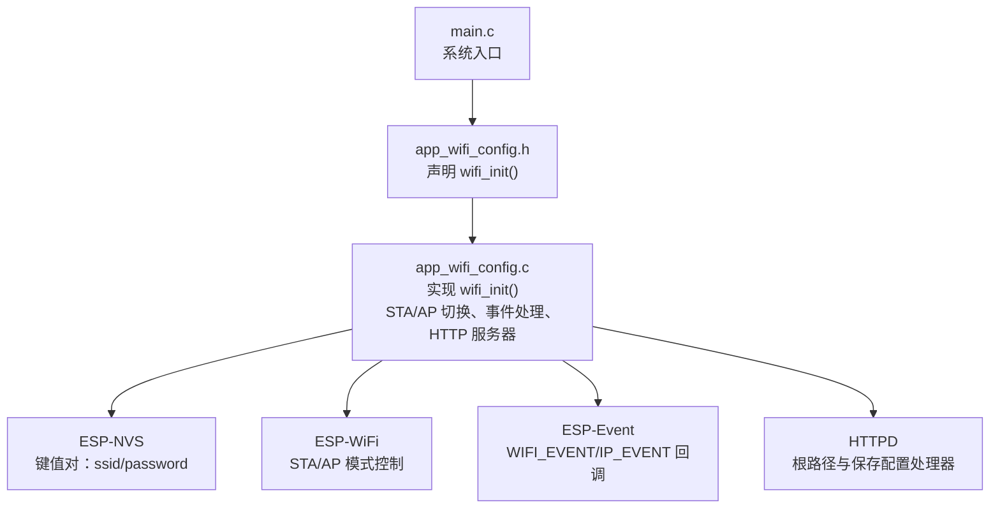
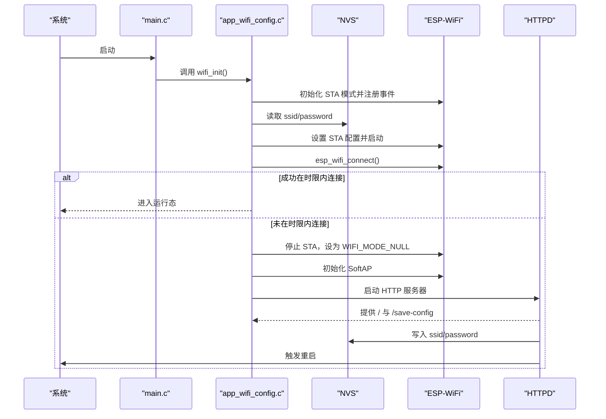
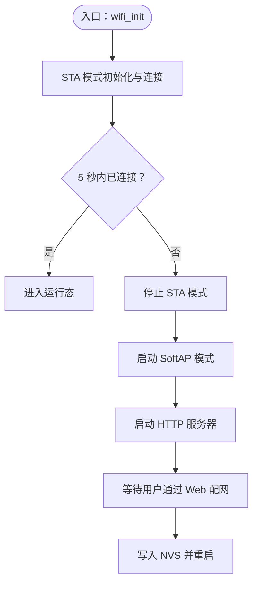
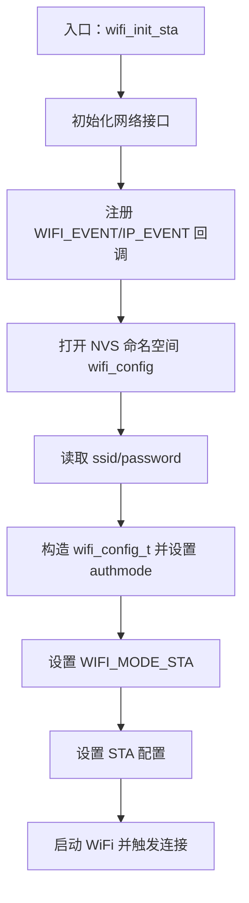
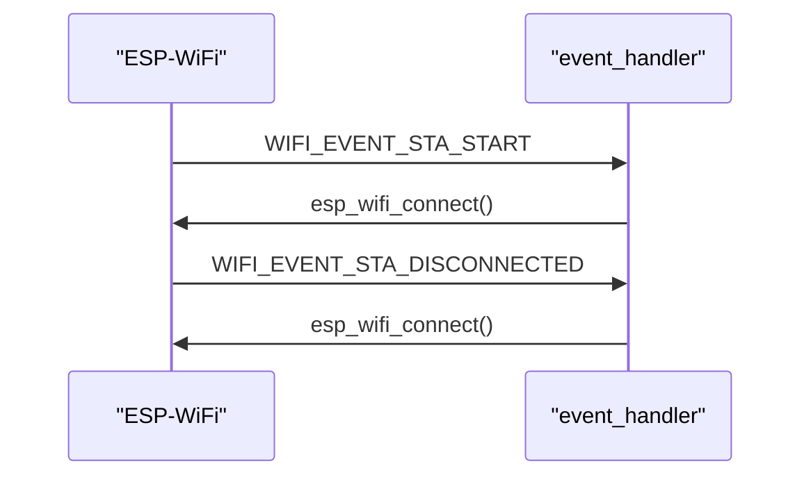
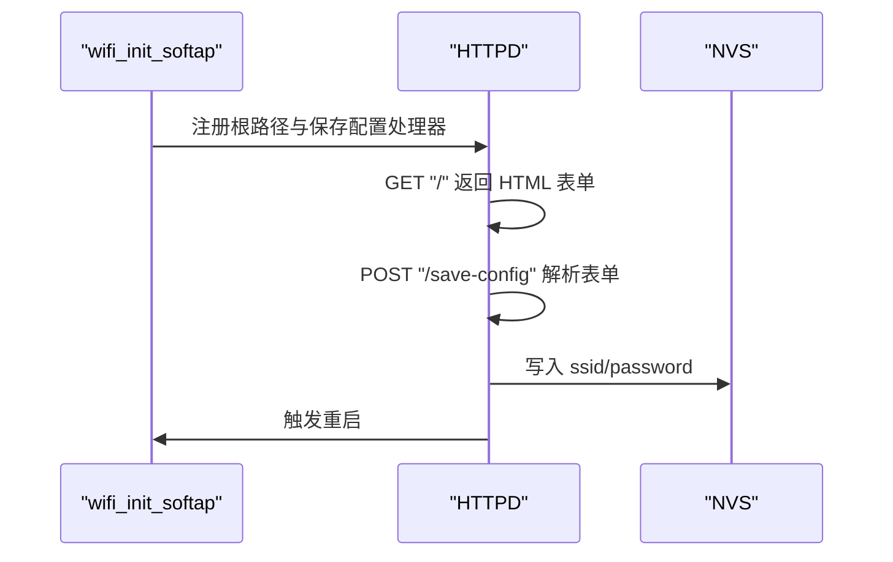
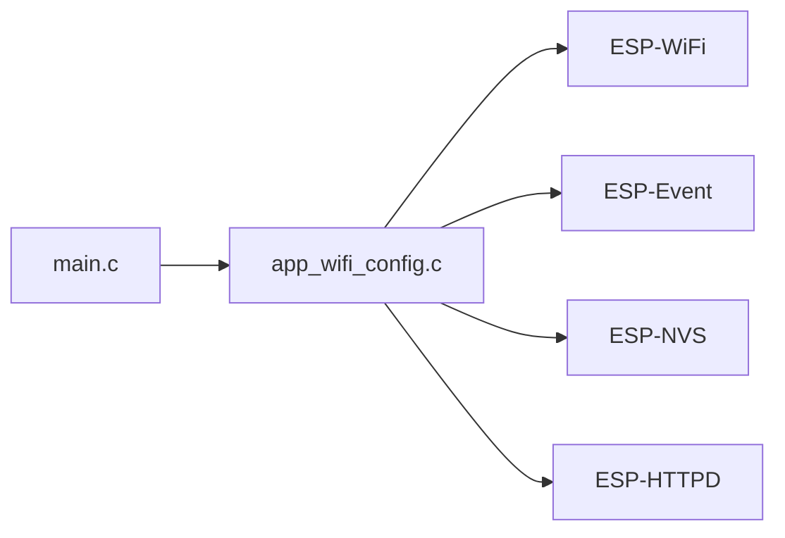

# WiFi 连接 API

<cite>
**本文引用的文件**
- [app_wifi_config.h](file://main/app/wifi/app_wifi_config.h)
- [app_wifi_config.c](file://main/app/wifi/app_wifi_config.c)
- [main.c](file://main/main.c)
</cite>

## 目录
1. [简介](#简介)
2. [项目结构](#项目结构)
3. [核心组件](#核心组件)
4. [架构总览](#架构总览)
5. [详细组件分析](#详细组件分析)
6. [依赖关系分析](#依赖关系分析)
7. [性能考虑](#性能考虑)
8. [故障排除指南](#故障排除指南)
9. [结论](#结论)
10. [附录](#附录)

## 简介
本文件为项目中 WiFi 连接管理的 API 文档，覆盖以下主题：
- WiFi 初始化与模式选择（STA/AP）
- 自动配网流程（Web 配置页面与凭据持久化）
- 连接状态管理与断线重连策略
- WiFi 参数设置、网络扫描与连接建立
- 安全认证选项与网络优先级
- 连接状态查询、断线重连与网络切换
- 配置文件管理、凭据存储与安全保护
- 常见网络问题诊断与故障排除

该实现基于 ESP-IDF 的 WiFi、事件驱动框架、HTTP 服务器与 NVS 存储。

## 项目结构
WiFi 功能位于 main/app/wifi 目录，核心入口为 wifi_init()，负责：
- 尝试以 STA 模式连接已保存的 WiFi 凭据
- 若在限定时间内未连接成功，则进入 AP 模式并通过 Web 页面进行配网
- 将用户输入的 SSID/密码写入 NVS 并重启设备以应用新配置

图表来源
- [app_wifi_config.c:265-302](file://main/app/wifi/app_wifi_config.c#L265-L302)
- [app_wifi_config.h:3](file://main/app/wifi/app_wifi_config.h#L3)
- [main.c:10](file://main/main.c#L10)

章节来源
- [app_wifi_config.h:1-6](file://main/app/wifi/app_wifi_config.h#L1-L6)
- [app_wifi_config.c:1-302](file://main/app/wifi/app_wifi_config.c#L1-L302)
- [main.c:10](file://main/main.c#L10)

## 核心组件
- 初始化与模式选择
  - 函数：wifi_init()
  - 行为：先尝试 STA 连接；若失败则启动 AP 模式与 HTTP 服务器供配网
- STA 模式初始化与连接
  - 从 NVS 读取 ssid/password
  - 设置 authmode（WPA2-PSK 或 OPEN）
  - 注册事件回调处理连接开始与断开
- AP 模式与 Web 配网
  - 启动 SoftAP，开放默认 SSID/密码
  - 提供 HTML 表单提交 SSID/密码
  - 写入 NVS 并重启
- 事件处理
  - WIFI_EVENT_STA_START：触发 esp_wifi_connect()
  - WIFI_EVENT_STA_DISCONNECTED：自动重连
- HTTP 服务器
  - GET /：返回配网页面
  - POST /save-config：解析表单、写入 NVS、重启

章节来源
- [app_wifi_config.c:57-69](file://main/app/wifi/app_wifi_config.c#L57-L69)
- [app_wifi_config.c:102-166](file://main/app/wifi/app_wifi_config.c#L102-L166)
- [app_wifi_config.c:168-219](file://main/app/wifi/app_wifi_config.c#L168-L219)
- [app_wifi_config.c:229-262](file://main/app/wifi/app_wifi_config.c#L229-L262)
- [app_wifi_config.c:265-302](file://main/app/wifi/app_wifi_config.c#L265-L302)

## 架构总览
下图展示了从系统启动到配网完成的关键交互：

图表来源
- [app_wifi_config.c:265-302](file://main/app/wifi/app_wifi_config.c#L265-L302)
- [app_wifi_config.c:102-166](file://main/app/wifi/app_wifi_config.c#L102-L166)
- [app_wifi_config.c:168-219](file://main/app/wifi/app_wifi_config.c#L168-L219)
- [main.c:10](file://main/main.c#L10)

## 详细组件分析

### 组件一：WiFi 初始化与模式选择（wifi_init）
- 功能
  - 尝试以 STA 模式连接已保存的网络
  - 在 5 秒内未连接成功则进入 AP 模式与 Web 配网
- 关键点
  - 使用 esp_wifi_sta_get_ap_info() 判断是否已连接
  - 成功连接后继续运行；否则停止 STA 并切换至 AP
- 可扩展性
  - 可增加“网络扫描”与“多候选网络优先级”逻辑

图表来源
- [app_wifi_config.c:265-302](file://main/app/wifi/app_wifi_config.c#L265-L302)

章节来源
- [app_wifi_config.c:265-302](file://main/app/wifi/app_wifi_config.c#L265-L302)

### 组件二：STA 模式初始化与连接（wifi_init_sta）
- 功能
  - 初始化网络接口与事件处理
  - 从 NVS 读取 ssid/password
  - 设置 authmode（OPEN 或 WPA2-PSK）
  - 启动连接并注册事件回调
- 数据结构
  - saved_wifi_config_t：包含 ssid 与 password 字段
- 错误处理
  - NVS 打开失败或键不存在时提前返回
  - 使用 ESP_ERROR_CHECK_WITHOUT_ABORT 读取 NVS

图表来源
- [app_wifi_config.c:102-166](file://main/app/wifi/app_wifi_config.c#L102-L166)

章节来源
- [app_wifi_config.c:102-166](file://main/app/wifi/app_wifi_config.c#L102-L166)

### 组件三：事件处理（event_handler）
- 功能
  - WIFI_EVENT_STA_START：触发 esp_wifi_connect()
  - WIFI_EVENT_STA_DISCONNECTED：触发 esp_wifi_connect() 实现自动重连
- 影响
  - 保证在网络断开后自动尝试重连

图表来源
- [app_wifi_config.c:57-69](file://main/app/wifi/app_wifi_config.c#L57-L69)

章节来源
- [app_wifi_config.c:57-69](file://main/app/wifi/app_wifi_config.c#L57-L69)

### 组件四：AP 模式与 Web 配网（wifi_init_softap + HTTPD）
- 功能
  - 启动 SoftAP，默认 SSID/WPA 密码与信道
  - 启动 HTTP 服务器，提供根路径与保存配置处理器
- Web 表单
  - 输入字段：ssid、password
  - 提交后写入 NVS 并重启

图表来源
- [app_wifi_config.c:71-100](file://main/app/wifi/app_wifi_config.c#L71-L100)
- [app_wifi_config.c:168-219](file://main/app/wifi/app_wifi_config.c#L168-L219)
- [app_wifi_config.c:229-262](file://main/app/wifi/app_wifi_config.c#L229-L262)

章节来源
- [app_wifi_config.c:71-100](file://main/app/wifi/app_wifi_config.c#L71-L100)
- [app_wifi_config.c:168-219](file://main/app/wifi/app_wifi_config.c#L168-L219)
- [app_wifi_config.c:229-262](file://main/app/wifi/app_wifi_config.c#L229-L262)

### 组件五：配置参数与安全认证
- 参数
  - AP 默认 SSID、密码、信道、最大连接数
  - STA 配置：ssid、password、authmode（OPEN/WPA2-PSK）
- 安全
  - AP 使用 WPA/WPA2 PSK
  - Web 表单明文传输，建议仅在受控网络使用
  - NVS 中以字符串形式存储，建议结合安全启动与分区加密

章节来源
- [app_wifi_config.c:12-16](file://main/app/wifi/app_wifi_config.c#L12-L16)
- [app_wifi_config.c:147-157](file://main/app/wifi/app_wifi_config.c#L147-L157)

## 依赖关系分析
- 外部库与模块
  - ESP-WiFi：WiFi 初始化、STA/AP 模式、事件、连接控制
  - ESP-Event：事件注册与回调
  - ESP-NVS：键值对持久化（ssid/password）
  - ESP-HTTPD：Web 配网界面
- 内部耦合
  - app_wifi_config.c 作为中心协调者，依赖上述模块
  - main.c 仅负责调用 wifi_init()

图表来源
- [app_wifi_config.c:1-12](file://main/app/wifi/app_wifi_config.c#L1-L12)
- [main.c:10](file://main/main.c#L10)

章节来源
- [app_wifi_config.c:1-12](file://main/app/wifi/app_wifi_config.c#L1-L12)
- [main.c:10](file://main/main.c#L10)

## 性能考虑
- 连接超时与轮询
  - 使用固定时限（约 5 秒）检测 STA 是否连接成功
  - 建议根据环境调整时限，避免过短导致误判或过长影响用户体验
- 事件驱动重连
  - 断线自动重连可减少人工干预，但需关注重连频率与功耗
- HTTP 服务器
  - 单线程 HTTPD，适合配网场景；高并发需评估资源占用

## 故障排除指南
- 无法连接已保存的网络
  - 检查 NVS 中 ssid/password 是否正确写入
  - 确认 authmode 与实际网络匹配（OPEN/WPA2-PSK）
  - 查看事件回调日志，确认是否触发重连
- AP 模式无法访问
  - 确认 SoftAP 初始化成功与 HTTPD 已启动
  - 检查默认 SSID/密码与信道设置
- Web 表单提交无效
  - 检查 POST 处理器是否收到数据
  - 确认 NVS 写入与 commit 成功
- 设备未重启应用新配置
  - 确认保存后触发了重启流程

章节来源
- [app_wifi_config.c:123-135](file://main/app/wifi/app_wifi_config.c#L123-L135)
- [app_wifi_config.c:175-219](file://main/app/wifi/app_wifi_config.c#L175-L219)
- [app_wifi_config.c:293-301](file://main/app/wifi/app_wifi_config.c#L293-L301)

## 结论
本 WiFi 连接管理模块提供了完整的“自动配网 + 断线重连”能力：
- 通过 NVS 持久化网络凭据
- 采用事件驱动实现稳定连接
- 提供简单易用的 Web 配网界面
- 可进一步增强为支持网络扫描、多候选网络优先级与更丰富的安全策略

## 附录

### API 一览（按文件组织）
- 文件：main/app/wifi/app_wifi_config.h
  - 函数：wifi_init()
- 文件：main/app/wifi/app_wifi_config.c
  - 函数：wifi_init_sta()、wifi_init_softap()、event_handler()
  - 处理器：root_handler()、save_config_handler()、favicon_handler()
  - HTTP 服务器：start_webserver()

章节来源
- [app_wifi_config.h:3](file://main/app/wifi/app_wifi_config.h#L3)
- [app_wifi_config.c:102-166](file://main/app/wifi/app_wifi_config.c#L102-L166)
- [app_wifi_config.c:168-219](file://main/app/wifi/app_wifi_config.c#L168-L219)
- [app_wifi_config.c:229-262](file://main/app/wifi/app_wifi_config.c#L229-L262)