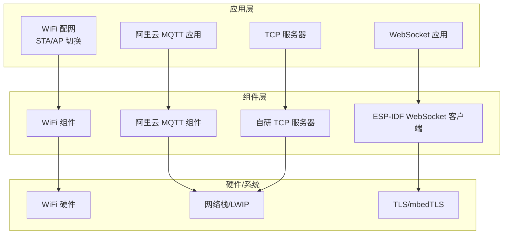
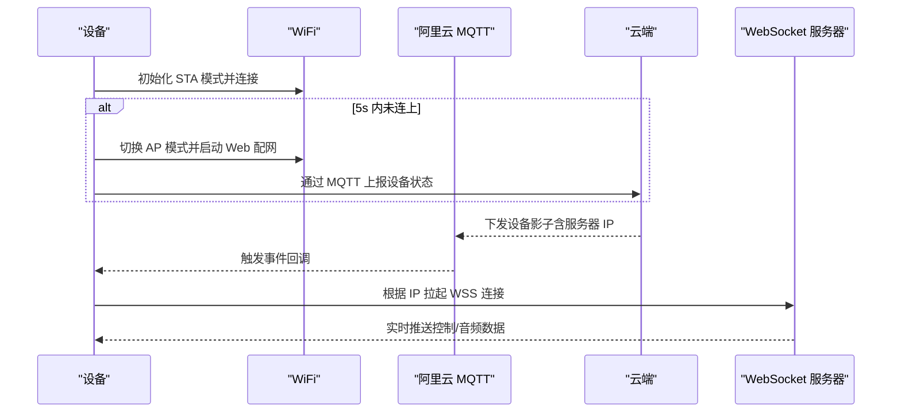
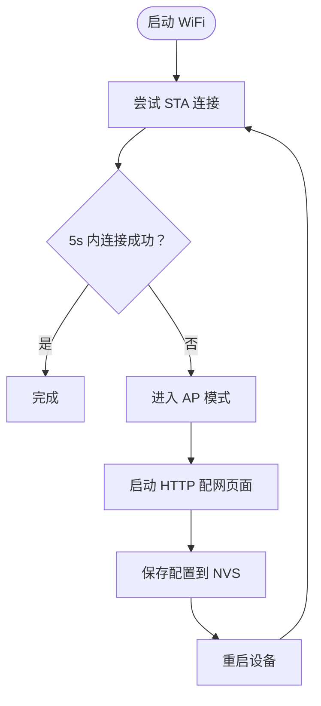
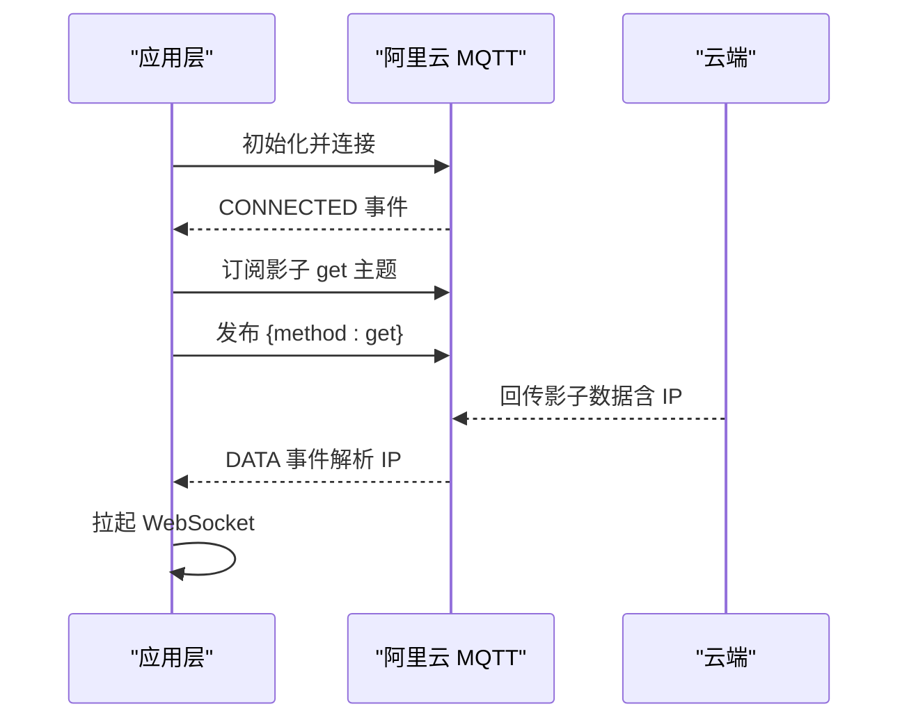
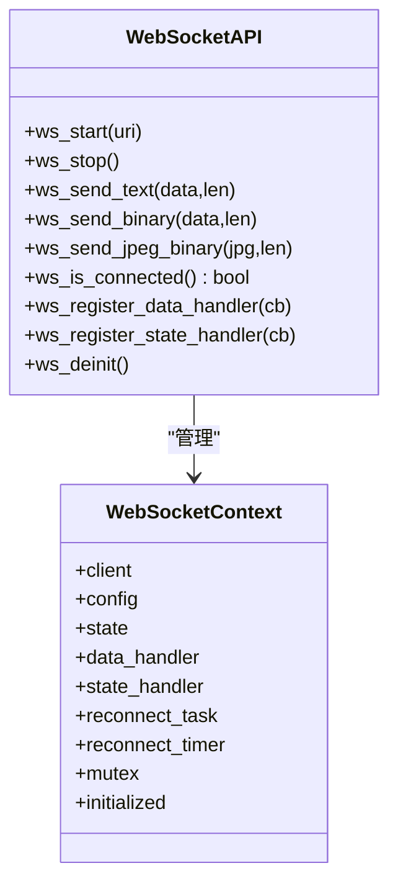
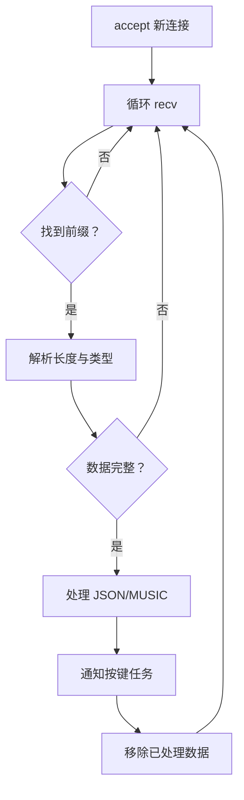
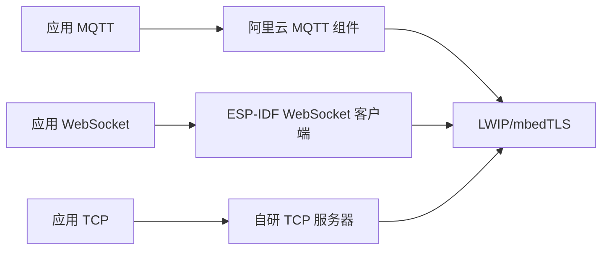

# 网络通信 API

<cite>
**本文档引用的文件**
- [aliyun_mqtt.h](file://components/aliyun_mqtt/include/aliyun_mqtt.h)
- [aliyun_mqtt.c](file://components/aliyun_mqtt/src/aliyun_mqtt.c)
- [esp_websocket_client.h](file://components/esp_websocket_client/esp_websocket_client.h)
- [esp_websocket_client.c](file://components/esp_websocket_client/esp_websocket_client.c)
- [websocket.h](file://main/app/websocket/websocket.h)
- [websocket.c](file://main/app/websocket/websocket.c)
- [app_wifi_config.h](file://main/app/wifi/app_wifi_config.h)
- [app_wifi_config.c](file://main/app/wifi/app_wifi_config.c)
- [app_tcp.h](file://main/app/tcp/app_tcp.h)
- [app_tcp.c](file://main/app/tcp/app_tcp.c)
- [app_aliyun_mqtt.h](file://main/app/aliyun/app_aliyun_mqtt.h)
- [app_aliyun_mqtt.c](file://main/app/aliyun/app_aliyun_mqtt.c)
- [sdkconfig.old](file://sdkconfig.old)
</cite>

## 目录
1. [简介](#简介)
2. [项目结构](#项目结构)
3. [核心组件](#核心组件)
4. [架构总览](#架构总览)
5. [详细组件分析](#详细组件分析)
6. [依赖关系分析](#依赖关系分析)
7. [性能考虑](#性能考虑)
8. [故障排查指南](#故障排查指南)
9. [结论](#结论)
10. [附录](#附录)

## 简介
本文件面向网络通信系统，提供 WiFi 连接管理、MQTT 通信与 WebSocket 连接的完整 API 文档。内容涵盖：
- 网络配置参数、连接状态查询与自动重连机制
- MQTT 发布/订阅接口、消息格式与云端交互协议
- WebSocket 数据传输、帧格式与实时通信使用方法
- TCP 服务器的客户端连接、数据收发与会话管理接口
- 网络安全配置、认证方法与错误处理策略

## 项目结构
该项目采用模块化设计，核心网络能力由以下模块组成：
- WiFi 配网与连接：STA/AP 模式切换、Web 配网页面、NVS 存储
- MQTT 客户端：阿里云 MQTT 客户端封装与事件处理
- WebSocket 客户端：事件驱动、自动重连、证书校验、数据收发
- TCP 服务器：简单明了的 TCP 服务端，支持 JSON/MUSIC 前缀协议
- 应用层集成：MQTT 订阅设备影子，动态拉起 WebSocket

图表来源
- [app_wifi_config.c:265-302](file://main/app/wifi/app_wifi_config.c#L265-L302)
- [aliyun_mqtt.c:70-82](file://components/aliyun_mqtt/src/aliyun_mqtt.c#L70-L82)
- [websocket.c:505-555](file://main/app/websocket/websocket.c#L505-L555)
- [app_tcp.c:289-352](file://main/app/tcp/app_tcp.c#L289-L352)

章节来源
- [app_wifi_config.c:265-302](file://main/app/wifi/app_wifi_config.c#L265-L302)
- [aliyun_mqtt.c:70-82](file://components/aliyun_mqtt/src/aliyun_mqtt.c#L70-L82)
- [websocket.c:505-555](file://main/app/websocket/websocket.c#L505-L555)
- [app_tcp.c:289-352](file://main/app/tcp/app_tcp.c#L289-L352)

## 核心组件
- WiFi 连接管理：STA 模式自动连接，若 5 秒内未连上则进入 AP 模式并启动 Web 配网页面，配置写入 NVS 并重启生效
- MQTT 通信：基于 ESP-MQTT 客户端，封装初始化/去初始化；应用层监听连接事件并订阅设备影子主题，解析云端下发的 IP 动态拉起 WebSocket
- WebSocket 连接：事件驱动，支持 WSS/TLS、证书校验、Ping/Pong、自动重连；提供文本/二进制帧发送接口
- TCP 服务器：监听本地端口，按“前缀:长度:数据”协议解析 JSON/MUSIC，支持音乐文件落盘与 LED 控制

章节来源
- [app_wifi_config.c:102-166](file://main/app/wifi/app_wifi_config.c#L102-L166)
- [app_aliyun_mqtt.c:65-181](file://main/app/aliyun/app_aliyun_mqtt.c#L65-L181)
- [websocket.c:505-702](file://main/app/websocket/websocket.c#L505-L702)
- [app_tcp.c:289-352](file://main/app/tcp/app_tcp.c#L289-L352)

## 架构总览
系统通过 WiFi 接入互联网，MQTT 用于与云端交互（订阅影子获取服务器 IP），随后通过 WebSocket 与云端进行实时双向通信；同时内置 TCP 服务器用于本地调试与控制。

图表来源
- [app_wifi_config.c:276-302](file://main/app/wifi/app_wifi_config.c#L276-L302)
- [app_aliyun_mqtt.c:102-162](file://main/app/aliyun/app_aliyun_mqtt.c#L102-L162)
- [websocket.c:505-555](file://main/app/websocket/websocket.c#L505-L555)

## 详细组件分析

### WiFi 连接管理 API
- 接口
  - wifi_init(): 启动 WiFi，优先尝试 STA 连接；若失败则进入 AP 模式并启动 HTTP 服务器用于配网
- 关键行为
  - STA：从 NVS 读取 SSID/密码，设置认证模式，启动连接
  - AP：启动软 AP，开放 Web 页面，提交表单后写入 NVS 并重启
  - 超时：STA 连接等待最多 5 秒，超时则进入 AP 模式
- 配置参数
  - SSID/密码存储于 NVS 键值对
  - AP 默认参数：SSID、密码、信道、最大连接数
- 状态查询
  - 通过事件回调与状态机判断连接状态
- 自动重连
  - WiFi 事件处理中自动重试连接

图表来源
- [app_wifi_config.c:276-302](file://main/app/wifi/app_wifi_config.c#L276-L302)

章节来源
- [app_wifi_config.h:3-5](file://main/app/wifi/app_wifi_config.h#L3-L5)
- [app_wifi_config.c:102-166](file://main/app/wifi/app_wifi_config.c#L102-L166)
- [app_wifi_config.c:276-302](file://main/app/wifi/app_wifi_config.c#L276-L302)

### MQTT 通信 API
- 接口
  - aliyun_mqtt_init(app_mqtt_event_handler): 初始化并启动 MQTT 客户端
  - aliyun_mqtt_deinit(): 去初始化，释放资源
- 配置参数
  - 服务器地址、用户名、Client ID、密码、鉴权方式
- 事件处理
  - 连接成功：订阅设备影子 get 主题
  - 订阅成功：请求设备影子（method=get）
  - 数据事件：解析 payload.state.reported.ip，动态生成 WSS 地址并启动 WebSocket
  - 错误事件：日志记录
- 自动重连
  - 由 ESP-MQTT 客户端内部处理，应用层通过事件感知

图表来源
- [aliyun_mqtt.h:16-23](file://components/aliyun_mqtt/include/aliyun_mqtt.h#L16-L23)
- [aliyun_mqtt.c:70-82](file://components/aliyun_mqtt/src/aliyun_mqtt.c#L70-L82)
- [app_aliyun_mqtt.c:65-181](file://main/app/aliyun/app_aliyun_mqtt.c#L65-L181)

章节来源
- [aliyun_mqtt.h:16-23](file://components/aliyun_mqtt/include/aliyun_mqtt.h#L16-L23)
- [aliyun_mqtt.c:25-82](file://components/aliyun_mqtt/src/aliyun_mqtt.c#L25-L82)
- [app_aliyun_mqtt.h:3-5](file://main/app/aliyun/app_aliyun_mqtt.h#L3-L5)
- [app_aliyun_mqtt.c:65-181](file://main/app/aliyun/app_aliyun_mqtt.c#L65-L181)

### WebSocket 连接 API
- 接口
  - ws_start(uri): 启动客户端，创建并注册事件处理器
  - ws_stop()/ws_deinit(): 停止与反初始化
  - ws_send_text()/ws_send_binary()/ws_send_jpeg_binary(): 发送文本/二进制/JPEG
  - ws_is_connected(): 查询连接状态
  - ws_register_data_handler()/ws_register_state_handler(): 注册回调
- 配置参数
  - URI（wss://…）、证书（PEM）、Ping 间隔、缓冲区大小、网络超时、重连策略
- 自动重连
  - 内置重连任务与定时器，指数回退并抖动；手动断开与异常断开区分处理
- 事件模型
  - CONNECTED/DISCONNECTED/DATA/ERROR/CLOSED/BEGIN/FINISH
- 帧格式
  - 文本帧（opcode=1）、二进制帧（opcode=2），支持分片与 FIN 控制
- 安全配置
  - 支持证书校验、跳过 CN 校验、全局 CA、客户端证书/私钥（PEM/DER）

图表来源
- [websocket.h:37-108](file://main/app/websocket/websocket.h#L37-L108)
- [websocket.c:505-702](file://main/app/websocket/websocket.c#L505-L702)

章节来源
- [esp_websocket_client.h:141-482](file://components/esp_websocket_client/esp_websocket_client.h#L141-L482)
- [websocket.h:37-108](file://main/app/websocket/websocket.h#L37-L108)
- [websocket.c:505-702](file://main/app/websocket/websocket.c#L505-L702)

### TCP 服务器 API
- 接口
  - tcp_server_init(): 初始化 SPIFFS、创建服务器任务
  - tcp_send_data(data,len): 向当前客户端发送数据
  - tcp_register_key_task(handle): 注册按键任务句柄
- 协议
  - 前缀协议：JSON:nnnnnn: 或 MUSIC:nnnnnn:，其中 nnnnnn 为数据长度
  - JSON：解析并更新 LED 配置，持久化设置
  - MUSIC：将音频数据写入 /spiffs/<music>.mp3
- 会话管理
  - 单连接模型，仅维护当前客户端套接字
  - 接收线程内循环处理，支持粘包拆包

图表来源
- [app_tcp.c:289-352](file://main/app/tcp/app_tcp.c#L289-L352)

章节来源
- [app_tcp.h:4-8](file://main/app/tcp/app_tcp.h#L4-L8)
- [app_tcp.c:289-352](file://main/app/tcp/app_tcp.c#L289-L352)

## 依赖关系分析
- 组件耦合
  - 应用层通过事件回调解耦 MQTT 与 WebSocket
  - WebSocket 与 TLS 组件解耦，支持证书配置
  - TCP 服务器独立运行，与主业务通过通知机制交互
- 外部依赖
  - ESP-MQTT、ESP-WebSocket、LWIP、mbedTLS、NVS、SPIFFS

图表来源
- [aliyun_mqtt.c:70-82](file://components/aliyun_mqtt/src/aliyun_mqtt.c#L70-L82)
- [websocket.c:505-555](file://main/app/websocket/websocket.c#L505-L555)
- [app_tcp.c:289-352](file://main/app/tcp/app_tcp.c#L289-L352)

章节来源
- [aliyun_mqtt.c:70-82](file://components/aliyun_mqtt/src/aliyun_mqtt.c#L70-L82)
- [websocket.c:505-555](file://main/app/websocket/websocket.c#L505-L555)
- [app_tcp.c:289-352](file://main/app/tcp/app_tcp.c#L289-L352)

## 性能考虑
- WebSocket
  - 缓冲区大小、Ping 间隔、网络超时可调；建议根据带宽与延迟优化
  - 分片发送与 FIN 控制减少内存峰值
- TCP 服务器
  - 单连接简化逻辑，适合本地调试；生产环境建议多连接/队列化
  - 前缀协议避免阻塞式读取，提高吞吐
- TLS
  - 证书校验与全局 CA 可平衡安全性与兼容性

## 故障排查指南
- WiFi
  - 若 STA 无法连接，确认 NVS 中 SSID/密码正确；检查 AP 模式是否正常启动
  - 日志中关注连接事件与重试次数
- MQTT
  - 订阅/发布失败：检查主题名称与权限；确认云端影子数据格式
  - 事件回调中打印错误码，定位问题
- WebSocket
  - 连接失败：检查 URI、证书、Ping 超时；查看 ERROR 事件中的错误类型
  - 断线重连：观察重连任务与定时器状态，确认指数回退参数
- TCP
  - 无法接收完整数据：检查前缀协议与长度字段
  - 文件写入失败：确认 SPIFFS 是否挂载成功与分区标签一致

章节来源
- [app_wifi_config.c:102-166](file://main/app/wifi/app_wifi_config.c#L102-L166)
- [app_aliyun_mqtt.c:171-179](file://main/app/aliyun/app_aliyun_mqtt.c#L171-L179)
- [websocket.c:247-278](file://main/app/websocket/websocket.c#L247-L278)
- [app_tcp.c:224-244](file://main/app/tcp/app_tcp.c#L224-L244)

## 结论
本系统提供了从 WiFi 配网、MQTT 云端交互到 WebSocket 实时通信与 TCP 本地控制的完整链路。通过事件驱动与模块化设计，具备良好的扩展性与可维护性。建议在生产环境中进一步完善：
- MQTT 与 WebSocket 的统一错误上报与告警
- TCP 服务器的多连接与限流策略
- TLS 证书轮换与密钥管理

## 附录

### 网络安全配置要点
- TLS 与证书
  - 支持 PEM/DER 证书与客户端证书/私钥
  - 可启用全局 CA 或指定证书；可跳过 CN 校验（开发阶段）
- mbedTLS 配置参考
  - 客户端/服务端 TLS、ALPN、会话票据、SHA512、RSA/ECC 等

章节来源
- [esp_websocket_client.h:117-139](file://components/esp_websocket_client/esp_websocket_client.h#L117-L139)
- [websocket.h:14-35](file://main/app/websocket/websocket.h#L14-L35)
- [sdkconfig.old:1751-1815](file://sdkconfig.old#L1751-L1815)