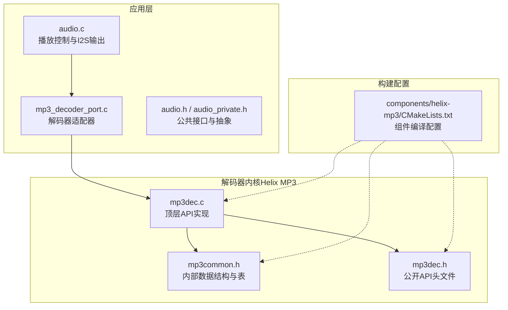
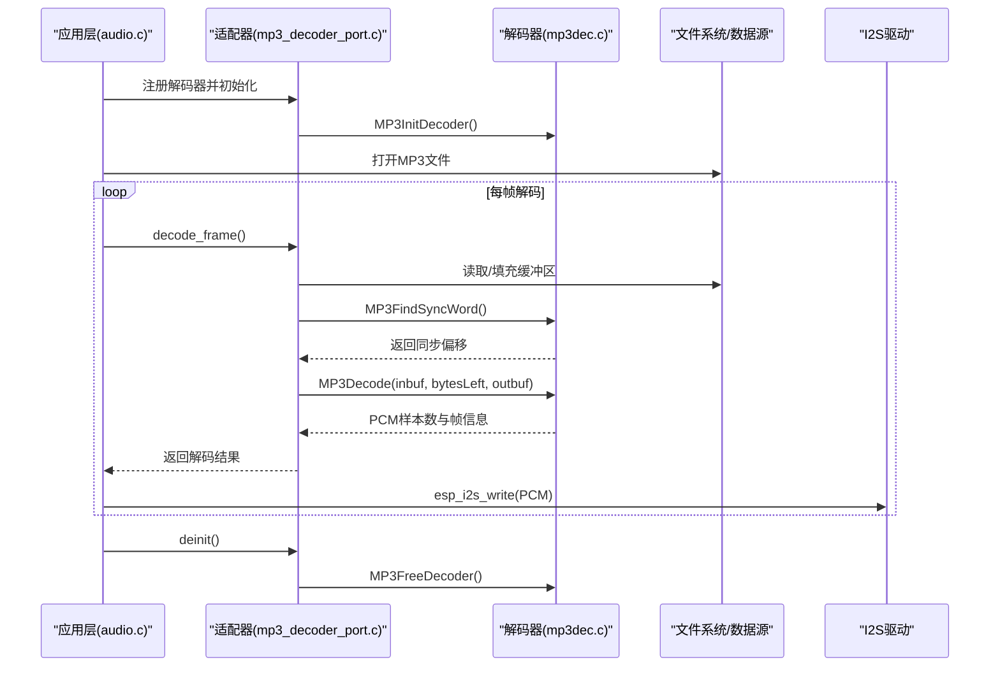
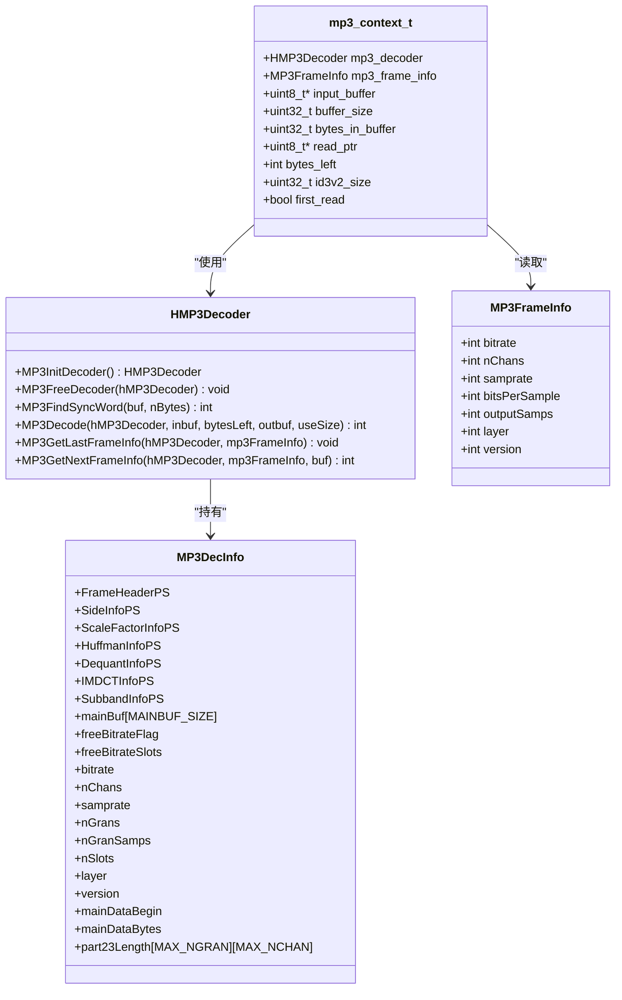
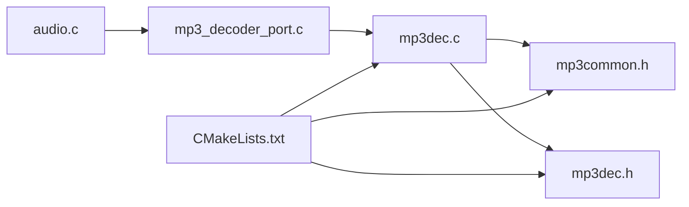

# MP3 解码器 API

<cite>
**本文档引用的文件**
- [mp3dec.h](file://components/helix-mp3/fixpnt/pub/mp3dec.h)
- [mp3common.h](file://components/helix-mp3/fixpnt/pub/mp3common.h)
- [mp3dec.c](file://components/helix-mp3/fixpnt/mp3dec.c)
- [mp3_decoder_port.c](file://main/app/audio/mp3_decoder_port.c)
- [audio.h](file://main/app/audio/audio.h)
- [audio_private.h](file://main/app/audio/audio_private.h)
- [audio.c](file://main/app/audio/audio.c)
- [CMakeLists.txt](file://components/helix-mp3/CMakeLists.txt)
</cite>

## 目录
1. [简介](#简介)
2. [项目结构](#项目结构)
3. [核心组件](#核心组件)
4. [架构概览](#架构概览)
5. [详细组件分析](#详细组件分析)
6. [依赖关系分析](#依赖关系分析)
7. [性能考量](#性能考量)
8. [故障排查指南](#故障排查指南)
9. [结论](#结论)
10. [附录](#附录)

## 简介
本文件面向嵌入式平台（ESP-IDF）提供 MP3 解码器 API 的完整技术文档。内容涵盖：
- 解码器初始化与生命周期管理
- 音频格式检测与帧同步
- 解码参数配置与 PCM 输出处理
- MP3 特有选项：层选择、采样率处理、声道模式识别与错误处理
- 嵌入式环境下的内存优化策略与实时性能考虑
- 实际代码示例路径与常见问题解决方案

## 项目结构
MP3 解码能力由两部分组成：
- Helix MP3 固定点库（组件级），提供标准 MP3 解码 API 与实现细节
- 应用层适配器（main 组件），封装文件/流数据源、内存管理与 I2S 输出

**图表来源**
- [audio.c](file://main/app/audio/audio.c)
- [mp3_decoder_port.c](file://main/app/audio/mp3_decoder_port.c)
- [mp3dec.c](file://components/helix-mp3/fixpnt/mp3dec.c)
- [mp3common.h](file://components/helix-mp3/fixpnt/pub/mp3common.h)
- [mp3dec.h](file://components/helix-mp3/fixpnt/pub/mp3dec.h)
- [CMakeLists.txt](file://components/helix-mp3/CMakeLists.txt)

**章节来源**
- [audio.c](file://main/app/audio/audio.c)
- [mp3_decoder_port.c](file://main/app/audio/mp3_decoder_port.c)
- [mp3dec.c](file://components/helix-mp3/fixpnt/mp3dec.c)
- [mp3common.h](file://components/helix-mp3/fixpnt/pub/mp3common.h)
- [mp3dec.h](file://components/helix-mp3/fixpnt/pub/mp3dec.h)
- [CMakeLists.txt](file://components/helix-mp3/CMakeLists.txt)

## 核心组件
- 公开 API（来自 Helix MP3）：初始化、释放、解码、帧信息查询、同步字查找
- 应用适配器：负责内存分配策略（强制内部 RAM）、ID3v2 头部跳过、缓冲区管理、错误处理与 PCM 输出
- 播放控制：统一的解码器注册、初始化、循环解码与 I2S 写入

关键接口与职责：
- 解码器句柄与上下文：HMP3Decoder、MP3DecInfo、MP3FrameInfo
- 生命周期：MP3InitDecoder、MP3FreeDecoder
- 解码流程：MP3FindSyncWord、MP3Decode、MP3GetLastFrameInfo
- 应用适配：mp3_init、mp3_decode_frame、mp3_deinit、decoder_ops_register

**章节来源**
- [mp3dec.h](file://components/helix-mp3/fixpnt/pub/mp3dec.h)
- [mp3common.h](file://components/helix-mp3/fixpnt/pub/mp3common.h)
- [mp3dec.c](file://components/helix-mp3/fixpnt/mp3dec.c)
- [mp3_decoder_port.c](file://main/app/audio/mp3_decoder_port.c)
- [audio_private.h](file://main/app/audio/audio_private.h)

## 架构概览
下图展示了从文件读取到 PCM 输出的端到端流程。

**图表来源**
- [audio.c](file://main/app/audio/audio.c)
- [mp3_decoder_port.c](file://main/app/audio/mp3_decoder_port.c)
- [mp3dec.c](file://components/helix-mp3/fixpnt/mp3dec.c)

## 详细组件分析

### 公开 API 规范（Helix MP3）
- 句柄与错误码
  - HMP3Decoder：解码器实例句柄
  - 错误码：ERR_MP3_*，覆盖输入不足、帧头/侧信息/尺度因子/Huffman/反变换/子带等错误
- 关键函数
  - MP3InitDecoder：分配内部状态并返回句柄
  - MP3FreeDecoder：释放内部状态
  - MP3FindSyncWord：在原始流中查找同步字
  - MP3Decode：解码一帧，输出 PCM（交错格式）
  - MP3GetLastFrameInfo：获取上一帧的采样率、声道数、采样数等
  - MP3GetNextFrameInfo：解析下一帧头（仅当确认层为 Layer 3 时有效）

复杂度与数据结构要点：
- MP3DecInfo：包含帧头、侧信息、尺度因子、Huffman、去量化、IMDCT、子带等平台特定数据指针与主数据缓冲区
- MP3FrameInfo：包含比特率、声道数、采样率、位深、每帧采样数、层、版本等

**章节来源**
- [mp3dec.h](file://components/helix-mp3/fixpnt/pub/mp3dec.h)
- [mp3common.h](file://components/helix-mp3/fixpnt/pub/mp3common.h)
- [mp3dec.c](file://components/helix-mp3/fixpnt/mp3dec.c)

### 应用适配器（mp3_decoder_port.c）
职责与流程：
- 初始化
  - 分配内部上下文（强制使用内部 RAM）
  - 初始化解码器句柄与输入缓冲区
  - 设置初始采样率/声道为未知
- 首次读取与 ID3v2 处理
  - 读取头部，解析 ID3v2 大小并跳过
  - 重新定位到音频数据起始位置
- 帧解码
  - 确保缓冲区至少包含一帧所需字节数
  - 使用 MP3FindSyncWord 查找同步字，必要时移动指针并补充数据
  - 调用 MP3Decode 解码，随后通过 MP3GetLastFrameInfo 获取帧信息
  - 校验输出采样数范围，更新解码器信息
- 释放
  - 释放解码器与缓冲区，清空上下文

内存与实时性策略：
- 强制使用内部 RAM 分配（MALLOC_CAP_INTERNAL），避免 PSRAM 访问延迟
- 固定最大帧字节数与最大输出采样数常量，便于静态规划
- 采用滑动窗口式缓冲区与 memmove 填充，减少碎片化

错误处理：
- 参数校验、文件 EOF、同步字缺失、解码错误均映射为 DECODER_ERROR 或 DECODER_EOF
- 日志记录错误码以便诊断

**章节来源**
- [mp3_decoder_port.c](file://main/app/audio/mp3_decoder_port.c)
- [audio_private.h](file://main/app/audio/audio_private.h)

### 播放控制与 PCM 输出（audio.c）
- 解码器注册与初始化
  - 动态分配解码器结构体（优先 SPIRAM），注册适配器操作
- 文件播放流程
  - 打开指定 MP3 文件，循环调用解码器 decode_frame
  - 将返回的 PCM 样本写入 I2S（字节数为样本数 × 2）
  - 根据返回码处理 EOF、错误与跳过头段等情况
- 任务与缓冲
  - 提供基于任务的解码与播放流程，包含环形缓冲区与互斥量保护

**章节来源**
- [audio.c](file://main/app/audio/audio.c)
- [audio.h](file://main/app/audio/audio.h)

### 类关系图（代码级）

**图表来源**
- [mp3dec.h](file://components/helix-mp3/fixpnt/pub/mp3dec.h)
- [mp3common.h](file://components/helix-mp3/fixpnt/pub/mp3common.h)
- [mp3_decoder_port.c](file://main/app/audio/mp3_decoder_port.c)

## 依赖关系分析
- 组件编译
  - components/helix-mp3/CMakeLists.txt 汇总了所有源文件与包含目录，确保公开头文件路径正确
- 运行时依赖
  - 应用层依赖：esp_log、esp_heap_caps、I2S 驱动
  - 解码器内核依赖：内部平台无关实现与 ROM 表

**图表来源**
- [audio.c](file://main/app/audio/audio.c)
- [mp3_decoder_port.c](file://main/app/audio/mp3_decoder_port.c)
- [mp3dec.c](file://components/helix-mp3/fixpnt/mp3dec.c)
- [mp3common.h](file://components/helix-mp3/fixpnt/pub/mp3common.h)
- [mp3dec.h](file://components/helix-mp3/fixpnt/pub/mp3dec.h)
- [CMakeLists.txt](file://components/helix-mp3/CMakeLists.txt)

**章节来源**
- [CMakeLists.txt](file://components/helix-mp3/CMakeLists.txt)
- [audio.c](file://main/app/audio/audio.c)
- [mp3_decoder_port.c](file://main/app/audio/mp3_decoder_port.c)
- [mp3dec.c](file://components/helix-mp3/fixpnt/mp3dec.c)

## 性能考量
- 内存优化
  - 强制使用内部 RAM 分配解码器上下文与输入缓冲，降低 DMA/中断场景下的访问抖动
  - 固定最大帧字节数与输出采样数，便于静态分配与缓存命中
- 实时性
  - 滑动窗口缓冲与 memmove 填充，避免频繁大块拷贝
  - 同步字查找失败时的增量推进与有限重试，平衡鲁棒性与延迟
- I/O 与 CPU
  - 每帧 PCM 直接写入 I2S，减少中间缓冲
  - 任务循环中使用 vTaskDelay 控制调度节奏

[本节为通用指导，无需“章节来源”]

## 故障排查指南
常见问题与定位方法：
- 无法找到同步字
  - 现象：返回 DECODER_EOF 或日志提示未找到同步字
  - 排查：确认数据源完整性、缓冲区大小、ID3v2 跳过逻辑
  - 参考路径：[mp3_decoder_port.c](file://main/app/audio/mp3_decoder_port.c)
- 解码错误码
  - 现象：返回 DECODER_ERROR，日志打印错误码
  - 排查：对照 ERR_MP3_* 错误码，检查帧头、侧信息、尺度因子、Huffman、反变换、子带等阶段
  - 参考路径：[mp3dec.c](file://components/helix-mp3/fixpnt/mp3dec.c)
- EOF 提前
  - 现象：缓冲区不足导致 EOF
  - 排查：确认文件大小、读取逻辑与 memmove 填充
  - 参考路径：[mp3_decoder_port.c](file://main/app/audio/mp3_decoder_port.c)
- I2S 写入失败
  - 现象：I2S 返回非 ESP_OK
  - 排查：检查采样率/声道配置与硬件连接
  - 参考路径：[audio.c](file://main/app/audio/audio.c)

**章节来源**
- [mp3_decoder_port.c](file://main/app/audio/mp3_decoder_port.c)
- [mp3dec.c](file://components/helix-mp3/fixpnt/mp3dec.c)
- [audio.c](file://main/app/audio/audio.c)

## 结论
该 MP3 解码器 API 在嵌入式环境中提供了清晰的抽象与稳健的实现：
- 通过公开 API 与应用适配器分离关注点，便于移植与维护
- 针对内存与实时性的优化策略适合资源受限的设备
- 完整的错误处理与日志有助于快速定位问题
- 与 I2S 的集成使得从文件到音频输出的链路简洁高效

[本节为总结，无需“章节来源”]

## 附录

### MP3 特有解码选项与处理
- 层选择
  - 仅当层为 Layer 3 时，MP3GetLastFrameInfo 返回有效信息；否则字段归零
  - 参考路径：[mp3dec.c](file://components/helix-mp3/fixpnt/mp3dec.c)
- 采样率处理
  - 采样率来自帧头解析，最终以 MP3FrameInfo.samprate 暴露
  - 参考路径：[mp3dec.c](file://components/helix-mp3/fixpnt/mp3dec.c)
- 声道模式识别
  - 声道数来自帧头解析，最终以 MP3FrameInfo.nChans 暴露
  - 参考路径：[mp3dec.c](file://components/helix-mp3/fixpnt/mp3dec.c)
- 错误处理机制
  - 顶层 API 返回 ERR_MP3_* 错误码，应用层映射为 DECODER_* 结果
  - 参考路径：[mp3dec.h](file://components/helix-mp3/fixpnt/pub/mp3dec.h)

### 嵌入式内存优化策略
- 强制内部 RAM 分配
  - 使用 MALLOC_CAP_INTERNAL 分配解码器上下文与输入缓冲
  - 参考路径：[mp3_decoder_port.c](file://main/app/audio/mp3_decoder_port.c)
- 固定缓冲与滑动窗口
  - 使用固定大小缓冲与 memmove 填充，降低碎片化
  - 参考路径：[mp3_decoder_port.c](file://main/app/audio/mp3_decoder_port.c)

### 实际代码示例（路径）
- 初始化与注册
  - [mp3_decoder_port.c](file://main/app/audio/mp3_decoder_port.c)
  - [audio.c](file://main/app/audio/audio.c)
- 帧同步与解码
  - [mp3_decoder_port.c](file://main/app/audio/mp3_decoder_port.c)
  - [mp3dec.c](file://components/helix-mp3/fixpnt/mp3dec.c)
- PCM 输出到 I2S
  - [audio.c](file://main/app/audio/audio.c)