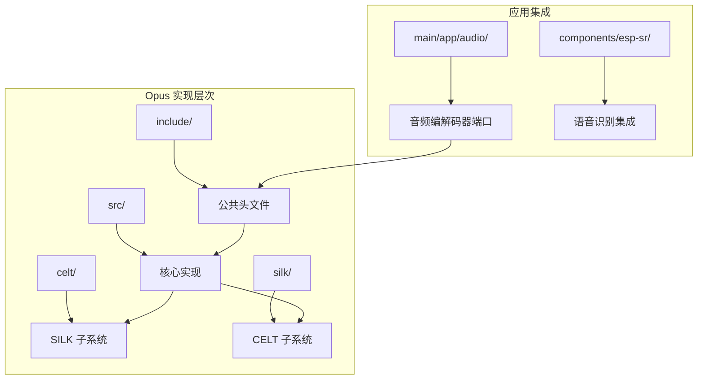
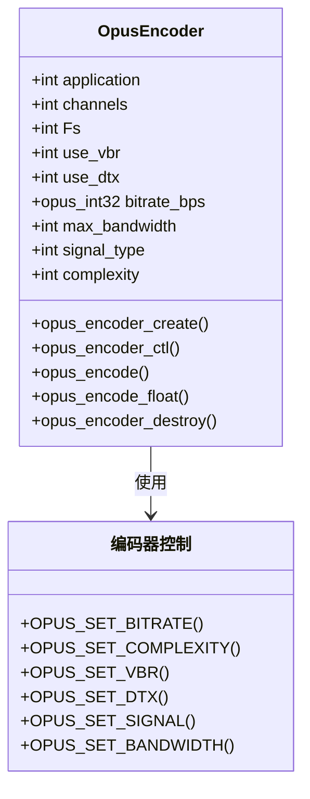
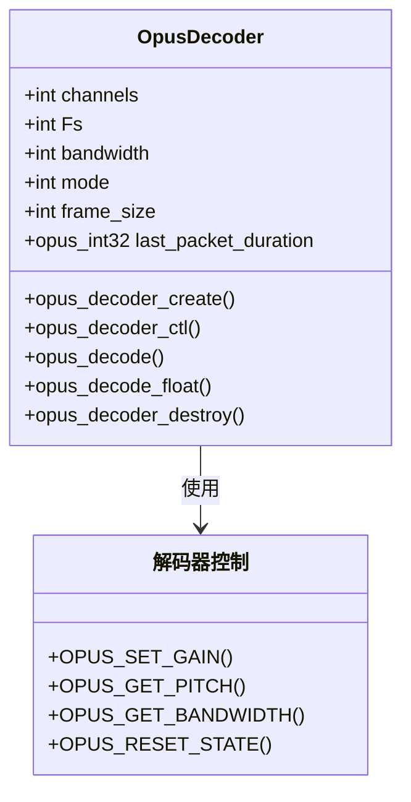
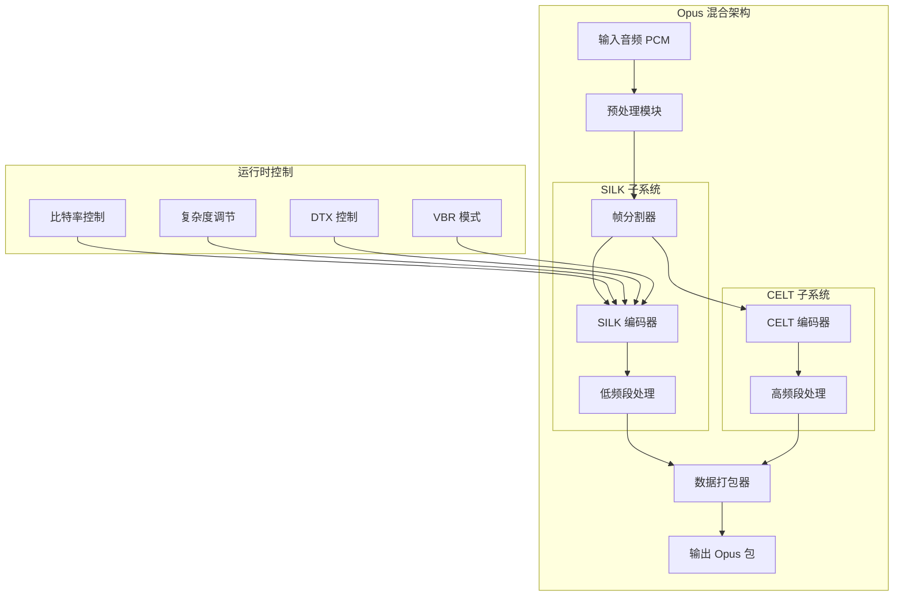
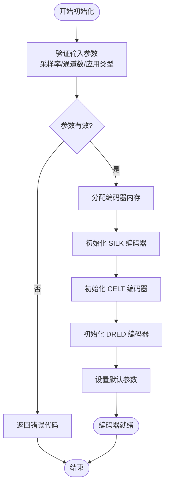
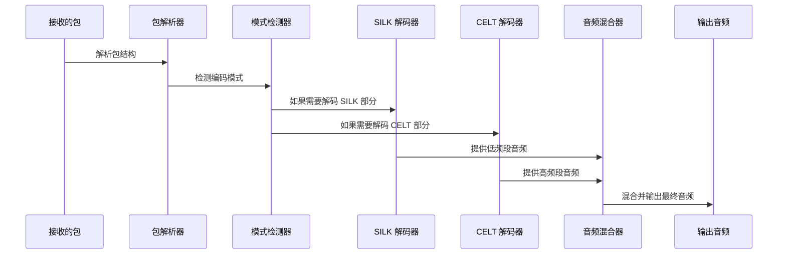
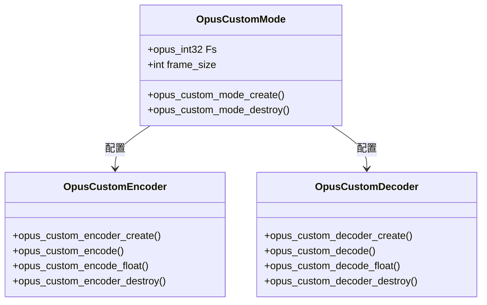
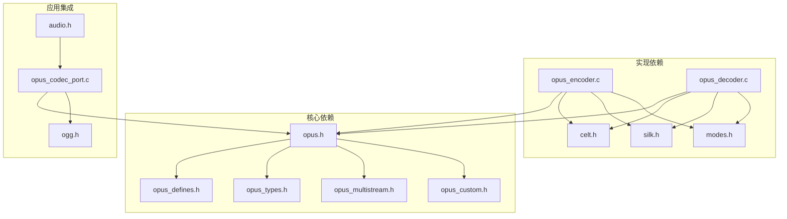

# Opus 编解码器 API

<cite>
**本文档引用的文件**
- [opus.h](file://components/opus-1.5.2/include/opus.h)
- [opus_defines.h](file://components/opus-1.5.2/include/opus_defines.h)
- [opus_encoder.c](file://components/opus-1.5.2/src/opus_encoder.c)
- [opus_decoder.c](file://components/opus-1.5.2/src/opus_decoder.c)
- [opus_multistream.h](file://components/opus-1.5.2/include/opus_multistream.h)
- [opus_custom.h](file://components/opus-1.5.2/include/opus_custom.h)
- [opus_multistream_encoder.c](file://components/opus-1.5.2/src/opus_multistream_encoder.c)
- [opus_multistream_decoder.c](file://components/opus-1.5.2/src/opus_multistream_decoder.c)
- [opus_codec_port.c](file://main/app/audio/opus_codec_port.c)
</cite>

## 目录
1. [简介](#简介)
2. [项目结构](#项目结构)
3. [核心组件](#核心组件)
4. [架构概览](#架构概览)
5. [详细组件分析](#详细组件分析)
6. [依赖关系分析](#依赖关系分析)
7. [性能考虑](#性能考虑)
8. [故障排除指南](#故障排除指南)
9. [结论](#结论)
10. [附录](#附录)

## 简介

Opus 是一个由 IETF 音频工作组开发的开源音频编解码器，专为互联网音频传输而设计。它结合了 Skype 的 SILK 技术和 Xiph.Org 的 CELT 技术，支持从 8 到 48 kHz 的采样率，比特率范围从 6 kb/s 到 510 kb/s，能够处理从窄带到全带宽的音频信号。

Opus 编解码器的主要特点包括：
- 支持常比特率(CBR)和可变比特率(VBR)模式
- 优秀的丢包鲁棒性和前向纠错能力
- 低延迟设计，适合实时通信应用
- 支持单声道和立体声
- 支持多声道(最多 255 声道)
- 帧大小从 2.5ms 到 60ms 可调

## 项目结构

本项目中的 Opus 实现位于 `components/opus-1.5.2/` 目录下，采用标准的分层架构：



**图表来源**
- [opus.h:1-800](file://components/opus-1.5.2/include/opus.h#L1-800)
- [opus_encoder.c:1-800](file://components/opus-1.5.2/src/opus_encoder.c#L1-800)
- [opus_decoder.c:1-800](file://components/opus-1.5.2/src/opus_decoder.c#L1-800)

**章节来源**
- [opus.h:1-800](file://components/opus-1.5.2/include/opus.h#L1-800)
- [opus_defines.h:1-800](file://components/opus-1.5.2/include/opus_defines.h#L1-800)

## 核心组件

### 编码器接口

Opus 编码器提供完整的编码功能，支持多种配置选项和运行时控制：



**图表来源**
- [opus.h:159-316](file://components/opus-1.5.2/include/opus.h#L159-316)
- [opus_defines.h:240-652](file://components/opus-1.5.2/include/opus_defines.h#L240-652)

### 解码器接口

Opus 解码器提供完整的解码功能，支持错误隐藏和前向纠错：



**图表来源**
- [opus.h:394-527](file://components/opus-1.5.2/include/opus.h#L394-527)
- [opus_defines.h:654-800](file://components/opus-1.5.2/include/opus_defines.h#L654-800)

**章节来源**
- [opus.h:75-157](file://components/opus-1.5.2/include/opus.h#L75-157)
- [opus.h:331-392](file://components/opus-1.5.2/include/opus.h#L331-392)

## 架构概览

Opus 编解码器采用混合架构，结合了 SILK 和 CELT 两个核心技术：



**图表来源**
- [opus_encoder.c:74-140](file://components/opus-1.5.2/src/opus_encoder.c#L74-140)
- [opus_encoder.c:202-297](file://components/opus-1.5.2/src/opus_encoder.c#L202-297)

### 多流媒体支持

Opus 还支持多声道音频的组合编码：

```mermaid
sequenceDiagram
participant 应用 as 应用程序
participant MS_Encoder as 多流编码器
participant Stream1 as 流1 (左声道)
participant Stream2 as 流2 (右声道)
participant Stream3 as 流3 (中置)
participant Packet as Opus 包
应用->>MS_Encoder : 初始化多流编码器
MS_Encoder->>Stream1 : 创建左声道编码器
MS_Encoder->>Stream2 : 创建右声道编码器
MS_Encoder->>Stream3 : 创建中置编码器
循环 每个音频帧
应用->>MS_Encoder : 提供多声道 PCM
MS_Encoder->>Stream1 : 编码左声道
MS_Encoder->>Stream2 : 编码右声道
MS_Encoder->>Stream3 : 编码中置声道
Stream1-->>Packet : 写入流1数据
Stream2-->>Packet : 写入流2数据
Stream3-->>Packet : 写入流3数据
end
MS_Encoder-->>应用 : 返回组合的 Opus 包
```

**图表来源**
- [opus_multistream.h:103-167](file://components/opus-1.5.2/include/opus_multistream.h#L103-167)
- [opus_multistream_encoder.c:127-144](file://components/opus-1.5.2/src/opus_multistream_encoder.c#L127-144)

**章节来源**
- [opus_multistream.h:103-167](file://components/opus-1.5.2/include/opus_multistream.h#L103-167)

## 详细组件分析

### 编码器初始化流程

编码器的初始化过程涉及多个步骤和参数配置：



**图表来源**
- [opus_encoder.c:202-297](file://components/opus-1.5.2/src/opus_encoder.c#L202-297)
- [opus_encoder.c:542-570](file://components/opus-1.5.2/src/opus_encoder.c#L542-570)

### 编码参数配置

Opus 编码器提供了丰富的配置选项：

| 参数类别 | 关键参数 | 默认值 | 范围 | 描述 |
|---------|----------|--------|------|------|
| 比特率控制 | OPUS_SET_BITRATE | 自动 | 500-512000 bps | 主要比特率控制 |
| 复杂度设置 | OPUS_SET_COMPLEXITY | 9 | 0-10 | 计算复杂度级别 |
| VBR 模式 | OPUS_SET_VBR | 开启 | 0/1 | 可变比特率开关 |
| DTX 控制 | OPUS_SET_DTX | 关闭 | 0/1 | 离散传输开关 |
| 信号类型 | OPUS_SET_SIGNAL | 自动 | VOICE/MUSIC/AUTO | 信号类型指示 |

**章节来源**
- [opus_defines.h:240-652](file://components/opus-1.5.2/include/opus_defines.h#L240-652)

### 解码器处理流程

解码器的处理流程包括包解析、模式检测和音频重建：



**图表来源**
- [opus_decoder.c:237-668](file://components/opus-1.5.2/src/opus_decoder.c#L237-668)

**章节来源**
- [opus_decoder.c:237-668](file://components/opus-1.5.2/src/opus_decoder.c#L237-668)

### 自定义模式支持

Opus 还支持自定义模式，适用于特殊的应用需求：



**图表来源**
- [opus_custom.h:104-128](file://components/opus-1.5.2/include/opus_custom.h#L104-128)
- [opus_custom.h:166-185](file://components/opus-1.5.2/include/opus_custom.h#L166-185)

**章节来源**
- [opus_custom.h:56-88](file://components/opus-1.5.2/include/opus_custom.h#L56-88)

## 依赖关系分析

Opus 编解码器的依赖关系体现了其模块化设计：



**图表来源**
- [opus.h:36-38](file://components/opus-1.5.2/include/opus.h#L36-38)
- [opus_encoder.c:32-47](file://components/opus-1.5.2/src/opus_encoder.c#L32-47)
- [opus_decoder.c:40-54](file://components/opus-1.5.2/src/opus_decoder.c#L40-54)

**章节来源**
- [opus.h:36-38](file://components/opus-1.5.2/include/opus.h#L36-38)

## 性能考虑

### 编码性能优化

在实时音频通信中，编码器的性能优化至关重要：

1. **复杂度与质量平衡**
   - 复杂度设置影响编码速度和音频质量
   - 低复杂度适合资源受限设备
   - 高复杂度提供更好的压缩效率

2. **比特率自适应**
   - VBR 模式根据音频内容动态调整比特率
   - CBR 模式提供稳定的传输开销
   - DTX 功能在静默期间减少传输负载

3. **延迟优化**
   - 小帧大小降低编码延迟
   - 适当的缓冲策略平衡延迟和质量
   - 低延迟应用选择专用配置

### 解码性能优化

解码器的优化主要关注处理效率和资源使用：

1. **模式切换优化**
   - 减少模式切换次数
   - 预加载常用配置
   - 缓存解码状态

2. **内存管理**
   - 合理的内存分配策略
   - 避免频繁的内存分配/释放
   - 静态内存池的使用

3. **并行处理**
   - 多线程解码支持
   - SIMD 指令集优化
   - 硬件加速集成

## 故障排除指南

### 常见错误类型

| 错误代码 | 含义 | 可能原因 | 解决方案 |
|---------|------|----------|----------|
| OPUS_OK | 成功 | 正常操作 | 继续执行 |
| OPUS_BAD_ARG | 无效参数 | 参数超出范围或格式错误 | 检查输入参数有效性 |
| OPUS_BUFFER_TOO_SMALL | 缓冲区过小 | 输出缓冲区不足 | 增大输出缓冲区大小 |
| OPUS_INVALID_PACKET | 无效包 | 数据损坏或格式不正确 | 验证数据完整性 |
| OPUS_INVALID_STATE | 无效状态 | 编解码器状态异常 | 重新初始化编解码器 |
| OPUS_ALLOC_FAIL | 内存分配失败 | 系统内存不足 | 释放内存或增加可用内存 |

### 调试技巧

1. **日志记录**
   ```c
   // 使用 ESP-IDF 日志系统
   ESP_LOGE(TAG_OPUS, "编码错误: %s", opus_strerror(error_code));
   ```

2. **参数验证**
   - 检查采样率是否为 8000/12000/16000/24000/48000 Hz
   - 验证通道数在 1-2 范围内
   - 确认帧大小符合 Opus 规范

3. **内存管理**
   - 确保正确释放编解码器资源
   - 检查内存泄漏情况
   - 验证缓冲区边界

**章节来源**
- [opus_defines.h:42-61](file://components/opus-1.5.2/include/opus_defines.h#L42-61)

## 结论

Opus 编解码器提供了一个功能完整、性能优异的音频编码解决方案。其混合架构设计使其能够在不同应用场景中实现最佳的音质和效率平衡。

关键优势包括：
- **灵活性**: 支持多种采样率、比特率和帧大小配置
- **高效性**: 优秀的压缩比和低延迟特性
- **鲁棒性**: 强大的错误隐藏和前向纠错能力
- **可扩展性**: 支持多声道和自定义模式

对于实际应用，建议根据具体需求选择合适的配置参数，并在部署前进行充分的测试和优化。

## 附录

### 最佳实践指南

#### 音频通话场景
- 使用 VOIP 应用配置
- 设置适中的比特率 (24-64 kb/s)
- 启用 VBR 模式
- 调整复杂度以平衡 CPU 使用

#### 语音识别场景
- 使用 AUDIO 应用配置
- 设置较高的比特率 (64-128 kb/s)
- 固定帧大小 (20ms)
- 禁用 DTX 功能

#### 多声道应用
- 使用多流媒体 API
- 合理的声道映射配置
- 注意延迟和同步问题
- 优化网络传输策略

### 代码示例路径

具体的实现示例可以在以下文件中找到：
- [编码器初始化示例:241-301](file://main/app/audio/opus_codec_port.c#L241-301)
- [编码器配置示例:285-295](file://main/app/audio/opus_codec_port.c#L285-295)
- [解码器初始化示例:129-160](file://main/app/audio/opus_codec_port.c#L129-160)
- [解码器处理示例:178-202](file://main/app/audio/opus_codec_port.c#L178-202)