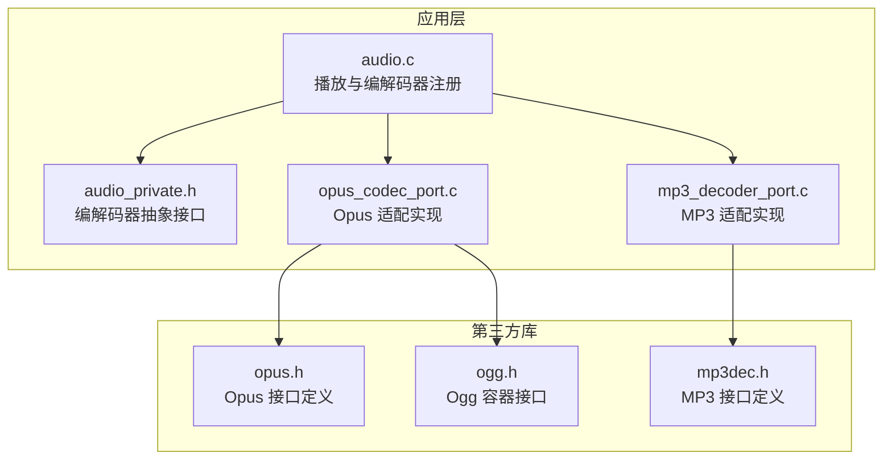
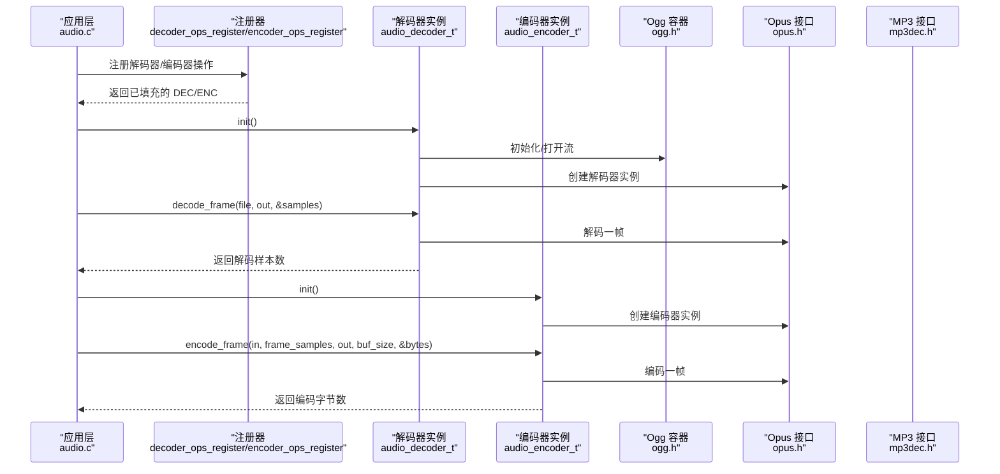
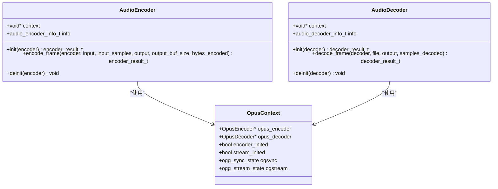
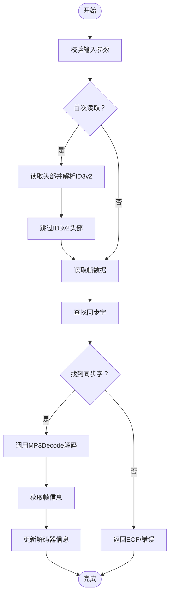
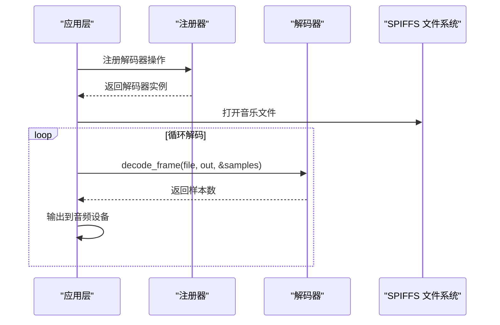
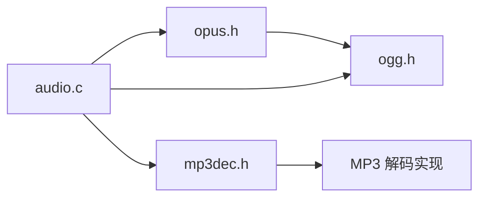

# 编解码器 API

<cite>
**本文引用的文件**
- [main/app/audio/audio.c](file://main/app/audio/audio.c)
- [main/app/audio/audio_private.h](file://main/app/audio/audio_private.h)
- [main/app/audio/opus_codec_port.c](file://main/app/audio/opus_codec_port.c)
- [main/app/audio/mp3_decoder_port.c](file://main/app/audio/mp3_decoder_port.c)
- [components/opus-1.5.2/include/opus.h](file://components/opus-1.5.2/include/opus.h)
- [components/opus-1.5.2/include/opus_defines.h](file://components/opus-1.5.2/include/opus_defines.h)
- [components/opus-1.5.2/include/opus_multistream.h](file://components/opus-1.5.2/include/opus_multistream.h)
- [components/helix-mp3/fixpnt/pub/mp3dec.h](file://components/helix-mp3/fixpnt/pub/mp3dec.h)
- [components/libogg-1.3.6/ogg.h](file://components/libogg-1.3.6/ogg.h)
</cite>

## 目录
1. [简介](#简介)
2. [项目结构](#项目结构)
3. [核心组件](#核心组件)
4. [架构总览](#架构总览)
5. [详细组件分析](#详细组件分析)
6. [依赖关系分析](#依赖关系分析)
7. [性能考虑](#性能考虑)
8. [故障排查指南](#故障排查指南)
9. [结论](#结论)
10. [附录](#附录)

## 简介
本文件系统化梳理并记录了本仓库中的编解码器 API，重点覆盖以下内容：
- Opus 编解码器接口规范：编码器初始化、解码器配置、参数设置与数据处理函数
- MP3 编解码器接口规范：解码器初始化、帧同步与解析、参数设置与数据处理函数
- 质量控制、比特率配置、延迟优化与错误恢复机制
- 编解码器选择指南与性能对比分析
- 实际使用场景的代码示例路径（以源码路径代替具体代码片段）

## 项目结构
编解码器相关代码主要位于以下位置：
- 应用层音频模块：main/app/audio
  - 音频播放与编解码器注册：audio.c、audio_private.h
  - Opus 编解码器适配：opus_codec_port.c
  - MP3 解码器适配：mp3_decoder_port.c
- 第三方库
  - Opus 源码与头文件：components/opus-1.5.2
  - MP3 解码器（Helix）头文件：components/helix-mp3/fixpnt/pub
  - Ogg 容器支持：components/libogg-1.3.6

**图示来源**
- [main/app/audio/audio.c:112-126](file://main/app/audio/audio.c#L112-L126)
- [main/app/audio/audio_private.h:77-125](file://main/app/audio/audio_private.h#L77-L125)
- [main/app/audio/opus_codec_port.c:395-409](file://main/app/audio/opus_codec_port.c#L395-L409)
- [main/app/audio/mp3_decoder_port.c:206-216](file://main/app/audio/mp3_decoder_port.c#L206-L216)
- [components/opus-1.5.2/include/opus.h](file://components/opus-1.5.2/include/opus.h)
- [components/helix-mp3/fixpnt/pub/mp3dec.h](file://components/helix-mp3/fixpnt/pub/mp3dec.h)
- [components/libogg-1.3.6/ogg.h](file://components/libogg-1.3.6/ogg.h)

**章节来源**
- [main/app/audio/audio.c:71-126](file://main/app/audio/audio.c#L71-L126)
- [main/app/audio/audio_private.h:77-125](file://main/app/audio/audio_private.h#L77-L125)

## 核心组件
本项目采用“抽象接口 + 具体实现”的设计模式，通过统一的编解码器接口对上层开放能力，并在底层分别对接 Opus 与 MP3 解码器。

- 抽象接口（编解码器）
  - 编码器接口：audio_encoder_t
    - 字段：context、info（采样率、声道数、比特率、每帧采样数）、init、encode_frame、deinit
    - 关键函数：编码器初始化、按帧编码、反初始化
  - 解码器接口：audio_decoder_t
    - 字段：context、info（采样率、声道数、比特率、每帧采样数）、init、decode_frame、deinit
    - 关键函数：解码器初始化、按帧解码、反初始化
- 结果枚举
  - 编码结果：ENCODER_OK、ENCODER_ERROR、ENCODER_EMPTY、ENCODER_TOO_BIG
  - 解码结果：DECODER_OK、DECODER_ERROR、DECODER_EOF、DECODER_HEADER_ONLY

这些接口在应用层被注册并调用，实现对不同编解码器的统一管理。

**章节来源**
- [main/app/audio/audio_private.h:89-121](file://main/app/audio/audio_private.h#L89-L121)
- [main/app/audio/audio_private.h:91-96](file://main/app/audio/audio_private.h#L91-L96)

## 架构总览
下图展示了应用层如何通过统一接口与具体编解码器交互，以及 Opus 使用 Ogg 容器进行封装的情况。

**图示来源**
- [main/app/audio/audio.c:71-126](file://main/app/audio/audio.c#L71-L126)
- [main/app/audio/opus_codec_port.c:395-409](file://main/app/audio/opus_codec_port.c#L395-L409)
- [main/app/audio/mp3_decoder_port.c:206-216](file://main/app/audio/mp3_decoder_port.c#L206-L216)
- [components/opus-1.5.2/include/opus.h](file://components/opus-1.5.2/include/opus.h)
- [components/libogg-1.3.6/ogg.h](file://components/libogg-1.3.6/ogg.h)
- [components/helix-mp3/fixpnt/pub/mp3dec.h](file://components/helix-mp3/fixpnt/pub/mp3dec.h)

## 详细组件分析

### Opus 编解码器 API
- 编码器
  - 初始化：创建编码器实例、设置参数（采样率、声道数、比特率、编码模式等），准备上下文
  - 按帧编码：校验输入样本数与帧大小一致；执行编码；检查输出缓冲区容量；返回编码字节数
  - 反初始化：销毁编码器实例并释放上下文
- 解码器
  - 初始化：创建解码器实例、初始化 Ogg 流与同步器
  - 按帧解码：从输入流提取一帧数据；执行解码；更新解码器信息（采样率、声道数）；返回解码样本数
  - 反初始化：销毁解码器实例、清理 Ogg 流与同步器
- 关键点
  - 帧大小一致性：输入样本数必须等于每帧采样数
  - 输出缓冲区：单帧最大编码字节数约 1500 字节，需预留足够空间
  - Ogg 容器：解码侧需要 Ogg 流与同步器配合
  - 日志与错误码：通过返回值与日志区分空输入、缓冲区不足、编码失败等情况

**图示来源**
- [main/app/audio/audio_private.h:89-121](file://main/app/audio/audio_private.h#L89-L121)
- [main/app/audio/opus_codec_port.c:313-370](file://main/app/audio/opus_codec_port.c#L313-L370)
- [main/app/audio/opus_codec_port.c:185-224](file://main/app/audio/opus_codec_port.c#L185-L224)

**章节来源**
- [main/app/audio/opus_codec_port.c:313-370](file://main/app/audio/opus_codec_port.c#L313-L370)
- [main/app/audio/opus_codec_port.c:185-224](file://main/app/audio/opus_codec_port.c#L185-L224)
- [main/app/audio/opus_codec_port.c:395-409](file://main/app/audio/opus_codec_port.c#L395-L409)

### MP3 解码器 API
- 初始化
  - 分配内部 RAM 上下文与输入缓冲区
  - 初始化 MP3 解码器句柄
  - 设置初始解码器信息（采样率、声道数）
- 按帧解码
  - 首次读取：跳过 ID3v2 头部
  - 帧同步：在输入流中查找同步字
  - 解码：调用 MP3Decode 获取 PCM 数据
  - 更新：获取帧信息并更新解码器信息
- 反初始化
  - 释放解码器句柄与缓冲区

**图示来源**
- [main/app/audio/mp3_decoder_port.c:78-189](file://main/app/audio/mp3_decoder_port.c#L78-L189)

**章节来源**
- [main/app/audio/mp3_decoder_port.c:44-76](file://main/app/audio/mp3_decoder_port.c#L44-L76)
- [main/app/audio/mp3_decoder_port.c:78-189](file://main/app/audio/mp3_decoder_port.c#L78-L189)
- [main/app/audio/mp3_decoder_port.c:191-204](file://main/app/audio/mp3_decoder_port.c#L191-L204)

### 应用层集成与播放流程
- 注册编解码器操作：在应用层通过 decoder_ops_register/encoder_ops_register 将具体实现绑定到抽象接口
- 播放流程：拼接文件路径、申请解码缓冲区、循环解码并输出 PCM 数据

**图示来源**
- [main/app/audio/audio.c:71-126](file://main/app/audio/audio.c#L71-L126)
- [main/app/audio/audio.c:112-126](file://main/app/audio/audio.c#L112-L126)

**章节来源**
- [main/app/audio/audio.c:71-126](file://main/app/audio/audio.c#L71-L126)

## 依赖关系分析
- Opus
  - 头文件：opus.h、opus_defines.h、opus_multistream.h
  - 运行时依赖：libogg-1.3.6 提供 Ogg 容器支持
- MP3
  - 头文件：mp3dec.h
  - 内存策略：强制使用内部 RAM 分配，避免 PSRAM 访问带来的性能抖动

**图示来源**
- [components/opus-1.5.2/include/opus.h](file://components/opus-1.5.2/include/opus.h)
- [components/opus-1.5.2/include/opus_defines.h](file://components/opus-1.5.2/include/opus_defines.h)
- [components/opus-1.5.2/include/opus_multistream.h](file://components/opus-1.5.2/include/opus_multistream.h)
- [components/helix-mp3/fixpnt/pub/mp3dec.h](file://components/helix-mp3/fixpnt/pub/mp3dec.h)
- [components/libogg-1.3.6/ogg.h](file://components/libogg-1.3.6/ogg.h)
- [main/app/audio/audio.c:14](file://main/app/audio/audio.c#L14)

**章节来源**
- [components/opus-1.5.2/include/opus.h](file://components/opus-1.5.2/include/opus.h)
- [components/helix-mp3/fixpnt/pub/mp3dec.h](file://components/helix-mp3/fixpnt/pub/mp3dec.h)
- [components/libogg-1.3.6/ogg.h](file://components/libogg-1.3.6/ogg.h)

## 性能考虑
- 帧大小与延迟
  - Opus：编码/解码严格按帧进行，输入样本数需与每帧采样数一致；单帧最大编码字节数约 1500 字节，需预留足够输出缓冲区
  - MP3：单帧最大输出采样数为 2304（双声道），建议按帧读取并解码
- 内存与带宽
  - MP3 解码器强制使用内部 RAM 分配输入缓冲区，减少外部存储器访问开销
  - Opus 解码器使用 Ogg 流与同步器，注意同步状态的正确清理，避免资源泄漏
- 比特率与质量
  - Opus 支持可变比特率与固定比特率配置；比特率越高通常音质越好但占用更多带宽
  - MP3 的比特率由文件本身决定；可通过重新编码调整比特率

[本节为通用性能讨论，不直接分析具体文件]

## 故障排查指南
- 编码器错误
  - 输入为空：返回 ENCODER_EMPTY
  - 帧大小不匹配：返回 ENCODER_ERROR
  - 输出缓冲区不足：返回 ENCODER_TOO_BIG
  - 编码失败：返回 ENCODER_ERROR 并记录错误信息
- 解码器错误
  - 参数非法或上下文为空：返回 DECODER_ERROR
  - 读取文件结束：返回 DECODER_EOF
  - 未找到同步字：返回 DECODER_EOF
  - 帧信息异常：返回 DECODER_ERROR
- 建议
  - 在调用前校验输入参数与缓冲区大小
  - 对于 Opus，确保每帧采样数与编码器配置一致
  - 对于 MP3，确认 ID3v2 头部已被正确跳过

**章节来源**
- [main/app/audio/audio_private.h:91-96](file://main/app/audio/audio_private.h#L91-L96)
- [main/app/audio/opus_codec_port.c:313-370](file://main/app/audio/opus_codec_port.c#L313-L370)
- [main/app/audio/mp3_decoder_port.c:78-189](file://main/app/audio/mp3_decoder_port.c#L78-L189)

## 结论
本项目通过统一的编解码器抽象接口，实现了对 Opus 与 MP3 的标准化接入。Opus 侧重低延迟与高质量，适合实时语音通信；MP3 作为广泛兼容的音频格式，适合传统媒体播放。结合帧大小控制、缓冲区规划与内存策略，可在资源受限的嵌入式平台上获得稳定可靠的音频编解码体验。

[本节为总结性内容，不直接分析具体文件]

## 附录

### 编解码器选择指南
- 实时语音/会议
  - 优先选择 Opus：低延迟、高音质、自适应比特率
- 兼容性优先
  - 选择 MP3：广泛设备支持，便于分发与播放
- 资源限制
  - Opus：按帧处理，便于控制内存与带宽
  - MP3：强制内部 RAM，降低外部存储器访问成本

[本节为概念性指导，不直接分析具体文件]

### 使用示例（代码路径）
- Opus 编码
  - 初始化与编码：[main/app/audio/opus_codec_port.c:313-370](file://main/app/audio/opus_codec_port.c#L313-L370)
  - 注册编码器操作：[main/app/audio/opus_codec_port.c:403-409](file://main/app/audio/opus_codec_port.c#L403-L409)
- Opus 解码（Ogg 容器）
  - 初始化与解码：[main/app/audio/opus_codec_port.c:185-224](file://main/app/audio/opus_codec_port.c#L185-L224)
  - 注册解码器操作：[main/app/audio/opus_codec_port.c:395-401](file://main/app/audio/opus_codec_port.c#L395-L401)
- MP3 解码
  - 初始化与解码：[main/app/audio/mp3_decoder_port.c:44-76](file://main/app/audio/mp3_decoder_port.c#L44-L76)
  - 注册解码器操作：[main/app/audio/mp3_decoder_port.c:206-216](file://main/app/audio/mp3_decoder_port.c#L206-L216)
- 应用层播放流程
  - 播放文件与解码循环：[main/app/audio/audio.c:112-126](file://main/app/audio/audio.c#L112-L126)