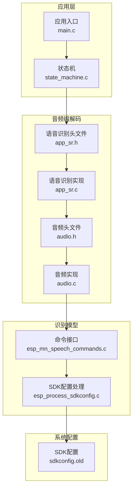
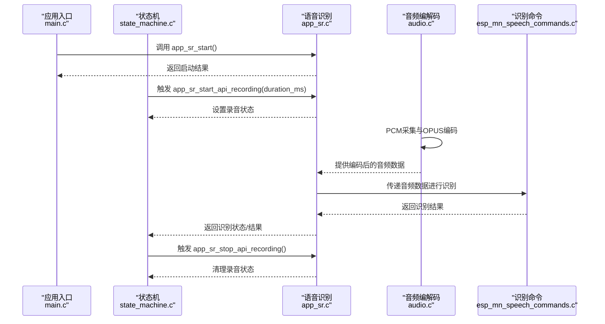
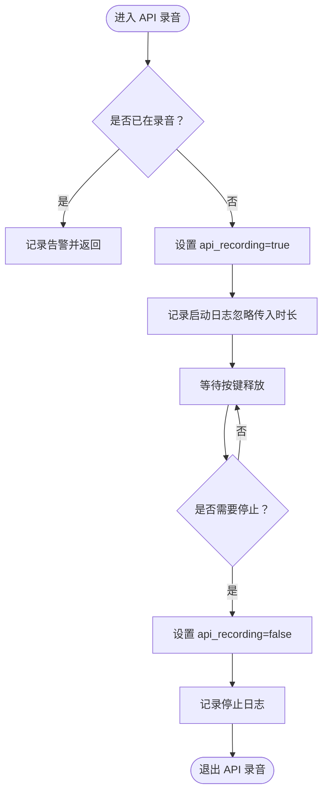
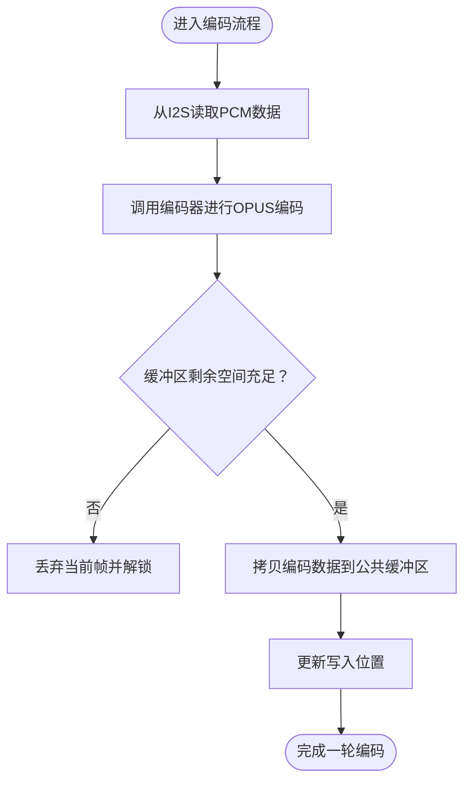
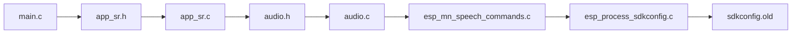

# 语音识别 API

<cite>
**本文引用的文件**
- [app_sr.h](file://main/app/audio/app_sr.h)
- [app_sr.c](file://main/app/audio/app_sr.c)
- [audio.h](file://main/app/audio/audio.h)
- [audio.c](file://main/app/audio/audio.c)
- [state_machine.c](file://main/app/state_machine/state_machine.c)
- [main.c](file://main/main.c)
- [esp_mn_speech_commands.c](file://components/esp-sr/src/esp_mn_speech_commands.c)
- [esp_process_sdkconfig.c](file://components/esp-sr/src/esp_process_sdkconfig.c)
- [sdkconfig.old](file://sdkconfig.old)
</cite>

## 目录
1. [简介](#简介)
2. [项目结构](#项目结构)
3. [核心组件](#核心组件)
4. [架构总览](#架构总览)
5. [详细组件分析](#详细组件分析)
6. [依赖关系分析](#依赖关系分析)
7. [性能考虑](#性能考虑)
8. [故障排查指南](#故障排查指南)
9. [结论](#结论)
10. [附录](#附录)

## 简介
本文件为项目中语音识别子系统的 API 文档，聚焦于从录音控制、识别启动、结果获取到状态查询的完整接口规范。文档还涵盖识别参数配置、唤醒词设置、识别灵敏度调节与超时处理策略，并提供从录音到识别结果的集成指南与最佳实践。

## 项目结构
语音识别相关能力主要分布在以下模块：
- 应用层入口与状态机：负责触发录音与识别流程
- 音频编解码与缓冲：负责 PCM 到 OPUS 的编码、缓冲与读取
- 识别模型与命令：负责多模态识别模型的加载与命令解析
- SDK 配置：负责识别模型与算法的启用与选择

**图示来源**
- [state_machine.c:90-95](file://main/app/state_machine/state_machine.c#L90-L95)
- [main.c:40-50](file://main/main.c#L40-L50)
- [app_sr.h:18-50](file://main/app/audio/app_sr.h#L18-L50)
- [app_sr.c:55-99](file://main/app/audio/app_sr.c#L55-L99)
- [audio.h](file://main/app/audio/audio.h)
- [audio.c:316-354](file://main/app/audio/audio.c#L316-L354)
- [esp_mn_speech_commands.c:33-40](file://components/esp-sr/src/esp_mn_speech_commands.c#L33-L40)
- [esp_process_sdkconfig.c:895-910](file://components/esp-sr/src/esp_process_sdkconfig.c#L895-L910)
- [sdkconfig.old:582-668](file://sdkconfig.old#L582-L668)

**章节来源**
- [app_sr.h:18-50](file://main/app/audio/app_sr.h#L18-L50)
- [app_sr.c:55-99](file://main/app/audio/app_sr.c#L55-L99)
- [audio.c:316-354](file://main/app/audio/audio.c#L316-L354)
- [state_machine.c:90-95](file://main/app/state_machine/state_machine.c#L90-L95)
- [main.c:40-50](file://main/main.c#L40-L50)
- [esp_mn_speech_commands.c:33-40](file://components/esp-sr/src/esp_mn_speech_commands.c#L33-L40)
- [esp_process_sdkconfig.c:895-910](file://components/esp-sr/src/esp_process_sdkconfig.c#L895-L910)
- [sdkconfig.old:582-668](file://sdkconfig.old#L582-L668)

## 核心组件
- 语音识别控制接口
  - 启动识别任务：app_sr_start()
  - 通过 API 启动录音（带最大时长）：app_sr_start_api_recording(duration_ms)
  - 停止 API 录音：app_sr_stop_api_recording()
  - 查询 API 录音状态：app_sr_is_api_recording()

- 音频编码与缓冲接口
  - 从公共缓冲区读取 OPUS 编码数据：audio_get_opus_encode_data(out_buf, req_len)
  - 音频事件控制：audio_start_event(), audio_end_event()

- 识别模型与命令
  - 分配命令资源：esp_mn_commands_alloc(...)
  - 从 SDK 配置更新命令：esp_mn_commands_update_from_sdkconfig(...)

- 系统配置
  - 模型与算法启用：sdkconfig 中的 CONFIG_MODEL_IN_FLASH、CONFIG_AFE_INTERFACE_V1、CONFIG_SR_NSN_WEBRTC、CONFIG_SR_VADN_WEBRTC、CONFIG_SR_MN_CN_MULTINET7_QUANT 等

**章节来源**
- [app_sr.h:24-49](file://main/app/audio/app_sr.h#L24-L49)
- [app_sr.c:75-99](file://main/app/audio/app_sr.c#L75-L99)
- [audio.c:316-354](file://main/app/audio/audio.c#L316-L354)
- [esp_mn_speech_commands.c:33-40](file://components/esp-sr/src/esp_mn_speech_commands.c#L33-L40)
- [esp_process_sdkconfig.c:895-910](file://components/esp-sr/src/esp_process_sdkconfig.c#L895-L910)
- [sdkconfig.old:582-668](file://sdkconfig.old#L582-L668)

## 架构总览
语音识别从“录音采集”到“识别结果”的整体流程如下：

**图示来源**
- [main.c:40-50](file://main/main.c#L40-L50)
- [state_machine.c:90-95](file://main/app/state_machine/state_machine.c#L90-L95)
- [app_sr.c:55-99](file://main/app/audio/app_sr.c#L55-L99)
- [audio.c:739-817](file://main/app/audio/audio.c#L739-L817)
- [esp_mn_speech_commands.c:33-40](file://components/esp-sr/src/esp_mn_speech_commands.c#L33-L40)

## 详细组件分析

### 语音识别控制接口
- 功能概述
  - app_sr_start(): 初始化并启动语音识别任务，返回 ESP_OK 表示成功，否则返回内存不足或其它错误。
  - app_sr_start_api_recording(duration_ms): 由状态机调用，启动录音并记录最大录音时长；当前实现忽略传入时长，以按键释放作为停止条件。
  - app_sr_stop_api_recording(): 停止 API 录音，若无录音则记录告警。
  - app_sr_is_api_recording(): 查询是否存在活动的 API 录音。

- 关键行为与约束
  - API 录音采用“按键触发、按键释放停止”的模式，不使用传入的时长参数。
  - 内部维护 api_recording 标志位，避免重复启动。

**图示来源**
- [app_sr.c:75-99](file://main/app/audio/app_sr.c#L75-L99)

**章节来源**
- [app_sr.h:24-49](file://main/app/audio/app_sr.h#L24-L49)
- [app_sr.c:75-99](file://main/app/audio/app_sr.c#L75-L99)

### 音频编码与缓冲接口
- 功能概述
  - audio_get_opus_encode_data(out_buf, req_len): 从公共缓冲区读取指定长度的 OPUS 数据，内部使用互斥锁保护缓冲区，防止并发冲突。
  - audio_start_event()/audio_end_event(): 控制音频事件状态，配合外部 WebSocket 或播放模块使用。
  - 编码流程：从 I2S 读取 PCM 数据，调用编码器进行 OPUS 编码，写入公共缓冲区，同时维护包序号与长度字段。

- 关键行为与约束
  - 读取前进行参数校验与缓冲区剩余空间检查，避免越界与覆盖。
  - 编码成功后将数据追加到公共缓冲区，并更新写入位置。
  - 使用互斥锁保护缓冲区访问，超时获取失败直接丢弃当前帧。

**图示来源**
- [audio.c:739-817](file://main/app/audio/audio.c#L739-L817)
- [audio.c:316-354](file://main/app/audio/audio.c#L316-L354)

**章节来源**
- [audio.c:316-354](file://main/app/audio/audio.c#L316-L354)
- [audio.c:739-817](file://main/app/audio/audio.c#L739-L817)

### 识别模型与命令
- 功能概述
  - esp_mn_commands_alloc(...): 分配并初始化命令资源，绑定多模态识别模型接口。
  - esp_mn_commands_update_from_sdkconfig(...): 根据 SDK 配置动态更新命令集合，支持语言切换与模型选择。

- 关键行为与约束
  - 该接口依赖 SDK 配置项，确保模型与算法正确启用。
  - 支持中文与英文识别模型的切换与量化配置。

**章节来源**
- [esp_mn_speech_commands.c:33-40](file://components/esp-sr/src/esp_mn_speech_commands.c#L33-L40)
- [esp_mn_speech_commands.c:173-180](file://components/esp-sr/src/esp_mn_speech_commands.c#L173-L180)
- [esp_process_sdkconfig.c:895-910](file://components/esp-sr/src/esp_process_sdkconfig.c#L895-L910)

### 系统配置与识别参数
- 模型与算法启用
  - CONFIG_MODEL_IN_FLASH：模型存储于 Flash。
  - CONFIG_AFE_INTERFACE_V1：AFE 接口版本。
  - CONFIG_SR_NSN_WEBRTC / CONFIG_SR_VADN_WEBRTC：噪声抑制与 VAD 算法选择。
  - CONFIG_SR_MN_CN_MULTINET7_QUANT：中文多模态识别模型量化版本启用。

- 唤醒词与灵敏度
  - 仓库未直接暴露唤醒词与灵敏度 API；可通过 SDK 配置项选择不同唤醒词模型与阈值策略。
  - 参考 sdkconfig 中的唤醒词配置段落，按需启用目标唤醒词。

- 超时与录音时长
  - API 录音当前实现不使用传入的时长参数，以按键释放作为停止条件。
  - 若需固定时长限制，可在上层状态机中增加定时器逻辑并在到期时调用停止接口。

**章节来源**
- [sdkconfig.old:582-668](file://sdkconfig.old#L582-L668)
- [sdkconfig.old:602-656](file://sdkconfig.old#L602-L656)
- [app_sr.c:75-99](file://main/app/audio/app_sr.c#L75-L99)

## 依赖关系分析
- 组件耦合
  - 应用入口 main.c 依赖 app_sr_start() 启动识别任务。
  - 状态机 state_machine.c 通过 app_sr_start_api_recording()/app_sr_stop_api_recording() 控制录音生命周期。
  - 音频模块 audio.c 提供编码后的音频数据，供识别模块消费。
  - 识别命令模块 esp_mn_speech_commands.c 与 SDK 配置模块 esp_process_sdkconfig.c 协同工作，决定识别模型与语言。

**图示来源**
- [main.c:40-50](file://main/main.c#L40-L50)
- [app_sr.h:18-50](file://main/app/audio/app_sr.h#L18-L50)
- [app_sr.c:55-99](file://main/app/audio/app_sr.c#L55-L99)
- [audio.h](file://main/app/audio/audio.h)
- [audio.c:316-354](file://main/app/audio/audio.c#L316-L354)
- [esp_mn_speech_commands.c:33-40](file://components/esp-sr/src/esp_mn_speech_commands.c#L33-L40)
- [esp_process_sdkconfig.c:895-910](file://components/esp-sr/src/esp_process_sdkconfig.c#L895-L910)
- [sdkconfig.old:582-668](file://sdkconfig.old#L582-L668)

**章节来源**
- [main.c:40-50](file://main/main.c#L40-L50)
- [app_sr.h:18-50](file://main/app/audio/app_sr.h#L18-L50)
- [app_sr.c:55-99](file://main/app/audio/app_sr.c#L55-L99)
- [audio.c:316-354](file://main/app/audio/audio.c#L316-L354)
- [esp_mn_speech_commands.c:33-40](file://components/esp-sr/src/esp_mn_speech_commands.c#L33-L40)
- [esp_process_sdkconfig.c:895-910](file://components/esp-sr/src/esp_process_sdkconfig.c#L895-L910)
- [sdkconfig.old:582-668](file://sdkconfig.old#L582-L668)

## 性能考虑
- 编码与缓冲
  - 使用互斥锁保护公共缓冲区，避免并发写入导致的数据损坏；建议在高负载场景下评估锁竞争与缓冲区容量。
  - 编码帧大小与样本数需与 I2S 采样率匹配，确保每帧字节数稳定，减少网络传输抖动。

- 识别延迟
  - 将音频数据分帧编码并及时写入缓冲区，有助于降低端到端识别延迟。
  - 在上层状态机中结合按键事件与定时器，合理控制录音窗口，避免过长录音造成内存压力。

- 内存与资源
  - app_sr_start() 返回内存不足错误时，应释放部分中间资源或降低采样率/帧长以缓解内存压力。

[本节为通用指导，无需列出具体文件来源]

## 故障排查指南
- 录音无法停止
  - 现象：调用停止接口无效或无活动录音。
  - 排查：确认是否处于 API 录音状态，检查状态机是否正确调用停止接口。
  - 参考：app_sr_stop_api_recording() 的状态判断与日志。

- 编码数据读取失败
  - 现象：audio_get_opus_encode_data() 返回失败或数据不足。
  - 排查：检查请求长度是否超过已存储数据，确认互斥锁获取是否超时。
  - 参考：缓冲区读取与互斥锁保护逻辑。

- 识别任务启动失败
  - 现象：app_sr_start() 返回内存不足或其他错误。
  - 排查：检查系统可用内存，适当降低采样率或帧长；确认识别模型与算法配置正确。
  - 参考：SDK 配置项与识别模型分配流程。

**章节来源**
- [app_sr.c:86-94](file://main/app/audio/app_sr.c#L86-L94)
- [audio.c:316-354](file://main/app/audio/audio.c#L316-L354)
- [app_sr.h:24-31](file://main/app/audio/app_sr.h#L24-L31)
- [sdkconfig.old:582-668](file://sdkconfig.old#L582-L668)

## 结论
本语音识别 API 提供了从录音控制到识别结果的关键接口，结合音频编码与识别模型，能够满足端侧实时语音识别需求。通过 SDK 配置可灵活启用不同模型与算法，并在状态机与应用层协同下实现稳定的录音与识别流程。建议在实际部署中关注缓冲区容量、锁竞争与内存使用，并根据硬件能力调整采样率与帧长以获得更优的性能与稳定性。

[本节为总结性内容，无需列出具体文件来源]

## 附录

### API 定义与使用要点
- 录音控制
  - app_sr_start_api_recording(duration_ms): 由状态机调用，当前忽略传入时长，以按键释放停止。
  - app_sr_stop_api_recording(): 停止录音，若无录音则记录告警。
  - app_sr_is_api_recording(): 查询录音状态。

- 识别启动
  - app_sr_start(): 启动识别任务，返回启动结果。

- 结果获取
  - audio_get_opus_encode_data(out_buf, req_len): 从公共缓冲区读取 OPUS 编码数据，用于后续识别或传输。

- 状态查询
  - app_sr_is_api_recording(): 获取当前录音状态。

**章节来源**
- [app_sr.h:24-49](file://main/app/audio/app_sr.h#L24-L49)
- [app_sr.c:75-99](file://main/app/audio/app_sr.c#L75-L99)
- [audio.c:316-354](file://main/app/audio/audio.c#L316-L354)

### 集成指南与最佳实践
- 典型流程
  1) 应用入口调用 app_sr_start() 启动识别任务。
  2) 状态机检测到录音触发事件后，调用 app_sr_start_api_recording() 开始录音。
  3) 音频模块持续编码并将数据写入公共缓冲区。
  4) 上层读取缓冲区数据并进行识别或传输。
  5) 状态机检测到停止条件（按键释放）后，调用 app_sr_stop_api_recording() 结束录音。

- 最佳实践
  - 合理设置录音窗口，避免长时间连续录音导致内存压力。
  - 在高并发场景下，确保对公共缓冲区的访问使用互斥锁保护。
  - 根据硬件能力调整采样率与帧长，平衡识别精度与性能。
  - 通过 SDK 配置启用合适的模型与算法，确保识别效果与稳定性。

**章节来源**
- [main.c:40-50](file://main/main.c#L40-L50)
- [state_machine.c:90-95](file://main/app/state_machine/state_machine.c#L90-L95)
- [app_sr.c:75-99](file://main/app/audio/app_sr.c#L75-L99)
- [audio.c:739-817](file://main/app/audio/audio.c#L739-L817)