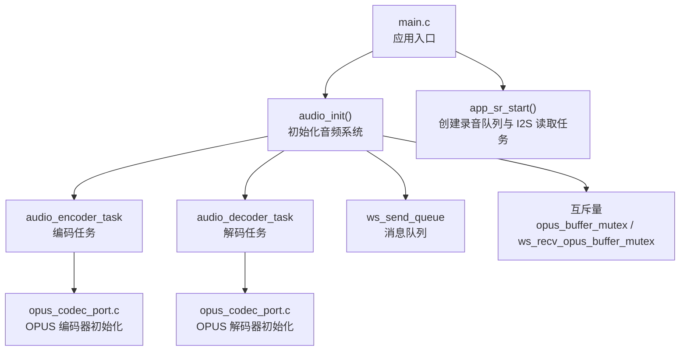
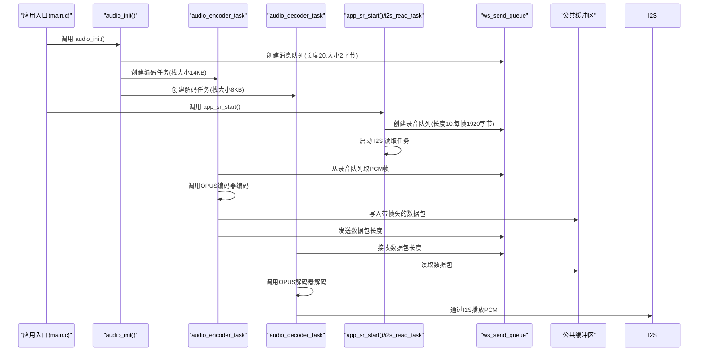
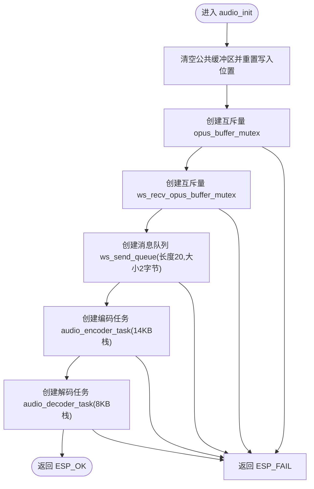
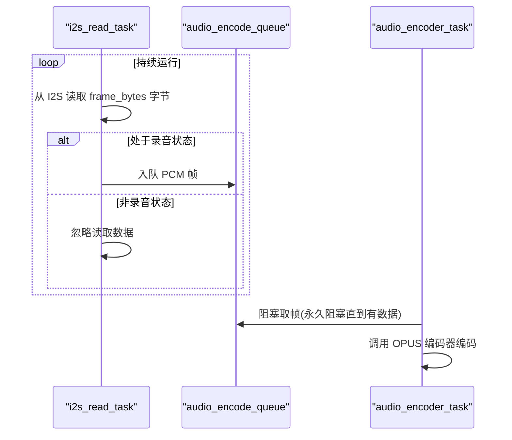
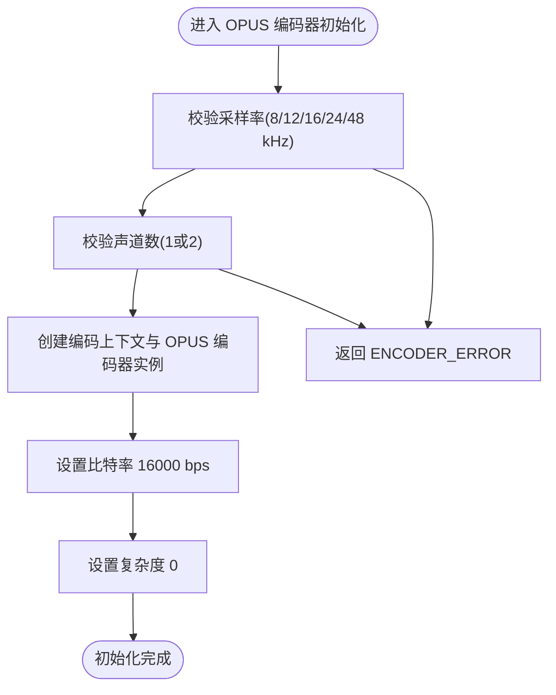
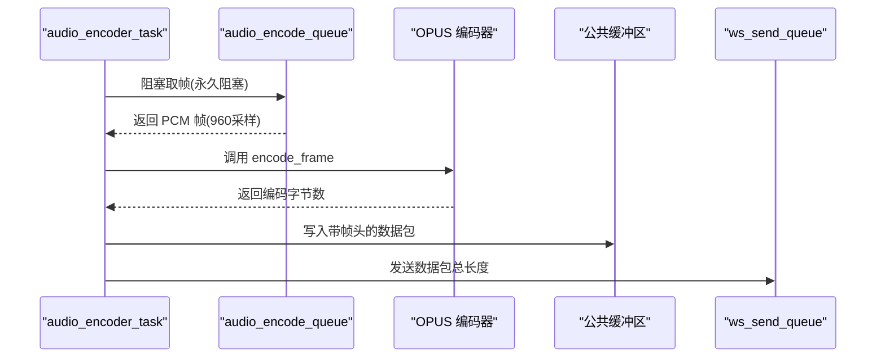
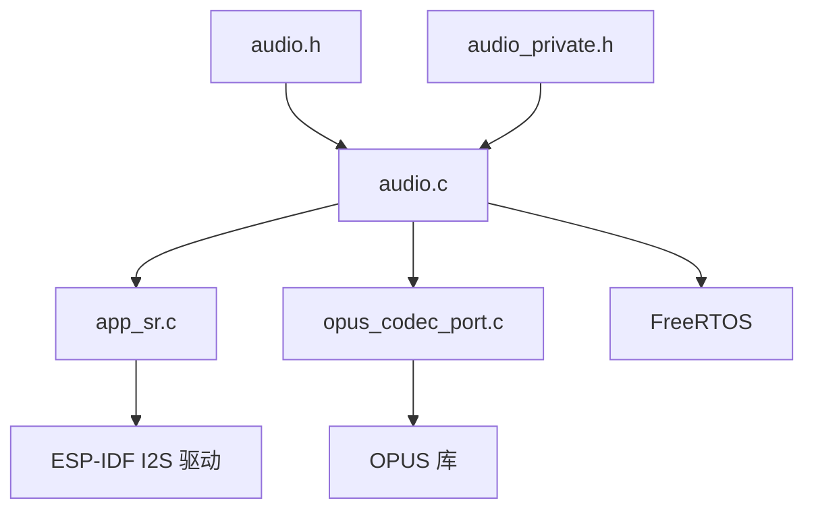

# 音频初始化 API

<cite>
**本文档引用的文件**
- [main.c](file://main/main.c)
- [audio.h](file://main/app/audio/audio.h)
- [audio_private.h](file://main/app/audio/audio_private.h)
- [audio.c](file://main/app/audio/audio.c)
- [app_sr.c](file://main/app/audio/app_sr.c)
- [opus_codec_port.c](file://main/app/audio/opus_codec_port.c)
</cite>

## 目录
1. [简介](#简介)
2. [项目结构](#项目结构)
3. [核心组件](#核心组件)
4. [架构概览](#架构概览)
5. [详细组件分析](#详细组件分析)
6. [依赖关系分析](#依赖关系分析)
7. [性能考虑](#性能考虑)
8. [故障排除指南](#故障排除指南)
9. [结论](#结论)
10. [附录](#附录)

## 简介
本文件面向开发者，系统化地记录音频系统初始化 API 的完整接口规范与实现细节，涵盖以下方面：
- 音频硬件初始化与 I2S 接口配置
- 采样率设置与帧格式约束
- 缓冲区分配与内存管理策略
- 初始化参数配置、错误处理机制与状态检查
- 最佳实践与常见问题解决方案
- 完整的代码示例路径，展示如何正确初始化音频系统

该初始化 API 位于 main/app/audio/audio.c 中的 audio_init 函数，负责创建任务、队列与互斥量，为后续录音、编码、解码与播放流程奠定基础。

## 项目结构
音频相关代码集中在 main/app/audio 目录，关键文件如下：
- audio.h：对外公开的音频 API 声明，包括 audio_init
- audio_private.h：音频编解码器抽象接口与数据结构定义
- audio.c：音频系统初始化、任务调度、缓冲区与互斥量管理
- app_sr.c：I2S 读取任务与录音队列创建
- opus_codec_port.c：OPUS 编解码器初始化、参数校验与编码流程

**图表来源**
- [main.c:33-51](file://main/main.c#L33-L51)
- [audio.c:845-925](file://main/app/audio/audio.c#L845-L925)
- [app_sr.c:56-70](file://main/app/audio/app_sr.c#L56-L70)

**章节来源**
- [main.c:33-51](file://main/main.c#L33-L51)
- [audio.h:8-22](file://main/app/audio/audio.h#L8-L22)
- [audio_private.h:76-121](file://main/app/audio/audio_private.h#L76-L121)

## 核心组件
- 音频初始化函数：audio_init()
  - 功能：初始化公共缓冲区、创建互斥量、创建消息队列、创建编码与解码任务
  - 返回值：ESP_OK 表示成功；否则返回错误码
  - 关键行为：创建 ws_send_queue（长度 20，元素大小 2 字节）、创建音频编码与解码任务、创建两个互斥量用于保护缓冲区
- I2S 读取与录音队列：app_sr_start() 与 i2s_read_task
  - 功能：创建录音队列（长度 10，每帧 1920 字节）、创建 I2S 读取任务，周期性从 I2S 读取 PCM 数据并入队
- OPUS 编解码器：opus_codec_port.c
  - 功能：初始化 OPUS 编码器（采样率、声道数、比特率、复杂度等）、执行编码与解码
- 任务与缓冲区
  - 编码任务：从录音队列取 PCM 帧，调用编码器编码，生成带帧头的数据包，写入公共缓冲区并通过队列通知解码任务
  - 解码任务：从公共缓冲区读取数据包，解析帧头，调用解码器解码，通过 I2S 播放

**章节来源**
- [audio.c:845-925](file://main/app/audio/audio.c#L845-L925)
- [app_sr.c:56-70](file://main/app/audio/app_sr.c#L56-L70)
- [opus_codec_port.c:254-301](file://main/app/audio/opus_codec_port.c#L254-L301)

## 架构概览
音频系统采用“初始化 → 任务创建 → 数据流处理”的分层架构：
- 初始化层：audio_init 负责系统级资源分配（队列、互斥量、任务）
- 采集层：I2S 读取任务将 PCM 数据送入录音队列
- 编码层：编码任务从队列取帧，调用 OPUS 编码器生成压缩数据
- 传输层：编码后的数据包通过公共缓冲区与消息队列传递给解码任务
- 播放层：解码任务解码后通过 I2S 播放

**图表来源**
- [main.c:49](file://main/main.c#L49)
- [audio.c:845-925](file://main/app/audio/audio.c#L845-L925)
- [app_sr.c:56-70](file://main/app/audio/app_sr.c#L56-L70)

## 详细组件分析

### 音频初始化 API：audio_init()
- 接口定义
  - 函数名：audio_init()
  - 返回值：esp_err_t（ESP_OK 或错误码）
  - 头文件：audio.h
- 初始化步骤
  - 清空公共缓冲区并重置写入位置
  - 创建互斥量：opus_buffer_mutex（保护编码输出缓冲区）、ws_recv_opus_buffer_mutex（保护 WebSocket 接收缓冲区）
  - 创建消息队列：ws_send_queue（长度 20，元素大小 2 字节，用于存放数据包总长度）
  - 创建任务：
    - audio_encoder_task（栈大小 14KB，优先级 4，绑定核心 1）
    - audio_decoder_task（栈大小 8KB，优先级 5，绑定核心 1）
- 错误处理
  - 任一资源创建失败均返回 ESP_FAIL
  - 任务创建失败会记录错误日志
- 状态检查
  - 通过返回值判断初始化是否成功
  - 任务句柄可用于后续任务控制（在当前实现中未使用）

**图表来源**
- [audio.c:845-925](file://main/app/audio/audio.c#L845-L925)

**章节来源**
- [audio.h:14](file://main/app/audio/audio.h#L14)
- [audio.c:845-925](file://main/app/audio/audio.c#L845-L925)

### I2S 接口配置与录音队列
- 录音队列
  - 名称：audio_encode_queue
  - 长度：10
  - 每帧大小：BYTES_PER_FRAME（由 app_sr.h 定义，实际值见 app_sr.c 第 25 行注释）
  - 创建位置：app_sr_start()
- I2S 读取任务
  - 名称：i2s_read_task
  - 栈大小：4KB
  - 绑定核心：1
  - 行为：循环从 I2S 读取指定字节数的 PCM 数据，若处于录音状态则入队
- 采样率与帧格式
  - 编码器期望每帧采样数：960（对应 60ms @16kHz 单声道）
  - I2S 读取任务每次读取的字节数与编码器帧大小一致（1920 字节）

**图表来源**
- [app_sr.c:23-54](file://main/app/audio/app_sr.c#L23-L54)
- [app_sr.c:56-70](file://main/app/audio/app_sr.c#L56-L70)

**章节来源**
- [app_sr.c:23-54](file://main/app/audio/app_sr.c#L23-L54)
- [app_sr.c:56-70](file://main/app/audio/app_sr.c#L56-L70)

### OPUS 编码器初始化与参数配置
- 初始化流程
  - 采样率：CONFIG_OPUS_AUDIO_ENCODER_SAMPLE_RATE（构建配置中定义）
  - 声道数：CONFIG_OPUS_AUDIO_CHANNELS（构建配置中定义）
  - 比特率：16000 bps
  - 每帧采样数：(采样率 × 60) / 1000（60ms 帧长）
  - 应用模式：OPUS_APPLICATION_VOIP（语音优先）
- 参数校验
  - 采样率仅支持 8000、12000、16000、24000、48000 Hz
  - 声道数仅支持 1 或 2
- 编码参数
  - 设置比特率与复杂度（复杂度设为 0 以降低 CPU 开销）

**图表来源**
- [opus_codec_port.c:254-301](file://main/app/audio/opus_codec_port.c#L254-L301)

**章节来源**
- [opus_codec_port.c:254-301](file://main/app/audio/opus_codec_port.c#L254-L301)

### OPUS 解码器初始化与参数配置
- 初始化流程
  - 从 Ogg Opus 文件头解析采样率与声道数
  - 采样率范围校验：8000–48000 Hz
  - 创建 OPUS 解码器实例（采样率与声道数来自文件头）
- 使用场景
  - 音频播放：audio_play_file() 与 audio_play_opus_file() 会注册并初始化解码器
  - 测试回放：audio_decoder_test_task() 使用固定采样率 16000 Hz、单声道进行解码与播放

**章节来源**
- [opus_codec_port.c:131-152](file://main/app/audio/opus_codec_port.c#L131-L152)
- [audio.c:112-205](file://main/app/audio/audio.c#L112-L205)
- [audio.c:208-308](file://main/app/audio/audio.c#L208-L308)

### 编码任务与数据包封装
- 数据包结构
  - 帧头：6 字节（标识、包序号、OPUS 数据长度）
  - OPUS 数据：编码后的压缩数据
- 编码流程
  - 从录音队列取 PCM 帧（960 采样，16 位，单声道）
  - 调用编码器 encode_frame 进行编码
  - 将编码结果写入公共缓冲区，更新包序号与长度字段
  - 通过 ws_send_queue 发送数据包总长度，唤醒解码任务

**图表来源**
- [audio.c:699-791](file://main/app/audio/audio.c#L699-L791)
- [opus_codec_port.c:313-370](file://main/app/audio/opus_codec_port.c#L313-L370)

**章节来源**
- [audio.c:699-791](file://main/app/audio/audio.c#L699-L791)
- [opus_codec_port.c:313-370](file://main/app/audio/opus_codec_port.c#L313-L370)

### 解码任务与 I2S 播放
- 解码流程
  - 从 ws_send_queue 接收数据包长度
  - 从公共缓冲区读取完整数据包
  - 解析帧头，提取包序号与 OPUS 数据长度
  - 调用解码器解码为 PCM 数据
  - 通过 I2S 写出 PCM 数据进行播放
- 事件驱动
  - audio_start_event() 与 audio_end_event() 控制解码任务的状态切换

**章节来源**
- [audio.c:399-550](file://main/app/audio/audio.c#L399-L550)
- [audio.c:612-697](file://main/app/audio/audio.c#L612-L697)

## 依赖关系分析
- 外部依赖
  - FreeRTOS：任务、队列、互斥量
  - ESP-IDF I2S 驱动：音频采集与播放
  - OPUS 库：音频编码与解码
  - SPIFFS：音频文件读取（播放 MP3/Opus）
- 内部依赖
  - audio.h 与 audio_private.h：定义编解码器接口与数据结构
  - app_sr.c：提供 I2S 读取与录音队列
  - opus_codec_port.c：提供 OPUS 编解码器实现

**图表来源**
- [audio.h:8-22](file://main/app/audio/audio.h#L8-L22)
- [audio_private.h:76-121](file://main/app/audio/audio_private.h#L76-L121)
- [audio.c:1-15](file://main/app/audio/audio.c#L1-L15)
- [app_sr.c:10-13](file://main/app/audio/app_sr.c#L10-L13)
- [opus_codec_port.c:131-152](file://main/app/audio/opus_codec_port.c#L131-L152)

**章节来源**
- [audio.h:8-22](file://main/app/audio/audio.h#L8-L22)
- [audio_private.h:76-121](file://main/app/audio/audio_private.h#L76-L121)
- [audio.c:1-15](file://main/app/audio/audio.c#L1-L15)
- [app_sr.c:10-13](file://main/app/audio/app_sr.c#L10-L13)
- [opus_codec_port.c:131-152](file://main/app/audio/opus_codec_port.c#L131-L152)

## 性能考虑
- 任务栈大小
  - 编码任务：14KB（包含 OPUS 编码与缓冲区操作）
  - 解码任务：8KB（包含 OPUS 解码与 I2S 写出）
  - I2S 读取任务：4KB（高频读取，建议保持稳定）
- 队列深度
  - 录音队列：10 帧，建议根据 CPU 负载与实时性需求调整
  - 发送队列：20 个长度值，满足编码速率下的峰值需求
- 缓冲区策略
  - 公共缓冲区采用环形缓冲区设计，配合互斥量保证线程安全
  - 建议预留充足的剩余空间，避免频繁丢帧
- 采样率与帧长
  - 60ms 帧长在低延迟与 CPU 开销之间取得平衡
  - 采样率与声道数必须与编码器期望一致，否则编码失败

[本节为通用指导，不直接分析具体文件]

## 故障排除指南
- 初始化失败
  - 症状：audio_init 返回 ESP_FAIL
  - 可能原因：互斥量创建失败、队列创建失败、任务创建失败
  - 处理：检查堆与 PSRAM 使用情况，确认任务栈大小与优先级合理
- I2S 读取失败
  - 症状：日志显示 I2S read failed
  - 可能原因：I2S 引脚配置错误、采样率与硬件不匹配
  - 处理：核对硬件连接与采样率设置（16kHz）
- 编码失败
  - 症状：编码器返回 ENCODER_ERROR 或 ENCODER_EMPTY
  - 可能原因：输入采样数不匹配、输出缓冲区不足、编码器未初始化
  - 处理：确保每帧采样数为 960，输出缓冲区至少 200 字节
- 解码失败
  - 症状：解码器返回负值或 0 样本
  - 可能原因：数据包长度无效、帧头标识错误、OPUS 数据损坏
  - 处理：检查帧头解析逻辑与数据包完整性
- 队列满导致丢帧
  - 症状：日志提示队列满，丢弃帧
  - 可能原因：解码速度慢于编码速度
  - 处理：提高解码任务优先级或增大队列深度

**章节来源**
- [audio.c:845-925](file://main/app/audio/audio.c#L845-L925)
- [app_sr.c:36-50](file://main/app/audio/app_sr.c#L36-L50)
- [opus_codec_port.c:335-370](file://main/app/audio/opus_codec_port.c#L335-L370)

## 结论
audio_init() 提供了音频系统初始化的核心能力，统一管理任务、队列与互斥量，为录音、编码、解码与播放建立可靠的数据通路。结合 I2S 读取与 OPUS 编解码器，系统实现了从硬件采集到云端传输再到本地播放的完整链路。遵循本文档的参数配置、错误处理与最佳实践，可显著提升系统的稳定性与性能。

[本节为总结性内容，不直接分析具体文件]

## 附录

### 接口规范摘要
- 函数：audio_init()
  - 功能：初始化音频系统，创建任务、队列与互斥量
  - 返回：ESP_OK 或错误码
  - 头文件：audio.h
- 相关常量与配置
  - 采样率：16000 Hz（编码器期望）
  - 帧长：60 ms（每帧 960 采样，单声道）
  - 队列长度：录音队列 10，发送队列 20
  - 任务栈大小：编码任务 14KB，解码任务 8KB，I2S 读取任务 4KB

**章节来源**
- [audio.h:14](file://main/app/audio/audio.h#L14)
- [app_sr.c:25-26](file://main/app/audio/app_sr.c#L25-L26)
- [opus_codec_port.c:254-301](file://main/app/audio/opus_codec_port.c#L254-L301)

### 代码示例路径
- 在应用入口调用初始化
  - [main.c:49](file://main/main.c#L49)
- 初始化音频系统
  - [audio.c:845-925](file://main/app/audio/audio.c#L845-L925)
- 创建录音队列与 I2S 读取任务
  - [app_sr.c:56-70](file://main/app/audio/app_sr.c#L56-L70)
- OPUS 编码器初始化与编码
  - [opus_codec_port.c:254-301](file://main/app/audio/opus_codec_port.c#L254-L301)
  - [opus_codec_port.c:313-370](file://main/app/audio/opus_codec_port.c#L313-L370)
- OPUS 解码器初始化与解码
  - [opus_codec_port.c:131-152](file://main/app/audio/opus_codec_port.c#L131-L152)
  - [audio.c:399-550](file://main/app/audio/audio.c#L399-L550)