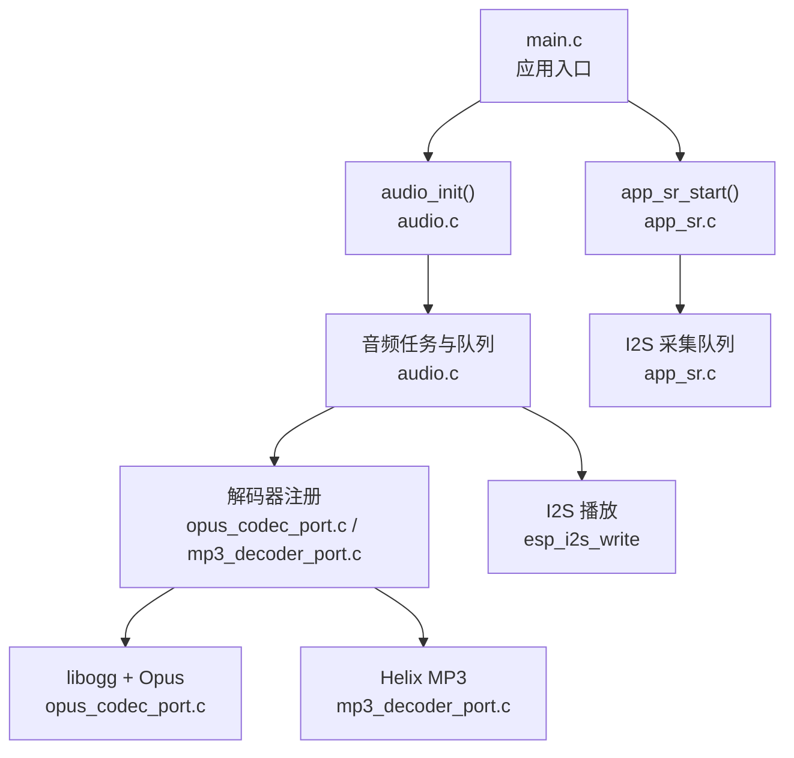
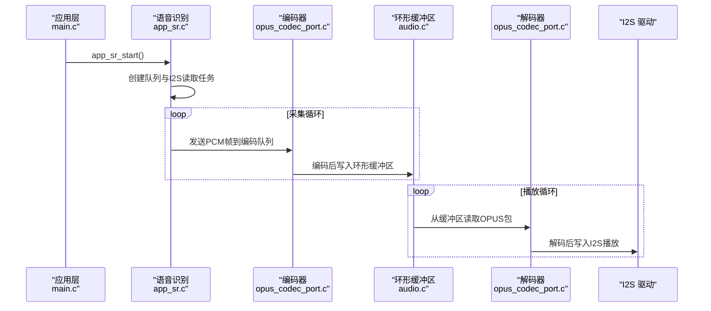
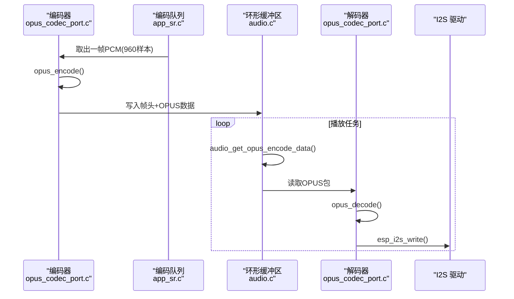
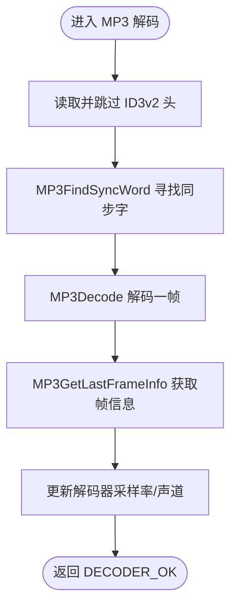
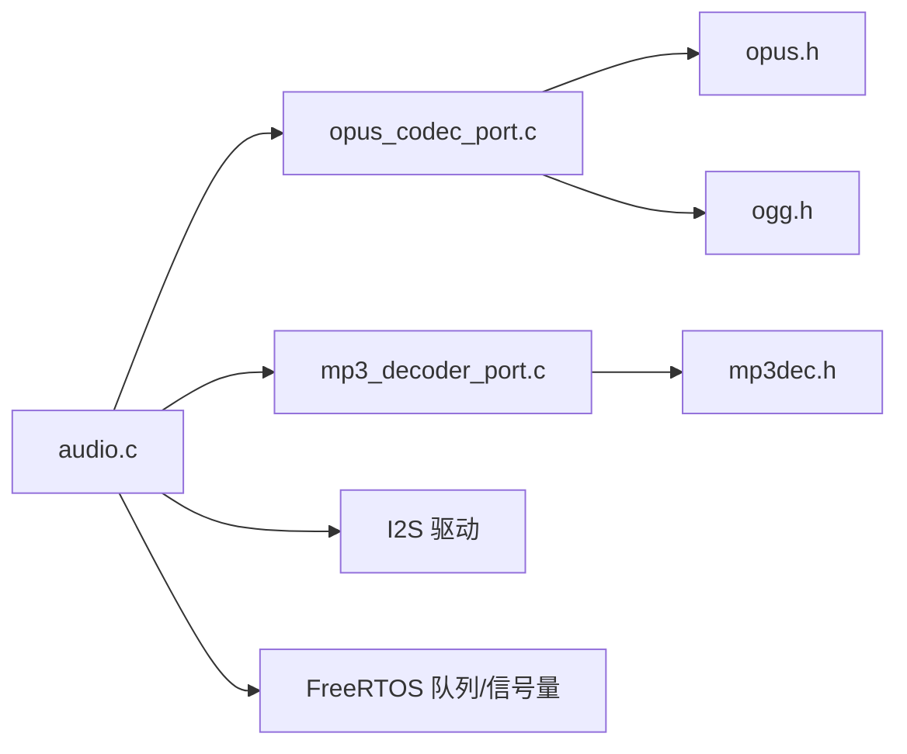

# 音频处理 API

<cite>
**本文引用的文件**
- [main.c](file://main/main.c)
- [audio.h](file://main/app/audio/audio.h)
- [audio.c](file://main/app/audio/audio.c)
- [audio_private.h](file://main/app/audio/audio_private.h)
- [app_sr.h](file://main/app/audio/app_sr.h)
- [app_sr.c](file://main/app/audio/app_sr.c)
- [mp3_decoder_port.c](file://main/app/audio/mp3_decoder_port.c)
- [opus_codec_port.c](file://main/app/audio/opus_codec_port.c)
- [mp3dec.h](file://components/helix-mp3/fixpnt/pub/mp3dec.h)
- [opus.h](file://components/opus-1.5.2/include/opus.h)
</cite>

## 目录
1. [简介](#简介)
2. [项目结构](#项目结构)
3. [核心组件](#核心组件)
4. [架构总览](#架构总览)
5. [详细组件分析](#详细组件分析)
6. [依赖关系分析](#依赖关系分析)
7. [性能考虑](#性能考虑)
8. [故障排查指南](#故障排查指南)
9. [结论](#结论)
10. [附录](#附录)

## 简介
本文件系统化梳理了项目中的音频处理 API，涵盖音频初始化、播放、语音识别、编解码器注册与配置、缓冲区与队列管理、采样率与质量控制、线程安全与性能优化等。重点面向 Opus 与 MP3 的编解码流程，提供接口规范、调用序列图与流程图，帮助开发者快速集成与排障。

## 项目结构
音频相关代码主要位于 main/app/audio 目录，配合外部组件库（Helix MP3、libogg、Opus）实现完整的编解码链路；顶层入口在 main.c 中统一初始化并启动音频与语音识别任务。

图表来源
- [main.c:33-60](file://main/main.c#L33-L60)
- [audio.c:421-697](file://main/app/audio/audio.c#L421-L697)
- [app_sr.c:56-99](file://main/app/audio/app_sr.c#L56-L99)
- [opus_codec_port.c:395-410](file://main/app/audio/opus_codec_port.c#L395-L410)
- [mp3_decoder_port.c:206-216](file://main/app/audio/mp3_decoder_port.c#L206-L216)

章节来源
- [main.c:33-60](file://main/main.c#L33-L60)
- [audio.c:17-50](file://main/app/audio/audio.c#L17-L50)

## 核心组件
- 音频公共接口与任务
  - 初始化与播放：audio_init、audio_play、audio_play_opus_file、audio_set_volume
  - 编解码器注册：decoder_ops_register、encoder_ops_register
  - WebSocket 数据处理：ws_recv_data_handler、mread
  - 事件与状态：audio_start_event、audio_end_event
  - 编码数据读取：audio_get_opus_encode_data
- 抽象编解码器接口
  - 音频解码器结构体与回调：audio_decoder、audio_decoder_info_t、data_source_t
  - 音频编码器结构体与回调：audio_encoder、audio_encoder_info_t
- 语音识别（录音采集）
  - I2S 读取任务、编码队列、录音开关与状态查询

章节来源
- [audio.h:9-21](file://main/app/audio/audio.h#L9-L21)
- [audio_private.h:77-121](file://main/app/audio/audio_private.h#L77-L121)
- [app_sr.h:24-49](file://main/app/audio/app_sr.h#L24-L49)

## 架构总览
整体采用“采集-编码-缓存-解码-播放”的流水线式设计，I2S 负责硬件 PCM 采集与回放，FreeRTOS 队列承载音频帧，外部组件负责压缩编解码。

图表来源
- [app_sr.c:56-99](file://main/app/audio/app_sr.c#L56-L99)
- [opus_codec_port.c:699-790](file://main/app/audio/audio.c#L699-L790)
- [audio.c:316-354](file://main/app/audio/audio.c#L316-L354)
- [opus_codec_port.c:51-203](file://main/app/audio/opus_codec_port.c#L51-L203)

## 详细组件分析

### 音频初始化与播放
- 初始化
  - audio_init：负责创建任务、信号量、队列等基础资源
  - 采样率与声道：通过 CONFIG_OPUS_AUDIO_ENCODER_SAMPLE_RATE、CONFIG_OPUS_AUDIO_CHANNELS 控制
- 播放接口
  - audio_play：播放指定源（内部封装）
  - audio_play_opus_file：播放 Ogg Opus 文件
  - audio_set_volume：设置音量（声明未在当前仓库实现）

章节来源
- [audio.c:17-50](file://main/app/audio/audio.c#L17-L50)
- [audio.c:112-205](file://main/app/audio/audio.c#L112-L205)
- [audio.c:211-308](file://main/app/audio/audio.c#L211-L308)
- [audio.h:9-21](file://main/app/audio/audio.h#L9-L21)

### 编解码器注册与抽象接口
- 抽象接口
  - 解码器：init、decode_frame、deinit；携带音频信息（采样率、声道）
  - 编码器：init、encode_frame、deinit；携带采样率、声道、比特率、帧样本数
  - 数据源：FILE 或 Buffer 两种模式
- 注册方式
  - decoder_ops_register、encoder_ops_register 将具体实现注入抽象接口

章节来源
- [audio_private.h:77-121](file://main/app/audio/audio_private.h#L77-L121)
- [opus_codec_port.c:395-410](file://main/app/audio/opus_codec_port.c#L395-L410)
- [mp3_decoder_port.c:206-216](file://main/app/audio/mp3_decoder_port.c#L206-L216)

### Opus 编解码 API 使用
- 编码
  - 初始化：opus_encoder_create（应用模式 VOIP）、设置比特率与复杂度
  - 编码：opus_encode（每帧样本数由 CONFIG_OPUS_AUDIO_ENCODER_SAMPLE_RATE 与 60ms 决定）
  - 输出：OPUS 数据包，带帧头（包序号、OPUS 数据长度）
- 解码
  - 初始化：ogg_sync/ogg_stream + opus_decoder_create
  - 流程：页解析 → 包解析 → OpusHead/OpusTags 处理 → opus_decode
  - 输出：PCM（int16_t）

图表来源
- [app_sr.c:22-54](file://main/app/audio/app_sr.c#L22-L54)
- [opus_codec_port.c:241-370](file://main/app/audio/opus_codec_port.c#L241-L370)
- [audio.c:316-354](file://main/app/audio/audio.c#L316-L354)
- [opus_codec_port.c:51-203](file://main/app/audio/opus_codec_port.c#L51-L203)

章节来源
- [opus_codec_port.c:241-370](file://main/app/audio/opus_codec_port.c#L241-L370)
- [opus_codec_port.c:51-203](file://main/app/audio/opus_codec_port.c#L51-L203)
- [opus.h:208-269](file://components/opus-1.5.2/include/opus.h#L208-L269)
- [opus.h:438-484](file://components/opus-1.5.2/include/opus.h#L438-L484)

### MP3 解码 API 使用
- 初始化：MP3InitDecoder，分配内部 RAM 缓冲区
- 解码：MP3FindSyncWord 定位同步字 → MP3Decode 解码一帧 → MP3GetLastFrameInfo 获取采样率/声道
- 特性：自动跳过 ID3v2 头，保证后续音频数据连续

图表来源
- [mp3_decoder_port.c:78-189](file://main/app/audio/mp3_decoder_port.c#L78-L189)
- [mp3dec.h:125-131](file://components/helix-mp3/fixpnt/pub/mp3dec.h#L125-L131)

章节来源
- [mp3_decoder_port.c:44-76](file://main/app/audio/mp3_decoder_port.c#L44-L76)
- [mp3_decoder_port.c:78-189](file://main/app/audio/mp3_decoder_port.c#L78-L189)
- [mp3dec.h:125-131](file://components/helix-mp3/fixpnt/pub/mp3dec.h#L125-L131)

### 语音识别（录音采集）接口
- app_sr_start：创建编码队列与 I2S 读取任务，每帧 60ms @16kHz 单声道（1920 字节）
- app_sr_start_api_recording / app_sr_stop_api_recording：由上层状态机触发录音
- app_sr_is_api_recording：查询录音状态

章节来源
- [app_sr.c:56-99](file://main/app/audio/app_sr.c#L56-L99)
- [app_sr.h:24-49](file://main/app/audio/app_sr.h#L24-L49)

### 缓冲区与队列管理
- 环形缓冲区
  - opus_output_buffer：存放 OPUS 编码后的数据
  - ws_recv_opus_buffer：接收 WebSocket 的 OPUS 数据
  - 互斥信号量保护：opus_buffer_mutex、ws_recv_opus_buffer_mutex
- 队列
  - audio_encode_queue：I2S 采集 PCM 帧到编码器
  - ws_send_queue：编码器输出包长度（用于播放任务读取）

章节来源
- [audio.c:23-50](file://main/app/audio/audio.c#L23-L50)
- [audio.c:316-354](file://main/app/audio/audio.c#L316-L354)
- [app_sr.c:58-63](file://main/app/audio/app_sr.c#L58-L63)

### 事件与状态查询
- 事件：AUDIO_EVENT_START/AUDIO_EVENT_END/AUDIO_EVENT_PLAYING/AUDIO_EVENT_NONE
- 接口：audio_start_event、audio_end_event
- 作用：控制解码器生命周期与播放状态切换

章节来源
- [audio.c:60-68](file://main/app/audio/audio.c#L60-L68)
- [audio.c:612-619](file://main/app/audio/audio.c#L612-L619)

## 依赖关系分析
- 组件耦合
  - audio.c 依赖：I2S、SPIRAM、FreeRTOS（队列/信号量）、libogg、Opus、Helix MP3
  - app_sr.c 依赖：I2S、队列、音频编码器注册
  - 编解码器通过抽象接口解耦，便于替换不同实现
- 外部依赖
  - Opus：编码/解码、CTL 设置
  - libogg：Ogg 页面/包解析
  - Helix MP3：同步字定位与帧解码

图表来源
- [audio.c:15-16](file://main/app/audio/audio.c#L15-L16)
- [opus_codec_port.c:1-7](file://main/app/audio/opus_codec_port.c#L1-L7)
- [mp3_decoder_port.c:1-8](file://main/app/audio/mp3_decoder_port.c#L1-L8)
- [opus.h:33-41](file://components/opus-1.5.2/include/opus.h#L33-L41)
- [mp3dec.h:44-74](file://components/helix-mp3/fixpnt/pub/mp3dec.h#L44-L74)

章节来源
- [audio.c:15-16](file://main/app/audio/audio.c#L15-L16)
- [opus_codec_port.c:1-7](file://main/app/audio/opus_codec_port.c#L1-L7)
- [mp3_decoder_port.c:1-8](file://main/app/audio/mp3_decoder_port.c#L1-L8)

## 性能考虑
- 内存与缓存
  - 优先使用 SPIRAM 分配解码器上下文与缓冲区，降低 ICache 压力
  - Helix MP3 强制使用内部 RAM，避免 PSRAM 访问抖动
- 帧与时延
  - 编码帧：60ms @16kHz 单声道（960 样本），减少调度开销
  - 解码帧：每次读取 960 字节（对应 60ms），与编码帧对齐
- 并发与锁
  - 环形缓冲区使用互斥信号量保护，避免竞态
  - 队列满时丢帧（日志提示），防止阻塞
- I2S 写入
  - 成功写入后才继续下一帧，失败时短时退出避免卡死

章节来源
- [opus_codec_port.c:241-301](file://main/app/audio/opus_codec_port.c#L241-L301)
- [mp3_decoder_port.c:48-76](file://main/app/audio/mp3_decoder_port.c#L48-L76)
- [audio.c:47-50](file://main/app/audio/audio.c#L47-L50)
- [audio.c:473-475](file://main/app/audio/audio.c#L473-L475)

## 故障排查指南
- 编码/解码错误
  - Opus：检查编码器初始化返回值、输出缓冲区大小、输入样本数是否匹配
  - MP3：确认同步字查找成功、ID3v2 头跳过正确
- I2S 写入失败
  - 检查 I2S 配置、驱动返回值，必要时降低采样率或帧长
- 队列/缓冲区异常
  - 队列满导致丢帧；环形缓冲区空间不足丢弃当前帧
  - 检查互斥信号量获取超时日志
- 事件状态
  - 播放结束但未复位：确认 audio_end_event 是否被调用

章节来源
- [opus_codec_port.c:178-202](file://main/app/audio/opus_codec_port.c#L178-L202)
- [mp3_decoder_port.c:168-188](file://main/app/audio/mp3_decoder_port.c#L168-L188)
- [audio.c:526-538](file://main/app/audio/audio.c#L526-L538)
- [audio.c:777-781](file://main/app/audio/audio.c#L777-L781)

## 结论
该音频处理模块以抽象接口为核心，结合 FreeRTOS 任务与队列，实现了从 I2S 采集、Opus 编码、环形缓冲、WebSocket 接收、到 Opus 解码与 I2S 播放的完整链路。通过合理的内存分配策略、帧长与时延控制与并发保护，满足实时性与稳定性需求。建议在生产环境中进一步完善错误恢复与统计上报机制。

## 附录

### API 接口清单与说明
- 初始化与播放
  - audio_init：初始化音频系统（任务、队列、信号量）
  - audio_play：播放音频（内部封装）
  - audio_play_opus_file：播放 Ogg Opus 文件
  - audio_set_volume：设置音量（声明存在，实现需补充）
- 编解码器注册
  - decoder_ops_register：注册解码器实现
  - encoder_ops_register：注册编码器实现
- WebSocket 与缓冲
  - ws_recv_data_handler：写入 WebSocket 接收缓冲
  - mread：从缓冲区读取数据
  - audio_get_opus_encode_data：从环形缓冲区读取 OPUS 数据
- 事件与状态
  - audio_start_event：开始事件（重置缓冲、进入 START）
  - audio_end_event：结束事件（进入 END）
- 语音识别
  - app_sr_start：启动录音采集任务与队列
  - app_sr_start_api_recording / app_sr_stop_api_recording：API 触发录音启停
  - app_sr_is_api_recording：查询录音状态

章节来源
- [audio.h:9-21](file://main/app/audio/audio.h#L9-L21)
- [audio.c:612-619](file://main/app/audio/audio.c#L612-L619)
- [app_sr.h:24-49](file://main/app/audio/app_sr.h#L24-L49)