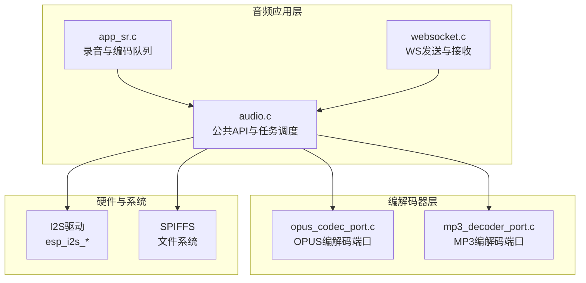
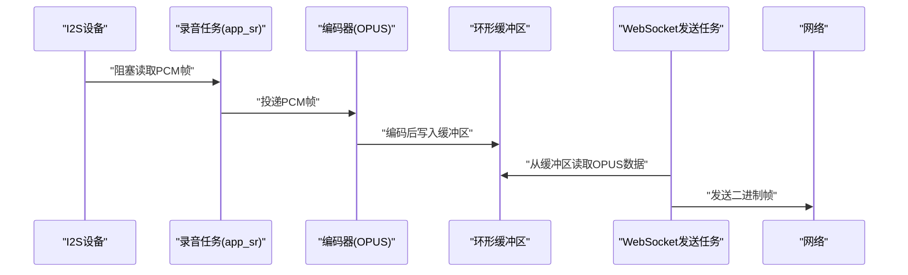
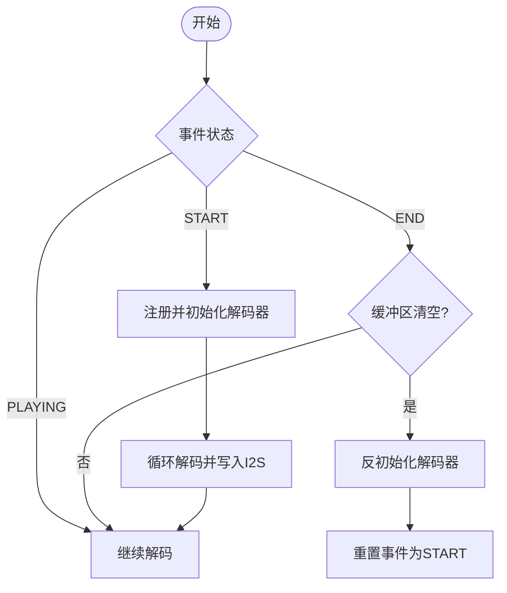
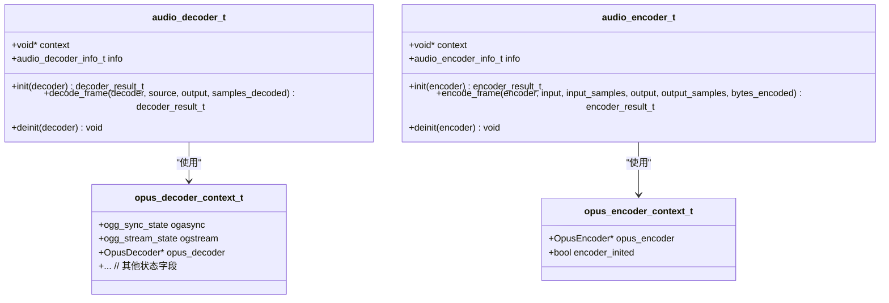
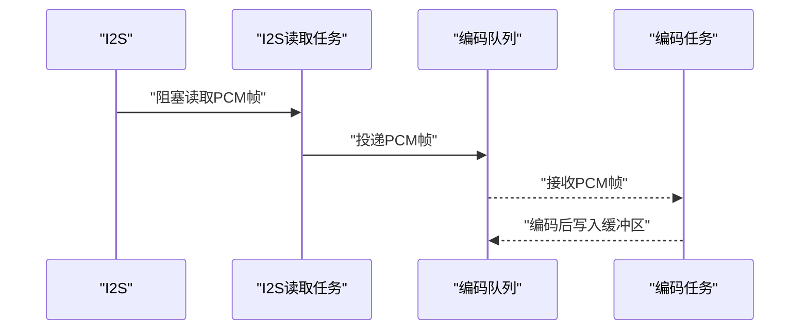
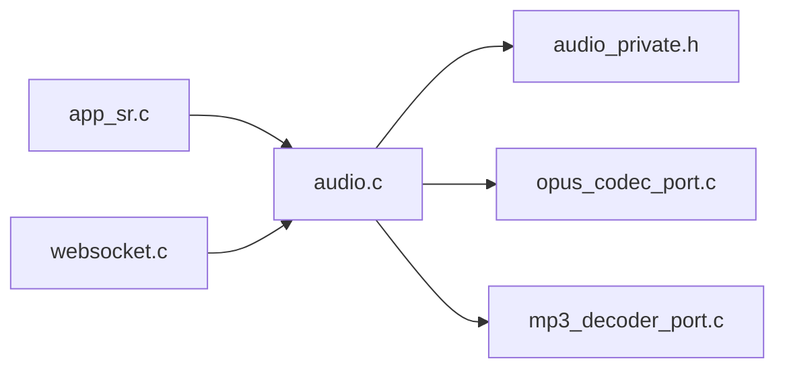

# 音频控制 API

<cite>
**本文引用的文件**
- [audio.h](file://main/app/audio/audio.h)
- [audio.c](file://main/app/audio/audio.c)
- [audio_private.h](file://main/app/audio/audio_private.h)
- [opus_codec_port.c](file://main/app/audio/opus_codec_port.c)
- [mp3_decoder_port.c](file://main/app/audio/mp3_decoder_port.c)
- [app_sr.h](file://main/app/audio/app_sr.h)
- [app_sr.c](file://main/app/audio/app_sr.c)
- [websocket.c](file://main/app/websocket/websocket.c)
</cite>

## 目录
1. [简介](#简介)
2. [项目结构](#项目结构)
3. [核心组件](#核心组件)
4. [架构总览](#架构总览)
5. [详细组件分析](#详细组件分析)
6. [依赖关系分析](#依赖关系分析)
7. [性能考量](#性能考量)
8. [故障排查指南](#故障排查指南)
9. [结论](#结论)
10. [附录](#附录)

## 简介
本文件面向“音频控制 API”的使用者与维护者，系统化梳理音频系统的接口规范、处理链路、动态配置与实时性保障。重点覆盖以下方面：
- 音频路由控制与设备切换能力边界
- 音效处理与实时参数调整现状
- 音频处理链路的动态配置与效果器参数设置
- 音频质量监控与异常处理策略
- 实时性要求与性能优化建议
- 动态控制场景的实际代码示例路径

## 项目结构
音频子系统位于 main/app/audio 目录，围绕“抽象编解码器接口 + 具体实现 + 任务调度 + 通信桥接”组织，主要文件如下：
- 接口与公共 API：audio.h、audio.c
- 抽象编解码器接口：audio_private.h
- OPUS 编解码器端口：opus_codec_port.c
- MP3 编解码器端口：mp3_decoder_port.c
- 录音与编码队列：app_sr.h、app_sr.c
- WebSocket 传输与发送任务：websocket.c

图示来源
- [audio.c:1-925](file://main/app/audio/audio.c#L1-L925)
- [opus_codec_port.c:1-410](file://main/app/audio/opus_codec_port.c#L1-L410)
- [mp3_decoder_port.c:1-216](file://main/app/audio/mp3_decoder_port.c#L1-L216)
- [app_sr.c:1-99](file://main/app/audio/app_sr.c#L1-L99)
- [websocket.c:1-578](file://main/app/websocket/websocket.c#L1-L578)

章节来源
- [audio.h:1-22](file://main/app/audio/audio.h#L1-L22)
- [audio.c:1-925](file://main/app/audio/audio.c#L1-L925)
- [audio_private.h:1-125](file://main/app/audio/audio_private.h#L1-L125)
- [opus_codec_port.c:1-410](file://main/app/audio/opus_codec_port.c#L1-L410)
- [mp3_decoder_port.c:1-216](file://main/app/audio/mp3_decoder_port.c#L1-L216)
- [app_sr.h:1-53](file://main/app/audio/app_sr.h#L1-L53)
- [app_sr.c:1-99](file://main/app/audio/app_sr.c#L1-L99)
- [websocket.c:1-578](file://main/app/websocket/websocket.c#L1-L578)

## 核心组件
- 抽象编解码器接口
  - 解码器接口：初始化、解码一帧、反初始化
  - 编码器接口：初始化、编码一帧、反初始化
  - 数据源抽象：文件与缓冲区两种数据源类型
- OPUS 编解码器端口
  - 使用 Ogg 容器 + Opus 解码器，支持流式解复用与头部识别
  - 编码器采用 VOIP 应用模式，参数可配置
- MP3 编解码器端口
  - 基于 Helix MP3 解码库，处理 ID3v2 头部与同步字查找
- 录音与编码队列
  - I2S 读取任务以固定帧大小阻塞读取 PCM
  - 将 PCM 帧投递至编码队列，供编码任务消费
- WebSocket 传输
  - 发送任务从音频缓冲区读取 OPUS 数据并发送二进制帧
  - 接收侧将 OPUS 数据写入环形缓冲区，供解码任务消费

章节来源
- [audio_private.h:34-121](file://main/app/audio/audio_private.h#L34-L121)
- [opus_codec_port.c:26-224](file://main/app/audio/opus_codec_port.c#L26-L224)
- [opus_codec_port.c:241-389](file://main/app/audio/opus_codec_port.c#L241-L389)
- [mp3_decoder_port.c:44-204](file://main/app/audio/mp3_decoder_port.c#L44-L204)
- [app_sr.c:22-74](file://main/app/audio/app_sr.c#L22-L74)
- [websocket.c:458-490](file://main/app/websocket/websocket.c#L458-L490)

## 架构总览
音频系统采用“任务分层 + 队列/缓冲区 + 抽象编解码器”的设计，形成如下处理链路：
- 录音链路：I2S → PCM 帧 → 编码队列 → OPUS 编码 → 本地缓冲区 → WebSocket 发送
- 播放链路：WebSocket 接收 → 环形缓冲区 → OPUS 解码 → I2S 播放
- 文件播放链路：SPIFFS 文件 → MP3/OPUS 解码 → I2S 播放

图示来源
- [app_sr.c:22-74](file://main/app/audio/app_sr.c#L22-L74)
- [opus_codec_port.c:313-370](file://main/app/audio/opus_codec_port.c#L313-L370)
- [audio.c:720-809](file://main/app/audio/audio.c#L720-L809)
- [websocket.c:458-490](file://main/app/websocket/websocket.c#L458-L490)

## 详细组件分析

### 组件A：音频公共 API 与任务调度
- 公共函数
  - 音量设置、播放文件、播放 OGG/Opus 文件、编解码器注册、初始化、从缓冲区读取编码数据、WebSocket 数据处理入口、解码器复位、mread 读取、音频事件开始/结束
- 关键数据结构
  - 环形缓冲区与互斥信号量，保证多任务并发安全
  - 事件状态机：开始、结束、播放中
- 任务职责
  - 编码测试任务：从队列接收数据包，解析帧头，解码并回放
  - 解码任务：注册/初始化解码器，从缓冲区读取数据，解码后写入 I2S
  - 录音任务：I2S 读取 PCM，按帧大小投递到编码队列

图示来源
- [audio.c:612-697](file://main/app/audio/audio.c#L612-L697)

章节来源
- [audio.h:8-21](file://main/app/audio/audio.h#L8-L21)
- [audio.c:1-925](file://main/app/audio/audio.c#L1-L925)

### 组件B：OPUS 编解码器端口
- 解码流程
  - Ogg 同步/流状态管理
  - 识别 OpusHead/OpusTags 头部，创建 Opus 解码器
  - 流式 packet 出队，调用 opus_decode 输出 PCM
- 编码流程
  - 创建 Opus 编码器（VOIP 应用模式）
  - 设置比特率、复杂度等参数
  - 固定帧大小输入，返回编码字节数

图示来源
- [audio_private.h:76-121](file://main/app/audio/audio_private.h#L76-L121)
- [opus_codec_port.c:12-22](file://main/app/audio/opus_codec_port.c#L12-L22)
- [opus_codec_port.c:26-224](file://main/app/audio/opus_codec_port.c#L26-L224)
- [opus_codec_port.c:230-389](file://main/app/audio/opus_codec_port.c#L230-L389)

章节来源
- [opus_codec_port.c:26-224](file://main/app/audio/opus_codec_port.c#L26-L224)
- [opus_codec_port.c:241-389](file://main/app/audio/opus_codec_port.c#L241-L389)

### 组件C：MP3 编解码器端口
- 特性
  - 处理 ID3v2 头部跳过
  - 同步字查找与帧定位
  - 输出采样率与声道数更新到解码器信息
- 适用场景
  - SPIFFS 文件播放（非实时）

章节来源
- [mp3_decoder_port.c:28-189](file://main/app/audio/mp3_decoder_port.c#L28-L189)

### 组件D：录音与编码队列（app_sr）
- I2S 读取任务
  - 固定帧大小阻塞读取
  - 在录音状态下将 PCM 帧投递到编码队列
- 队列与帧大小
  - 队列深度与每帧字节数由宏定义统一管理

图示来源
- [app_sr.c:22-74](file://main/app/audio/app_sr.c#L22-L74)
- [audio.c:699-809](file://main/app/audio/audio.c#L699-L809)

章节来源
- [app_sr.h:18-50](file://main/app/audio/app_sr.h#L18-L50)
- [app_sr.c:1-99](file://main/app/audio/app_sr.c#L1-L99)

### 组件E：WebSocket 传输与接收
- 发送任务
  - 从队列接收请求长度，读取 OPUS 数据，发送二进制帧
- 接收处理
  - 将 WebSocket 接收的二进制数据写入环形缓冲区，供解码任务消费

章节来源
- [websocket.c:458-490](file://main/app/websocket/websocket.c#L458-L490)
- [audio.c:553-575](file://main/app/audio/audio.c#L553-L575)

## 依赖关系分析
- 组件耦合
  - audio.c 依赖抽象接口（audio_private.h），通过 decoder_ops_register/encoder_ops_register 注入具体实现
  - app_sr.c 与 audio.c 通过全局队列句柄进行解耦
  - websocket.c 与 audio.c 通过公共缓冲区与队列交互
- 外部依赖
  - I2S 驱动、SPIFFS 文件系统、Opus/OGG 库、ESP-IDF FreeRTOS

图示来源
- [audio.c:1-925](file://main/app/audio/audio.c#L1-L925)
- [audio_private.h:1-125](file://main/app/audio/audio_private.h#L1-L125)
- [opus_codec_port.c:1-410](file://main/app/audio/opus_codec_port.c#L1-L410)
- [mp3_decoder_port.c:1-216](file://main/app/audio/mp3_decoder_port.c#L1-L216)
- [app_sr.c:1-99](file://main/app/audio/app_sr.c#L1-L99)
- [websocket.c:1-578](file://main/app/websocket/websocket.c#L1-L578)

章节来源
- [audio.c:1-925](file://main/app/audio/audio.c#L1-L925)
- [audio_private.h:1-125](file://main/app/audio/audio_private.h#L1-L125)
- [opus_codec_port.c:1-410](file://main/app/audio/opus_codec_port.c#L1-L410)
- [mp3_decoder_port.c:1-216](file://main/app/audio/mp3_decoder_port.c#L1-L216)
- [app_sr.c:1-99](file://main/app/audio/app_sr.c#L1-L99)
- [websocket.c:1-578](file://main/app/websocket/websocket.c#L1-L578)

## 性能考量
- 实时性要求
  - 录音帧大小固定（60ms @16kHz 单声道），确保端到端延迟可控
  - I2S 读取为阻塞模式，避免忙轮询
- 缓冲与队列
  - 环形缓冲区与互斥信号量保护，防止竞态
  - 编码队列深度适配 CPU 负载，避免积压
- 任务亲核与栈大小
  - I2S 读取任务与 WS 发送任务均使用固定栈大小与核心亲和，降低抖动
- 优化建议
  - 优先使用 PSRAM 分配大块缓冲区，减少内部 RAM 压力
  - 适当增大 WS 发送任务栈与编码队列深度，缓解突发流量
  - 对解码任务与编码任务进行优先级区分，确保解码链路低延迟

## 故障排查指南
- 常见错误与定位
  - 解码器初始化失败：检查 decoder_ops_register 是否正确注入
  - I2S 写入失败：检查采样点数与字节换算，确认 I2S 配置
  - OPUS 编码输出缓冲区不足：增大输出缓冲区或降低帧大小
  - WebSocket 未连接导致发送失败：检查连接状态后再发送
  - 队列满导致丢帧：增大队列深度或降低编码频率
- 日志与诊断
  - 使用 ESP_LOG 系列输出关键路径日志，便于定位问题
  - 在解码/编码前后打印样本数与字节数，验证数据完整性

章节来源
- [audio.c:139-144](file://main/app/audio/audio.c#L139-L144)
- [opus_codec_port.c:351-355](file://main/app/audio/opus_codec_port.c#L351-L355)
- [websocket.c:471-476](file://main/app/websocket/websocket.c#L471-L476)
- [app_sr.c:47-49](file://main/app/audio/app_sr.c#L47-L49)

## 结论
该音频控制 API 通过抽象编解码器接口与任务化设计，实现了从录音、编码、传输到播放的完整链路。系统具备良好的模块化与扩展性，适合在资源受限的嵌入式平台上运行。建议在实际部署中结合硬件能力与业务需求，进一步完善音效处理与参数动态调整能力，并持续优化缓冲与队列策略以满足更严格的实时性要求。

## 附录

### 接口规范摘要
- 音频播放
  - 播放指定名称的 MP3 文件
  - 播放指定名称的 OGG/Opus 文件
- 编解码器注册
  - 注册 OPUS/MP3 解码器与编码器
- 编码数据读取
  - 从公共缓冲区读取指定长度的 OPUS 数据
- WebSocket 集成
  - 接收二进制数据写入缓冲区
  - 发送 OPUS 数据包
- 事件控制
  - 开始/结束音频事件，驱动解码任务状态机

章节来源
- [audio.h:8-21](file://main/app/audio/audio.h#L8-L21)
- [audio.c:112-205](file://main/app/audio/audio.c#L112-L205)
- [audio.c:211-308](file://main/app/audio/audio.c#L211-L308)
- [audio.c:316-354](file://main/app/audio/audio.c#L316-L354)
- [audio.c:553-575](file://main/app/audio/audio.c#L553-L575)
- [audio.c:612-619](file://main/app/audio/audio.c#L612-L619)

### 动态控制场景示例路径
- 从 WebSocket 接收音频并播放
  - 接收处理：[audio.c:553-575](file://main/app/audio/audio.c#L553-L575)
  - 解码任务：[audio.c:621-697](file://main/app/audio/audio.c#L621-L697)
- 通过 API 触发录音并发送
  - 启动录音：[app_sr.c:76-84](file://main/app/audio/app_sr.c#L76-L84)
  - 停止录音：[app_sr.c:86-94](file://main/app/audio/app_sr.c#L86-L94)
  - 发送任务：[websocket.c:458-490](file://main/app/websocket/websocket.c#L458-L490)