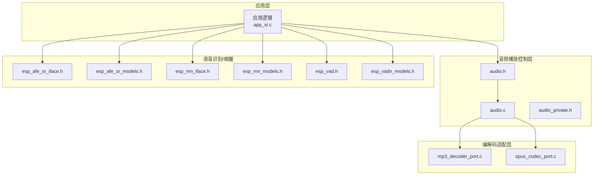
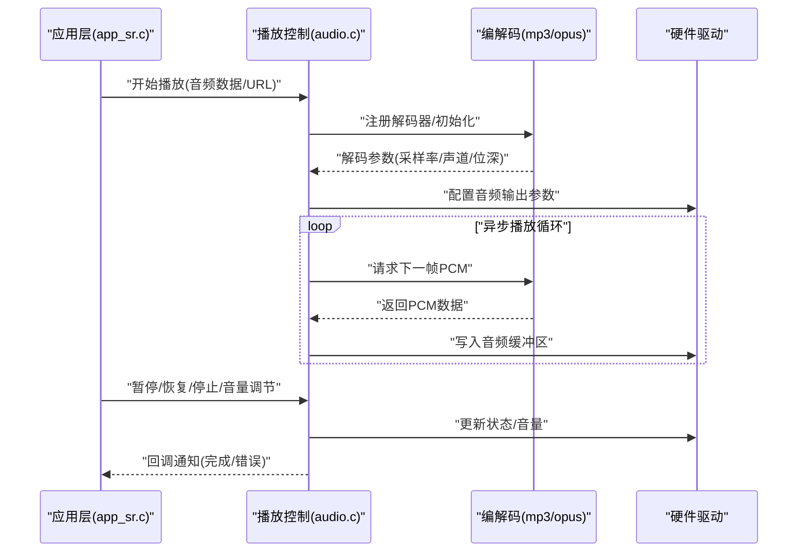
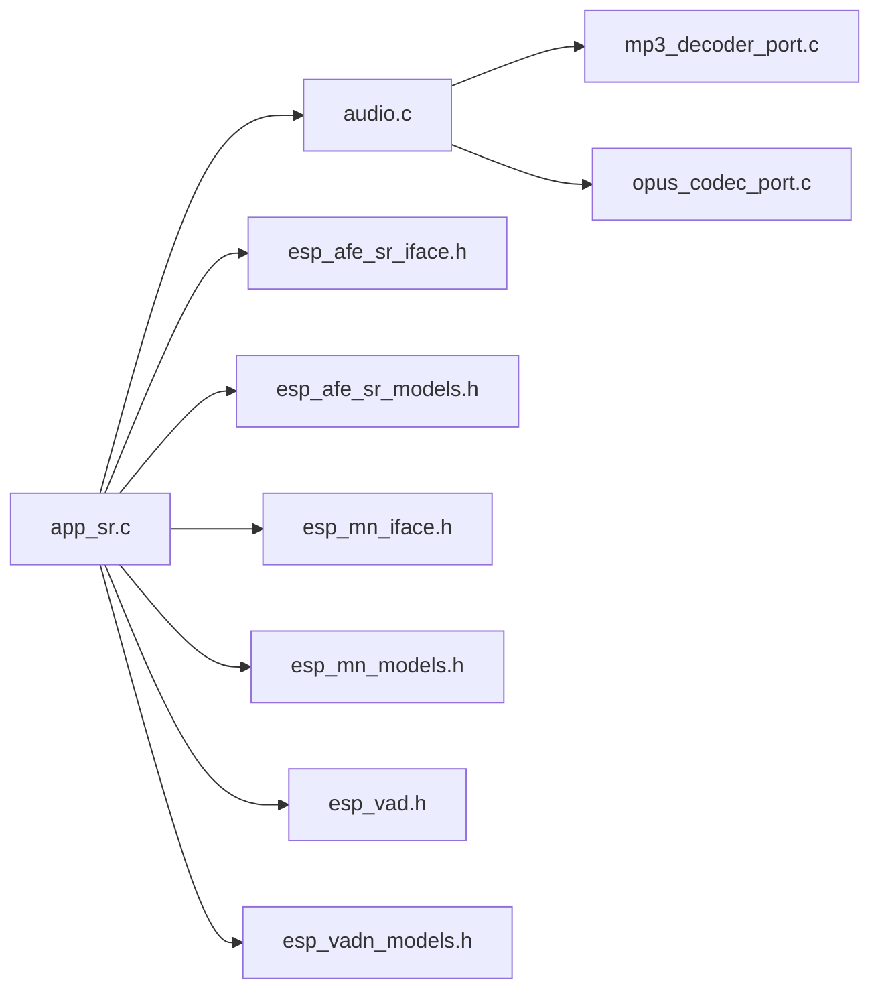

# 音频播放 API

<cite>
**本文引用的文件**
- [audio.h](file://main/app/audio/audio.h)
- [audio.c](file://main/app/audio/audio.c)
- [audio_private.h](file://main/app/audio/audio_private.h)
- [mp3_decoder_port.c](file://main/app/audio/mp3_decoder_port.c)
- [opus_codec_port.c](file://main/app/audio/opus_codec_port.c)
- [app_sr.h](file://main/app/audio/app_sr.h)
- [app_sr.c](file://main/app/audio/app_sr.c)
- [esp_afe_sr_iface.h](file://components/esp-sr/include/esp32/esp_afe_sr_iface.h)
- [esp_afe_sr_models.h](file://components/esp-sr/include/esp32/esp_afe_sr_models.h)
- [esp_mn_iface.h](file://components/esp-sr/include/esp32/esp_mn_iface.h)
- [esp_mn_models.h](file://components/esp-sr/include/esp32/esp_mn_models.h)
- [esp_vad.h](file://components/esp-sr/include/esp32/esp_vad.h)
- [esp_vadn_models.h](file://components/esp-sr/include/esp32/esp_vadn_models.h)
- [CMakeLists.txt](file://main/CMakeLists.txt)
</cite>

## 目录
1. [简介](#简介)
2. [项目结构](#项目结构)
3. [核心组件](#核心组件)
4. [架构总览](#架构总览)
5. [详细组件分析](#详细组件分析)
6. [依赖关系分析](#依赖关系分析)
7. [性能考虑](#性能考虑)
8. [故障排除指南](#故障排除指南)
9. [结论](#结论)
10. [附录](#附录)

## 简介
本文件为项目中的音频播放 API 提供系统化技术文档，覆盖以下方面：
- 音频播放控制接口：播放、暂停/恢复、停止、音量调节
- 音频流控制与播放队列管理
- 异步播放机制与线程安全性
- 性能优化建议与最佳实践
- 实际使用场景的调用路径与参考示例（以源码路径形式给出）

该系统基于 ESP32 平台，结合 MP3 与 Opus 解码器以及语音识别/唤醒模型，实现从音频数据到播放输出的完整链路。

## 项目结构
音频子系统位于 main/app/audio 目录，主要由以下模块组成：
- 音频播放控制层：audio.h / audio.c
- 音频私有定义与内部状态：audio_private.h
- MP3 解码适配层：mp3_decoder_port.c
- Opus 编解码适配层：opus_codec_port.c
- 语音识别/唤醒集成：app_sr.h / app_sr.c，以及 ESP-SR 组件头文件

图表来源
- [audio.h](file://main/app/audio/audio.h)
- [audio.c](file://main/app/audio/audio.c)
- [audio_private.h](file://main/app/audio/audio_private.h)
- [mp3_decoder_port.c](file://main/app/audio/mp3_decoder_port.c)
- [opus_codec_port.c](file://main/app/audio/opus_codec_port.c)
- [app_sr.h](file://main/app/audio/app_sr.h)
- [app_sr.c](file://main/app/audio/app_sr.c)
- [esp_afe_sr_iface.h](file://components/esp-sr/include/esp32/esp_afe_sr_iface.h)
- [esp_afe_sr_models.h](file://components/esp-sr/include/esp32/esp_afe_sr_models.h)
- [esp_mn_iface.h](file://components/esp-sr/include/esp32/esp_mn_iface.h)
- [esp_mn_models.h](file://components/esp-sr/include/esp32/esp_mn_models.h)
- [esp_vad.h](file://components/esp-sr/include/esp32/esp_vad.h)
- [esp_vadn_models.h](file://components/esp-sr/include/esp32/esp_vadn_models.h)

章节来源
- [audio.h](file://main/app/audio/audio.h)
- [audio.c](file://main/app/audio/audio.c)
- [audio_private.h](file://main/app/audio/audio_private.h)
- [mp3_decoder_port.c](file://main/app/audio/mp3_decoder_port.c)
- [opus_codec_port.c](file://main/app/audio/opus_codec_port.c)
- [app_sr.h](file://main/app/audio/app_sr.h)
- [app_sr.c](file://main/app/audio/app_sr.c)

## 核心组件
- 音频播放控制接口：提供播放、暂停/恢复、停止、音量设置等控制函数；支持队列管理与异步播放回调
- MP3 解码适配：封装 MP3 流解码，输出 PCM 数据
- Opus 编解码适配：封装 Opus 编解码，支持多声道与采样率转换
- 语音识别/唤醒集成：通过 ESP-SR 接口进行语音活动检测、关键词唤醒与语音命令识别，可与音频播放协同工作

章节来源
- [audio.h](file://main/app/audio/audio.h)
- [audio.c](file://main/app/audio/audio.c)
- [mp3_decoder_port.c](file://main/app/audio/mp3_decoder_port.c)
- [opus_codec_port.c](file://main/app/audio/opus_codec_port.c)
- [app_sr.h](file://main/app/audio/app_sr.h)
- [app_sr.c](file://main/app/audio/app_sr.c)

## 架构总览
音频播放链路由“应用层 → 播放控制层 → 编解码适配层 → 硬件驱动”构成。应用层负责业务调度（如按键触发、网络事件），播放控制层负责队列管理与异步回调，编解码适配层负责格式转换，最终由硬件驱动输出。

图表来源
- [audio.c](file://main/app/audio/audio.c)
- [mp3_decoder_port.c](file://main/app/audio/mp3_decoder_port.c)
- [opus_codec_port.c](file://main/app/audio/opus_codec_port.c)
- [app_sr.c](file://main/app/audio/app_sr.c)

## 详细组件分析

### 音频播放控制层（audio.c / audio.h）
职责与能力
- 播放控制：启动播放、暂停/恢复、停止
- 音量调节：设置全局音量级别
- 队列管理：维护待播队列，支持优先级与去重
- 异步回调：播放完成、错误、进度等事件通知
- 线程安全：在关键路径上使用互斥锁或原子操作，避免竞态

关键接口（语义说明）
- 初始化/反初始化：准备/释放播放环境
- 开始播放：传入音频数据源（内存/文件/URL）与元数据
- 控制命令：暂停/恢复、停止、跳转、重复模式
- 音量控制：设置/查询音量，支持静音切换
- 队列操作：入队、出队、清空、查询长度
- 回调注册：完成、错误、进度、标签事件
- 状态查询：当前播放状态、当前曲目、播放进度、缓冲区状态

线程安全设计
- 关键共享资源（播放状态、队列、音量）采用互斥锁保护
- 回调触发在播放任务线程中执行，避免跨线程直接修改状态
- 使用条件变量协调播放循环与外部控制命令

异步播放机制
- 播放循环在独立任务中运行，周期性从编解码器拉取 PCM 数据
- 通过信号量/事件组协调外部命令与播放循环
- 完成/错误事件通过回调通知应用层

复杂度与性能
- 队列入队/出队为 O(1)，遍历查找为 O(n)
- 播放循环频率与音频采样率相关，需平衡 CPU 占用与延迟

章节来源
- [audio.h](file://main/app/audio/audio.h)
- [audio.c](file://main/app/audio/audio.c)
- [audio_private.h](file://main/app/audio/audio_private.h)

### MP3 解码适配层（mp3_decoder_port.c）
职责与能力
- 封装 MP3 流解码，输出标准 PCM 格式
- 支持流式输入与帧对齐
- 参数协商：采样率、声道数、位深自动探测
- 错误处理：无效帧、解码失败、数据不足

典型流程
- 注册解码器 → 打开输入源 → 循环解码 → 输出 PCM 帧 → 上报参数与错误

章节来源
- [mp3_decoder_port.c](file://main/app/audio/mp3_decoder_port.c)

### Opus 编解码适配层（opus_codec_port.c）
职责与能力
- 封装 Opus 编解码，支持多声道与可变采样率
- 自动比特率与复杂度配置
- 与播放控制层对接，按需输出 PCM

典型流程
- 初始化编码/解码器 → 设置参数 → 编码/解码循环 → 输出 PCM

章节来源
- [opus_codec_port.c](file://main/app/audio/opus_codec_port.c)

### 语音识别/唤醒集成（app_sr.h / app_sr.c）
职责与能力
- 语音活动检测（VAD）：检测语音段起止
- 关键词唤醒（WakeNet/Multinet）：低功耗唤醒
- 语音命令识别：实时识别预定义命令
- 与音频播放联动：播放提示音、播报结果、暂停/恢复播放

接口要点
- VAD 接口用于判断是否进入语音段
- WakeNet/Multinet 模型用于关键词检测
- 识别结果通过回调传递给应用层，应用层决定是否播放音频

章节来源
- [app_sr.h](file://main/app/audio/app_sr.h)
- [app_sr.c](file://main/app/audio/app_sr.c)
- [esp_afe_sr_iface.h](file://components/esp-sr/include/esp32/esp_afe_sr_iface.h)
- [esp_afe_sr_models.h](file://components/esp-sr/include/esp32/esp_afe_sr_models.h)
- [esp_mn_iface.h](file://components/esp-sr/include/esp32/esp_mn_iface.h)
- [esp_mn_models.h](file://components/esp-sr/include/esp32/esp_mn_models.h)
- [esp_vad.h](file://components/esp-sr/include/esp32/esp_vad.h)
- [esp_vadn_models.h](file://components/esp-sr/include/esp32/esp_vadn_models.h)

## 依赖关系分析
- 应用层依赖播放控制层提供的统一接口
- 播放控制层依赖编解码适配层提供的 PCM 输出
- 编解码适配层依赖底层库（MP3/Opus）与硬件抽象
- 语音识别/唤醒模块与播放控制层通过回调与状态机协同

图表来源
- [audio.c](file://main/app/audio/audio.c)
- [mp3_decoder_port.c](file://main/app/audio/mp3_decoder_port.c)
- [opus_codec_port.c](file://main/app/audio/opus_codec_port.c)
- [app_sr.c](file://main/app/audio/app_sr.c)
- [esp_afe_sr_iface.h](file://components/esp-sr/include/esp32/esp_afe_sr_iface.h)
- [esp_afe_sr_models.h](file://components/esp-sr/include/esp32/esp_afe_sr_models.h)
- [esp_mn_iface.h](file://components/esp-sr/include/esp32/esp_mn_iface.h)
- [esp_mn_models.h](file://components/esp-sr/include/esp32/esp_mn_models.h)
- [esp_vad.h](file://components/esp-sr/include/esp32/esp_vad.h)
- [esp_vadn_models.h](file://components/esp-sr/include/esp32/esp_vadn_models.h)

章节来源
- [audio.c](file://main/app/audio/audio.c)
- [app_sr.c](file://main/app/audio/app_sr.c)

## 性能考虑
- 播放循环节拍：根据目标采样率设定循环频率，避免过载导致卡顿
- 队列深度：合理设置播放队列长度，兼顾延迟与内存占用
- 编解码参数：选择合适的比特率与复杂度，在音质与 CPU 占用间平衡
- 线程亲和性：将播放任务绑定到高优先级核心（若多核），减少上下文切换
- 缓冲策略：使用环形缓冲区降低拷贝次数，提高吞吐
- 音量平滑：音量调节时采用渐变过渡，避免点击声
- I/O 合并：批量读取/写入，减少系统调用开销

## 故障排除指南
常见问题与定位
- 播放无声：检查音量设置、静音标志、音频输出设备初始化
- 卡顿/延迟：检查播放循环频率、队列长度、CPU 占用率
- 解码失败：确认输入数据完整性、格式支持、解码器初始化
- 回调未触发：检查回调注册、线程上下文、事件分发
- 内存不足：监控堆栈与动态内存使用，优化队列与缓冲大小

章节来源
- [audio.c](file://main/app/audio/audio.c)
- [audio_private.h](file://main/app/audio/audio_private.h)

## 结论
本音频播放 API 提供了从播放控制、编解码适配到语音识别联动的完整方案。通过清晰的接口设计、异步播放机制与线程安全保障，能够满足多种应用场景的需求。建议在实际部署中结合平台特性进行参数调优与性能测试。

## 附录

### 使用场景与参考路径
以下为典型使用场景的调用路径参考（以源码路径为准，不直接展示代码内容）：
- 播放本地 MP3 文件
  - 参考：[audio.c](file://main/app/audio/audio.c) 中的“开始播放”与“队列入队”流程
- 播放网络流（HTTP/RTSP）
  - 参考：[audio.c](file://main/app/audio/audio.c) 中的“打开输入源/流式解码”流程
- 暂停/恢复/停止
  - 参考：[audio.c](file://main/app/audio/audio.c) 中的“控制命令”处理
- 调整音量
  - 参考：[audio.c](file://main/app/audio/audio.c) 中的“音量设置”与“静音切换”
- 与语音识别联动
  - 参考：[app_sr.c](file://main/app/audio/app_sr.c) 中的“VAD/WakeNet/Multinet”回调与播放调度
- MP3 解码
  - 参考：[mp3_decoder_port.c](file://main/app/audio/mp3_decoder_port.c) 中的“解码循环”与“参数上报”
- Opus 编解码
  - 参考：[opus_codec_port.c](file://main/app/audio/opus_codec_port.c) 中的“编码/解码初始化”与“PCM 输出”

章节来源
- [audio.c](file://main/app/audio/audio.c)
- [mp3_decoder_port.c](file://main/app/audio/mp3_decoder_port.c)
- [opus_codec_port.c](file://main/app/audio/opus_codec_port.c)
- [app_sr.c](file://main/app/audio/app_sr.c)