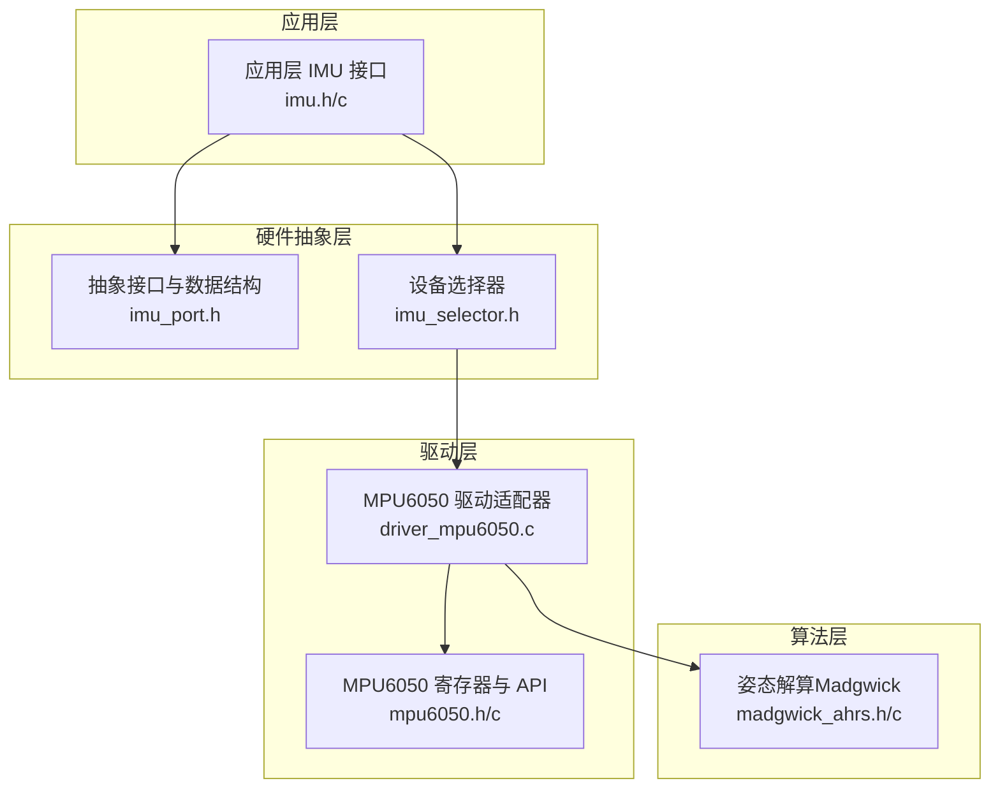
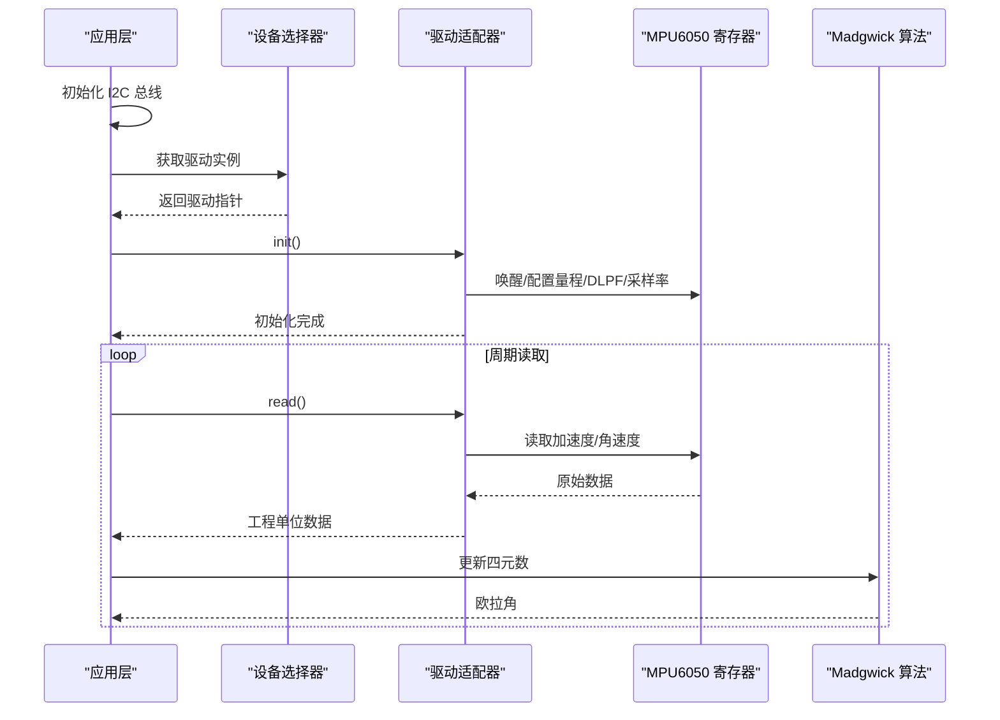
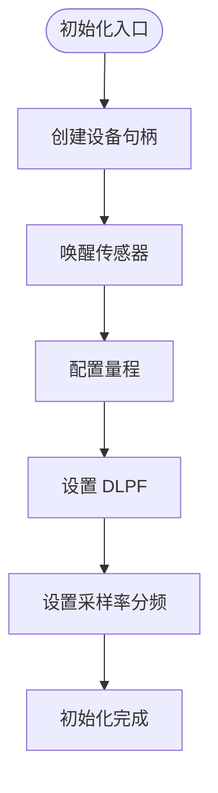
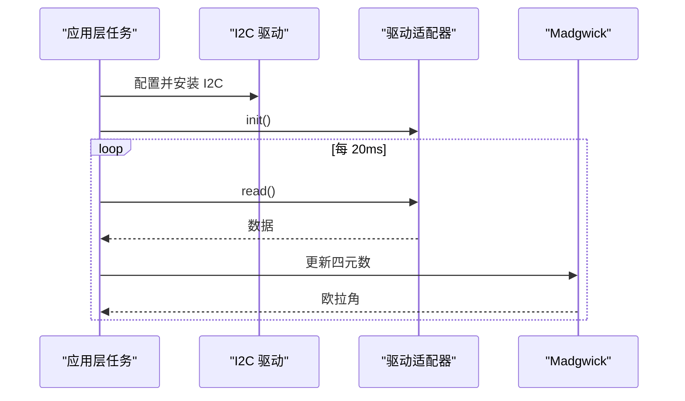
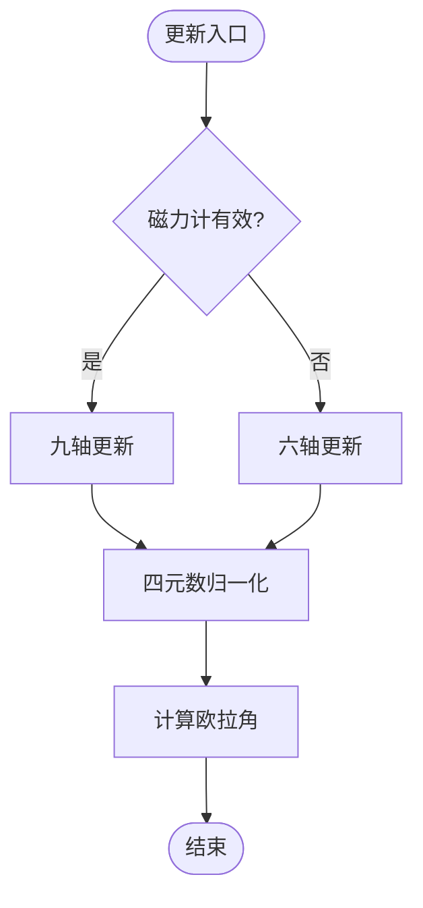
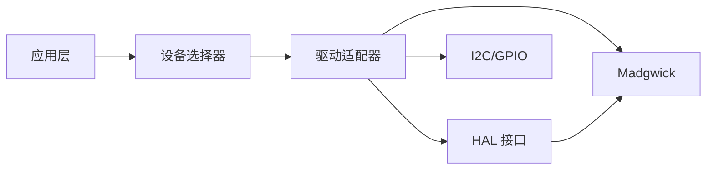
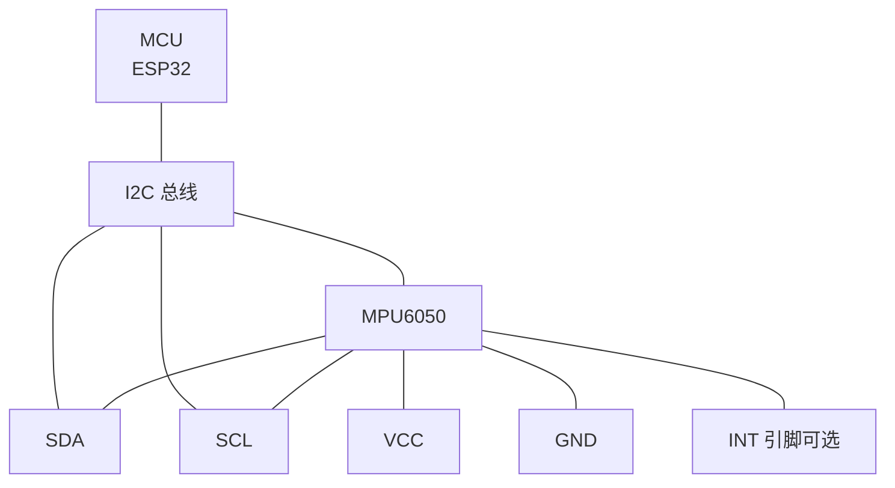

# IMU 传感器集成

<cite>
**本文引用的文件**
- [mpu6050.h](file://components/IMU/drivers/mpu6050/mpu6050.h)
- [mpu6050.c](file://components/IMU/drivers/mpu6050/mpu6050.c)
- [driver_mpu6050.c](file://components/IMU/drivers/mpu6050/driver_mpu6050.c)
- [imu_port.h](file://components/IMU/core/imu_port.h)
- [madgwick_ahrs.h](file://components/IMU/core/madgwick_ahrs.h)
- [madgwick_ahrs.c](file://components/IMU/core/madgwick_ahrs.c)
- [imu_selector.h](file://components/IMU/imu_selector.h)
- [imu.h](file://main/app/imu/imu.h)
- [imu.c](file://main/app/imu/imu.c)
</cite>

## 目录
1. [简介](#简介)
2. [项目结构](#项目结构)
3. [核心组件](#核心组件)
4. [架构总览](#架构总览)
5. [详细组件分析](#详细组件分析)
6. [依赖关系分析](#依赖关系分析)
7. [性能考虑](#性能考虑)
8. [故障排查指南](#故障排查指南)
9. [结论](#结论)
10. [附录](#附录)

## 简介
本技术文档面向 IMU 传感器集成模块，聚焦于 MPU6050 传感器的硬件接口配置、驱动实现、数据读取与中断处理机制，并系统阐述硬件抽象层（HAL）设计、设备选择器模式与多传感器支持策略。同时提供传感器校准方法、故障诊断与性能优化建议，并给出完整的硬件连接图与电气特性说明。

## 项目结构
IMU 子系统采用“硬件抽象层 + 驱动适配器 + 算法融合”的分层设计：
- 硬件抽象层（HAL）：定义统一的数据结构与驱动接口，屏蔽不同传感器差异。
- 驱动适配器：针对具体传感器（如 MPU6050）实现 HAL 接口，负责 I2C 读写、寄存器配置、中断处理等。
- 算法融合：提供姿态解算（Madgwick）以输出欧拉角。
- 应用层：负责 I2C 总线初始化、任务调度与结果消费。

图表来源
- [imu.h:1-19](file://main/app/imu/imu.h#L1-L19)
- [imu.c:1-115](file://main/app/imu/imu.c#L1-L115)
- [imu_port.h:1-53](file://components/IMU/core/imu_port.h#L1-L53)
- [imu_selector.h:1-14](file://components/IMU/imu_selector.h#L1-L14)
- [driver_mpu6050.c:1-124](file://components/IMU/drivers/mpu6050/driver_mpu6050.c#L1-L124)
- [mpu6050.h:1-418](file://components/IMU/drivers/mpu6050/mpu6050.h#L1-L418)
- [madgwick_ahrs.h:1-15](file://components/IMU/core/madgwick_ahrs.h#L1-L15)
- [madgwick_ahrs.c:1-322](file://components/IMU/core/madgwick_ahrs.c#L1-L322)

章节来源
- [imu.h:1-19](file://main/app/imu/imu.h#L1-L19)
- [imu.c:1-115](file://main/app/imu/imu.c#L1-L115)
- [imu_port.h:1-53](file://components/IMU/core/imu_port.h#L1-L53)
- [imu_selector.h:1-14](file://components/IMU/imu_selector.h#L1-L14)
- [driver_mpu6050.c:1-124](file://components/IMU/drivers/mpu6050/driver_mpu6050.c#L1-L124)
- [mpu6050.h:1-418](file://components/IMU/drivers/mpu6050/mpu6050.h#L1-L418)
- [madgwick_ahrs.h:1-15](file://components/IMU/core/madgwick_ahrs.h#L1-L15)
- [madgwick_ahrs.c:1-322](file://components/IMU/core/madgwick_ahrs.c#L1-L322)

## 核心组件
- 硬件抽象层（HAL）
  - 统一数据结构：加速度、角速度、磁力计与有效性标志。
  - 抽象驱动接口：init/read/deinit。
  - 硬件配置结构体：I2C 端口、引脚、时钟频率、中断引脚、设备地址。
- 驱动适配器（MPU6050）
  - I2C 读写封装、寄存器配置（唤醒/睡眠、量程、DLPF、采样率分频）。
  - 中断配置与 ISR 注册（可选）。
  - 数据读取：原始值到工程单位的换算。
- 算法融合（Madgwick）
  - 支持九轴（加速度+陀螺仪+磁力计）与六轴（加速度+陀螺仪）融合。
  - 输出欧拉角（Roll/Pitch）与运动强度估计。

章节来源
- [imu_port.h:1-53](file://components/IMU/core/imu_port.h#L1-L53)
- [driver_mpu6050.c:1-124](file://components/IMU/drivers/mpu6050/driver_mpu6050.c#L1-L124)
- [mpu6050.h:1-418](file://components/IMU/drivers/mpu6050/mpu6050.h#L1-L418)
- [mpu6050.c:1-499](file://components/IMU/drivers/mpu6050/mpu6050.c#L1-L499)
- [madgwick_ahrs.h:1-15](file://components/IMU/core/madgwick_ahrs.h#L1-L15)
- [madgwick_ahrs.c:1-322](file://components/IMU/core/madgwick_ahrs.c#L1-L322)

## 架构总览
应用层通过设备选择器获取当前激活的驱动实例，驱动初始化 I2C、唤醒并配置传感器，随后周期性读取数据并交由 Madgwick 算法进行姿态解算。

图表来源
- [imu.c:42-75](file://main/app/imu/imu.c#L42-L75)
- [driver_mpu6050.c:19-62](file://components/IMU/drivers/mpu6050/driver_mpu6050.c#L19-L62)
- [mpu6050.c:117-147](file://components/IMU/drivers/mpu6050/mpu6050.c#L117-L147)
- [madgwick_ahrs.c:284-300](file://components/IMU/core/madgwick_ahrs.c#L284-L300)

## 详细组件分析

### 硬件抽象层（HAL）
- 数据结构
  - 统一的 IMU 数据结构包含三轴加速度、三轴角速度、三轴磁力计（六轴时为 0）、有效性标志与活跃等级。
- 驱动接口
  - init/read/deinit 三个函数指针，便于替换不同传感器驱动。
- 硬件配置
  - I2C 端口、SDA/SCL 引脚、时钟频率、中断引脚、设备地址，由应用层在初始化前填充。

章节来源
- [imu_port.h:14-48](file://components/IMU/core/imu_port.h#L14-L48)

### 设备选择器模式与多传感器支持
- 设备选择器
  - 通过统一接口返回当前激活的驱动实例，具体实现由构建系统根据配置决定。
- 多传感器支持策略
  - 通过替换驱动实现文件即可接入不同传感器；HAL 层保持不变，实现松耦合。

章节来源
- [imu_selector.h:1-14](file://components/IMU/imu_selector.h#L1-L14)

### MPU6050 驱动适配器（driver_mpu6050.c）
- 初始化流程
  - 创建设备句柄、唤醒传感器、配置量程（加速度±2g、角速度±250°/s）、设置 DLPF、配置采样率分频。
  - 采样率与驱动中设置一致，便于算法同步。
- 数据读取
  - 读取加速度与角速度，转换为工程单位，标记数据有效性。
- 中断处理（可选）
  - 适配器预留了中断配置与 ISR 注册逻辑，当前示例中默认关闭中断路径。

图表来源
- [driver_mpu6050.c:19-62](file://components/IMU/drivers/mpu6050/driver_mpu6050.c#L19-L62)

章节来源
- [driver_mpu6050.c:1-124](file://components/IMU/drivers/mpu6050/driver_mpu6050.c#L1-L124)

### MPU6050 寄存器与 API（mpu6050.h/c）
- I2C 地址与 WHO_AM_I
  - 支持两种 I2C 地址（AD0 引脚电平决定），设备识别值固定。
- 寄存器与功能
  - 唤醒/睡眠控制、量程配置（加速度/角速度）、中断引脚配置、中断使能、中断状态、DLPF、采样率分频、温度与原始数据寄存器。
- 中断配置与处理
  - 支持中断引脚电平、开漏/推挽、锁存行为与清除方式；提供启用/禁用中断与查询中断状态的 API。
- 数据读取
  - 原始数据读取后按灵敏度换算为工程单位（g、dps、℃）。

章节来源
- [mpu6050.h:21-384](file://components/IMU/drivers/mpu6050/mpu6050.h#L21-L384)
- [mpu6050.c:18-460](file://components/IMU/drivers/mpu6050/mpu6050.c#L18-L460)

### 应用层（main/app/imu）
- I2C 初始化
  - 配置 I2C 参数并安装驱动，使用应用层定义的 SDA/SCL、时钟频率与端口号。
- 任务循环
  - 重复读取传感器数据，调用 Madgwick 更新四元数并提取欧拉角，周期性打印姿态与活跃等级。
- 角度获取接口
  - 提供获取当前姿态的接口，便于上层模块使用。

图表来源
- [imu.c:42-115](file://main/app/imu/imu.c#L42-L115)
- [driver_mpu6050.c:65-94](file://components/IMU/drivers/mpu6050/driver_mpu6050.c#L65-L94)

章节来源
- [imu.h:1-19](file://main/app/imu/imu.h#L1-L19)
- [imu.c:1-115](file://main/app/imu/imu.c#L1-L115)

### 姿态解算（Madgwick）
- 九轴/六轴自适应
  - 根据数据有效性标志自动选择九轴或六轴融合。
- 运动强度估计
  - 基于加速度与重力参考向量的夹角计算运动强度，用于上层行为判断。
- 欧拉角输出
  - 提供 Roll/Pitch 的计算接口，Yaw 可按需启用。

图表来源
- [madgwick_ahrs.c:284-300](file://components/IMU/core/madgwick_ahrs.c#L284-L300)

章节来源
- [madgwick_ahrs.h:1-15](file://components/IMU/core/madgwick_ahrs.h#L1-L15)
- [madgwick_ahrs.c:1-322](file://components/IMU/core/madgwick_ahrs.c#L1-L322)

## 依赖关系分析
- 组件耦合
  - 应用层仅依赖设备选择器与 HAL 接口，与具体传感器实现解耦。
  - 驱动适配器依赖 HAL 定义的数据结构与接口，以及底层 I2C 与 GPIO。
  - 算法层仅依赖 HAL 数据结构，与驱动实现解耦。
- 外部依赖
  - ESP-IDF 的 I2C、GPIO、FreeRTOS、日志组件。

图表来源
- [imu.c:67-74](file://main/app/imu/imu.c#L67-L74)
- [driver_mpu6050.c:116-124](file://components/IMU/drivers/mpu6050/driver_mpu6050.c#L116-L124)
- [madgwick_ahrs.c:284-300](file://components/IMU/core/madgwick_ahrs.c#L284-L300)

章节来源
- [imu.c:1-115](file://main/app/imu/imu.c#L1-L115)
- [driver_mpu6050.c:1-124](file://components/IMU/drivers/mpu6050/driver_mpu6050.c#L1-L124)
- [madgwick_ahrs.c:1-322](file://components/IMU/core/madgwick_ahrs.c#L1-L322)

## 性能考虑
- 采样率与滤波
  - 通过 DLPF 与采样率分频控制带宽与输出速率，平衡噪声与延迟。
- 数据换算与单位一致性
  - 确保驱动层换算与算法层输入单位一致，避免额外缩放。
- 任务调度
  - 应用层任务周期与算法采样率匹配，减少抖动。
- 中断路径（可选）
  - 若使用中断触发数据读取，可降低轮询开销，但需注意 ISR 负载与信号量使用。

## 故障排查指南
- I2C 通信失败
  - 检查 SDA/SCL 引脚配置、上拉电阻、时钟频率与设备地址。
  - 确认驱动安装成功与参数配置正确。
- 设备识别失败
  - 核对 WHO_AM_I 返回值与期望值一致。
- 数据异常
  - 检查量程配置是否合理；确认 DLPF 与采样率分频设置满足应用场景。
- 算法输出漂移
  - 调整 Madgwick 增益参数与采样率；确保传感器安装稳定且无强振动干扰。
- 中断不触发
  - 确认中断引脚配置、电平与清除行为设置正确；检查 ISR 注册与启用。

章节来源
- [imu.c:44-75](file://main/app/imu/imu.c#L44-L75)
- [mpu6050.c:112-147](file://components/IMU/drivers/mpu6050/mpu6050.c#L112-L147)
- [driver_mpu6050.c:36-44](file://components/IMU/drivers/mpu6050/driver_mpu6050.c#L36-L44)

## 结论
本 IMU 集成方案通过 HAL 解耦与设备选择器模式，实现了对 MPU6050 的高效驱动与灵活扩展。结合 DLPF、采样率分频与 Madgwick 算法，可在保证实时性的前提下获得稳定的姿态输出。通过规范化的硬件接口与清晰的依赖关系，为后续接入其他传感器或扩展功能提供了良好基础。

## 附录

### 硬件连接图

说明
- I2C 引脚：由应用层配置（默认 SDA=20，SCL=21）。
- 上拉电阻：建议在 SDA/SCL 上各接 4.7kΩ 上拉电阻至 VCC。
- AD0 引脚：决定 I2C 地址（高电平对应 0x69，低电平对应 0x68）。
- INT 引脚：可选，用于中断触发数据读取。

章节来源
- [imu.c:13-28](file://main/app/imu/imu.c#L13-L28)
- [mpu6050.h:21-23](file://components/IMU/drivers/mpu6050/mpu6050.h#L21-L23)

### 电气特性要点
- 供电电压：典型 3.3V，注意与 MCU 电平兼容。
- I2C 速率：默认 400 kHz，可根据总线能力调整。
- 中断引脚：可配置为推挽或开漏，电平可配置为高/低有效。
- DLPF 与采样率：DLPF 编码对应不同带宽；采样率分频影响输出速率。

章节来源
- [imu.c:15-27](file://main/app/imu/imu.c#L15-L27)
- [mpu6050.c:444-460](file://components/IMU/drivers/mpu6050/mpu6050.c#L444-L460)
- [driver_mpu6050.c:36-44](file://components/IMU/drivers/mpu6050/driver_mpu6050.c#L36-L44)

### 校准方法与最佳实践
- 机械校准
  - 确保传感器安装稳固，避免强振动与冲击。
  - 在水平面静置一段时间，采集加速度计零偏。
- 算法参数
  - 调整 Madgwick 增益与采样率，使其与实际采样一致。
- 数据质量
  - 合理设置 DLPF 与采样率，抑制噪声并避免混叠。
- 中断路径
  - 如使用中断，确保 ISR 轻量化，避免阻塞主任务。

章节来源
- [madgwick_ahrs.c:30-38](file://components/IMU/core/madgwick_ahrs.c#L30-L38)
- [driver_mpu6050.c:36-44](file://components/IMU/drivers/mpu6050/driver_mpu6050.c#L36-L44)