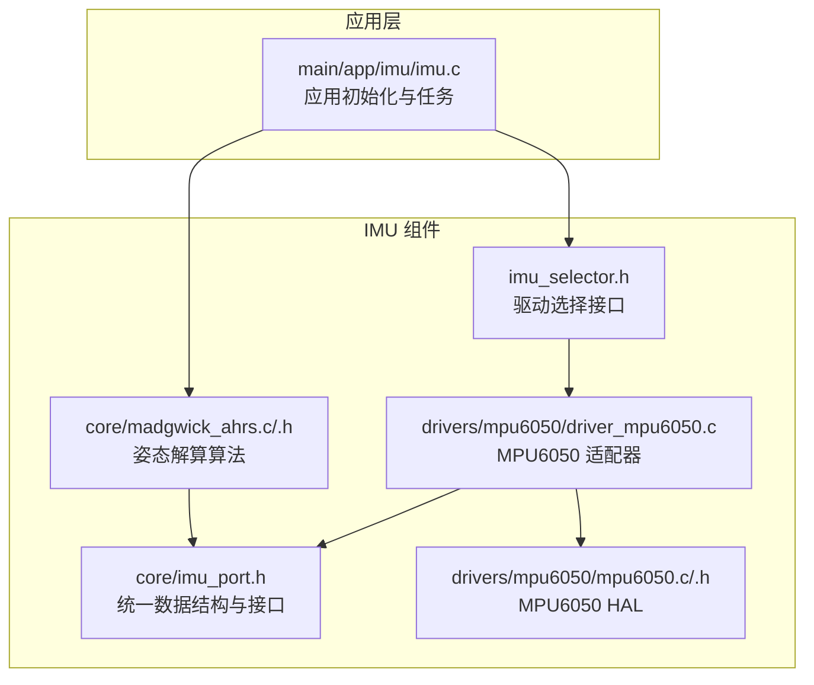
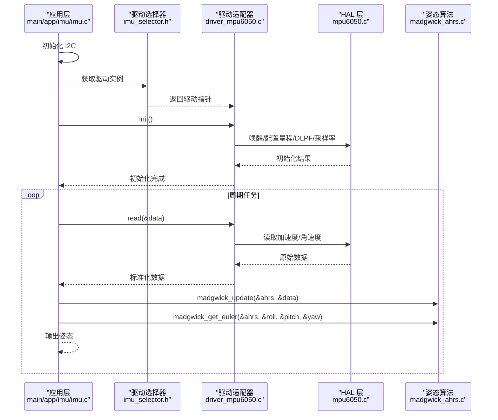
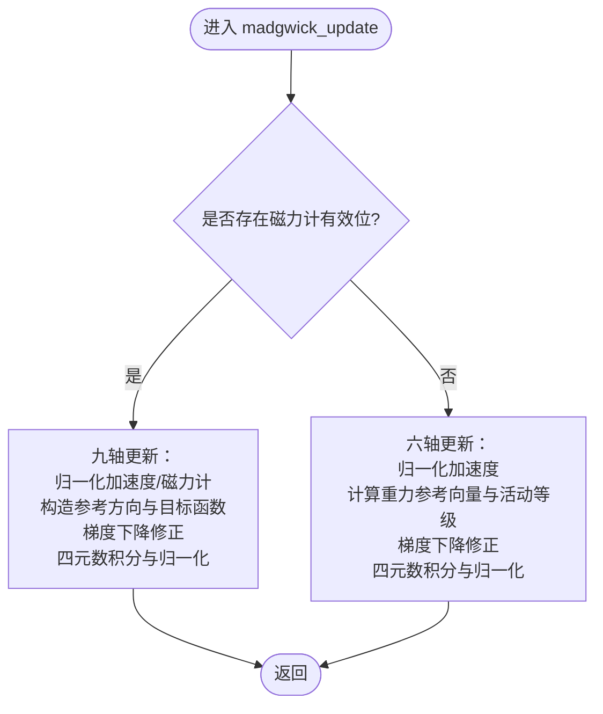
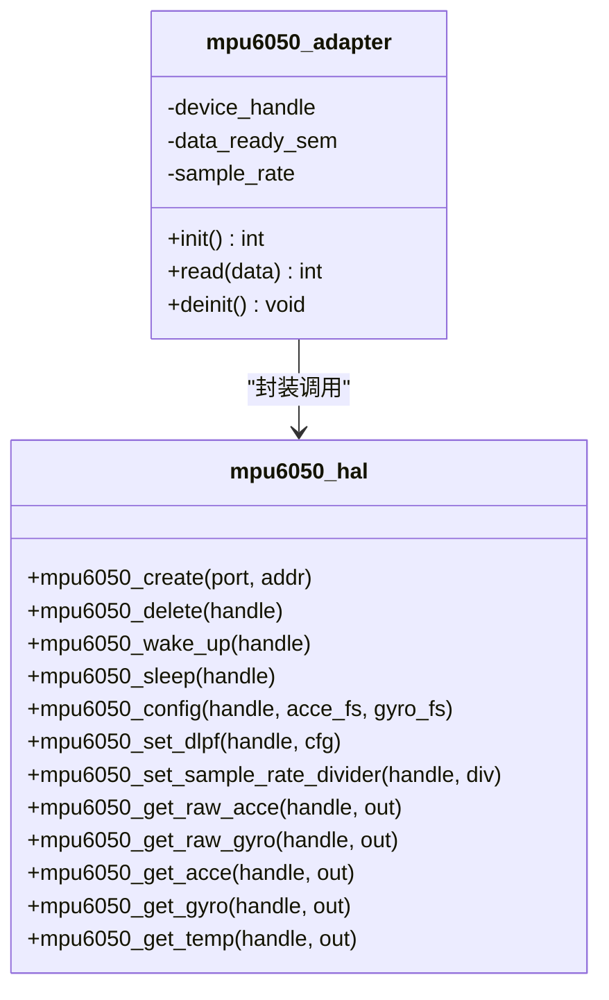
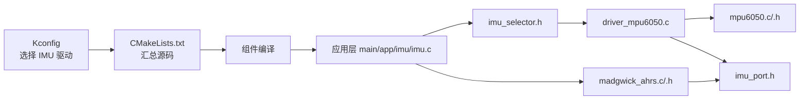

# 传感器系统

<cite>
**本文档引用的文件**
- [components/IMU/core/madgwick_ahrs.h](file://components/IMU/core/madgwick_ahrs.h)
- [components/IMU/core/madgwick_ahrs.c](file://components/IMU/core/madgwick_ahrs.c)
- [components/IMU/core/imu_port.h](file://components/IMU/core/imu_port.h)
- [components/IMU/drivers/mpu6050/mpu6050.h](file://components/IMU/drivers/mpu6050/mpu6050.h)
- [components/IMU/drivers/mpu6050/mpu6050.c](file://components/IMU/drivers/mpu6050/mpu6050.c)
- [components/IMU/drivers/mpu6050/driver_mpu6050.c](file://components/IMU/drivers/mpu6050/driver_mpu6050.c)
- [components/IMU/imu_selector.h](file://components/IMU/imu_selector.h)
- [components/IMU/CMakeLists.txt](file://components/IMU/CMakeLists.txt)
- [components/IMU/Kconfig](file://components/IMU/Kconfig)
- [main/app/imu/imu.c](file://main/app/imu/imu.c)
- [main/app/imu/imu.h](file://main/app/imu/imu.h)
</cite>

## 目录
1. [简介](#简介)
2. [项目结构](#项目结构)
3. [核心组件](#核心组件)
4. [架构总览](#架构总览)
5. [详细组件分析](#详细组件分析)
6. [依赖关系分析](#依赖关系分析)
7. [性能考虑](#性能考虑)
8. [故障排查指南](#故障排查指南)
9. [结论](#结论)
10. [附录](#附录)

## 简介
本技术文档面向传感器系统，聚焦 IMU 传感器的数据采集与处理流程，覆盖以下关键内容：
- MPU6050 传感器驱动实现与 I2C 接口配置
- 姿态解算算法：Madgwick AHRS 的数学原理与参数调优
- 传感器数据滤波、坐标系变换与姿态参数计算
- 传感器校准方法、精度评估与误差分析
- 传感器融合与多传感器数据同步策略

系统采用模块化设计：上层通过统一的 IMU 接口抽象调用底层驱动；驱动层负责 I2C 通信与数据读取；核心算法层提供姿态解算与欧拉角输出。

## 项目结构
IMU 子系统位于 components/IMU，主要分为三部分：
- 核心算法：Madgwick AHRS 实现与数据结构定义
- 驱动层：MPU6050 驱动与适配器（I2C 读写、量程配置、采样率、DLPF 等）
- 选择器与构建：通过 Kconfig 选择驱动，CMake 汇总编译

应用层在 main/app/imu 提供初始化、任务调度与姿态输出接口。

图表来源
- [components/IMU/imu_selector.h:1-14](file://components/IMU/imu_selector.h#L1-L14)
- [components/IMU/core/imu_port.h:1-53](file://components/IMU/core/imu_port.h#L1-L53)
- [components/IMU/core/madgwick_ahrs.c:1-322](file://components/IMU/core/madgwick_ahrs.c#L1-L322)
- [components/IMU/drivers/mpu6050/driver_mpu6050.c:1-124](file://components/IMU/drivers/mpu6050/driver_mpu6050.c#L1-L124)
- [components/IMU/drivers/mpu6050/mpu6050.c:1-499](file://components/IMU/drivers/mpu6050/mpu6050.c#L1-L499)
- [main/app/imu/imu.c:1-115](file://main/app/imu/imu.c#L1-L115)

章节来源
- [components/IMU/CMakeLists.txt:1-28](file://components/IMU/CMakeLists.txt#L1-L28)
- [components/IMU/Kconfig:1-46](file://components/IMU/Kconfig#L1-L46)
- [main/app/imu/imu.c:1-115](file://main/app/imu/imu.c#L1-L115)

## 核心组件
- 统一数据结构与接口
  - 定义 IMU 数据载体与有效性标志，抽象驱动接口，便于替换不同传感器
- Madgwick AHRS 算法
  - 支持九轴（加速度+陀螺+磁力计）与六轴（加速度+陀螺）两种模式
  - 提供四元数更新与欧拉角转换接口
- MPU6050 驱动与适配器
  - I2C 读写、唤醒/睡眠、量程配置、DLPF、采样率分频器设置
  - 适配器封装为统一驱动接口，支持可选中断信号量等待

章节来源
- [components/IMU/core/imu_port.h:8-53](file://components/IMU/core/imu_port.h#L8-L53)
- [components/IMU/core/madgwick_ahrs.h:1-15](file://components/IMU/core/madgwick_ahrs.h#L1-L15)
- [components/IMU/core/madgwick_ahrs.c:23-322](file://components/IMU/core/madgwick_ahrs.c#L23-L322)
- [components/IMU/drivers/mpu6050/mpu6050.h:1-418](file://components/IMU/drivers/mpu6050/mpu6050.h#L1-L418)
- [components/IMU/drivers/mpu6050/mpu6050.c:1-499](file://components/IMU/drivers/mpu6050/mpu6050.c#L1-L499)
- [components/IMU/drivers/mpu6050/driver_mpu6050.c:1-124](file://components/IMU/drivers/mpu6050/driver_mpu6050.c#L1-L124)

## 架构总览
系统采用“应用层 → 选择器 → 驱动层 → HAL 层 → 传感器”的分层架构。应用层通过统一接口获取驱动实例，完成 I2C 初始化与传感器初始化后，周期性读取数据并进行姿态解算。

图表来源
- [main/app/imu/imu.c:42-115](file://main/app/imu/imu.c#L42-L115)
- [components/IMU/imu_selector.h:6-13](file://components/IMU/imu_selector.h#L6-L13)
- [components/IMU/drivers/mpu6050/driver_mpu6050.c:20-106](file://components/IMU/drivers/mpu6050/driver_mpu6050.c#L20-L106)
- [components/IMU/drivers/mpu6050/mpu6050.c:95-460](file://components/IMU/drivers/mpu6050/mpu6050.c#L95-L460)
- [components/IMU/core/madgwick_ahrs.c:284-322](file://components/IMU/core/madgwick_ahrs.c#L284-L322)

## 详细组件分析

### 统一接口与数据结构（imu_port.h）
- 数据有效性标志：加速度、角速度、磁力计的有效性位
- 统一数据结构：包含三轴加速度、角速度、磁力计（六轴时为0）、活动强度与标志位
- 驱动接口：init/read/deinit 三个函数指针，便于替换不同传感器
- 硬件配置：I2C 端口、引脚、时钟频率、中断引脚、设备地址
- 上下文：驱动内部维护设备句柄、数据就绪信号量与采样率

章节来源
- [components/IMU/core/imu_port.h:8-53](file://components/IMU/core/imu_port.h#L8-L53)

### Madgwick AHRS 算法（madgwick_ahrs.c/.h）
- 算法类型
  - 九轴：利用加速度与磁力计约束，结合陀螺积分，进行梯度下降优化
  - 六轴：仅用加速度约束，陀螺积分，计算设备活动等级
- 关键参数
  - 四元数 q0..q3：姿态表示
  - beta：算法增益，影响收敛速度与噪声抑制
  - sample_freq：采样频率，决定积分步长
- 数学要点
  - 将加速度与磁力计测量投影到参考方向，构造目标函数
  - 通过四元数微分模型与梯度下降修正，实现互补滤波效果
  - 欧拉角转换：Roll（x）、Pitch（y）、Yaw（z）按顺序计算，注意数值稳定性（限制域值）

图表来源
- [components/IMU/core/madgwick_ahrs.c:23-322](file://components/IMU/core/madgwick_ahrs.c#L23-L322)
- [components/IMU/core/madgwick_ahrs.h:6-14](file://components/IMU/core/madgwick_ahrs.h#L6-L14)

章节来源
- [components/IMU/core/madgwick_ahrs.c:23-322](file://components/IMU/core/madgwick_ahrs.c#L23-L322)
- [components/IMU/core/madgwick_ahrs.h:1-15](file://components/IMU/core/madgwick_ahrs.h#L1-L15)

### MPU6050 驱动与适配器（mpu6050.c/.h 与 driver_mpu6050.c）
- I2C 读写：封装寄存器读写，支持连续读取
- 设备管理：唤醒/睡眠、设备识别、温度读取
- 量程与灵敏度：根据 FS 配置返回加速度/角速度灵敏度
- 中断与状态：INT 引脚配置、中断使能/禁用、状态查询
- DLPF 与采样率：设置数字低通滤波器与 SMPLRT_DIV，控制输出速率
- 适配器职责：创建/删除句柄、唤醒与配置、设置 DLPF 与采样率、读取原始数据并标准化为物理单位，填充数据标志位

图表来源
- [components/IMU/drivers/mpu6050/mpu6050.c:95-460](file://components/IMU/drivers/mpu6050/mpu6050.c#L95-L460)
- [components/IMU/drivers/mpu6050/driver_mpu6050.c:20-106](file://components/IMU/drivers/mpu6050/driver_mpu6050.c#L20-L106)

章节来源
- [components/IMU/drivers/mpu6050/mpu6050.h:1-418](file://components/IMU/drivers/mpu6050/mpu6050.h#L1-L418)
- [components/IMU/drivers/mpu6050/mpu6050.c:1-499](file://components/IMU/drivers/mpu6050/mpu6050.c#L1-L499)
- [components/IMU/drivers/mpu6050/driver_mpu6050.c:1-124](file://components/IMU/drivers/mpu6050/driver_mpu6050.c#L1-L124)

### 应用层集成（main/app/imu/imu.c/.h）
- I2C 初始化：配置端口、引脚、上拉与时钟频率
- 驱动初始化：通过选择器获取驱动并调用 init
- 任务循环：周期性读取数据、调用 madgwick 更新与欧拉角转换，并打印姿态
- 角度输出：提供获取姿态的接口

章节来源
- [main/app/imu/imu.c:42-115](file://main/app/imu/imu.c#L42-L115)
- [main/app/imu/imu.h:1-19](file://main/app/imu/imu.h#L1-L19)

## 依赖关系分析
- 构建选择
  - 通过 Kconfig 选择 IMU 驱动（当前默认 MPU6050）
  - CMake 根据选择动态加入对应源码
- 运行时依赖
  - 应用层依赖选择器接口获取驱动实例
  - 驱动层依赖 HAL 层提供的 I2C 读写与寄存器操作
  - 算法层依赖统一数据结构与驱动提供的数据

图表来源
- [components/IMU/Kconfig:1-46](file://components/IMU/Kconfig#L1-L46)
- [components/IMU/CMakeLists.txt:1-28](file://components/IMU/CMakeLists.txt#L1-L28)
- [components/IMU/imu_selector.h:1-14](file://components/IMU/imu_selector.h#L1-L14)
- [components/IMU/drivers/mpu6050/driver_mpu6050.c:1-124](file://components/IMU/drivers/mpu6050/driver_mpu6050.c#L1-L124)
- [components/IMU/drivers/mpu6050/mpu6050.c:1-499](file://components/IMU/drivers/mpu6050/mpu6050.c#L1-L499)
- [components/IMU/core/madgwick_ahrs.c:1-322](file://components/IMU/core/madgwick_ahrs.c#L1-L322)
- [components/IMU/core/imu_port.h:1-53](file://components/IMU/core/imu_port.h#L1-L53)
- [main/app/imu/imu.c:1-115](file://main/app/imu/imu.c#L1-L115)

章节来源
- [components/IMU/Kconfig:1-46](file://components/IMU/Kconfig#L1-L46)
- [components/IMU/CMakeLists.txt:1-28](file://components/IMU/CMakeLists.txt#L1-L28)

## 性能考虑
- 采样率与滤波
  - 通过 SMPLRT_DIV 与 DLPF 控制输出速率与带宽，降低噪声并平衡延迟
  - 采样率需与算法 sample_freq 保持一致，确保积分步长正确
- 算法参数
  - beta 增益：增大提升响应速度但易引入噪声；减小增强稳定但响应变慢
  - 建议在静态与动态场景分别测试并折中
- 数据路径
  - 优先使用中断触发（若启用）减少轮询开销
  - 读取失败重试与日志记录，避免阻塞主任务
- 计算复杂度
  - 单帧更新为常数时间复杂度，适合实时嵌入式运行

## 故障排查指南
- I2C 初始化失败
  - 检查引脚配置、上拉电阻与时钟频率
  - 确认设备地址与硬件连接
- 传感器读数异常
  - 校验量程配置与灵敏度换算
  - 检查 DLPF 与采样率设置是否合理
- 姿态发散或抖动
  - 调整 beta 参数，必要时提高采样率或加强滤波
  - 确保传感器安装稳固，避免强振动与磁场干扰
- 日志定位
  - 驱动与算法均包含日志输出，关注错误码与告警信息

章节来源
- [main/app/imu/imu.c:44-75](file://main/app/imu/imu.c#L44-L75)
- [components/IMU/drivers/mpu6050/driver_mpu6050.c:36-61](file://components/IMU/drivers/mpu6050/driver_mpu6050.c#L36-L61)
- [components/IMU/core/madgwick_ahrs.c:220-222](file://components/IMU/core/madgwick_ahrs.c#L220-L222)

## 结论
本系统通过清晰的分层设计与统一接口，实现了从 I2C 传感器到姿态解算的完整链路。MPU6050 驱动提供了稳定的底层能力，Madgwick 算法则在实时性与鲁棒性之间取得良好平衡。通过合理的参数调优与滤波策略，可在多种应用场景下获得可靠的姿态估计。

## 附录

### 传感器校准方法
- 静态校准
  - 加速度：在六个面（+X/-X/+Y/-Y/+Z/-Z）静置采集样本，估计零偏与尺度因子
  - 角速度：长时间静止采集零偏
  - 磁力计：在水平面缓慢旋转，拟合球面参数估计偏置与缩放
- 动态校准
  - 通过运动轨迹约束（如水平旋转）估计磁偏角与倾斜误差
- 校准实施建议
  - 在应用层维护校准参数，读取后进行补偿
  - 定期重新校准以应对温度漂移

### 精度评估与误差分析
- 评估指标
  - 角度误差（与参考平台对比）、长期漂移、噪声功率谱密度
- 误差来源
  - 量化噪声、非线性、温度漂移、安装偏差、外部磁场干扰
- 改进策略
  - 提高采样率与滤波质量，优化 beta 参数，改进安装固定

### 传感器融合与多传感器同步
- 融合策略
  - 九轴优先：在有磁力计时使用九轴融合；无磁力计时退化为六轴
  - 多传感器：在多 IMU 场景下采用互补滤波或扩展卡尔曼滤波进行跨传感器标定与对齐
- 同步策略
  - 使用中断触发或统一定时器，保证各传感器采样时刻一致
  - 时间戳对齐与插值补偿，消除异步误差