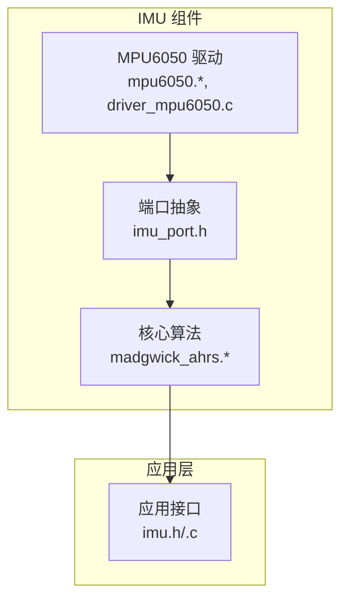
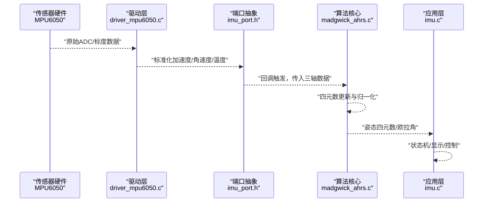
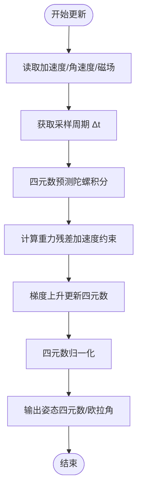
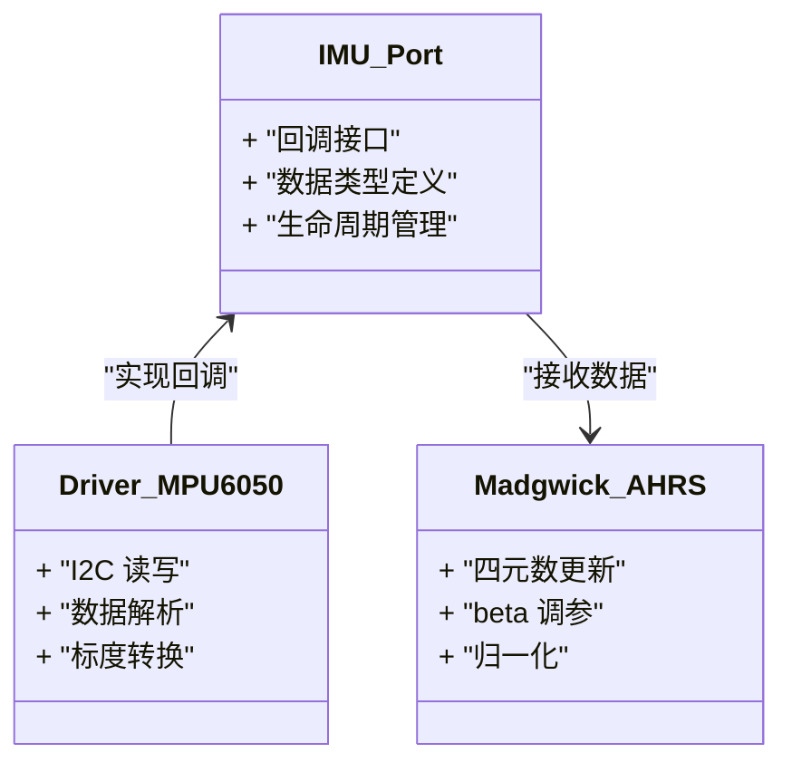
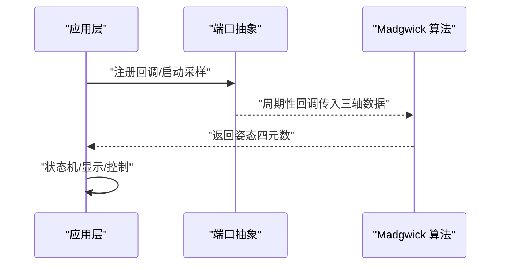
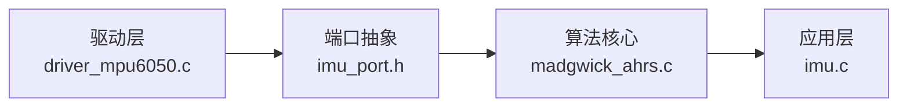

# 姿态估计算法

<cite>
**本文引用的文件**
- [madgwick_ahrs.h](file://components/IMU/core/madgwick_ahrs.h)
- [madgwick_ahrs.c](file://components/IMU/core/madgwick_ahrs.c)
- [imu_port.h](file://components/IMU/core/imu_port.h)
- [mpu6050.h](file://components/IMU/drivers/mpu6050/mpu6050.h)
- [driver_mpu6050.c](file://components/IMU/drivers/mpu6050/driver_mpu6050.c)
- [mpu6050.c](file://components/IMU/drivers/mpu6050/mpu6050.c)
- [imu.h](file://main/app/imu/imu.h)
- [imu.c](file://main/app/imu/imu.c)
</cite>

## 目录
1. [引言](#引言)
2. [项目结构](#项目结构)
3. [核心组件](#核心组件)
4. [架构总览](#架构总览)
5. [详细组件分析](#详细组件分析)
6. [依赖关系分析](#依赖关系分析)
7. [性能考虑](#性能考虑)
8. [故障排查指南](#故障排查指南)
9. [结论](#结论)
10. [附录](#附录)

## 引言
本文件面向姿态估计算法模块，聚焦于 Madgwick AHRS 算法在嵌入式平台上的实现与应用。文档从数学原理、实现细节、输入输出格式、参数配置、稳定性分析、性能评估到实操案例进行系统化阐述，帮助读者快速理解并正确部署该算法，以满足加速度计、陀螺仪与磁力计三轴传感器融合的姿态估计需求。

## 项目结构
本项目中姿态估计算法位于 IMU 组件的 core 子目录，配套有 MPU6050 驱动与上层应用接口。整体组织采用“驱动层 → 核心算法层 → 应用层”的分层设计，便于移植与扩展。

图表来源
- [madgwick_ahrs.h](file://components/IMU/core/madgwick_ahrs.h)
- [madgwick_ahrs.c](file://components/IMU/core/madgwick_ahrs.c)
- [imu_port.h](file://components/IMU/core/imu_port.h)
- [mpu6050.h](file://components/IMU/drivers/mpu6050/mpu6050.h)
- [driver_mpu6050.c](file://components/IMU/drivers/mpu6050/driver_mpu6050.c)
- [imu.h](file://main/app/imu/imu.h)
- [imu.c](file://main/app/imu/imu.c)

章节来源
- [madgwick_ahrs.h](file://components/IMU/core/madgwick_ahrs.h)
- [madgwick_ahrs.c](file://components/IMU/core/madgwick_ahrs.c)
- [imu_port.h](file://components/IMU/core/imu_port.h)
- [mpu6050.h](file://components/IMU/drivers/mpu6050/mpu6050.h)
- [driver_mpu6050.c](file://components/IMU/drivers/mpu6050/driver_mpu6050.c)
- [imu.h](file://main/app/imu/imu.h)
- [imu.c](file://main/app/imu/imu.c)

## 核心组件
- Madgwick AHRS 算法：提供基于互补滤波思想的四元数更新流程，融合三轴加速度计与陀螺仪（可选磁力计）数据，输出稳定的姿态表示。
- 端口抽象层（imu_port.h）：定义 IMU 数据采集与回调接口，屏蔽具体传感器差异，便于替换不同驱动。
- MPU6050 驱动：提供 I2C 接口读取加速度、角速度与温度数据，并完成必要的校准与缩放。
- 应用层接口（imu.h/.c）：封装算法初始化、数据更新与姿态获取，供上层业务使用。

章节来源
- [madgwick_ahrs.h](file://components/IMU/core/madgwick_ahrs.h)
- [madgwick_ahrs.c](file://components/IMU/core/madgwick_ahrs.c)
- [imu_port.h](file://components/IMU/core/imu_port.h)
- [mpu6050.h](file://components/IMU/drivers/mpu6050/mpu6050.h)
- [driver_mpu6050.c](file://components/IMU/drivers/mpu6050/driver_mpu6050.c)
- [imu.h](file://main/app/imu/imu.h)
- [imu.c](file://main/app/imu/imu.c)

## 架构总览
下图展示了从传感器驱动到姿态输出的完整链路，以及 Madgwick 算法在其中的位置与职责。

图表来源
- [driver_mpu6050.c](file://components/IMU/drivers/mpu6050/driver_mpu6050.c)
- [imu_port.h](file://components/IMU/core/imu_port.h)
- [madgwick_ahrs.c](file://components/IMU/core/madgwick_ahrs.c)
- [imu.c](file://main/app/imu/imu.c)

## 详细组件分析

### 数学原理与实现要点
- 四元数更新方程
  - 算法通过互补滤波思想结合“加速计重力约束”和“陀螺仪积分”，在低延迟与高稳健性之间取得平衡。
  - 更新过程包含残差计算、梯度上升优化与步进积分，最终对四元数进行归一化以维持单位长度。
- 互补滤波器设计
  - 将加速度计提供的重力方向作为“慢响应”的观测，陀螺仪作为“快响应”的积分源，二者按权重融合，抑制漂移同时保持动态响应。
- 参数调优策略
  - beta 增益系数控制加速度计约束强度；增大 beta 可提升对重力向量的跟随能力，但可能引入震荡；需结合采样频率与噪声特性综合选择。
  - 采样频率影响时间步长与滤波稳定性，应保证数据到达率稳定且不低于最低阈值。
- 输入输出格式
  - 输入：加速度（m/s²）、角速度（rad/s）、磁场（可选，μT）、采样周期（s）。
  - 输出：姿态四元数（w,x,y,z），或等价的欧拉角（roll,pitch,yaw）。
- 稳定性与数值注意
  - 每次更新后必须进行归一化；避免除零与奇异情况（如加速度接近零）；必要时加入限幅与异常检测。

图表来源
- [madgwick_ahrs.c](file://components/IMU/core/madgwick_ahrs.c)

章节来源
- [madgwick_ahrs.c](file://components/IMU/core/madgwick_ahrs.c)

### 端口抽象与数据流
- 端口抽象（imu_port.h）
  - 定义 IMU 数据回调接口，上层仅需实现回调函数即可接入任意传感器驱动。
  - 提供统一的数据类型与生命周期管理，降低耦合度。
- 驱动对接
  - 驱动层负责 I2C 通信、寄存器配置、数据解析与标度转换，确保与端口抽象的数据格式一致。
- 算法集成
  - 算法层通过回调接收三轴数据，执行更新逻辑并输出姿态结果。

图表来源
- [imu_port.h](file://components/IMU/core/imu_port.h)
- [driver_mpu6050.c](file://components/IMU/drivers/mpu6050/driver_mpu6050.c)
- [madgwick_ahrs.c](file://components/IMU/core/madgwick_ahrs.c)

章节来源
- [imu_port.h](file://components/IMU/core/imu_port.h)
- [driver_mpu6050.c](file://components/IMU/drivers/mpu6050/driver_mpu6050.c)
- [madgwick_ahrs.c](file://components/IMU/core/madgwick_ahrs.c)

### 应用层集成与状态机
- 应用层（imu.h/.c）
  - 负责算法初始化、参数设置、定时触发更新与姿态读取。
  - 结合状态机实现开机自检、校准阶段与正常运行阶段的切换。
- 典型工作流
  - 初始化传感器与算法；
  - 在固定周期内采集数据并通过回调传递给算法；
  - 读取姿态并用于显示、控制或上报。

图表来源
- [imu.h](file://main/app/imu/imu.h)
- [imu.c](file://main/app/imu/imu.c)
- [madgwick_ahrs.c](file://components/IMU/core/madgwick_ahrs.c)

章节来源
- [imu.h](file://main/app/imu/imu.h)
- [imu.c](file://main/app/imu/imu.c)

## 依赖关系分析
- 算法依赖
  - 依赖端口抽象层提供的回调机制与数据类型。
  - 依赖驱动层提供的标准化三轴数据。
- 驱动依赖
  - 依赖硬件 I2C 接口与寄存器协议，完成数据读取与配置。
- 应用依赖
  - 依赖算法输出的姿态数据，结合业务逻辑进行决策与显示。

图表来源
- [driver_mpu6050.c](file://components/IMU/drivers/mpu6050/driver_mpu6050.c)
- [imu_port.h](file://components/IMU/core/imu_port.h)
- [madgwick_ahrs.c](file://components/IMU/core/madgwick_ahrs.c)
- [imu.c](file://main/app/imu/imu.c)

章节来源
- [driver_mpu6050.c](file://components/IMU/drivers/mpu6050/driver_mpu6050.c)
- [imu_port.h](file://components/IMU/core/imu_port.h)
- [madgwick_ahrs.c](file://components/IMU/core/madgwick_ahrs.c)
- [imu.c](file://main/app/imu/imu.c)

## 性能考虑
- 采样频率与稳定性
  - 采样频率过低会导致跟踪滞后与漂移累积；过高则增加 CPU 占用与噪声放大风险。建议在满足实时性的前提下尽可能提高采样率。
- beta 增益与收敛速度
  - 较大的 beta 能更快消除初始偏差，但可能引发振荡；较小的 beta 更稳定但收敛较慢。可通过阶跃响应观察超调与稳态误差进行折中。
- 归一化与数值精度
  - 每次更新后必须进行归一化；在浮点不稳定的平台上可考虑使用更高精度的数据类型或分段归一化策略。
- 功耗与唤醒策略
  - 在空闲状态下降低采样频率或进入休眠，运动时再提升频率，以平衡功耗与精度。

## 故障排查指南
- 无姿态更新或输出恒定
  - 检查驱动是否正确读取数据、回调是否被触发、采样周期是否有效。
- 姿态漂移严重
  - 检查 beta 是否过大导致震荡，或过小导致收敛不足；确认加速度计未被遮挡或强加速度干扰。
- 姿态抖动或跳变
  - 检查采样频率是否稳定、是否存在高频噪声；必要时在驱动层或应用层增加滤波。
- 磁力计融合无效
  - 确认磁力计数据可用且未饱和；检查坐标系一致性与校准质量。

章节来源
- [madgwick_ahrs.c](file://components/IMU/core/madgwick_ahrs.c)
- [driver_mpu6050.c](file://components/IMU/drivers/mpu6050/driver_mpu6050.c)
- [imu.c](file://main/app/imu/imu.c)

## 结论
本模块以 Madgwick AHRS 为核心，结合端口抽象与驱动适配，形成可移植、易调优的姿态估计算法框架。通过合理的参数配置与工程化实现，可在资源受限的嵌入式平台上获得稳定可靠的姿态估计结果。建议在实际部署中结合具体场景进行参数整定与性能评估，持续优化以满足应用需求。

## 附录

### 参数配置指南
- beta 增益系数
  - 初始可设为经验值，结合阶跃响应与稳态误差微调；典型范围依据传感器噪声与采样率而定。
- 采样频率
  - 建议不低于 50 Hz，优先保证稳定；在保证实时性的前提下尽可能提高。
- 滤波器稳定性
  - 关注归一化步骤与异常检测；对极端输入进行限幅与保护。

### 算法性能评估方法
- 静态校准
  - 在水平面与垂直面分别保持静止，评估初始偏差与长期漂移。
- 动态测试
  - 执行旋转、平移与组合运动，记录姿态曲线与误差指标（如角度误差均值与方差）。
- 抖动与噪声
  - 在平稳条件下统计姿态变化的标准差，评估高频噪声抑制效果。

### 实际应用场景与参数调整案例
- 桌面/桌面机器人
  - 场景特点：运动相对平缓、环境磁场稳定。
  - 建议：中等 beta，适中采样频率；关注低频漂移与磁偏角修正。
- 移动平台（如轮式机器人）
  - 场景特点：存在振动与强加速度冲击。
  - 建议：适当降低 beta 以抑制震荡；在驱动层增加低通滤波；提高采样频率以更好跟踪。
- 无人机/飞行器
  - 场景特点：高速动态、强机动。
  - 建议：较高采样频率与适中 beta；加强异常检测与保护机制；必要时启用磁力计融合并做好校准。