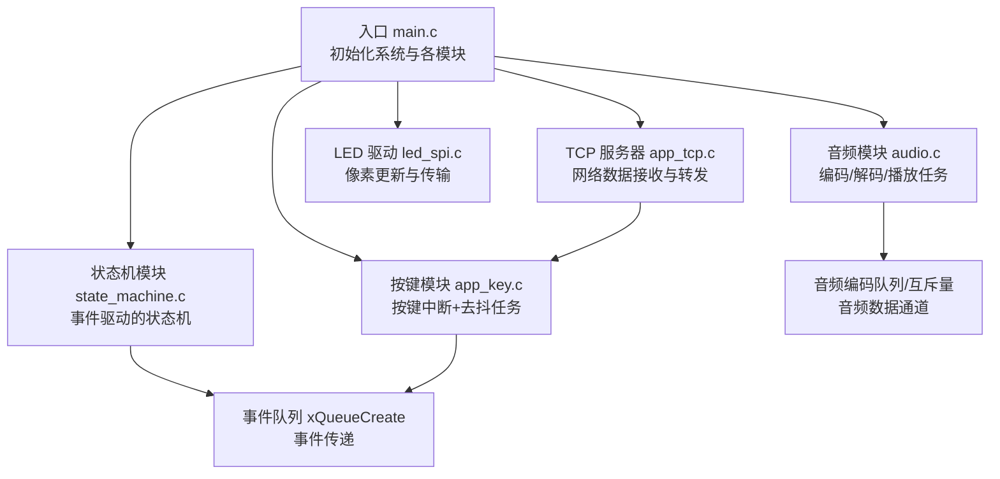
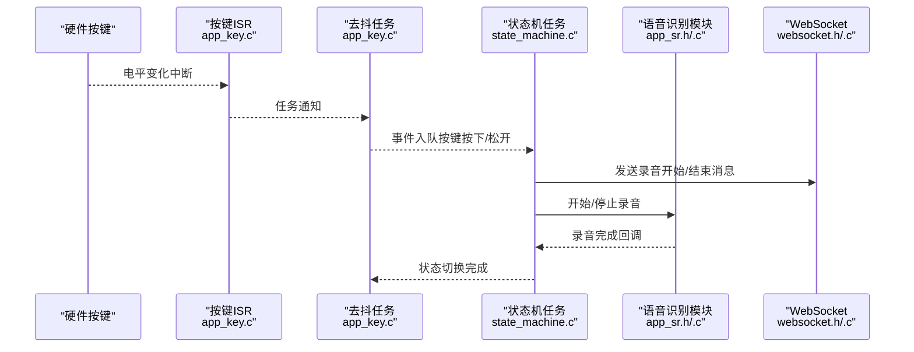
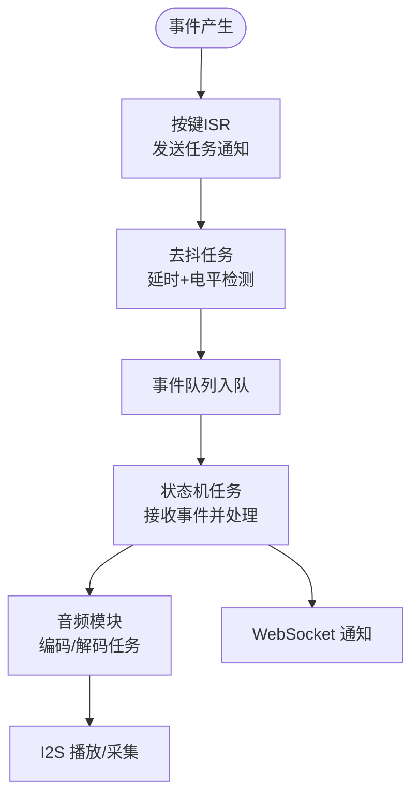
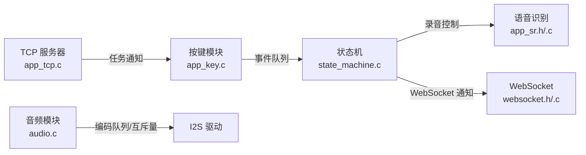

# FreeRTOS 任务管理

<cite>
**本文引用的文件**
- [main.c](file://main/main.c)
- [sdkconfig.old](file://sdkconfig.old)
- [state_machine.c](file://main/app/state_machine/state_machine.c)
- [state_machine.h](file://main/app/state_machine/state_machine.h)
- [app_key.c](file://main/app/key/app_key.c)
- [audio.c](file://main/app/audio/audio.c)
- [audio.h](file://main/app/audio/audio.h)
- [app_tcp.c](file://main/app/tcp/app_tcp.c)
- [app_tcp.h](file://main/app/tcp/app_tcp.h)
- [led_spi.c](file://main/app/led_strip/led_spi.c)
</cite>

## 目录
1. [引言](#引言)
2. [项目结构](#项目结构)
3. [核心组件](#核心组件)
4. [架构总览](#架构总览)
5. [详细组件分析](#详细组件分析)
6. [依赖关系分析](#依赖关系分析)
7. [性能考量](#性能考量)
8. [故障排查指南](#故障排查指南)
9. [结论](#结论)
10. [附录](#附录)

## 引言
本文件围绕项目中的 FreeRTOS 任务管理实践展开，系统阐述任务创建与初始化、任务优先级与栈大小配置、任务间同步机制（队列、信号量、任务通知）、任务生命周期与清理策略，并结合项目中的具体实现进行分析。同时提供调试技巧、性能监控方法与常见问题解决方案，帮助读者在嵌入式实时场景中高效、安全地使用 FreeRTOS。

## 项目结构
项目采用模块化的应用层组织方式，顶层入口负责系统初始化与各子系统的启动；应用层包含按键、IMU、音频、TCP、状态机、LED 等模块，每个模块均以独立的任务或队列/信号量进行协作。

图表来源
- [main.c:33-60](file://main/main.c#L33-L60)
- [state_machine.c:24-47](file://main/app/state_machine/state_machine.c#L24-L47)
- [app_key.c:72-104](file://main/app/key/app_key.c#L72-L104)
- [audio.c:42-51](file://main/app/audio/audio.c#L42-L51)
- [app_tcp.c:354-359](file://main/app/tcp/app_tcp.c#L354-L359)
- [led_spi.c:36-66](file://main/app/led_strip/led_spi.c#L36-L66)

章节来源
- [main.c:33-60](file://main/main.c#L33-L60)

## 核心组件
- 任务创建与初始化
  - 使用任务创建接口创建任务，传入任务函数、名称、栈深、参数、优先级与句柄指针，便于后续同步与控制。
  - 示例：状态机任务、音频解码/编码任务、TCP 服务器任务、按键去抖任务等均通过该方式创建。
- 任务优先级与时间片
  - 项目中多处使用较高优先级（如 10）处理按键去抖，确保按键事件响应及时；普通业务任务优先级相对较低，保证系统稳定性。
  - FreeRTOS 配置为 1000 Hz，tick 周期为 1ms，有利于精确的时间控制与延时。
- 栈大小配置
  - 栈大小依据任务负载选择：按键任务约 2KB，状态机任务约 2KB，TCP 服务器约 6KB，音频解码/编码任务约 8KB，满足 I2S、Opus 编解码与队列操作需求。
- 任务参数与句柄
  - 通过 TaskHandle_t 保存任务句柄，用于任务通知、查询状态或与其他模块交互（如 TCP 注册按键任务句柄）。

章节来源
- [state_machine.c:32](file://main/app/state_machine/state_machine.c#L32)
- [audio.c:906-913](file://main/app/audio/audio.c#L906-L913)
- [app_tcp.c:358](file://main/app/tcp/app_tcp.c#L358)
- [app_key.c:85](file://main/app/key/app_key.c#L85)
- [sdkconfig.old:1457](file://sdkconfig.old#L1457)

## 架构总览
系统采用“事件驱动 + 任务协作”的架构：按键产生事件，经去抖处理后通过队列发送至状态机；状态机根据当前状态决定录音控制与 WebSocket 通知；音频模块通过队列与互斥量协调编码/解码与 I2S 播放；TCP 服务器接收网络数据，触发按键任务处理。

图表来源
- [app_key.c:22-30](file://main/app/key/app_key.c#L22-L30)
- [app_key.c:33-70](file://main/app/key/app_key.c#L33-L70)
- [state_machine.c:37-42](file://main/app/state_machine/state_machine.c#L37-L42)
- [state_machine.c:83-115](file://main/app/state_machine/state_machine.c#L83-L115)

## 详细组件分析

### 任务创建与初始化
- 状态机任务
  - 创建事件队列与状态机任务，任务优先级适中，栈深约 2KB。
  - 通过队列接收事件并处理状态转换，避免阻塞按键任务。
- 音频解码/编码任务
  - 使用带核亲和性的任务创建接口将音频解码任务绑定到特定核心，减少上下文切换开销。
  - 任务栈深约 8KB，满足 Opus 解码与 I2S 写入的实时性要求。
- TCP 服务器任务
  - 单任务监听与处理客户端连接，避免多任务竞争；通过互斥量保护共享套接字。
- 按键去抖任务
  - 高优先级任务处理按键中断通知，降低抖动影响，提高事件响应可靠性。

章节来源
- [state_machine.c:24-47](file://main/app/state_machine/state_machine.c#L24-L47)
- [audio.c:906-913](file://main/app/audio/audio.c#L906-L913)
- [app_tcp.c:354-359](file://main/app/tcp/app_tcp.c#L354-L359)
- [app_key.c:72-104](file://main/app/key/app_key.c#L72-L104)

### 任务调度机制
- 时间片轮转
  - FreeRTOS tick 频率为 1000 Hz，任务在相同优先级下按时间片轮转，保证公平性。
- 优先级调度
  - 按键去抖任务优先级高于普通任务，确保按键事件及时处理；音频任务优先级适中，兼顾实时性与稳定性。
- 任务切换时机
  - 任务主动延时（vTaskDelay）、等待队列/信号量、被更高优先级任务抢占时发生切换。

章节来源
- [sdkconfig.old:1457](file://sdkconfig.old#L1457)
- [app_key.c:42-70](file://main/app/key/app_key.c#L42-L70)

### 任务间同步机制
- 队列（Queue）
  - 状态机使用队列接收按键事件，避免直接耦合；TCP 服务器使用队列承载音频编码数据，解码任务从队列取出 PCM 帧。
  - 队列深度与元素大小根据业务负载合理配置，防止阻塞与数据丢失。
- 信号量（Mutex/Semaphore）
  - 音频模块使用互斥量保护环形缓冲区，避免并发读写导致的数据损坏；TCP 服务器使用互斥量保护当前客户端套接字。
- 任务通知（Task Notification）
  - 按键 ISR 通过任务通知唤醒去抖任务，减少中断处理复杂度，提高响应速度。
- 事件组（Event Groups）
  - 项目中未使用事件组，但可作为多事件聚合的补充方案（概念性说明）。

图表来源
- [app_key.c:22-30](file://main/app/key/app_key.c#L22-L30)
- [app_key.c:33-70](file://main/app/key/app_key.c#L33-L70)
- [state_machine.c:37-42](file://main/app/state_machine/state_machine.c#L37-L42)
- [audio.c:42-51](file://main/app/audio/audio.c#L42-L51)

章节来源
- [state_machine.c:26-42](file://main/app/state_machine/state_machine.c#L26-L42)
- [audio.c:48-49](file://main/app/audio/audio.c#L48-L49)
- [app_tcp.c:68-86](file://main/app/tcp/app_tcp.c#L68-L86)
- [app_key.c:22-30](file://main/app/key/app_key.c#L22-L30)

### 任务生命周期管理
- 生命周期阶段
  - 初始化：创建队列/信号量/互斥量，注册中断服务，创建任务。
  - 运行：任务按优先级与时间片运行，通过同步原语协作。
  - 清理：任务退出时释放资源（如关闭文件、销毁互斥量），避免泄漏。
- 删除与清理策略
  - 项目中未显式删除任务；音频模块在异常路径中释放解码器/编码器资源，避免悬挂指针。
  - 建议：对需要动态创建的任务，在退出路径中统一释放句柄与资源，保持一致性。

章节来源
- [audio.c:97-107](file://main/app/audio/audio.c#L97-L107)
- [audio.c:384-394](file://main/app/audio/audio.c#L384-L394)

### 任务调试技巧与性能监控
- 调试技巧
  - 使用任务通知快速定位按键响应链路；通过日志打印事件与状态转换，验证状态机正确性。
  - 在音频模块中加入缓冲区写入位置的日志，辅助定位环形缓冲区溢出或欠载。
- 性能监控
  - 定期打印可用堆内存（内部/PSRAM），评估任务对内存的压力。
  - 使用互斥量超时与队列阻塞超时，避免死锁与长时间阻塞。

章节来源
- [main.c:53-59](file://main/main.c#L53-L59)
- [audio.c:631](file://main/app/audio/audio.c#L631)

## 依赖关系分析
- 组件耦合
  - 按键模块与状态机通过队列解耦；音频模块与 WebSocket 通过队列/互斥量解耦；TCP 服务器与按键任务通过任务通知解耦。
- 外部依赖
  - FreeRTOS 内核、ESP-IDF 驱动与 LWIP 网络栈；音频模块依赖 Opus 库与 I2S 驱动。
- 潜在风险
  - 共享资源（套接字、环形缓冲区）需严格加锁；队列/信号量未正确释放可能导致死锁。

图表来源
- [app_key.c:37-42](file://main/app/key/app_key.c#L37-L42)
- [state_machine.c:83-115](file://main/app/state_machine/state_machine.c#L83-L115)
- [audio.c:42-51](file://main/app/audio/audio.c#L42-L51)
- [app_tcp.c:277](file://main/app/tcp/app_tcp.c#L277)

章节来源
- [state_machine.c:24-47](file://main/app/state_machine/state_machine.c#L24-L47)
- [audio.c:42-51](file://main/app/audio/audio.c#L42-L51)
- [app_tcp.c:59-63](file://main/app/tcp/app_tcp.c#L59-L63)

## 性能考量
- 任务优先级与时间片
  - 高优先级任务处理按键去抖，确保交互体验；普通任务避免长时间阻塞，必要时拆分为多个小任务。
- 栈大小与内存
  - 音频任务栈深适中，避免栈溢出；PSRAM 使用合理，注意 DMA 缓冲区分配与对齐。
- 同步原语选择
  - 高频事件使用任务通知，减少上下文切换；共享缓冲区使用互斥量保护，避免竞态。
- 抖动与延迟
  - 按键去抖引入固定延迟，需权衡响应速度与稳定性。

## 故障排查指南
- 按键无响应或误触发
  - 检查中断安装与 ISR 注册；确认去抖延时与电平检测逻辑；查看任务通知是否被正确接收。
- 状态机卡住或事件丢失
  - 检查事件队列创建与入队/出队逻辑；确认状态机任务优先级与队列阻塞超时。
- 音频播放卡顿或无声
  - 检查 I2S 写入返回值与缓冲区读取逻辑；确认互斥量获取超时与环形缓冲区剩余空间。
- TCP 客户端连接异常
  - 检查互斥量保护下的套接字访问；确认单任务处理模式与数据前缀解析逻辑。

章节来源
- [app_key.c:42-70](file://main/app/key/app_key.c#L42-L70)
- [state_machine.c:52-56](file://main/app/state_machine/state_machine.c#L52-L56)
- [audio.c:325-354](file://main/app/audio/audio.c#L325-L354)
- [app_tcp.c:320-351](file://main/app/tcp/app_tcp.c#L320-L351)

## 结论
本项目在 FreeRTOS 之上构建了清晰的任务分工与同步机制：按键去抖、状态机事件驱动、音频编解码与 I2S、TCP 服务器与 WebSocket 通知。通过合理的优先级、栈大小与同步原语选择，实现了低延迟与高可靠性的嵌入式系统。建议在后续迭代中进一步完善任务资源回收与事件组的使用，提升可维护性与扩展性。

## 附录
- 关键实现路径参考
  - 任务创建与初始化：[state_machine.c:32](file://main/app/state_machine/state_machine.c#L32)，[audio.c:906-913](file://main/app/audio/audio.c#L906-L913)，[app_tcp.c:358](file://main/app/tcp/app_tcp.c#L358)，[app_key.c:85](file://main/app/key/app_key.c#L85)
  - 事件队列与状态机：[state_machine.c:26-42](file://main/app/state_machine/state_machine.c#L26-L42)，[state_machine.c:83-115](file://main/app/state_machine/state_machine.c#L83-L115)
  - 互斥量与音频缓冲区：[audio.c:48-49](file://main/app/audio/audio.c#L48-L49)，[audio.c:325-354](file://main/app/audio/audio.c#L325-L354)
  - 任务通知与按键处理：[app_key.c:22-30](file://main/app/key/app_key.c#L22-L30)，[app_key.c:33-70](file://main/app/key/app_key.c#L33-L70)
  - TCP 服务器与互斥量：[app_tcp.c:68-86](file://main/app/tcp/app_tcp.c#L68-L86)，[app_tcp.c:354-359](file://main/app/tcp/app_tcp.c#L354-L359)
  - 入口与系统初始化：[main.c:33-60](file://main/main.c#L33-L60)