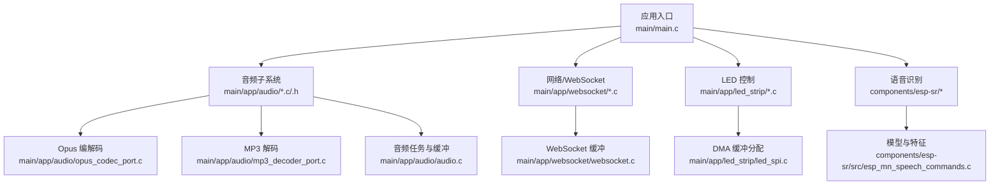
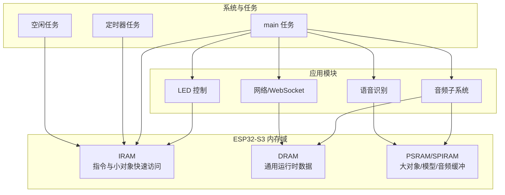
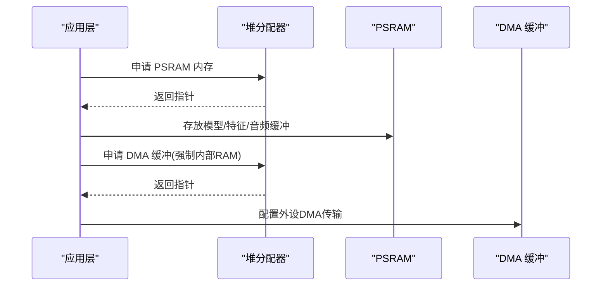
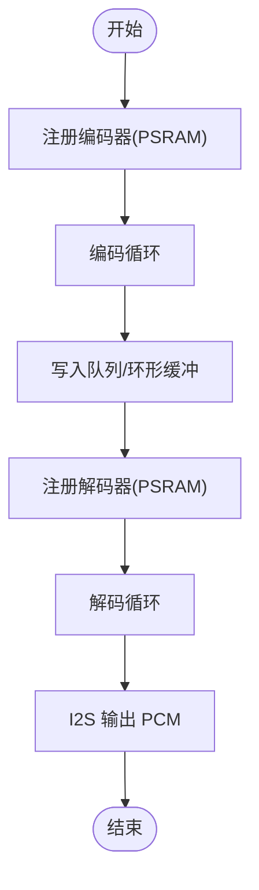
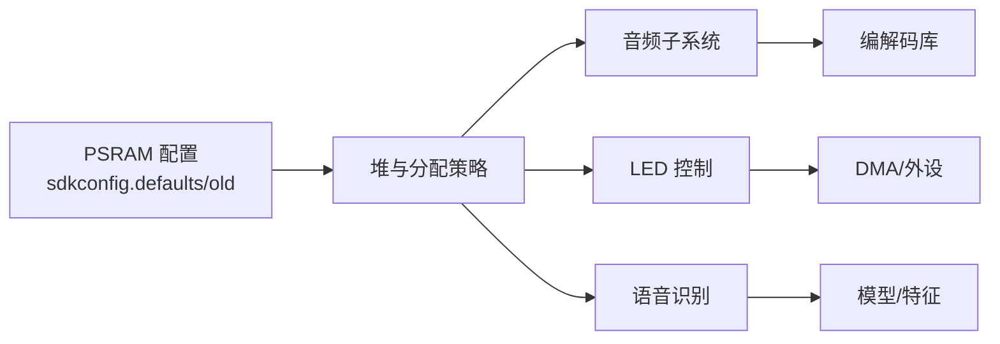

# 内存管理策略

<cite>
**本文引用的文件**
- [main.c](file://main/main.c)
- [sdkconfig.defaults](file://sdkconfig.defaults)
- [sdkconfig.old](file://sdkconfig.old)
- [partitions.csv](file://partitions.csv)
- [audio.h](file://main/app/audio/audio.h)
- [audio_private.h](file://main/app/audio/audio_private.h)
- [audio.c](file://main/app/audio/audio.c)
- [opus_codec_port.c](file://main/app/audio/opus_codec_port.c)
- [mp3_decoder_port.c](file://main/app/audio/mp3_decoder_port.c)
- [led_spi.c](file://main/app/led_strip/led_spi.c)
- [websocket.c](file://main/app/websocket/websocket.c)
- [esp_mn_speech_commands.c](file://components/esp-sr/src/esp_mn_speech_commands.c)
- [app_sr.c](file://main/app/audio/app_sr.c)
</cite>

## 目录
1. [引言](#引言)
2. [项目结构](#项目结构)
3. [核心组件](#核心组件)
4. [架构总览](#架构总览)
5. [详细组件分析](#详细组件分析)
6. [依赖关系分析](#依赖关系分析)
7. [性能考量](#性能考量)
8. [故障排查指南](#故障排查指南)
9. [结论](#结论)
10. [附录](#附录)

## 引言
本文件系统性梳理本项目在 ESP32-S3 上的内存管理策略，围绕以下目标展开：
- 解释 ESP32-S3 的内存架构与特性（IRAM、DRAM、PSRAM、SPIRAM）及其使用场景
- 细化堆栈配置策略（任务栈大小、最小栈检查、栈溢出防护）
- 说明缓冲区管理技术（环形缓冲区、双缓冲、内存池）
- 覆盖 PSRAM 使用优化（DMA 缓冲区分配、音频数据缓存、大对象管理）
- 提供内存泄漏检测、内存碎片化预防与性能优化建议，并结合项目实际使用模式进行分析

## 项目结构
项目采用模块化组织，音频、网络、LED、IMU 等功能分别位于独立组件中；PSRAM 已启用并配置为外部 RAM 使用，配合 FreeRTOS 堆能力与 ESP-IDF 内存分配 API 实现灵活的内存布局。

图表来源
- [main.c:33-59](file://main/main.c#L33-L59)
- [audio.c:1-120](file://main/app/audio/audio.c#L1-L120)
- [opus_codec_port.c:20-60](file://main/app/audio/opus_codec_port.c#L20-L60)
- [mp3_decoder_port.c:40-70](file://main/app/audio/mp3_decoder_port.c#L40-L70)
- [websocket.c:70-90](file://main/app/websocket/websocket.c#L70-L90)
- [led_spi.c:36-73](file://main/app/led_strip/led_spi.c#L36-L73)
- [esp_mn_speech_commands.c:14-25](file://components/esp-sr/src/esp_mn_speech_commands.c#L14-L25)

章节来源
- [main.c:33-59](file://main/main.c#L33-L59)
- [sdkconfig.defaults:80-120](file://sdkconfig.defaults#L80-L120)

## 核心组件
- PSRAM 启用与配置：项目启用了 PSRAM 并配置为 Octal 模式、指令预取、只读数据进入 PSRAM、允许栈使用外部内存等，以最大化利用外部高速内存。
- 堆与分区：系统默认堆支持内部与外部内存，分区表包含 SPIFFS 分区，用于存放音频模型与配置文件。
- 音频子系统：采用环形缓冲区、互斥量保护、任务间队列传递，结合 Opus/MP3 编解码实现流式音频处理。
- LED 控制：DMA 相关缓冲强制分配在 DMA 可达的内部 RAM，保证外设 DMA 传输稳定性。
- 语音识别：模型与中间数据优先分配至 PSRAM，降低内部 SRAM 压力。

章节来源
- [sdkconfig.defaults:80-120](file://sdkconfig.defaults#L80-L120)
- [sdkconfig.old:1150-1181](file://sdkconfig.old#L1150-L1181)
- [partitions.csv:1-6](file://partitions.csv#L1-L6)
- [audio.c:23-40](file://main/app/audio/audio.c#L23-L40)
- [led_spi.c:36-73](file://main/app/led_strip/led_spi.c#L36-L73)
- [esp_mn_speech_commands.c:14-25](file://components/esp-sr/src/esp_mn_speech_commands.c#L14-L25)

## 架构总览
下图展示内存域与关键模块的关系：内部 IRAM/DRAM 用于系统与实时性要求高的路径；PSRAM 作为大容量数据与模型的首选；DMA 相关缓冲严格限制在 DMA 可达的内存区域；任务栈与最小栈检查由 FreeRTOS 提供。

图表来源
- [sdkconfig.defaults:80-120](file://sdkconfig.defaults#L80-L120)
- [sdkconfig.old:1150-1181](file://sdkconfig.old#L1150-L1181)
- [main.c:33-59](file://main/main.c#L33-L59)

## 详细组件分析

### ESP32-S3 内存架构与使用策略
- IRAM（指令与小对象）：适合中断服务例程、关键路径函数与极小对象，延迟最低。
- DRAM（通用运行时）：适合常规任务栈、队列、小中型对象。
- PSRAM（大对象/模型/音频）：项目已启用 Octal 模式、指令预取、只读数据进入 PSRAM，适合模型、音频缓冲与大型临时数据。
- SPIRAM：与 PSRAM 在本项目中同义使用，通过 MALLOC_CAP_SPIRAM 进行分配。

章节来源
- [sdkconfig.defaults:80-120](file://sdkconfig.defaults#L80-L120)
- [sdkconfig.old:1150-1181](file://sdkconfig.old#L1150-L1181)

### 堆栈配置策略
- 任务栈大小：系统默认主任务栈为较大值，满足多模块并发；LVGL 显示任务栈也配置为较大值以保障渲染流畅。
- 最小栈检查：启用 FreeRTOS 栈溢出哨兵机制，可在任务栈被破坏时及时发现。
- 栈溢出防护：对关键 ISR 与高负载任务采用较大的栈深与合理的任务优先级，避免相互抢占导致栈压力。

章节来源
- [sdkconfig.defaults:115-118](file://sdkconfig.defaults#L115-L118)
- [sdkconfig.defaults:398-399](file://sdkconfig.defaults#L398-L399)
- [sdkconfig.defaults:1460](file://sdkconfig.defaults#L1460)

### 缓冲区管理技术
- 环形缓冲区：音频输出与 WebSocket 接收均采用环形缓冲区，减少碎片化与拷贝次数。
- 双缓冲/多缓冲：音频编码与解码之间通过队列与缓冲区协同，避免阻塞。
- 内存池：通过统一的内存分配策略（如 MALLOC_CAP_SPIRAM）集中管理大对象，降低碎片风险。

章节来源
- [audio.c:23-40](file://main/app/audio/audio.c#L23-L40)
- [audio.c:316-354](file://main/app/audio/audio.c#L316-L354)
- [audio.c:553-575](file://main/app/audio/audio.c#L553-L575)

### PSRAM 使用优化策略
- DMA 缓冲区分配：LED DMA 相关缓冲强制分配在 DMA 可达的内部 RAM，确保外设 DMA 传输稳定。
- 音频数据缓存：Opus/MP3 解码器上下文与中间缓冲优先使用 PSRAM，降低内部 SRAM 压力。
- 大对象管理：语音识别模型与中间特征数组优先分配至 PSRAM，失败回退到内部 RAM。

图表来源
- [led_spi.c:36-73](file://main/app/led_strip/led_spi.c#L36-L73)
- [opus_codec_port.c:20-60](file://main/app/audio/opus_codec_port.c#L20-L60)
- [esp_mn_speech_commands.c:14-25](file://components/esp-sr/src/esp_mn_speech_commands.c#L14-L25)

章节来源
- [led_spi.c:36-73](file://main/app/led_strip/led_spi.c#L36-L73)
- [opus_codec_port.c:20-60](file://main/app/audio/opus_codec_port.c#L20-L60)
- [esp_mn_speech_commands.c:14-25](file://components/esp-sr/src/esp_mn_speech_commands.c#L14-L25)

### 音频子系统内存使用模式
- 编码路径：编码器注册与上下文分配在 PSRAM；编码帧缓冲区包含帧头与压缩数据，通过队列与环形缓冲传递。
- 解码路径：解码器注册与上下文分配在 PSRAM；解码输出 PCM 缓冲区通过 I2S 发送。
- WebSocket 接收：将远端音频数据写入环形缓冲区，解码任务从缓冲区读取并解码播放。

图表来源
- [audio.c:699-799](file://main/app/audio/audio.c#L699-L799)
- [audio.c:621-697](file://main/app/audio/audio.c#L621-L697)
- [audio.c:553-575](file://main/app/audio/audio.c#L553-L575)

章节来源
- [audio.c:699-799](file://main/app/audio/audio.c#L699-L799)
- [audio.c:621-697](file://main/app/audio/audio.c#L621-L697)
- [audio.c:553-575](file://main/app/audio/audio.c#L553-L575)

### 语音识别内存使用模式
- 模型与特征：优先使用 PSRAM 分配，失败则回退到内部 RAM。
- 语音帧缓冲：动态分配 PCM 帧缓冲，确保实时性与稳定性。

章节来源
- [esp_mn_speech_commands.c:14-25](file://components/esp-sr/src/esp_mn_speech_commands.c#L14-L25)
- [app_sr.c:20-30](file://main/app/audio/app_sr.c#L20-L30)

## 依赖关系分析
- 配置依赖：PSRAM 相关选项影响堆与任务栈的可用内存范围与行为。
- 模块依赖：音频子系统依赖编解码库与 I2S；LED 控制依赖 SPI 与 DMA；WebSocket 依赖网络栈与内存缓冲。
- 内存分配依赖：各模块通过 heap_caps_* API 指定内存域，避免跨域分配带来的性能与稳定性问题。

图表来源
- [sdkconfig.defaults:80-120](file://sdkconfig.defaults#L80-L120)
- [sdkconfig.old:1150-1181](file://sdkconfig.old#L1150-L1181)
- [audio.c:699-799](file://main/app/audio/audio.c#L699-L799)
- [led_spi.c:36-73](file://main/app/led_strip/led_spi.c#L36-L73)
- [esp_mn_speech_commands.c:14-25](file://components/esp-sr/src/esp_mn_speech_commands.c#L14-L25)

章节来源
- [sdkconfig.defaults:80-120](file://sdkconfig.defaults#L80-L120)
- [sdkconfig.old:1150-1181](file://sdkconfig.old#L1150-L1181)

## 性能考量
- PSRAM 利用：启用 Octal、指令预取与只读数据进入 PSRAM，显著提升大对象访问性能。
- DMA 传输：DMA 缓冲强制分配在 DMA 可达的内部 RAM，减少 DMA 传输失败与系统抖动。
- 缓冲区设计：环形缓冲区与互斥量保护降低锁竞争与内存碎片，提高吞吐。
- 任务栈：为高负载任务分配足够栈空间，结合最小栈检查，避免栈溢出导致的任务崩溃。

## 故障排查指南
- 内存不足：通过日志打印内部与 PSRAM 堆剩余大小，定位瓶颈模块。
- 栈溢出：启用最小栈检查，观察任务栈使用情况，必要时增大栈深或拆分任务。
- 编解码异常：检查编解码器上下文是否成功分配至 PSRAM，确认帧头格式与长度字段正确。
- DMA 失败：确认 DMA 缓冲分配在 DMA 可达的内部 RAM，检查外设配置与传输大小。

章节来源
- [main.c:53-58](file://main/main.c#L53-L58)
- [sdkconfig.defaults:1460](file://sdkconfig.defaults#L1460)
- [audio.c:72-92](file://main/app/audio/audio.c#L72-L92)
- [opus_codec_port.c:20-60](file://main/app/audio/opus_codec_port.c#L20-L60)
- [led_spi.c:36-73](file://main/app/led_strip/led_spi.c#L36-L73)

## 结论
本项目在 ESP32-S3 上采用“PSRAM 优先、DMA 专用、环形缓冲”的内存管理策略，结合合理的任务栈配置与最小栈检查，实现了高性能、低碎片、稳定的音频与网络处理能力。通过在关键路径上强制使用 IRAM/DRAM，在大对象与模型上充分利用 PSRAM，整体内存利用率与系统稳定性得到显著提升。

## 附录
- 关键宏与常量
  - 环形缓冲区大小：音频输出与 WebSocket 接收缓冲区大小定义于音频模块。
  - 帧头长度：固定帧头长度用于封装编码后的音频数据。
  - DMA 缓冲：LED DMA 相关缓冲强制分配在 DMA 可达的内部 RAM。

章节来源
- [audio.c:23-32](file://main/app/audio/audio.c#L23-L32)
- [audio.c:33-40](file://main/app/audio/audio.c#L33-L40)
- [led_spi.c:36-73](file://main/app/led_strip/led_spi.c#L36-L73)