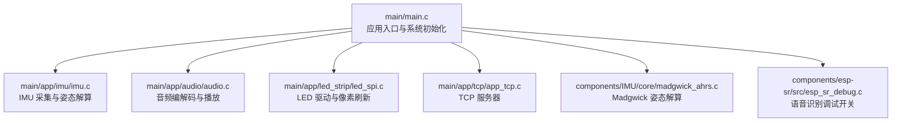
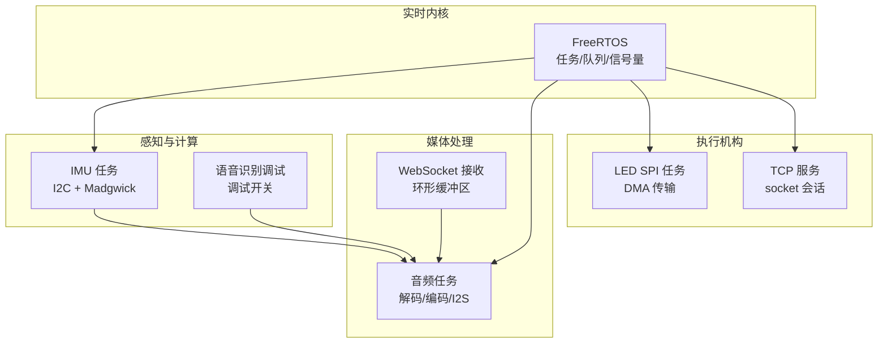
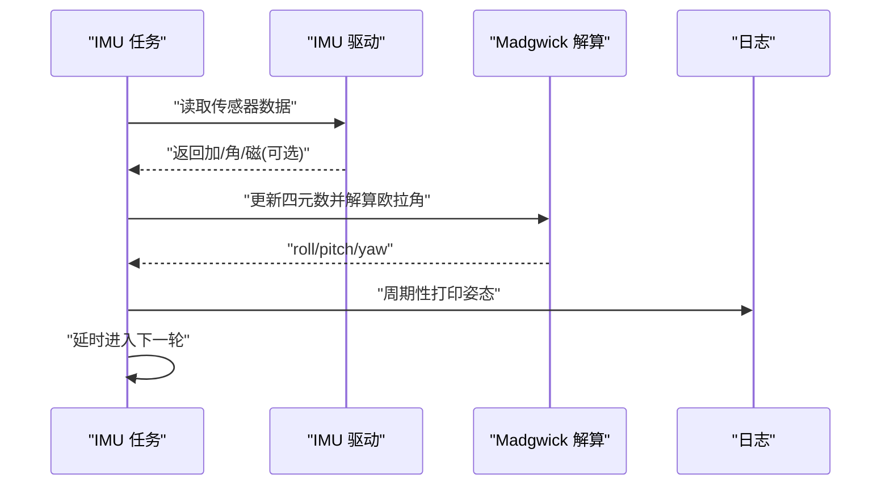
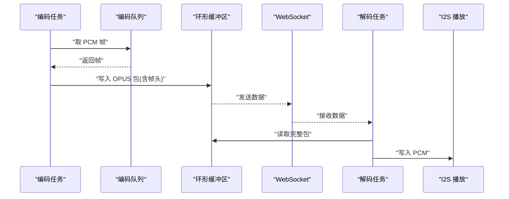
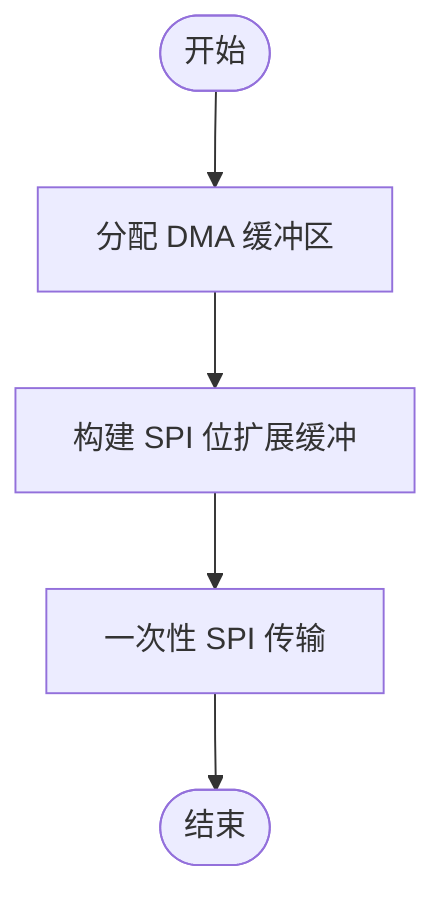
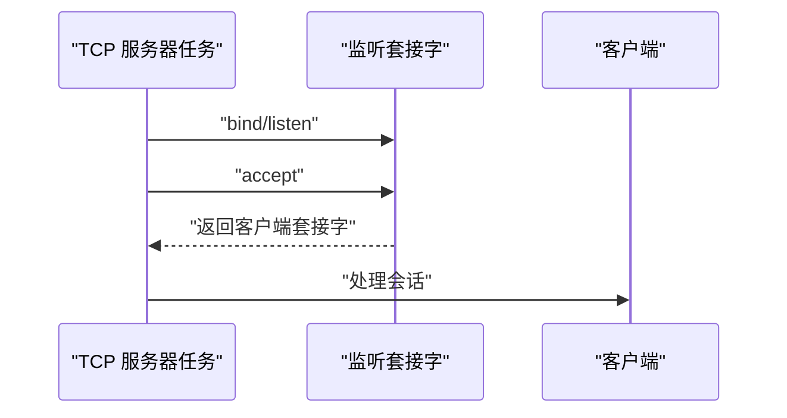
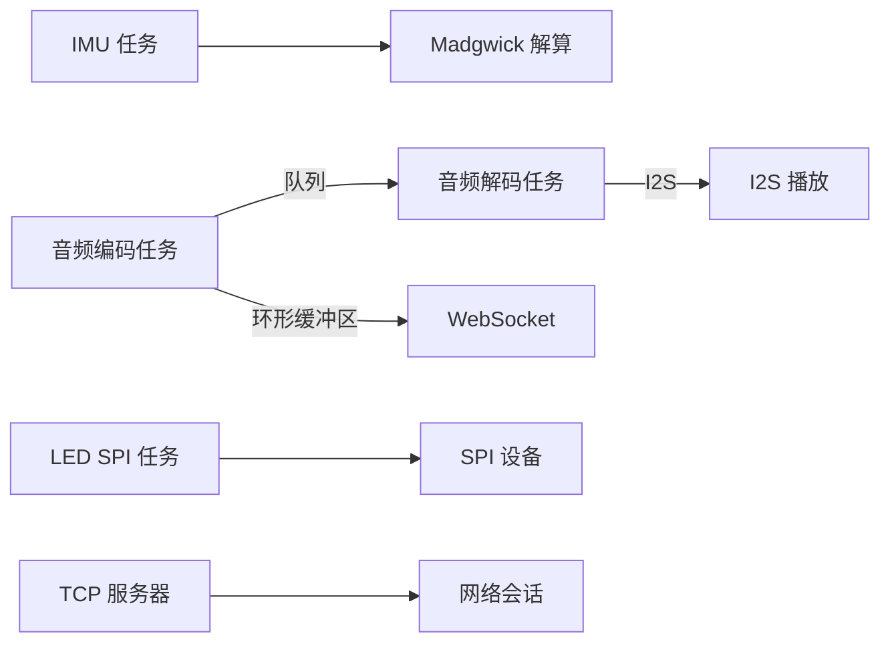

# 实时性能优化

<cite>
**本文引用的文件**
- [main.c](file://main/main.c)
- [imu.c](file://main/app/imu/imu.c)
- [madgwick_ahrs.c](file://components/IMU/core/madgwick_ahrs.c)
- [audio.c](file://main/app/audio/audio.c)
- [audio.h](file://main/app/audio/audio.h)
- [led_spi.c](file://main/app/led_strip/led_spi.c)
- [app_tcp.c](file://main/app/tcp/app_tcp.c)
- [app_tcp.h](file://main/app/tcp/app_tcp.h)
- [esp_sr_debug.c](file://components/esp-sr/src/esp_sr_debug.c)
- [sdkconfig.old](file://sdkconfig.old)
</cite>

## 目录
1. [引言](#引言)
2. [项目结构](#项目结构)
3. [核心组件](#核心组件)
4. [架构总览](#架构总览)
5. [详细组件分析](#详细组件分析)
6. [依赖关系分析](#依赖关系分析)
7. [性能考量](#性能考量)
8. [故障排查指南](#故障排查指南)
9. [结论](#结论)
10. [附录](#附录)

## 引言
本技术文档聚焦于实时性能优化，围绕响应时间、吞吐量与延迟要求展开；系统性阐述中断处理优化、任务同步优化、资源共享优化，并提供性能分析工具使用方法。结合音频处理、IMU 数据采集与 LED 控制等实时任务，给出可落地的优化策略与案例。

## 项目结构
项目采用 ESP-IDF + FreeRTOS 的典型工程组织方式，主程序入口负责系统初始化与任务调度，各功能模块以组件形式组织，便于独立开发与集成。

**图示来源**
- [main.c:33-60](file://main/main.c#L33-L60)
- [imu.c:42-75](file://main/app/imu/imu.c#L42-L75)
- [audio.c:112-205](file://main/app/audio/audio.c#L112-L205)
- [led_spi.c:36-66](file://main/app/led_strip/led_spi.c#L36-L66)
- [app_tcp.c:289-314](file://main/app/tcp/app_tcp.c#L289-L314)
- [madgwick_ahrs.c:284-322](file://components/IMU/core/madgwick_ahrs.c#L284-L322)
- [esp_sr_debug.c:6-12](file://components/esp-sr/src/esp_sr_debug.c#L6-L12)

**章节来源**
- [main.c:33-60](file://main/main.c#L33-L60)

## 核心组件
- IMU 采集与姿态解算：基于 I2C 传感器与 FreeRTOS 任务，周期性读取数据并通过 Madgwick 算法解算欧拉角。
- 音频处理：包含 MP3/Opus 解码、I2S 播放、WebSocket 接收与环形缓冲区管理，采用队列与信号量协调。
- LED 控制：通过 SPI 将像素数据位扩展后传输，使用 DMA 内存与一次性事务发送。
- TCP 服务：基于 socket 的简单 TCP 服务器，支持客户端接入与数据转发。
- 语音识别调试：提供调试模式开关，便于性能分析与问题定位。

**章节来源**
- [imu.c:83-115](file://main/app/imu/imu.c#L83-L115)
- [audio.c:399-550](file://main/app/audio/audio.c#L399-L550)
- [led_spi.c:80-92](file://main/app/led_strip/led_spi.c#L80-L92)
- [app_tcp.c:289-314](file://main/app/tcp/app_tcp.c#L289-L314)
- [esp_sr_debug.c:6-12](file://components/esp-sr/src/esp_sr_debug.c#L6-L12)

## 架构总览
系统以 FreeRTOS 为核心，多任务并行运行，通过队列、信号量与互斥量实现任务间同步与资源共享；硬件抽象层封装 I2C、SPI、I2S 等外设接口，保证实时性与可移植性。

**图示来源**
- [main.c:33-60](file://main/main.c#L33-L60)
- [imu.c:83-115](file://main/app/imu/imu.c#L83-L115)
- [audio.c:699-800](file://main/app/audio/audio.c#L699-L800)
- [led_spi.c:80-92](file://main/app/led_strip/led_spi.c#L80-L92)
- [app_tcp.c:289-314](file://main/app/tcp/app_tcp.c#L289-L314)
- [esp_sr_debug.c:6-12](file://components/esp-sr/src/esp_sr_debug.c#L6-L12)

## 详细组件分析

### IMU 采集与姿态解算（实时关键路径）
- 周期性采集：IMU 任务以固定间隔轮询读取传感器数据，失败重试与日志记录保障鲁棒性。
- 姿态解算：使用 Madgwick 算法，依据是否存在磁力计选择 9 轴或 6 轴更新，计算欧拉角并输出。
- 同步与资源：任务内部无共享状态竞争，仅全局变量保存姿态与活动等级，避免锁开销。

**图示来源**
- [imu.c:83-115](file://main/app/imu/imu.c#L83-L115)
- [madgwick_ahrs.c:284-322](file://components/IMU/core/madgwick_ahrs.c#L284-L322)

**章节来源**
- [imu.c:83-115](file://main/app/imu/imu.c#L83-L115)
- [madgwick_ahrs.c:284-322](file://components/IMU/core/madgwick_ahrs.c#L284-L322)

### 音频处理（编解码、I2S、WebSocket）
- 编码链路：编码器任务从队列取 PCM 帧，经 Opus 编码后写入环形缓冲区，带帧头与包序号，随后通过 WebSocket 发送。
- 解码链路：WebSocket 接收数据写入环形缓冲区；解码任务从缓冲区读取完整包，解析帧头提取 Opus 数据，解码后通过 I2S 播放。
- 同步机制：使用队列与信号量保护环形缓冲区，避免竞态；对缓冲区剩余空间进行预判，必要时丢弃以维持实时性。
- I2S 播放：解码后直接写入 I2S，注意采样点数与字节对齐，避免阻塞。

**图示来源**
- [audio.c:699-800](file://main/app/audio/audio.c#L699-L800)
- [audio.c:399-550](file://main/app/audio/audio.c#L399-L550)
- [audio.h:14-22](file://main/app/audio/audio.h#L14-L22)

**章节来源**
- [audio.c:399-550](file://main/app/audio/audio.c#L399-L550)
- [audio.c:699-800](file://main/app/audio/audio.c#L699-L800)
- [audio.h:14-22](file://main/app/audio/audio.h#L14-L22)

### LED 控制（SPI 位扩展与时序）
- 内存分配：使用 DMA 可用内存分配颜色缓冲与 SPI 位扩展缓冲，避免中断上下文下的内存碎片。
- 位扩展：将每个通道的 8bit 扩展为 24bit 的 SPI 字节序列，严格遵循 WS2812 时序。
- 传输：一次性事务发送全部 LED 的位流，减少事务开销与抖动。

**图示来源**
- [led_spi.c:36-66](file://main/app/led_strip/led_spi.c#L36-L66)
- [led_spi.c:80-92](file://main/app/led_strip/led_spi.c#L80-L92)

**章节来源**
- [led_spi.c:36-66](file://main/app/led_strip/led_spi.c#L36-L66)
- [led_spi.c:80-92](file://main/app/led_strip/led_spi.c#L80-L92)

### TCP 服务（网络接入与会话管理）
- 服务器：创建 socket、绑定、监听，接受连接后维护当前客户端套接字。
- 单任务模型：单任务处理客户端接入，避免锁竞争，简化同步复杂度。

**图示来源**
- [app_tcp.c:289-314](file://main/app/tcp/app_tcp.c#L289-L314)

**章节来源**
- [app_tcp.c:289-314](file://main/app/tcp/app_tcp.c#L289-L314)
- [app_tcp.h:4-7](file://main/app/tcp/app_tcp.h#L4-L7)

## 依赖关系分析
- 组件耦合：IMU 与姿态解算模块松耦合，通过数据结构传递；音频模块通过队列与信号量与外部解耦；LED 与 SPI 驱动分离。
- 外部依赖：FreeRTOS 提供任务调度与同步原语；ESP-IDF 驱动提供 I2C/SPI/I2S/Socket 抽象。
- 潜在环路：当前未发现直接循环依赖；音频模块存在“编码队列 → 环形缓冲区 → WebSocket → 解码任务”的数据流闭环，但通过队列与信号量隔离。

**图示来源**
- [imu.c:83-115](file://main/app/imu/imu.c#L83-L115)
- [madgwick_ahrs.c:284-322](file://components/IMU/core/madgwick_ahrs.c#L284-L322)
- [audio.c:699-800](file://main/app/audio/audio.c#L699-L800)
- [audio.c:399-550](file://main/app/audio/audio.c#L399-L550)
- [led_spi.c:80-92](file://main/app/led_strip/led_spi.c#L80-L92)
- [app_tcp.c:289-314](file://main/app/tcp/app_tcp.c#L289-L314)

## 性能考量
- 响应时间与吞吐量
  - IMU 任务以固定周期运行，建议将采样频率与任务优先级匹配，避免抖动累积。
  - 音频链路中，编码/解码与 I2S 写入是关键瓶颈，需保证队列深度与缓冲区容量满足峰值需求。
  - LED 刷新采用一次性事务，降低事务切换开销，提高刷新稳定性。
- 延迟要求
  - 音频播放对端到端延迟敏感，建议在编码队列与环形缓冲区之间设置上限，丢弃过旧包以维持最小延迟。
  - TCP 服务采用单任务处理，适合低并发场景；高并发时可考虑多任务或异步 I/O。
- 中断处理优化
  - I2C/SPI/I2S 中断由驱动处理，应用层尽量避免在中断上下文中执行耗时操作；将实际处理放入任务。
  - 若使用外部中断（如按键），建议启用硬件去抖并缩短中断处理时间，将事件投递到队列。
- 任务同步优化
  - 使用队列进行无阻塞通信，避免忙等；对关键共享资源使用信号量而非互斥量，减少上下文切换。
  - 条件变量在 FreeRTOS 中通常以事件组或通知实现，建议统一使用队列/信号量/通知组合。
  - 死锁避免：限定锁持有时间，避免在信号量上做阻塞等待；任务优先级设计避免优先级反转。
- 资源共享优化
  - 临界区保护：短小精悍，使用信号量/互斥量包裹；对 DMA 缓冲区访问加锁。
  - 原子操作：在 FreeRTOS 中优先使用队列/信号量/通知等原语；必要时使用原子 API。
  - 并发控制：通过优先级与栈深配置，确保高优先级任务不被低优先级饥饿。
- 性能分析工具
  - 任务监控：利用 FreeRTOS 运行时统计（若启用）查看任务 CPU 占用；或通过日志周期性打印堆内存。
  - 内存分析：区分内部 RAM 与 PSRAM，优先将大缓冲区放置在 PSRAM；关注 DMA 缓冲区分配。
  - CPU 使用率统计：结合系统 tick 配置与任务延时，评估整体负载。

**章节来源**
- [sdkconfig.old:1457](file://sdkconfig.old#L1457)
- [main.c:53-59](file://main/main.c#L53-L59)

## 故障排查指南
- IMU 读数异常
  - 检查 I2C 配置与引脚，确认驱动安装成功；观察重试与失败日志，定位总线问题。
  - 若姿态发散，检查采样频率与滤波参数一致性。
- 音频卡顿或破音
  - 检查编码队列是否积压，环形缓冲区是否溢出；适当增大缓冲区与队列长度。
  - I2S 写入失败时，确认采样点数与字节对齐；降低任务优先级避免抢占。
- LED 不亮或闪烁
  - 确认 DMA 缓冲区分配成功；检查 SPI 时钟与位扩展逻辑；验证一次性传输是否完成。
- TCP 客户端连接失败
  - 检查 bind/listen 返回值与端口占用；确认单任务处理能力与并发连接数。
- 语音识别调试
  - 使用调试开关开启/关闭调试输出，配合日志定位问题。

**章节来源**
- [imu.c:44-75](file://main/app/imu/imu.c#L44-L75)
- [audio.c:169-178](file://main/app/audio/audio.c#L169-L178)
- [led_spi.c:80-92](file://main/app/led_strip/led_spi.c#L80-L92)
- [app_tcp.c:289-314](file://main/app/tcp/app_tcp.c#L289-L314)
- [esp_sr_debug.c:6-12](file://components/esp-sr/src/esp_sr_debug.c#L6-L12)

## 结论
通过合理的任务划分、同步原语与资源共享策略，系统在 IMU、音频与 LED 等实时任务上实现了稳定运行。建议进一步完善运行时统计与内存监控，持续优化关键链路的缓冲区与队列参数，以满足更严格的响应时间与吞吐量要求。

## 附录
- 关键配置参考
  - FreeRTOS 配置项：tick 频率、栈深、定时器任务等。
  - 日志与调试：启用必要的日志级别，结合调试开关快速定位问题。

**章节来源**
- [sdkconfig.old:1457](file://sdkconfig.old#L1457)