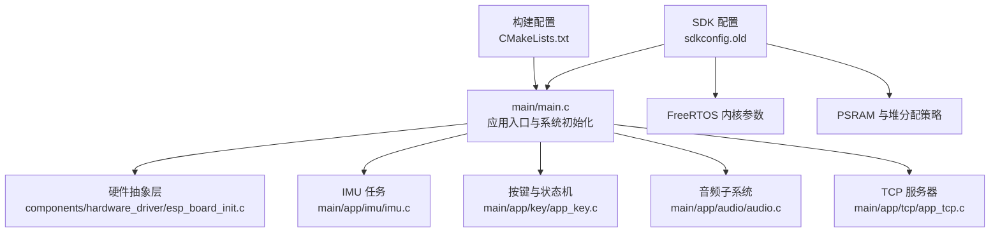
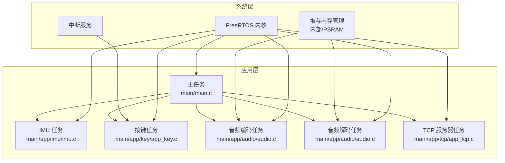
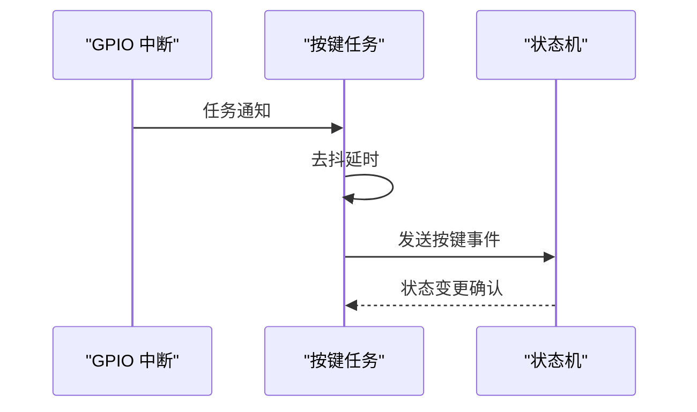
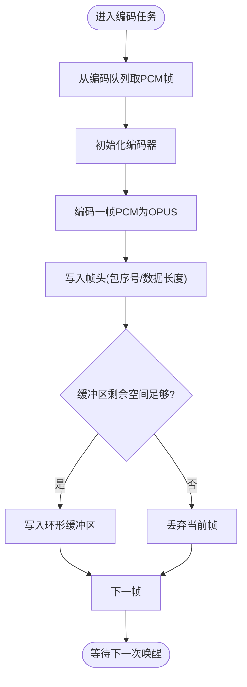
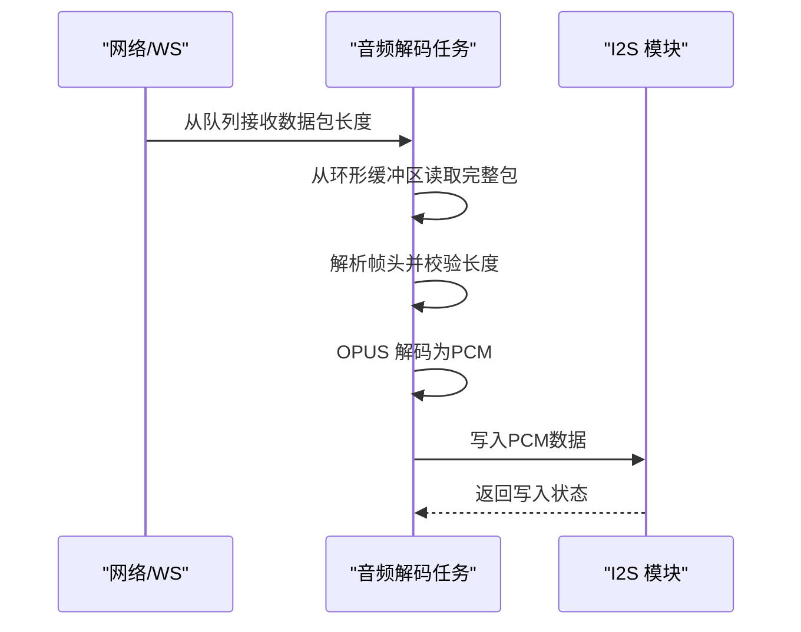
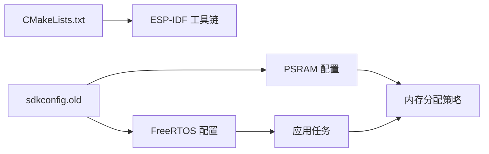

# 实时系统设计

<cite>
**本文引用的文件**
- [main.c](file://main/main.c)
- [CMakeLists.txt](file://CMakeLists.txt)
- [sdkconfig.old](file://sdkconfig.old)
- [imu.c](file://main/app/imu/imu.c)
- [audio.c](file://main/app/audio/audio.c)
- [app_key.c](file://main/app/key/app_key.c)
- [app_tcp.c](file://main/app/tcp/app_tcp.c)
- [esp_board_init.c](file://components/hardware_driver/esp_board_init.c)
</cite>

## 目录
1. [引言](#引言)
2. [项目结构](#项目结构)
3. [核心组件](#核心组件)
4. [架构总览](#架构总览)
5. [详细组件分析](#详细组件分析)
6. [依赖关系分析](#依赖关系分析)
7. [性能考虑](#性能考虑)
8. [故障排查指南](#故障排查指南)
9. [结论](#结论)
10. [附录](#附录)

## 引言
本文件面向基于 FreeRTOS 的实时系统设计，围绕任务管理、内存管理、实时性能优化、稳定性保障与调试方法进行系统化技术说明。结合仓库中的实际实现，重点覆盖以下方面：
- 任务创建、优先级与调度策略
- 内存管理策略（PSRAM 使用、堆栈配置、缓冲区管理）
- 实时性能优化（中断处理、任务同步、资源共享）
- 内存泄漏防护、系统稳定性保障与性能监控
- 实时系统调试技巧、性能分析工具与优化建议

## 项目结构
该项目采用 ESP-IDF 工程组织方式，顶层通过 CMake 构建，主程序入口位于 main/main.c，功能模块分布在 main/app 与 components 下。系统在启动阶段完成 NVS、网络、事件循环、GPIO 中断服务安装以及各子系统初始化。

**图示来源**
- [main.c:33-60](file://main/main.c#L33-L60)
- [CMakeLists.txt:1-10](file://CMakeLists.txt#L1-L10)
- [sdkconfig.old:1448-1481](file://sdkconfig.old#L1448-L1481)
- [sdkconfig.old:1147-1181](file://sdkconfig.old#L1147-L1181)

**章节来源**
- [main.c:1-60](file://main/main.c#L1-L60)
- [CMakeLists.txt:1-10](file://CMakeLists.txt#L1-L10)
- [sdkconfig.old:1147-1181](file://sdkconfig.old#L1147-L1181)

## 核心组件
- 应用入口与系统初始化：负责 NVS、网络、事件循环、GPIO 中断服务安装与各子系统初始化。
- IMU 任务：周期性读取传感器数据，运行姿态估计算法，输出欧拉角。
- 音频子系统：包含编码、解码、I2S 播放、WebSocket 接收缓冲与队列通信。
- 按键与状态机：按键中断触发任务通知，去抖后向状态机发送事件。
- TCP 服务器：单任务监听连接，串行处理客户端请求。
- 硬件抽象层：封装 SPIFFS、I2S 读写与板级初始化。

**章节来源**
- [main.c:33-60](file://main/main.c#L33-L60)
- [imu.c:42-75](file://main/app/imu/imu.c#L42-L75)
- [audio.c:699-799](file://main/app/audio/audio.c#L699-L799)
- [app_key.c:42-70](file://main/app/key/app_key.c#L42-L70)
- [app_tcp.c:289-314](file://main/app/tcp/app_tcp.c#L289-L314)
- [esp_board_init.c:10-35](file://components/hardware_driver/esp_board_init.c#L10-L35)

## 架构总览
系统以 FreeRTOS 为核心，采用多任务协作模式：
- 主任务负责系统初始化与周期性日志打印。
- IMU 任务以固定周期更新姿态角。
- 音频编码/解码任务通过队列与互斥量协调共享缓冲区。
- 按键任务通过任务通知与去抖策略响应外部事件。
- TCP 服务器单任务串行处理连接，避免并发竞争。

**图示来源**
- [main.c:33-60](file://main/main.c#L33-L60)
- [imu.c:112-115](file://main/app/imu/imu.c#L112-L115)
- [audio.c:699-799](file://main/app/audio/audio.c#L699-L799)
- [app_key.c:42-70](file://main/app/key/app_key.c#L42-L70)
- [app_tcp.c:289-314](file://main/app/tcp/app_tcp.c#L289-L314)

## 详细组件分析

### 任务管理与调度
- 任务创建与优先级
  - IMU 任务以较高优先级运行，保证姿态数据的及时更新。
  - 音频编码/解码任务优先级适中，兼顾实时性与 CPU 占用。
  - 主任务优先级较低，仅做系统维护与日志打印。
- 调度策略
  - 使用 vTaskDelay 控制任务周期，避免忙等。
  - 通过队列与信号量实现任务间同步，降低上下文切换频率。
- 任务通知
  - 按键任务使用任务通知接收中断事件，减少额外同步对象。

**图示来源**
- [app_key.c:42-70](file://main/app/key/app_key.c#L42-L70)

**章节来源**
- [imu.c:112-115](file://main/app/imu/imu.c#L112-L115)
- [audio.c:699-799](file://main/app/audio/audio.c#L699-L799)
- [app_key.c:42-70](file://main/app/key/app_key.c#L42-L70)

### 内存管理策略
- PSRAM 使用优化
  - 启用 PSRAM 并将音频解码器与环形缓冲区分配至 PSRAM，缓解内部 SRAM 压力。
  - 关键缓冲区使用外部 RAM 属性声明，确保跨总线访问效率。
- 堆栈配置
  - 主任务与系统事件任务堆栈较大，满足多组件并发需求。
  - FreeRTOS 内核参数包含栈溢出哨兵与任务名长度限制，提升稳定性。
- 缓冲区管理
  - 音频编码缓冲区与 WebSocket 接收缓冲区采用环形缓冲与互斥量保护，避免竞态。
  - 通过“剩余空间检查”策略在编码侧丢弃过载帧，防止缓冲区溢出。

**图示来源**
- [audio.c:794-800](file://main/app/audio/audio.c#L794-L800)

**章节来源**
- [sdkconfig.old:1147-1181](file://sdkconfig.old#L1147-L1181)
- [sdkconfig.old:1448-1481](file://sdkconfig.old#L1448-L1481)
- [audio.c:34-39](file://main/app/audio/audio.c#L34-L39)
- [audio.c:794-800](file://main/app/audio/audio.c#L794-L800)

### 实时性能优化
- 中断处理
  - 按键中断通过任务通知快速唤醒按键任务，去抖后统一上报事件，避免中断内复杂处理。
- 任务同步
  - 使用队列与互斥量控制共享缓冲区访问；使用任务通知减少信号量开销。
- 资源共享
  - I2S 读写通过硬件抽象层统一封装，避免多任务直接操作底层寄存器。
- 任务优先级与时间片
  - 通过合理分配优先级与周期性延时，平衡高实时任务与后台任务。

**图示来源**
- [audio.c:435-542](file://main/app/audio/audio.c#L435-L542)

**章节来源**
- [app_key.c:42-70](file://main/app/key/app_key.c#L42-L70)
- [audio.c:553-575](file://main/app/audio/audio.c#L553-L575)
- [audio.c:621-697](file://main/app/audio/audio.c#L621-L697)
- [esp_board_init.c:20-28](file://components/hardware_driver/esp_board_init.c#L20-L28)

### 稳定性保障与内存泄漏防护
- 栈溢出检测
  - 启用栈溢出哨兵，结合任务名长度限制，早期发现栈越界问题。
- 资源生命周期管理
  - 编解码器在使用后显式 deinit 并释放内存；失败路径包含资源回收。
- 缓冲区边界检查
  - 写入前检查剩余空间，读取前检查有效长度，避免越界与死锁。
- 任务间同步健壮性
  - 所有阻塞操作均设置超时或使用非阻塞尝试，避免无限等待。

**章节来源**
- [sdkconfig.old:1448-1481](file://sdkconfig.old#L1448-L1481)
- [audio.c:97-107](file://main/app/audio/audio.c#L97-L107)
- [audio.c:316-354](file://main/app/audio/audio.c#L316-L354)
- [audio.c:553-575](file://main/app/audio/audio.c#L553-L575)

### 性能监控方法
- 运行时内存统计
  - 启动后定期打印内部与 PSRAM 堆空闲大小，评估内存压力。
- 日志与告警
  - 在关键路径增加日志级别区分，便于定位瓶颈与异常。
- 任务状态观察
  - 结合任务名与优先级，利用系统日志与 RTOS 统计接口观察调度行为。

**章节来源**
- [main.c:54-60](file://main/main.c#L54-L60)

## 依赖关系分析
- 构建与工具链
  - 顶层 CMakeLists 指定 ESP-IDF 工具链与示例组件目录，确保组件正确编译链接。
- SDK 配置对系统行为的影响
  - FreeRTOS 配置决定内核节拍、栈溢出检测、定时器任务等。
  - PSRAM 配置影响堆分配策略与外部内存可用性。
- 组件耦合
  - 音频子系统通过队列与互斥量与网络/WS 解耦，降低耦合度。
  - 硬件抽象层向上屏蔽 I2S/FS 等差异，便于移植。

**图示来源**
- [CMakeLists.txt:1-10](file://CMakeLists.txt#L1-L10)
- [sdkconfig.old:1448-1481](file://sdkconfig.old#L1448-L1481)
- [sdkconfig.old:1147-1181](file://sdkconfig.old#L1147-L1181)

**章节来源**
- [CMakeLists.txt:1-10](file://CMakeLists.txt#L1-L10)
- [sdkconfig.old:1448-1481](file://sdkconfig.old#L1448-L1481)
- [sdkconfig.old:1147-1181](file://sdkconfig.old#L1147-L1181)

## 性能考虑
- 任务周期与负载
  - IMU 任务以固定周期运行，避免过长延迟导致姿态估计误差。
  - 音频任务采用分帧处理与队列解耦，降低瞬时峰值负载。
- 中断与任务交互
  - 将耗时处理移出中断上下文，仅传递通知，缩短中断响应时间。
- 内存带宽
  - 利用 PSRAM 承载大缓冲区，减少内部 SRAM 竞争与 GC 抖动。
- 任务优先级与抢占
  - 高优先级任务仅做关键实时工作，避免长时间占用 CPU。

## 故障排查指南
- 启动阶段
  - 若 IMU 初始化失败，检查 I2C 配置与硬件连接；查看日志错误码。
  - 若 PSRAM 分配失败，检查 PSRAM 配置与剩余容量。
- 运行阶段
  - 若音频播放卡顿，检查编码队列是否积压、缓冲区是否溢出或 I2S 写入失败。
  - 若按键无响应，确认中断安装、任务通知与去抖参数设置。
- 内存与稳定性
  - 若出现栈溢出或任务崩溃，启用栈溢出哨兵并缩小任务堆栈或减少局部变量。
  - 定期打印堆空闲大小，识别潜在泄漏趋势。

**章节来源**
- [imu.c:54-75](file://main/app/imu/imu.c#L54-L75)
- [audio.c:74-107](file://main/app/audio/audio.c#L74-L107)
- [app_key.c:42-70](file://main/app/key/app_key.c#L42-L70)
- [main.c:54-60](file://main/main.c#L54-L60)

## 结论
本系统通过合理的任务划分、优先级与同步机制，结合 PSRAM 优化与稳健的资源管理策略，在 ESP32-S3 上实现了稳定的实时音频与 IMU 数据处理能力。建议持续关注内存与任务负载变化，配合日志与统计接口进行性能调优，并在新增功能时遵循现有同步与内存分配规范，确保系统长期稳定运行。

## 附录
- 调试与分析建议
  - 使用 ESP-IDF 的性能分析工具与日志级别，定位热点任务与内存瓶颈。
  - 在关键路径增加轻量级计时与统计，形成基线以便对比优化效果。
  - 对高频中断与任务交互进行压力测试，验证在峰值负载下的稳定性。