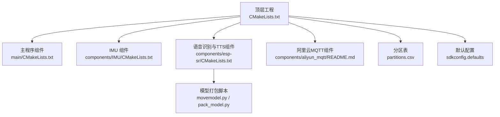
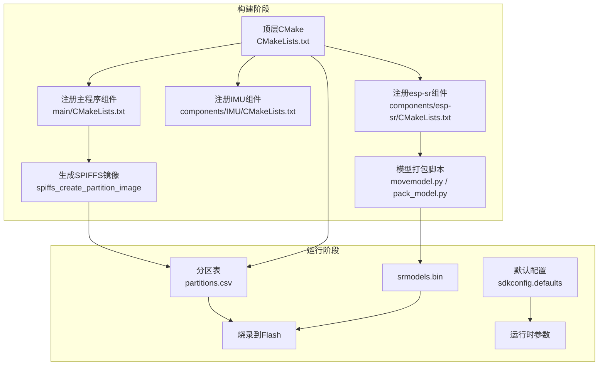
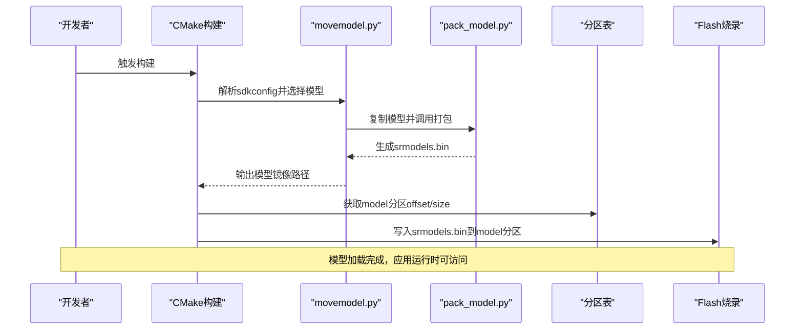
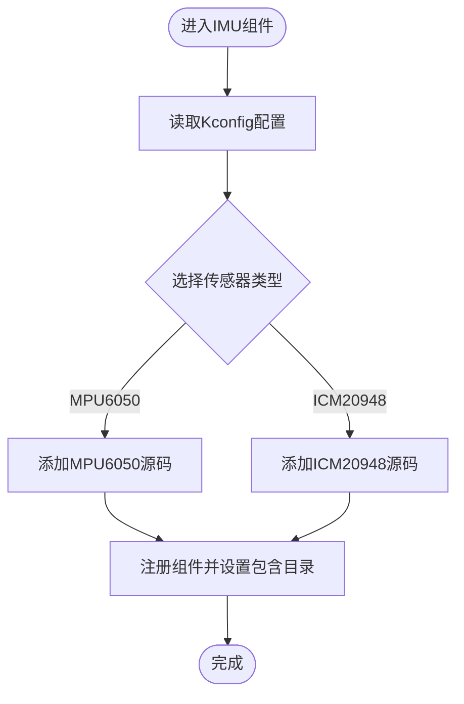
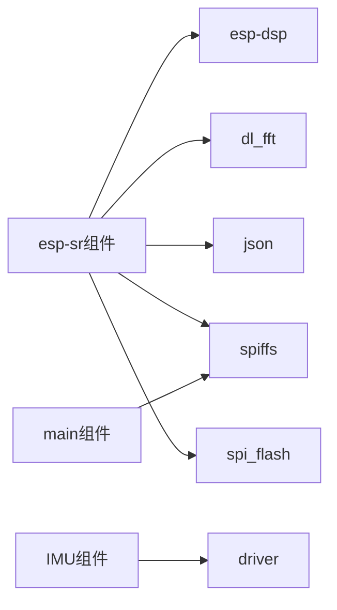

# 开发工具与调试

<cite>
**本文档引用的文件**
- [CMakeLists.txt](file://CMakeLists.txt)
- [sdkconfig.defaults](file://sdkconfig.defaults)
- [sdkconfig.old](file://sdkconfig.old)
- [partitions.csv](file://partitions.csv)
- [main/CMakeLists.txt](file://main/CMakeLists.txt)
- [components/IMU/CMakeLists.txt](file://components/IMU/CMakeLists.txt)
- [components/esp-sr/CMakeLists.txt](file://components/esp-sr/CMakeLists.txt)
- [components/esp-sr/idf_component.yml](file://components/esp-sr/idf_component.yml)
- [components/esp-sr/model/movemodel.py](file://components/esp-sr/model/movemodel.py)
- [components/esp-sr/model/pack_model.py](file://components/esp-sr/model/pack_model.py)
- [components/aliyun_mqtt/README.md](file://components/aliyun_mqtt/README.md)
- [components/esp-sr/esp-tts/README.md](file://components/esp-sr/esp-tts/README.md)
</cite>

## 目录
1. [简介](#简介)
2. [项目结构](#项目结构)
3. [核心组件](#核心组件)
4. [架构总览](#架构总览)
5. [详细组件分析](#详细组件分析)
6. [依赖关系分析](#依赖关系分析)
7. [性能考量](#性能考量)
8. [故障排除指南](#故障排除指南)
9. [结论](#结论)
10. [附录](#附录)

## 简介
本指南面向使用 ESP-IDF 的嵌入式开发者，围绕本项目的开发与调试主题，系统讲解以下内容：
- ESP-IDF 开发环境配置与工具链安装、IDE 设置与项目构建
- 调试工具使用（ESP-IDF GDB/OCDAware、日志系统、性能分析）
- 代码覆盖率、内存使用分析与实时性能监控方法
- 常见问题诊断、调试技巧与故障排除流程
- 提升开发效率的最佳实践与自动化工具使用

本项目基于 ESP32-S3 目标板，采用多组件架构，包含 IMU 驱动、语音识别与合成（esp-sr）、阿里云 MQTT 客户端、音频编解码与 SPIFFS 分区等模块。

## 项目结构
项目采用 ESP-IDF 标准工程布局，顶层通过 CMakeLists 管理，组件位于 components 目录，主程序入口在 main 目录。分区表由 partitions.csv 定义，目标芯片为 ESP32-S3。

图示来源
- [CMakeLists.txt:1-10](file://CMakeLists.txt#L1-L10)
- [main/CMakeLists.txt:1-4](file://main/CMakeLists.txt#L1-L4)
- [components/IMU/CMakeLists.txt:1-28](file://components/IMU/CMakeLists.txt#L1-L28)
- [components/esp-sr/CMakeLists.txt:1-102](file://components/esp-sr/CMakeLists.txt#L1-L102)
- [components/esp-sr/model/movemodel.py:1-154](file://components/esp-sr/model/movemodel.py#L1-L154)
- [components/esp-sr/model/pack_model.py:1-124](file://components/esp-sr/model/pack_model.py#L1-L124)
- [partitions.csv:1-6](file://partitions.csv#L1-L6)
- [sdkconfig.defaults:1-527](file://sdkconfig.defaults#L1-L527)

章节来源
- [CMakeLists.txt:1-10](file://CMakeLists.txt#L1-L10)
- [main/CMakeLists.txt:1-4](file://main/CMakeLists.txt#L1-L4)
- [components/IMU/CMakeLists.txt:1-28](file://components/IMU/CMakeLists.txt#L1-L28)
- [components/esp-sr/CMakeLists.txt:1-102](file://components/esp-sr/CMakeLists.txt#L1-L102)
- [partitions.csv:1-6](file://partitions.csv#L1-L6)
- [sdkconfig.defaults:1-527](file://sdkconfig.defaults#L1-L527)

## 核心组件
- 工程构建与顶层配置
  - 顶层 CMakeLists 使用 ESP-IDF 的 project.cmake 引导，设置 EXTRA_COMPONENT_DIRS 并包含本地 components。
  - 默认启用部分编译选项抑制特定告警，便于在多组件环境下保持构建稳定。
- 主程序组件
  - main/CMakeLists.txt 注册所有 app 子目录作为源码与头文件路径，并通过 SPIFFS 生成 storage 分区镜像。
- IMU 组件
  - 根据 Kconfig 条件编译不同传感器驱动；统一对外接口由 core 与 drivers 目录组织。
- 语音识别与 TTS 组件（esp-sr）
  - 支持多目标芯片；链接预编译库并动态生成 srmodels.bin，写入 model 分区。
  - 提供模型选择与打包脚本，依据 sdkconfig 中的配置自动筛选所需模型。
- 阿里云 MQTT 组件
  - 提供快速接入阿里云物联网平台的组件说明与初始化流程，强调 WiFi 连接前置与回调函数定制。
- 分区与配置
  - partitions.csv 定义 nvs/factory/storage/model 等分区；sdkconfig.defaults 指定目标芯片、SPIRAM、CPU 频率、日志级别等关键参数。

章节来源
- [CMakeLists.txt:1-10](file://CMakeLists.txt#L1-L10)
- [main/CMakeLists.txt:1-4](file://main/CMakeLists.txt#L1-L4)
- [components/IMU/CMakeLists.txt:1-28](file://components/IMU/CMakeLists.txt#L1-L28)
- [components/esp-sr/CMakeLists.txt:1-102](file://components/esp-sr/CMakeLists.txt#L1-L102)
- [components/esp-sr/idf_component.yml:1-13](file://components/esp-sr/idf_component.yml#L1-L13)
- [components/esp-sr/model/movemodel.py:1-154](file://components/esp-sr/model/movemodel.py#L1-L154)
- [components/esp-sr/model/pack_model.py:1-124](file://components/esp-sr/model/pack_model.py#L1-L124)
- [components/aliyun_mqtt/README.md:1-39](file://components/aliyun_mqtt/README.md#L1-L39)
- [partitions.csv:1-6](file://partitions.csv#L1-L6)
- [sdkconfig.defaults:1-527](file://sdkconfig.defaults#L1-L527)

## 架构总览
下图展示从构建到运行的关键路径：顶层 CMake -> 组件注册 -> 分区镜像生成 -> 模型打包 -> 应用启动。

图示来源
- [CMakeLists.txt:1-10](file://CMakeLists.txt#L1-L10)
- [main/CMakeLists.txt:1-4](file://main/CMakeLists.txt#L1-L4)
- [components/IMU/CMakeLists.txt:1-28](file://components/IMU/CMakeLists.txt#L1-L28)
- [components/esp-sr/CMakeLists.txt:77-102](file://components/esp-sr/CMakeLists.txt#L77-L102)
- [components/esp-sr/model/movemodel.py:130-154](file://components/esp-sr/model/movemodel.py#L130-L154)
- [components/esp-sr/model/pack_model.py:41-124](file://components/esp-sr/model/pack_model.py#L41-L124)
- [partitions.csv:1-6](file://partitions.csv#L1-L6)
- [sdkconfig.defaults:74-88](file://sdkconfig.defaults#L74-L88)

## 详细组件分析

### 语音识别与 TTS 组件（esp-sr）
该组件负责唤醒词检测、关键词识别、语音活动检测、噪声抑制以及中文 TTS 合成。其构建脚本会根据 sdkconfig 自动选择模型并打包为 srmodels.bin，随后写入 model 分区。

图示来源
- [components/esp-sr/CMakeLists.txt:77-102](file://components/esp-sr/CMakeLists.txt#L77-L102)
- [components/esp-sr/model/movemodel.py:22-129](file://components/esp-sr/model/movemodel.py#L22-L129)
- [components/esp-sr/model/pack_model.py:41-124](file://components/esp-sr/model/pack_model.py#L41-L124)
- [partitions.csv:4-6](file://partitions.csv#L4-L6)

章节来源
- [components/esp-sr/CMakeLists.txt:1-102](file://components/esp-sr/CMakeLists.txt#L1-L102)
- [components/esp-sr/idf_component.yml:1-13](file://components/esp-sr/idf_component.yml#L1-L13)
- [components/esp-sr/model/movemodel.py:1-154](file://components/esp-sr/model/movemodel.py#L1-L154)
- [components/esp-sr/model/pack_model.py:1-124](file://components/esp-sr/model/pack_model.py#L1-L124)
- [components/esp-sr/esp-tts/README.md:1-3](file://components/esp-sr/esp-tts/README.md#L1-L3)

### IMU 组件
IMU 组件根据 Kconfig 条件编译不同传感器驱动，统一对外接口位于 core 与 drivers 目录，便于上层应用按需切换硬件。

图示来源
- [components/IMU/CMakeLists.txt:5-17](file://components/IMU/CMakeLists.txt#L5-L17)

章节来源
- [components/IMU/CMakeLists.txt:1-28](file://components/IMU/CMakeLists.txt#L1-L28)

### 阿里云 MQTT 组件
该组件提供快速接入阿里云物联网平台的能力，强调 WiFi 连接前置与回调函数定制，便于处理连接状态与消息收发。

章节来源
- [components/aliyun_mqtt/README.md:1-39](file://components/aliyun_mqtt/README.md#L1-L39)

## 依赖关系分析
- 组件间依赖
  - esp-sr 依赖 json、spiffs、spi_flash，并链接多个预编译库（如 multinet、vadnet、nsnet、wakenet、esp_tts_chinese 等）。
  - IMU 组件依赖 driver 基础驱动。
- 外部依赖
  - esp-sr 通过 idf_component.yml 声明对 esp-dsp 与 dl_fft 的版本要求。
- 分区与镜像
  - main 组件通过 SPIFFS 生成 storage 分区镜像；esp-sr 通过自定义命令生成 srmodels.bin 并写入 model 分区。

图示来源
- [components/esp-sr/CMakeLists.txt:15-27](file://components/esp-sr/CMakeLists.txt#L15-L27)
- [components/esp-sr/idf_component.yml:4-7](file://components/esp-sr/idf_component.yml#L4-L7)
- [components/IMU/CMakeLists.txt:25](file://components/IMU/CMakeLists.txt#L25)

章节来源
- [components/esp-sr/CMakeLists.txt:1-102](file://components/esp-sr/CMakeLists.txt#L1-L102)
- [components/esp-sr/idf_component.yml:1-13](file://components/esp-sr/idf_component.yml#L1-L13)
- [components/IMU/CMakeLists.txt:1-28](file://components/IMU/CMakeLists.txt#L1-L28)

## 性能考量
- 构建优化与断言
  - 默认启用性能优化与断言，日志级别为 INFO，时间戳来源为 RTOS。
- 硬件加速与内存
  - 目标芯片为 ESP32-S3，启用 SPIRAM、PSRAM 指令/只读区、240MHz CPU 频率，有利于语音算法与图像处理性能。
- 网络与任务
  - TCP/IP、LWIP 参数与定时器任务栈大小已按项目需求配置，WiFi 任务亲和性与缓冲区参数已设定。
- 语音模型分区
  - 模型打包脚本会计算推荐分区大小，避免因分区过小导致加载失败。

章节来源
- [sdkconfig.defaults:74-88](file://sdkconfig.defaults#L74-L88)
- [sdkconfig.defaults:122-133](file://sdkconfig.defaults#L122-L133)
- [sdkconfig.defaults:497-501](file://sdkconfig.defaults#L497-L501)
- [components/esp-sr/model/movemodel.py:151-154](file://components/esp-sr/model/movemodel.py#L151-L154)

## 故障排除指南
- 构建告警与兼容性
  - 顶层 CMake 对部分变量抑制告警，若出现编译冲突，检查新增组件是否引入未声明的宏或变量。
- 分区与模型加载
  - 若模型无法加载，确认 partitions.csv 中 model 分区存在且大小足够；查看构建输出的推荐分区大小提示。
- 日志级别与定位
  - 当前日志默认级别为 INFO，必要时可在 sdkconfig 中提高日志级别以获取更详细信息。
- 调试与断点
  - 目标芯片启用 OCDAware 调试能力，结合 GDB 使用进行断点与堆栈分析。
- WiFi 与网络
  - 确认 WiFi 任务栈大小与亲和性配置满足应用负载；如出现丢包或延迟，检查 LWIP 缓冲区与队列长度。

章节来源
- [CMakeLists.txt:5-9](file://CMakeLists.txt#L5-L9)
- [partitions.csv:4-6](file://partitions.csv#L4-L6)
- [components/esp-sr/model/movemodel.py:151-154](file://components/esp-sr/model/movemodel.py#L151-L154)
- [sdkconfig.defaults:1545-1557](file://sdkconfig.defaults#L1545-L1557)
- [sdkconfig.defaults:417](file://sdkconfig.defaults#L417)
- [sdkconfig.defaults:440-458](file://sdkconfig.defaults#L440-L458)

## 结论
本项目通过清晰的组件化结构与完善的构建脚本，实现了从模型打包到分区写入的自动化流程。配合 ESP-IDF 的日志、调试与性能配置，能够在 ESP32-S3 上高效运行语音识别与 MQTT 通信等关键功能。建议在开发过程中持续关注日志级别、分区大小与网络参数，以获得稳定可靠的运行表现。

## 附录

### ESP-IDF 开发环境与 IDE 设置
- 工具链与环境
  - 使用 ESP-IDF v5.x，确保 Python 与 CMake 版本满足要求；在项目根目录执行构建与烧录。
- IDE 推荐
  - VS Code + PlatformIO 或 ESP-IDF Extension；或 CLion 通过 CMake 集成。
- 项目导入
  - 打开项目根目录，选择正确的工具链与目标芯片（ESP32-S3）。

### 项目构建与烧录
- 常用命令
  - 构建：idf.py build
  - 烧录：idf.py -p <串口> flash
  - 监控：idf.py -p <串口> monitor
- 分区与镜像
  - storage 分区由 SPIFFS 生成；model 分区由 srmodels.bin 生成并写入。

章节来源
- [main/CMakeLists.txt:1-4](file://main/CMakeLists.txt#L1-L4)
- [components/esp-sr/CMakeLists.txt:77-102](file://components/esp-sr/CMakeLists.txt#L77-L102)

### 调试工具与日志系统
- ESP-IDF 调试器
  - 使用 OCDAware 与 GDB，结合断点与寄存器查看定位问题。
- 日志系统
  - 默认日志级别 INFO，颜色开启，时间戳来源 RTOS；可通过 sdkconfig 调整。
- 性能分析
  - 利用任务栈深度、事件队列长度与网络缓冲参数评估系统负载。

章节来源
- [sdkconfig.defaults:1545-1557](file://sdkconfig.defaults#L1545-L1557)
- [sdkconfig.defaults:417](file://sdkconfig.defaults#L417)
- [sdkconfig.defaults:497-501](file://sdkconfig.defaults#L497-L501)

### 代码覆盖率、内存分析与实时监控
- 代码覆盖率
  - 在构建配置中启用覆盖率收集（如 GCC gcov），在测试阶段生成报告。
- 内存使用分析
  - 关注堆与栈使用情况，结合 sdkconfig 中的堆与栈相关选项进行调优。
- 实时性能监控
  - 通过任务统计、网络收发队列长度与语音处理耗时进行监控。

[本节为通用指导，不直接分析具体文件]

### 常见问题与最佳实践
- 常见问题
  - 分区不足导致模型加载失败；WiFi 参数不当引发连接不稳定；日志级别过低影响定位。
- 最佳实践
  - 将第三方组件放入 components 或 EXTRA_COMPONENT_DIRS；使用 Kconfig 控制条件编译；合理规划分区大小与模型选择。

[本节为通用指导，不直接分析具体文件]