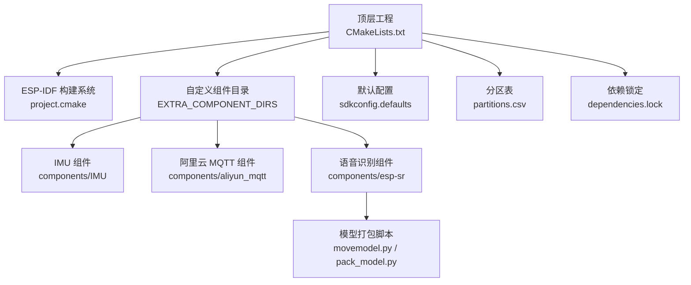
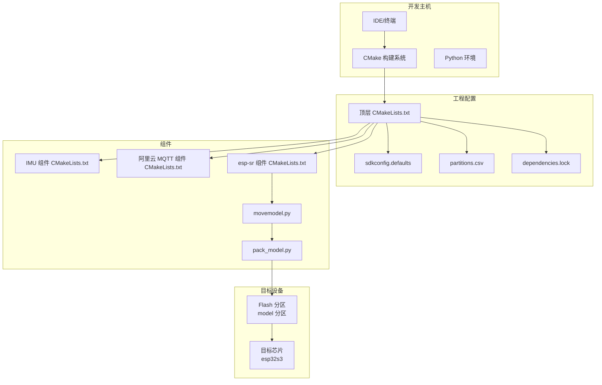
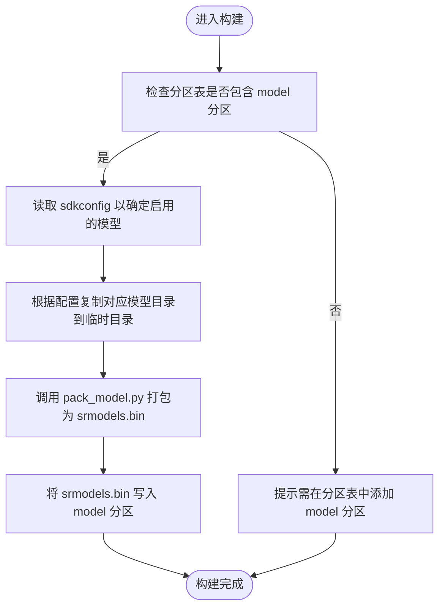
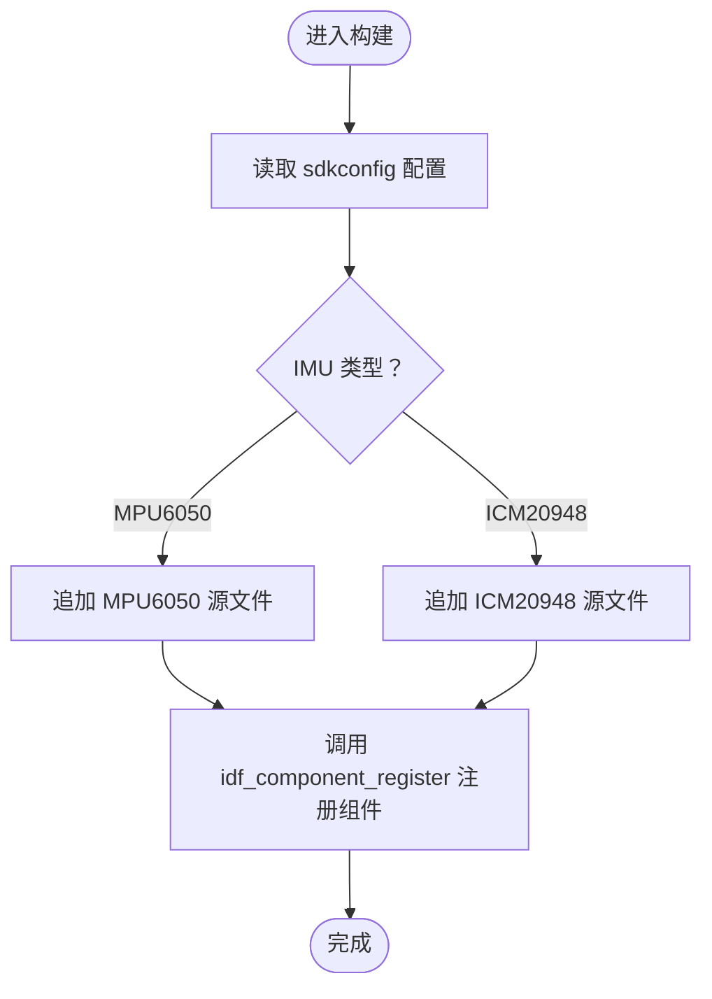
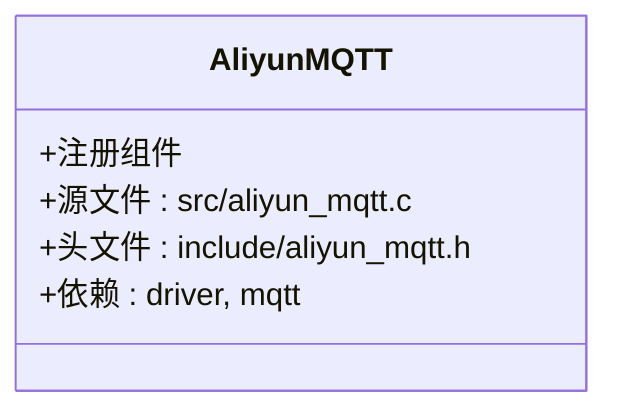
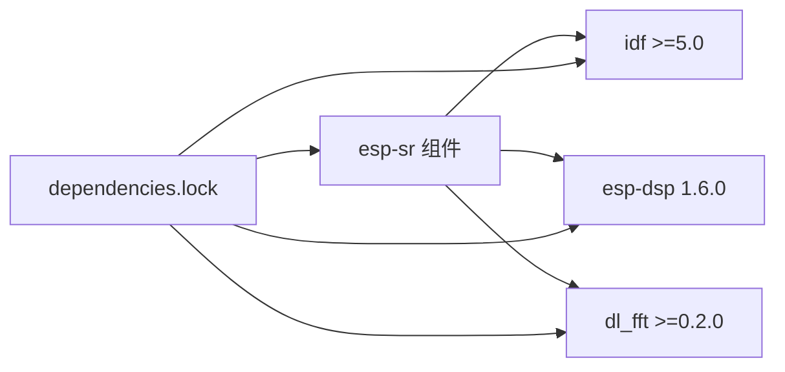

# 开发环境配置

<cite>
**本文档引用的文件**
- [CMakeLists.txt](file://CMakeLists.txt)
- [sdkconfig.defaults](file://sdkconfig.defaults)
- [dependencies.lock](file://dependencies.lock)
- [partitions.csv](file://partitions.csv)
- [components/esp-sr/idf_component.yml](file://components/esp-sr/idf_component.yml)
- [components/esp-sr/CMakeLists.txt](file://components/esp-sr/CMakeLists.txt)
- [components/esp-sr/model/movemodel.py](file://components/esp-sr/model/movemodel.py)
- [components/esp-sr/model/pack_model.py](file://components/esp-sr/model/pack_model.py)
- [components/IMU/CMakeLists.txt](file://components/IMU/CMakeLists.txt)
- [components/aliyun_mqtt/CMakeLists.txt](file://components/aliyun_mqtt/CMakeLists.txt)
</cite>

## 目录
1. [简介](#简介)
2. [项目结构](#项目结构)
3. [核心组件](#核心组件)
4. [架构总览](#架构总览)
5. [详细组件分析](#详细组件分析)
6. [依赖关系分析](#依赖关系分析)
7. [性能考虑](#性能考虑)
8. [故障排查指南](#故障排查指南)
9. [结论](#结论)
10. [附录](#附录)

## 简介
本指南面向首次搭建与维护基于 ESP-IDF 的嵌入式开发环境的工程师与爱好者，围绕以下目标展开：  
- 完整说明 ESP-IDF 工具链安装与环境变量配置（含 Python 环境要求）  
- 面向 VS Code 与 CLion 的 IDE 配置步骤（扩展、调试、导入）  
- CMake 构建系统使用要点（编译选项、组件管理、依赖管理）  
- 不同操作系统下的环境搭建步骤与常见问题解决  
- 结合本仓库实际配置，解释 SDK 配置项、分区表、模型打包流程等关键环节  

为确保可操作性，本指南所有技术细节均以仓库中现有文件为依据进行阐述。

## 项目结构
本项目采用 ESP-IDF 标准工程布局，顶层通过 CMakeLists.txt 引入 ESP-IDF 构建系统，并在 EXTRA_COMPONENT_DIRS 中声明了 components 目录及示例组件目录，使自定义组件与示例组件均可被识别与构建。  
- 顶层构建入口：CMakeLists.txt  
- 默认 SDK 配置：sdkconfig.defaults  
- 组件与子模块：components/ 下包含 IMU、阿里云 MQTT、语音识别（esp-sr）、音频编解码（helix-mp3、opus-1.5.2）、DSP/FFT（esp-dsp、dl_fft）等  
- 分区表：partitions.csv  
- 依赖锁定：dependencies.lock（记录组件来源、版本与目标芯片）

图表来源
- [CMakeLists.txt:1-10](file://CMakeLists.txt#L1-L10)
- [sdkconfig.defaults:1-527](file://sdkconfig.defaults#L1-L527)
- [dependencies.lock:1-33](file://dependencies.lock#L1-L33)
- [partitions.csv:1-6](file://partitions.csv#L1-L6)

章节来源
- [CMakeLists.txt:1-10](file://CMakeLists.txt#L1-L10)
- [sdkconfig.defaults:1-527](file://sdkconfig.defaults#L1-L527)
- [dependencies.lock:1-33](file://dependencies.lock#L1-L33)
- [partitions.csv:1-6](file://partitions.csv#L1-L6)

## 核心组件
- 顶层构建与环境注入：顶层 CMakeLists.txt 调用 ESP-IDF 的 project.cmake，设置 EXTRA_COMPONENT_DIRS 并引入协议示例组件目录，同时添加若干编译告警抑制选项，最后定义工程名。  
- 组件注册与链接：各组件通过各自 CMakeLists.txt 使用 idf_component_register 进行源码、头文件路径与依赖声明；部分组件使用 add_prebuilt_library 链接预编译静态库。  
- 语音识别（esp-sr）：组件内根据目标芯片选择 include 目录与源文件集合，并通过 add_prebuilt_library 链接多套算法库；同时在构建阶段执行模型复制与打包逻辑，生成 srmodels.bin 并写入 model 分区。  
- IMU 组件：根据 sdkconfig 中的 IMU 类型配置，动态选择驱动源文件并注册组件。  
- 阿里云 MQTT 组件：声明对 driver 与 mqtt 的依赖，便于在应用层直接使用。  
- 默认配置与目标芯片：sdkconfig.defaults 指定目标芯片为 esp32s3，并开启多项网络、SPIRAM、LVGL 等功能；同时包含 IMU 相关配置项。  
- 分区表：partitions.csv 定义 nvs、factory、storage、model 等分区，其中 model 分区用于存放语音识别模型二进制镜像。  
- 依赖锁定：dependencies.lock 明确记录了 esp-dsp、dl_fft 以及 ESP-IDF 版本约束与目标芯片，确保组件来源与版本一致。

章节来源
- [CMakeLists.txt:1-10](file://CMakeLists.txt#L1-L10)
- [components/esp-sr/CMakeLists.txt:1-102](file://components/esp-sr/CMakeLists.txt#L1-L102)
- [components/IMU/CMakeLists.txt:1-28](file://components/IMU/CMakeLists.txt#L1-L28)
- [components/aliyun_mqtt/CMakeLists.txt:1-9](file://components/aliyun_mqtt/CMakeLists.txt#L1-L9)
- [sdkconfig.defaults:74-88](file://sdkconfig.defaults#L74-L88)
- [partitions.csv:1-6](file://partitions.csv#L1-L6)
- [dependencies.lock:1-33](file://dependencies.lock#L1-L33)

## 架构总览
下图展示了从构建到运行的关键路径：IDE/命令行触发构建，CMake 解析顶层配置与组件 CMakeLists.txt，按目标芯片与依赖关系生成构建规则，最终生成固件镜像并烧录至设备。

图表来源
- [CMakeLists.txt:1-10](file://CMakeLists.txt#L1-L10)
- [sdkconfig.defaults:1-527](file://sdkconfig.defaults#L1-L527)
- [partitions.csv:1-6](file://partitions.csv#L1-L6)
- [dependencies.lock:1-33](file://dependencies.lock#L1-L33)
- [components/esp-sr/CMakeLists.txt:77-102](file://components/esp-sr/CMakeLists.txt#L77-L102)
- [components/esp-sr/model/movemodel.py:130-154](file://components/esp-sr/model/movemodel.py#L130-L154)
- [components/esp-sr/model/pack_model.py:41-124](file://components/esp-sr/model/pack_model.py#L41-L124)

## 详细组件分析

### 语音识别（esp-sr）组件
该组件负责语音唤醒、关键词识别、噪声抑制、VAD、TTS 等能力，通过预编译库与 Python 脚本完成模型的筛选、复制与打包，并在构建阶段将 srmodels.bin 写入 model 分区。

图表来源
- [components/esp-sr/CMakeLists.txt:77-102](file://components/esp-sr/CMakeLists.txt#L77-L102)
- [components/esp-sr/model/movemodel.py:22-129](file://components/esp-sr/model/movemodel.py#L22-L129)
- [components/esp-sr/model/pack_model.py:41-124](file://components/esp-sr/model/pack_model.py#L41-L124)
- [partitions.csv:1-6](file://partitions.csv#L1-L6)

章节来源
- [components/esp-sr/CMakeLists.txt:1-102](file://components/esp-sr/CMakeLists.txt#L1-L102)
- [components/esp-sr/model/movemodel.py:1-154](file://components/esp-sr/model/movemodel.py#L1-L154)
- [components/esp-sr/model/pack_model.py:1-124](file://components/esp-sr/model/pack_model.py#L1-L124)
- [partitions.csv:1-6](file://partitions.csv#L1-L6)

### IMU 组件
该组件根据 sdkconfig 中的 IMU 类型配置，动态选择 MPU6050 或其他传感器驱动源文件，并注册组件所需头文件路径与基础驱动依赖。

图表来源
- [components/IMU/CMakeLists.txt:5-17](file://components/IMU/CMakeLists.txt#L5-L17)
- [components/IMU/CMakeLists.txt:19-26](file://components/IMU/CMakeLists.txt#L19-L26)

章节来源
- [components/IMU/CMakeLists.txt:1-28](file://components/IMU/CMakeLists.txt#L1-L28)
- [sdkconfig.defaults:526-527](file://sdkconfig.defaults#L526-L527)

### 阿里云 MQTT 组件
该组件声明对 driver 与 mqtt 的依赖，便于上层应用直接使用相关接口。

图表来源
- [components/aliyun_mqtt/CMakeLists.txt:1-9](file://components/aliyun_mqtt/CMakeLists.txt#L1-L9)

章节来源
- [components/aliyun_mqtt/CMakeLists.txt:1-9](file://components/aliyun_mqtt/CMakeLists.txt#L1-L9)

## 依赖关系分析
- 组件来源与版本：dependencies.lock 明确记录了组件来源（registry_url）、类型（service）、版本号与 ESP-IDF 版本约束，目标芯片为 esp32s3。  
- 组件间依赖：components/esp-sr/idf_component.yml 声明了对 idf、esp-dsp、dl_fft 的依赖，且明确版本范围。  
- 构建时依赖解析：CMake 在解析组件时会根据这些约束拉取或校验组件版本，确保构建一致性。

图表来源
- [dependencies.lock:1-33](file://dependencies.lock#L1-L33)
- [components/esp-sr/idf_component.yml:1-13](file://components/esp-sr/idf_component.yml#L1-L13)

章节来源
- [dependencies.lock:1-33](file://dependencies.lock#L1-L33)
- [components/esp-sr/idf_component.yml:1-13](file://components/esp-sr/idf_component.yml#L1-L13)

## 性能考虑
- 目标芯片与频率：sdkconfig.defaults 指定目标为 esp32s3，并启用 SPIRAM、高速 CPU 频率与缓存优化，有助于提升音视频与语音处理性能。  
- 网络与内存：开启 DHCP、增大 HTTPD 请求头长度、启用 SPIRAM 等配置有利于网络服务与大对象处理。  
- 编译告警抑制：顶层 CMakeLists.txt 添加了若干编译告警抑制选项，减少无关噪音，但建议在开发阶段逐步清理告警以提升代码质量。  
- 模型分区大小：movemodel.py 会根据打包后 srmodels.bin 的大小推荐合适的 model 分区容量，避免空间不足导致烧录失败。

章节来源
- [sdkconfig.defaults:74-88](file://sdkconfig.defaults#L74-L88)
- [sdkconfig.defaults:81-87](file://sdkconfig.defaults#L81-L87)
- [sdkconfig.defaults:91-101](file://sdkconfig.defaults#L91-L101)
- [CMakeLists.txt:6-8](file://CMakeLists.txt#L6-L8)
- [components/esp-sr/model/movemodel.py:150-154](file://components/esp-sr/model/movemodel.py#L150-L154)

## 故障排查指南
- 构建失败：若出现“未找到 model 分区”错误，请确认 partitions.csv 中已包含 model 分区条目，否则构建脚本会输出提示并终止。  
- 依赖版本不匹配：当 dependencies.lock 与本地组件版本不一致时，可能导致链接错误。请根据 lock 文件中的版本要求更新组件或调整 ESP-IDF 版本。  
- Python 环境问题：模型打包脚本依赖标准库（如 os、shutil、struct），请确保 Python 环境可用且无路径编码问题。  
- IMU 驱动未生效：若未正确选择 IMU 类型，请检查 sdkconfig 中的 IMU 相关配置项，确保与硬件一致。  
- 分区空间不足：movemodel.py 会在控制台打印推荐的 model 分区大小（单位 KB），请根据输出调整 partitions.csv 中的 Size 字段。

章节来源
- [components/esp-sr/CMakeLists.txt:97-100](file://components/esp-sr/CMakeLists.txt#L97-L100)
- [dependencies.lock:1-33](file://dependencies.lock#L1-L33)
- [components/esp-sr/model/movemodel.py:150-154](file://components/esp-sr/model/movemodel.py#L150-L154)
- [sdkconfig.defaults:526-527](file://sdkconfig.defaults#L526-L527)
- [partitions.csv:1-6](file://partitions.csv#L1-L6)

## 结论
本指南基于仓库现有配置，系统梳理了 ESP-IDF 工程的构建与组件管理方式，重点解释了语音识别模型打包流程、IMU 组件的条件编译机制以及依赖锁定策略。遵循本文档的环境搭建与配置步骤，可有效降低跨平台与跨组件集成带来的不确定性，提升开发效率与稳定性。

## 附录

### A. ESP-IDF 安装与环境变量配置
- 安装 ESP-IDF：参考官方文档安装最新稳定版，并确保 idf.py 可用。  
- 设置 IDF_PATH：将 IDF_PATH 指向 ESP-IDF 安装根目录，以便 CMake 能正确加载 project.cmake 与工具链。  
- Python 环境：确保 Python 3.x 可用，且系统 PATH 包含 Python 与 pip。  
- 交叉编译工具链：ESP-IDF 自带工具链，无需额外安装；如需自定义，请遵循官方工具链安装指南。

### B. VS Code 配置步骤
- 插件安装：安装“ESP-IDF”扩展，启用 CMake/IDF 集成。  
- 工程导入：打开工程根目录，等待扩展自动检测并配置 CMake 与环境。  
- 调试配置：在扩展中选择目标板与串口，配置监控端口与波特率。  
- 构建/烧录：使用任务面板执行 build/flash/monitor，或通过快捷键触发。

### C. CLion 配置步骤
- 导入工程：File → Open → 选择工程根目录，CLion 将自动识别 CMakeLists.txt。  
- 工具链配置：在 Settings → Build, Execution, Deployment → Toolchains 中配置 ESP-IDF 工具链。  
- CMake 配置：在 Settings → Build, Execution, Deployment → CMake，选择 ESP-IDF Kit，设置 CMAKE_TOOLCHAIN_FILE 与环境变量。  
- 调试配置：在 Run/Debug Configurations 中新增 GDB 直连或 OpenOCD 配置，选择正确的串口与目标芯片。  
- 构建/烧录：通过菜单 Build → Build Project，再使用自定义运行配置执行 flash/monitor。

### D. CMake 构建系统使用要点
- 编译选项：顶层 CMakeLists.txt 添加了若干编译告警抑制选项，可根据需要增删。  
- 组件管理：通过 EXTRA_COMPONENT_DIRS 指定自定义组件目录，组件内部使用 idf_component_register 声明源文件与依赖。  
- 预编译库：esp-sr 组件使用 add_prebuilt_library 链接预编译静态库，确保算法库与目标芯片匹配。  
- 依赖管理：使用 dependencies.lock 锁定组件版本与来源，避免因版本漂移导致的构建失败。

### E. 不同操作系统下的环境搭建步骤
- Windows：使用 ESP-IDF 提供的 PowerShell/MSYS2 环境，安装 Python 与 Git，配置 IDF_PATH 与 PATH。  
- macOS：使用 Homebrew 安装 Python 与必要工具，配置 IDF_PATH 与 PATH，使用 Xcode Command Line Tools。  
- Linux：安装 Python 3、pip、git、ncurses 等依赖，配置 IDF_PATH 与 PATH，授予串口访问权限。

### F. 常见问题与解决方案
- “找不到 model 分区”：在 partitions.csv 中添加 model 分区条目，并确保大小足够。  
- 依赖版本冲突：根据 dependencies.lock 更新组件或调整 ESP-IDF 版本。  
- Python 报错：检查 Python 版本与路径，确保 pack_model.py 与 movemodel.py 可执行。  
- IMU 无法识别：核对 sdkconfig 中的 IMU 类型配置，确保与硬件一致。  
- 烧录失败：检查串口权限与驱动，确认波特率与分区大小设置正确。