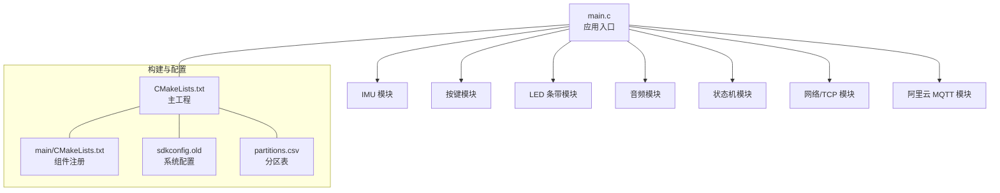
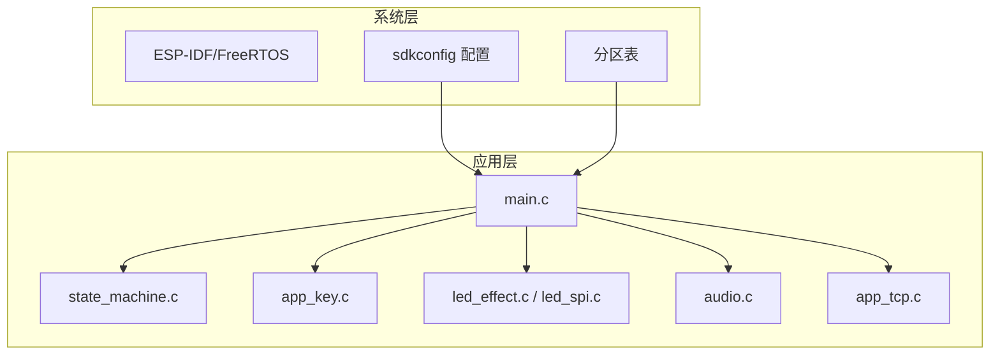
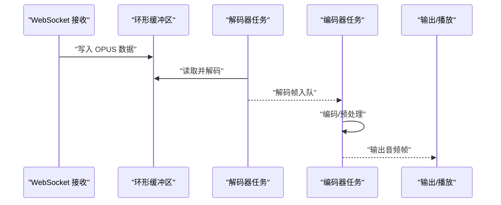
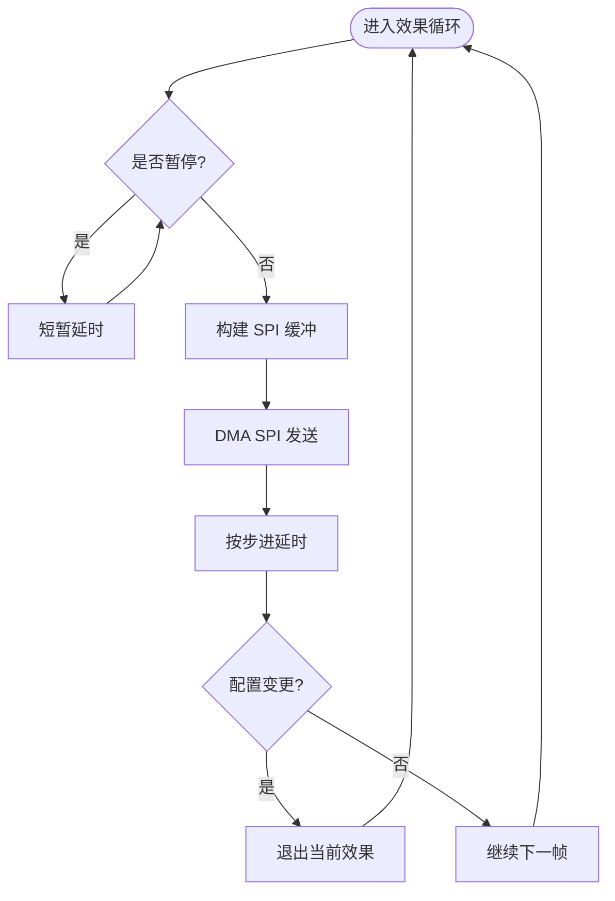
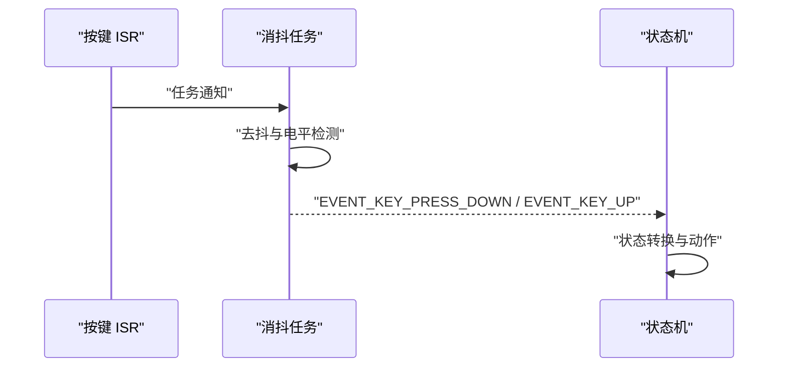
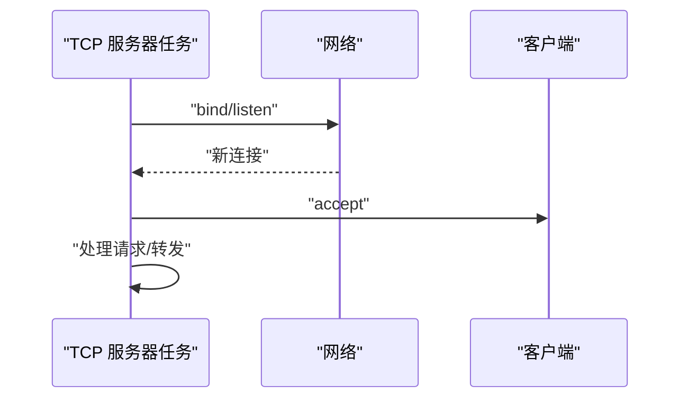
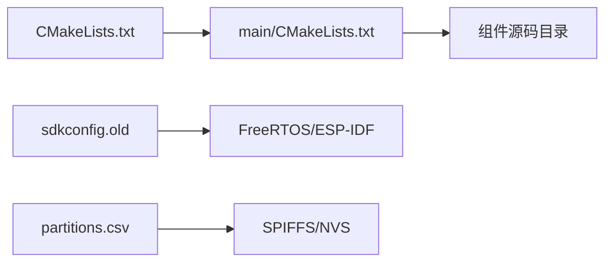

# 性能分析与优化

<cite>
**本文引用的文件**
- [main.c](file://main/main.c)
- [CMakeLists.txt](file://main/CMakeLists.txt)
- [CMakeLists.txt](file://CMakeLists.txt)
- [sdkconfig.old](file://sdkconfig.old)
- [partitions.csv](file://partitions.csv)
- [audio.c](file://main/app/audio/audio.c)
- [audio.h](file://main/app/audio/audio.h)
- [audio_private.h](file://main/app/audio/audio_private.h)
- [led_effect.c](file://main/app/led_strip/led_effect.c)
- [led_effect.h](file://main/app/led_strip/led_effect.h)
- [led_spi.c](file://main/app/led_strip/led_spi.c)
- [app_key.c](file://main/app/key/app_key.c)
- [state_machine.c](file://main/app/state_machine/state_machine.c)
- [app_tcp.c](file://main/app/tcp/app_tcp.c)
</cite>

## 目录
1. [引言](#引言)
2. [项目结构](#项目结构)
3. [核心组件](#核心组件)
4. [架构总览](#架构总览)
5. [详细组件分析](#详细组件分析)
6. [依赖关系分析](#依赖关系分析)
7. [性能考量](#性能考量)
8. [故障排查指南](#故障排查指南)
9. [结论](#结论)
10. [附录](#附录)

## 引言
本指南聚焦于 ESP32 平台在本项目中的性能分析与优化实践，覆盖以下方面：
- 使用 ESP-IDF 工具链进行内存使用分析、CPU 占用率监控与任务调度分析
- 音频处理性能优化：缓冲区管理、编解码参数调优与实时性保障
- LED 效果渲染性能优化：帧率控制与功耗优化
- 系统级优化策略：任务优先级设计、内存池管理与中断处理优化

目标是帮助开发者在资源受限的嵌入式平台上获得稳定、低延迟、低抖动的用户体验。

## 项目结构
项目采用 ESP-IDF 组件化组织方式，主程序入口位于 main 目录，功能模块分布在 app 子目录下，并通过 CMakeLists.txt 进行构建集成。系统默认启用 PSRAM、定时器与看门狗等特性以提升实时性与稳定性。

图表来源
- [main.c:33-59](file://main/main.c#L33-L59)
- [CMakeLists.txt:1-10](file://CMakeLists.txt#L1-L10)
- [main/CMakeLists.txt:1-4](file://main/CMakeLists.txt#L1-L4)
- [sdkconfig.old:1147-1196](file://sdkconfig.old#L1147-L1196)
- [partitions.csv:1-6](file://partitions.csv#L1-L6)

章节来源
- [main.c:33-59](file://main/main.c#L33-L59)
- [CMakeLists.txt:1-10](file://CMakeLists.txt#L1-L10)
- [main/CMakeLists.txt:1-4](file://main/CMakeLists.txt#L1-L4)
- [sdkconfig.old:1147-1196](file://sdkconfig.old#L1147-L1196)
- [partitions.csv:1-6](file://partitions.csv#L1-L6)

## 核心组件
- 应用入口与系统初始化：负责 NVS、网络、事件循环、GPIO ISR 服务安装以及各子系统的启动与周期性日志输出。
- 音频子系统：包含 WebSocket 接收缓冲、环形缓冲区、编解码器注册与任务调度、队列与互斥量同步。
- LED 子系统：基于 SPI 的 LED 控制、像素缓冲与 DMA 内存分配、效果渲染任务与帧率控制。
- 键盘输入与状态机：按键中断 + 任务消抖，驱动状态机在录音/空闲状态间切换。
- 网络与 TCP：TCP 服务器监听、客户端连接与数据接收处理。
- 系统配置：PSRAM、定时器、看门狗、堆栈大小与优先级等。

章节来源
- [main.c:33-59](file://main/main.c#L33-L59)
- [audio.c:35-391](file://main/app/audio/audio.c#L35-L391)
- [led_effect.c:124-441](file://main/app/led_strip/led_effect.c#L124-L441)
- [led_spi.c:36-92](file://main/app/led_strip/led_spi.c#L36-L92)
- [app_key.c:22-104](file://main/app/key/app_key.c#L22-L104)
- [state_machine.c:24-115](file://main/app/state_machine/state_machine.c#L24-L115)
- [app_tcp.c:289-314](file://main/app/tcp/app_tcp.c#L289-L314)

## 架构总览
系统采用“主任务 + 多功能子任务”的协作模型，关键路径包括：
- 主任务周期性打印内部/PSRAM 堆剩余，用于粗粒度内存健康检查
- 音频子系统通过多任务与队列实现解码/编码流水线
- LED 子系统通过专用任务与 DMA SPI 实现高帧率渲染
- 键盘中断快速唤醒消抖任务，状态机保证事件有序处理
- 网络层提供 TCP 服务，配合 WebSocket 与 MQTT 提供远端交互

图表来源
- [main.c:33-59](file://main/main.c#L33-L59)
- [state_machine.c:24-115](file://main/app/state_machine/state_machine.c#L24-L115)
- [app_key.c:22-104](file://main/app/key/app_key.c#L22-L104)
- [led_effect.c:124-441](file://main/app/led_strip/led_effect.c#L124-L441)
- [led_spi.c:36-92](file://main/app/led_strip/led_spi.c#L36-L92)
- [audio.c:35-391](file://main/app/audio/audio.c#L35-L391)
- [app_tcp.c:289-314](file://main/app/tcp/app_tcp.c#L289-L314)
- [sdkconfig.old:1147-1196](file://sdkconfig.old#L1147-L1196)
- [partitions.csv:1-6](file://partitions.csv#L1-L6)

## 详细组件分析

### 音频处理性能优化
音频模块通过环形缓冲区与多任务流水线实现解码/编码，关键优化点：
- 内存布局与对齐：使用 SPIRAM 分配解码器上下文，减少 DRAM 压力；环形缓冲区按字节写入/移动，降低碎片化风险
- 互斥与队列：使用二值信号量保护环形缓冲区，使用队列传递编码/解码任务，避免阻塞
- 实时性保障：独立任务与固定优先级，避免与高负载任务争抢 CPU；解码/编码接口抽象便于替换与参数调优

图表来源
- [audio.c:35-391](file://main/app/audio/audio.c#L35-L391)
- [audio.h:8-22](file://main/app/audio/audio.h#L8-L22)
- [audio_private.h:114-125](file://main/app/audio/audio_private.h#L114-L125)

章节来源
- [audio.c:35-391](file://main/app/audio/audio.c#L35-L391)
- [audio.h:8-22](file://main/app/audio/audio.h#L8-L22)
- [audio_private.h:114-125](file://main/app/audio/audio_private.h#L114-L125)

### LED 效果渲染性能优化
LED 子系统通过 DMA SPI 与像素缓冲实现高帧率渲染，优化要点：
- 内存分配：使用 DMA/INTERNAL 能力分配颜色与 SPI 缓冲，确保 DMA 可用与缓存一致性
- 帧率控制：效果循环内使用 vTaskDelay 控制步进时间，避免忙等；支持暂停与配置变更即时生效
- 功耗优化：根据需求调整亮度与刷新频率；在不必要时进入暂停状态

图表来源
- [led_effect.c:124-441](file://main/app/led_strip/led_effect.c#L124-L441)
- [led_spi.c:36-92](file://main/app/led_strip/led_spi.c#L36-L92)

章节来源
- [led_effect.c:124-441](file://main/app/led_strip/led_effect.c#L124-L441)
- [led_spi.c:36-92](file://main/app/led_strip/led_spi.c#L36-L92)

### 键盘输入与状态机
按键通过 ISR 快速唤醒消抖任务，状态机串行处理事件，确保低抖动与可预测响应：
- ISR 仅做通知，避免在中断中执行耗时操作
- 消抖任务在任务上下文中完成电平采样与事件上报
- 状态机队列化处理，避免竞态与丢失事件

图表来源
- [app_key.c:22-104](file://main/app/key/app_key.c#L22-L104)
- [state_machine.c:24-115](file://main/app/state_machine/state_machine.c#L24-L115)

章节来源
- [app_key.c:22-104](file://main/app/key/app_key.c#L22-L104)
- [state_machine.c:24-115](file://main/app/state_machine/state_machine.c#L24-L115)

### TCP 服务与网络处理
TCP 服务器单任务监听与接受连接，简化并发模型，降低上下文切换开销：
- 单任务 + 单客户端连接模型，避免复杂锁竞争
- 接受连接后直接处理，便于后续扩展为多路复用

图表来源
- [app_tcp.c:289-314](file://main/app/tcp/app_tcp.c#L289-L314)

章节来源
- [app_tcp.c:289-314](file://main/app/tcp/app_tcp.c#L289-L314)

## 依赖关系分析
- 构建与组件注册：主工程 CMakeLists 指定 EXTRA_COMPONENT_DIRS 并包含 components；main/CMakeLists 将 app 下各模块纳入构建
- 系统配置：sdkconfig.old 展示了 PSRAM、定时器、看门狗、堆栈大小与优先级等关键配置项
- 分区表：partitions.csv 定义了 NVS、factory、SPIFFS 等分区，影响存储与模型加载

图表来源
- [main/CMakeLists.txt:1-4](file://main/CMakeLists.txt#L1-L4)
- [CMakeLists.txt:1-10](file://CMakeLists.txt#L1-L10)
- [sdkconfig.old:1147-1196](file://sdkconfig.old#L1147-L1196)
- [partitions.csv:1-6](file://partitions.csv#L1-L6)

章节来源
- [main/CMakeLists.txt:1-4](file://main/CMakeLists.txt#L1-L4)
- [CMakeLists.txt:1-10](file://CMakeLists.txt#L1-L10)
- [sdkconfig.old:1147-1196](file://sdkconfig.old#L1147-L1196)
- [partitions.csv:1-6](file://partitions.csv#L1-L6)

## 性能考量

### 内存使用分析
- 周期性日志：主任务每 5 秒打印内部/PSRAM 堆剩余，可用于粗粒度内存健康检查
- 分配策略：LED 驱动使用 DMA/INTERNAL 能力分配缓冲，音频模块使用 SPIRAM 分配解码器上下文
- PSRAM 配置：sdkconfig 启用 Octal PSRAM、允许栈外部内存、指令/只读数据驻留 PSRAM，有助于降低 DRAM 压力

建议
- 在关键路径前后增加内存统计点，结合日志定位泄漏与峰值
- 对热点缓冲区使用统一内存池，减少碎片化
- 评估 PSRAM 访问延迟与带宽，避免在高频路径频繁跨域访问

章节来源
- [main.c:53-59](file://main/main.c#L53-L59)
- [led_spi.c:36-45](file://main/app/led_strip/led_spi.c#L36-L45)
- [audio.c:359-379](file://main/app/audio/audio.c#L359-L379)
- [sdkconfig.old:1147-1196](file://sdkconfig.old#L1147-L1196)

### CPU 占用率监控
- FreeRTOS 配置：CONFIG_FREERTOS_HZ=1000，启用栈溢出哨兵，有利于更精细的时间片观测
- 看门狗：启用 INT WDT 与 TASK WDT，防止死锁与长时间阻塞导致系统假死
- 任务优先级：按键消抖任务优先级较高，确保交互响应；LED 任务优先级适中，避免抢占关键路径

建议
- 使用轻量级采样工具（如周期性记录空闲任务剩余栈）评估 CPU 利用率
- 关注高优先级任务的执行时间分布，避免尖峰
- 结合硬件定时器测量关键段耗时，定位瓶颈

章节来源
- [sdkconfig.old:1448-1481](file://sdkconfig.old#L1448-L1481)
- [sdkconfig.old:1271-1283](file://sdkconfig.old#L1271-L1283)
- [app_key.c:84-85](file://main/app/key/app_key.c#L84-L85)
- [led_effect.c:436-441](file://main/app/led_strip/led_effect.c#L436-L441)

### 任务调度分析
- 事件队列：状态机使用队列接收事件，避免任务间直接耦合
- 任务亲和性：部分任务亲和到 CPU0，减少跨核迁移成本
- 定时器任务：独立的定时器服务任务，避免用户任务干扰系统时钟

建议
- 为关键路径任务设置 CPU 亲和性，减少上下文切换
- 将 IO 密集型任务与计算密集型任务分离，避免相互影响
- 使用队列长度与任务栈深度约束，防止饥饿与溢出

章节来源
- [state_machine.c:24-42](file://main/app/state_machine/state_machine.c#L24-L42)
- [sdkconfig.old:1311-1324](file://sdkconfig.old#L1311-L1324)
- [sdkconfig.old:1468-1471](file://sdkconfig.old#L1468-L1471)

### 音频处理优化
- 缓冲区管理：环形缓冲区按字节写入/移动，注意边界与原子性；使用互斥量保护
- 编解码参数：通过抽象接口注入编解码器，便于选择合适参数（码率、采样率、通道数）
- 实时性：解码/编码任务独立，避免阻塞；WebSocket 数据接收与解码解耦

建议
- 为环形缓冲区预留安全阈值，避免生产者/消费者同时推进导致覆盖
- 编解码参数与采样率匹配硬件能力，避免过高的 CPU 占用
- 在解码前加入丢帧策略，保证实时播放

章节来源
- [audio.c:35-391](file://main/app/audio/audio.c#L35-L391)
- [audio_private.h:114-125](file://main/app/audio/audio_private.h#L114-L125)

### LED 效果渲染优化
- 帧率控制：通过 vTaskDelay 控制步进，避免忙等；支持暂停与配置变更
- 功耗优化：根据场景动态降低刷新频率与亮度；在非活动状态下暂停渲染
- DMA 传输：一次性构建 SPI 缓冲并通过 DMA 发送，减少 CPU 占用

建议
- 将亮度映射到 PWM 或硬件调光，降低功耗
- 对高频效果采用分帧渲染，避免连续高负载
- 使用固定帧率而非自适应帧率，便于预测与测试

章节来源
- [led_effect.c:124-441](file://main/app/led_strip/led_effect.c#L124-L441)
- [led_spi.c:36-92](file://main/app/led_strip/led_spi.c#L36-L92)

### 系统级优化策略
- 任务优先级设计：按键消抖高优先级，LED 中等优先级，其他后台任务低优先级
- 内存池管理：热点对象（音频帧、LED 帧）使用静态池或内存池，减少碎片
- 中断处理优化：ISR 仅做通知，耗时逻辑放入任务；按键去抖在任务中完成

建议
- 为关键路径任务设置 CPU 亲和性与栈上限
- 使用队列与信号量替代共享变量，避免竞态
- 对高频中断进行限流或合并处理

章节来源
- [app_key.c:22-104](file://main/app/key/app_key.c#L22-L104)
- [led_effect.c:436-441](file://main/app/led_strip/led_effect.c#L436-L441)
- [sdkconfig.old:1455-1461](file://sdkconfig.old#L1455-L1461)

## 故障排查指南
- 内存不足：关注主任务周期性日志中的堆剩余变化；检查 LED 与音频缓冲分配是否成功
- 音频卡顿：检查环形缓冲区写入/读取是否越界；确认编解码参数与硬件能力匹配
- LED 不亮或闪烁异常：确认 DMA 缓冲分配与 SPI 初始化；检查 vTaskDelay 是否被频繁打断
- 键盘无响应：检查 ISR 是否正确安装与去抖延时是否合理；确认状态机事件队列未阻塞
- 网络连接失败：查看 TCP 服务器 bind/listen 返回值；确认分区表与网络初始化顺序

章节来源
- [main.c:53-59](file://main/main.c#L53-L59)
- [led_spi.c:36-45](file://main/app/led_strip/led_spi.c#L36-L45)
- [audio.c:35-391](file://main/app/audio/audio.c#L35-L391)
- [app_key.c:84-104](file://main/app/key/app_key.c#L84-L104)
- [app_tcp.c:289-314](file://main/app/tcp/app_tcp.c#L289-L314)

## 结论
本项目在 ESP32 上实现了较为完善的音频、LED、按键与网络功能。通过合理的任务划分、内存分配策略与系统配置，能够在有限资源下实现较好的实时性与稳定性。建议在现有基础上进一步完善性能监控与参数化调优，持续迭代以满足更苛刻的用户体验要求。

## 附录
- 构建与调试：使用 ESP-IDF 工具链进行编译与烧录，结合日志与看门狗进行运行时诊断
- 配置参考：sdkconfig.old 展示了关键系统选项，可根据平台特性进行微调