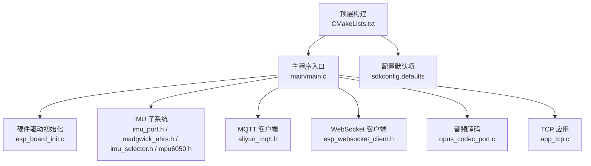
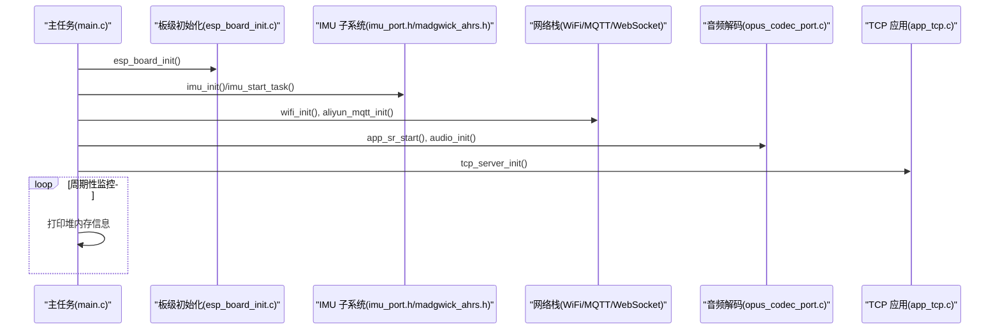
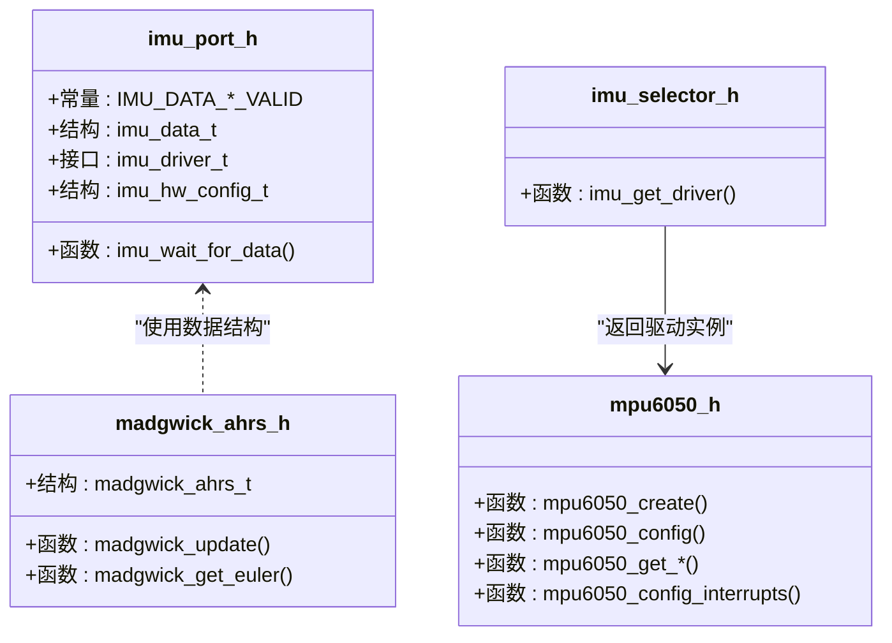
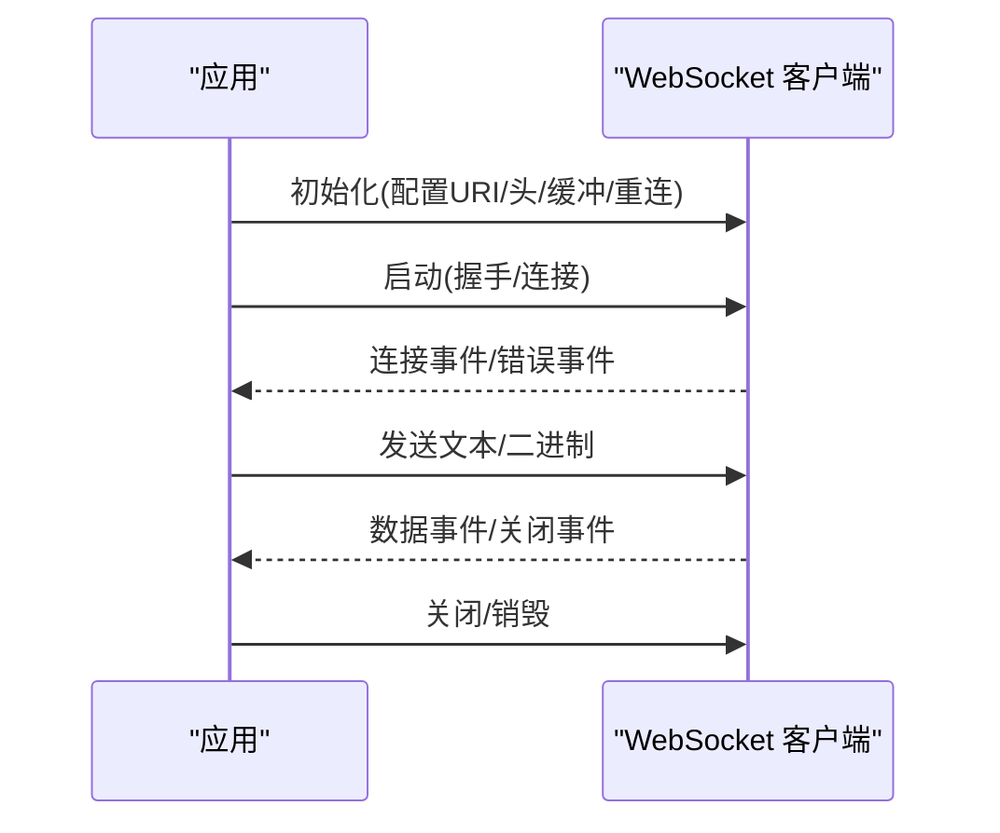
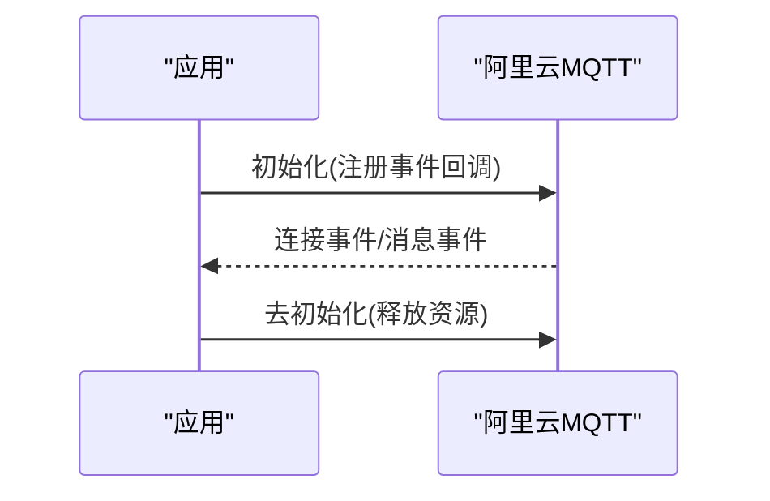
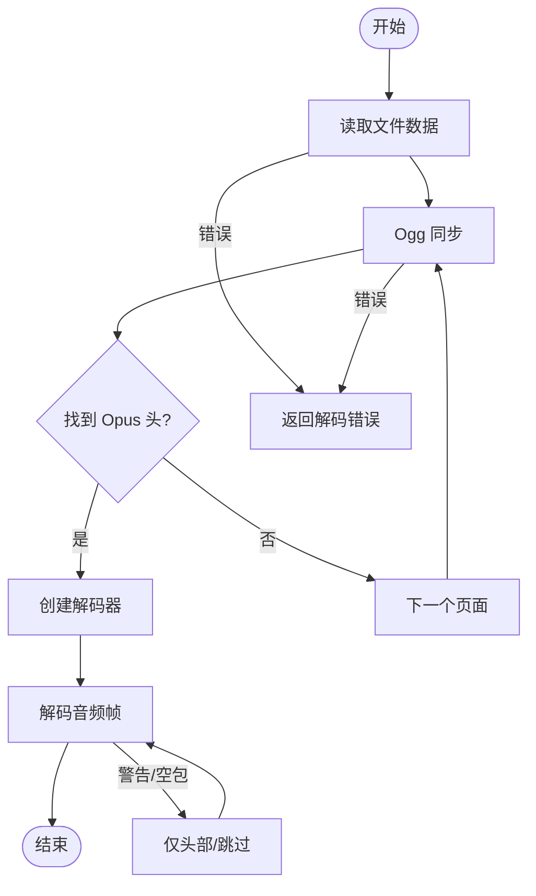
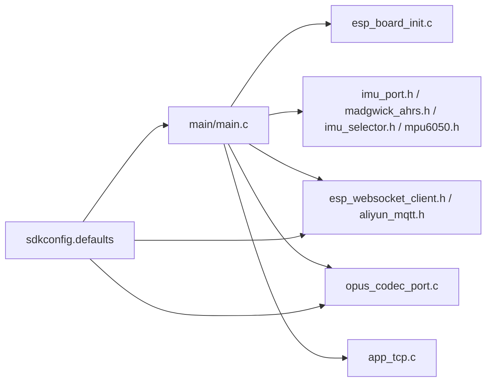
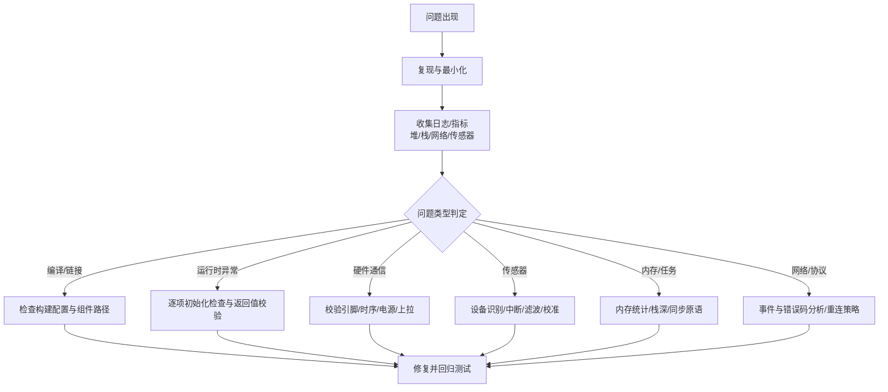

# 故障排除指南

<cite>
**本文引用的文件**
- [CMakeLists.txt](file://CMakeLists.txt)
- [sdkconfig.defaults](file://sdkconfig.defaults)
- [main.c](file://main/main.c)
- [esp_board_init.c](file://components/hardware_driver/esp_board_init.c)
- [imu_port.h](file://components/IMU/core/imu_port.h)
- [madgwick_ahrs.h](file://components/IMU/core/madgwick_ahrs.h)
- [imu_selector.h](file://components/IMU/imu_selector.h)
- [mpu6050.h](file://components/IMU/drivers/mpu6050/mpu6050.h)
- [esp_websocket_client.h](file://components/esp_websocket_client/esp_websocket_client.h)
- [aliyun_mqtt.h](file://components/aliyun_mqtt/include/aliyun_mqtt.h)
- [esp_sr_debug.c](file://components/esp-sr/src/esp_sr_debug.c)
- [app_tcp.c](file://main/app/tcp/app_tcp.c)
- [opus_codec_port.c](file://main/app/audio/opus_codec_port.c)
</cite>

## 目录
1. [简介](#简介)
2. [项目结构](#项目结构)
3. [核心组件](#核心组件)
4. [架构总览](#架构总览)
5. [详细组件分析](#详细组件分析)
6. [依赖关系分析](#依赖关系分析)
7. [性能考虑](#性能考虑)
8. [故障排除指南](#故障排除指南)
9. [结论](#结论)
10. [附录](#附录)

## 简介
本指南面向使用 ESP-IDF 的嵌入式开发者，聚焦于本项目在实际开发与部署中常见的问题类型：编译错误、链接错误、运行时异常；硬件相关问题（电源、通信、传感器）；以及软件层面问题（内存溢出、任务阻塞、资源竞争）。文档提供系统化的诊断流程与问题分类体系，并结合仓库现有组件给出可操作的定位与修复建议。

## 项目结构
项目采用 ESP-IDF 标准工程布局，包含顶层构建配置、组件模块化封装、主程序入口与应用层功能模块。关键路径如下：
- 顶层构建与编译选项：CMakeLists.txt、sdkconfig.defaults
- 主程序入口与系统初始化：main/main.c
- 硬件抽象与板级初始化：components/hardware_driver/esp_board_init.c
- IMU 模块（驱动选择、数据接口、滤波算法）：components/IMU/*
- 通信与协议：components/esp_websocket_client、components/aliyun_mqtt
- 音频处理：main/app/audio（含 Opus 解码）
- TCP 应用：main/app/tcp

**图表来源**
- [CMakeLists.txt:1-10](file://CMakeLists.txt#L1-L10)
- [sdkconfig.defaults:1-527](file://sdkconfig.defaults#L1-L527)
- [main.c:33-60](file://main/main.c#L33-L60)
- [esp_board_init.c:30-35](file://components/hardware_driver/esp_board_init.c#L30-L35)
- [imu_port.h:14-52](file://components/IMU/core/imu_port.h#L14-L52)
- [madgwick_ahrs.h:6-15](file://components/IMU/core/madgwick_ahrs.h#L6-L15)
- [imu_selector.h:6-14](file://components/IMU/imu_selector.h#L6-L14)
- [mpu6050.h:102-128](file://components/IMU/drivers/mpu6050/mpu6050.h#L102-L128)
- [aliyun_mqtt.h:8-26](file://components/aliyun_mqtt/include/aliyun_mqtt.h#L8-L26)
- [esp_websocket_client.h:24-42](file://components/esp_websocket_client/esp_websocket_client.h#L24-L42)
- [opus_codec_port.c:100-225](file://main/app/audio/opus_codec_port.c#L100-L225)
- [app_tcp.c:88-105](file://main/app/tcp/app_tcp.c#L88-L105)

**章节来源**
- [CMakeLists.txt:1-10](file://CMakeLists.txt#L1-L10)
- [sdkconfig.defaults:1-527](file://sdkconfig.defaults#L1-L527)
- [main.c:33-60](file://main/main.c#L33-L60)

## 核心组件
- 构建与配置
  - 顶层 CMake 列表定义了额外组件目录与编译选项，确保第三方组件正确集成。
  - sdkconfig.defaults 提供目标芯片、分区表、网络、存储、蓝牙、日志等大量默认配置，直接影响运行期行为。
- 系统初始化与主循环
  - main/main.c 负责 NVS、网络栈、事件循环、GPIO ISR、板级初始化、IMU、按键、LED、状态机、WiFi、MQTT、语音识别、角度管理、音频、TCP 服务等模块的串接与周期性日志输出。
- 硬件驱动抽象
  - esp_board_init.c 封装 SPIFFS 挂载/卸载、I2S 读写与板级初始化，便于上层统一调用。
- IMU 子系统
  - imu_port.h 定义统一传感器数据结构与驱动接口；madgwick_ahrs.h 提供姿态解算接口；imu_selector.h 实现驱动选择；mpu6050.h 提供具体设备驱动 API。
- 通信与协议
  - esp_websocket_client.h 定义事件类型、错误码与客户端生命周期 API；aliyun_mqtt.h 提供阿里云 MQTT 初始化/反初始化接口。
- 音频处理
  - opus_codec_port.c 展示了基于 Ogg/Opus 的解码流程与错误处理模式，是排查音频异常的重要参考。
- TCP 应用
  - app_tcp.c 提供原始数据接收与十六进制/ASCII 打印工具，便于网络层问题定位。

**章节来源**
- [CMakeLists.txt:5-9](file://CMakeLists.txt#L5-L9)
- [sdkconfig.defaults:74-138](file://sdkconfig.defaults#L74-L138)
- [main.c:33-60](file://main/main.c#L33-L60)
- [esp_board_init.c:10-35](file://components/hardware_driver/esp_board_init.c#L10-L35)
- [imu_port.h:14-52](file://components/IMU/core/imu_port.h#L14-L52)
- [madgwick_ahrs.h:6-15](file://components/IMU/core/madgwick_ahrs.h#L6-L15)
- [imu_selector.h:6-14](file://components/IMU/imu_selector.h#L6-L14)
- [mpu6050.h:102-128](file://components/IMU/drivers/mpu6050/mpu6050.h#L102-L128)
- [esp_websocket_client.h:24-42](file://components/esp_websocket_client/esp_websocket_client.h#L24-L42)
- [aliyun_mqtt.h:8-26](file://components/aliyun_mqtt/include/aliyun_mqtt.h#L8-L26)
- [opus_codec_port.c:100-225](file://main/app/audio/opus_codec_port.c#L100-L225)
- [app_tcp.c:88-105](file://main/app/tcp/app_tcp.c#L88-L105)

## 架构总览
系统以 FreeRTOS 为基础，通过主任务顺序初始化各子系统，形成“硬件抽象 → 传感器 → 协议栈 → 应用”的层次化结构。关键交互如下：

**图表来源**
- [main.c:33-60](file://main/main.c#L33-L60)
- [esp_board_init.c:30-35](file://components/hardware_driver/esp_board_init.c#L30-L35)
- [imu_port.h:14-52](file://components/IMU/core/imu_port.h#L14-L52)
- [madgwick_ahrs.h:6-15](file://components/IMU/core/madgwick_ahrs.h#L6-L15)
- [aliyun_mqtt.h:8-26](file://components/aliyun_mqtt/include/aliyun_mqtt.h#L8-L26)
- [esp_websocket_client.h:24-42](file://components/esp_websocket_client/esp_websocket_client.h#L24-L42)
- [opus_codec_port.c:100-225](file://main/app/audio/opus_codec_port.c#L100-L225)
- [app_tcp.c:88-105](file://main/app/tcp/app_tcp.c#L88-L105)

## 详细组件分析

### IMU 子系统
- 接口与数据模型
  - 统一数据结构包含加速度、角速度、磁力计与有效性标志位；驱动接口抽象了 init/read/deinit。
- 算法与上下文
  - Madgwick AHRS 提供四元数更新与欧拉角导出；驱动上下文包含设备句柄、数据就绪信号量与采样率。
- 选择机制
  - 通过 Kconfig 与 CMake 决定编译的具体驱动实现，运行时通过选择器返回驱动实例。

**图表来源**
- [imu_port.h:14-52](file://components/IMU/core/imu_port.h#L14-L52)
- [madgwick_ahrs.h:6-15](file://components/IMU/core/madgwick_ahrs.h#L6-L15)
- [imu_selector.h:6-14](file://components/IMU/imu_selector.h#L6-L14)
- [mpu6050.h:102-128](file://components/IMU/drivers/mpu6050/mpu6050.h#L102-L128)

**章节来源**
- [imu_port.h:8-52](file://components/IMU/core/imu_port.h#L8-L52)
- [madgwick_ahrs.h:6-15](file://components/IMU/core/madgwick_ahrs.h#L6-L15)
- [imu_selector.h:6-14](file://components/IMU/imu_selector.h#L6-L14)
- [mpu6050.h:102-128](file://components/IMU/drivers/mpu6050/mpu6050.h#L102-L128)

### WebSocket 客户端
- 事件与错误类型
  - 定义连接、断开、数据、关闭、握手、超时等多种事件与错误码，便于在回调中进行差异化处理。
- 生命周期与缓冲
  - 支持初始化、启动、停止、销毁、发送文本/二进制、设置头部、重连策略与缓冲大小等。

**图表来源**
- [esp_websocket_client.h:24-42](file://components/esp_websocket_client/esp_websocket_client.h#L24-L42)
- [esp_websocket_client.h:141-233](file://components/esp_websocket_client/esp_websocket_client.h#L141-L233)

**章节来源**
- [esp_websocket_client.h:24-42](file://components/esp_websocket_client/esp_websocket_client.h#L24-L42)
- [esp_websocket_client.h:141-233](file://components/esp_websocket_client/esp_websocket_client.h#L141-L233)

### 阿里云 MQTT 客户端
- 接口职责
  - 提供初始化与去初始化接口，配合事件回调处理连接与消息事件。

**图表来源**
- [aliyun_mqtt.h:8-26](file://components/aliyun_mqtt/include/aliyun_mqtt.h#L8-L26)

**章节来源**
- [aliyun_mqtt.h:8-26](file://components/aliyun_mqtt/include/aliyun_mqtt.h#L8-L26)

### 音频解码（Opus/Ogg）
- 流程要点
  - 文件读取 → Ogg 同步 → 查找 Opus 头部 → 创建解码器 → 解码音频帧 → 清理资源。
- 错误处理
  - 对读取失败、同步错误、解码警告、空包等场景进行分支处理与返回码控制。

**图表来源**
- [opus_codec_port.c:100-225](file://main/app/audio/opus_codec_port.c#L100-L225)

**章节来源**
- [opus_codec_port.c:100-225](file://main/app/audio/opus_codec_port.c#L100-L225)

### TCP 应用
- 日志与打印
  - 提供原始数据长度、十六进制与 ASCII 字符段的打印辅助，便于网络收发问题定位。

**章节来源**
- [app_tcp.c:88-105](file://main/app/tcp/app_tcp.c#L88-L105)

## 依赖关系分析
- 组件耦合
  - 主程序对各子系统存在直接依赖；IMU 通过选择器与具体驱动解耦；WebSocket/MQTT 作为外部协议栈独立于业务逻辑。
- 外部依赖
  - SDK 默认配置影响内存、网络、安全、日志等行为；Kconfig 选择决定编译哪些驱动实现。
- 潜在风险
  - 未正确初始化或顺序不当可能导致任务阻塞；SPIRAM/PSRAM 配置不当引发内存不足；网络栈参数不合理导致丢包或超时。

**图表来源**
- [main.c:33-60](file://main/main.c#L33-L60)
- [sdkconfig.defaults:74-138](file://sdkconfig.defaults#L74-L138)
- [esp_board_init.c:30-35](file://components/hardware_driver/esp_board_init.c#L30-L35)
- [imu_port.h:14-52](file://components/IMU/core/imu_port.h#L14-L52)
- [madgwick_ahrs.h:6-15](file://components/IMU/core/madgwick_ahrs.h#L6-L15)
- [imu_selector.h:6-14](file://components/IMU/imu_selector.h#L6-L14)
- [mpu6050.h:102-128](file://components/IMU/drivers/mpu6050/mpu6050.h#L102-L128)
- [esp_websocket_client.h:24-42](file://components/esp_websocket_client/esp_websocket_client.h#L24-L42)
- [aliyun_mqtt.h:8-26](file://components/aliyun_mqtt/include/aliyun_mqtt.h#L8-L26)
- [opus_codec_port.c:100-225](file://main/app/audio/opus_codec_port.c#L100-L225)
- [app_tcp.c:88-105](file://main/app/tcp/app_tcp.c#L88-L105)

**章节来源**
- [main.c:33-60](file://main/main.c#L33-L60)
- [sdkconfig.defaults:74-138](file://sdkconfig.defaults#L74-L138)

## 性能考虑
- 内存与缓存
  - 配置启用 SPIRAM、指令/只读区优化与 CPU 频率提升，有助于降低内存压力与提高吞吐。
- 网络与任务
  - 合理设置网络缓冲、队列长度与任务优先级，避免高负载下的拥塞与抖动。
- 调试与日志
  - 在开发阶段开启详细日志，生产环境适度降噪，平衡可观测性与性能。

**章节来源**
- [sdkconfig.defaults:81-88](file://sdkconfig.defaults#L81-L88)
- [sdkconfig.defaults:91-96](file://sdkconfig.defaults#L91-L96)
- [sdkconfig.defaults:119-122](file://sdkconfig.defaults#L119-L122)

## 故障排除指南

### 一、编译与链接类问题
- 症状
  - 找不到组件/头文件、符号未定义、链接器报错。
- 诊断步骤
  - 检查 EXTRA_COMPONENT_DIRS 是否包含 components 与示例组件路径。
  - 确认 CMake 列表顺序与 include 语句是否正确。
  - 核对 Kconfig 选择的驱动实现与编译目标一致。
- 修复建议
  - 使用 idf.py build 前先执行 idf.py menuconfig，确认组件启用与路径正确。
  - 若使用自定义组件，确保 CMakeLists.txt 正确 include 并添加到工程。

**章节来源**
- [CMakeLists.txt:5-9](file://CMakeLists.txt#L5-L9)

### 二、运行时异常与系统初始化失败
- 症状
  - app_main 中任一步初始化失败导致系统卡死或崩溃。
- 诊断步骤
  - 在每个初始化后检查返回值（如 nvs_flash_init、esp_netif_init、esp_event_loop_create_default、gpio_install_isr_service、esp_board_init、imu_init/ imu_start_task、button_init、led_init、state_machine_init、wifi_init、app_aliyun_mqtt_init、app_sr_start、angle_config_manager_init、audio_init、tcp_server_init）。
  - 观察启动后周期性日志输出的堆内存变化，判断是否存在泄漏或碎片化。
- 修复建议
  - 将初始化过程改为条件分支，失败时记录错误并优雅退出或重试。
  - 合理设置任务栈大小与优先级，避免低优先级任务饥饿。

**章节来源**
- [main.c:33-60](file://main/main.c#L33-L60)

### 三、硬件相关问题

#### 1) 电源与复位
- 症状
  - 设备频繁重启、Brownout 中断、上电后无响应。
- 诊断步骤
  - 检查电源纹波与负载电流，确认供电能力满足峰值需求。
  - 关注 Brownout 阈值配置，必要时调整阈值或改善电源设计。
- 修复建议
  - 增加去耦电容，优化 PCB 布线；在软件侧启用看门狗并缩短喂狗周期。

**章节来源**
- [sdkconfig.defaults:418-437](file://sdkconfig.defaults#L418-L437)

#### 2) 通信故障（I2C/SPI/I2S）
- 症状
  - IMU 无法读取、I2S 无声、SPIFFS 挂载失败。
- 诊断步骤
  - 确认 I2C 地址、时钟频率与引脚配置与硬件一致；使用逻辑分析仪验证时序。
  - 检查 I2S 采样率、通道数与缓冲区配置；确认板级初始化已正确调用。
  - SPIFFS 挂载失败时检查分区表与文件系统格式。
- 修复建议
  - 在 esp_board_init.c 中核对 I2C/I2S/FS 初始化参数；必要时降低波特率或增加上拉电阻。

**章节来源**
- [esp_board_init.c:10-35](file://components/hardware_driver/esp_board_init.c#L10-L35)
- [sdkconfig.defaults:136-139](file://sdkconfig.defaults#L136-L139)

#### 3) 传感器异常（IMU）
- 症状
  - 读数异常、零漂大、数据不更新。
- 诊断步骤
  - 使用 mpu6050_get_deviceid 验证设备识别；检查中断配置与 ISR 注册。
  - 核对采样率分频器与 DLPF 设置，避免混叠与噪声。
- 修复建议
  - 在驱动初始化阶段设置合适的 FS 与采样率；启用必要的滤波与校准流程。

**章节来源**
- [mpu6050.h:132-176](file://components/IMU/drivers/mpu6050/mpu6050.h#L132-L176)
- [mpu6050.h:382-398](file://components/IMU/drivers/mpu6050/mpu6050.h#L382-L398)

### 四、软件层面问题

#### 1) 内存溢出与碎片化
- 症状
  - 任务栈溢出、堆内存耗尽、系统重启。
- 诊断步骤
  - 启动后定期打印内部/PSRAM 堆空闲大小，观察趋势。
  - 检查大对象分配与长生命周期缓存，识别潜在泄漏。
- 修复建议
  - 合理增大任务栈与堆大小；使用 SPIRAM 缓存大块数据；及时释放临时缓冲。

**章节来源**
- [main.c:56-58](file://main/main.c#L56-L58)
- [sdkconfig.defaults:81-88](file://sdkconfig.defaults#L81-L88)

#### 2) 任务阻塞与调度异常
- 症状
  - 任务长时间不切换、事件队列积压、定时器失效。
- 诊断步骤
  - 检查信号量/互斥量获取与释放配对；避免在 ISR 中执行耗时操作。
  - 关注任务优先级与时间片分配，防止低优先级饥饿。
- 修复建议
  - 使用带超时的同步原语；将耗时操作移至任务而非 ISR；合理划分模块职责。

#### 3) 资源竞争与竞态
- 症状
  - 数据不一致、读写冲突、协议状态错乱。
- 诊断步骤
  - 审视共享资源访问路径，确认临界区保护。
  - 检查多线程/多 ISR 访问同一变量的原子性。
- 修复建议
  - 使用互斥锁或原子变量；减少共享状态；采用事件驱动与消息队列解耦。

### 五、网络与协议问题

#### 1) WebSocket 连接异常
- 症状
  - 握手失败、超时断开、Ping/Pong 超时。
- 诊断步骤
  - 检查 URI、证书、头部与重连策略；关注错误事件类型（握手/超时/服务器关闭）。
- 修复建议
  - 调整 ping 超时与重连间隔；在回调中记录错误码以便定位。

**章节来源**
- [esp_websocket_client.h:47-68](file://components/esp_websocket_client/esp_websocket_client.h#L47-L68)
- [esp_websocket_client.h:141-233](file://components/esp_websocket_client/esp_websocket_client.h#L141-L233)

#### 2) MQTT 连接与消息
- 症状
  - 连接失败、鉴权错误、消息丢失。
- 诊断步骤
  - 核对鉴权参数与事件回调注册；检查网络连通性与证书配置。
- 修复建议
  - 在回调中记录连接状态与错误信息；必要时启用自动重连。

**章节来源**
- [aliyun_mqtt.h:8-26](file://components/aliyun_mqtt/include/aliyun_mqtt.h#L8-L26)

#### 3) 音频解码异常
- 症状
  - 解码失败、无声、卡顿。
- 诊断步骤
  - 检查文件读取返回值、Ogg 同步状态与 Opus 头部解析；关注解码器返回码。
- 修复建议
  - 对异常路径进行分支处理并清理资源；适当增大缓冲区与重试次数。

**章节来源**
- [opus_codec_port.c:100-225](file://main/app/audio/opus_codec_port.c#L100-L225)

#### 4) TCP 数据收发
- 症状
  - 接收数据乱码、长度不符、打印异常。
- 诊断步骤
  - 使用十六进制与 ASCII 打印辅助，确认数据边界与编码。
- 修复建议
  - 在应用层增加帧校验与重传机制。

**章节来源**
- [app_tcp.c:88-105](file://main/app/tcp/app_tcp.c#L88-L105)

### 六、系统化调试流程与问题分类

- 问题分类体系
  - 构建与集成：编译/链接错误、组件缺失、路径错误
  - 运行时：初始化失败、崩溃、异常重启
  - 硬件：电源/通信/传感器异常
  - 软件：内存/任务/资源问题
  - 网络/协议：握手/超时/消息丢失

## 结论
本指南从系统架构与关键组件入手，结合仓库现有实现，给出了覆盖编译、运行、硬件与软件层面的完整故障排除框架。建议在日常开发中：
- 建立标准化初始化检查清单；
- 使用日志与指标持续监控；
- 将异常路径显式化并通过事件回调记录；
- 对关键路径进行压力与边界测试。

## 附录

### A. 常见配置要点速查
- 目标芯片与分区表：sdkconfig.defaults 中的 ID、分区表路径与校验
- 内存与缓存：SPIRAM、CPU 频率、IRAM 优化
- 网络与安全：WPA3、TLS、HTTP 客户端、日志级别
- 任务与看门狗：任务看门狗、内部看门狗、Brownout

**章节来源**
- [sdkconfig.defaults:74-138](file://sdkconfig.defaults#L74-L138)
- [sdkconfig.defaults:395-437](file://sdkconfig.defaults#L395-L437)

### B. 语音识别调试开关
- 通过调试接口切换识别模块的调试模式，便于定位模型/特征/唤醒词相关问题。

**章节来源**
- [esp_sr_debug.c:6-12](file://components/esp-sr/src/esp_sr_debug.c#L6-L12)