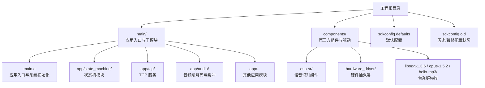
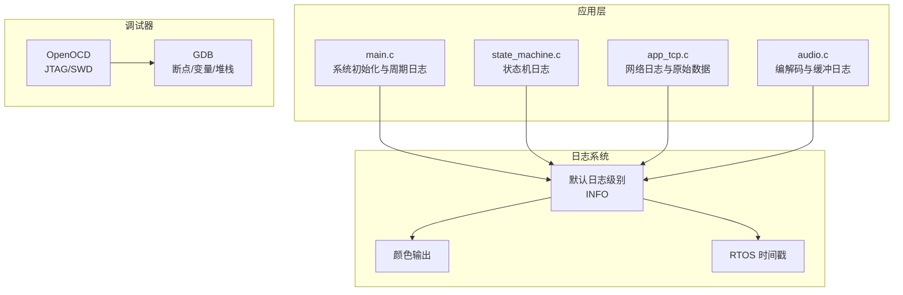
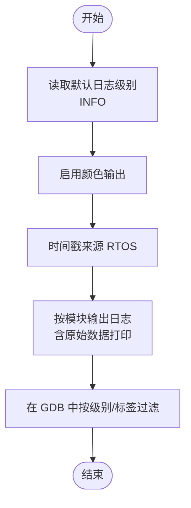
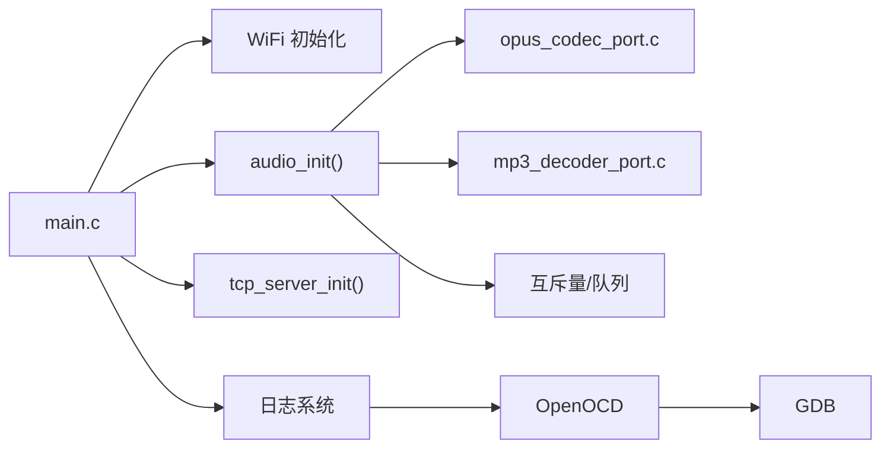

# 调试工具使用

<cite>
**本文引用的文件**
- [sdkconfig.defaults](file://sdkconfig.defaults)
- [sdkconfig.old](file://sdkconfig.old)
- [main.c](file://main/main.c)
- [state_machine.c](file://main/app/state_machine/state_machine.c)
- [app_tcp.c](file://main/app/tcp/app_tcp.c)
- [audio.c](file://main/app/audio/audio.c)
- [opus_codec_port.c](file://main/app/audio/opus_codec_port.c)
- [mp3_decoder_port.c](file://main/app/audio/mp3_decoder_port.c)
</cite>

## 目录
1. [简介](#简介)
2. [项目结构](#项目结构)
3. [核心组件](#核心组件)
4. [架构总览](#架构总览)
5. [详细组件分析](#详细组件分析)
6. [依赖关系分析](#依赖关系分析)
7. [性能考量](#性能考量)
8. [故障排查指南](#故障排查指南)
9. [结论](#结论)
10. [附录](#附录)

## 简介
本指南面向使用 ESP-IDF 的开发者，系统讲解如何在该仓库中进行高效调试，涵盖以下内容：
- ESP-IDF 调试器使用：OpenOCD 配置要点、GDB 调试会话与断点设置
- ESP-IDF 日志系统：日志级别、颜色与时间戳来源、自定义输出与过滤
- 实时调试技巧：变量监视、堆栈跟踪、内存检查
- 常见调试场景：死锁检测、内存泄漏排查、性能瓶颈定位

本指南以仓库中的配置与代码为依据，提供可操作的步骤与图示，帮助快速定位问题并提升开发效率。

## 项目结构
该项目采用 ESP-IDF 标准工程布局，顶层包含主程序入口、组件与第三方库。与调试密切相关的配置主要集中在 SDK 配置文件与应用入口中；日志与调试行为由编译期选项与运行期日志接口共同决定。

图表来源
- [main.c:33-59](file://main/main.c#L33-L59)
- [sdkconfig.defaults:150-184](file://sdkconfig.defaults#L150-L184)
- [sdkconfig.old:1244-1557](file://sdkconfig.old#L1244-L1557)

章节来源
- [main.c:33-59](file://main/main.c#L33-L59)
- [sdkconfig.defaults:150-184](file://sdkconfig.defaults#L150-L184)
- [sdkconfig.old:1244-1557](file://sdkconfig.old#L1244-L1557)

## 核心组件
- 应用入口与系统初始化：负责 NVS、网络、事件循环、硬件初始化与周期性日志打印，便于观察启动阶段与运行期内存状况。
- 状态机模块：集中展示日志在状态切换过程中的使用方式，适合验证日志级别与输出路径。
- TCP 服务：提供网络收发场景的日志与原始数据打印，便于网络协议调试。
- 音频编解码模块：包含互斥量、队列与缓冲区管理，是并发与内存问题的高发区域，适合进行死锁与内存泄漏排查。

章节来源
- [main.c:33-59](file://main/main.c#L33-L59)
- [state_machine.c:83-115](file://main/app/state_machine/state_machine.c#L83-L115)
- [app_tcp.c:289-314](file://main/app/tcp/app_tcp.c#L289-L314)
- [audio.c:304-851](file://main/app/audio/audio.c#L304-L851)

## 架构总览
下图展示了调试相关的系统级交互：应用入口触发各子系统初始化，日志系统贯穿所有模块；OpenOCD/GDB 提供硬件调试能力，结合日志与断点实现快速定位。

图表来源
- [main.c:33-59](file://main/main.c#L33-L59)
- [state_machine.c:83-115](file://main/app/state_machine/state_machine.c#L83-L115)
- [app_tcp.c:88-105](file://main/app/tcp/app_tcp.c#L88-L105)
- [audio.c:304-851](file://main/app/audio/audio.c#L304-L851)
- [sdkconfig.defaults:150-184](file://sdkconfig.defaults#L150-L184)
- [sdkconfig.old:1540-1557](file://sdkconfig.old#L1540-L1557)

## 详细组件分析

### OpenOCD 配置与 GDB 会话
- JTAG/SWD 接口：项目未内嵌 OpenOCD 配置文件，需根据目标芯片与调试器硬件选择合适的接口脚本与引脚配置。通常使用 TCK/TDI/TDO/TRST（或 SWDIO/SWCLK）连接目标板。
- 时钟与频率：确保 OpenOCD 使用与硬件匹配的时钟频率，避免连接失败或读写异常。
- GDB 会话要点：
  - 下载固件后在 GDB 中加载符号表，进入断点等待。
  - 设置断点于关键函数（如应用入口、音频编码/解码任务、状态机处理函数）。
  - 使用监视变量与表达式观察共享资源（互斥量、队列长度、缓冲区写指针）。
  - 结合日志输出确认断点命中与执行路径。

章节来源
- [sdkconfig.old:1282-1283](file://sdkconfig.old#L1282-L1283)

### 断点设置策略
- 入口与初始化：在应用入口处设置断点，观察系统初始化顺序与关键模块启动状态。
- 并发热点：在音频编解码任务的关键节点（加锁/解锁、队列入队/出队、缓冲区写入）设置断点，排查死锁与数据竞争。
- 网络收发：在网络服务器建立、客户端接入、数据接收与解析处设置断点，配合原始数据打印定位协议问题。
- 状态机：在状态切换分支设置断点，验证事件驱动逻辑与日志一致性。

章节来源
- [main.c:33-59](file://main/main.c#L33-L59)
- [audio.c:304-851](file://main/app/audio/audio.c#L304-L851)
- [app_tcp.c:289-314](file://main/app/tcp/app_tcp.c#L289-L314)
- [state_machine.c:83-115](file://main/app/state_machine/state_machine.c#L83-L115)

### 日志系统配置与使用
- 默认日志级别：INFO，颜色输出开启，时间戳来源为 RTOS。
- 日志输出控制：可通过宏或菜单配置调整默认与最大日志级别，以及是否启用颜色与时间戳来源。
- 自定义日志输出：在应用层使用统一标签（TAG），并在需要时打印原始数据（十六进制与可打印字符视图），便于网络与音频数据调试。
- 日志过滤：在 GDB 中结合日志级别与 TAG 进行条件断点或过滤，缩小问题范围。

图表来源
- [sdkconfig.defaults:150-184](file://sdkconfig.defaults#L150-L184)
- [sdkconfig.old:1540-1557](file://sdkconfig.old#L1540-L1557)
- [app_tcp.c:88-105](file://main/app/tcp/app_tcp.c#L88-L105)

章节来源
- [sdkconfig.defaults:150-184](file://sdkconfig.defaults#L150-L184)
- [sdkconfig.old:1540-1557](file://sdkconfig.old#L1540-L1557)
- [app_tcp.c:88-105](file://main/app/tcp/app_tcp.c#L88-L105)

### 实时调试技巧
- 变量监视：
  - 关注互斥量与队列状态：音频模块中存在互斥量与队列，可在断点处监视其状态变化。
  - 观察缓冲区写指针与剩余空间：在编码/解码关键路径上监视缓冲区写入位置与剩余容量。
- 堆栈跟踪：在断点处查看调用栈，确认异常发生在哪个任务或中断上下文中。
- 内存检查：结合默认日志与内存统计接口，定期打印可用内存，定位潜在泄漏或碎片化问题。

章节来源
- [audio.c:304-851](file://main/app/audio/audio.c#L304-L851)
- [main.c:55-58](file://main/main.c#L55-L58)

### 组件级调试要点

#### 状态机模块
- 日志位置：状态切换前后均输出日志，便于验证事件驱动与状态一致性。
- 调试建议：在每个状态分支设置断点，核对事件编号与当前状态，确保无遗漏或重复处理。

章节来源
- [state_machine.c:83-115](file://main/app/state_machine/state_machine.c#L83-L115)

#### TCP 服务
- 日志位置：服务器启动、客户端接入、数据接收与解析处均有日志。
- 原始数据打印：提供十六进制与可打印字符视图，便于协议调试与数据完整性验证。

章节来源
- [app_tcp.c:289-314](file://main/app/tcp/app_tcp.c#L289-L314)
- [app_tcp.c:88-105](file://main/app/tcp/app_tcp.c#L88-L105)

#### 音频编解码
- 并发与内存：
  - 使用互斥量保护共享缓冲区，注意超时与失败路径的日志。
  - 队列入队/出队与缓冲区写入是高风险点，需关注返回值与异常分支。
- 编解码上下文：
  - OPUS/MP3 解码器上下文分配在 SPIRAM 或 INTERNAL RAM，需关注内存不足与初始化失败日志。

章节来源
- [audio.c:304-851](file://main/app/audio/audio.c#L304-L851)
- [opus_codec_port.c:26-224](file://main/app/audio/opus_codec_port.c#L26-L224)
- [mp3_decoder_port.c:44-204](file://main/app/audio/mp3_decoder_port.c#L44-L204)

## 依赖关系分析
- 应用入口依赖各子系统初始化，日志系统贯穿所有模块。
- 调试器依赖硬件接口与正确的 OpenOCD 配置。
- 并发模块（音频）依赖 FreeRTOS 同步原语，调试时需关注任务调度与优先级。

图表来源
- [main.c:33-59](file://main/main.c#L33-L59)
- [audio.c:845-851](file://main/app/audio/audio.c#L845-L851)
- [opus_codec_port.c:26-224](file://main/app/audio/opus_codec_port.c#L26-L224)
- [mp3_decoder_port.c:44-204](file://main/app/audio/mp3_decoder_port.c#L44-L204)

章节来源
- [main.c:33-59](file://main/main.c#L33-L59)
- [audio.c:845-851](file://main/app/audio/audio.c#L845-L851)

## 性能考量
- 优化等级与断言：默认优化等级偏向性能，断言级别适中，有助于在调试时平衡性能与可靠性。
- 日志开销：INFO 级别日志在生产环境可降低开销，但在调试阶段可临时提高级别以获取更细粒度信息。
- 内存与缓存：音频模块对内存与缓存较为敏感，建议在断点处检查缓冲区与队列状态，避免阻塞与溢出。

章节来源
- [sdkconfig.old:670-698](file://sdkconfig.old#L670-L698)
- [sdkconfig.defaults:150-184](file://sdkconfig.defaults#L150-L184)

## 故障排查指南

### 死锁检测
- 症状：任务长时间阻塞、互斥量获取超时、日志显示“Failed to take mutex”。
- 排查步骤：
  - 在互斥量获取与释放处设置断点，核对持有者与等待链。
  - 查看调用栈，确认是否存在同一线程重复加锁或加锁顺序不一致。
  - 检查队列是否满导致非阻塞发送失败并回滚缓冲区写入。

章节来源
- [audio.c:325-354](file://main/app/audio/audio.c#L325-L354)
- [audio.c:776-834](file://main/app/audio/audio.c#L776-L834)

### 内存泄漏排查
- 症状：可用内存持续下降、初始化失败、解码器/编码器上下文分配失败。
- 排查步骤：
  - 在分配与释放路径设置断点，核对配对关系。
  - 使用日志记录分配/释放次数与失败原因，定位未释放点。
  - 定期打印可用内存，观察趋势。

章节来源
- [opus_codec_port.c:26-224](file://main/app/audio/opus_codec_port.c#L26-L224)
- [mp3_decoder_port.c:44-204](file://main/app/audio/mp3_decoder_port.c#L44-L204)
- [main.c:55-58](file://main/main.c#L55-L58)

### 性能瓶颈定位
- 症状：音频编码/解码延迟增大、网络收发阻塞、状态切换响应变慢。
- 排查步骤：
  - 在关键路径设置断点，测量函数耗时与上下文切换频率。
  - 检查队列长度与缓冲区写入速率，避免阻塞与丢帧。
  - 结合日志时间戳与 GDB 堆栈，定位热点函数与任务。

章节来源
- [audio.c:758-842](file://main/app/audio/audio.c#L758-L842)
- [app_tcp.c:289-314](file://main/app/tcp/app_tcp.c#L289-L314)

## 结论
本指南基于仓库中的配置与代码，总结了 ESP-IDF 调试的关键实践：合理利用日志系统、在并发热点设置断点、结合 OpenOCD/GDB 进行变量监视与堆栈跟踪，并针对死锁、内存问题与性能瓶颈提供可操作的排查思路。建议在开发过程中持续关注日志输出与内存统计，配合断点与条件断点快速定位问题。

## 附录

### 日志系统配置摘要
- 默认日志级别：INFO
- 最大日志级别：INFO
- 是否启用颜色输出：是
- 时间戳来源：RTOS

章节来源
- [sdkconfig.defaults:150-184](file://sdkconfig.defaults#L150-L184)
- [sdkconfig.old:1540-1557](file://sdkconfig.old#L1540-L1557)