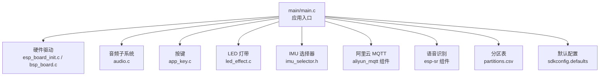
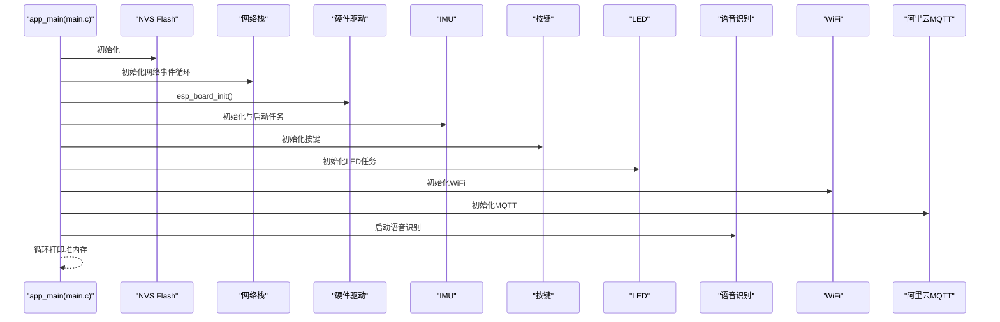
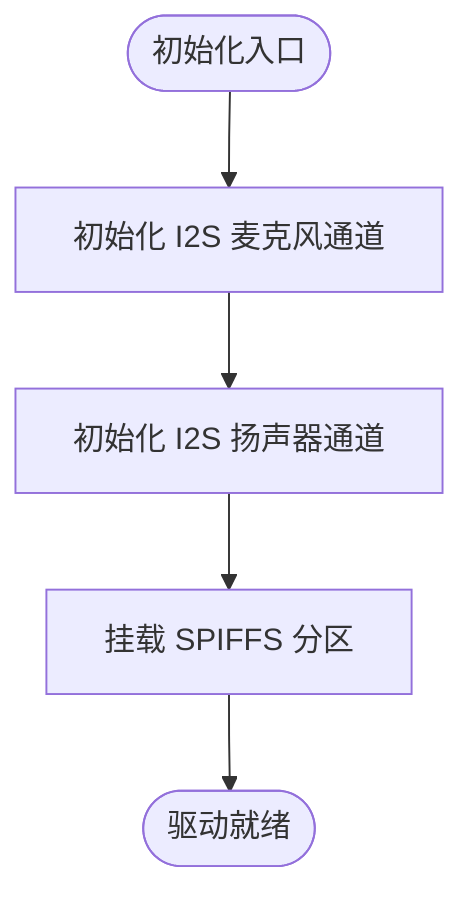
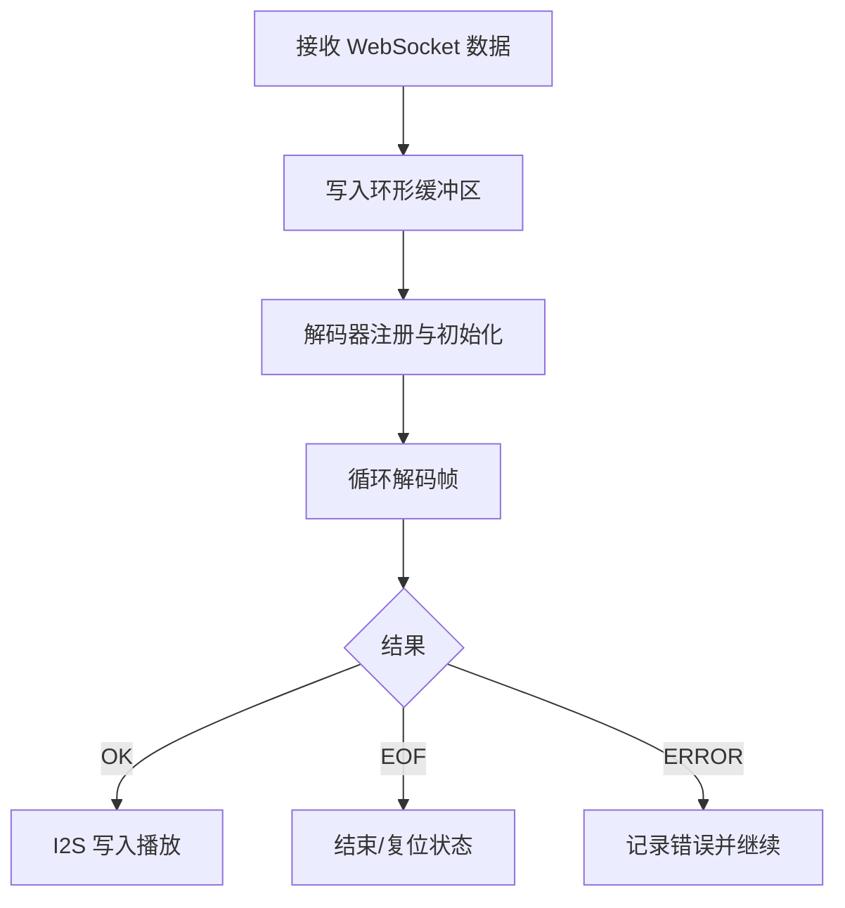
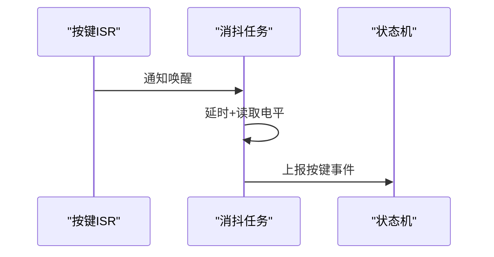
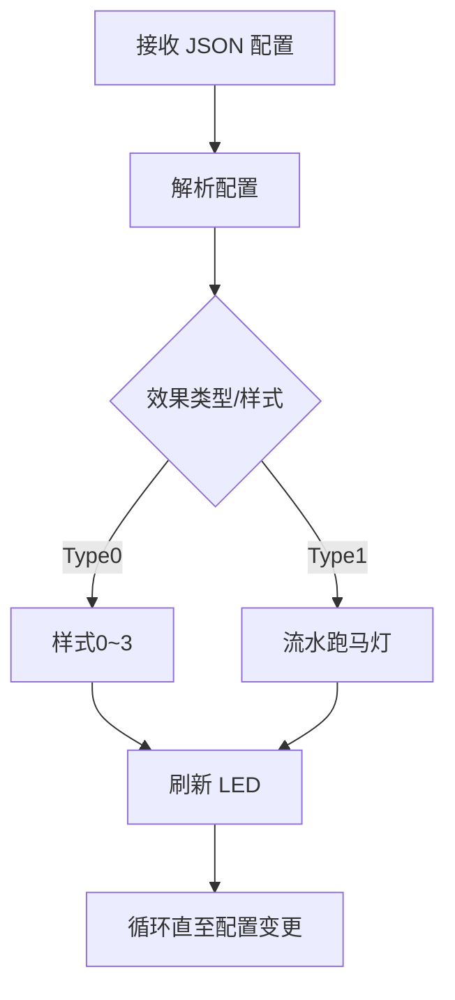
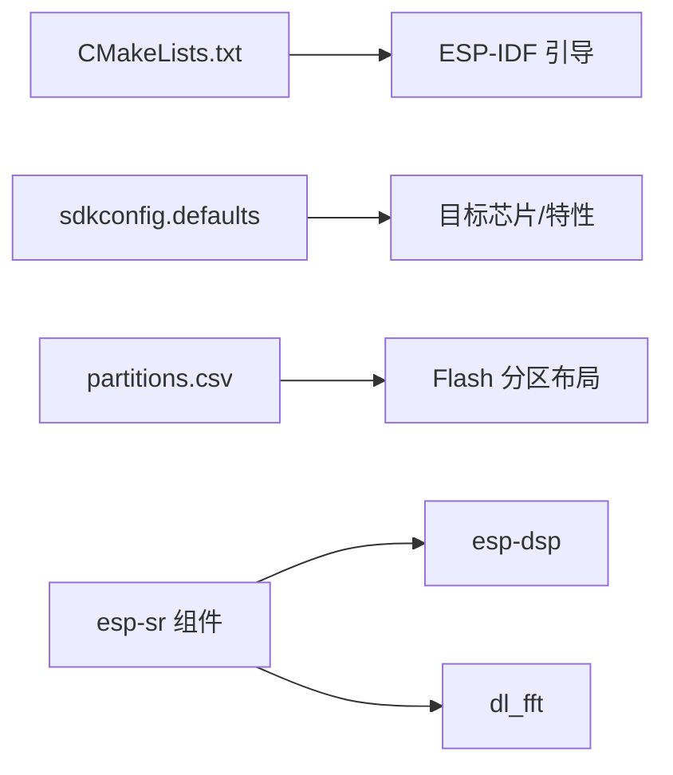

# 快速开始

<cite>
**本文引用的文件**   
- [CMakeLists.txt](file://CMakeLists.txt)
- [sdkconfig.defaults](file://sdkconfig.defaults)
- [partitions.csv](file://partitions.csv)
- [main.c](file://main/main.c)
- [bsp_board.c](file://components/hardware_driver/boards/esp32-s3/bsp_board.c)
- [esp_board_init.c](file://components/hardware_driver/esp_board_init.c)
- [audio.c](file://main/app/audio/audio.c)
- [app_key.c](file://main/app/key/app_key.c)
- [led_effect.c](file://main/app/led_strip/led_effect.c)
- [imu_selector.h](file://components/IMU/imu_selector.h)
- [idf_component.yml](file://components/esp-sr/idf_component.yml)
</cite>

## 目录
1. [简介](#简介)
2. [项目结构](#项目结构)
3. [核心组件](#核心组件)
4. [架构总览](#架构总览)
5. [详细组件分析](#详细组件分析)
6. [依赖关系分析](#依赖关系分析)
7. [性能注意事项](#性能注意事项)
8. [故障排查指南](#故障排查指南)
9. [结论](#结论)
10. [附录](#附录)

## 简介
本“快速开始”面向首次接触 Lightsaber 项目的开发者，目标是帮助你在最短时间内完成开发环境搭建、项目编译、下载与烧录，并进行基础功能验证。文档覆盖以下内容：
- 开发环境与工具链准备（ESP-IDF 版本要求、Python 环境、工具链安装）
- IDE 配置（VS Code + ESP-IDF 扩展、CLion 或命令行）
- 项目编译、下载与烧录流程
- 硬件准备与连接步骤（含 I2S 麦克风/扬声器、按键、LED 灯带）
- 基础功能测试方法（串口日志、按键事件、LED 效果、音频播放）
- 常见问题排查（编译错误、烧录失败、串口通信异常）

## 项目结构
Lightsaber 是基于 ESP-IDF 的工程，采用组件化组织方式，核心模块包括：
- 硬件抽象层与驱动：I2S 麦克风/扬声器、SPIFFS、按键、LED 灯带
- 音频子系统：Opus/MP3 解码、音频编解码任务、WebSocket 接收与转发
- 传感器与姿态：IMU 驱动选择与姿态获取
- 无线与云：WiFi 初始化、TCP/WS 服务、阿里云 MQTT 组件
- 语音识别：esp-sr 组件（多模型、多芯片族支持）

**图表来源**
- [main.c:33-60](file://main/main.c#L33-L60)
- [esp_board_init.c:30-33](file://components/hardware_driver/esp_board_init.c#L30-L33)
- [bsp_board.c:169-175](file://components/hardware_driver/boards/esp32-s3/bsp_board.c#L169-L175)
- [audio.c:1-120](file://main/app/audio/audio.c#L1-L120)
- [app_key.c:72-104](file://main/app/key/app_key.c#L72-L104)
- [led_effect.c:436-441](file://main/app/led_strip/led_effect.c#L436-L441)
- [imu_selector.h:12-12](file://components/IMU/imu_selector.h#L12-L12)
- [partitions.csv:1-6](file://partitions.csv#L1-L6)
- [sdkconfig.defaults:74-88](file://sdkconfig.defaults#L74-L88)

**章节来源**
- [CMakeLists.txt:1-10](file://CMakeLists.txt#L1-L10)
- [sdkconfig.defaults:74-88](file://sdkconfig.defaults#L74-L88)
- [partitions.csv:1-6](file://partitions.csv#L1-L6)
- [main.c:33-60](file://main/main.c#L33-L60)

## 核心组件
- 硬件驱动与 I2S
  - I2S 麦克风与扬声器初始化、读写封装，SPIFFS 挂载与卸载
  - 关键路径：[esp_board_init.c:30-33](file://components/hardware_driver/esp_board_init.c#L30-L33)、[bsp_board.c:22-104](file://components/hardware_driver/boards/esp32-s3/bsp_board.c#L22-L104)
- 音频子系统
  - MP3/Opus 解码、音频编解码任务、WebSocket 接收缓冲与播放
  - 关键路径：[audio.c:112-308](file://main/app/audio/audio.c#L112-L308)
- 按键与状态机
  - 按键消抖、角度记录、事件上报
  - 关键路径：[app_key.c:22-104](file://main/app/key/app_key.c#L22-L104)
- LED 灯带效果
  - JSON 配置驱动的多种效果（闪烁、跳变、波浪、脉冲）
  - 关键路径：[led_effect.c:436-441](file://main/app/led_strip/led_effect.c#L436-L441)
- IMU 选择器
  - 通过 Kconfig 选择 IMU 驱动，统一接口
  - 关键路径：[imu_selector.h:12-12](file://components/IMU/imu_selector.h#L12-L12)
- 语音识别组件
  - esp-sr 组件声明与依赖
  - 关键路径：[idf_component.yml:1-13](file://components/esp-sr/idf_component.yml#L1-L13)

**章节来源**
- [esp_board_init.c:10-33](file://components/hardware_driver/esp_board_init.c#L10-L33)
- [bsp_board.c:169-175](file://components/hardware_driver/boards/esp32-s3/bsp_board.c#L169-L175)
- [audio.c:112-308](file://main/app/audio/audio.c#L112-L308)
- [app_key.c:22-104](file://main/app/key/app_key.c#L22-L104)
- [led_effect.c:436-441](file://main/app/led_strip/led_effect.c#L436-L441)
- [imu_selector.h:12-12](file://components/IMU/imu_selector.h#L12-L12)
- [idf_component.yml:1-13](file://components/esp-sr/idf_component.yml#L1-L13)

## 架构总览
下图展示应用启动后各模块的初始化顺序与协作关系。

**图表来源**
- [main.c:33-60](file://main/main.c#L33-L60)
- [esp_board_init.c:30-33](file://components/hardware_driver/esp_board_init.c#L30-L33)
- [audio.c:1-120](file://main/app/audio/audio.c#L1-L120)
- [app_key.c:72-104](file://main/app/key/app_key.c#L72-L104)
- [led_effect.c:436-441](file://main/app/led_strip/led_effect.c#L436-L441)

## 详细组件分析

### 硬件驱动与 I2S
- 功能要点
  - I2S 麦克风（RX）与扬声器（TX）通道初始化、采样率与位宽配置
  - SPIFFS 分区挂载与容量查询
  - I2S 读写封装，供音频模块使用
- 关键实现
  - I2S RX/TX 初始化与启用：[bsp_board.c:22-104](file://components/hardware_driver/boards/esp32-s3/bsp_board.c#L22-L104)
  - SPIFFS 挂载与信息查询：[bsp_board.c:130-160](file://components/hardware_driver/boards/esp32-s3/bsp_board.c#L130-L160)
  - 驱动桥接：[esp_board_init.c:30-33](file://components/hardware_driver/esp_board_init.c#L30-L33)

**图表来源**
- [bsp_board.c:169-175](file://components/hardware_driver/boards/esp32-s3/bsp_board.c#L169-L175)
- [esp_board_init.c:10-18](file://components/hardware_driver/esp_board_init.c#L10-L18)

**章节来源**
- [bsp_board.c:22-104](file://components/hardware_driver/boards/esp32-s3/bsp_board.c#L22-L104)
- [bsp_board.c:130-160](file://components/hardware_driver/boards/esp32-s3/bsp_board.c#L130-L160)
- [esp_board_init.c:30-33](file://components/hardware_driver/esp_board_init.c#L30-L33)

### 音频子系统
- 功能要点
  - MP3/Opus 文件播放、I2S 输出
  - WebSocket 接收缓冲、帧头解析、Opus 解码后回放
  - 编码/解码任务、队列与互斥量管理
- 关键实现
  - 文件播放与解码：[audio.c:112-205](file://main/app/audio/audio.c#L112-L205)
  - Opus 播放与错误处理：[audio.c:211-308](file://main/app/audio/audio.c#L211-L308)
  - 解码测试任务与帧头解析：[audio.c:399-550](file://main/app/audio/audio.c#L399-L550)
  - WebSocket 数据写入与读取：[audio.c:553-610](file://main/app/audio/audio.c#L553-L610)

**图表来源**
- [audio.c:553-696](file://main/app/audio/audio.c#L553-L696)

**章节来源**
- [audio.c:112-308](file://main/app/audio/audio.c#L112-L308)
- [audio.c:399-550](file://main/app/audio/audio.c#L399-L550)
- [audio.c:553-696](file://main/app/audio/audio.c#L553-L696)

### 按键与状态机
- 功能要点
  - 按键双边沿触发、消抖、事件上报
  - 按下时记录当前 IMU 角度，供状态机使用
- 关键实现
  - 中断与任务配合：[app_key.c:22-70](file://main/app/key/app_key.c#L22-L70)
  - 初始化与注册：[app_key.c:72-104](file://main/app/key/app_key.c#L72-L104)

**图表来源**
- [app_key.c:22-70](file://main/app/key/app_key.c#L22-L70)

**章节来源**
- [app_key.c:22-104](file://main/app/key/app_key.c#L22-L104)

### LED 灯带效果
- 功能要点
  - JSON 配置驱动多种效果（闪烁、跳变、波浪、脉冲）
  - 支持暂停/恢复与配置变更即时生效
- 关键实现
  - 任务与效果分派：[led_effect.c:436-441](file://main/app/led_strip/led_effect.c#L436-L441)
  - 效果实现（样式0~3、类型1流水）：[led_effect.c:126-395](file://main/app/led_strip/led_effect.c#L126-L395)

**图表来源**
- [led_effect.c:436-441](file://main/app/led_strip/led_effect.c#L436-L441)

**章节来源**
- [led_effect.c:436-441](file://main/app/led_strip/led_effect.c#L436-L441)

### IMU 选择器
- 功能要点
  - 通过 Kconfig 选择 IMU 驱动，统一对外接口
- 关键实现
  - 驱动获取接口：[imu_selector.h:12-12](file://components/IMU/imu_selector.h#L12-L12)

**章节来源**
- [imu_selector.h:12-12](file://components/IMU/imu_selector.h#L12-L12)

## 依赖关系分析
- 构建与配置
  - 工程通过 CMakeLists 引入 ESP-IDF 并设置额外组件目录
  - 默认配置文件指定目标芯片、分区表、SPIRAM、蓝牙/WiFi 等选项
- 组件依赖
  - esp-sr 组件声明了对 ESP-DSP、dl_fft 的依赖
- 分区表
  - 自定义分区表包含 factory、storage、model 等分区，满足固件、SPIFFS 和模型文件存储

**图表来源**
- [CMakeLists.txt:1-10](file://CMakeLists.txt#L1-L10)
- [sdkconfig.defaults:74-88](file://sdkconfig.defaults#L74-L88)
- [partitions.csv:1-6](file://partitions.csv#L1-L6)
- [idf_component.yml:4-7](file://components/esp-sr/idf_component.yml#L4-L7)

**章节来源**
- [CMakeLists.txt:1-10](file://CMakeLists.txt#L1-L10)
- [sdkconfig.defaults:74-88](file://sdkconfig.defaults#L74-L88)
- [partitions.csv:1-6](file://partitions.csv#L1-L6)
- [idf_component.yml:4-7](file://components/esp-sr/idf_component.yml#L4-L7)

## 性能注意事项
- 内存与缓存
  - 默认启用 SPIRAM 并配置为高速模式，建议在音频/语音场景中充分利用外部 PSRAM
- CPU 频率与调度
  - 默认 CPU 频率为 240MHz，保证音频/网络处理能力
- I2S 与 DMA
  - I2S 使用 DMA 描述符与帧长度配置，注意缓冲区大小与任务延时，避免欠载/过载
- 任务优先级与栈
  - 音频/解码任务栈较大，避免抢占导致的卡顿；必要时将关键任务绑定到特定核心

[本节为通用指导，无需列出具体文件来源]

## 故障排查指南
- 编译错误
  - ESP-IDF 版本不符：确认版本满足组件要求（esp-sr 组件要求 >= 5.0）
  - 组件缺失：确保 EXTRA_COMPONENT_DIRS 正确指向 components 目录
  - Kconfig 选项冲突：检查 sdkconfig.defaults 中目标芯片与功能开关一致性
  - 参考路径：
    - [CMakeLists.txt:5-5](file://CMakeLists.txt#L5-L5)
    - [idf_component.yml:5-5](file://components/esp-sr/idf_component.yml#L5-L5)
    - [sdkconfig.defaults:74-88](file://sdkconfig.defaults#L74-L88)
- 烧录失败
  - 端口权限：Linux 下为当前用户添加 dialout 组权限
  - 烧录工具：使用 idf.py monitor/flash/prog_uart 等标准流程
  - 串口波特率：默认 115200，确保终端与设备一致
  - 参考路径：
    - [sdkconfig.defaults:166-166](file://sdkconfig.defaults#L166-L166)
- 串口通信异常
  - 日志级别：默认开启较多日志，可通过 SDK 配置降低日志等级
  - 端口占用：关闭占用串口的其他程序（如 IDE/终端）
  - 参考路径：
    - [sdkconfig.defaults:156-175](file://sdkconfig.defaults#L156-L175)
- 音频无声/破音
  - I2S 引脚与配置：确认麦克风/扬声器引脚与 bsp_board.c 中配置一致
  - 缓冲区与队列：检查音频任务是否及时消费队列，避免阻塞
  - 参考路径：
    - [bsp_board.c:44-98](file://components/hardware_driver/boards/esp32-s3/bsp_board.c#L44-L98)
    - [audio.c:733-796](file://main/app/audio/audio.c#L733-L796)
- 按键无响应
  - 按键引脚与上拉电阻：确认 GPIO 配置与硬件连接
  - 中断与任务：检查 ISR 是否注册、任务是否创建
  - 参考路径：
    - [app_key.c:72-104](file://main/app/key/app_key.c#L72-L104)
- LED 不显示/闪烁异常
  - LED 数量与刷新频率：确认 LED 数量与刷新周期设置
  - JSON 配置：检查下发的 JSON 结构与字段
  - 参考路径：
    - [led_effect.c:436-441](file://main/app/led_strip/led_effect.c#L436-L441)

**章节来源**
- [CMakeLists.txt:5-5](file://CMakeLists.txt#L5-L5)
- [sdkconfig.defaults:156-175](file://sdkconfig.defaults#L156-L175)
- [sdkconfig.defaults:166-166](file://sdkconfig.defaults#L166-L166)
- [bsp_board.c:44-98](file://components/hardware_driver/boards/esp32-s3/bsp_board.c#L44-L98)
- [audio.c:733-796](file://main/app/audio/audio.c#L733-L796)
- [app_key.c:72-104](file://main/app/key/app_key.c#L72-L104)
- [led_effect.c:436-441](file://main/app/led_strip/led_effect.c#L436-L441)

## 结论
通过本快速开始指南，你已经完成了 Lightsaber 项目的环境准备、编译与烧录，并掌握了基础功能验证方法。建议在后续开发中：
- 按需调整 sdkconfig.defaults 中的功能开关
- 使用 JSON 配置驱动 LED 效果，结合按键事件实现交互
- 在音频/语音场景中关注 I2S 与队列的缓冲策略
- 利用阿里云 MQTT 组件实现设备与云端的连接与数据交互

[本节为总结性内容，无需列出具体文件来源]

## 附录

### 开发环境搭建步骤（概览）
- 安装 ESP-IDF（版本要求参见组件声明）
- 配置 Python 依赖与工具链
- 克隆仓库并导入组件
- 配置 IDE（VS Code + ESP-IDF 扩展 或 CLion）
- 连接开发板，设置串口与烧录参数
- 编译、下载、监控日志

[本节为流程性说明，无需列出具体文件来源]

### 硬件准备与连接
- 开发板：ESP32-S3（目标芯片）
- I2S 麦克风：INMP441（引脚在 bsp_board.c 中定义）
- I2S 扬声器：MAX98357A（引脚在 bsp_board.c 中定义）
- 按键：GPIO4（上拉，双边沿触发）
- LED 灯带：通过 SPI 控制（由 led_spi.c 驱动，位于同目录）

**章节来源**
- [bsp_board.c:44-98](file://components/hardware_driver/boards/esp32-s3/bsp_board.c#L44-L98)
- [app_key.c:10-12](file://main/app/key/app_key.c#L10-L12)

### 基础功能测试清单
- 串口日志：观察 app_main 启动后打印的堆内存信息
- 按键：按下按键，确认记录角度与事件上报
- LED：下发 JSON 配置，验证效果切换
- 音频：播放 SPIFFS 中的 MP3/Opus 文件，确认 I2S 输出
- 网络：WiFi 初始化成功，MQTT 组件可用

**章节来源**
- [main.c:54-60](file://main/main.c#L54-L60)
- [app_key.c:56-67](file://main/app/key/app_key.c#L56-L67)
- [led_effect.c:436-441](file://main/app/led_strip/led_effect.c#L436-L441)
- [audio.c:112-205](file://main/app/audio/audio.c#L112-L205)