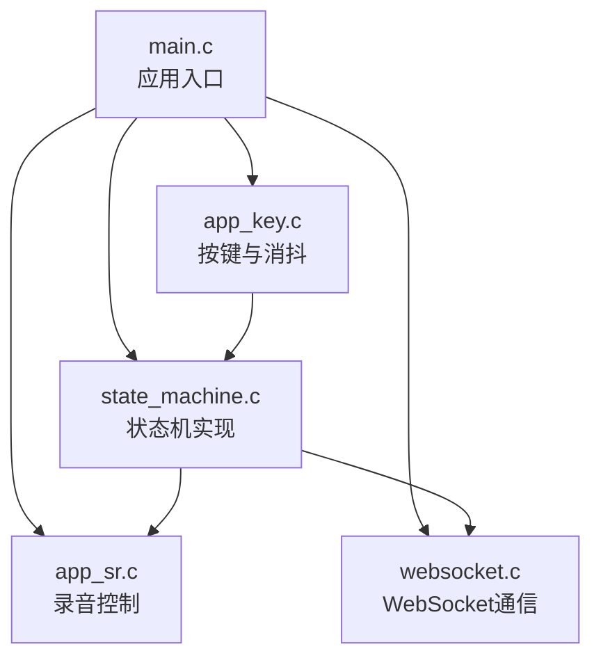
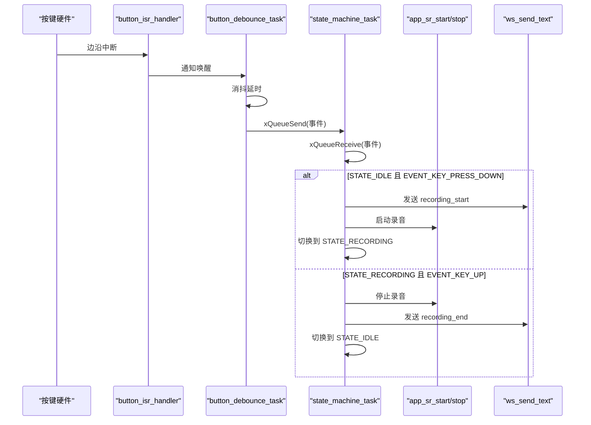
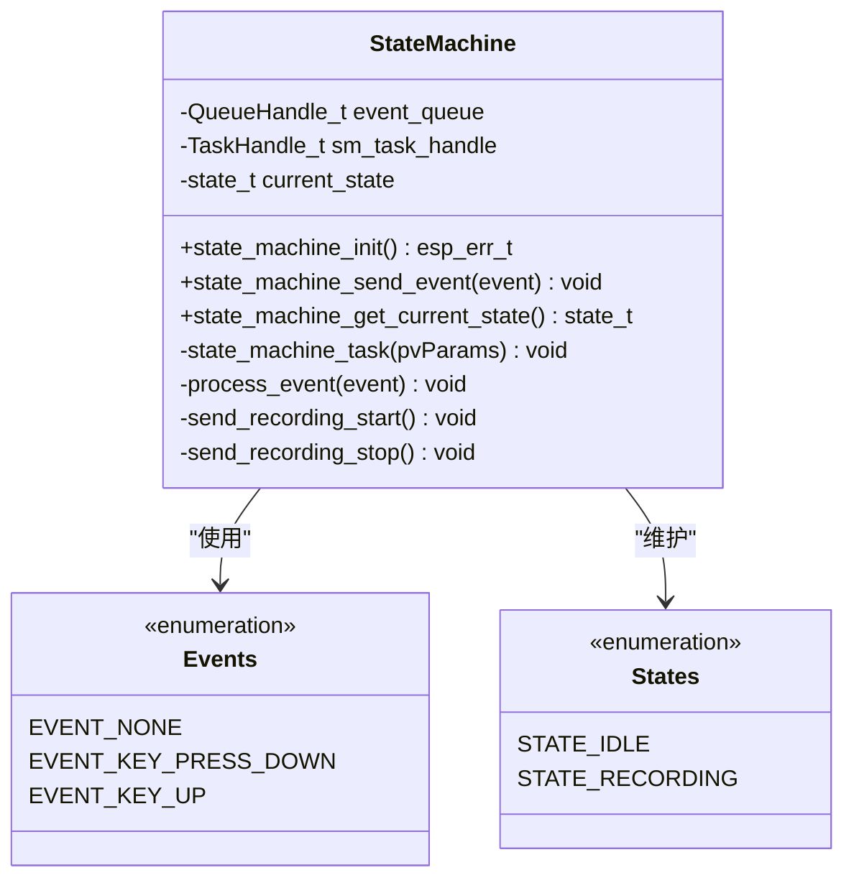
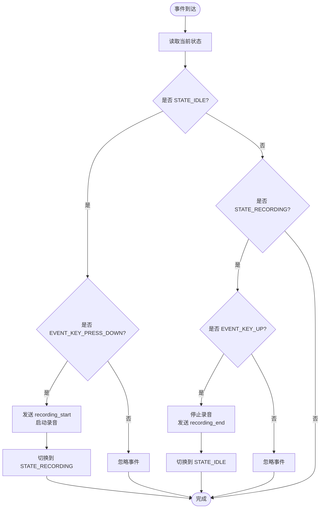
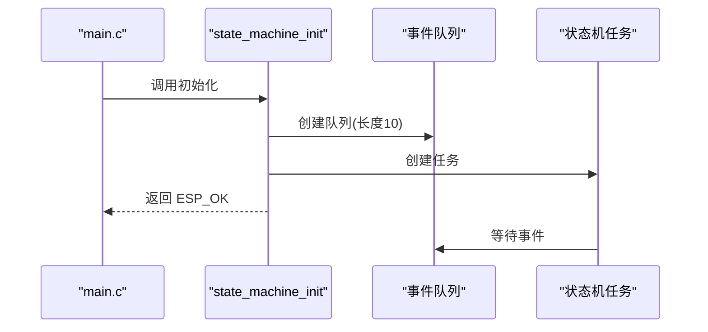
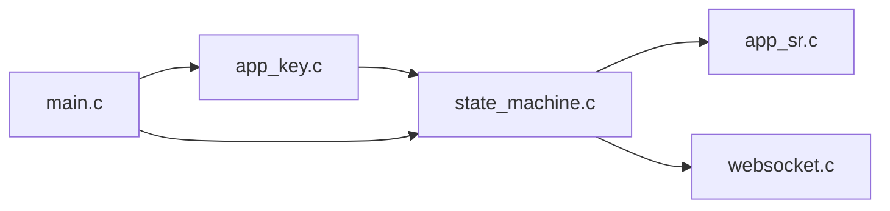

# 状态管理系统

<cite>
**本文引用的文件**
- [state_machine.h](file://main/app/state_machine/state_machine.h)
- [state_machine.c](file://main/app/state_machine/state_machine.c)
- [app_key.c](file://main/app/key/app_key.c)
- [main.c](file://main/main.c)
- [app_sr.c](file://main/app/audio/app_sr.c)
- [websocket.c](file://main/app/websocket/websocket.c)
</cite>

## 目录
1. [简介](#简介)
2. [项目结构](#项目结构)
3. [核心组件](#核心组件)
4. [架构总览](#架构总览)
5. [详细组件分析](#详细组件分析)
6. [依赖关系分析](#依赖关系分析)
7. [性能考虑](#性能考虑)
8. [故障排查指南](#故障排查指南)
9. [结论](#结论)
10. [附录](#附录)

## 简介
本文件面向“状态管理系统”的技术文档，聚焦于事件驱动状态机的设计与实现，涵盖状态定义、事件处理、状态转换逻辑、初始化流程、事件队列管理、并发安全机制、状态持久化策略、系统重启后的状态恢复与异常保护、扩展方法与自定义状态/事件编写指南，以及调试技巧与性能优化建议。该系统以按键事件为触发源，通过状态机协调录音控制与 WebSocket 通信，形成从硬件输入到云端交互的闭环。

## 项目结构
状态管理相关模块位于 main/app 下，主要文件如下：
- 状态机接口与实现：state_machine.h、state_machine.c
- 按键输入与事件派发：app_key.c
- 应用入口与初始化编排：main.c
- 录音控制适配层：app_sr.c
- WebSocket 通信封装：websocket.c

图表来源
- [main.c:33-60](file://main/main.c#L33-L60)
- [state_machine.c:24-35](file://main/app/state_machine/state_machine.c#L24-L35)
- [app_key.c:72-104](file://main/app/key/app_key.c#L72-L104)
- [app_sr.c:76-94](file://main/app/audio/app_sr.c#L76-L94)
- [websocket.c:580-604](file://main/app/websocket/websocket.c#L580-L604)

章节来源
- [main.c:33-60](file://main/main.c#L33-L60)

## 核心组件
- 状态机接口与常量
  - 事件类型：EVENT_KEY_PRESS_DOWN、EVENT_KEY_UP
  - 状态类型：STATE_IDLE、STATE_RECORDING
  - 接口：state_machine_init、state_machine_send_event、state_machine_get_current_state
- 状态机实现
  - 单任务事件循环：state_machine_task
  - 事件队列：长度为10的 FreeRTOS 队列
  - 当前状态：静态变量 current_state
  - 转换逻辑：基于当前状态与事件进行分支处理
- 按键输入与事件派发
  - 中断+消抖：button_isr_handler + button_debounce_task
  - 按下记录 IMU 角度并上报事件
  - 松开上报事件
- 录音控制适配层
  - 开始/停止录音 API：app_sr_start_api_recording、app_sr_stop_api_recording
- WebSocket 通信封装
  - 文本发送：ws_send_text
  - 连接状态：ws_is_connected

章节来源
- [state_machine.h:6-32](file://main/app/state_machine/state_machine.h#L6-L32)
- [state_machine.c:11-47](file://main/app/state_machine/state_machine.c#L11-L47)
- [app_key.c:22-70](file://main/app/key/app_key.c#L22-L70)
- [app_sr.c:76-94](file://main/app/audio/app_sr.c#L76-L94)
- [websocket.c:580-604](file://main/app/websocket/websocket.c#L580-L604)

## 架构总览
系统采用事件驱动的单线程状态机模型，按键事件经由 FreeRTOS 队列投递至状态机任务，状态机根据当前状态与事件执行相应动作（启动/停止录音、发送 WebSocket 消息），并通过录音控制与 WebSocket 封装与外部模块解耦。

图表来源
- [app_key.c:22-70](file://main/app/key/app_key.c#L22-L70)
- [state_machine.c:37-57](file://main/app/state_machine/state_machine.c#L37-L57)
- [state_machine.c:83-115](file://main/app/state_machine/state_machine.c#L83-L115)
- [app_sr.c:76-94](file://main/app/audio/app_sr.c#L76-L94)
- [websocket.c:580-604](file://main/app/websocket/websocket.c#L580-L604)

## 详细组件分析

### 状态机类图

图表来源
- [state_machine.c:11-47](file://main/app/state_machine/state_machine.c#L11-L47)
- [state_machine.h:7-17](file://main/app/state_machine/state_machine.h#L7-L17)

章节来源
- [state_machine.c:24-35](file://main/app/state_machine/state_machine.c#L24-L35)
- [state_machine.c:37-47](file://main/app/state_machine/state_machine.c#L37-L47)
- [state_machine.c:49-57](file://main/app/state_machine/state_machine.c#L49-L57)
- [state_machine.c:83-115](file://main/app/state_machine/state_machine.c#L83-L115)

### 事件队列与并发安全
- 事件队列
  - 类型：FreeRTOS 队列
  - 长度：10
  - 数据项：state_event_t
  - 发送：state_machine_send_event 使用阻塞时间为0的发送，若队列满则丢弃
- 并发与同步
  - 单一消费者：状态机任务独占消费队列
  - ISR → 任务通知：按键路径使用通知唤醒，消抖任务在 ISR 后续处理按键事件，最终通过队列进入状态机
  - 关键点：队列满时丢弃新事件，需确保事件重要性与处理频率平衡

章节来源
- [state_machine.c:26-30](file://main/app/state_machine/state_machine.c#L26-L30)
- [state_machine.c:37-42](file://main/app/state_machine/state_machine.c#L37-L42)
- [app_key.c:22-30](file://main/app/key/app_key.c#L22-L30)
- [app_key.c:33-70](file://main/app/key/app_key.c#L33-L70)

### 状态转换逻辑
- 初始状态：STATE_IDLE
- 转换规则
  - STATE_IDLE + EVENT_KEY_PRESS_DOWN → 启动录音、发送 recording_start、切换到 STATE_RECORDING
  - STATE_RECORDING + EVENT_KEY_UP → 停止录音、发送 recording_end、切换到 STATE_IDLE
- 异常分支：默认不处理其他事件，保持当前状态

图表来源
- [state_machine.c:83-115](file://main/app/state_machine/state_machine.c#L83-L115)

章节来源
- [state_machine.c:83-115](file://main/app/state_machine/state_machine.c#L83-L115)

### 初始化流程
- 应用入口 main.c
  - 初始化 NVS、网络、GPIO、板卡、IMU、按键、LED、状态机、WiFi、MQTT、音频、TCP、角度配置等
- 状态机初始化 state_machine_init
  - 创建事件队列
  - 创建状态机任务
  - 记录初始状态为 STATE_IDLE

图表来源
- [main.c:33-60](file://main/main.c#L33-L60)
- [state_machine.c:24-35](file://main/app/state_machine/state_machine.c#L24-L35)

章节来源
- [main.c:33-60](file://main/main.c#L33-L60)
- [state_machine.c:24-35](file://main/app/state_machine/state_machine.c#L24-L35)

### 事件派发与按键消抖
- 中断服务函数 button_isr_handler
  - 使用 vTaskNotifyGiveFromISR 唤醒消抖任务
- 消抖任务 button_debounce_task
  - 初始稳定电平读取与延时
  - 检测电平变化后消抖，区分按下/松开
  - 按下时记录 IMU 角度，设置标志位
  - 通过 state_machine_send_event 投递事件
- 注意事项
  - 按键初始化包含中断安装、清除残留标志、注册处理函数等步骤
  - 消抖时间固定为 30ms，避免误触

章节来源
- [app_key.c:22-30](file://main/app/key/app_key.c#L22-L30)
- [app_key.c:33-70](file://main/app/key/app_key.c#L33-L70)
- [app_key.c:72-104](file://main/app/key/app_key.c#L72-L104)

### 录音控制与 WebSocket 通信
- 录音控制
  - app_sr_start_api_recording(duration_ms)：标记录音开始（忽略时长，由按键松开决定停止）
  - app_sr_stop_api_recording()：标记录音结束
- WebSocket 通信
  - ws_send_text(data, len)：发送文本帧，检查初始化、连接状态与参数有效性
  - ws_is_connected()：查询连接状态
- 状态机中的使用
  - STATE_IDLE→RECORDING：发送 recording_start，启动录音
  - STATE_RECORDING→IDLE：停止录音，发送 recording_end

章节来源
- [app_sr.c:76-94](file://main/app/audio/app_sr.c#L76-L94)
- [websocket.c:580-604](file://main/app/websocket/websocket.c#L580-L604)
- [state_machine.c:60-81](file://main/app/state_machine/state_machine.c#L60-L81)
- [state_machine.c:92-108](file://main/app/state_machine/state_machine.c#L92-L108)

## 依赖关系分析
- 组件耦合
  - state_machine.c 依赖 app_sr.c 与 websocket.c 的接口
  - app_key.c 通过 state_machine_send_event 与状态机解耦
- 外部依赖
  - FreeRTOS：队列、任务、通知
  - ESP-IDF：日志、GPIO、WebSocket 客户端
- 潜在风险
  - 队列满导致事件丢失
  - WebSocket 未连接时发送失败
  - 按键抖动参数与硬件特性匹配问题

图表来源
- [app_key.c:61-66](file://main/app/key/app_key.c#L61-L66)
- [state_machine.c:37-42](file://main/app/state_machine/state_machine.c#L37-L42)
- [state_machine.c:92-108](file://main/app/state_machine/state_machine.c#L92-L108)
- [websocket.c:580-604](file://main/app/websocket/websocket.c#L580-L604)

章节来源
- [app_key.c:61-66](file://main/app/key/app_key.c#L61-L66)
- [state_machine.c:37-42](file://main/app/state_machine/state_machine.c#L37-L42)
- [state_machine.c:92-108](file://main/app/state_machine/state_machine.c#L92-L108)
- [websocket.c:580-604](file://main/app/websocket/websocket.c#L580-L604)

## 性能考虑
- 队列长度与事件频率
  - 当前队列长度为10，适合低频按键事件；若事件密度增加，建议评估队列深度与事件处理耗时
- 任务栈与优先级
  - 状态机任务栈为 2KB，优先级为5；按键消抖任务栈为 2KB，优先级为10；应结合实际负载调整
- 日志与阻塞
  - 状态机与 WebSocket 发送均使用阻塞等待，需关注最大延迟；必要时可改为非阻塞并引入超时
- 录音时长
  - 录音最大时长设为 10 分钟，实际由按键松开提前终止；如需更短时长，可在状态机中引入定时器

## 故障排查指南
- 现象：按键无响应
  - 检查 GPIO 配置、中断安装与注册是否正确
  - 确认消抖任务运行与通知机制
- 现象：录音无法启动/停止
  - 检查 app_sr_start_api_recording/app_sr_stop_api_recording 是否被调用
  - 确认状态机当前状态与事件是否匹配
- 现象：WebSocket 消息未送达
  - 使用 ws_is_connected() 检查连接状态
  - 查看 ws_send_text 的返回值与错误日志
- 现象：事件丢失
  - 队列满时会丢弃事件，建议增大队列或降低事件频率
- 现象：状态异常
  - 使用 state_machine_get_current_state() 输出当前状态进行诊断

章节来源
- [app_key.c:72-104](file://main/app/key/app_key.c#L72-L104)
- [state_machine.c:26-30](file://main/app/state_machine/state_machine.c#L26-L30)
- [state_machine.c:44-47](file://main/app/state_machine/state_machine.c#L44-L47)
- [websocket.c:580-604](file://main/app/websocket/websocket.c#L580-L604)

## 结论
该状态管理系统以事件驱动为核心，通过 FreeRTOS 队列与单任务状态机实现按键事件到录音控制与 WebSocket 通信的可靠流转。系统具备清晰的初始化流程、明确的状态转换规则与良好的模块解耦。为进一步提升鲁棒性与可扩展性，建议引入状态持久化、异常保护与更细粒度的事件/状态扩展能力。

## 附录

### 扩展方法与最佳实践
- 添加新状态
  - 在 state_t 枚举中新增状态
  - 在 process_event 中补充对应分支与动作
- 添加新事件
  - 在 state_event_t 枚举中新增事件
  - 在按键或外部模块中通过 state_machine_send_event 投递事件
- 自定义事件处理函数
  - 在 state_machine.c 中扩展 process_event 或新增处理函数
  - 保持处理函数无阻塞与幂等
- 状态持久化与恢复
  - 建议将 current_state 写入非易失存储，在系统启动后读取并恢复
  - 对于需要恢复的外部资源（如录音、连接），在恢复后进行一致性校验
- 异常保护
  - 对队列满、WebSocket 断连、录音异常等情况进行降级处理
  - 引入超时与重试机制，避免死锁与长时间阻塞

### 调试技巧
- 使用日志输出事件与状态变化
- 通过 state_machine_get_current_state() 实时查看状态
- 在关键路径（录音启停、消息发送）加入断点与计时
- 使用按键消抖参数与 IMU 角度记录辅助定位问题