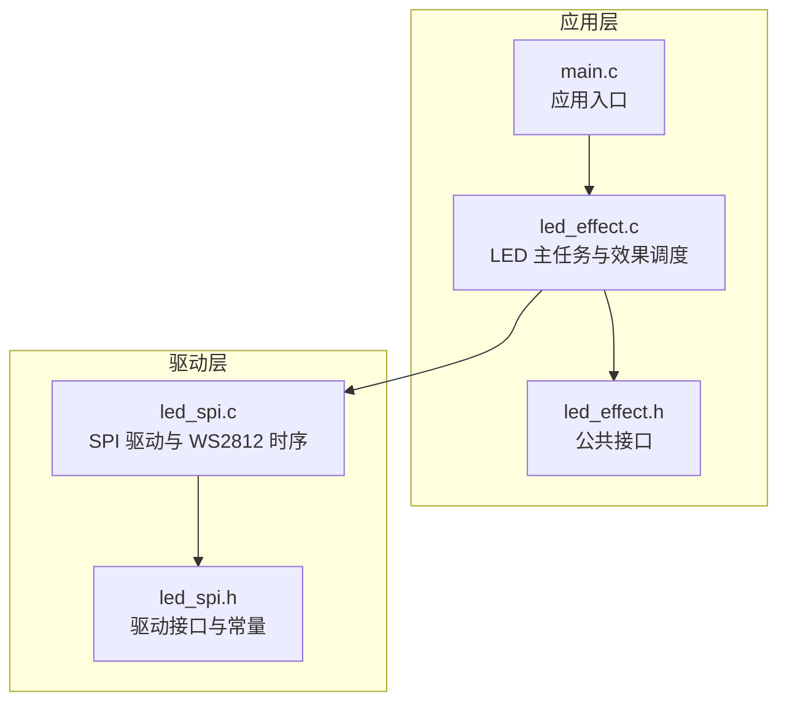
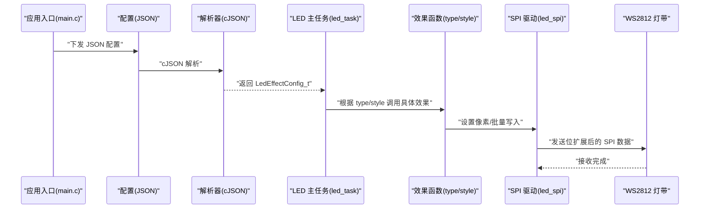
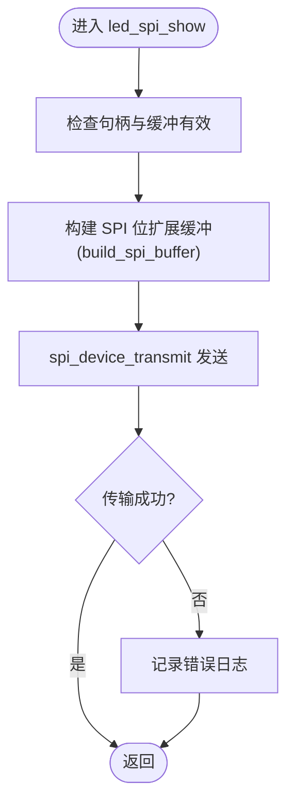
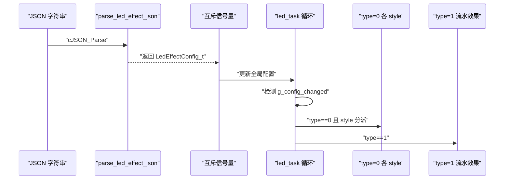
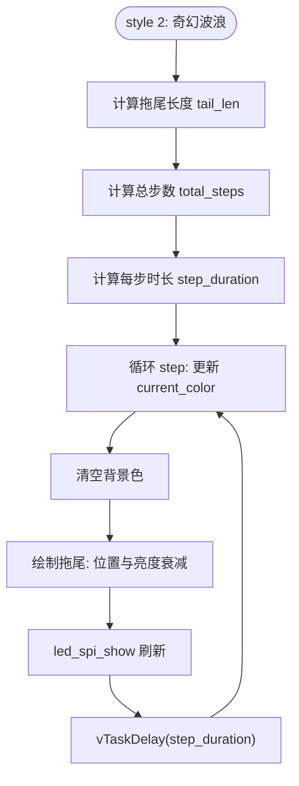
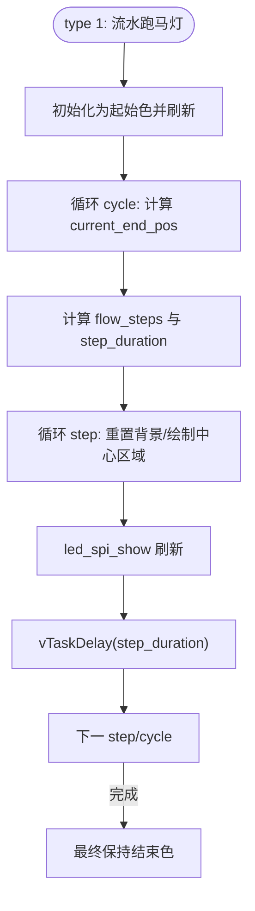
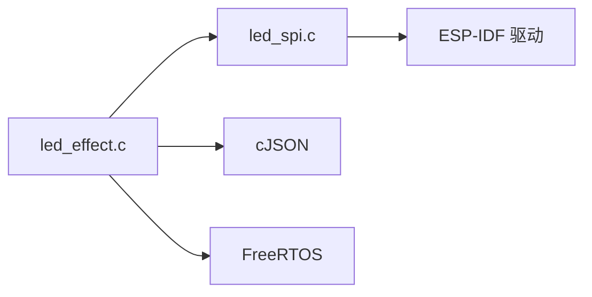

# LED 控制系统

<cite>
**本文引用的文件**
- [led_effect.c](file://main/app/led_strip/led_effect.c)
- [led_effect.h](file://main/app/led_strip/led_effect.h)
- [led_spi.c](file://main/app/led_strip/led_spi.c)
- [led_spi.h](file://main/app/led_strip/led_spi.h)
- [main.c](file://main/main.c)
</cite>

## 目录
1. [简介](#简介)
2. [项目结构](#项目结构)
3. [核心组件](#核心组件)
4. [架构总览](#架构总览)
5. [详细组件分析](#详细组件分析)
6. [依赖关系分析](#依赖关系分析)
7. [性能考虑](#性能考虑)
8. [故障排除指南](#故障排除指南)
9. [结论](#结论)
10. [附录](#附录)

## 简介
本文件为 LED 控制系统的综合技术文档，聚焦于以下方面：
- LED 驱动接口设计：基于 ESP-IDF 的 SPI 接口、WS2812 控制时序映射与 DMA 传输优化
- LED 效果算法实现：两色瞬变闪烁、活泼跳变、奇幻波浪、科技脉冲、流水跑马灯等视觉效果的数学模型与参数调节
- JSON 配置解析机制：配置格式定义、参数校验与动态更新
- 实时渲染算法：色彩插值、亮度控制与帧率优化策略
- 自定义开发指南：新增效果算法的接入方式与性能调优建议
- 配置示例与故障排除技巧

## 项目结构
本项目采用按功能模块划分的目录组织方式，LED 子系统位于 main/app/led_strip 目录下，包含驱动层（SPI）与效果层（效果算法与 JSON 解析），并通过 FreeRTOS 任务进行调度。

图表来源
- [main.c](file://main/main.c)
- [led_effect.c](file://main/app/led_strip/led_effect.c)
- [led_effect.h](file://main/app/led_strip/led_effect.h)
- [led_spi.c](file://main/app/led_strip/led_spi.c)
- [led_spi.h](file://main/app/led_strip/led_spi.h)

章节来源
- [led_effect.c:1-105](file://main/app/led_strip/led_effect.c#L1-L105)
- [led_spi.c:1-103](file://main/app/led_strip/led_spi.c#L1-L103)
- [led_spi.h:1-28](file://main/app/led_strip/led_spi.h#L1-L28)

## 核心组件
- LED 驱动接口（SPI + DMA）
  - 使用 ESP-IDF 的 spi_master 驱动，配置 MOSI 单向输出，HALFDUPLEX 模式
  - 通过 DMA 分配内存，确保大块像素数据传输的稳定性
  - 将每个 WS2812 像素的 24bit 数据按位展开为 SPI 字节序列，满足 0x80/0xE0 的高电平时间要求
- LED 效果引擎
  - 基于 FreeRTOS 任务循环，解析 JSON 配置，按类型与样式执行对应效果
  - 支持配置动态更新与暂停/恢复控制
- JSON 配置解析
  - 使用 cJSON 解析，支持 type、data.duration、data.cycles、data.color_st/ed、data.style、data.order、data.sum、data.pram.surge_intensity 等字段
  - 提供互斥锁保护全局配置，避免竞态条件

章节来源
- [led_spi.c:36-103](file://main/app/led_strip/led_spi.c#L36-L103)
- [led_spi.h:7-27](file://main/app/led_strip/led_spi.h#L7-L27)
- [led_effect.c:64-81](file://main/app/led_strip/led_effect.c#L64-L81)
- [led_effect.c:84-105](file://main/app/led_strip/led_effect.c#L84-L105)

## 架构总览
LED 子系统由“配置解析 + 效果调度 + 驱动渲染”三层组成，整体数据流如下：

图表来源
- [led_effect.c:398-441](file://main/app/led_strip/led_effect.c#L398-L441)
- [led_spi.c:80-92](file://main/app/led_strip/led_spi.c#L80-L92)

## 详细组件分析

### 驱动接口：SPI + DMA + WS2812 时序
- 时序映射
  - 每个 WS2812 像素需要 24bit（G7..G0, R7..R0, B7..B0），转换为 24 个 SPI 字节
  - 逻辑 1 对应高电平时间更长的码值，逻辑 0 对应较短的高电平时间，以匹配 WS2812 的 t1H/t0H 时间窗口
  - SPI 时钟频率设定为 3.2MHz，确保每个 bit 的高电平持续时间满足规格
- 内存与 DMA
  - 使用 MALLOC_CAP_DMA | MALLOC_CAP_INTERNAL 分配颜色缓冲与 SPI 位扩展缓冲
  - 通过一次性 spi_device_transmit 发送整条灯带数据，减少中断与上下文切换开销
- 接口能力
  - 单像素设置、批量设置、全清屏、获取内部缓冲指针
  - show() 触发渲染与传输，clear() 快速熄灭

图表来源
- [led_spi.c:80-92](file://main/app/led_strip/led_spi.c#L80-L92)
- [led_spi.c:20-34](file://main/app/led_strip/led_spi.c#L20-L34)

章节来源
- [led_spi.c:9-11](file://main/app/led_strip/led_spi.c#L9-L11)
- [led_spi.c:36-66](file://main/app/led_strip/led_spi.c#L36-L66)
- [led_spi.c:68-78](file://main/app/led_strip/led_spi.c#L68-L78)
- [led_spi.c:80-92](file://main/app/led_strip/led_spi.c#L80-L92)
- [led_spi.h:7-27](file://main/app/led_strip/led_spi.h#L7-L27)

### 效果引擎：配置解析与调度
- 配置结构
  - LedEffectConfig_t：包含 type 与 LedDataConfig_t
  - LedDataConfig_t：包含 duration、cycles、color_st/ed、style、order、sum、pram.surge_intensity 等
  - LedPram_t：包含 surge_intensity 等参数
- 解析流程
  - 使用 cJSON 解析 JSON 字符串，逐项提取字段并做基本校验
  - 通过互斥信号量保护全局配置，设置变更标志以触发效果重启
- 主任务循环
  - 初始化默认配置与 SPI
  - 在循环中读取当前配置，按 type 选择效果族，再按 style 选择具体实现
  - 支持暂停标志与配置变更中断，保证响应性

图表来源
- [led_effect.c:69-81](file://main/app/led_strip/led_effect.c#L69-L81)
- [led_effect.c:84-105](file://main/app/led_strip/led_effect.c#L84-L105)
- [led_effect.c:413-434](file://main/app/led_strip/led_effect.c#L413-L434)

章节来源
- [led_effect.c:25-44](file://main/app/led_strip/led_effect.c#L25-L44)
- [led_effect.c:69-81](file://main/app/led_strip/led_effect.c#L69-L81)
- [led_effect.c:84-105](file://main/app/led_strip/led_effect.c#L84-L105)
- [led_effect.c:398-441](file://main/app/led_strip/led_effect.c#L398-L441)

### 效果算法详解

#### 类型 0：基础闪烁与流动效果
- style 0：两色瞬变闪烁
  - 将灯带在起始色与结束色之间交替显示，周期可配置
  - 关键点：半周期时长、循环次数、快速切换
- style 1：活泼跳变（随机抖动）
  - 计算中间色与极值色，生成随机抖动路径，提升活力感
  - 关键点：步进总数、抖动幅度、颜色边界钳制
- style 2：奇幻波浪（流水灯/拖尾）
  - 使用滑动窗口与线性插值生成渐变波形，结合拖尾衰减实现流动感
  - 参数：surge_intensity 作为拖尾长度；按总步数线性插值颜色
- style 3：科技脉冲（高频爆闪）
  - 可按亮度或颜色进行高频闪烁；当起止色相同时按百分比亮度调节
  - 参数：surge_intensity 作为亮度百分比；固定 20ms 间隔

图表来源
- [led_effect.c:196-239](file://main/app/led_strip/led_effect.c#L196-L239)

章节来源
- [led_effect.c:125-150](file://main/app/led_strip/led_effect.c#L125-L150)
- [led_effect.c:152-196](file://main/app/led_strip/led_effect.c#L152-L196)
- [led_effect.c:196-239](file://main/app/led_strip/led_effect.c#L196-L239)
- [led_effect.c:241-292](file://main/app/led_strip/led_effect.c#L241-L292)

#### 类型 1：流水跑马灯
- 支持两种方向（order）、两种样式（style）
- 样式 0：每次步进将除中心外其余像素重置为起始色
- 样式 1：保留尾部区域，仅在中心移动时绘制
- 中心区域宽度由 sum 控制，步进时长按总步数均分

图表来源
- [led_effect.c:294-395](file://main/app/led_strip/led_effect.c#L294-L395)

章节来源
- [led_effect.c:294-395](file://main/app/led_strip/led_effect.c#L294-L395)

### 实时渲染与帧率优化
- 帧率控制
  - 每个效果内部通过 vTaskDelay(pdMS_TO_TICKS(...)) 控制步进时长
  - 主循环以固定小延迟轮询，避免忙等
- 插值与亮度
  - 线性插值用于颜色过渡（如波浪）
  - 亮度控制通过按比例缩放 RGB 分量实现（脉冲模式）
- 抗锯齿与平滑
  - 拖尾衰减采用线性比例，避免突变
  - 随机抖动引入轻微噪声，提升视觉动感

章节来源
- [led_effect.c:196-239](file://main/app/led_strip/led_effect.c#L196-L239)
- [led_effect.c:241-292](file://main/app/led_strip/led_effect.c#L241-L292)
- [led_effect.c:294-395](file://main/app/led_strip/led_effect.c#L294-L395)
- [led_effect.c:403-434](file://main/app/led_strip/led_effect.c#L403-L434)

## 依赖关系分析
- 组件耦合
  - led_effect.c 依赖 led_spi.c 进行像素设置与刷新
  - led_effect.c 依赖 cJSON 进行 JSON 解析
  - led_effect.c 依赖 FreeRTOS 进行任务与信号量管理
- 外部依赖
  - ESP-IDF SPI master、heap_caps、log、random
- 潜在风险
  - 配置更新与效果执行的并发访问需通过互斥信号量保护
  - DMA 内存不足会导致初始化失败，需监控堆栈与内存使用

图表来源
- [led_effect.c:1-10](file://main/app/led_strip/led_effect.c#L1-L10)
- [led_spi.c:1-6](file://main/app/led_strip/led_spi.c#L1-L6)

章节来源
- [led_effect.c:1-10](file://main/app/led_strip/led_effect.c#L1-L10)
- [led_spi.c:1-6](file://main/app/led_strip/led_spi.c#L1-L6)

## 性能考虑
- DMA 传输
  - 使用 DMA 内存分配与一次性传输，降低 CPU 占用与中断次数
  - 传输大小受 max_transfer_sz 限制，需与 LED 数量匹配
- 帧率与延迟
  - 合理设置 duration 与 cycles，避免过短导致丢帧
  - 在主循环中加入小延迟，平衡 CPU 占用与响应性
- 颜色插值
  - 线性插值成本低，适合实时渲染；复杂插值（如贝塞尔）会增加 CPU 开销
- 功耗与亮度
  - 通过亮度百分比控制降低功耗，注意在脉冲模式下的平均功率

## 故障排除指南
- 无法初始化 SPI
  - 检查 LED_GPIO 引脚是否正确，SPI_HOST 是否可用
  - 确认 DMA 内存分配是否成功（color_buffer/spi_buffer 非空）
- 传输失败
  - 查看日志中返回的错误码，确认 SPI 设备是否正确添加
- 效果不生效或卡住
  - 检查 g_config_changed 标志是否被正确复位
  - 确认 s_led_paused 未被意外置位
- 颜色异常
  - 确认颜色通道顺序为 GRB（led_spi_set_pixel 第二参为 R）
  - 检查 surr_intensity 与亮度参数范围（0~100）

章节来源
- [led_spi.c:36-66](file://main/app/led_strip/led_spi.c#L36-L66)
- [led_spi.c:80-92](file://main/app/led_strip/led_spi.c#L80-L92)
- [led_effect.c:403-434](file://main/app/led_strip/led_effect.c#L403-L434)

## 结论
该 LED 控制系统通过清晰的分层设计实现了稳定的 SPI 驱动与丰富的视觉效果。其基于 JSON 的配置机制便于动态更新与远程控制，配合 DMA 传输与合理的帧率控制，在资源受限的嵌入式平台上实现了流畅的实时渲染。未来可在插值算法、多任务优先级与配置校验方面进一步增强。

## 附录

### JSON 配置格式定义
- 根对象
  - type: number（0/1）
  - data: object
    - duration: number（毫秒）
    - cycles: number（循环次数）
    - color_st: array<number>[3]（起始 RGB）
    - color_ed: array<number>[3]（结束 RGB）
    - style: number（0/1/2/3，type=0 时使用）
    - order: number（0/1，type=1 时使用）
    - sum: number（中心区域宽度，type=1 时使用）
    - pram: object（参数集）
      - surge_intensity: number（拖尾长度/亮度百分比）
- 示例
  - 默认配置已内置于主任务，可参考源码中的默认 JSON 字符串

章节来源
- [led_effect.c:84-105](file://main/app/led_strip/led_effect.c#L84-L105)
- [led_effect.c:398-401](file://main/app/led_strip/led_effect.c#L398-L401)

### 新增效果算法步骤
- 步骤
  - 在 led_effect.c 中新增静态效果函数（命名规范：led_effect_typeX_styleY）
  - 在 led_task 的分派处添加新的 style 分支
  - 在 JSON 配置中设置 type=0 与对应的 style
  - 如需额外参数，扩展 LedPram_t 并在 JSON 解析中读取
- 注意事项
  - 使用 CLAMP/MIN/MAX 等宏确保数值合法
  - 在循环中及时检查 g_config_changed 与 s_led_paused
  - 控制 vTaskDelay 的粒度，避免阻塞主循环

章节来源
- [led_effect.c:55-61](file://main/app/led_strip/led_effect.c#L55-L61)
- [led_effect.c:421-431](file://main/app/led_strip/led_effect.c#L421-L431)