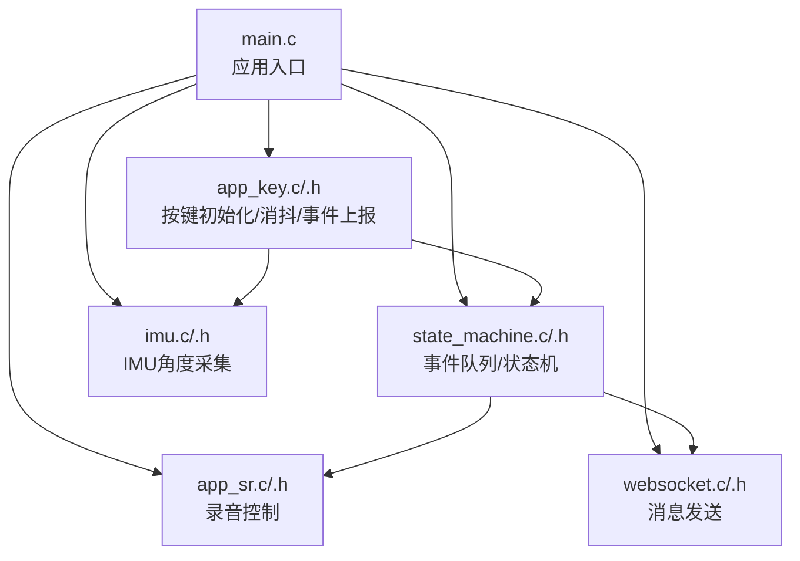
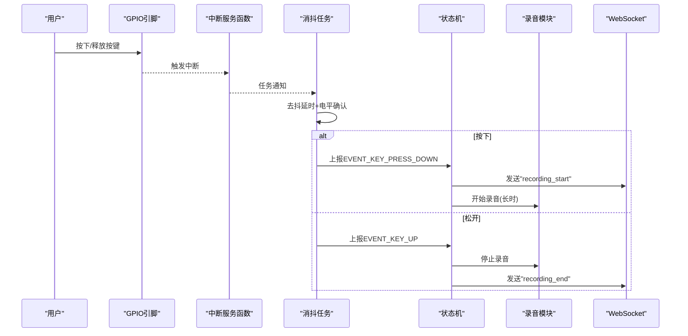
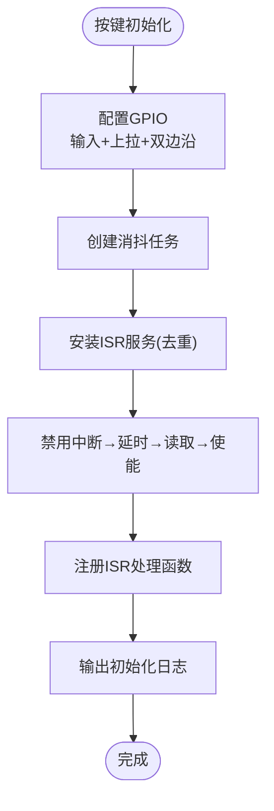
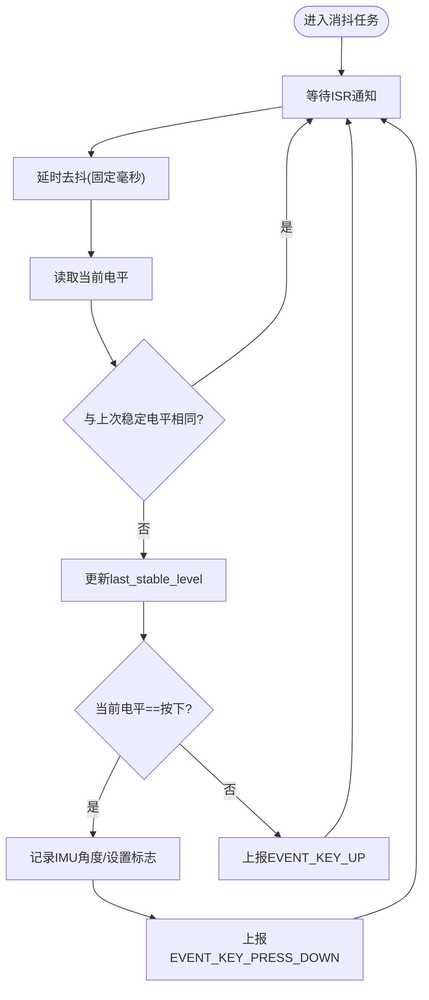
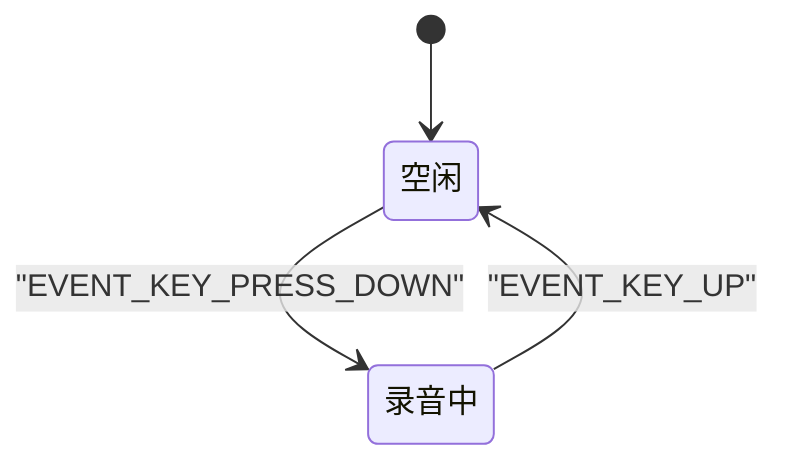
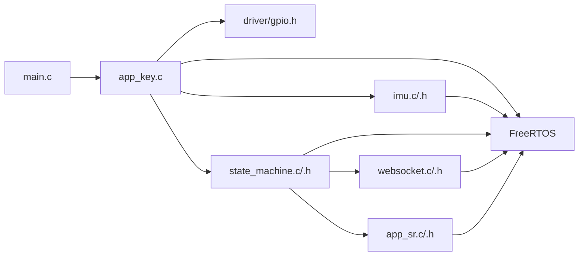

# 按键事件处理

<cite>
**本文引用的文件列表**
- [main.c](file://main/main.c)
- [app_key.h](file://main/app/key/app_key.h)
- [app_key.c](file://main/app/key/app_key.c)
- [state_machine.h](file://main/app/state_machine/state_machine.h)
- [state_machine.c](file://main/app/state_machine/state_machine.c)
- [imu.h](file://main/app/imu/imu.h)
- [imu.c](file://main/app/imu/imu.c)
- [app_sr.h](file://main/app/audio/app_sr.h)
- [app_sr.c](file://main/app/audio/app_sr.c)
- [websocket.h](file://main/app/websocket/websocket.h)
- [websocket.c](file://main/app/websocket/websocket.c)
</cite>

## 目录
1. [简介](#简介)
2. [项目结构](#项目结构)
3. [核心组件](#核心组件)
4. [架构总览](#架构总览)
5. [详细组件分析](#详细组件分析)
6. [依赖关系分析](#依赖关系分析)
7. [性能考量](#性能考量)
8. [故障排查指南](#故障排查指南)
9. [结论](#结论)
10. [附录](#附录)

## 简介
本技术文档围绕按键事件处理模块进行深入解析，涵盖按键硬件接口（GPIO 配置、中断处理）、按键防抖算法（去抖时间参数、滤波思路、状态机设计）、事件检测机制（单击、长按、双击的识别策略）、按键事件与状态机的集成（事件队列管理与优先级处理）、按键配置自定义与灵敏度调节方法，以及常见问题的诊断与解决建议。文档同时提供代码级架构图与流程图，帮助读者快速理解模块设计与实现细节。

## 项目结构
按键事件处理模块位于 main/app/key 目录，主要文件包括：
- app_key.h / app_key.c：按键初始化、GPIO 中断、消抖任务与事件上报
- state_machine.h / state_machine.c：状态机定义与事件处理队列
- imu.h / imu.c：IMU 角度采集接口，用于按键按下时记录姿态
- app_sr.h / app_sr.c：语音识别录音控制接口，配合状态机完成录音启停
- websocket.h / websocket.c：状态机发送“录音开始/结束”消息的通道
- main.c：应用入口，负责初始化各子系统并启动按键模块

图表来源
- [main.c:33-60](file://main/main.c#L33-L60)
- [app_key.c:72-104](file://main/app/key/app_key.c#L72-L104)
- [state_machine.c:24-57](file://main/app/state_machine/state_machine.c#L24-L57)
- [imu.c:77-81](file://main/app/imu/imu.c#L77-L81)
- [app_sr.c:76-99](file://main/app/audio/app_sr.c#L76-L99)
- [websocket.c:580-630](file://main/app/websocket/websocket.c#L580-L630)

章节来源
- [main.c:33-60](file://main/main.c#L33-L60)

## 核心组件
- 按键硬件接口与中断
  - 使用 GPIO 输入模式，内部上拉，双边沿触发，以捕获按键按下与释放两个边沿
  - 中断服务函数仅做任务通知，避免在 ISR 中执行耗时操作
- 消抖与事件处理任务
  - 采用固定延时消抖（去抖时间可配置），延时后再读取电平确认
  - 记录按键按下时的 IMU 角度，设置按键标志位
  - 将按键事件通过状态机接口上报
- 状态机与事件队列
  - 使用 FreeRTOS 队列承载事件，状态机任务阻塞式消费
  - 支持按键按下进入录音状态，按键松开退出录音状态
- 事件上报与联动
  - 状态机在录音开始/结束时通过 WebSocket 发送 JSON 消息
  - 录音控制由语音识别模块提供 API，支持手动停止

章节来源
- [app_key.c:72-104](file://main/app/key/app_key.c#L72-L104)
- [app_key.c:32-70](file://main/app/key/app_key.c#L32-L70)
- [state_machine.c:24-57](file://main/app/state_machine/state_machine.c#L24-L57)
- [state_machine.c:83-115](file://main/app/state_machine/state_machine.c#L83-L115)
- [websocket.c:580-630](file://main/app/websocket/websocket.c#L580-L630)
- [app_sr.c:76-99](file://main/app/audio/app_sr.c#L76-L99)

## 架构总览
按键事件处理的整体流程如下：
- 应用入口初始化 IMU、按键、LED、状态机、网络与录音模块
- 按键初始化配置 GPIO、安装 ISR、创建消抖任务
- 按键触发中断后，ISR 通知消抖任务；消抖任务确认电平变化并上报事件
- 状态机接收事件，切换录音状态并发送消息
- 录音由语音识别模块控制，按键松开即停止

图表来源
- [app_key.c:22-30](file://main/app/key/app_key.c#L22-L30)
- [app_key.c:32-70](file://main/app/key/app_key.c#L32-L70)
- [state_machine.c:37-47](file://main/app/state_machine/state_machine.c#L37-L47)
- [state_machine.c:83-115](file://main/app/state_machine/state_machine.c#L83-L115)
- [websocket.c:580-630](file://main/app/websocket/websocket.c#L580-L630)
- [app_sr.c:76-99](file://main/app/audio/app_sr.c#L76-L99)

## 详细组件分析

### 组件一：按键硬件接口与中断处理
- GPIO 配置
  - 输入模式、内部上拉、双边沿触发，确保按下与释放均能触发
  - 引脚号与去抖延时在源码中以宏定义形式集中管理
- 中断处理
  - ISR 仅发送任务通知，避免在中断上下文中执行复杂逻辑
  - 使用 FreeRTOS 任务通知数组条目为 1 的特性，确保通知安全传递
- 初始化流程
  - 配置 GPIO
  - 创建高优先级消抖任务
  - 安装 ISR 服务（避免重复安装）
  - 清理残留中断标志后注册中断处理函数
  - 输出初始化日志便于调试

图表来源
- [app_key.c:72-104](file://main/app/key/app_key.c#L72-L104)

章节来源
- [app_key.c:72-104](file://main/app/key/app_key.c#L72-L104)

### 组件二：按键防抖算法与状态机设计
- 去抖时间参数
  - 固定去抖延时（毫秒级），在消抖任务中延时后再读取电平
  - 初始稳定电平读取与启动后短暂延时，规避上电瞬态与系统初始化不稳定期
- 滤波与稳定性判断
  - 仅当两次读取电平不一致时才认为发生了有效状态变化
  - 通过 last_stable_level 记录上次稳定电平，避免抖动导致的误判
- 状态机集成
  - 按下：记录 IMU 角度，设置按键标志，上报按下事件
  - 松开：上报松开事件
  - 状态机负责后续动作（录音启停、消息发送）

图表来源
- [app_key.c:32-70](file://main/app/key/app_key.c#L32-L70)

章节来源
- [app_key.c:32-70](file://main/app/key/app_key.c#L32-L70)

### 组件三：事件检测机制（单击、长按、双击）
- 当前实现
  - 仅支持按键按下与松开两类事件，分别对应录音开始与结束
  - 未实现长按与双击识别逻辑
- 可扩展方案
  - 在消抖任务中引入时间窗口计数，结合松开事件统计按键持续时间，判定长按
  - 引入双击检测窗口，在窗口内统计按键次数，结合松开事件判定双击
  - 以上扩展建议基于现有事件上报机制，不影响当前状态机与录音控制

章节来源
- [state_machine.c:83-115](file://main/app/state_machine/state_machine.c#L83-L115)
- [app_key.c:32-70](file://main/app/key/app_key.c#L32-L70)

### 组件四：按键事件与状态机的集成
- 事件队列与优先级
  - 状态机使用 FreeRTOS 队列承载事件，队列容量与任务优先级在初始化时设定
  - 状态机任务阻塞式接收事件，保证事件处理的顺序性与实时性
- 事件处理流程
  - 空闲态收到按下事件：发送录音开始消息、启动录音、切换到录音态
  - 录音态收到松开事件：停止录音、发送录音结束消息、回到空闲态
- 与录音模块的协作
  - 录音启停由语音识别模块提供的 API 控制，状态机负责时机与消息
  - 录音最大时长参数可在状态机中配置，当前实现以较长时长避免超时

图表来源
- [state_machine.c:83-115](file://main/app/state_machine/state_machine.c#L83-L115)
- [state_machine.c:24-57](file://main/app/state_machine/state_machine.c#L24-L57)

章节来源
- [state_machine.c:24-57](file://main/app/state_machine/state_machine.c#L24-L57)
- [state_machine.c:83-115](file://main/app/state_machine/state_machine.c#L83-L115)

### 组件五：按键配置自定义与灵敏度调节
- 可配置项
  - 按键引脚号：在源码中以宏定义集中管理
  - 去抖延时（毫秒）：在源码中以宏定义集中管理
- 调整建议
  - 引脚号：根据硬件布局修改宏定义
  - 去抖延时：根据硬件抖动情况与系统负载适当增大或减小
- 外部接口
  - 提供按键标志位与最近记录角度的访问接口，便于外部查询与调试

章节来源
- [app_key.c:10-12](file://main/app/key/app_key.c#L10-L12)
- [app_key.c:106-117](file://main/app/key/app_key.c#L106-L117)

## 依赖关系分析
按键事件处理模块与其他子系统的依赖关系如下：
- main.c：应用入口，负责初始化 IMU、按键、LED、状态机、网络与录音模块
- app_key.c：依赖 GPIO、FreeRTOS、IMU、状态机
- state_machine.c：依赖 FreeRTOS 队列、WebSocket、语音识别模块
- imu.c：提供 IMU 角度读取接口
- app_sr.c：提供录音启停 API
- websocket.c：提供消息发送接口

图表来源
- [main.c:33-60](file://main/main.c#L33-L60)
- [app_key.c:1-8](file://main/app/key/app_key.c#L1-L8)
- [state_machine.c:1-8](file://main/app/state_machine/state_machine.c#L1-L8)
- [imu.c:1-9](file://main/app/imu/imu.c#L1-L9)
- [app_sr.c:1-11](file://main/app/audio/app_sr.c#L1-L11)
- [websocket.c:1-7](file://main/app/websocket/websocket.c#L1-L7)

章节来源
- [main.c:33-60](file://main/main.c#L33-L60)
- [app_key.c:1-8](file://main/app/key/app_key.c#L1-L8)
- [state_machine.c:1-8](file://main/app/state_machine/state_machine.c#L1-L8)

## 性能考量
- 中断处理轻量化
  - ISR 仅做任务通知，避免在中断上下文执行耗时操作，降低中断延迟
- 消抖策略
  - 固定延时消抖简单可靠，适合大多数场景；若对抖动敏感，可考虑多点采样与滑动窗口平均
- 任务优先级
  - 消抖任务优先级高于普通任务，确保按键响应及时
- 队列与消息
  - 状态机使用队列承载事件，避免事件丢失；消息发送在连接可用时进行，减少无效发送

## 故障排查指南
- 按键无响应
  - 检查 GPIO 配置是否正确（输入、上拉、双边沿）
  - 确认 ISR 是否安装且未重复安装
  - 查看初始化日志，确认按键初始化完成
- 按键误触发或抖动
  - 调整去抖延时参数，增大以抑制抖动
  - 检查硬件电路（上拉电阻、走线干扰）
- 状态机不工作
  - 确认状态机初始化成功，队列创建成功
  - 检查事件上报路径，确保按键事件能进入状态机队列
- 录音未停止
  - 确认按键松开事件被正确上报
  - 检查录音模块的停止接口是否被调用
- WebSocket 消息未发送
  - 确认连接状态，检查消息发送接口返回值
  - 查看日志输出，定位发送失败原因

章节来源
- [app_key.c:72-104](file://main/app/key/app_key.c#L72-L104)
- [state_machine.c:24-57](file://main/app/state_machine/state_machine.c#L24-L57)
- [websocket.c:580-630](file://main/app/websocket/websocket.c#L580-L630)
- [app_sr.c:76-99](file://main/app/audio/app_sr.c#L76-L99)

## 结论
按键事件处理模块采用“轻量 ISR + 消抖任务 + 状态机队列”的架构，实现了按键硬件接口、防抖与事件上报的完整闭环。当前版本聚焦于单击（按下/松开）事件，配合状态机完成录音启停与消息发送。未来可在此基础上扩展长按与双击识别，进一步提升交互体验。通过集中式的宏定义与清晰的模块边界，该实现具备良好的可维护性与可扩展性。

## 附录
- 关键接口与宏定义位置
  - 按键引脚与去抖延时：[app_key.c:10-12](file://main/app/key/app_key.c#L10-L12)
  - 按键初始化：[app_key.c:72-104](file://main/app/key/app_key.c#L72-L104)
  - 消抖任务与事件上报：[app_key.c:32-70](file://main/app/key/app_key.c#L32-L70)
  - 状态机初始化与事件处理：[state_machine.c:24-57](file://main/app/state_machine/state_machine.c#L24-L57), [state_machine.c:83-115](file://main/app/state_machine/state_machine.c#L83-L115)
  - IMU 角度读取：[imu.c:77-81](file://main/app/imu/imu.c#L77-L81)
  - 录音控制接口：[app_sr.c:76-99](file://main/app/audio/app_sr.c#L76-L99)
  - WebSocket 消息发送：[websocket.c:580-630](file://main/app/websocket/websocket.c#L580-L630)