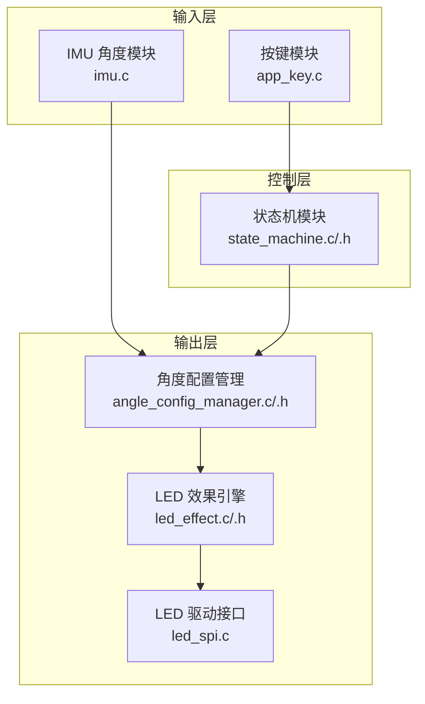
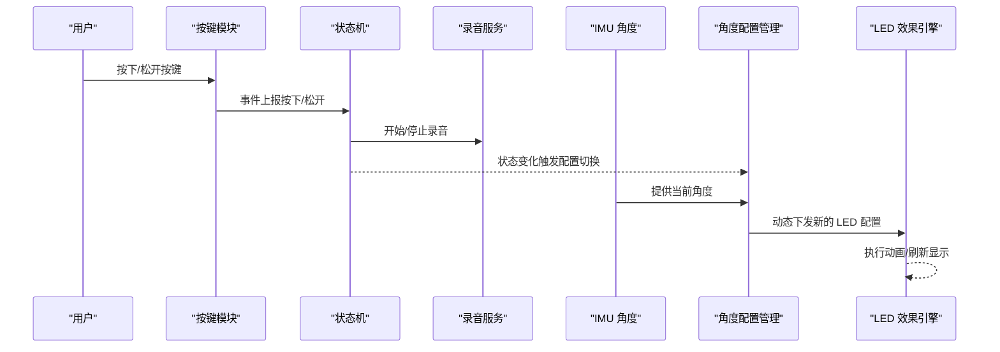
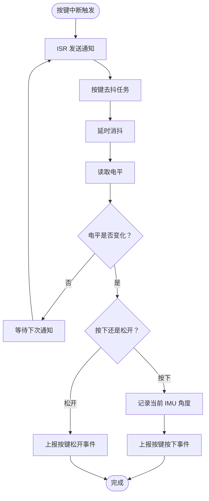
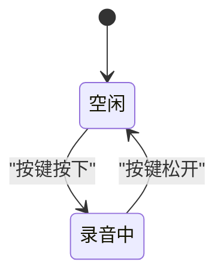
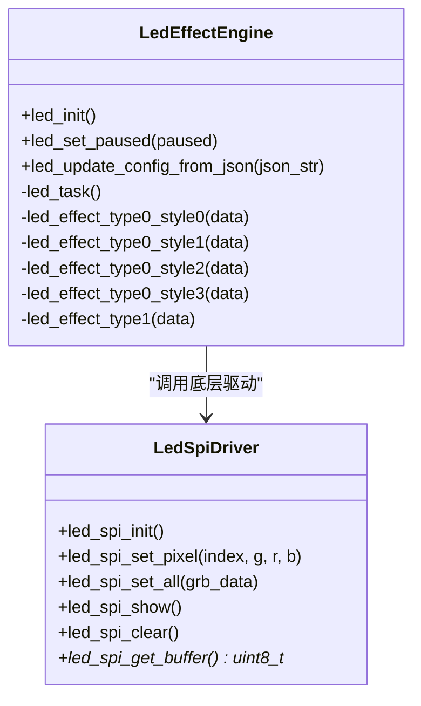
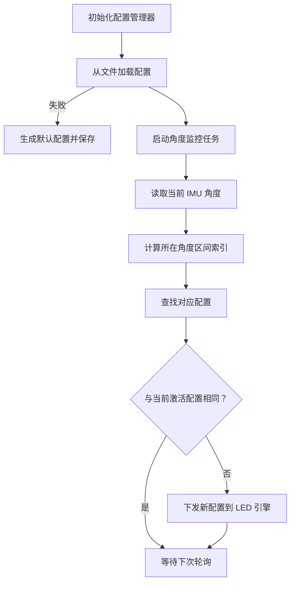
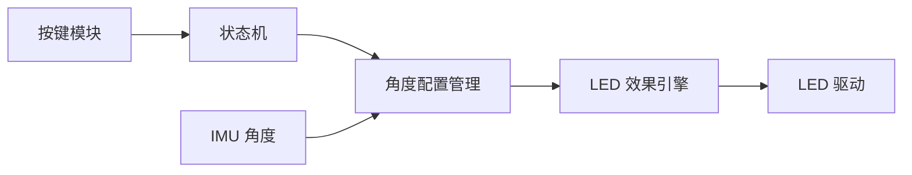

# 用户交互系统

<cite>
**本文档引用的文件**
- [main/app/key/app_key.c](file://main/app/key/app_key.c)
- [main/app/key/app_key.h](file://main/app/key/app_key.h)
- [main/app/state_machine/state_machine.h](file://main/app/state_machine/state_machine.h)
- [main/app/state_machine/state_machine.c](file://main/app/state_machine/state_machine.c)
- [main/app/led_strip/led_effect.c](file://main/app/led_strip/led_effect.c)
- [main/app/led_strip/led_effect.h](file://main/app/led_strip/led_effect.h)
- [main/app/led_strip/led_spi.c](file://main/app/led_strip/led_spi.c)
- [main/app/angle/angle_config_manager.h](file://main/app/angle/angle_config_manager.h)
- [main/app/angle/angle_config_manager.c](file://main/app/angle/angle_config_manager.c)
- [main/app/imu/imu.c](file://main/app/imu/imu.c)
</cite>

## 目录
1. [简介](#简介)
2. [项目结构](#项目结构)
3. [核心组件](#核心组件)
4. [架构总览](#架构总览)
5. [详细组件分析](#详细组件分析)
6. [依赖关系分析](#依赖关系分析)
7. [性能考虑](#性能考虑)
8. [故障排查指南](#故障排查指南)
9. [结论](#结论)
10. [附录](#附录)

## 简介
本文件面向“用户交互系统”的综合技术文档，围绕以下目标展开：按键事件处理机制（硬件检测、防抖策略、事件分发）、LED 效果控制系统（驱动接口、动画算法、JSON 配置解析与动态切换）、角度配置管理系统（角度分箱、配置存储与动态切换）、以及响应时间优化、状态同步与用户体验设计。同时提供交互行为自定义与扩展方法，帮助开发者在现有框架基础上进行二次开发。

## 项目结构
该系统采用模块化组织方式，按键输入、状态机、IMU 角度采集、LED 控制与角度配置管理分别位于独立模块中，通过清晰的接口耦合，形成从“输入—状态—输出”的闭环。

图表来源
- [main/app/key/app_key.c:1-117](file://main/app/key/app_key.c#L1-L117)
- [main/app/state_machine/state_machine.c:1-115](file://main/app/state_machine/state_machine.c#L1-L115)
- [main/app/led_strip/led_spi.c:36-103](file://main/app/led_strip/led_spi.c#L36-L103)
- [main/app/led_strip/led_effect.c:124-441](file://main/app/led_strip/led_effect.c#L124-L441)
- [main/app/angle/angle_config_manager.c:1-204](file://main/app/angle/angle_config_manager.c#L1-L204)
- [main/app/imu/imu.c](file://main/app/imu/imu.c)

章节来源
- [main/app/key/app_key.c:1-117](file://main/app/key/app_key.c#L1-L117)
- [main/app/state_machine/state_machine.c:1-115](file://main/app/state_machine/state_machine.c#L1-L115)
- [main/app/led_strip/led_spi.c:36-103](file://main/app/led_strip/led_spi.c#L36-L103)
- [main/app/led_strip/led_effect.c:124-441](file://main/app/led_strip/led_effect.c#L124-L441)
- [main/app/angle/angle_config_manager.c:1-204](file://main/app/angle/angle_config_manager.c#L1-L204)
- [main/app/imu/imu.c](file://main/app/imu/imu.c)

## 核心组件
- 按键事件处理：基于 GPIO 中断与 FreeRTOS 通知的低延迟按键检测，配合软件消抖与事件上报。
- 状态机：以队列驱动的状态机，负责按键事件到录音控制的编排。
- LED 控制：LED 驱动封装 SPI+DMA，效果引擎支持多种样式与参数化配置。
- 角度配置管理：按 IMU 角度分箱存储配置，周期性检测当前角度并动态切换 LED 效果。

章节来源
- [main/app/key/app_key.c:1-117](file://main/app/key/app_key.c#L1-L117)
- [main/app/state_machine/state_machine.c:1-115](file://main/app/state_machine/state_machine.c#L1-L115)
- [main/app/led_strip/led_spi.c:36-103](file://main/app/led_strip/led_spi.c#L36-L103)
- [main/app/led_strip/led_effect.c:124-441](file://main/app/led_strip/led_effect.c#L124-L441)
- [main/app/angle/angle_config_manager.c:1-204](file://main/app/angle/angle_config_manager.c#L1-L204)

## 架构总览
系统从按键输入开始，经由状态机协调录音流程，同时根据 IMU 角度动态下发 LED 配置，最终由 LED 驱动执行显示。整体数据流如下：

图表来源
- [main/app/key/app_key.c:22-70](file://main/app/key/app_key.c#L22-L70)
- [main/app/state_machine/state_machine.c:37-115](file://main/app/state_machine/state_machine.c#L37-L115)
- [main/app/angle/angle_config_manager.c:177-193](file://main/app/angle/angle_config_manager.c#L177-L193)
- [main/app/led_strip/led_effect.c:403-434](file://main/app/led_strip/led_effect.c#L403-L434)

## 详细组件分析

### 按键事件处理机制
- 硬件检测与中断：按键引脚配置为上拉输入，启用任意边沿中断；ISR 仅做通知，避免在中断中执行耗时操作。
- 软件消抖：在高优先级任务中延时固定时间再次采样，确保电平稳定后再判定事件。
- 事件分发：按下时记录当前 IMU 角度并上报“按键按下”事件；松开时上报“按键松开”事件，交由状态机处理。

图表来源
- [main/app/key/app_key.c:22-70](file://main/app/key/app_key.c#L22-L70)

章节来源
- [main/app/key/app_key.c:1-117](file://main/app/key/app_key.c#L1-L117)

### 状态机与事件分发
- 事件模型：仅包含“按键按下”和“按键松开”，状态包括“空闲”和“录音中”。
- 处理逻辑：空闲状态下收到“按键按下”即启动录音并切换至录音状态；录音状态下收到“按键松开”即停止录音并回到空闲。
- WebSocket 通知：在录音开始/结束时通过 WebSocket 发送 JSON 文本，便于上位机或云端感知。

图表来源
- [main/app/state_machine/state_machine.h:6-17](file://main/app/state_machine/state_machine.h#L6-L17)
- [main/app/state_machine/state_machine.c:83-115](file://main/app/state_machine/state_machine.c#L83-L115)

章节来源
- [main/app/state_machine/state_machine.h:1-34](file://main/app/state_machine/state_machine.h#L1-L34)
- [main/app/state_machine/state_machine.c:1-115](file://main/app/state_machine/state_machine.c#L1-L115)

### LED 效果控制系统
- 驱动接口：基于 SPI 的 LED 驱动，使用 DMA 缓冲区提升传输效率；提供像素设置、全量设置、刷新显示等接口。
- 动画算法：内置多种效果类型与样式（如两色瞬变、活泼跳变、流水跑马灯等），支持循环次数、持续时间、颜色渐变等参数。
- 配置解析与动态切换：通过 JSON 解析得到当前效果配置；LED 任务周期读取配置并执行动画；支持暂停/恢复与配置变更重启。

图表来源
- [main/app/led_strip/led_spi.c:36-103](file://main/app/led_strip/led_spi.c#L36-L103)
- [main/app/led_strip/led_effect.c:124-441](file://main/app/led_strip/led_effect.c#L124-L441)

章节来源
- [main/app/led_strip/led_spi.c:36-103](file://main/app/led_strip/led_spi.c#L36-L103)
- [main/app/led_strip/led_effect.c:124-441](file://main/app/led_strip/led_effect.c#L124-L441)
- [main/app/led_strip/led_effect.h:1-10](file://main/app/led_strip/led_effect.h#L1-L10)

### 角度配置管理系统
- 角度分箱：将俯仰角与横滚角划分为多个区间，形成二维索引表，便于快速定位当前角度所属配置。
- 配置存储：使用 SPIFFS 文件保存配置，包含版本号、默认配置、分箱边界与每个区间的配置矩阵。
- 动态切换：定时任务读取当前角度，查找对应配置，若与当前激活配置不同则下发新配置并播放提示音效。

图表来源
- [main/app/angle/angle_config_manager.c:177-193](file://main/app/angle/angle_config_manager.c#L177-L193)
- [main/app/angle/angle_config_manager.c:95-144](file://main/app/angle/angle_config_manager.c#L95-L144)

章节来源
- [main/app/angle/angle_config_manager.h:1-19](file://main/app/angle/angle_config_manager.h#L1-L19)
- [main/app/angle/angle_config_manager.c:1-204](file://main/app/angle/angle_config_manager.c#L1-L204)

## 依赖关系分析
- 按键模块依赖 FreeRTOS 的通知机制与 GPIO 驱动，向上游状态机提供事件。
- 状态机依赖录音服务与 WebSocket 通道，向下联动角度配置管理器。
- 角度配置管理器依赖 IMU 角度模块与 LED 效果引擎，负责配置的动态下发。
- LED 效果引擎依赖 LED 驱动接口，负责将配置转换为像素数据并刷新显示。

图表来源
- [main/app/key/app_key.c:1-117](file://main/app/key/app_key.c#L1-L117)
- [main/app/state_machine/state_machine.c:1-115](file://main/app/state_machine/state_machine.c#L1-L115)
- [main/app/angle/angle_config_manager.c:1-204](file://main/app/angle/angle_config_manager.c#L1-L204)
- [main/app/led_strip/led_effect.c:124-441](file://main/app/led_strip/led_effect.c#L124-L441)
- [main/app/led_strip/led_spi.c:36-103](file://main/app/led_strip/led_spi.c#L36-L103)
- [main/app/imu/imu.c](file://main/app/imu/imu.c)

章节来源
- [main/app/key/app_key.c:1-117](file://main/app/key/app_key.c#L1-L117)
- [main/app/state_machine/state_machine.c:1-115](file://main/app/state_machine/state_machine.c#L1-L115)
- [main/app/angle/angle_config_manager.c:1-204](file://main/app/angle/angle_config_manager.c#L1-L204)
- [main/app/led_strip/led_effect.c:124-441](file://main/app/led_strip/led_effect.c#L124-L441)
- [main/app/led_strip/led_spi.c:36-103](file://main/app/led_strip/led_spi.c#L36-L103)
- [main/app/imu/imu.c](file://main/app/imu/imu.c)

## 性能考虑
- 中断与任务分离：ISR 仅做轻量通知，避免阻塞与抖动；去抖任务在高优先级运行，缩短响应时间。
- SPI+DMA 传输：LED 驱动使用 DMA 缓冲区与一次性事务传输，降低 CPU 占用与刷新延迟。
- 配置变更短路：当检测到配置变更时立即中断当前动画并重启，保证视觉一致性。
- 角度轮询节流：角度监控任务以固定周期轮询，避免频繁 IO；在状态机事件驱动下减少不必要的切换。

## 故障排查指南
- 按键无响应
  - 检查按键引脚配置与上拉电阻是否正确。
  - 确认中断已安装且未被重复安装。
  - 查看去抖延时是否过小导致误判。
- LED 不亮或闪烁异常
  - 检查 SPI 引脚配置与主机初始化参数。
  - 确认 DMA 缓冲区分配成功且未越界。
  - 观察配置 JSON 是否合法，LED 任务是否正常运行。
- 角度配置不生效
  - 确认 IMU 角度读取正常。
  - 检查分箱边界与当前角度是否落入同一区间。
  - 核对配置文件路径与 SPIFFS 是否挂载成功。
- 状态机事件未触发
  - 确认事件入队成功且状态机任务未阻塞。
  - 检查 WebSocket 连接状态，避免消息发送失败。

章节来源
- [main/app/key/app_key.c:72-104](file://main/app/key/app_key.c#L72-L104)
- [main/app/led_strip/led_spi.c:36-103](file://main/app/led_strip/led_spi.c#L36-L103)
- [main/app/angle/angle_config_manager.c:95-144](file://main/app/angle/angle_config_manager.c#L95-L144)
- [main/app/state_machine/state_machine.c:37-81](file://main/app/state_machine/state_machine.c#L37-L81)

## 结论
该用户交互系统通过“按键—状态机—IMU—LED”的链路实现了低延迟、可配置、可扩展的交互体验。按键模块提供可靠的输入基础，状态机统一编排录音与消息通知，角度配置管理器将物理姿态映射到视觉效果，LED 驱动与效果引擎确保流畅的显示表现。整体设计具备良好的模块解耦与扩展空间，适合进一步增强交互能力与用户体验。

## 附录
- 自定义与扩展建议
  - 新增按键事件：在按键模块中扩展事件类型并在状态机中添加处理分支。
  - 新增 LED 效果：在效果引擎中新增类型与样式函数，并在 JSON 中扩展对应字段。
  - 新增角度区域：调整分箱边界数组并在保存/加载逻辑中兼容版本升级。
  - 优化响应时间：缩短去抖延时、增大 LED 刷新频率、合并配置变更处理。
  - 增强稳定性：加入超时保护、错误回退与日志统计，便于问题定位。