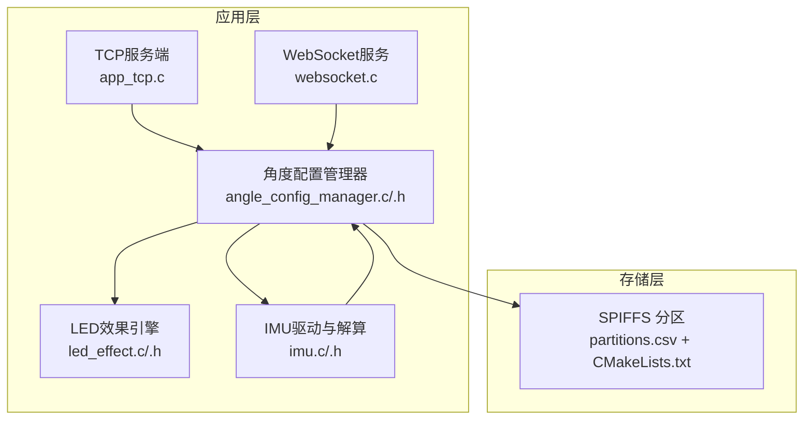
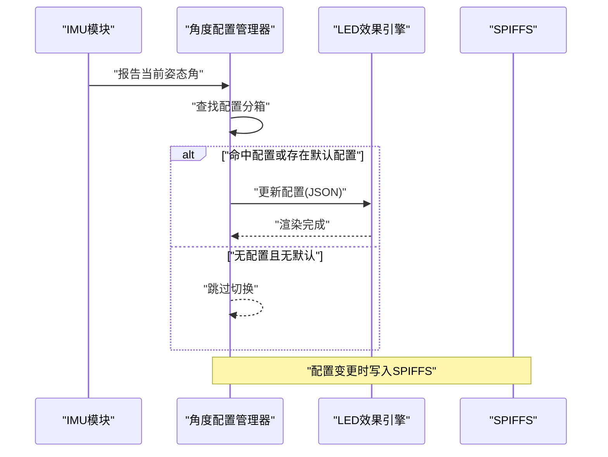
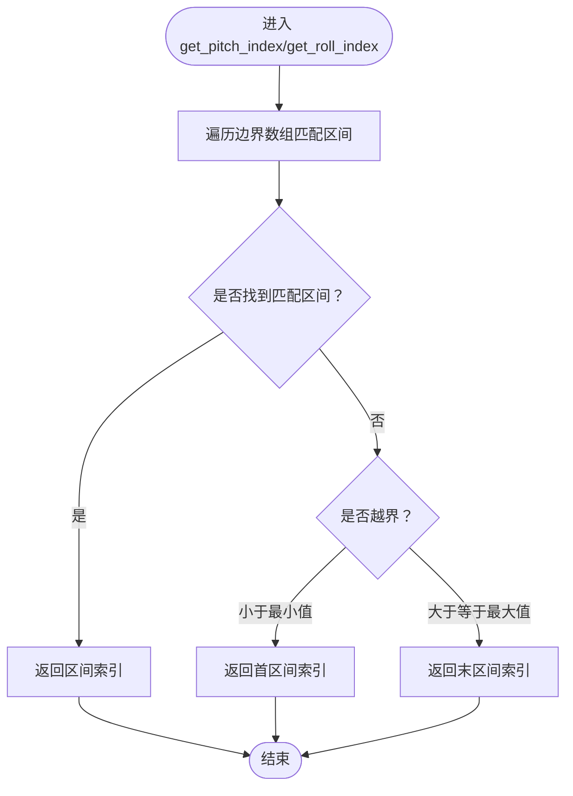
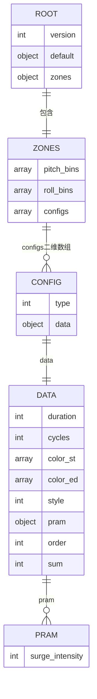
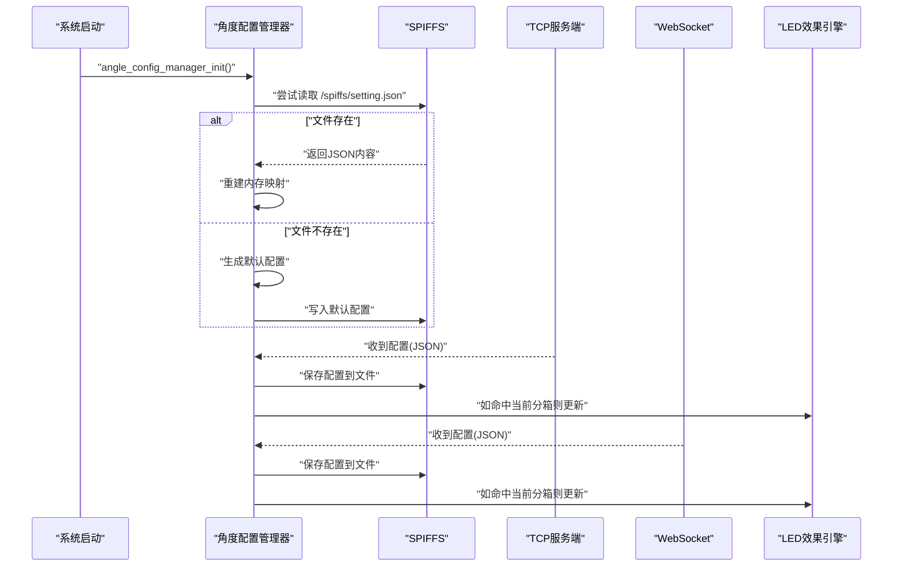
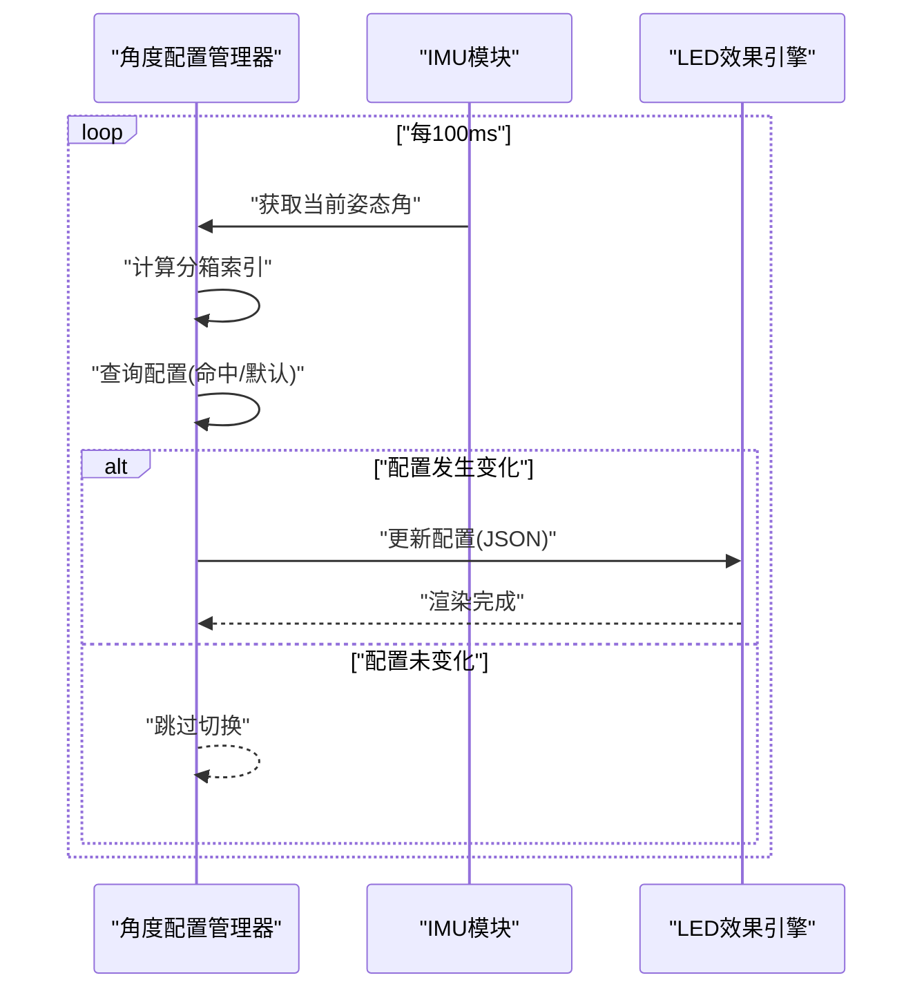
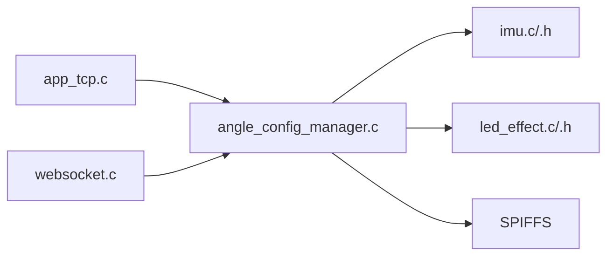

# 角度配置管理

<cite>
**本文引用的文件**
- [angle_config_manager.h](file://main/app/angle/angle_config_manager.h)
- [angle_config_manager.c](file://main/app/angle/angle_config_manager.c)
- [imu.h](file://main/app/imu/imu.h)
- [imu.c](file://main/app/imu/imu.c)
- [led_effect.h](file://main/app/led_strip/led_effect.h)
- [led_effect.c](file://main/app/led_strip/led_effect.c)
- [app_tcp.c](file://main/app/tcp/app_tcp.c)
- [websocket.c](file://main/app/websocket/websocket.c)
- [partitions.csv](file://partitions.csv)
- [main/CMakeLists.txt](file://main/CMakeLists.txt)
</cite>

## 目录
1. [简介](#简介)
2. [项目结构](#项目结构)
3. [核心组件](#核心组件)
4. [架构总览](#架构总览)
5. [详细组件分析](#详细组件分析)
6. [依赖关系分析](#依赖关系分析)
7. [性能考量](#性能考量)
8. [故障排查指南](#故障排查指南)
9. [结论](#结论)
10. [附录](#附录)

## 简介
本文件面向“角度配置管理系统”，围绕以下目标展开：  
- 深入解释角度分箱算法的实现原理，包括角度范围划分、边界处理与映射逻辑；  
- 描述配置文件的数据结构设计（JSON Schema）、字段语义与校验规则；  
- 说明配置存储与加载机制，涵盖 SPIFFS 文件系统操作、配置缓存与热更新；  
- 解释从连续角度到离散配置的映射算法，以及在当前角度区间变化时的切换策略；  
- 提供配置文件的编辑指南、参数含义说明、效果预览与调试方法；  
- 总结配置优化策略与性能考虑。

## 项目结构
该系统由“角度配置管理器”“IMU姿态解算”“LED效果渲染”“网络配置下发”等模块协同组成。关键目录与职责如下：
- main/app/angle：角度配置管理器，负责配置的分箱、持久化与热更新
- main/app/imu：IMU驱动与姿态解算，提供实时俯仰/横滚角
- main/app/led_strip：LED效果解析与渲染，消费配置并驱动硬件
- main/app/tcp：TCP服务端，接收配置并写入SPIFFS
- main/app/websocket：WebSocket通道，支持在线配置下发与即时预览
- partitions.csv 与 main/CMakeLists.txt：分区表与SPIFFS打包配置

图表来源
- [angle_config_manager.c:195-204](file://main/app/angle/angle_config_manager.c#L195-L204)
- [app_tcp.c:354-359](file://main/app/tcp/app_tcp.c#L354-L359)
- [websocket.c:231-245](file://main/app/websocket/websocket.c#L231-L245)
- [led_effect.c:69-81](file://main/app/led_strip/led_effect.c#L69-L81)
- [imu.c:77-81](file://main/app/imu/imu.c#L77-L81)
- [partitions.csv:1-6](file://partitions.csv#L1-L6)
- [main/CMakeLists.txt:1-4](file://main/CMakeLists.txt#L1-L4)

章节来源
- [angle_config_manager.h:1-19](file://main/app/angle/angle_config_manager.h#L1-L19)
- [angle_config_manager.c:1-204](file://main/app/angle/angle_config_manager.c#L1-L204)
- [app_tcp.c:107-133](file://main/app/tcp/app_tcp.c#L107-L133)
- [websocket.c:231-245](file://main/app/websocket/websocket.c#L231-L245)
- [led_effect.c:69-81](file://main/app/led_strip/led_effect.c#L69-L81)
- [imu.c:77-81](file://main/app/imu/imu.c#L77-L81)
- [partitions.csv:1-6](file://partitions.csv#L1-L6)
- [main/CMakeLists.txt:1-4](file://main/CMakeLists.txt#L1-L4)

## 核心组件
- 角度配置管理器：提供初始化、按角度保存配置、热更新切换等功能
- IMU模块：提供实时俯仰/横滚角，作为配置选择的输入
- LED效果引擎：解析配置JSON并执行对应灯光效果
- TCP/WebSocket：提供配置下发入口，支持在线编辑与即时预览
- SPIFFS：持久化存储配置文件

章节来源
- [angle_config_manager.h:6-19](file://main/app/angle/angle_config_manager.h#L6-L19)
- [angle_config_manager.c:195-204](file://main/app/angle/angle_config_manager.c#L195-L204)
- [imu.h:10-13](file://main/app/imu/imu.h#L10-L13)
- [led_effect.h:6-9](file://main/app/led_strip/led_effect.h#L6-L9)
- [app_tcp.c:135-153](file://main/app/tcp/app_tcp.c#L135-L153)
- [websocket.c:231-245](file://main/app/websocket/websocket.c#L231-L245)

## 架构总览
系统采用“事件驱动 + 分箱映射”的架构：  
- IMU周期性输出姿态角；  
- 角度配置管理器根据当前姿态角定位到对应的配置分箱；  
- 若命中配置或存在默认配置，则通过LED效果引擎更新显示；  
- 配置可通过TCP/WebSocket在线下发，同时持久化到SPIFFS；  
- 系统启动时优先从SPIFFS加载配置，失败则回退默认配置并保存。

图表来源
- [angle_config_manager.c:177-193](file://main/app/angle/angle_config_manager.c#L177-L193)
- [angle_config_manager.c:146-153](file://main/app/angle/angle_config_manager.c#L146-L153)
- [led_effect.c:69-81](file://main/app/led_strip/led_effect.c#L69-L81)
- [imu.c:77-81](file://main/app/imu/imu.c#L77-L81)

## 详细组件分析

### 角度分箱与映射算法
- 分箱边界
  - 俯仰角分箱：[-90,-60), [-60,-30), [-30,0), [0,30), [30,60), [60,90]，共6个区间
  - 横滚角分箱：[-180,-150), [-150,-120), [-120,-90), [-90,-60), [-60,-30), [-30,0), [0,30), [30,60), [60,90), [90,120), [120,150), [150,180]，共12个区间
- 映射逻辑
  - 使用二分查找思想在有序边界数组中定位索引
  - 对越界值进行边界保护：小于最小值取首区间，大于最大值取末区间
- 切换策略
  - 当前姿态角所在分箱发生变化时触发配置切换
  - 若当前分箱存在配置则使用之，否则回退默认配置

图表来源
- [angle_config_manager.c:28-42](file://main/app/angle/angle_config_manager.c#L28-L42)

章节来源
- [angle_config_manager.c:15-42](file://main/app/angle/angle_config_manager.c#L15-L42)

### 配置文件数据结构与字段定义
- 文件路径：/spiffs/setting.json
- 结构概览
  - version：整数版本号
  - default：默认配置（可为空），格式与LED配置一致
  - zones.pitch_bins：一维整型数组，表示俯仰角分箱边界
  - zones.roll_bins：一维整型数组，表示横滚角分箱边界
  - zones.configs：二维数组，行对应俯仰分箱，列对应横滚分箱，元素为配置JSON或空值
- 字段含义与约束
  - 版本号用于兼容性标识
  - default为空时表示该场景下不切换任何配置
  - bins数组长度应比configs行列数多1，且严格递增
  - configs中每个非空元素必须为合法的配置JSON字符串
- 加载/保存流程
  - 加载：解析根对象，提取default与zones，重建内存映射
  - 保存：生成根对象，填充version、default、zones.pitch_bins、zones.roll_bins、zones.configs

图表来源
- [angle_config_manager.c:95-144](file://main/app/angle/angle_config_manager.c#L95-L144)
- [angle_config_manager.c:44-93](file://main/app/angle/angle_config_manager.c#L44-L93)
- [led_effect.c:84-122](file://main/app/led_strip/led_effect.c#L84-L122)

章节来源
- [angle_config_manager.c:95-144](file://main/app/angle/angle_config_manager.c#L95-L144)
- [angle_config_manager.c:44-93](file://main/app/angle/angle_config_manager.c#L44-L93)
- [led_effect.c:84-122](file://main/app/led_strip/led_effect.c#L84-L122)

### 配置存储与加载机制（SPIFFS）
- SPIFFS挂载与分区
  - 分区类型：data/spiffs，大小分别为6MB与5168KB
  - 在构建阶段通过CMake将spiffs目录打包进storage分区
- 文件系统操作
  - 读取：打开文件、读取全部字节、解析JSON、重建内存映射
  - 写入：构造JSON树、打印为字符串、写入文件
- 启动流程
  - 初始化时尝试从SPIFFS加载配置；若失败则生成默认配置并保存
- 热更新
  - 通过TCP/WebSocket接收配置后，调用保存函数写盘
  - 角度监控任务周期读取当前姿态角，检测分箱变化并触发切换

图表来源
- [angle_config_manager.c:195-204](file://main/app/angle/angle_config_manager.c#L195-L204)
- [app_tcp.c:135-153](file://main/app/tcp/app_tcp.c#L135-L153)
- [websocket.c:231-245](file://main/app/websocket/websocket.c#L231-L245)
- [main/CMakeLists.txt:1-4](file://main/CMakeLists.txt#L1-L4)
- [partitions.csv:1-6](file://partitions.csv#L1-L6)

章节来源
- [app_tcp.c:107-133](file://main/app/tcp/app_tcp.c#L107-L133)
- [app_tcp.c:135-153](file://main/app/tcp/app_tcp.c#L135-L153)
- [angle_config_manager.c:44-93](file://main/app/angle/angle_config_manager.c#L44-L93)
- [angle_config_manager.c:95-144](file://main/app/angle/angle_config_manager.c#L95-L144)
- [main/CMakeLists.txt:1-4](file://main/CMakeLists.txt#L1-L4)
- [partitions.csv:1-6](file://partitions.csv#L1-L6)

### 角度到配置的映射与切换
- 连续角度到离散配置
  - 通过分箱索引函数定位当前姿态角所属区间
  - 若该区间已有配置则返回，否则返回默认配置
- 平滑过渡与边界保护
  - 由于采用离散分箱，不存在跨区间插值；切换发生在区间边界处
  - 边界保护确保越界值落入有效区间
- 热更新与即时生效
  - 保存配置后，若当前姿态角仍处于同一分箱，则直接更新LED配置
  - 角度监控任务以固定周期扫描当前姿态角，检测分箱变化并触发切换

图表来源
- [angle_config_manager.c:177-193](file://main/app/angle/angle_config_manager.c#L177-L193)
- [angle_config_manager.c:146-153](file://main/app/angle/angle_config_manager.c#L146-L153)
- [imu.c:77-81](file://main/app/imu/imu.c#L77-L81)
- [led_effect.c:69-81](file://main/app/led_strip/led_effect.c#L69-L81)

章节来源
- [angle_config_manager.c:146-193](file://main/app/angle/angle_config_manager.c#L146-L193)
- [imu.c:77-81](file://main/app/imu/imu.c#L77-L81)
- [led_effect.c:69-81](file://main/app/led_strip/led_effect.c#L69-L81)

### 配置下发与编辑指南
- 下发方式
  - TCP：服务端接收完整配置JSON，保存至SPIFFS并更新LED
  - WebSocket：接收配置JSON，可选择直接更新LED（不保存）或保存后更新
- 参数含义（基于LED配置结构）
  - type：效果类型（0/1）
  - data.duration：单个循环持续时间（毫秒）
  - data.cycles：循环次数
  - data.color_st/color_ed：起止RGB颜色
  - data.style：效果样式（0/1/2/3等）
  - data.order：流水样式方向（0/1）
  - data.pram.surge_intensity：波动强度（类型0样式0）
  - data.sum：流水长度（类型1）
- 效果预览与调试
  - WebSocket可直接下发配置进行即时预览
  - 查看日志：IMU输出姿态角；LED输出配置更新；角度配置管理器输出切换日志
  - 若配置无效，检查JSON格式与字段类型

章节来源
- [app_tcp.c:197-222](file://main/app/tcp/app_tcp.c#L197-L222)
- [websocket.c:231-245](file://main/app/websocket/websocket.c#L231-L245)
- [led_effect.c:84-122](file://main/app/led_strip/led_effect.c#L84-L122)
- [led_effect.c:69-81](file://main/app/led_strip/led_effect.c#L69-L81)
- [imu.c:100-104](file://main/app/imu/imu.c#L100-L104)

## 依赖关系分析
- 组件耦合
  - 角度配置管理器依赖IMU提供姿态角、依赖LED更新显示、依赖SPIFFS持久化
  - TCP/WebSocket作为外部入口，最终调用角度配置管理器的保存与更新接口
- 外部依赖
  - cJSON：JSON解析与序列化
  - FreeRTOS：任务调度与互斥量
  - SPIFFS：文件系统

图表来源
- [angle_config_manager.c:1-12](file://main/app/angle/angle_config_manager.c#L1-L12)
- [imu.c:1-10](file://main/app/imu/imu.c#L1-L10)
- [led_effect.c:1-10](file://main/app/led_strip/led_effect.c#L1-L10)
- [app_tcp.c:1-56](file://main/app/tcp/app_tcp.c#L1-L56)
- [websocket.c:231-245](file://main/app/websocket/websocket.c#L231-L245)

章节来源
- [angle_config_manager.c:1-12](file://main/app/angle/angle_config_manager.c#L1-L12)
- [imu.c:1-10](file://main/app/imu/imu.c#L1-L10)
- [led_effect.c:1-10](file://main/app/led_strip/led_effect.c#L1-L10)
- [app_tcp.c:1-56](file://main/app/tcp/app_tcp.c#L1-L56)
- [websocket.c:231-245](file://main/app/websocket/websocket.c#L231-L245)

## 性能考量
- 角度采样频率与切换频率
  - IMU采样周期约20ms；角度监控任务100ms轮询，兼顾实时性与CPU占用
- 内存与存储
  - 配置按分箱存储，内存占用与分箱数量成正比；建议合理规划分箱粒度
  - SPIFFS写入频繁时注意磨损均衡，避免频繁小块写入
- 渲染开销
  - LED效果渲染在独立任务中进行，更新时通过互斥量与标志位保证原子切换
- 线程与同步
  - 使用互斥量保护配置更新，避免竞态；使用标志位快速通知渲染任务重启

## 故障排查指南
- 配置未生效
  - 检查当前姿态角是否仍在同一分箱内；若未变化则不会触发切换
  - 确认SPIFFS已正确挂载与写入成功
- JSON格式错误
  - 确保下发的配置为合法JSON；字段类型与范围符合预期
- IMU数据异常
  - 查看IMU日志输出的姿态角数值是否合理
- 切换延迟
  - 调整角度监控任务的轮询间隔；评估渲染任务的执行耗时

章节来源
- [angle_config_manager.c:177-193](file://main/app/angle/angle_config_manager.c#L177-L193)
- [app_tcp.c:135-153](file://main/app/tcp/app_tcp.c#L135-L153)
- [imu.c:100-104](file://main/app/imu/imu.c#L100-L104)

## 结论
本系统通过“离散分箱 + 默认回退 + SPIFFS持久化 + 任务驱动切换”的组合，实现了对不同姿态角下的灯光配置管理。其优势在于实现简单、切换明确、易于调试与扩展；在实际部署中，建议结合设备资源与使用场景优化分箱粒度、降低写盘频率，并完善配置校验与容错处理。

## 附录
- 关键API与入口
  - 初始化：angle_config_manager_init()
  - 保存配置：angle_config_save_for_angle(pitch, roll, config_json)
  - 更新LED配置：led_update_config_from_json(json_str)
  - 获取姿态角：imu_get_angles(&pitch, &roll)
- 建议的配置优化策略
  - 合理划分分箱：根据使用场景平衡精度与性能
  - 使用默认配置兜底：减少空缺区间导致的闪烁
  - 控制写盘频率：批量下发或合并更新
  - 增强校验：在保存前进行字段与范围校验