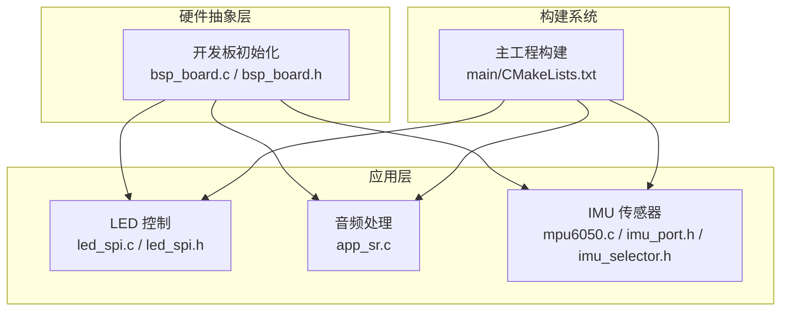
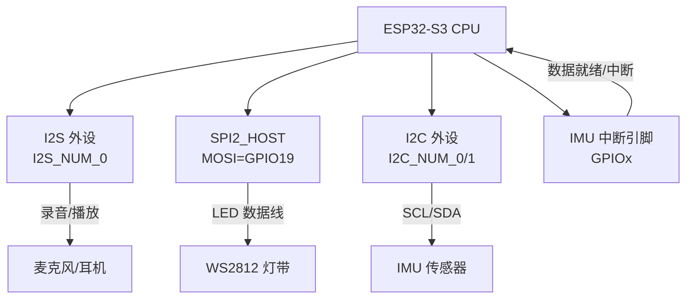
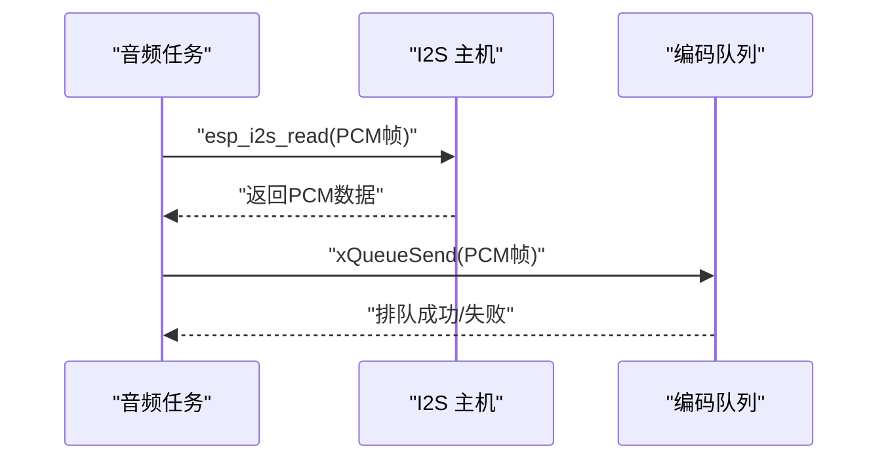
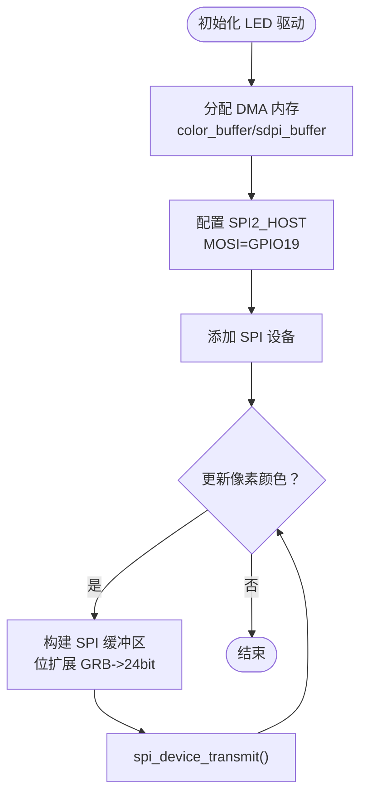
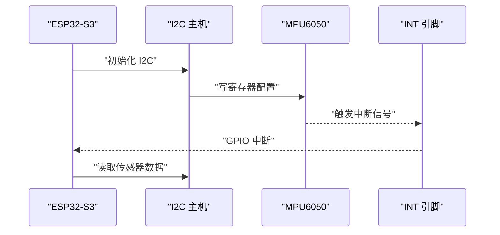
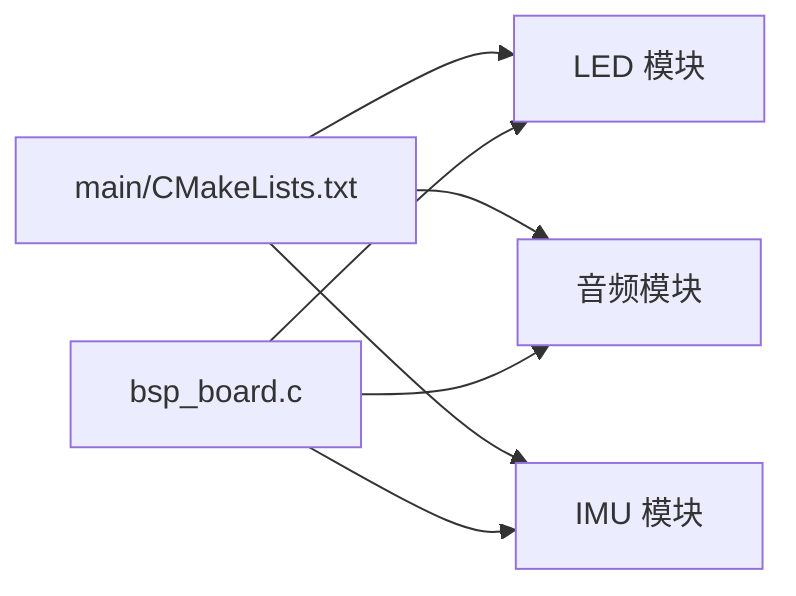

# 引脚分配与连接

<cite>
**本文引用的文件**
- [sdkconfig.defaults](file://sdkconfig.defaults)
- [sdkconfig.old](file://sdkconfig.old)
- [bsp_board.c](file://components/hardware_driver/boards/esp32-s3/bsp_board.c)
- [bsp_board.h](file://components/hardware_driver/boards/include/bsp_board.h)
- [led_spi.h](file://main/app/led_strip/led_spi.h)
- [led_spi.c](file://main/app/led_strip/led_spi.c)
- [app_sr.c](file://main/app/audio/app_sr.c)
- [mpu6050.c](file://components/IMU/drivers/mpu6050/mpu6050.c)
- [imu_port.h](file://components/IMU/core/imu_port.h)
- [imu_selector.h](file://components/IMU/imu_selector.h)
- [CMakeLists.txt](file://main/CMakeLists.txt)
</cite>

## 目录
1. [简介](#简介)
2. [项目结构](#项目结构)
3. [核心组件](#核心组件)
4. [架构总览](#架构总览)
5. [详细组件分析](#详细组件分析)
6. [依赖关系分析](#依赖关系分析)
7. [性能考虑](#性能考虑)
8. [故障排查指南](#故障排查指南)
9. [结论](#结论)
10. [附录](#附录)

## 简介
本技术文档围绕 ESP32-S3 开发板上的 GPIO 引脚分配与连接展开，重点覆盖以下方面：
- 数字接口引脚映射：I2S、I2C、SPI、UART 等
- 音频输入输出引脚配置：录音与播放路径
- 传感器接口引脚分配：IMU（惯性测量单元）相关引脚
- LED 控制引脚连接：基于 SPI 的 WS2812 灯带驱动
- 完整的引脚分配表与连接示意图
- 各引脚的电气特性、驱动能力与使用限制
- 硬件连接最佳实践与常见错误规避

## 项目结构
本项目采用模块化组织方式，主要涉及以下与引脚相关的关键目录与文件：
- 硬件抽象层与开发板初始化：components/hardware_driver/boards/esp32-s3
- LED 控制：main/app/led_strip
- 音频处理：main/app/audio
- IMU 传感器：components/IMU
- 工程构建：main/CMakeLists.txt

**图表来源**
- [CMakeLists.txt:1-4](file://main/CMakeLists.txt#L1-L4)
- [bsp_board.c:15-35](file://components/hardware_driver/boards/esp32-s3/bsp_board.c#L15-L35)
- [led_spi.h:1-28](file://main/app/led_strip/led_spi.h#L1-L28)
- [led_spi.c:36-66](file://main/app/led_strip/led_spi.c#L36-L66)
- [app_sr.c:34-70](file://main/app/audio/app_sr.c#L34-L70)
- [mpu6050.c:215-263](file://components/IMU/drivers/mpu6050/mpu6050.c#L215-L263)

**章节来源**
- [CMakeLists.txt:1-4](file://main/CMakeLists.txt#L1-L4)

## 核心组件
本节聚焦于与引脚分配直接相关的组件及其职责：
- 开发板初始化（BSP）：负责 I2S、I2C、SPI、UART 等外设的默认引脚配置与初始化
- LED 驱动（SPI）：通过 SPI2_HOST 的 MOSI 引脚驱动 WS2812 灯带
- 音频处理（I2S）：录音路径由 I2S 主机配置，配合音频任务进行数据采集
- IMU 传感器（I2C/INT）：通过 I2C 接口通信，并可配置中断引脚

**章节来源**
- [bsp_board.c:15-35](file://components/hardware_driver/boards/esp32-s3/bsp_board.c#L15-L35)
- [led_spi.h:7-9](file://main/app/led_strip/led_spi.h#L7-L9)
- [led_spi.c:47-66](file://main/app/led_strip/led_spi.c#L47-L66)
- [app_sr.c:34-70](file://main/app/audio/app_sr.c#L34-L70)
- [mpu6050.c:215-263](file://components/IMU/drivers/mpu6050/mpu6050.c#L215-L263)

## 架构总览
下图展示了与引脚分配相关的系统交互关系：

**图表来源**
- [bsp_board.c:23-35](file://components/hardware_driver/boards/esp32-s3/bsp_board.c#L23-L35)
- [led_spi.h:7-9](file://main/app/led_strip/led_spi.h#L7-L9)
- [led_spi.c:47-66](file://main/app/led_strip/led_spi.c#L47-L66)
- [mpu6050.c:215-263](file://components/IMU/drivers/mpu6050/mpu6050.c#L215-L263)

## 详细组件分析

### I2S 引脚与音频配置
- I2S 主机配置：在开发板初始化中对 I2S_NUM_0 进行默认配置，包含采样率、数据位宽、槽位宽度等参数
- 录音路径：音频任务通过 I2S 读取 PCM 数据，进入编码队列
- 关键实现位置：
  - I2S 默认配置与采样参数
  - I2S 读取循环与队列投递

**图表来源**
- [app_sr.c:34-70](file://main/app/audio/app_sr.c#L34-L70)

**章节来源**
- [bsp_board.c:23-35](file://components/hardware_driver/boards/esp32-s3/bsp_board.c#L23-L35)
- [app_sr.c:34-70](file://main/app/audio/app_sr.c#L34-L70)

### SPI 引脚与 LED 控制
- SPI2_HOST 使用 MOSI 引脚（GPIO19）作为 LED 数据线
- 通过位扩展将每个像素的 GRB 三通道转换为 24bit 的 SPI 序列
- 事务传输长度按像素数计算，使用 DMA 内存以满足时序要求

**图表来源**
- [led_spi.c:36-66](file://main/app/led_strip/led_spi.c#L36-L66)
- [led_spi.c:80-92](file://main/app/led_strip/led_spi.c#L80-L92)
- [led_spi.h:7-9](file://main/app/led_strip/led_spi.h#L7-L9)

**章节来源**
- [led_spi.h:7-9](file://main/app/led_strip/led_spi.h#L7-L9)
- [led_spi.c:36-66](file://main/app/led_strip/led_spi.c#L36-L66)
- [led_spi.c:80-92](file://main/app/led_strip/led_spi.c#L80-L92)

### I2C 引脚与 IMU 传感器
- I2C 多实例可用（I2C_NUM_0/1），用于连接 IMU 传感器
- 可配置中断引脚，检测数据就绪或运动事件
- 引脚有效性检查确保仅在有效 GPIO 上启用中断

**图表来源**
- [mpu6050.c:215-263](file://components/IMU/drivers/mpu6050/mpu6050.c#L215-L263)

**章节来源**
- [mpu6050.c:215-263](file://components/IMU/drivers/mpu6050/mpu6050.c#L215-L263)

### UART 引脚（概念性说明）
- UART 在 ESP32-S3 上受支持，具体引脚映射与复用需参考 SDK 配置
- 本仓库未直接出现 UART 引脚配置代码，建议结合 SDK 文档与目标硬件布局规划

[本节为概念性说明，不直接分析具体文件，故无“章节来源”]

## 依赖关系分析
- 构建系统将主工程源码目录纳入编译范围，确保各模块（LED、音频、IMU）被正确链接
- BSP 提供外设默认配置，LED 与音频模块依赖其提供的主机与时钟参数
- IMU 模块通过 I2C 与中断引脚与 MCU 交互

**图表来源**
- [CMakeLists.txt:1-4](file://main/CMakeLists.txt#L1-L4)
- [bsp_board.c:15-35](file://components/hardware_driver/boards/esp32-s3/bsp_board.c#L15-L35)

**章节来源**
- [CMakeLists.txt:1-4](file://main/CMakeLists.txt#L1-L4)

## 性能考虑
- LED 驱动使用 DMA 内存与一次性事务传输，降低 CPU 占用并保证时序精度
- I2S 读取采用阻塞模式与独立任务，避免主线程阻塞
- SPI 时钟频率（约 3.2MHz）满足 WS2812 的高电平时间要求，同时兼顾 CPU 负载
- I2S 采样率与位宽在 BSP 层统一配置，确保音频链路稳定性

[本节提供通用指导，不直接分析具体文件，故无“章节来源”]

## 故障排查指南
- LED 不亮或闪烁异常
  - 检查 MOSI 引脚是否正确配置为 GPIO19
  - 确认 DMA 内存分配成功且缓冲区已刷新
  - 核对 SPI 时钟与位扩展逻辑
  - 参考：[led_spi.c:36-66](file://main/app/led_strip/led_spi.c#L36-L66)、[led_spi.c:80-92](file://main/app/led_strip/led_spi.c#L80-L92)
- 音频无法录音
  - 确认 I2S 主机已初始化并配置采样参数
  - 检查音频任务是否创建成功及队列是否可用
  - 参考：[bsp_board.c:23-35](file://components/hardware_driver/boards/esp32-s3/bsp_board.c#L23-L35)、[app_sr.c:34-70](file://main/app/audio/app_sr.c#L34-L70)
- IMU 无响应或中断无效
  - 确认 I2C 地址与 SDA/SCL 引脚正确
  - 检查中断引脚是否为有效 GPIO 并配置为下降沿/上升沿触发
  - 参考：[mpu6050.c:215-263](file://components/IMU/drivers/mpu6050/mpu6050.c#L215-L263)

**章节来源**
- [led_spi.c:36-66](file://main/app/led_strip/led_spi.c#L36-L66)
- [led_spi.c:80-92](file://main/app/led_strip/led_spi.c#L80-L92)
- [bsp_board.c:23-35](file://components/hardware_driver/boards/esp32-s3/bsp_board.c#L23-L35)
- [app_sr.c:34-70](file://main/app/audio/app_sr.c#L34-L70)
- [mpu6050.c:215-263](file://components/IMU/drivers/mpu6050/mpu6050.c#L215-L263)

## 结论
本项目在 ESP32-S3 上实现了清晰的引脚分工：
- I2S 用于音频输入输出
- SPI2_HOST 的 MOSI 引脚用于 LED 控制
- I2C 用于 IMU 传感器通信与中断引脚配置
通过 BSP 统一初始化与模块化设计，既保证了功能完整性，也便于后续扩展与维护。

[本节为总结性内容，不直接分析具体文件，故无“章节来源”]

## 附录

### 引脚分配与连接表（基于仓库实现）
- I2S（录音/播放）
  - 主机：I2S_NUM_0
  - 采样率与位宽：在 BSP 中配置
  - 实现参考：[bsp_board.c:23-35](file://components/hardware_driver/boards/esp32-s3/bsp_board.c#L23-L35)、[app_sr.c:34-70](file://main/app/audio/app_sr.c#L34-L70)
- SPI（LED 控制）
  - 主机：SPI2_HOST
  - 数据线：MOSI=GPIO19
  - 时钟：约 3.2MHz
  - 实现参考：[led_spi.h:7-9](file://main/app/led_strip/led_spi.h#L7-L9)、[led_spi.c:47-66](file://main/app/led_strip/led_spi.c#L47-L66)
- I2C（IMU 传感器）
  - 实例：I2C_NUM_0/1
  - 中断引脚：GPIOx（需在用户配置中指定）
  - 实现参考：[mpu6050.c:215-263](file://components/IMU/drivers/mpu6050/mpu6050.c#L215-L263)
- UART（概念性说明）
  - 支持情况：见 SDK 配置
  - 实现参考：[sdkconfig.defaults:74-74](file://sdkconfig.defaults#L74-L74)、[sdkconfig.old:8-8](file://sdkconfig.old#L8-L8)

**章节来源**
- [bsp_board.c:23-35](file://components/hardware_driver/boards/esp32-s3/bsp_board.c#L23-L35)
- [app_sr.c:34-70](file://main/app/audio/app_sr.c#L34-L70)
- [led_spi.h:7-9](file://main/app/led_strip/led_spi.h#L7-L9)
- [led_spi.c:47-66](file://main/app/led_strip/led_spi.c#L47-L66)
- [mpu6050.c:215-263](file://components/IMU/drivers/mpu6050/mpu6050.c#L215-L263)
- [sdkconfig.defaults:74-74](file://sdkconfig.defaults#L74-L74)
- [sdkconfig.old:8-8](file://sdkconfig.old#L8-L8)

### 电气特性与使用限制（基于仓库实现）
- LED 驱动
  - 使用 DMA 内存与一次性传输，满足 WS2812 时序
  - SPI 时钟约 3.2MHz，像素数量影响传输时长
  - 参考：[led_spi.c:36-66](file://main/app/led_strip/led_spi.c#L36-L66)、[led_spi.c:80-92](file://main/app/led_strip/led_spi.c#L80-L92)
- I2S
  - 采样率与位宽在 BSP 中统一配置，确保音频质量
  - 参考：[bsp_board.c:23-35](file://components/hardware_driver/boards/esp32-s3/bsp_board.c#L23-L35)
- I2C
  - 支持多实例，中断引脚需为有效 GPIO
  - 参考：[mpu6050.c:215-263](file://components/IMU/drivers/mpu6050/mpu6050.c#L215-L263)

**章节来源**
- [led_spi.c:36-66](file://main/app/led_strip/led_spi.c#L36-L66)
- [led_spi.c:80-92](file://main/app/led_strip/led_spi.c#L80-L92)
- [bsp_board.c:23-35](file://components/hardware_driver/boards/esp32-s3/bsp_board.c#L23-L35)
- [mpu6050.c:215-263](file://components/IMU/drivers/mpu6050/mpu6050.c#L215-L263)

### 硬件连接最佳实践与常见错误
- 最佳实践
  - LED 数据线走线尽量短且靠近芯片，减少信号反射
  - 使用 DMA 内存与一次性传输，避免频繁小包导致时序偏差
  - I2S 采样参数与音频任务优先级合理配置，避免欠载
  - I2C 上拉电阻匹配（典型 4.7kΩ），确保噪声容限
- 常见错误
  - MOSI 引脚误用为其他功能（如 JTAG），导致 LED 不亮
  - SPI 时钟过低导致像素刷新率不足，出现闪烁
  - I2S 采样率与设备不匹配，造成音频失真
  - IMU 中断引脚未配置为有效 GPIO，导致无法触发

[本节为通用指导，不直接分析具体文件，故无“章节来源”]