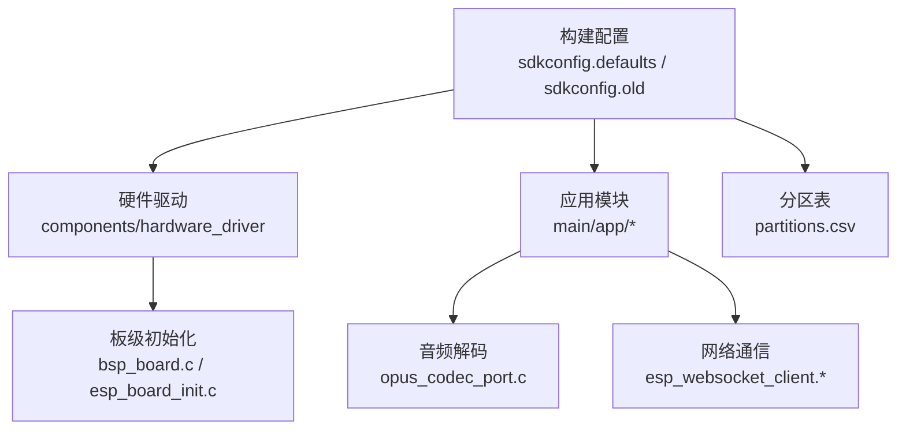
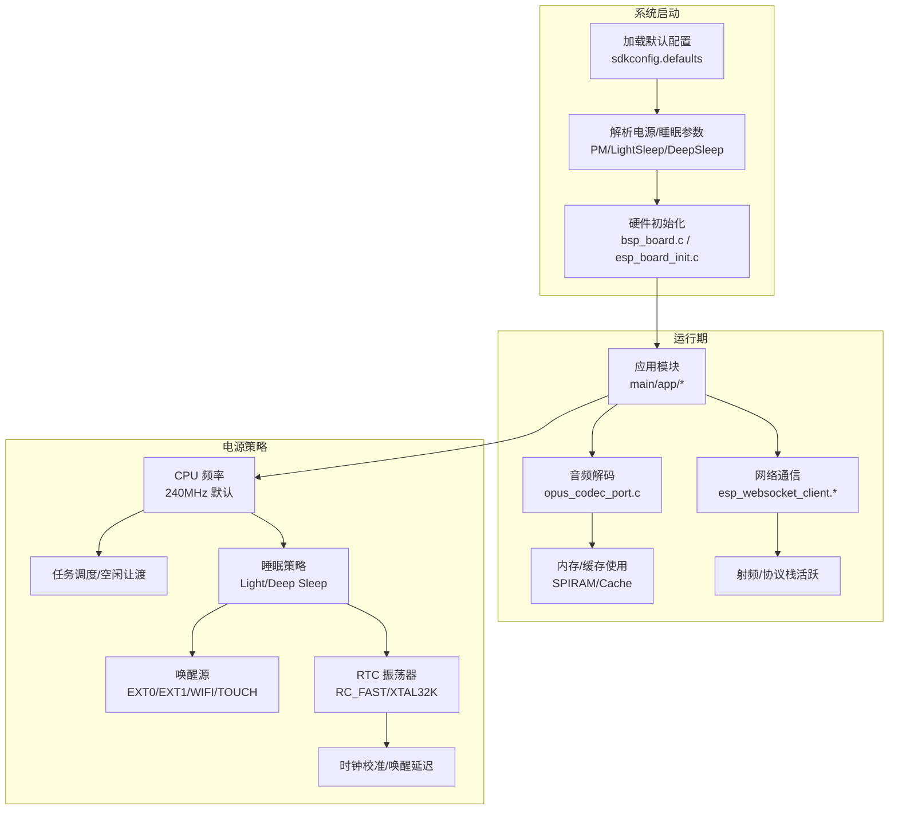
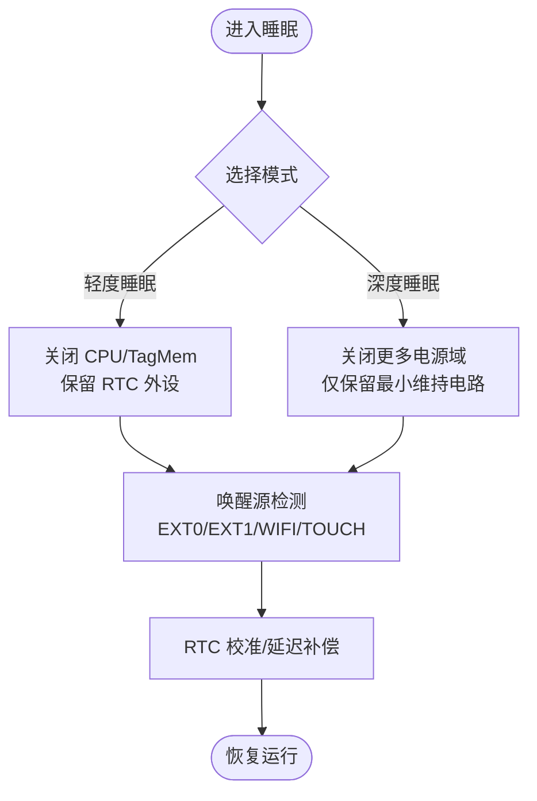
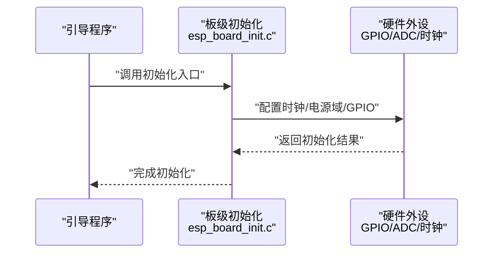
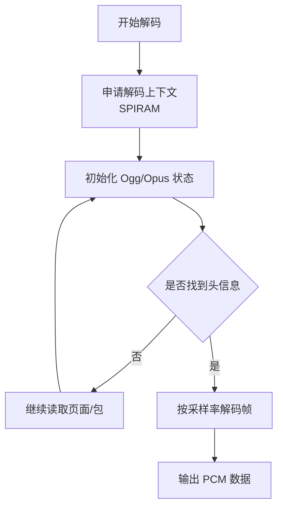
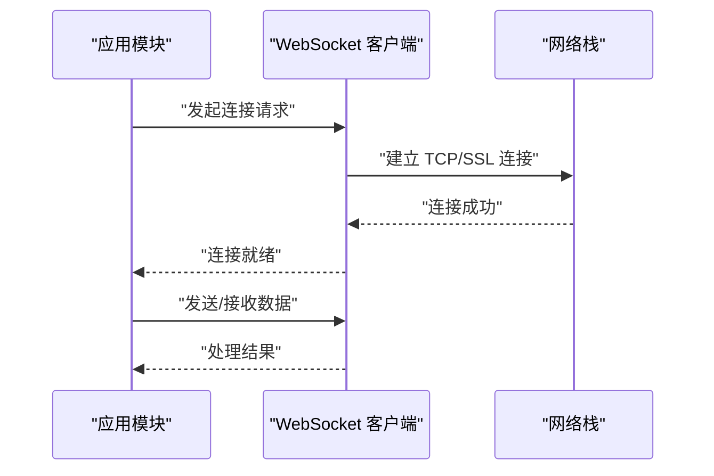
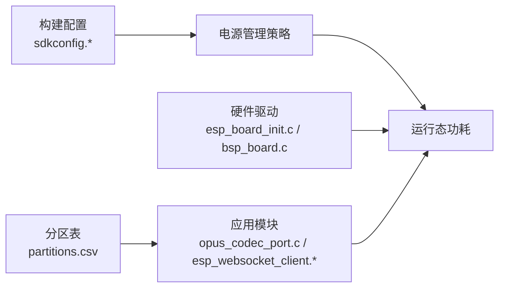

# 电源管理与功耗控制

<cite>
**本文引用的文件**
- [sdkconfig.defaults](file://sdkconfig.defaults)
- [sdkconfig.old](file://sdkconfig.old)
- [partitions.csv](file://partitions.csv)
- [components/hardware_driver/boards/esp32-s3/bsp_board.c](file://components/hardware_driver/boards/esp32-s3/bsp_board.c)
- [components/hardware_driver/esp_board_init.c](file://components/hardware_driver/esp_board_init.c)
- [components/hardware_driver/include/esp_board_init.h](file://components/hardware_driver/include/esp_board_init.h)
- [components/esp_websocket_client/esp_websocket_client.c](file://components/esp_websocket_client/esp_websocket_client.c)
- [components/esp_websocket_client/esp_websocket_client.h](file://components/esp_websocket_client/esp_websocket_client.h)
- [main/app/audio/opus_codec_port.c](file://main/app/audio/opus_codec_port.c)
</cite>

## 目录
1. [引言](#引言)
2. [项目结构](#项目结构)
3. [核心组件](#核心组件)
4. [架构总览](#架构总览)
5. [详细组件分析](#详细组件分析)
6. [依赖关系分析](#依赖关系分析)
7. [性能考量](#性能考量)
8. [故障排查指南](#故障排查指南)
9. [结论](#结论)
10. [附录](#附录)

## 引言
本技术文档围绕 ESP32-S3 开发板的电源管理与功耗控制展开，结合仓库中的构建配置与硬件驱动信息，系统性梳理供电方案、工作模式下的功耗特性、低功耗模式配置与电源管理策略，并给出电气特性、保护机制与热管理建议。同时，针对音频处理等高功耗模块提出优化建议，帮助在保证性能的前提下实现更低的功耗。

## 项目结构
本项目采用 ESP-IDF 工程组织方式，核心与电源管理相关的内容集中在以下位置：
- 构建配置：sdkconfig.defaults、sdkconfig.old（含 CPU 频率、电源管理、睡眠配置等）
- 硬件抽象层：components/hardware_driver（包含 ESP32-S3 板级初始化与硬件接口）
- 应用层：main/app 下的功能模块（如音频解码、网络通信等），这些模块对整体功耗有直接影响
- 分区表：partitions.csv（存储分区布局，影响功耗优化策略）

**图示来源**
- [sdkconfig.defaults:74-412](file://sdkconfig.defaults#L74-L412)
- [sdkconfig.old:1037-1150](file://sdkconfig.old#L1037-L1150)
- [components/hardware_driver/boards/esp32-s3/bsp_board.c](file://components/hardware_driver/boards/esp32-s3/bsp_board.c)
- [components/hardware_driver/esp_board_init.c](file://components/hardware_driver/esp_board_init.c)
- [main/app/audio/opus_codec_port.c:1-44](file://main/app/audio/opus_codec_port.c#L1-L44)
- [components/esp_websocket_client/esp_websocket_client.c](file://components/esp_websocket_client/esp_websocket_client.c)
- [partitions.csv:1-6](file://partitions.csv#L1-L6)

**章节来源**
- [sdkconfig.defaults:74-412](file://sdkconfig.defaults#L74-L412)
- [sdkconfig.old:1037-1150](file://sdkconfig.old#L1037-L1150)
- [partitions.csv:1-6](file://partitions.csv#L1-L6)

## 核心组件
- 电源管理与睡眠配置：通过 sdkconfig.defaults 与 sdkconfig.old 中的电源管理、深度睡眠、轻度睡眠、RTC 振荡器等选项，决定系统在不同模式下的能耗表现。
- 板级硬件初始化：硬件驱动层负责外设时钟、电源域、GPIO、ADC 等初始化，直接影响上电阶段的功耗与稳定性。
- 应用模块功耗热点：音频解码（Opus）与网络通信（WebSocket）是主要功耗来源，需结合任务调度与缓存策略进行优化。
- 存储与分区：SPIFFS 分区用于模型与数据存储，其访问模式与挂载策略会影响系统活跃时间与功耗。

**章节来源**
- [sdkconfig.defaults:74-412](file://sdkconfig.defaults#L74-L412)
- [sdkconfig.old:1037-1150](file://sdkconfig.old#L1037-L1150)
- [components/hardware_driver/boards/esp32-s3/bsp_board.c](file://components/hardware_driver/boards/esp32-s3/bsp_board.c)
- [components/hardware_driver/esp_board_init.c](file://components/hardware_driver/esp_board_init.c)
- [main/app/audio/opus_codec_port.c:1-44](file://main/app/audio/opus_codec_port.c#L1-L44)
- [components/esp_websocket_client/esp_websocket_client.c](file://components/esp_websocket_client/esp_websocket_client.c)
- [partitions.csv:1-6](file://partitions.csv#L1-L6)

## 架构总览
下图展示从系统启动到运行期间的关键电源管理路径与交互：

**图示来源**
- [sdkconfig.defaults:74-412](file://sdkconfig.defaults#L74-L412)
- [sdkconfig.old:1037-1150](file://sdkconfig.old#L1037-L1150)
- [components/hardware_driver/boards/esp32-s3/bsp_board.c](file://components/hardware_driver/boards/esp32-s3/bsp_board.c)
- [components/hardware_driver/esp_board_init.c](file://components/hardware_driver/esp_board_init.c)
- [main/app/audio/opus_codec_port.c:1-44](file://main/app/audio/opus_codec_port.c#L1-L44)
- [components/esp_websocket_client/esp_websocket_client.c](file://components/esp_websocket_client/esp_websocket_client.c)

## 详细组件分析

### 电源管理与睡眠配置
- CPU 频率与缓存：默认 CPU 频率为 240MHz，启用较大的数据缓存与多路关联，有助于减少内存访问开销，但会增加动态功耗。
- 轻度睡眠与深度睡眠：配置中包含轻度睡眠与深度睡眠支持，以及唤醒延迟与 RTC 振荡器设置，可作为降低待机功耗的关键手段。
- 电源域与外设：PM 支持 CPU、TAGMEM、RTC 外设、VDDSDIO、MAC BB、MODEM 等电源域的控制，便于按需断电以节能。
- 睡眠工作绕过：存在针对 Flash 泄漏、PSRAM 泄漏、MSPI IO 上拉、RTC 总线隔离、GPIO 复位等的睡眠工作绕过配置，确保系统在进入低功耗状态时的稳定性和可靠性。

**图示来源**
- [sdkconfig.defaults:375-381](file://sdkconfig.defaults#L375-L381)
- [sdkconfig.defaults:388-389](file://sdkconfig.defaults#L388-L389)
- [sdkconfig.old:1037-1059](file://sdkconfig.old#L1037-L1059)
- [sdkconfig.old:287-304](file://sdkconfig.old#L287-L304)

**章节来源**
- [sdkconfig.defaults:74-412](file://sdkconfig.defaults#L74-L412)
- [sdkconfig.old:1037-1150](file://sdkconfig.old#L1037-L1150)

### 板级硬件初始化与电源路径
- 板级初始化负责外设时钟、电源域、GPIO、ADC 等的初始化，确保上电后各模块处于正确的工作状态，避免不必要的功耗。
- 该层还承担电源域的精细控制，例如在不需要时关闭特定外设或降低其工作频率，从而降低整体功耗。

**图示来源**
- [components/hardware_driver/esp_board_init.c](file://components/hardware_driver/esp_board_init.c)
- [components/hardware_driver/boards/esp32-s3/bsp_board.c](file://components/hardware_driver/boards/esp32-s3/bsp_board.c)

**章节来源**
- [components/hardware_driver/esp_board_init.c](file://components/hardware_driver/esp_board_init.c)
- [components/hardware_driver/boards/esp32-s3/bsp_board.c](file://components/hardware_driver/boards/esp32-s3/bsp_board.c)

### 应用模块功耗热点：音频解码（Opus）
- 解码上下文与内存：音频解码需要较大的临时缓冲区与解码器上下文，通常分配在 SPIRAM 中，占用外部高速缓存资源，增加功耗。
- 采样率与帧长：解码器信息中包含采样率等参数，直接影响 CPU 占用与功耗；在满足音质的前提下，适当降低采样率可显著节能。
- 建议：优先使用量化模型与合适的采样率；在空闲时段关闭解码器或降低采样率；合理安排解码任务的执行周期。

**图示来源**
- [main/app/audio/opus_codec_port.c:26-44](file://main/app/audio/opus_codec_port.c#L26-L44)

**章节来源**
- [main/app/audio/opus_codec_port.c:1-44](file://main/app/audio/opus_codec_port.c#L1-L44)

### 网络通信功耗：WebSocket 客户端
- 连接与心跳：WebSocket 客户端负责建立与维护网络连接，保持活跃会增加射频与协议栈的功耗。
- 建议：在空闲时段进入轻度睡眠并合理设置唤醒间隔；在网络事件驱动场景下，尽量缩短活跃窗口；必要时使用深度睡眠并在唤醒后快速完成任务。

**图示来源**
- [components/esp_websocket_client/esp_websocket_client.c](file://components/esp_websocket_client/esp_websocket_client.c)
- [components/esp_websocket_client/esp_websocket_client.h](file://components/esp_websocket_client/esp_websocket_client.h)

**章节来源**
- [components/esp_websocket_client/esp_websocket_client.c](file://components/esp_websocket_client/esp_websocket_client.c)
- [components/esp_websocket_client/esp_websocket_client.h](file://components/esp_websocket_client/esp_websocket_client.h)

### 存储与分区：SPIFFS 与模型
- 分区布局：存储与模型分区位于 SPIFFS，频繁的读写操作会增加系统活跃时间与功耗。
- 建议：合并小文件、减少碎片化；在空闲时段进行批量读写；使用只读数据段与合适的缓存策略。

**章节来源**
- [partitions.csv:1-6](file://partitions.csv#L1-L6)

## 依赖关系分析
- 构建配置对运行时行为具有决定性影响：CPU 频率、缓存大小、电源管理与睡眠配置共同决定了系统在不同负载下的功耗曲线。
- 硬件驱动层与应用层之间存在紧密耦合：驱动层的初始化质量直接影响应用层的可用性与功耗控制效果。
- 应用层模块（音频、网络）是功耗的主要贡献者，需与电源管理策略协同设计。

**图示来源**
- [sdkconfig.defaults:74-412](file://sdkconfig.defaults#L74-L412)
- [sdkconfig.old:1037-1150](file://sdkconfig.old#L1037-L1150)
- [components/hardware_driver/esp_board_init.c](file://components/hardware_driver/esp_board_init.c)
- [components/hardware_driver/boards/esp32-s3/bsp_board.c](file://components/hardware_driver/boards/esp32-s3/bsp_board.c)
- [main/app/audio/opus_codec_port.c:1-44](file://main/app/audio/opus_codec_port.c#L1-L44)
- [components/esp_websocket_client/esp_websocket_client.c](file://components/esp_websocket_client/esp_websocket_client.c)
- [partitions.csv:1-6](file://partitions.csv#L1-L6)

**章节来源**
- [sdkconfig.defaults:74-412](file://sdkconfig.defaults#L74-L412)
- [sdkconfig.old:1037-1150](file://sdkconfig.old#L1037-L1150)
- [partitions.csv:1-6](file://partitions.csv#L1-L6)

## 性能考量
- CPU 频率与缓存：240MHz 默认频率与较大缓存有利于实时性，但会提高动态功耗。在非实时场景可考虑降频或利用睡眠降低平均功耗。
- 内存与缓存：启用 SPIRAM 与外部缓存可减少内存访问次数，但也会增加功耗。建议在空闲时段释放未使用的缓存。
- 射频与网络：无线模块在活跃时功耗较高，应尽量缩短活跃窗口并合理设置唤醒策略。
- 音频处理：量化模型与较低采样率可显著降低解码功耗；在空闲时段完全停止解码任务。

[本节为通用指导，不直接分析具体文件]

## 故障排查指南
- 睡眠唤醒异常：检查唤醒源配置与 RTC 校准参数，确认是否存在 GPIO 复位或隔离问题导致的异常唤醒。
- 低功耗模式不稳定：核对电源域断电策略与 Flash/PSRAM 泄漏绕过配置，确保在进入睡眠前完成必要的数据回写与状态保存。
- 音频解码失败：确认解码上下文分配是否成功，Ogg/Opus 头信息是否正确识别，采样率参数是否匹配。
- 网络连接问题：检查 WebSocket 客户端初始化流程与网络栈状态，确保在唤醒后能够快速恢复连接。

**章节来源**
- [sdkconfig.old:1037-1059](file://sdkconfig.old#L1037-L1059)
- [main/app/audio/opus_codec_port.c:26-44](file://main/app/audio/opus_codec_port.c#L26-L44)
- [components/esp_websocket_client/esp_websocket_client.c](file://components/esp_websocket_client/esp_websocket_client.c)

## 结论
通过对构建配置、硬件驱动与应用模块的综合分析，可以形成一套面向 ESP32-S3 的电源管理与功耗控制策略：在保证功能与性能的前提下，通过合理的 CPU 频率、缓存与电源域管理、睡眠策略、以及音频与网络模块的优化，实现显著的功耗降低。建议在实际部署中结合具体应用场景，持续评估与迭代电源管理策略。

[本节为总结性内容，不直接分析具体文件]

## 附录
- 关键配置项参考
  - CPU 频率与缓存：见 sdkconfig.defaults 中默认 CPU 频率与缓存配置
  - 睡眠与唤醒：见 sdkconfig.defaults 与 sdkconfig.old 中的睡眠与唤醒相关配置
  - 电源域与外设：见 sdkconfig.old 中 PM 支持的电源域列表
  - 分区布局：见 partitions.csv

**章节来源**
- [sdkconfig.defaults:74-412](file://sdkconfig.defaults#L74-L412)
- [sdkconfig.old:1037-1150](file://sdkconfig.old#L1037-L1150)
- [partitions.csv:1-6](file://partitions.csv#L1-L6)