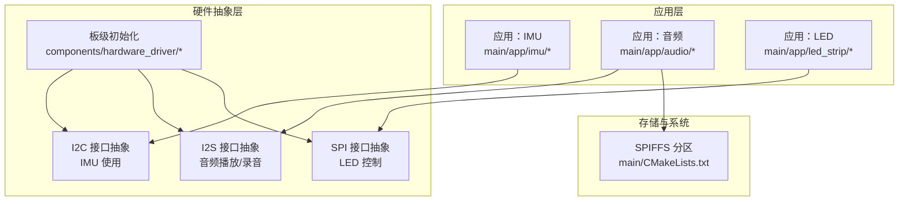
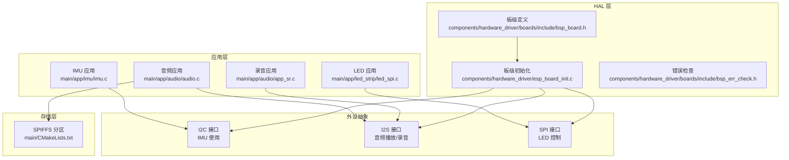
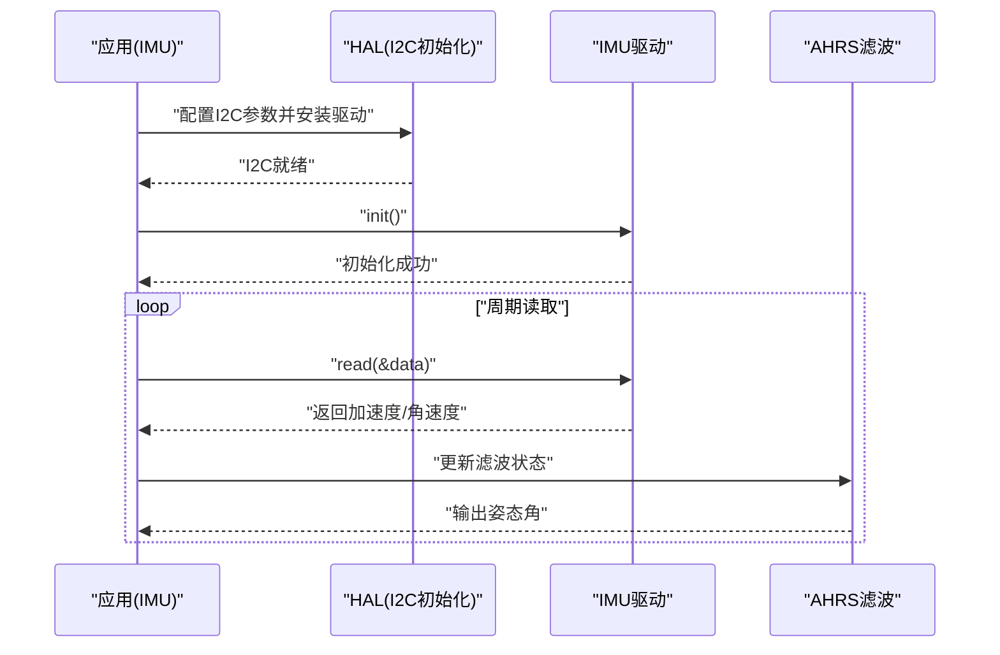
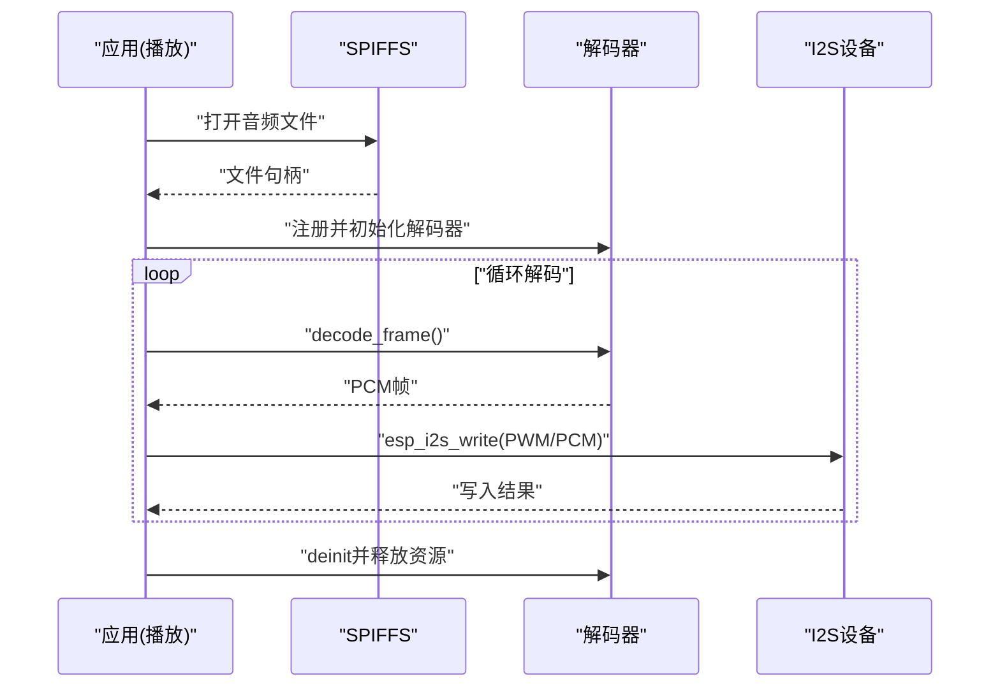
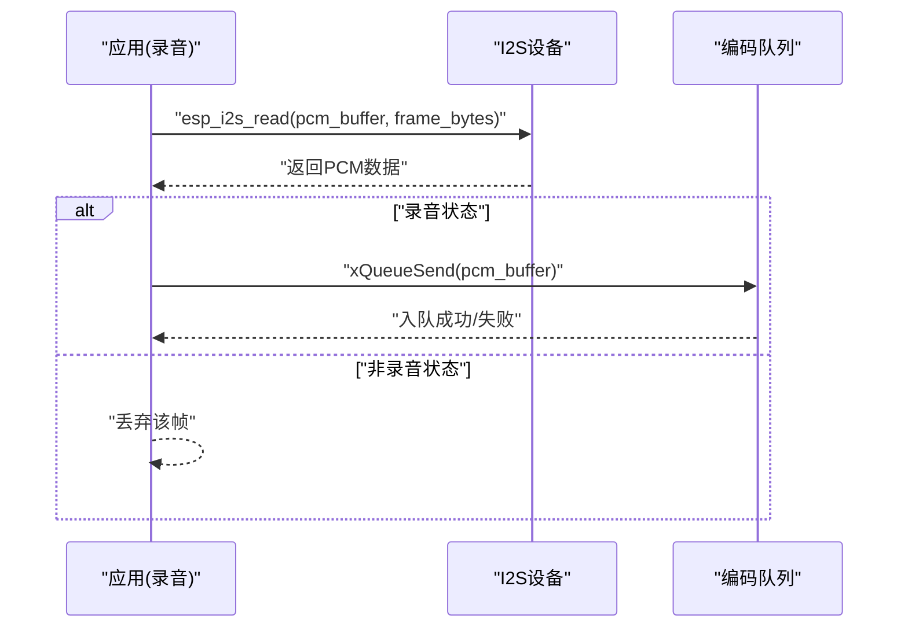
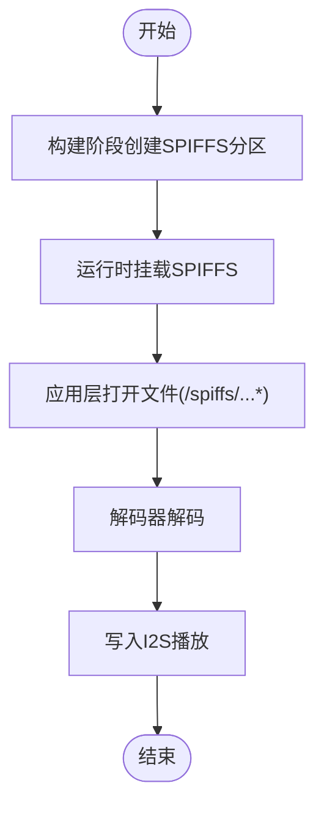
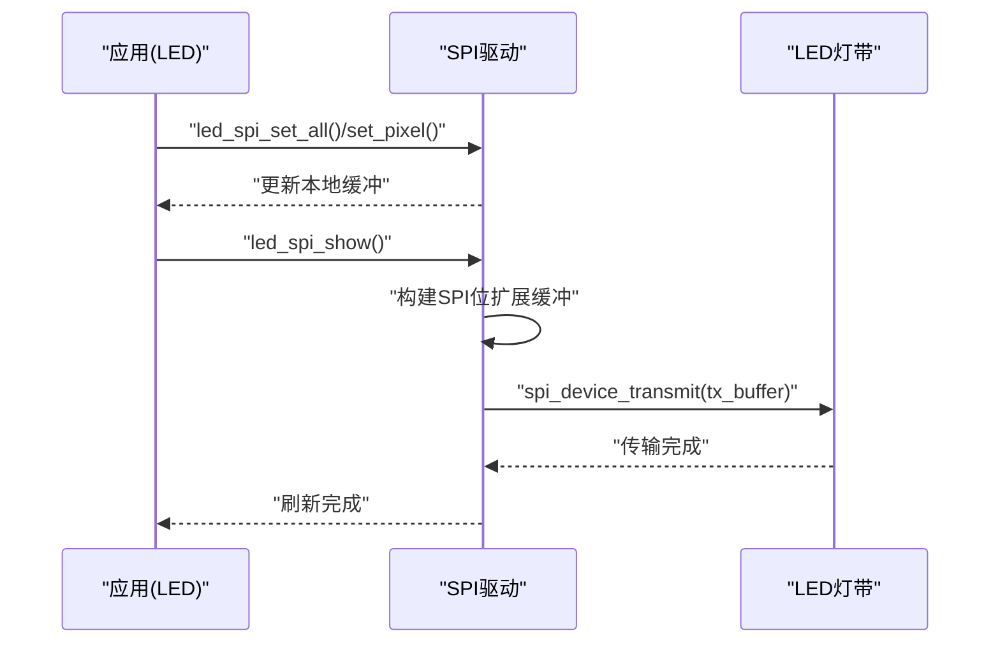
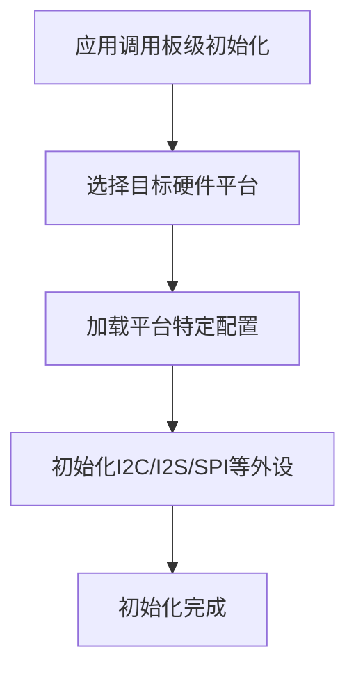
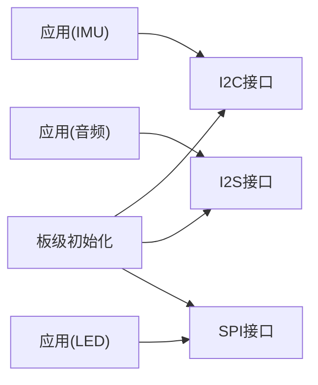

# 硬件抽象层设计

<cite>
**本文档引用的文件**
- [main/CMakeLists.txt](file://main/CMakeLists.txt)
- [main/app/imu/imu.c](file://main/app/imu/imu.c)
- [main/app/imu/imu.h](file://main/app/imu/imu.h)
- [main/app/audio/audio.c](file://main/app/audio/audio.c)
- [main/app/audio/app_sr.c](file://main/app/audio/app_sr.c)
- [main/app/led_strip/led_spi.c](file://main/app/led_strip/led_spi.c)
- [main/app/led_strip/led_spi.h](file://main/app/led_strip/led_spi.h)
- [components/hardware_driver/esp_board_init.c](file://components/hardware_driver/esp_board_init.c)
- [components/hardware_driver/include/esp_board_init.h](file://components/hardware_driver/include/esp_board_init.h)
- [components/hardware_driver/boards/esp32-s3/bsp_board.c](file://components/hardware_driver/boards/esp32-s3/bsp_board.c)
- [components/hardware_driver/boards/include/bsp_board.h](file://components/hardware_driver/boards/include/bsp_board.h)
- [components/hardware_driver/boards/include/bsp_err_check.h](file://components/hardware_driver/boards/include/bsp_err_check.h)
</cite>

## 目录
1. [简介](#简介)
2. [项目结构](#项目结构)
3. [核心组件](#核心组件)
4. [架构总览](#架构总览)
5. [详细组件分析](#详细组件分析)
6. [依赖关系分析](#依赖关系分析)
7. [性能考虑](#性能考虑)
8. [故障排查指南](#故障排查指南)
9. [结论](#结论)
10. [附录](#附录)

## 简介
本文件面向硬件抽象层（HAL）设计，系统性阐述如何通过统一接口屏蔽不同硬件平台差异，确保上层应用逻辑在更换底层硬件时无需改动。文档聚焦以下能力：
- SPIFFS 文件系统挂载与使用
- I2S 音频接口（播放与录音）
- GPIO/I2C/LED 控制等基础外设抽象
- 抽象接口定义、实现方式与使用模式
- 在不修改上层代码的前提下更换硬件平台的最佳实践

## 项目结构
项目采用“按功能域分组件”的组织方式，核心 HAL 相关模块位于 components/hardware_driver，并在 main/app 下提供具体应用层封装与调用示例。

**图表来源**
- [main/CMakeLists.txt:1-4](file://main/CMakeLists.txt#L1-L4)
- [main/app/imu/imu.c:42-75](file://main/app/imu/imu.c#L42-L75)
- [main/app/audio/audio.c:112-205](file://main/app/audio/audio.c#L112-L205)
- [main/app/audio/app_sr.c:34-70](file://main/app/audio/app_sr.c#L34-L70)
- [main/app/led_strip/led_spi.c:36-66](file://main/app/led_strip/led_spi.c#L36-L66)

**章节来源**
- [main/CMakeLists.txt:1-4](file://main/CMakeLists.txt#L1-L4)

## 核心组件
- 板级初始化与硬件选择：通过硬件驱动组件完成 I2C、I2S、SPI 等外设的统一配置与初始化入口。
- IMU 子系统：以 I2C 为通信总线，通过 HAL 层屏蔽具体传感器型号差异，提供统一的读数接口。
- 音频子系统：基于 I2S 实现播放与录音，结合 SPIFFS 读取音频文件；解码器通过统一接口注册与调用。
- LED 子系统：通过 SPI 控制 WS2812 等 LED 灯带，提供像素级控制与批量刷新。

**章节来源**
- [components/hardware_driver/esp_board_init.c](file://components/hardware_driver/esp_board_init.c)
- [components/hardware_driver/include/esp_board_init.h](file://components/hardware_driver/include/esp_board_init.h)
- [components/hardware_driver/boards/esp32-s3/bsp_board.c](file://components/hardware_driver/boards/esp32-s3/bsp_board.c)
- [components/hardware_driver/boards/include/bsp_board.h](file://components/hardware_driver/boards/include/bsp_board.h)
- [components/hardware_driver/boards/include/bsp_err_check.h](file://components/hardware_driver/boards/include/bsp_err_check.h)

## 架构总览
下图展示 HAL 在系统中的位置与交互关系，以及与应用层、存储层的关系。

**图表来源**
- [main/app/imu/imu.c:42-75](file://main/app/imu/imu.c#L42-L75)
- [main/app/audio/audio.c:112-205](file://main/app/audio/audio.c#L112-L205)
- [main/app/audio/app_sr.c:34-70](file://main/app/audio/app_sr.c#L34-L70)
- [main/app/led_strip/led_spi.c:36-66](file://main/app/led_strip/led_spi.c#L36-L66)
- [components/hardware_driver/esp_board_init.c](file://components/hardware_driver/esp_board_init.c)
- [components/hardware_driver/boards/include/bsp_board.h](file://components/hardware_driver/boards/include/bsp_board.h)
- [main/CMakeLists.txt:1-4](file://main/CMakeLists.txt#L1-L4)

## 详细组件分析

### I2C 与 IMU 抽象
- 设计理念：通过 HAL 统一 I2C 参数配置与驱动安装，屏蔽不同 IMU 驱动的差异，上层仅依赖统一的读取接口。
- 关键实现要点：
  - I2C 参数配置与驱动安装在 HAL 层完成，避免重复代码。
  - IMU 驱动通过选择器获取具体驱动实例，统一调用其 init/read 接口。
  - 采样频率与滤波参数在 HAL 层集中管理，便于跨平台一致性。
- 使用模式：
  - 上层调用初始化函数完成 I2C 与 IMU 的准备。
  - 后续通过统一接口读取姿态角，无需关心底层硬件细节。

**图表来源**
- [main/app/imu/imu.c:42-75](file://main/app/imu/imu.c#L42-L75)
- [main/app/imu/imu.c:83-110](file://main/app/imu/imu.c#L83-L110)

**章节来源**
- [main/app/imu/imu.c:42-75](file://main/app/imu/imu.c#L42-L75)
- [main/app/imu/imu.c:83-110](file://main/app/imu/imu.c#L83-L110)
- [main/app/imu/imu.h:10-13](file://main/app/imu/imu.h#L10-L13)

### I2S 音频接口抽象（播放与录音）
- 设计理念：通过 HAL 层统一分配与配置 I2S，上层仅关注数据流与解码器接口。
- 关键实现要点：
  - 播放：从 SPIFFS 读取音频文件，解码器按帧输出 PCM，写入 I2S。
  - 录音：I2S 读取 PCM 数据，放入队列供后续处理。
  - 解码器注册：通过统一的注册接口完成解码器实现的绑定与校验。
- 使用模式：
  - 播放：传入文件名，自动拼接 SPIFFS 路径，解码后写入 I2S。
  - 录音：创建读取任务，持续从 I2S 读取 PCM 帧并入队。

**图表来源**
- [main/app/audio/audio.c:112-205](file://main/app/audio/audio.c#L112-L205)
- [main/app/audio/audio.c:211-308](file://main/app/audio/audio.c#L211-L308)

**图表来源**
- [main/app/audio/app_sr.c:34-70](file://main/app/audio/app_sr.c#L34-L70)

**章节来源**
- [main/app/audio/audio.c:71-107](file://main/app/audio/audio.c#L71-L107)
- [main/app/audio/audio.c:112-205](file://main/app/audio/audio.c#L112-L205)
- [main/app/audio/audio.c:211-308](file://main/app/audio/audio.c#L211-L308)
- [main/app/audio/app_sr.c:34-70](file://main/app/audio/app_sr.c#L34-L70)

### SPIFFS 文件系统挂载与使用
- 设计理念：通过构建系统将 spiffs 目录打包为固件分区，应用层以统一路径访问音频文件。
- 关键实现要点：
  - 构建阶段创建 SPIFFS 分区镜像，确保文件系统可用。
  - 应用层以固定前缀路径访问文件，屏蔽底层存储介质差异。
- 使用模式：
  - 播放 MP3/Opus 时，自动拼接路径并打开文件进行解码播放。

**图表来源**
- [main/CMakeLists.txt:1-4](file://main/CMakeLists.txt#L1-L4)
- [main/app/audio/audio.c:120-153](file://main/app/audio/audio.c#L120-L153)

**章节来源**
- [main/CMakeLists.txt:1-4](file://main/CMakeLists.txt#L1-L4)
- [main/app/audio/audio.c:120-153](file://main/app/audio/audio.c#L120-L153)

### SPI 与 LED 控制抽象
- 设计理念：通过 HAL 层统一分配 DMA 内存、配置 SPI 时序与传输参数，上层以像素级或批量方式控制 LED。
- 关键实现要点：
  - 使用 DMA 内存分配保证传输效率与稳定性。
  - 将 RGB 数据按 WS2812 时序要求进行位扩展，再一次性传输。
  - 提供单像素设置、批量设置、清屏与缓冲区访问等接口。
- 使用模式：
  - 先设置颜色缓冲，再调用刷新接口一次性发送至 LED 灯带。

**图表来源**
- [main/app/led_strip/led_spi.c:36-66](file://main/app/led_strip/led_spi.c#L36-L66)
- [main/app/led_strip/led_spi.c:80-92](file://main/app/led_strip/led_spi.c#L80-L92)

**章节来源**
- [main/app/led_strip/led_spi.c:36-66](file://main/app/led_strip/led_spi.c#L36-L66)
- [main/app/led_strip/led_spi.c:80-92](file://main/app/led_strip/led_spi.c#L80-L92)
- [main/app/led_strip/led_spi.h:10-26](file://main/app/led_strip/led_spi.h#L10-L26)

### 板级初始化与硬件选择
- 设计理念：通过硬件驱动组件集中管理不同硬件平台的差异，提供统一的初始化入口与错误检查机制。
- 关键实现要点：
  - 板级头文件定义硬件特性与默认配置。
  - 板级实现负责根据目标硬件完成外设初始化。
  - 错误检查宏用于统一错误处理策略。
- 使用模式：
  - 应用层通过 HAL 提供的初始化函数完成硬件准备，无需感知具体芯片差异。

**图表来源**
- [components/hardware_driver/esp_board_init.c](file://components/hardware_driver/esp_board_init.c)
- [components/hardware_driver/boards/esp32-s3/bsp_board.c](file://components/hardware_driver/boards/esp32-s3/bsp_board.c)
- [components/hardware_driver/boards/include/bsp_board.h](file://components/hardware_driver/boards/include/bsp_board.h)
- [components/hardware_driver/boards/include/bsp_err_check.h](file://components/hardware_driver/boards/include/bsp_err_check.h)

**章节来源**
- [components/hardware_driver/esp_board_init.c](file://components/hardware_driver/esp_board_init.c)
- [components/hardware_driver/include/esp_board_init.h](file://components/hardware_driver/include/esp_board_init.h)
- [components/hardware_driver/boards/esp32-s3/bsp_board.c](file://components/hardware_driver/boards/esp32-s3/bsp_board.c)
- [components/hardware_driver/boards/include/bsp_board.h](file://components/hardware_driver/boards/include/bsp_board.h)
- [components/hardware_driver/boards/include/bsp_err_check.h](file://components/hardware_driver/boards/include/bsp_err_check.h)

## 依赖关系分析
- 组件耦合与内聚：
  - 应用层与 HAL 层通过清晰的接口解耦，内聚于各自职责。
  - HAL 层内部通过板级定义与实现分离，便于移植到新硬件平台。
- 外部依赖：
  - ESP-IDF 提供 I2C、I2S、SPI、SPIFFS 等底层驱动。
  - FreeRTOS 提供任务调度与队列机制。
- 潜在循环依赖：
  - 当前结构未见循环依赖，接口方向单一，利于维护。

**图表来源**
- [main/app/imu/imu.c:42-75](file://main/app/imu/imu.c#L42-L75)
- [main/app/audio/audio.c:112-205](file://main/app/audio/audio.c#L112-L205)
- [main/app/led_strip/led_spi.c:36-66](file://main/app/led_strip/led_spi.c#L36-L66)
- [components/hardware_driver/esp_board_init.c](file://components/hardware_driver/esp_board_init.c)

**章节来源**
- [main/app/imu/imu.c:42-75](file://main/app/imu/imu.c#L42-L75)
- [main/app/audio/audio.c:112-205](file://main/app/audio/audio.c#L112-L205)
- [main/app/led_strip/led_spi.c:36-66](file://main/app/led_strip/led_spi.c#L36-L66)
- [components/hardware_driver/esp_board_init.c](file://components/hardware_driver/esp_board_init.c)

## 性能考虑
- DMA 与内存分配：LED SPI 驱动使用 DMA 内存分配，减少 CPU 占用并提升传输效率。
- 传输参数优化：SPI 时钟与传输长度在 HAL 层集中配置，确保时序满足 LED 控制要求。
- I2S 流控：音频播放与录音通过队列与延时控制，避免阻塞与数据丢失。
- 解码器生命周期：解码器在使用前后正确初始化与释放，降低资源占用与内存碎片风险。

## 故障排查指南
- I2C 初始化失败：
  - 检查 I2C 参数配置与驱动安装返回值，确认引脚与速率设置是否匹配硬件。
  - 参考路径：[main/app/imu/imu.c:54-65](file://main/app/imu/imu.c#L54-L65)
- I2S 写入失败：
  - 检查 I2S 设备状态与写入长度，确认解码输出样本数与字节转换正确。
  - 参考路径：[main/app/audio/audio.c:169-178](file://main/app/audio/audio.c#L169-L178)
- SPI 传输失败：
  - 检查 DMA 内存分配与 SPI 事务配置，确认位扩展缓冲构建无误。
  - 参考路径：[main/app/led_strip/led_spi.c:83-92](file://main/app/led_strip/led_spi.c#L83-L92)
- 文件打开失败（SPIFFS）：
  - 确认 SPIFFS 分区已创建且文件路径正确，检查文件是否存在。
  - 参考路径：[main/CMakeLists.txt:1-4](file://main/CMakeLists.txt#L1-L4)，[main/app/audio/audio.c:147](file://main/app/audio/audio.c#L147)

**章节来源**
- [main/app/imu/imu.c:54-65](file://main/app/imu/imu.c#L54-L65)
- [main/app/audio/audio.c:169-178](file://main/app/audio/audio.c#L169-L178)
- [main/app/led_strip/led_spi.c:83-92](file://main/app/led_strip/led_spi.c#L83-L92)
- [main/CMakeLists.txt:1-4](file://main/CMakeLists.txt#L1-L4)

## 结论
本 HAL 设计通过统一的板级初始化、外设抽象与接口规范，有效屏蔽了不同硬件平台的差异。应用层可专注于业务逻辑，无需关心底层硬件细节。结合 SPIFFS、I2S、SPI 等抽象，实现了可移植、可维护的硬件抽象层架构。未来可在以下方面进一步完善：
- 增加更多硬件平台的板级实现与选择器扩展。
- 完善错误码与日志分级，提升可诊断性。
- 引入配置中心或 Kconfig，使硬件参数可编译期定制。

## 附录
- 最佳实践清单：
  - 在 HAL 层集中处理外设初始化与参数配置，避免散落各处。
  - 严格区分应用层与 HAL 层职责，保持接口稳定。
  - 使用 DMA 内存与合适的传输参数，确保实时性与稳定性。
  - 对解码器与 I2S 进行生命周期管理，防止资源泄漏。
  - 在构建阶段完成 SPIFFS 分区创建，确保运行时可用。