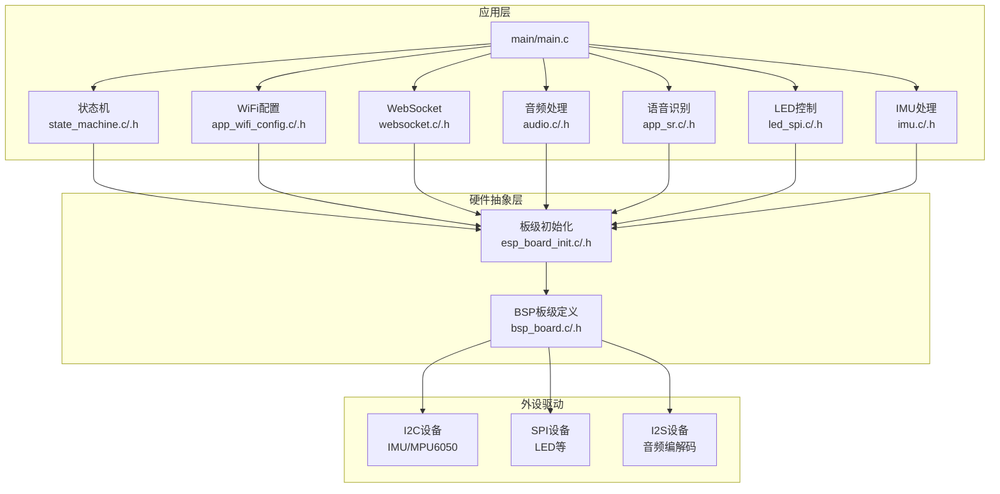
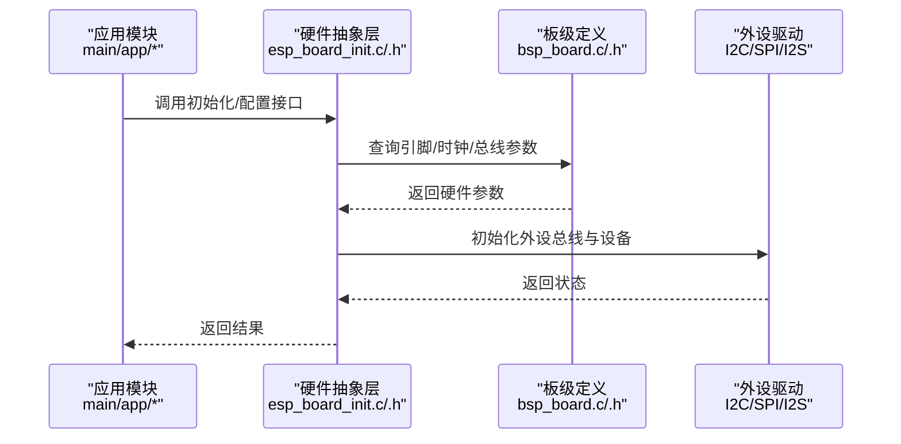
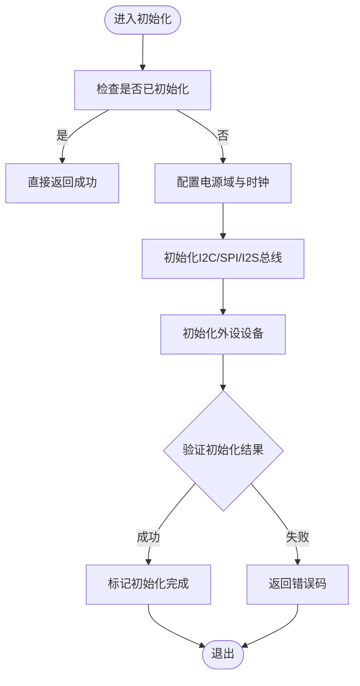
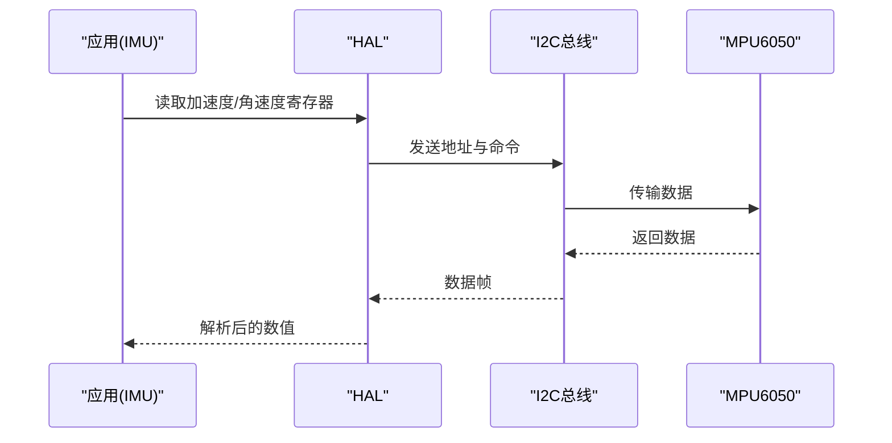
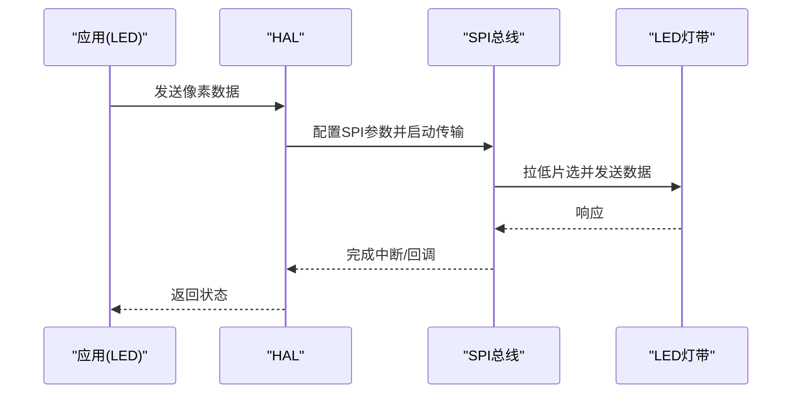
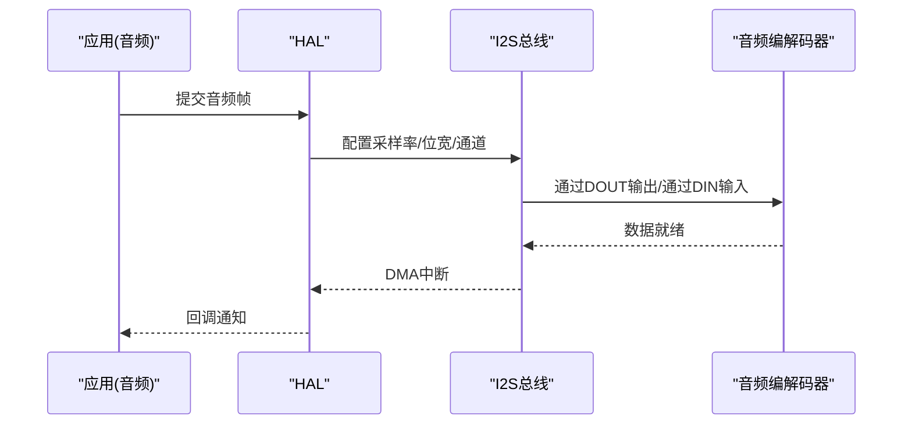
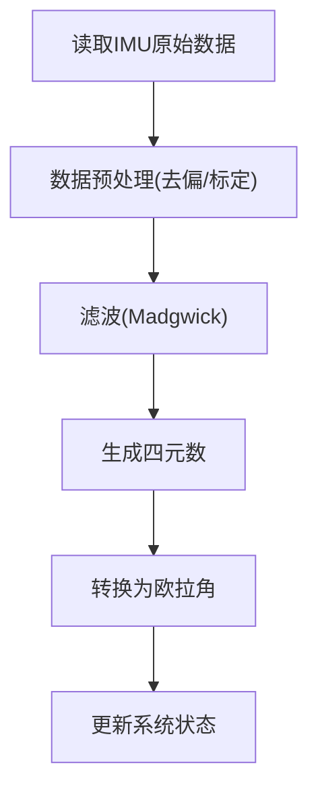
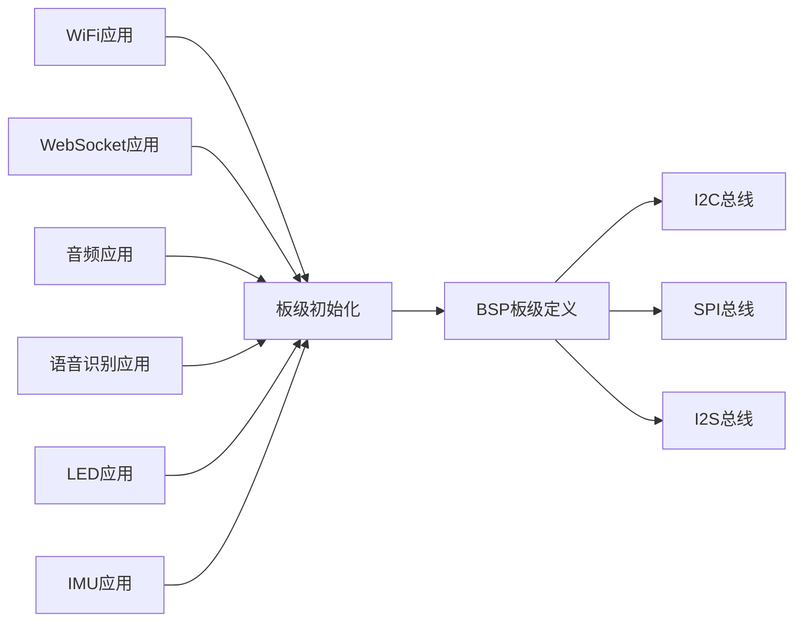

# 硬件架构设计

<cite>
**本文档引用的文件**
- [bsp_board.h](file://components/hardware_driver/boards/include/bsp_board.h)
- [bsp_board.c](file://components/hardware_driver/boards/esp32-s3/bsp_board.c)
- [esp_board_init.h](file://components/hardware_driver/include/esp_board_init.h)
- [esp_board_init.c](file://components/hardware_driver/esp_board_init.c)
- [imu_port.h](file://components/IMU/core/imu_port.h)
- [madgwick_ahrs.c](file://components/IMU/core/madgwick_ahrs.c)
- [madgwick_ahrs.h](file://components/IMU/core/madgwick_ahrs.h)
- [driver_mpu6050.c](file://components/IMU/drivers/mpu6050/driver_mpu6050.c)
- [mpu6050.c](file://components/IMU/drivers/mpu6050/mpu6050.c)
- [mpu6050.h](file://components/IMU/drivers/mpu6050/mpu6050.h)
- [led_spi.c](file://main/app/led_strip/led_spi.c)
- [led_spi.h](file://main/app/led_strip/led_spi.h)
- [audio.c](file://main/app/audio/audio.c)
- [audio.h](file://main/app/audio/audio.h)
- [app_sr.c](file://main/app/audio/app_sr.c)
- [app_sr.h](file://main/app/audio/app_sr.h)
- [websocket.c](file://main/app/websocket/websocket.c)
- [websocket.h](file://main/app/websocket/websocket.h)
- [app_wifi_config.c](file://main/app/wifi/app_wifi_config.c)
- [app_wifi_config.h](file://main/app/wifi/app_wifi_config.h)
- [state_machine.c](file://main/app/state_machine/state_machine.c)
- [state_machine.h](file://main/app/state_machine/state_machine.h)
</cite>

## 目录
1. [简介](#简介)
2. [项目结构](#项目结构)
3. [核心组件](#核心组件)
4. [架构总览](#架构总览)
5. [详细组件分析](#详细组件分析)
6. [依赖关系分析](#依赖关系分析)
7. [性能考虑](#性能考虑)
8. [故障排除指南](#故障排除指南)
9. [结论](#结论)

## 简介
本文件面向ESP32-S3开发板的硬件架构设计与实现，系统性阐述硬件抽象层（HAL）设计理念与实现方式，覆盖引脚分配、外设连接、电源管理、硬件初始化流程、GPIO配置、I2C/SPI/I2S接口设置等关键主题。文档同时提供硬件连接图与电气特性说明，帮助开发者理解硬件约束与最佳实践。

## 项目结构
该项目采用模块化分层架构：顶层应用逻辑位于 main/，硬件抽象与驱动位于 components/hardware_driver/boards/esp32-s3 与 components/IMU/ 等目录；各功能子系统（音频、IMU、LED、网络等）在 main/app/ 下以功能域组织。硬件抽象层通过统一的头文件接口屏蔽不同芯片/开发板的差异，确保上层业务可移植。

图表来源
- [bsp_board.h](file://components/hardware_driver/boards/include/bsp_board.h)
- [bsp_board.c](file://components/hardware_driver/boards/esp32-s3/bsp_board.c)
- [esp_board_init.h](file://components/hardware_driver/include/esp_board_init.h)
- [esp_board_init.c](file://components/hardware_driver/esp_board_init.c)

章节来源
- [bsp_board.h](file://components/hardware_driver/boards/include/bsp_board.h)
- [bsp_board.c](file://components/hardware_driver/boards/esp32-s3/bsp_board.c)
- [esp_board_init.h](file://components/hardware_driver/include/esp_board_init.h)
- [esp_board_init.c](file://components/hardware_driver/esp_board_init.c)

## 核心组件
- 硬件抽象层（HAL）
  - 通过统一的头文件接口封装GPIO、I2C、SPI、I2S等外设操作，屏蔽不同开发板的引脚差异。
  - 板级初始化函数负责电源域、时钟、外设总线与默认配置的建立。
- 引脚与外设映射
  - BSP层集中定义各外设信号的物理引脚分配，便于跨板移植与变更。
- 外设驱动
  - I2C/MPU6050用于IMU数据采集；SPI用于LED灯带控制；I2S用于音频输入输出。
- 应用层适配
  - 各应用模块仅依赖抽象接口，不直接耦合具体硬件细节。

章节来源
- [bsp_board.h](file://components/hardware_driver/boards/include/bsp_board.h)
- [bsp_board.c](file://components/hardware_driver/boards/esp32-s3/bsp_board.c)
- [esp_board_init.h](file://components/hardware_driver/include/esp_board_init.h)
- [esp_board_init.c](file://components/hardware_driver/esp_board_init.c)

## 架构总览
下图展示从应用到硬件抽象层再到外设驱动的整体调用链，体现“抽象接口 + 板级封装”的设计思想。

图表来源
- [esp_board_init.c](file://components/hardware_driver/esp_board_init.c)
- [esp_board_init.h](file://components/hardware_driver/include/esp_board_init.h)
- [bsp_board.c](file://components/hardware_driver/boards/esp32-s3/bsp_board.c)
- [bsp_board.h](file://components/hardware_driver/boards/include/bsp_board.h)

## 详细组件分析

### 硬件抽象层与板级初始化
- 设计理念
  - 将“硬件配置”与“业务逻辑”分离，通过抽象接口屏蔽不同开发板的引脚差异。
  - 板级初始化集中处理电源域、时钟树、外设总线与默认配置，确保后续模块无需关心底层细节。
- 关键实现要点
  - 统一的初始化入口，按需启用/禁用外设总线与设备。
  - 引脚复用与上下拉配置在BSP层集中管理，避免散落式配置。
  - 提供错误检查与返回码，便于上层进行健壮性处理。

图表来源
- [esp_board_init.c](file://components/hardware_driver/esp_board_init.c)
- [esp_board_init.h](file://components/hardware_driver/include/esp_board_init.h)
- [bsp_board.c](file://components/hardware_driver/boards/esp32-s3/bsp_board.c)
- [bsp_board.h](file://components/hardware_driver/boards/include/bsp_board.h)

章节来源
- [esp_board_init.c](file://components/hardware_driver/esp_board_init.c)
- [esp_board_init.h](file://components/hardware_driver/include/esp_board_init.h)
- [bsp_board.c](file://components/hardware_driver/boards/esp32-s3/bsp_board.c)
- [bsp_board.h](file://components/hardware_driver/boards/include/bsp_board.h)

### GPIO配置与电源管理
- GPIO配置
  - 在BSP层集中声明各外设使用的GPIO编号与模式（输入/输出/复用），并提供获取函数供上层调用。
  - 对于需要上下拉电阻或开漏/推挽的引脚，在初始化阶段统一配置。
- 电源管理
  - 通过板级初始化统一开启/关闭相关电源域与时钟源，降低功耗与提高稳定性。
  - 对高频外设（如I2S）建议在空闲时关闭时钟或降低频率。

章节来源
- [bsp_board.h](file://components/hardware_driver/boards/include/bsp_board.h)
- [bsp_board.c](file://components/hardware_driver/boards/esp32-s3/bsp_board.c)
- [esp_board_init.c](file://components/hardware_driver/esp_board_init.c)

### I2C接口设置（IMU）
- 总线特性
  - 使用标准模式（速率由BSP层配置），连接MPU6050等传感器。
- 引脚映射
  - SDA/SCL引脚在BSP层定义，确保与具体开发板一致。
- 数据流
  - 上层通过抽象接口发起读写请求，BSP层负责总线仲裁与时序控制。

图表来源
- [driver_mpu6050.c](file://components/IMU/drivers/mpu6050/driver_mpu6050.c)
- [mpu6050.c](file://components/IMU/drivers/mpu6050/mpu6050.c)
- [mpu6050.h](file://components/IMU/drivers/mpu6050/mpu6050.h)
- [bsp_board.c](file://components/hardware_driver/boards/esp32-s3/bsp_board.c)

章节来源
- [driver_mpu6050.c](file://components/IMU/drivers/mpu6050/driver_mpu6050.c)
- [mpu6050.c](file://components/IMU/drivers/mpu6050/mpu6050.c)
- [mpu6050.h](file://components/IMU/drivers/mpu6050/mpu6050.h)
- [bsp_board.c](file://components/hardware_driver/boards/esp32-s3/bsp_board.c)

### SPI接口设置（LED灯带）
- 总线特性
  - 使用主机模式，波特率由BSP层配置；数据格式通常为MSB优先。
- 引脚映射
  - MOSI/MISO/SCK/CS等引脚在BSP层定义，确保与具体开发板一致。
- 数据流
  - 上层将像素数据打包后通过抽象接口发送，BSP层完成片选与时序控制。

图表来源
- [led_spi.c](file://main/app/led_strip/led_spi.c)
- [led_spi.h](file://main/app/led_strip/led_spi.h)
- [bsp_board.c](file://components/hardware_driver/boards/esp32-s3/bsp_board.c)

章节来源
- [led_spi.c](file://main/app/led_strip/led_spi.c)
- [led_spi.h](file://main/app/led_strip/led_spi.h)
- [bsp_board.c](file://components/hardware_driver/boards/esp32-s3/bsp_board.c)

### I2S接口设置（音频）
- 总线特性
  - 支持主/从模式，采样率与位宽在BSP层配置；注意DMA与中断的配合。
- 引脚映射
  - BCLK/LRCK/DIN/DOUT等引脚在BSP层定义，确保与具体开发板一致。
- 数据流
  - 上层通过抽象接口提交音频帧，BSP层完成I2S通道配置与DMA传输。

图表来源
- [audio.c](file://main/app/audio/audio.c)
- [audio.h](file://main/app/audio/audio.h)
- [bsp_board.c](file://components/hardware_driver/boards/esp32-s3/bsp_board.c)

章节来源
- [audio.c](file://main/app/audio/audio.c)
- [audio.h](file://main/app/audio/audio.h)
- [bsp_board.c](file://components/hardware_driver/boards/esp32-s3/bsp_board.c)

### IMU数据处理与AHRS算法
- 数据采集
  - 通过I2C读取加速度、角速度与磁力计数据，BSP层提供总线与设备访问接口。
- 算法实现
  - 使用Madgwick滤波算法进行姿态解算，输出四元数或欧拉角，供上层状态机与UI模块使用。

图表来源
- [imu_port.h](file://components/IMU/core/imu_port.h)
- [madgwick_ahrs.c](file://components/IMU/core/madgwick_ahrs.c)
- [madgwick_ahrs.h](file://components/IMU/core/madgwick_ahrs.h)
- [driver_mpu6050.c](file://components/IMU/drivers/mpu6050/driver_mpu6050.c)

章节来源
- [imu_port.h](file://components/IMU/core/imu_port.h)
- [madgwick_ahrs.c](file://components/IMU/core/madgwick_ahrs.c)
- [madgwick_ahrs.h](file://components/IMU/core/madgwick_ahrs.h)
- [driver_mpu6050.c](file://components/IMU/drivers/mpu6050/driver_mpu6050.c)

### 状态机与系统协调
- 状态机负责协调各子系统的运行时机与资源占用，结合IMU、音频、网络与LED等模块，实现复杂交互场景。
- BSP/HAL层提供统一的定时器/中断接口，保证状态切换的实时性与一致性。

章节来源
- [state_machine.c](file://main/app/state_machine/state_machine.c)
- [state_machine.h](file://main/app/state_machine/state_machine.h)

## 依赖关系分析
- 组件内聚与解耦
  - 应用模块仅依赖抽象接口，不直接依赖具体硬件实现，提升可维护性与可移植性。
- 外部依赖
  - I2C/SPI/I2S等外设依赖ESP-IDF提供的hal/driver层，BSP层在此基础上增加板级定制。
- 潜在风险
  - 若BSP层引脚冲突或时钟配置不当，可能导致外设通信异常；应在初始化阶段严格校验。

图表来源
- [esp_board_init.c](file://components/hardware_driver/esp_board_init.c)
- [bsp_board.c](file://components/hardware_driver/boards/esp32-s3/bsp_board.c)

章节来源
- [esp_board_init.c](file://components/hardware_driver/esp_board_init.c)
- [bsp_board.c](file://components/hardware_driver/boards/esp32-s3/bsp_board.c)

## 性能考虑
- 总线速率与DMA
  - I2C/SPI尽量使用较高速率并配合DMA，减少CPU占用；I2S采样率与帧大小需平衡延迟与功耗。
- 时钟与电源
  - 高频外设在空闲时及时降频或关时钟；必要时启用轻度睡眠模式降低功耗。
- 中断与任务调度
  - 将耗时的外设操作放入任务或中断中处理，避免阻塞主循环；合理设置优先级与队列长度。

## 故障排除指南
- I2C通信失败
  - 检查SDA/SCL引脚是否被其他模块占用；确认上拉电阻与电平匹配；核对BSP层时钟与速率配置。
- SPI传输错误
  - 校验片选信号与时序；确认极性和相位设置；检查DMA缓冲区与长度。
- I2S无声/杂音
  - 检查BCLK/LRCK相位关系；确认采样率与位宽一致；排查DMA中断与缓冲区溢出。
- 初始化卡死
  - 在板级初始化中加入超时与错误返回机制；逐步注释模块定位问题。

章节来源
- [esp_board_init.c](file://components/hardware_driver/esp_board_init.c)
- [bsp_board.c](file://components/hardware_driver/boards/esp32-s3/bsp_board.c)

## 结论
本项目通过“硬件抽象层 + 板级封装”的架构，有效屏蔽了ESP32-S3开发板的硬件差异，使上层应用能够以统一接口高效地使用GPIO、I2C、SPI、I2S等外设。结合严格的初始化流程、清晰的引脚映射与完善的错误处理，既保证了系统的稳定性，也为后续扩展与移植提供了良好基础。