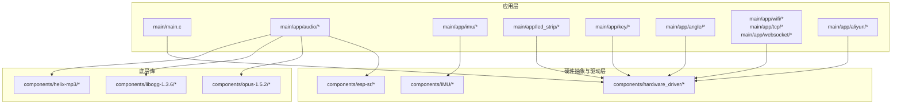
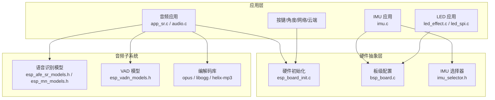
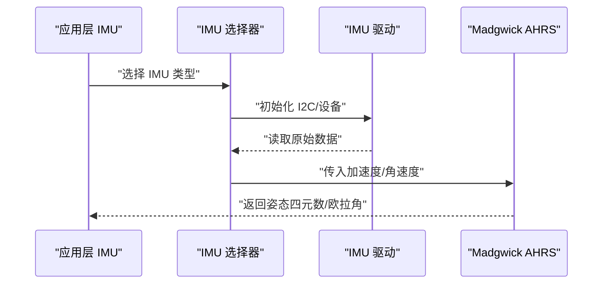
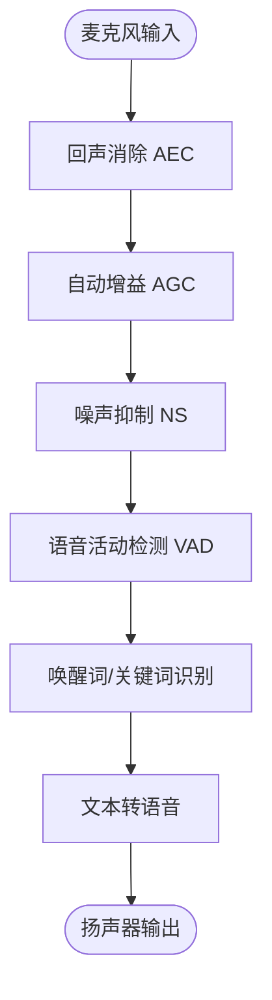
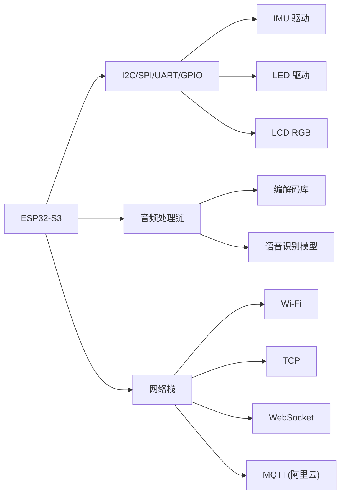

# 硬件组件清单

<cite>
**本文档引用的文件**
- [sdkconfig.defaults](file://sdkconfig.defaults)
- [bsp_board.c](file://components/hardware_driver/boards/esp32-s3/bsp_board.c)
- [bsp_board.h](file://components/hardware_driver/boards/include/bsp_board.h)
- [esp_board_init.h](file://components/hardware_driver/include/esp_board_init.h)
- [esp_board_init.c](file://components/hardware_driver/esp_board_init.c)
- [imu_selector.h](file://components/IMU/imu_selector.h)
- [driver_mpu6050.c](file://components/IMU/drivers/mpu6050/driver_mpu6050.c)
- [mpu6050.h](file://components/IMU/drivers/mpu6050/mpu6050.h)
- [madgwick_ahrs.h](file://components/IMU/core/madgwick_ahrs.h)
- [madgwick_ahrs.c](file://components/IMU/core/madgwick_ahrs.c)
- [led_effect.h](file://main/app/led_strip/led_effect.h)
- [led_spi.h](file://main/app/led_strip/led_spi.h)
- [audio.h](file://main/app/audio/audio.h)
- [app_sr.h](file://main/app/audio/app_sr.h)
- [websocket.h](file://main/app/websocket/websocket.h)
- [app_wifi_config.h](file://main/app/wifi/app_wifi_config.h)
- [app_tcp.h](file://main/app/tcp/app_tcp.h)
- [app_key.h](file://main/app/key/app_key.h)
- [angle_config_manager.h](file://main/app/angle/angle_config_manager.h)
- [aliyun_mqtt.h](file://components/aliyun_mqtt/include/aliyun_mqtt.h)
- [esp_websocket_client.h](file://components/esp_websocket_client/esp_websocket_client.h)
- [esp32s3/include/esp_afe_sr_models.h](file://components/esp-sr/esp32s3/include/esp_afe_sr_models.h)
- [esp32s3/include/esp_mn_models.h](file://components/esp-sr/esp32s3/include/esp_mn_models.h)
- [esp32s3/include/esp_vadn_models.h](file://components/esp-sr/esp32s3/include/esp_vadn_models.h)
- [model/pack_model.py](file://components/esp-sr/model/pack_model.py)
</cite>

## 目录
1. [引言](#引言)
2. [项目结构](#项目结构)
3. [核心组件](#核心组件)
4. [架构总览](#架构总览)
5. [详细组件分析](#详细组件分析)
6. [依赖关系分析](#依赖关系分析)
7. [性能考虑](#性能考虑)
8. [故障排除指南](#故障排除指南)
9. [结论](#结论)
10. [附录](#附录)

## 引言
本文件面向开发者，系统梳理基于 ESP32-S3 的硬件组件清单与技术特性，覆盖主控芯片、传感器、音频硬件、LED 驱动、存储与网络通信等模块。文档提供组件型号与功能说明、在电路板上的位置标识（以接口/引脚命名为主）、连接关系图示，并总结选型依据、性能特征与使用注意事项，帮助快速理解与高效开发。

## 项目结构
该工程采用按功能域分层的组件化组织方式：顶层为应用层（main/app），中间为硬件抽象与驱动（hardware_driver、IMU、esp-sr 等），底层为第三方库（opus、libogg、helix-mp3）。ESP32-S3 作为主控，通过硬件驱动层统一管理外设资源；应用层通过抽象接口访问硬件能力。

图表来源
- [sdkconfig.defaults](file://sdkconfig.defaults)
- [esp_board_init.c](file://components/hardware_driver/esp_board_init.c)
- [bsp_board.c](file://components/hardware_driver/boards/esp32-s3/bsp_board.c)

章节来源
- [sdkconfig.defaults](file://sdkconfig.defaults)
- [esp_board_init.c](file://components/hardware_driver/esp_board_init.c)
- [bsp_board.c](file://components/hardware_driver/boards/esp32-s3/bsp_board.c)

## 核心组件
本节从系统视角概述主要硬件组件及其职责：

- 主控芯片：ESP32-S3（双核 240MHz，集成 Wi-Fi/蓝牙，支持 PSRAM）
- 存储与分区：SPI Flash（16MB），自定义分区表
- 外设总线：I2C、SPI、UART、GPIO
- 传感器：IMU（MPU6050 或 ICM20948，姿态解算）
- 音频：录音/播放（AEC/AGC/NS/VAD/ASR/TTS/Opus/MP3/Ogg）
- 显示与背光：LCD RGB 接口（缓冲策略可配置）
- LED 驱动：LED Strip 控制（WS2812 等）
- 无线通信：Wi-Fi、TCP/WebSocket、MQTT（阿里云）

章节来源
- [sdkconfig.defaults](file://sdkconfig.defaults)
- [esp_board_init.h](file://components/hardware_driver/include/esp_board_init.h)
- [bsp_board.h](file://components/hardware_driver/boards/include/bsp_board.h)

## 架构总览
下图展示应用层如何通过硬件抽象层访问底层外设与算法库，以及音频处理链路。

图表来源
- [esp_board_init.c](file://components/hardware_driver/esp_board_init.c)
- [bsp_board.c](file://components/hardware_driver/boards/esp32-s3/bsp_board.c)
- [imu_selector.h](file://components/IMU/imu_selector.h)
- [esp32s3/include/esp_afe_sr_models.h](file://components/esp-sr/esp32s3/include/esp_afe_sr_models.h)
- [esp32s3/include/esp_mn_models.h](file://components/esp-sr/esp32s3/include/esp_mn_models.h)
- [esp32s3/include/esp_vadn_models.h](file://components/esp-sr/esp32s3/include/esp_vadn_models.h)

## 详细组件分析

### 主控芯片：ESP32-S3
- 型号与定位：双核 Xtensa 逻辑处理器，主频 240MHz，集成 Wi-Fi 6 和 Bluetooth Low Energy，支持外部 PSRAM。
- 关键特性：64KB 数据缓存、SPIRAM 支持、高性能计算与实时任务调度。
- 选型依据：本项目启用 SPIRAM、高速 Flash、优化编译参数，适配音频与 AI 推理需求。
- 使用注意事项：注意内存与功耗规划，合理使用 DMA 与中断优先级。

章节来源
- [sdkconfig.defaults](file://sdkconfig.defaults)

### 存储与分区：SPI Flash 与分区表
- Flash 规格：16MB QIO 模式，高速读写。
- 分区策略：自定义分区表，满足文件系统与多分区需求。
- 选型依据：大容量 Flash 满足音频与模型存储，配合 SPIRAM 提升运行时性能。
- 使用注意事项：分区布局需与文件系统及 OTA 升级策略匹配。

章节来源
- [sdkconfig.defaults](file://sdkconfig.defaults)

### 传感器与姿态解算：IMU
- 传感器类型：支持 MPU6050 或 ICM20948（通过选择器切换）。
- 解算算法：Madgwick AHRS 实现姿态解算。
- 连接关系：通常通过 I2C 接口接入主控，IMU 选择器负责驱动选择。
- 选型依据：MPU6050 成本低、易用；ICM20948 具备更高精度与磁力计。
- 使用注意事项：校准与滤波参数需结合实际使用场景调整。

图表来源
- [imu_selector.h](file://components/IMU/imu_selector.h)
- [driver_mpu6050.c](file://components/IMU/drivers/mpu6050/driver_mpu6050.c)
- [mpu6050.h](file://components/IMU/drivers/mpu6050/mpu6050.h)
- [madgwick_ahrs.h](file://components/IMU/core/madgwick_ahrs.h)
- [madgwick_ahrs.c](file://components/IMU/core/madgwick_ahrs.c)

章节来源
- [imu_selector.h](file://components/IMU/imu_selector.h)
- [driver_mpu6050.c](file://components/IMU/drivers/mpu6050/driver_mpu6050.c)
- [mpu6050.h](file://components/IMU/drivers/mpu6050/mpu6050.h)
- [madgwick_ahrs.h](file://components/IMU/core/madgwick_ahrs.h)
- [madgwick_ahrs.c](file://components/IMU/core/madgwick_ahrs.c)

### 音频硬件与算法：录音/播放与 AI 语音
- 音频处理链：AEC/AGC/NS/VAD → 语音识别（WakeNet/MultiNet）→ TTS → 播放。
- 编解码：Opus、Ogg Vorbis、MP3（Helix）。
- 模型打包：模型打包脚本用于生成可加载的模型文件。
- 选型依据：ESP32-S3 内置 AFE 与 DSP 能力，结合量化模型实现低功耗推理。
- 使用注意事项：注意采样率、通道数与缓冲深度的平衡，避免音频延迟与失真。

图表来源
- [esp32s3/include/esp_afe_sr_models.h](file://components/esp-sr/esp32s3/include/esp_afe_sr_models.h)
- [esp32s3/include/esp_mn_models.h](file://components/esp-sr/esp32s3/include/esp_mn_models.h)
- [esp32s3/include/esp_vadn_models.h](file://components/esp-sr/esp32s3/include/esp_vadn_models.h)
- [model/pack_model.py](file://components/esp-sr/model/pack_model.py)

章节来源
- [esp32s3/include/esp_afe_sr_models.h](file://components/esp-sr/esp32s3/include/esp_afe_sr_models.h)
- [esp32s3/include/esp_mn_models.h](file://components/esp-sr/esp32s3/include/esp_mn_models.h)
- [esp32s3/include/esp_vadn_models.h](file://components/esp-sr/esp32s3/include/esp_vadn_models.h)
- [model/pack_model.py](file://components/esp-sr/model/pack_model.py)

### LED 驱动：LED Strip 控制
- 控制方式：通过 SPI 或单总线协议驱动 WS2812 等 LED。
- 功能：支持多种特效与颜色变化，与状态机联动。
- 选型依据：根据 LED 数量与刷新频率选择合适的驱动与缓冲策略。
- 使用注意事项：注意信号完整性与时序要求，避免高频干扰。

章节来源
- [led_effect.h](file://main/app/led_strip/led_effect.h)
- [led_spi.h](file://main/app/led_strip/led_spi.h)

### 显示与背光：LCD RGB 接口
- 特性：RGB Buffer 数量与回弹缓冲模式可配置，支持高帧率显示。
- 选型依据：根据分辨率与刷新率选择合适的缓冲策略，减少撕裂与卡顿。
- 使用注意事项：注意 RGB 时序与背光控制，避免闪烁与色彩偏差。

章节来源
- [sdkconfig.defaults](file://sdkconfig.defaults)

### 无线通信：Wi-Fi、TCP、WebSocket、MQTT
- Wi-Fi：STA/AP 模式，支持静态/DHCP 地址配置。
- TCP：客户端/服务端模式，用于数据传输。
- WebSocket：轻量级双向通信，适合事件推送。
- MQTT（阿里云）：云端对接，支持订阅/发布消息。
- 选型依据：根据应用场景选择合适协议，平衡实时性与功耗。
- 使用注意事项：注意网络异常处理与重连策略，确保消息可靠性。

章节来源
- [app_wifi_config.h](file://main/app/wifi/app_wifi_config.h)
- [app_tcp.h](file://main/app/tcp/app_tcp.h)
- [websocket.h](file://main/app/websocket/websocket.h)
- [aliyun_mqtt.h](file://components/aliyun_mqtt/include/aliyun_mqtt.h)
- [esp_websocket_client.h](file://components/esp_websocket_client/esp_websocket_client.h)

### 板级初始化与外设映射：硬件抽象层
- 硬件初始化：统一初始化电源、时钟、外设总线与关键 IO。
- 板级配置：定义各外设的引脚映射、默认配置与工作模式。
- 选型依据：遵循 BSP 规范，保证不同硬件版本的兼容性。
- 使用注意事项：修改引脚或供电需同步更新 BSP 与上层配置。

章节来源
- [esp_board_init.h](file://components/hardware_driver/include/esp_board_init.h)
- [esp_board_init.c](file://components/hardware_driver/esp_board_init.c)
- [bsp_board.h](file://components/hardware_driver/boards/include/bsp_board.h)
- [bsp_board.c](file://components/hardware_driver/boards/esp32-s3/bsp_board.c)

## 依赖关系分析
硬件组件之间的依赖关系如下：

图表来源
- [sdkconfig.defaults](file://sdkconfig.defaults)
- [bsp_board.c](file://components/hardware_driver/boards/esp32-s3/bsp_board.c)
- [esp_board_init.c](file://components/hardware_driver/esp_board_init.c)
- [esp32s3/include/esp_afe_sr_models.h](file://components/esp-sr/esp32s3/include/esp_afe_sr_models.h)

章节来源
- [sdkconfig.defaults](file://sdkconfig.defaults)
- [bsp_board.c](file://components/hardware_driver/boards/esp32-s3/bsp_board.c)
- [esp_board_init.c](file://components/hardware_driver/esp_board_init.c)

## 性能考虑
- CPU 频率与缓存：240MHz 双核与 64KB 数据缓存，适合实时处理与多任务并发。
- 内存扩展：启用 SPIRAM 并设置指令/只读数据分离，提升运行时性能。
- 音频与 AI：量化模型与硬件加速结合，降低功耗与延迟。
- 存储与 I/O：Flash 高速与合理的分区布局，减少文件系统碎片与读写抖动。
- 无线：根据场景选择合适的吞吐与功耗策略，避免长时间高负载导致过热。

## 故障排除指南
- 无法识别 IMU：检查 I2C 地址与上拉电阻，确认驱动初始化顺序。
- LED 不亮：检查 SPI 引脚映射与时序，确认 LED 类型与电流限制。
- 音频破音/延迟：调整缓冲深度与采样率，检查 AEC/AGC 参数。
- Wi-Fi 断连：检查 AP 信道与干扰，优化重连策略与看门狗。
- OTA/升级失败：确认分区表与引导程序配置，避免写入冲突。

## 结论
本硬件平台围绕 ESP32-S3 构建，具备完善的传感器、音频、显示与网络能力。通过硬件抽象层与模块化设计，开发者可以快速集成 IMU、LED、音频与云端服务。建议在实际部署中重点关注内存与功耗规划、音频链路稳定性与网络可靠性，以获得最佳用户体验。

## 附录
- 组件选型建议：优先选用成熟驱动与量化模型，兼顾成本与性能。
- 最佳实践：分层设计、参数可配置、日志与错误码规范化、边界条件测试完备。
- 扩展方向：可加入更多传感器（如气压/磁力计）、更高性能编解码与更丰富的 AI 模型。