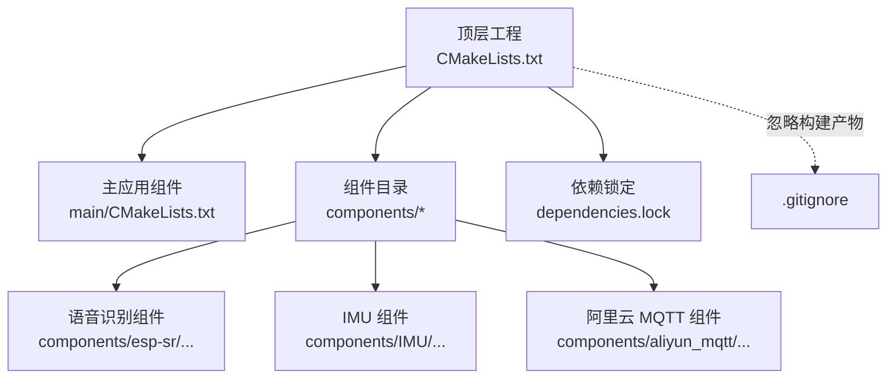
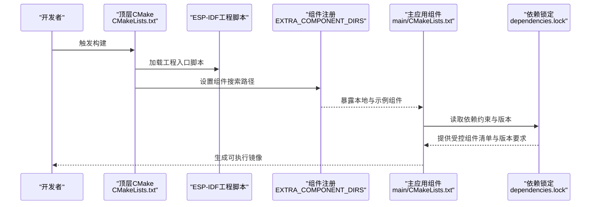
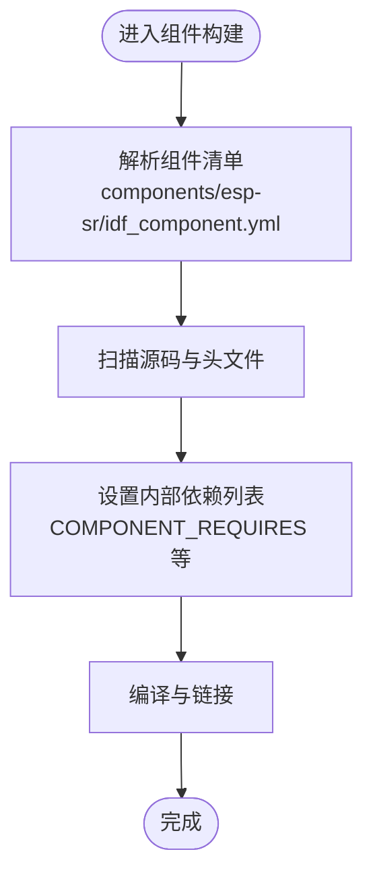
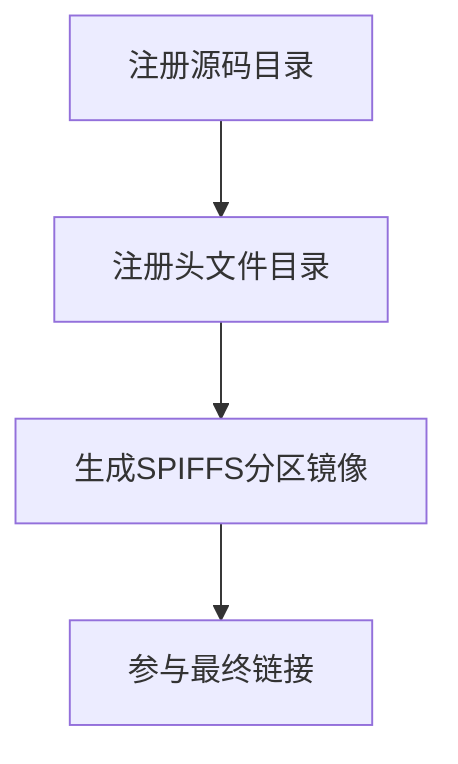
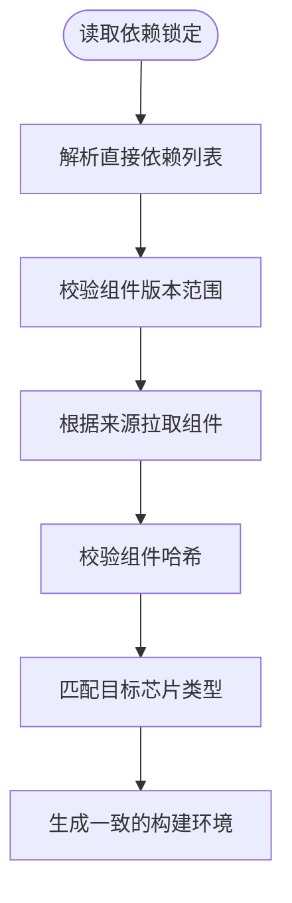
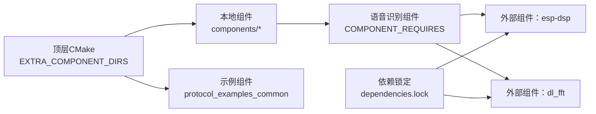

# 依赖管理策略

<cite>
**本文引用的文件**
- [CMakeLists.txt](file://CMakeLists.txt)
- [main/CMakeLists.txt](file://main/CMakeLists.txt)
- [dependencies.lock](file://dependencies.lock)
- [components/esp-sr/idf_component.yml](file://components/esp-sr/idf_component.yml)
- [components/esp-sr/CMakeLists.txt](file://components/esp-sr/CMakeLists.txt)
- [.gitignore](file://.gitignore)
</cite>

## 目录
1. [引言](#引言)
2. [项目结构](#项目结构)
3. [核心组件](#核心组件)
4. [架构总览](#架构总览)
5. [详细组件分析](#详细组件分析)
6. [依赖关系分析](#依赖关系分析)
7. [性能考量](#性能考量)
8. [故障排查指南](#故障排查指南)
9. [结论](#结论)
10. [附录](#附录)

## 引言
本文件系统化阐述本项目的依赖管理策略，覆盖第三方库集成、版本控制与冲突化解法、ESP-IDF 组件体系的注册与配置、构建依赖与目标平台适配、依赖更新与安全审计流程、本地组件开发与私有库管理、依赖缓存与一致性保障，以及常见问题诊断与最佳实践。文档以仓库现有配置与组件为依据，避免臆测，确保可操作性与可追溯性。

## 项目结构
项目采用 ESP-IDF 标准工程布局，顶层通过 CMake 驱动构建；主应用位于 main 目录，第三方与自研组件置于 components 目录；依赖锁定文件记录了受控的外部组件及其约束；构建产物与托管组件目录默认被忽略，避免污染源码树。

图示来源
- [CMakeLists.txt:1-10](file://CMakeLists.txt#L1-L10)
- [main/CMakeLists.txt:1-4](file://main/CMakeLists.txt#L1-L4)
- [.gitignore:1-3](file://.gitignore#L1-L3)

章节来源
- [CMakeLists.txt:1-10](file://CMakeLists.txt#L1-L10)
- [main/CMakeLists.txt:1-4](file://main/CMakeLists.txt#L1-L4)
- [.gitignore:1-3](file://.gitignore#L1-L3)

## 核心组件
- 顶层构建与环境
  - 通过 EXTRA_COMPONENT_DIRS 注入额外组件路径，包含示例组件与本地 components 目录，统一纳入构建。
  - 包含 ESP-IDF 的标准工程入口脚本，确保工具链与目标平台配置正确加载。
- 主应用组件
  - 使用 idf_component_register 聚合多子目录源码与头文件路径，便于统一编译与链接。
- 依赖锁定
  - dependencies.lock 明确列出直接依赖（如 espressif/dl_fft、espressif/esp-dsp）及它们对 ESP-IDF 版本的要求与来源（Espressif 组件服务），并指定目标芯片型号与锁版本号，保证跨环境一致性。

章节来源
- [CMakeLists.txt:5-9](file://CMakeLists.txt#L5-L9)
- [main/CMakeLists.txt:1-3](file://main/CMakeLists.txt#L1-L3)
- [dependencies.lock:1-33](file://dependencies.lock#L1-L33)

## 架构总览
下图展示了从顶层构建到组件注册、再到依赖解析与锁定的整体流程。

图示来源
- [CMakeLists.txt:5-9](file://CMakeLists.txt#L5-L9)
- [main/CMakeLists.txt:1-3](file://main/CMakeLists.txt#L1-L3)
- [dependencies.lock:1-33](file://dependencies.lock#L1-L33)

## 详细组件分析

### 语音识别组件（esp-sr）
该组件采用 ESP-IDF 组件清单进行声明式注册，支持多芯片架构的头文件与模型资源组织，并通过 CMake 列表变量声明内部依赖关系，便于构建系统自动处理链接顺序与可见性。

图示来源
- [components/esp-sr/idf_component.yml](file://components/esp-sr/idf_component.yml)
- [components/esp-sr/CMakeLists.txt](file://components/esp-sr/CMakeLists.txt)

章节来源
- [components/esp-sr/idf_component.yml](file://components/esp-sr/idf_component.yml)
- [components/esp-sr/CMakeLists.txt](file://components/esp-sr/CMakeLists.txt)

### 主应用组件（main）
主应用通过 idf_component_register 将多个子目录的源文件与头文件路径统一注册，简化顶层 CMakeLists 的维护成本，并通过 SPIFFS 分区指令生成存储分区映像，便于后续打包与烧录。

图示来源
- [main/CMakeLists.txt:1-4](file://main/CMakeLists.txt#L1-L4)

章节来源
- [main/CMakeLists.txt:1-4](file://main/CMakeLists.txt#L1-L4)

### 依赖锁定与版本控制
依赖锁定文件明确记录了直接依赖、版本范围、来源与哈希校验值，以及目标芯片类型与锁版本号，确保不同环境下的构建一致性与可复现性。

图示来源
- [dependencies.lock:1-33](file://dependencies.lock#L1-L33)

章节来源
- [dependencies.lock:1-33](file://dependencies.lock#L1-L33)

## 依赖关系分析
- 组件发现与注册
  - 顶层 CMake 通过 EXTRA_COMPONENT_DIRS 将本地 components 与示例组件纳入搜索范围，实现“即插即用”的组件注册。
- 内部依赖声明
  - 语音识别组件通过 CMake 变量声明内部依赖，构建系统据此安排编译顺序与链接参数。
- 外部依赖与锁定
  - 依赖锁定文件定义了对外部组件的版本与来源约束，避免隐式升级导致的不一致。

图示来源
- [CMakeLists.txt:5](file://CMakeLists.txt#L5)
- [components/esp-sr/CMakeLists.txt](file://components/esp-sr/CMakeLists.txt)
- [dependencies.lock:26-28](file://dependencies.lock#L26-L28)

章节来源
- [CMakeLists.txt:5](file://CMakeLists.txt#L5)
- [components/esp-sr/CMakeLists.txt](file://components/esp-sr/CMakeLists.txt)
- [dependencies.lock:26-28](file://dependencies.lock#L26-L28)

## 性能考量
- 组件粒度与编译时间
  - 将功能拆分为独立组件（如 IMU、音频、MQTT）可提升增量编译效率，减少无关模块重编。
- 依赖最小化
  - 仅引入必要组件与版本范围，避免冗余依赖带来的链接体积与启动开销。
- 缓存与一致性
  - 依赖锁定与哈希校验可显著降低因组件变更引发的回归风险，提高迭代稳定性。

## 故障排查指南
- 构建失败：组件未找到或路径错误
  - 检查 EXTRA_COMPONENT_DIRS 是否包含正确的本地组件路径与示例组件目录。
  - 确认组件清单与 CMake 变量声明无拼写错误。
- 版本冲突或链接错误
  - 对照依赖锁定文件中的版本范围与来源，确认当前环境满足最低要求。
  - 若存在多版本共存，优先使用锁定文件指定的版本，避免隐式升级。
- 构建产物污染源码树
  - 确保 build 与 managed_components 已加入 .gitignore，避免提交非源码文件。
- 目标平台不匹配
  - 检查依赖锁定中的目标芯片类型是否与当前 SDK 配置一致。

章节来源
- [CMakeLists.txt:5](file://CMakeLists.txt#L5)
- [dependencies.lock:31](file://dependencies.lock#L31)
- [.gitignore:1-2](file://.gitignore#L1-L2)

## 结论
本项目通过“组件清单 + 顶层 CMake 注册 + 依赖锁定”的组合策略，实现了清晰、可控且可复现的依赖管理体系。建议在后续演进中持续完善以下方面：补充自动化安全审计与兼容性检查流程、规范私有库发布与命名空间、细化依赖更新审批与回归验证机制，并固化依赖缓存与镜像策略以提升团队协作效率。

## 附录

### 依赖更新与安全审计流程（建议）
- 更新步骤
  - 在受控分支上调整依赖锁定文件中的版本范围或来源。
  - 运行全量构建与关键测试，验证二进制兼容性与功能回归。
  - 合并前进行安全扫描（如许可证合规与漏洞检测）。
- 审计要点
  - 记录每次变更的动机、影响面与回滚预案。
  - 对外部组件来源进行可信度评估与供应链追踪。

### 本地组件开发与私有库管理（建议）
- 命名规范
  - 私有组件采用组织前缀命名，避免与官方组件冲突。
- 清单与依赖
  - 在组件清单中明确声明内部依赖与接口头文件，保持模块边界清晰。
- 发布与分发
  - 通过内部制品库或 Git Submodule/Registry 管理私有组件版本，配合依赖锁定文件统一拉取。

### 依赖缓存策略（建议）
- 构建缓存
  - 利用 CI 的构建缓存与依赖缓存，缩短重复任务耗时。
- 依赖锁定
  - 严格使用依赖锁定文件，避免隐式升级；对关键组件固定哈希或版本范围。
- 环境隔离
  - 通过容器或虚拟环境固化工具链版本，确保跨机一致性。