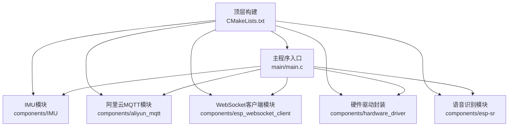
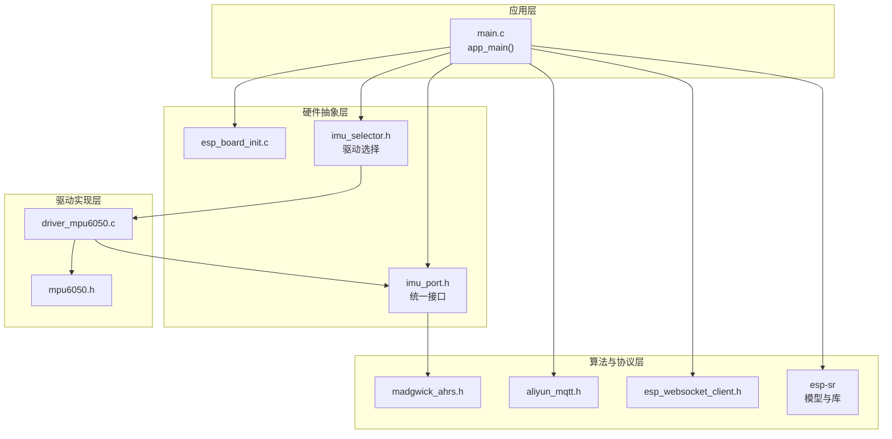
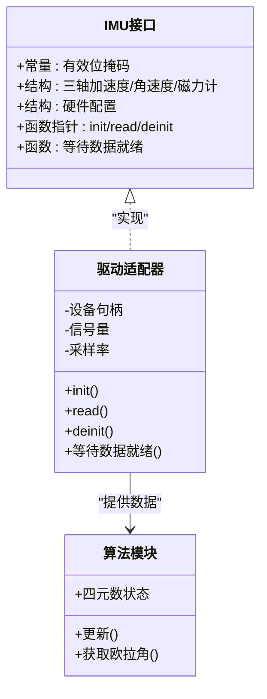
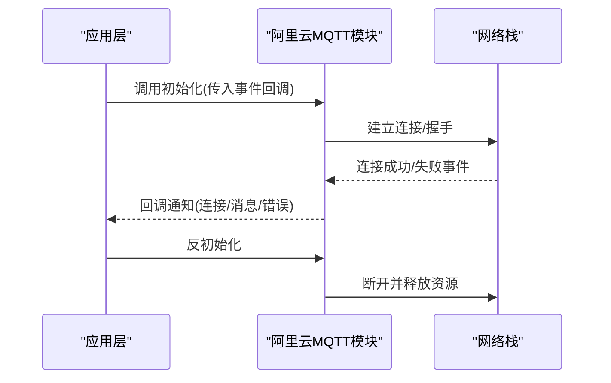
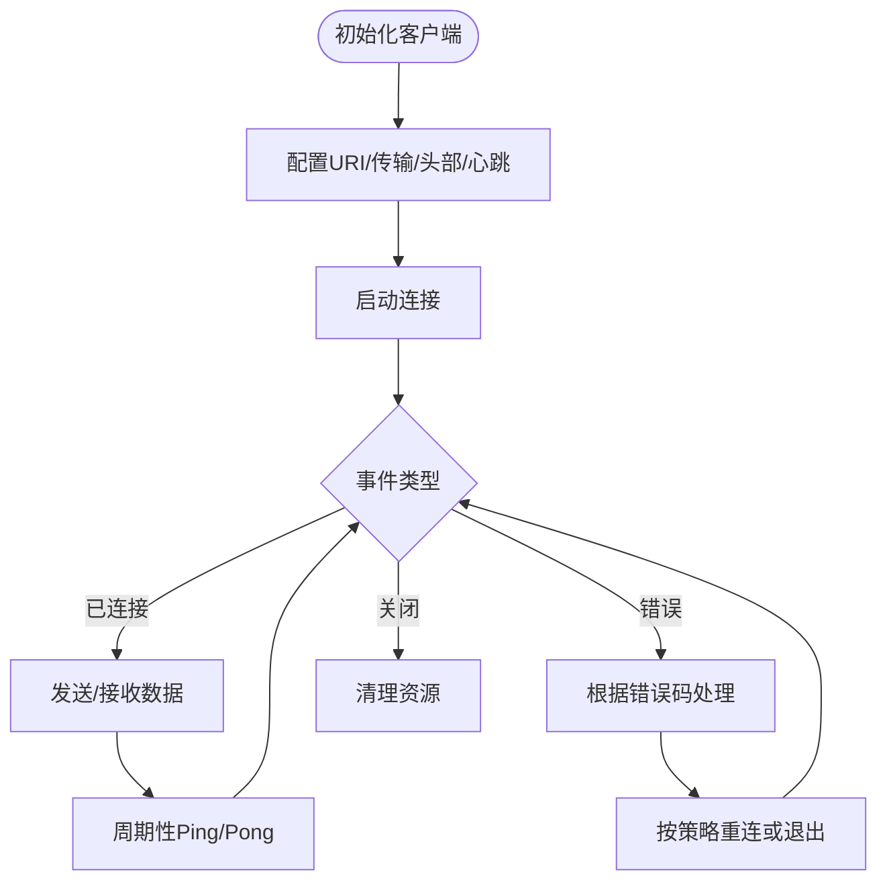
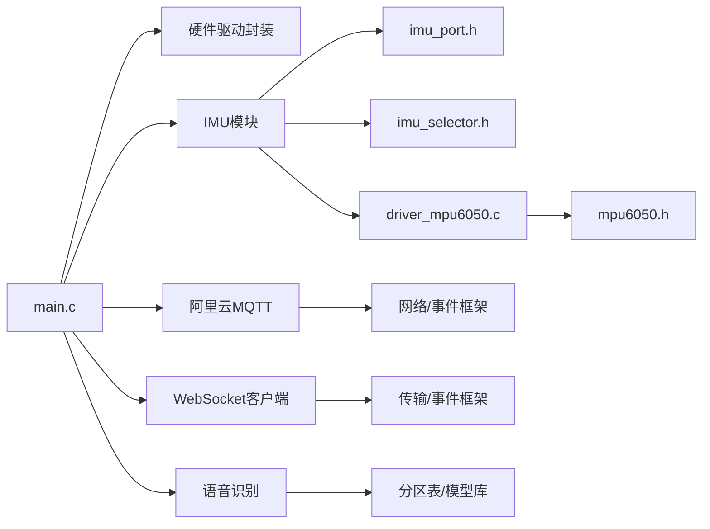

# 模块化设计原则

<cite>
**本文档引用的文件**
- [CMakeLists.txt](file://CMakeLists.txt)
- [main.c](file://main/main.c)
- [CMakeLists.txt](file://components/IMU/CMakeLists.txt)
- [imu_selector.h](file://components/IMU/imu_selector.h)
- [imu_port.h](file://components/IMU/core/imu_port.h)
- [madgwick_ahrs.h](file://components/IMU/core/madgwick_ahrs.h)
- [driver_mpu6050.c](file://components/IMU/drivers/mpu6050/driver_mpu6050.c)
- [mpu6050.h](file://components/IMU/drivers/mpu6050/mpu6050.h)
- [CMakeLists.txt](file://components/aliyun_mqtt/CMakeLists.txt)
- [aliyun_mqtt.h](file://components/aliyun_mqtt/include/aliyun_mqtt.h)
- [CMakeLists.txt](file://components/esp_websocket_client/CMakeLists.txt)
- [esp_websocket_client.h](file://components/esp_websocket_client/esp_websocket_client.h)
- [esp_board_init.c](file://components/hardware_driver/esp_board_init.c)
- [CMakeLists.txt](file://components/esp-sr/CMakeLists.txt)
- [esp_sr_debug.h](file://components/esp-sr/src/include/esp_sr_debug.h)
</cite>

## 目录
1. [简介](#简介)
2. [项目结构](#项目结构)
3. [核心组件](#核心组件)
4. [架构总览](#架构总览)
5. [详细组件分析](#详细组件分析)
6. [依赖分析](#依赖分析)
7. [性能考量](#性能考量)
8. [故障排查指南](#故障排查指南)
9. [结论](#结论)
10. [附录](#附录)

## 简介
本文件围绕模块化设计原则，系统梳理该项目在硬件抽象、传感器融合、通信协议与语音识别等领域的模块化组织方式，重点阐述：
- 功能模块划分策略：以“硬件抽象层”“算法适配层”“应用接口层”三层解耦为核心
- 模块边界定义：通过统一接口、最小暴露面、Kconfig条件编译实现边界清晰
- 模块间耦合控制：以接口契约、事件回调、组件注册机制降低耦合
- 组件独立性、接口标准化与依赖管理：以CMake组件化、REQUIRES声明、私有依赖约束实现
- 可重用性、可测试性与可维护性：通过可替换驱动、可配置采样率、可开关调试模式提升工程可演进性
- 模块化重构指南与最佳实践：给出从紧耦合到松耦合的迁移路径与代码级示例定位

## 项目结构
项目采用ESP-IDF组件化构建，顶层通过EXTRA_COMPONENT_DIRS聚合各子模块，主程序仅负责初始化顺序与任务调度，体现“高层协调、低层自治”的模块化思想。

图示来源
- [CMakeLists.txt:5-10](file://CMakeLists.txt#L5-L10)
- [main.c:18-30](file://main/main.c#L18-L30)

章节来源
- [CMakeLists.txt:1-10](file://CMakeLists.txt#L1-L10)
- [main.c:33-60](file://main/main.c#L33-L60)

## 核心组件
本节聚焦四大关键模块：IMU传感器抽象与适配、阿里云MQTT、WebSocket客户端、硬件驱动封装与语音识别。它们共同构成系统的“感知—通信—执行”闭环。

- IMU模块：提供统一的传感器数据结构与驱动接口，支持多厂商芯片通过Kconfig切换
- 阿里云MQTT模块：提供初始化/反初始化接口，配合事件回调处理连接状态
- WebSocket客户端模块：提供完整的连接、收发、心跳与事件回调接口
- 硬件驱动封装：统一封装SPIFFS挂载、I2S读写与板级初始化
- 语音识别模块：提供模型分区打包、预置库链接与调试模式开关

章节来源
- [CMakeLists.txt:1-28](file://components/IMU/CMakeLists.txt#L1-L28)
- [imu_selector.h:1-14](file://components/IMU/imu_selector.h#L1-L14)
- [imu_port.h:1-53](file://components/IMU/core/imu_port.h#L1-L53)
- [driver_mpu6050.c:1-124](file://components/IMU/drivers/mpu6050/driver_mpu6050.c#L1-L124)
- [mpu6050.h:1-418](file://components/IMU/drivers/mpu6050/mpu6050.h#L1-L418)
- [CMakeLists.txt:1-9](file://components/aliyun_mqtt/CMakeLists.txt#L1-L9)
- [aliyun_mqtt.h:1-28](file://components/aliyun_mqtt/include/aliyun_mqtt.h#L1-L28)
- [CMakeLists.txt:1-200](file://components/esp_websocket_client/CMakeLists.txt#L1-L200)
- [esp_websocket_client.h:1-482](file://components/esp_websocket_client/esp_websocket_client.h#L1-L482)
- [esp_board_init.c:1-35](file://components/hardware_driver/esp_board_init.c#L1-L35)
- [CMakeLists.txt:1-102](file://components/esp-sr/CMakeLists.txt#L1-L102)
- [esp_sr_debug.h:1-26](file://components/esp-sr/src/include/esp_sr_debug.h#L1-L26)

## 架构总览
系统采用“应用层协调 + 多组件自治”的分层架构。应用层负责任务创建与模块初始化顺序；各组件通过统一接口与事件机制交互，避免直接耦合。

图示来源
- [main.c:33-60](file://main/main.c#L33-L60)
- [imu_port.h:1-53](file://components/IMU/core/imu_port.h#L1-L53)
- [imu_selector.h:1-14](file://components/IMU/imu_selector.h#L1-L14)
- [driver_mpu6050.c:1-124](file://components/IMU/drivers/mpu6050/driver_mpu6050.c#L1-L124)
- [mpu6050.h:1-418](file://components/IMU/drivers/mpu6050/mpu6050.h#L1-L418)
- [madgwick_ahrs.h:1-15](file://components/IMU/core/madgwick_ahrs.h#L1-L15)
- [aliyun_mqtt.h:1-28](file://components/aliyun_mqtt/include/aliyun_mqtt.h#L1-L28)
- [esp_websocket_client.h:1-482](file://components/esp_websocket_client/esp_websocket_client.h#L1-L482)
- [esp_board_init.c:1-35](file://components/hardware_driver/esp_board_init.c#L1-L35)
- [CMakeLists.txt:1-102](file://components/esp-sr/CMakeLists.txt#L1-L102)

## 详细组件分析

### IMU模块：统一接口与可替换驱动
IMU模块通过“接口抽象 + 驱动适配 + 算法融合”的分层设计实现高内聚低耦合：
- 接口抽象：统一数据结构与驱动接口，屏蔽底层差异
- 驱动适配：基于Kconfig选择不同芯片驱动，编译期决定具体实现
- 算法融合：提供AHRS更新与欧拉角输出接口，供上层使用

图示来源
- [imu_port.h:14-52](file://components/IMU/core/imu_port.h#L14-L52)
- [driver_mpu6050.c:20-124](file://components/IMU/drivers/mpu6050/driver_mpu6050.c#L20-L124)
- [madgwick_ahrs.h:6-14](file://components/IMU/core/madgwick_ahrs.h#L6-L14)

章节来源
- [CMakeLists.txt:1-28](file://components/IMU/CMakeLists.txt#L1-L28)
- [imu_selector.h:1-14](file://components/IMU/imu_selector.h#L1-L14)
- [imu_port.h:1-53](file://components/IMU/core/imu_port.h#L1-L53)
- [driver_mpu6050.c:1-124](file://components/IMU/drivers/mpu6050/driver_mpu6050.c#L1-L124)
- [mpu6050.h:1-418](file://components/IMU/drivers/mpu6050/mpu6050.h#L1-L418)
- [madgwick_ahrs.h:1-15](file://components/IMU/core/madgwick_ahrs.h#L1-L15)

### 阿里云MQTT模块：事件驱动与资源管理
该模块通过初始化/反初始化接口与事件回调机制，实现与应用层的松耦合交互，便于测试与替换。

图示来源
- [aliyun_mqtt.h:8-23](file://components/aliyun_mqtt/include/aliyun_mqtt.h#L8-L23)
- [CMakeLists.txt:1-9](file://components/aliyun_mqtt/CMakeLists.txt#L1-L9)

章节来源
- [CMakeLists.txt:1-9](file://components/aliyun_mqtt/CMakeLists.txt#L1-L9)
- [aliyun_mqtt.h:1-28](file://components/aliyun_mqtt/include/aliyun_mqtt.h#L1-L28)

### WebSocket客户端模块：事件与流控
WebSocket模块提供完善的事件类型、错误码与流控参数，支持长连接、心跳与断线重连策略，适合与MQTT组合用于实时通信。

图示来源
- [esp_websocket_client.h:26-139](file://components/esp_websocket_client/esp_websocket_client.h#L26-L139)
- [CMakeLists.txt:1-200](file://components/esp_websocket_client/CMakeLists.txt#L1-L200)

章节来源
- [esp_websocket_client.h:1-482](file://components/esp_websocket_client/esp_websocket_client.h#L1-L482)

### 硬件驱动封装：统一入口与资源管理
硬件驱动封装提供SPIFFS挂载/卸载、I2S读写与板级初始化的统一入口，减少应用层对底层细节的依赖。

章节来源
- [esp_board_init.c:1-35](file://components/hardware_driver/esp_board_init.c#L1-L35)

### 语音识别模块：模型分区与调试模式
语音识别模块通过分区表与预置库链接实现模型部署，同时提供调试模式开关，便于开发与问题定位。

章节来源
- [CMakeLists.txt:1-102](file://components/esp-sr/CMakeLists.txt#L1-L102)
- [esp_sr_debug.h:1-26](file://components/esp-sr/src/include/esp_sr_debug.h#L1-L26)

## 依赖分析
模块间的依赖关系以“接口契约 + 组件注册 + 条件编译”为主，避免直接耦合，提升可替换性与可测试性。

图示来源
- [main.c:18-30](file://main/main.c#L18-L30)
- [imu_port.h:1-53](file://components/IMU/core/imu_port.h#L1-L53)
- [imu_selector.h:1-14](file://components/IMU/imu_selector.h#L1-L14)
- [driver_mpu6050.c:1-124](file://components/IMU/drivers/mpu6050/driver_mpu6050.c#L1-L124)
- [mpu6050.h:1-418](file://components/IMU/drivers/mpu6050/mpu6050.h#L1-L418)
- [CMakeLists.txt:6-8](file://components/aliyun_mqtt/CMakeLists.txt#L6-L8)
- [CMakeLists.txt:1-200](file://components/esp_websocket_client/CMakeLists.txt#L1-L200)
- [CMakeLists.txt:15-27](file://components/esp-sr/CMakeLists.txt#L15-L27)

章节来源
- [CMakeLists.txt:5-10](file://CMakeLists.txt#L5-L10)
- [main.c:33-60](file://main/main.c#L33-L60)

## 性能考量
- 采样率与滤波：IMU驱动中设置采样率分频与DLPF，平衡噪声与延迟
- 事件驱动与信号量：通过信号量与事件回调避免忙轮询，降低CPU占用
- 预置库链接：语音识别模块通过预编译库减少运行时加载开销
- 调试模式：提供可开关的调试模式，避免生产环境冗余日志影响性能

## 故障排查指南
- IMU初始化失败：检查硬件配置结构体字段与I2C引脚、地址是否匹配；确认驱动初始化返回值
- 数据读取异常：验证数据有效性标志位；检查驱动读取函数返回值
- MQTT连接失败：核对事件回调处理逻辑；查看错误码与证书配置
- WebSocket断线：检查心跳间隔与重连超时；确认事件处理链路
- 语音识别模型加载：确认分区表中模型分区存在；检查预置库链接与目标平台匹配

章节来源
- [driver_mpu6050.c:20-62](file://components/IMU/drivers/mpu6050/driver_mpu6050.c#L20-L62)
- [driver_mpu6050.c:65-94](file://components/IMU/drivers/mpu6050/driver_mpu6050.c#L65-L94)
- [esp_websocket_client.h:47-68](file://components/esp_websocket_client/esp_websocket_client.h#L47-L68)
- [CMakeLists.txt:78-101](file://components/esp-sr/CMakeLists.txt#L78-L101)

## 结论
本项目通过“接口抽象 + 驱动适配 + 事件回调 + 组件注册”的模块化设计，实现了硬件无关、易于替换与扩展的系统架构。建议在后续演进中持续坚持以下原则：
- 明确模块边界与接口契约，严格控制可见性
- 使用Kconfig与条件编译实现可配置性与可移植性
- 以事件与回调替代直接调用，降低模块间耦合
- 提供可开关的调试与诊断能力，兼顾开发效率与生产稳定性

## 附录
- 模块化重构指南
  - 将紧耦合的全局变量与函数封装为“模块对象”，通过接口暴露必要能力
  - 引入事件总线或回调注册机制，替代硬编码调用链
  - 使用Kconfig集中管理特性开关，确保编译期裁剪
  - 为每个模块提供最小化的公共头文件，隐藏实现细节
- 最佳实践案例
  - IMU模块：统一接口 + 可替换驱动 + 算法解耦
  - 通信模块：事件驱动 + 错误码 + 心跳与重连策略
  - 硬件封装：统一入口 + 资源管理 + 板级抽象