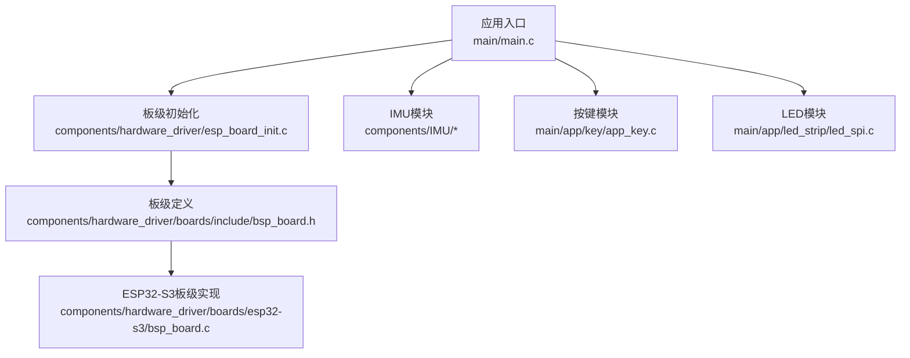
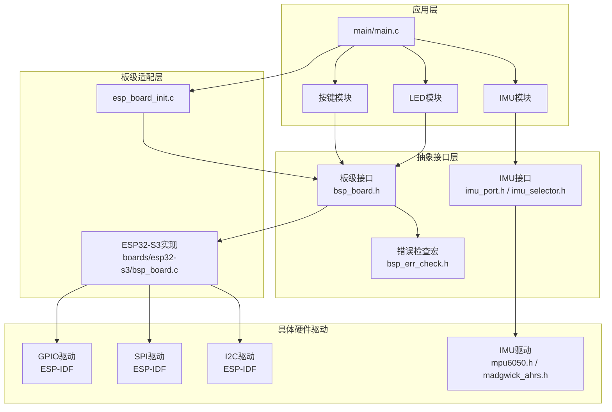
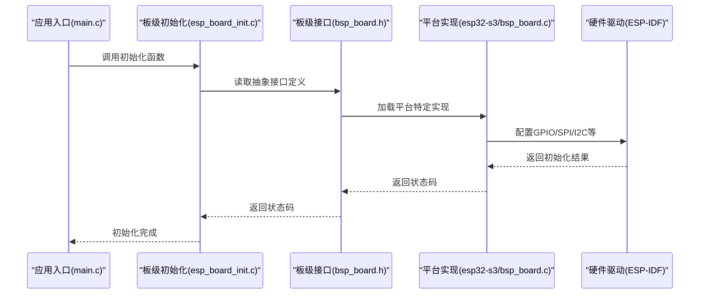
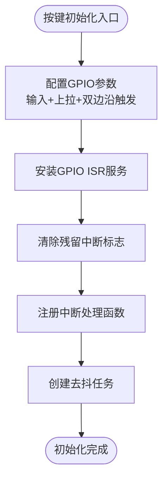
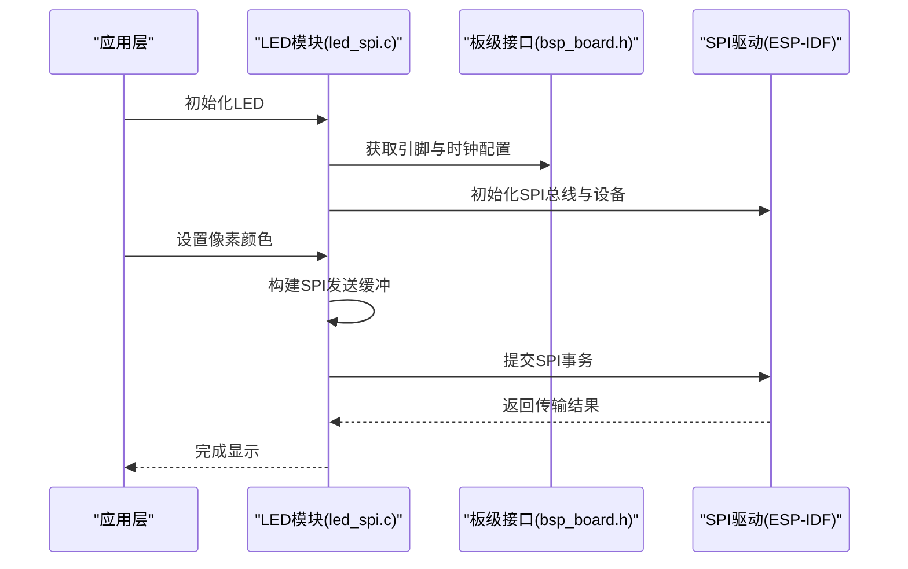
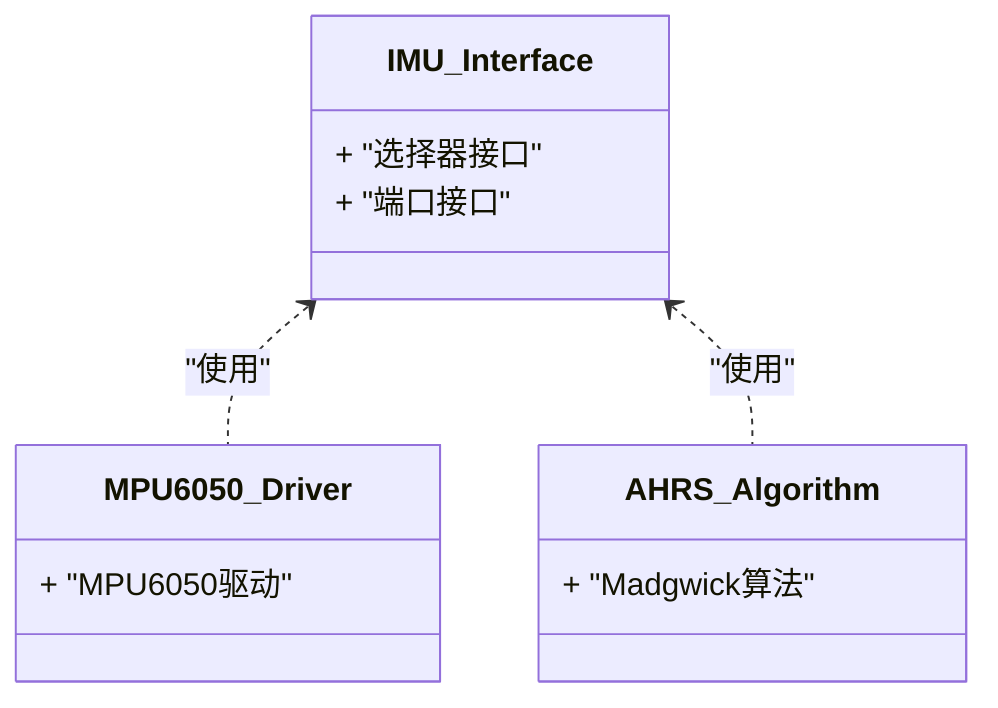
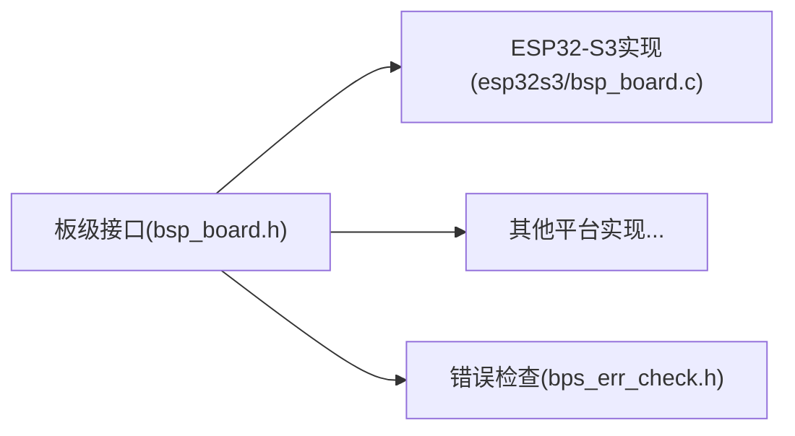
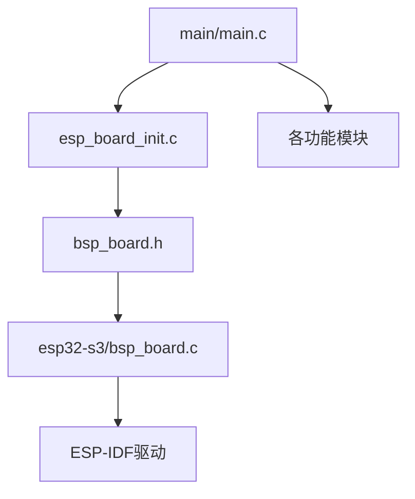

# 硬件抽象层设计

<cite>
**本文引用的文件**
- [main.c](file://main/main.c)
- [CMakeLists.txt](file://main/CMakeLists.txt)
- [esp_board_init.c](file://components/hardware_driver/esp_board_init.c)
- [bsp_board.h](file://components/hardware_driver/boards/include/bsp_board.h)
- [bsp_err_check.h](file://components/hardware_driver/boards/include/bsp_err_check.h)
- [led_spi.c](file://main/app/led_strip/led_spi.c)
- [app_key.c](file://main/app/key/app_key.c)
- [imu_port.h](file://components/IMU/core/imu_port.h)
- [imu_selector.h](file://components/IMU/imu_selector.h)
- [mpu6050.h](file://components/IMU/drivers/mpu6050/mpu6050.h)
- [madgwick_ahrs.h](file://components/IMU/core/madgwick_ahrs.h)
- [esp32s3/bsp_board.c](file://components/hardware_driver/boards/esp32-s3/bsp_board.c)
</cite>

## 目录
1. [引言](#引言)
2. [项目结构](#项目结构)
3. [核心组件](#核心组件)
4. [架构总览](#架构总览)
5. [详细组件分析](#详细组件分析)
6. [依赖关系分析](#依赖关系分析)
7. [性能考虑](#性能考虑)
8. [故障排查指南](#故障排查指南)
9. [结论](#结论)
10. [附录](#附录)

## 引言
本文件面向“硬件抽象层设计”的综合性技术文档，围绕项目中的硬件抽象与适配实践展开，重点覆盖以下方面：
- 抽象接口定义与实现策略
- 硬件适配层（以GPIO、I2C、SPI为例）的抽象与封装
- 不同ESP32系列芯片的适配方案
- 硬件初始化流程、资源管理与错误处理机制
- 新硬件平台接入方法与兼容性测试策略
- 最佳实践与常见问题解决方案

本项目在ESP-IDF框架下组织，采用组件化与模块化设计，通过统一的板级初始化入口与模块化的驱动实现，确保跨平台可移植性。

## 项目结构
项目采用“顶层应用 + 组件化子系统 + 板级适配层”的分层组织方式：
- 顶层应用：main/main.c负责系统初始化与任务编排
- 组件化子系统：如IMU、音频、LED、按键、网络等
- 板级适配层：components/hardware_driver提供统一的板级初始化与硬件资源抽象
- 平台适配：components/hardware_driver/boards/esp32-s3 等目录针对具体芯片平台进行差异化配置

**图表来源**
- [main.c:33-59](file://main/main.c#L33-L59)
- [esp_board_init.c](file://components/hardware_driver/esp_board_init.c)
- [bsp_board.h](file://components/hardware_driver/boards/include/bsp_board.h)
- [esp32s3/bsp_board.c](file://components/hardware_driver/boards/esp32-s3/bsp_board.c)

**章节来源**
- [main.c:18-49](file://main/main.c#L18-L49)
- [CMakeLists.txt:1-4](file://main/CMakeLists.txt#L1-L4)

## 核心组件
本节聚焦硬件抽象层的关键构件及其职责：
- 板级初始化与资源分配：统一初始化NVS、网络栈、事件循环与GPIO中断服务，随后进入各功能模块初始化
- 硬件抽象接口：通过头文件定义统一的接口契约，屏蔽底层差异
- 模块化驱动：按键、LED、IMU等模块通过抽象接口与板级定义解耦
- 平台适配：针对不同ESP32系列芯片提供差异化实现，确保移植性

**章节来源**
- [main.c:33-59](file://main/main.c#L33-L59)
- [esp_board_init.c](file://components/hardware_driver/esp_board_init.c)
- [bsp_board.h](file://components/hardware_driver/boards/include/bsp_board.h)

## 架构总览
硬件抽象层的整体架构由“应用层 -> 抽象接口层 -> 板级适配层 -> 具体硬件驱动”构成，如下图所示：

**图表来源**
- [main.c:33-59](file://main/main.c#L33-L59)
- [esp_board_init.c](file://components/hardware_driver/esp_board_init.c)
- [bsp_board.h](file://components/hardware_driver/boards/include/bsp_board.h)
- [bsp_err_check.h](file://components/hardware_driver/boards/include/bsp_err_check.h)
- [imu_port.h](file://components/IMU/core/imu_port.h)
- [imu_selector.h](file://components/IMU/imu_selector.h)
- [mpu6050.h](file://components/IMU/drivers/mpu6050/mpu6050.h)
- [madgwick_ahrs.h](file://components/IMU/core/madgwick_ahrs.h)
- [esp32s3/bsp_board.c](file://components/hardware_driver/boards/esp32-s3/bsp_board.c)

## 详细组件分析

### 板级初始化与抽象接口
- 统一入口：应用入口通过调用板级初始化函数完成系统基础环境准备
- 接口契约：板级接口头文件定义了平台相关的引脚、时钟、外设等常量与函数原型，模块通过这些接口访问硬件
- 错误检查：提供统一的错误检查宏，便于在适配层快速定位初始化失败点

**图表来源**
- [main.c:33-59](file://main/main.c#L33-L59)
- [esp_board_init.c](file://components/hardware_driver/esp_board_init.c)
- [bsp_board.h](file://components/hardware_driver/boards/include/bsp_board.h)
- [esp32s3/bsp_board.c](file://components/hardware_driver/boards/esp32-s3/bsp_board.c)

**章节来源**
- [main.c:33-59](file://main/main.c#L33-L59)
- [esp_board_init.c](file://components/hardware_driver/esp_board_init.c)
- [bsp_board.h](file://components/hardware_driver/boards/include/bsp_board.h)
- [bsp_err_check.h](file://components/hardware_driver/boards/include/bsp_err_check.h)

### GPIO抽象与按键模块
- 中断服务与消抖：按键模块通过GPIO配置、ISR注册与独立消抖任务实现可靠按键检测
- 抽象接口：按键模块不直接依赖具体引脚号，而是通过板级接口获取引脚定义，从而支持多平台切换
- 错误处理：对GPIO配置、ISR安装与任务创建进行错误检查与日志输出

**图表来源**
- [app_key.c:72-104](file://main/app/key/app_key.c#L72-L104)

**章节来源**
- [app_key.c:72-117](file://main/app/key/app_key.c#L72-L117)
- [bsp_board.h](file://components/hardware_driver/boards/include/bsp_board.h)

### SPI抽象与LED模块
- DMA内存与缓冲：LED模块使用DMA可用内存分配像素缓冲与SPI传输缓冲，确保高速数据搬移
- SPI事务：通过SPI设备句柄提交一次性全量传输，减少事务开销
- 错误处理：对内存分配、SPI初始化、传输返回值进行检查，并记录错误信息

**图表来源**
- [led_spi.c:36-103](file://main/app/led_strip/led_spi.c#L36-L103)
- [bsp_board.h](file://components/hardware_driver/boards/include/bsp_board.h)

**章节来源**
- [led_spi.c:36-103](file://main/app/led_strip/led_spi.c#L36-L103)
- [bsp_board.h](file://components/hardware_driver/boards/include/bsp_board.h)

### I2C抽象与IMU模块
- 接口选择：IMU模块通过选择器与端口接口抽象I2C通信细节，屏蔽不同传感器驱动差异
- 算法封装：AHRS算法与驱动分离，便于替换或扩展
- 平台适配：IMU相关头文件位于IMU组件中，配合板级接口实现跨平台集成

**图表来源**
- [imu_selector.h](file://components/IMU/imu_selector.h)
- [imu_port.h](file://components/IMU/core/imu_port.h)
- [mpu6050.h](file://components/IMU/drivers/mpu6050/mpu6050.h)
- [madgwick_ahrs.h](file://components/IMU/core/madgwick_ahrs.h)

**章节来源**
- [imu_selector.h](file://components/IMU/imu_selector.h)
- [imu_port.h](file://components/IMU/core/imu_port.h)
- [mpu6050.h](file://components/IMU/drivers/mpu6050/mpu6050.h)
- [madgwick_ahrs.h](file://components/IMU/core/madgwick_ahrs.h)

### 不同ESP32系列芯片的适配方案
- 平台隔离：通过板级接口与平台实现分离，ESP32-S3平台在boards/esp32-s3目录下提供具体实现
- 头文件组织：各芯片族在include目录下维护对应的头文件集合，确保接口一致
- 组件复用：上层模块仅依赖抽象接口，无需感知底层芯片差异

**图表来源**
- [bsp_board.h](file://components/hardware_driver/boards/include/bsp_board.h)
- [esp32s3/bsp_board.c](file://components/hardware_driver/boards/esp32-s3/bsp_board.c)
- [bsp_err_check.h](file://components/hardware_driver/boards/include/bsp_err_check.h)

**章节来源**
- [bsp_board.h](file://components/hardware_driver/boards/include/bsp_board.h)
- [esp32s3/bsp_board.c](file://components/hardware_driver/boards/esp32-s3/bsp_board.c)
- [bsp_err_check.h](file://components/hardware_driver/boards/include/bsp_err_check.h)

## 依赖关系分析
- 应用层依赖板级初始化与模块接口，模块间通过抽象接口耦合，降低耦合度
- 板级适配层依赖ESP-IDF驱动，向上提供统一接口
- 硬件初始化顺序：NVS → 网络栈 → 事件循环 → GPIO ISR → 各模块初始化

**图表来源**
- [main.c:33-59](file://main/main.c#L33-L59)
- [esp_board_init.c](file://components/hardware_driver/esp_board_init.c)
- [bsp_board.h](file://components/hardware_driver/boards/include/bsp_board.h)
- [esp32s3/bsp_board.c](file://components/hardware_driver/boards/esp32-s3/bsp_board.c)

**章节来源**
- [main.c:33-59](file://main/main.c#L33-L59)
- [CMakeLists.txt:1-4](file://main/CMakeLists.txt#L1-L4)

## 性能考虑
- DMA内存使用：LED模块使用DMA可用内存分配，减少CPU拷贝与中断延迟
- 半双工SPI：LED模块采用半双工模式，结合一次性全量传输，降低事务开销
- 任务优先级与ISR：按键模块采用高优先级消抖任务与ISR，提升响应实时性
- 资源统计：启动后打印内部与PSRAM剩余内存，辅助评估资源占用

**章节来源**
- [led_spi.c:36-103](file://main/app/led_strip/led_spi.c#L36-L103)
- [app_key.c:72-117](file://main/app/key/app_key.c#L72-L117)
- [main.c:53-59](file://main/main.c#L53-L59)

## 故障排查指南
- 初始化失败：检查板级初始化返回值与错误日志；确认NVS、网络栈、事件循环是否成功初始化
- GPIO异常：核对GPIO配置参数、上拉电阻设置与ISR安装状态；清理残留中断标志后再启用
- SPI传输错误：检查缓冲区分配、DMA内存有效性与SPI事务长度；查看返回错误码
- 内存不足：关注DMA内存与PSRAM使用情况，必要时优化缓冲大小或数据路径

**章节来源**
- [esp_board_init.c](file://components/hardware_driver/esp_board_init.c)
- [app_key.c:72-117](file://main/app/key/app_key.c#L72-L117)
- [led_spi.c:36-103](file://main/app/led_strip/led_spi.c#L36-L103)
- [main.c:33-59](file://main/main.c#L33-L59)

## 结论
本硬件抽象层通过“抽象接口 + 板级适配 + 模块化驱动”的设计，实现了对GPIO、SPI、I2C等硬件接口的统一抽象与跨平台移植。借助清晰的初始化流程、资源管理与错误处理机制，项目能够在不同ESP32系列芯片上稳定运行，并为新硬件平台接入提供了明确的扩展路径与测试策略。

## 附录
- 新硬件平台接入步骤建议
  - 在boards目录新增平台实现目录，提供平台特定的引脚、时钟与外设配置
  - 在include目录补充平台相关头文件，确保与抽象接口一致
  - 在esp_board_init.c中增加平台识别与初始化分支
  - 编写最小化示例验证GPIO、SPI、I2C基本功能
- 兼容性测试策略
  - 功能回归：覆盖按键、LED、IMU等关键模块
  - 性能回归：测量内存占用、中断延迟与帧率稳定性
  - 平台对比：在目标平台与参考平台对比行为一致性