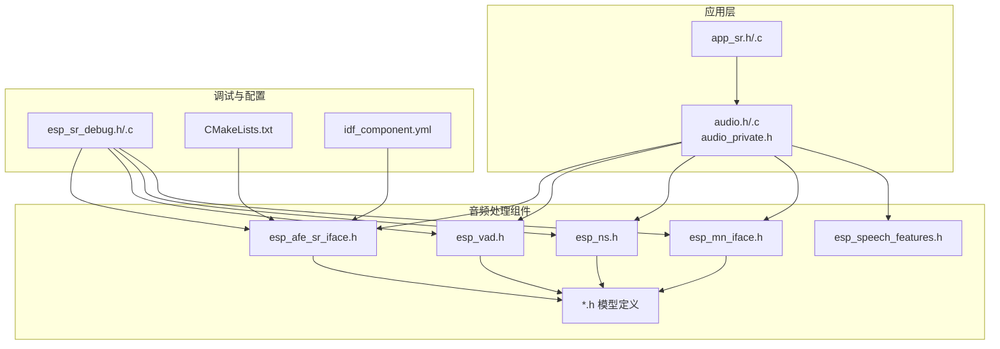
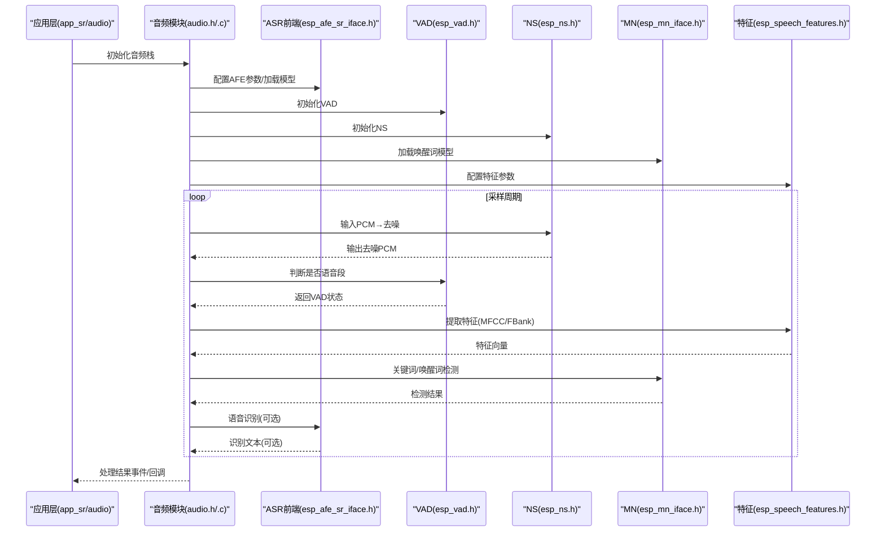
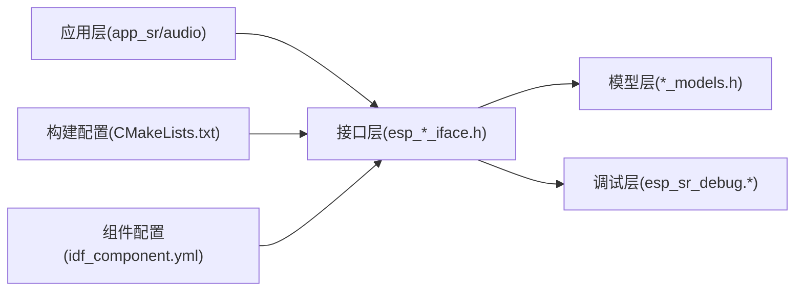

# 组件接口规范

<cite>
**本文引用的文件**   
- [esp_afe_sr_iface.h](file://components/esp-sr/include/esp32/esp_afe_sr_iface.h)
- [esp_vad.h](file://components/esp-sr/include/esp32/esp_vad.h)
- [esp_ns.h](file://components/esp-sr/include/esp32/esp_ns.h)
- [esp_mn_iface.h](file://components/esp-sr/include/esp32/esp_mn_iface.h)
- [esp_speech_features.h](file://components/esp-sr/include/esp32/esp_speech_features.h)
- [esp_afe_sr_models.h](file://components/esp-sr/include/esp32/esp_afe_sr_models.h)
- [esp_vadn_models.h](file://components/esp-sr/include/esp32/esp_vadn_models.h)
- [esp_nsn_models.h](file://components/esp-sr/include/esp32/esp_nsn_models.h)
- [esp_mn_models.h](file://components/esp-sr/include/esp32/esp_mn_models.h)
- [app_sr.h](file://main/app/audio/app_sr.h)
- [audio.h](file://main/app/audio/audio.h)
- [audio_private.h](file://main/app/audio/audio_private.h)
- [esp_sr_debug.h](file://components/esp-sr/src/include/esp_sr_debug.h)
- [esp_sr_debug.c](file://components/esp-sr/src/esp_sr_debug.c)
- [idf_component.yml](file://components/esp-sr/idf_component.yml)
- [CMakeLists.txt](file://components/esp-sr/CMakeLists.txt)
</cite>

## 目录
1. [引言](#引言)
2. [项目结构](#项目结构)
3. [核心组件](#核心组件)
4. [架构总览](#架构总览)
5. [详细组件分析](#详细组件分析)
6. [依赖关系分析](#依赖关系分析)
7. [性能考虑](#性能考虑)
8. [故障排查指南](#故障排查指南)
9. [结论](#结论)
10. [附录](#附录)

## 引言
本文件面向组件接口规范，聚焦于音频处理子系统（语音识别、噪声抑制、VAD、唤醒词检测、声学前端等）的接口设计与使用方法。文档从接口契约、数据结构、消息协议、版本管理与演进策略、实现指南、测试与集成验证等方面进行系统化阐述，并通过图示与路径引用帮助读者快速定位到真实代码位置。

## 项目结构
音频处理相关代码主要位于 components/esp-sr 目录，包含头文件接口、模型定义、源码与构建配置；应用侧在 main/app/audio 下调用这些接口完成端到端音频处理链路。

图表来源
- [app_sr.h:1-200](file://main/app/audio/app_sr.h#L1-L200)
- [audio.h:1-200](file://main/app/audio/audio.h#L1-L200)
- [esp_afe_sr_iface.h:1-200](file://components/esp-sr/include/esp32/esp_afe_sr_iface.h#L1-L200)
- [esp_vad.h:1-200](file://components/esp-sr/include/esp32/esp_vad.h#L1-L200)
- [esp_ns.h:1-200](file://components/esp-sr/include/esp32/esp_ns.h#L1-L200)
- [esp_mn_iface.h:1-200](file://components/esp-sr/include/esp32/esp_mn_iface.h#L1-L200)
- [esp_speech_features.h:1-200](file://components/esp-sr/include/esp32/esp_speech_features.h#L1-L200)
- [esp_sr_debug.h:1-200](file://components/esp-sr/src/include/esp_sr_debug.h#L1-L200)
- [CMakeLists.txt:1-200](file://components/esp-sr/CMakeLists.txt#L1-L200)
- [idf_component.yml:1-200](file://components/esp-sr/idf_component.yml#L1-L200)

章节来源
- [app_sr.h:1-200](file://main/app/audio/app_sr.h#L1-L200)
- [audio.h:1-200](file://main/app/audio/audio.h#L1-L200)
- [audio_private.h:1-200](file://main/app/audio/audio_private.h#L1-L200)
- [esp_afe_sr_iface.h:1-200](file://components/esp-sr/include/esp32/esp_afe_sr_iface.h#L1-L200)
- [esp_vad.h:1-200](file://components/esp-sr/include/esp32/esp_vad.h#L1-L200)
- [esp_ns.h:1-200](file://components/esp-sr/include/esp32/esp_ns.h#L1-L200)
- [esp_mn_iface.h:1-200](file://components/esp-sr/include/esp32/esp_mn_iface.h#L1-L200)
- [esp_speech_features.h:1-200](file://components/esp-sr/include/esp32/esp_speech_features.h#L1-L200)
- [esp_sr_debug.h:1-200](file://components/esp-sr/src/include/esp_sr_debug.h#L1-L200)
- [CMakeLists.txt:1-200](file://components/esp-sr/CMakeLists.txt#L1-L200)
- [idf_component.yml:1-200](file://components/esp-sr/idf_component.yml#L1-L200)

## 核心组件
- 语音识别（ASR）前端接口：提供声学前端参数配置、特征提取、模型推理接口与回调机制。
- 噪声抑制（NS/NSN）接口：提供实时噪声抑制算法的初始化、处理与模型加载。
- 语音活动检测（VAD/VADN）接口：提供静音/语音段检测能力，支持多模型。
- 唤醒词检测（MN）接口：提供关键词/唤醒词检测的模型与接口。
- 语音特征接口：提供 MFCC/FBank 等特征计算接口与配置。
- 调试与日志：统一的调试开关与错误上报接口。

章节来源
- [esp_afe_sr_iface.h:1-200](file://components/esp-sr/include/esp32/esp_afe_sr_iface.h#L1-L200)
- [esp_vad.h:1-200](file://components/esp-sr/include/esp32/esp_vad.h#L1-L200)
- [esp_ns.h:1-200](file://components/esp-sr/include/esp32/esp_ns.h#L1-L200)
- [esp_mn_iface.h:1-200](file://components/esp-sr/include/esp32/esp_mn_iface.h#L1-L200)
- [esp_speech_features.h:1-200](file://components/esp-sr/include/esp32/esp_speech_features.h#L1-L200)
- [esp_sr_debug.h:1-200](file://components/esp-sr/src/include/esp_sr_debug.h#L1-L200)

## 架构总览
下图展示了应用层如何通过统一的音频模块调用各子组件接口，形成“采集→预处理→特征→模型推理→后处理”的完整链路。

图表来源
- [audio.h:1-200](file://main/app/audio/audio.h#L1-L200)
- [app_sr.h:1-200](file://main/app/audio/app_sr.h#L1-L200)
- [esp_afe_sr_iface.h:1-200](file://components/esp-sr/include/esp32/esp_afe_sr_iface.h#L1-L200)
- [esp_vad.h:1-200](file://components/esp-sr/include/esp32/esp_vad.h#L1-L200)
- [esp_ns.h:1-200](file://components/esp-sr/include/esp32/esp_ns.h#L1-L200)
- [esp_mn_iface.h:1-200](file://components/esp-sr/include/esp32/esp_mn_iface.h#L1-L200)
- [esp_speech_features.h:1-200](file://components/esp-sr/include/esp32/esp_speech_features.h#L1-L200)

## 详细组件分析

### 语音识别前端接口（esp_afe_sr_iface.h）
- 接口职责
  - 声学前端配置与生命周期管理
  - 特征抽取与模型推理桥接
  - 回调通知与错误码
- 关键点
  - 参数校验与边界检查
  - 模型加载与内存对齐要求
  - 流式处理与缓冲区管理
  - 并发安全与线程模型
- 使用建议
  - 在初始化阶段完成模型加载与参数固化
  - 使用统一的回调机制处理异步事件
  - 对输入数据进行格式与采样率校验

章节来源
- [esp_afe_sr_iface.h:1-200](file://components/esp-sr/include/esp32/esp_afe_sr_iface.h#L1-L200)

### 语音活动检测接口（esp_vad.h）
- 接口职责
  - 实时判断当前帧是否包含语音
  - 支持多种VAD模型与阈值配置
- 关键点
  - 输入帧长度与采样率匹配
  - 模型阈值与灵敏度调节
  - 与ASR前端的协同（如仅在VAD激活时进行识别）

章节来源
- [esp_vad.h:1-200](file://components/esp-sr/include/esp32/esp_vad.h#L1-L200)

### 噪声抑制接口（esp_ns.h）
- 接口职责
  - 实时去噪，降低背景噪声对后续模块的影响
- 关键点
  - 去噪强度与语音保真度平衡
  - 与采样率/位深一致的数据格式

章节来源
- [esp_ns.h:1-200](file://components/esp-sr/include/esp32/esp_ns.h#L1-L200)

### 唤醒词检测接口（esp_mn_iface.h）
- 接口职责
  - 关键词/唤醒词触发检测
  - 多模型选择与阈值配置
- 关键点
  - 触发阈值与误唤醒控制
  - 与VAD联动以减少无效计算

章节来源
- [esp_mn_iface.h:1-200](file://components/esp-sr/include/esp32/esp_mn_iface.h#L1-L200)

### 语音特征接口（esp_speech_features.h）
- 接口职责
  - 计算MFCC/FBank等特征
  - 与ASR前端的特征对接
- 关键点
  - 特征维度与模型期望一致
  - 窗口与重叠策略

章节来源
- [esp_speech_features.h:1-200](file://components/esp-sr/include/esp32/esp_speech_features.h#L1-L200)

### 应用层集成（audio.h / app_sr.h）
- 接口职责
  - 将上述模块整合为统一的音频处理管道
  - 提供事件回调与状态机驱动
- 关键点
  - 生命周期管理：初始化/启动/停止/销毁
  - 错误传播与恢复策略
  - 与上层业务的解耦（事件/回调）

章节来源
- [audio.h:1-200](file://main/app/audio/audio.h#L1-L200)
- [audio_private.h:1-200](file://main/app/audio/audio_private.h#L1-L200)
- [app_sr.h:1-200](file://main/app/audio/app_sr.h#L1-L200)

### 模型与配置接口（*.h 模型定义）
- 接口职责
  - 定义模型路径、版本、参数表
  - 与构建系统配合完成模型打包与部署
- 关键点
  - 模型版本与运行时库的兼容性
  - 模型文件的完整性校验

章节来源
- [esp_afe_sr_models.h:1-200](file://components/esp-sr/include/esp32/esp_afe_sr_models.h#L1-L200)
- [esp_vadn_models.h:1-200](file://components/esp-sr/include/esp32/esp_vadn_models.h#L1-L200)
- [esp_nsn_models.h:1-200](file://components/esp-sr/include/esp32/esp_nsn_models.h#L1-L200)
- [esp_mn_models.h:1-200](file://components/esp-sr/include/esp32/esp_mn_models.h#L1-L200)

### 调试与日志（esp_sr_debug.h / esp_sr_debug.c）
- 接口职责
  - 统一的调试开关与日志输出
  - 运行时统计与错误上报
- 关键点
  - 日志级别与性能开销平衡
  - 调试信息的可追溯性

章节来源
- [esp_sr_debug.h:1-200](file://components/esp-sr/src/include/esp_sr_debug.h#L1-L200)
- [esp_sr_debug.c:1-200](file://components/esp-sr/src/esp_sr_debug.c#L1-L200)

## 依赖关系分析
- 组件内聚与耦合
  - 各子模块通过统一的音频模块进行编排，降低应用层耦合
  - 模块间通过明确的回调与事件进行交互
- 外部依赖
  - 构建系统与组件注册：CMakeLists.txt 与 idf_component.yml
  - 第三方库：Opus、Ogg、MP3 解码器作为音频编解码支撑
- 可能的循环依赖
  - 通过头文件前向声明与分离接口/实现避免循环包含

图表来源
- [app_sr.h:1-200](file://main/app/audio/app_sr.h#L1-L200)
- [audio.h:1-200](file://main/app/audio/audio.h#L1-L200)
- [esp_afe_sr_iface.h:1-200](file://components/esp-sr/include/esp32/esp_afe_sr_iface.h#L1-L200)
- [esp_sr_debug.h:1-200](file://components/esp-sr/src/include/esp_sr_debug.h#L1-L200)
- [CMakeLists.txt:1-200](file://components/esp-sr/CMakeLists.txt#L1-L200)
- [idf_component.yml:1-200](file://components/esp-sr/idf_component.yml#L1-L200)

章节来源
- [CMakeLists.txt:1-200](file://components/esp-sr/CMakeLists.txt#L1-L200)
- [idf_component.yml:1-200](file://components/esp-sr/idf_component.yml#L1-L200)

## 性能考虑
- 数据通路优化
  - 减少不必要的拷贝与转换，尽量在原地处理
  - 批量化与流水线化，提升吞吐
- 内存与缓存
  - 对齐与对齐分配，避免缓存未命中
  - 控制中间变量生命周期，降低峰值内存
- 线程与并发
  - 明确的生产者/消费者边界，避免锁竞争
  - 优先使用无锁队列或信号量进行同步
- 功耗与实时性
  - 根据场景动态调整采样率/帧长
  - 合理利用硬件加速（如DSP/NEON）与专用模块

## 故障排查指南
- 常见问题与定位
  - 初始化失败：检查模型路径与版本匹配、内存是否充足
  - 识别/检测异常：确认输入采样率/通道数/位深与模型期望一致
  - 性能抖动：核查缓冲区大小、中断/调度影响
- 调试手段
  - 开启调试日志，记录关键节点时间戳与状态
  - 使用最小复现集，逐步剔除模块定位问题
- 错误码与返回值
  - 统一错误码语义，确保上层可感知并恢复

章节来源
- [esp_sr_debug.h:1-200](file://components/esp-sr/src/include/esp_sr_debug.h#L1-L200)
- [esp_sr_debug.c:1-200](file://components/esp-sr/src/esp_sr_debug.c#L1-L200)

## 结论
本接口规范明确了音频处理子系统的接口契约、数据流与交互协议，提供了版本管理与演进策略的指导，并给出了实现、测试与集成验证的实践建议。遵循本文档可显著提升模块间的稳定性与可维护性。

## 附录

### 接口版本管理与演进策略
- 版本标识
  - 采用语义化版本（主.次.补丁），在接口头文件中显式声明
- 向后兼容
  - 新增接口以“扩展”为主，不破坏既有调用
  - 对废弃接口保留过渡期并提供迁移指引
- 演进流程
  - 设计评审 → 接口冻结 → 实现与测试 → 文档更新 → 发布与回溯

章节来源
- [idf_component.yml:1-200](file://components/esp-sr/idf_component.yml#L1-L200)

### 接口实现指南
- 必备步骤
  - 明确输入/输出数据类型与约束
  - 编写单元测试覆盖正常/异常路径
  - 提供最小可用示例（参考组件内的 samples 或测试用例）
- 最佳实践
  - 参数校验前置，尽早失败
  - 使用RAII风格的资源管理（初始化/释放成对出现）
  - 保持线程安全与可重入性

章节来源
- [esp_afe_sr_iface.h:1-200](file://components/esp-sr/include/esp32/esp_afe_sr_iface.h#L1-L200)
- [esp_vad.h:1-200](file://components/esp-sr/include/esp32/esp_vad.h#L1-L200)
- [esp_ns.h:1-200](file://components/esp-sr/include/esp32/esp_ns.h#L1-L200)
- [esp_mn_iface.h:1-200](file://components/esp-sr/include/esp32/esp_mn_iface.h#L1-L200)
- [esp_speech_features.h:1-200](file://components/esp-sr/include/esp32/esp_speech_features.h#L1-L200)

### 测试方法与集成验证
- 单元测试
  - 针对每个接口编写独立测试用例，覆盖边界条件
- 集成测试
  - 按顺序串联各模块，验证端到端功能
- 性能测试
  - 在目标硬件上测量延迟、吞吐与功耗
- 回归测试
  - 建立自动化流水线，确保每次变更不影响已有功能

章节来源
- [audio.h:1-200](file://main/app/audio/audio.h#L1-L200)
- [app_sr.h:1-200](file://main/app/audio/app_sr.h#L1-L200)