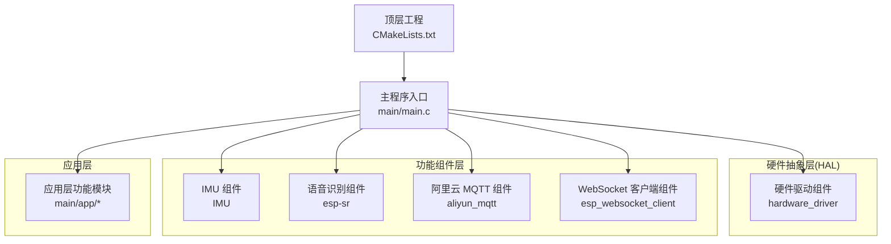
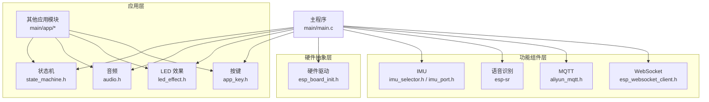
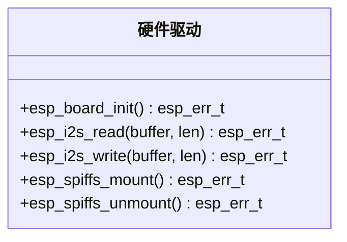
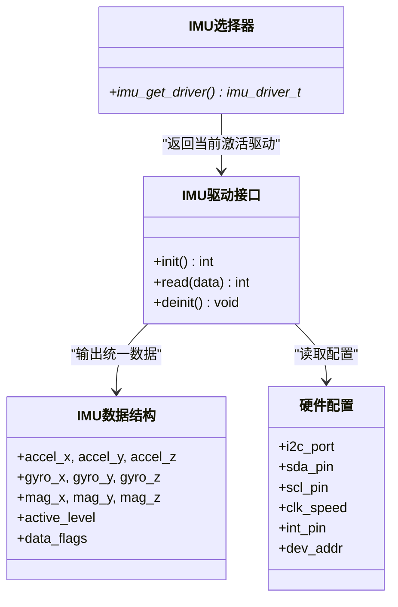
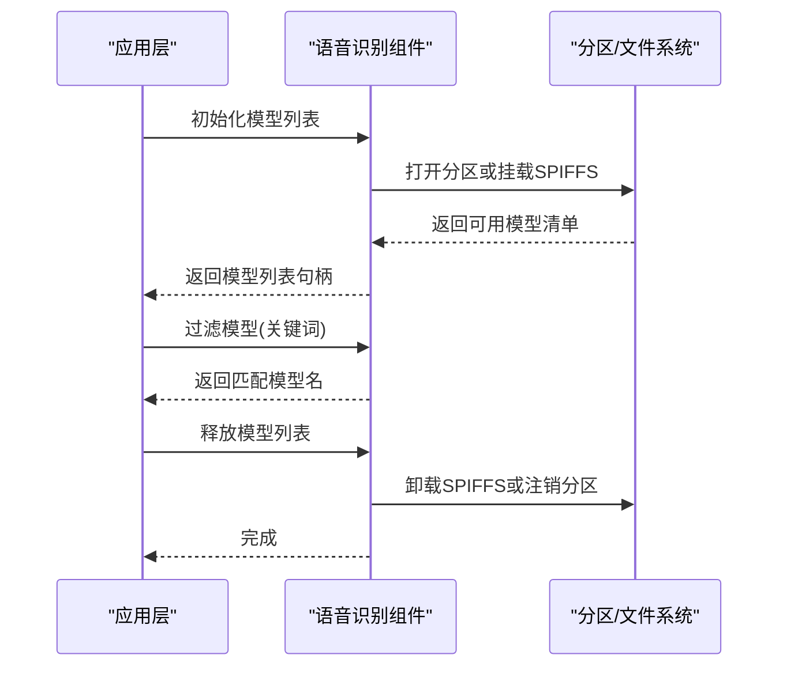
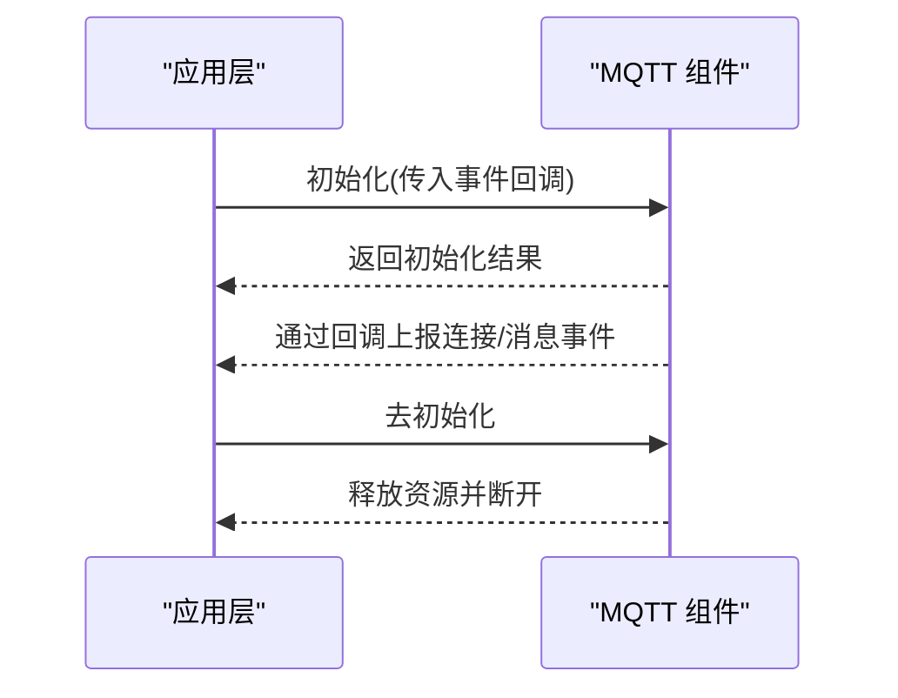
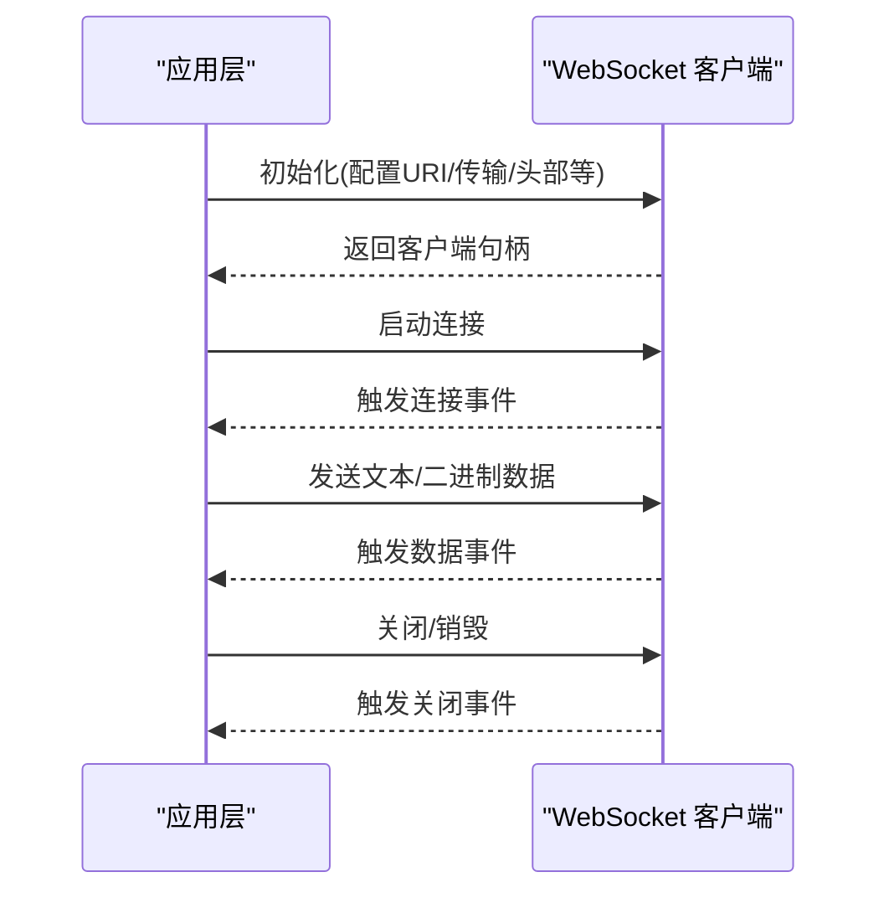
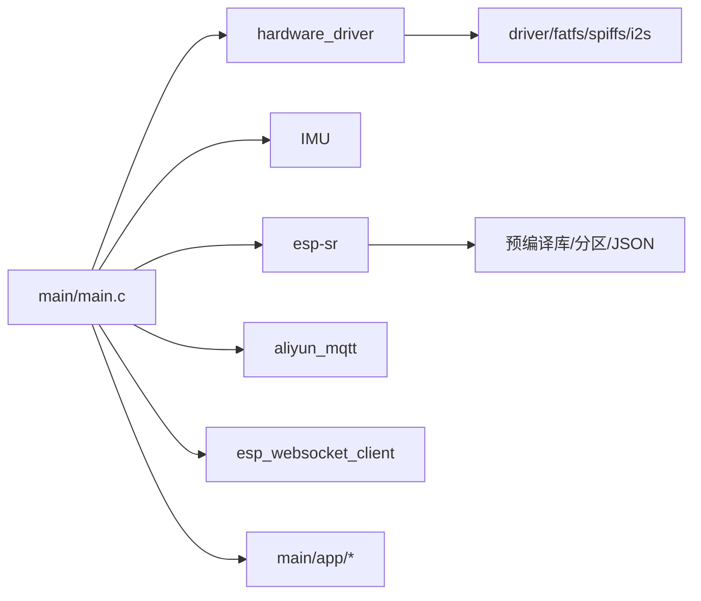

# 组件架构设计

<cite>
**本文档引用的文件**
- [CMakeLists.txt](file://CMakeLists.txt)
- [main.c](file://main/main.c)
- [CMakeLists.txt](file://components/IMU/CMakeLists.txt)
- [imu_selector.h](file://components/IMU/imu_selector.h)
- [imu_port.h](file://components/IMU/core/imu_port.h)
- [CMakeLists.txt](file://components/esp-sr/CMakeLists.txt)
- [model_path.h](file://components/esp-sr/src/include/model_path.h)
- [CMakeLists.txt](file://components/hardware_driver/CMakeLists.txt)
- [esp_board_init.h](file://components/hardware_driver/include/esp_board_init.h)
- [state_machine.h](file://main/app/state_machine/state_machine.h)
- [audio.h](file://main/app/audio/audio.h)
- [app_key.h](file://main/app/key/app_key.h)
- [led_effect.h](file://main/app/led_strip/led_effect.h)
- [aliyun_mqtt.h](file://components/aliyun_mqtt/include/aliyun_mqtt.h)
- [esp_websocket_client.h](file://components/esp_websocket_client/esp_websocket_client.h)
</cite>

## 目录
1. [简介](#简介)
2. [项目结构](#项目结构)
3. [核心组件](#核心组件)
4. [架构总览](#架构总览)
5. [详细组件分析](#详细组件分析)
6. [依赖分析](#依赖分析)
7. [性能考虑](#性能考虑)
8. [故障排查指南](#故障排查指南)
9. [结论](#结论)
10. [附录](#附录)

## 简介
本项目采用模块化组件架构，围绕硬件抽象层(HAL)、功能组件层与应用层进行分层设计。通过清晰的接口规范与可配置的构建系统，实现对不同硬件平台与第三方库的可移植适配。本文档从架构视角梳理各组件职责、依赖关系、数据流与生命周期，并提供新组件开发指南与集成最佳实践。

## 项目结构
项目采用 ESP-IDF 工程组织方式，顶层通过 EXTRA_COMPONENT_DIRS 将 components 目录纳入组件搜索路径；主程序入口位于 main/main.c，负责系统初始化与组件启动序列。核心组件分布在 components 与 main/app 两个层面，分别承担硬件抽象、功能服务与业务逻辑。

图表来源
- [CMakeLists.txt:5-5](file://CMakeLists.txt#L5-L5)
- [main.c:18-29](file://main/main.c#L18-L29)

章节来源
- [CMakeLists.txt:1-10](file://CMakeLists.txt#L1-L10)
- [main.c:33-60](file://main/main.c#L33-L60)

## 核心组件
本节聚焦于关键组件及其职责边界、接口契约与运行时行为。

- 硬件抽象层
  - 硬件驱动组件：提供统一的板级初始化、I2S 读写、SPIFFS 挂载等能力，屏蔽具体芯片差异。
  - 接口参考：[esp_board_init.h:7-14](file://components/hardware_driver/include/esp_board_init.h#L7-L14)

- 功能组件层
  - IMU 组件：提供 IMU 驱动选择器与统一数据接口，支持多传感器驱动按 Kconfig 编译切换。
  - 语音识别组件：封装模型加载、分区映射、预置库链接与目标平台适配。
  - 阿里云 MQTT 组件：提供客户端初始化与去初始化接口，事件回调机制。
  - WebSocket 客户端组件：提供完整的连接、发送、接收、关闭与事件注册接口。

- 应用层
  - 状态机：按键事件驱动的状态机，控制录音流程。
  - 音频：音量设置、播放、解码器/编码器注册、事件通知。
  - LED：LED 初始化、暂停控制、配置更新。
  - 键盘：按键初始化。
  - 主程序：按序完成 NVS、网络、事件循环、板级初始化与各子系统启动。

章节来源
- [esp_board_init.h:7-14](file://components/hardware_driver/include/esp_board_init.h#L7-L14)
- [imu_selector.h:12-12](file://components/IMU/imu_selector.h#L12-L12)
- [imu_port.h:23-27](file://components/IMU/core/imu_port.h#L23-L27)
- [CMakeLists.txt:19-26](file://components/IMU/CMakeLists.txt#L19-L26)
- [CMakeLists.txt:1-102](file://components/esp-sr/CMakeLists.txt#L1-L102)
- [model_path.h:41-50](file://components/esp-sr/src/include/model_path.h#L41-L50)
- [aliyun_mqtt.h:16-23](file://components/aliyun_mqtt/include/aliyun_mqtt.h#L16-L23)
- [esp_websocket_client.h:153-233](file://components/esp_websocket_client/esp_websocket_client.h#L153-L233)
- [state_machine.h:22-32](file://main/app/state_machine/state_machine.h#L22-L32)
- [audio.h:9-21](file://main/app/audio/audio.h#L9-L21)
- [led_effect.h:6-9](file://main/app/led_strip/led_effect.h#L6-L9)
- [app_key.h:1-1](file://main/app/key/app_key.h#L1-L1)
- [main.c:33-60](file://main/main.c#L33-L60)

## 架构总览
系统采用“硬件抽象层-功能组件层-应用层”的三层架构，通过统一接口与事件机制实现松耦合协作。主程序负责初始化顺序与资源协调，各功能组件通过明确的接口暴露能力，支持按需启用与跨平台移植。

图表来源
- [main.c:33-60](file://main/main.c#L33-L60)
- [esp_board_init.h:7-14](file://components/hardware_driver/include/esp_board_init.h#L7-L14)
- [imu_selector.h:12-12](file://components/IMU/imu_selector.h#L12-L12)
- [imu_port.h:23-27](file://components/IMU/core/imu_port.h#L23-L27)
- [CMakeLists.txt:1-102](file://components/esp-sr/CMakeLists.txt#L1-L102)
- [aliyun_mqtt.h:16-23](file://components/aliyun_mqtt/include/aliyun_mqtt.h#L16-L23)
- [esp_websocket_client.h:153-233](file://components/esp_websocket_client/esp_websocket_client.h#L153-L233)
- [state_machine.h:22-32](file://main/app/state_machine/state_machine.h#L22-L32)
- [audio.h:9-21](file://main/app/audio/audio.h#L9-L21)
- [led_effect.h:6-9](file://main/app/led_strip/led_effect.h#L6-L9)
- [app_key.h:1-1](file://main/app/key/app_key.h#L1-L1)

## 详细组件分析

### 硬件抽象层（硬件驱动组件）
- 职责
  - 提供板级初始化、I2S 读写、SPIFFS 挂载/卸载等通用接口，屏蔽底层硬件差异。
- 关键接口
  - 板级初始化：[esp_board_init.h:7-7](file://components/hardware_driver/include/esp_board_init.h#L7-L7)
  - I2S 读写：[esp_board_init.h:9-10](file://components/hardware_driver/include/esp_board_init.h#L9-L10)
  - SPIFFS 挂载/卸载：[esp_board_init.h:12-14](file://components/hardware_driver/include/esp_board_init.h#L12-L14)
- 构建与依赖
  - 组件注册包含驱动、fatfs、spiffs、i2s 等依赖：[CMakeLists.txt:3-15](file://components/hardware_driver/CMakeLists.txt#L3-L15)

图表来源
- [esp_board_init.h:7-14](file://components/hardware_driver/include/esp_board_init.h#L7-L14)
- [CMakeLists.txt:3-15](file://components/hardware_driver/CMakeLists.txt#L3-L15)

章节来源
- [esp_board_init.h:7-14](file://components/hardware_driver/include/esp_board_init.h#L7-L14)
- [CMakeLists.txt:1-18](file://components/hardware_driver/CMakeLists.txt#L1-L18)

### IMU 组件（硬件抽象与算法融合）
- 设计要点
  - 通过 Kconfig 在编译期选择具体驱动（如 MPU6050 或 ICM20948），并在 CMake 中动态加入对应源文件。
  - 提供统一的数据结构与驱动接口，屏蔽底层差异。
- 关键接口与数据结构
  - 驱动接口定义：[imu_port.h:23-27](file://components/IMU/core/imu_port.h#L23-L27)
  - 传感器数据结构：[imu_port.h:14-20](file://components/IMU/core/imu_port.h#L14-L20)
  - 硬件配置结构：[imu_port.h:30-37](file://components/IMU/core/imu_port.h#L30-L37)
  - 驱动选择器：[imu_selector.h:12-12](file://components/IMU/imu_selector.h#L12-L12)
- 构建与依赖
  - 按 Kconfig 选择驱动源码并注册依赖 driver：[CMakeLists.txt:6-17](file://components/IMU/CMakeLists.txt#L6-L17)

图表来源
- [imu_port.h:14-48](file://components/IMU/core/imu_port.h#L14-L48)
- [imu_selector.h:12-12](file://components/IMU/imu_selector.h#L12-L12)
- [CMakeLists.txt:6-17](file://components/IMU/CMakeLists.txt#L6-L17)

章节来源
- [imu_port.h:1-53](file://components/IMU/core/imu_port.h#L1-L53)
- [imu_selector.h:1-14](file://components/IMU/imu_selector.h#L1-L14)
- [CMakeLists.txt:1-28](file://components/IMU/CMakeLists.txt#L1-L28)

### 语音识别组件（esp-sr）
- 设计要点
  - 支持多目标平台，按 IDf 目标链接对应预编译库。
  - 提供模型列表初始化、过滤、查找与释放接口，兼容 SPIFFS 与分区映射两种存储方式。
- 关键接口
  - 模型列表初始化/销毁：[model_path.h:41-50](file://components/esp-sr/src/include/model_path.h#L41-L50)
  - 模型过滤/存在性检查/唤醒词解析：[model_path.h:65-85](file://components/esp-sr/src/include/model_path.h#L65-L85)
  - SPIFFS 初始化/销毁与路径查询：[model_path.h:94-113](file://components/esp-sr/src/include/model_path.h#L94-L113)
  - 静态模型指针与二进制加载：[model_path.h:121-130](file://components/esp-sr/src/include/model_path.h#L121-L130)
- 构建与依赖
  - 平台条件判断、头文件目录与预编译库链接：[CMakeLists.txt:1-75](file://components/esp-sr/CMakeLists.txt#L1-L75)

图表来源
- [model_path.h:41-113](file://components/esp-sr/src/include/model_path.h#L41-L113)
- [CMakeLists.txt:1-102](file://components/esp-sr/CMakeLists.txt#L1-L102)

章节来源
- [model_path.h:1-151](file://components/esp-sr/src/include/model_path.h#L1-L151)
- [CMakeLists.txt:1-102](file://components/esp-sr/CMakeLists.txt#L1-L102)

### 阿里云 MQTT 组件
- 设计要点
  - 提供初始化与去初始化接口，配合事件回调处理连接与消息事件。
- 关键接口
  - 初始化/去初始化：[aliyun_mqtt.h:16-23](file://components/aliyun_mqtt/include/aliyun_mqtt.h#L16-L23)

图表来源
- [aliyun_mqtt.h:16-23](file://components/aliyun_mqtt/include/aliyun_mqtt.h#L16-L23)

章节来源
- [aliyun_mqtt.h:1-28](file://components/aliyun_mqtt/include/aliyun_mqtt.h#L1-L28)

### WebSocket 客户端组件
- 设计要点
  - 提供完整的客户端生命周期管理：初始化、配置、启动、发送、接收、关闭与销毁。
  - 事件机制覆盖错误、连接、断开、数据、关闭等场景。
- 关键接口
  - 客户端生命周期：[esp_websocket_client.h:153-233](file://components/esp_websocket_client/esp_websocket_client.h#L153-L233)
  - 事件枚举与错误码：[esp_websocket_client.h:31-68](file://components/esp_websocket_client/esp_websocket_client.h#L31-L68)
  - 发送与接收：[esp_websocket_client.h:259-340](file://components/esp_websocket_client/esp_websocket_client.h#L259-L340)

图表来源
- [esp_websocket_client.h:153-233](file://components/esp_websocket_client/esp_websocket_client.h#L153-L233)
- [esp_websocket_client.h:259-340](file://components/esp_websocket_client/esp_websocket_client.h#L259-L340)
- [esp_websocket_client.h:31-68](file://components/esp_websocket_client/esp_websocket_client.h#L31-L68)

章节来源
- [esp_websocket_client.h:1-482](file://components/esp_websocket_client/esp_websocket_client.h#L1-L482)

### 应用层组件
- 状态机
  - 事件类型：按键按下/松开；状态：空闲/录音中；接口：初始化、发送事件、查询状态。
  - 参考：[state_machine.h:6-32](file://main/app/state_machine/state_machine.h#L6-L32)
- 音频
  - 音量设置、播放、文件播放、解码器/编码器注册、事件通知等。
  - 参考：[audio.h:9-21](file://main/app/audio/audio.h#L9-L21)
- LED
  - 初始化、暂停控制、配置更新。
  - 参考：[led_effect.h:6-9](file://main/app/led_strip/led_effect.h#L6-L9)
- 按键
  - 初始化。
  - 参考：[app_key.h:1-1](file://main/app/key/app_key.h#L1-L1)

章节来源
- [state_machine.h:1-34](file://main/app/state_machine/state_machine.h#L1-L34)
- [audio.h:1-22](file://main/app/audio/audio.h#L1-L22)
- [led_effect.h:1-10](file://main/app/led_strip/led_effect.h#L1-L10)
- [app_key.h:1-1](file://main/app/key/app_key.h#L1-L1)

## 依赖分析
- 组件内聚与耦合
  - 硬件驱动组件对底层外设提供统一抽象，降低上层对具体芯片的耦合。
  - IMU 组件通过 Kconfig 与 CMake 的组合，在编译期决定驱动实现，保持运行时接口一致。
  - 语音识别组件通过预编译库与平台条件编译实现跨平台能力。
- 外部依赖
  - 硬件驱动组件依赖 driver、fatfs、spiffs、esp_driver_i2s。
  - 语音识别组件依赖 json、spiffs、spi_flash、esp_partition（根据版本）、以及多套预编译库。
- 潜在环依赖
  - 未见直接环依赖迹象；主程序对各组件为单向依赖。

图表来源
- [CMakeLists.txt:10-15](file://components/hardware_driver/CMakeLists.txt#L10-L15)
- [CMakeLists.txt:15-27](file://components/esp-sr/CMakeLists.txt#L15-L27)
- [main.c:18-29](file://main/main.c#L18-L29)

章节来源
- [CMakeLists.txt:1-18](file://components/hardware_driver/CMakeLists.txt#L1-L18)
- [CMakeLists.txt:1-102](file://components/esp-sr/CMakeLists.txt#L1-L102)
- [main.c:18-29](file://main/main.c#L18-L29)

## 性能考虑
- 初始化顺序
  - 优先完成 NVS、网络与事件循环初始化，再进行板级与功能组件初始化，有助于减少阻塞与资源竞争。
- 任务与内存
  - 通过 FreeRTOS 任务与信号量（如 IMU 数据就绪信号量）实现异步数据采集与处理。
- 资源占用
  - 语音识别组件链接大量预编译库，需关注 Flash 与 RAM 使用；建议按需启用模型与平台。
- I/O 优化
  - I2S 读写与 SPIFFS 操作建议结合 DMA 与缓存策略，避免频繁阻塞。

## 故障排查指南
- 硬件驱动
  - 若 I2S 读写失败，检查板级初始化是否成功与引脚配置是否正确。
- IMU
  - 若数据无效标志缺失，确认驱动初始化与 I2C 地址配置；必要时调整采样率与中断配置。
- 语音识别
  - 若模型加载失败，检查分区表中模型分区是否存在、大小与偏移是否正确；确认 SPIFFS 是否挂载成功。
- MQTT/WebSocket
  - 若连接异常，检查事件回调日志与错误码；验证证书、域名与网络连通性。

章节来源
- [esp_board_init.h:7-14](file://components/hardware_driver/include/esp_board_init.h#L7-L14)
- [imu_port.h:8-20](file://components/IMU/core/imu_port.h#L8-L20)
- [CMakeLists.txt:77-101](file://components/esp-sr/CMakeLists.txt#L77-L101)
- [aliyun_mqtt.h:16-23](file://components/aliyun_mqtt/include/aliyun_mqtt.h#L16-L23)
- [esp_websocket_client.h:48-68](file://components/esp_websocket_client/esp_websocket_client.h#L48-L68)

## 结论
本项目以清晰的分层架构与标准化接口实现了硬件抽象、功能服务与应用逻辑的解耦。通过 Kconfig 与 CMake 的组合，组件具备良好的可移植性与可配置性；通过事件与回调机制，系统具备较好的扩展性。建议在新增组件时遵循统一接口规范、最小依赖原则与平台适配策略，确保整体架构的一致性与可维护性。

## 附录

### 生命周期管理与初始化顺序
- 主程序启动后依次执行：
  - NVS、网络与事件循环初始化
  - 板级初始化
  - IMU 初始化与任务启动
  - 按键、LED、状态机、WiFi、MQTT、语音识别、音频、TCP、WebSocket 等
- 建议
  - 将耗时初始化放入独立任务或延后执行，避免阻塞主任务。
  - 对外设初始化失败进行快速失败与告警，防止后续组件依赖失效。

章节来源
- [main.c:33-60](file://main/main.c#L33-L60)

### 新组件开发指南
- 接口设计
  - 明确定义初始化/去初始化、配置、事件回调等接口。
  - 尽量减少对外部组件的直接依赖，通过中间层或回调隔离。
- 构建与集成
  - 使用 CMake 组件注册，合理设置 INCLUDE_DIRS 与 REQUIRES。
  - 如涉及平台差异，使用条件编译与 Kconfig 控制。
- 测试与验证
  - 提供最小可运行示例，覆盖正常路径与异常路径。
  - 利用事件回调与日志定位问题，避免全局变量污染。

### 组件测试方法与集成最佳实践
- 单元测试
  - 对纯函数与数据结构进行单元测试；对外设交互使用模拟或仿真环境。
- 集成测试
  - 按初始化顺序逐步集成，记录每一步的返回值与日志。
  - 针对资源敏感场景（如内存、Flash）进行压力测试。
- 最佳实践
  - 统一错误码与日志标签，便于追踪。
  - 对可选功能使用宏开关，避免无用代码进入最终镜像。
  - 对第三方库采用预编译方式，减少交叉编译复杂度。