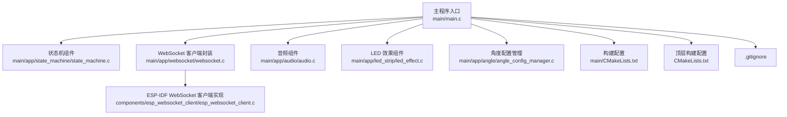
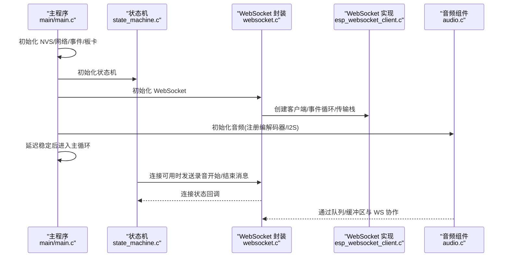
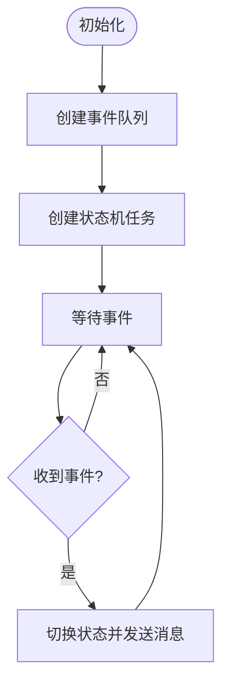
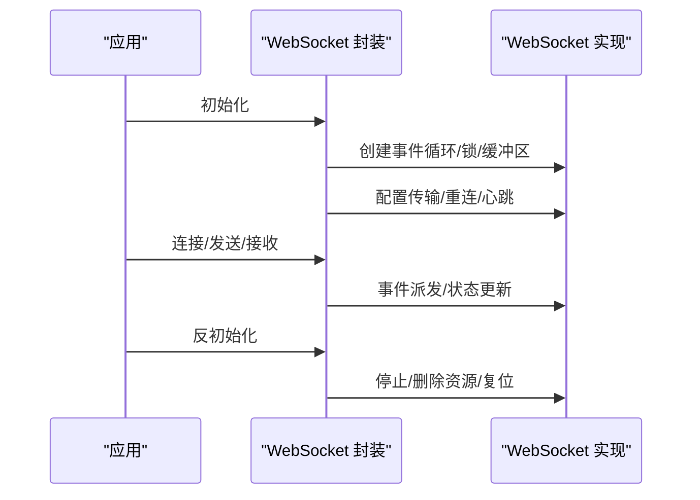
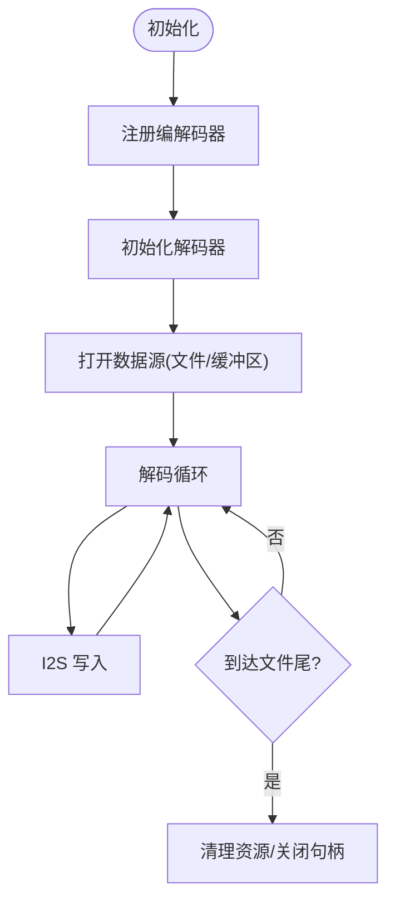
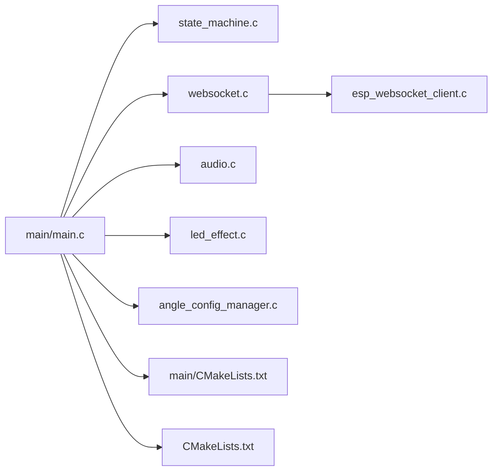

# 组件生命周期管理

<cite>
**本文引用的文件**
- [main.c](file://main/main.c)
- [CMakeLists.txt](file://main/CMakeLists.txt)
- [CMakeLists.txt](file://CMakeLists.txt)
- [state_machine.c](file://main/app/state_machine/state_machine.c)
- [state_machine.h](file://main/app/state_machine/state_machine.h)
- [websocket.c](file://main/app/websocket/websocket.c)
- [esp_websocket_client.c](file://components/esp_websocket_client/esp_websocket_client.c)
- [audio.c](file://main/app/audio/audio.c)
- [led_effect.c](file://main/app/led_strip/led_effect.c)
- [angle_config_manager.c](file://main/app/angle/angle_config_manager.c)
- [.gitignore](file://.gitignore)
</cite>

## 目录
1. [引言](#引言)
2. [项目结构](#项目结构)
3. [核心组件](#核心组件)
4. [架构总览](#架构总览)
5. [详细组件分析](#详细组件分析)
6. [依赖关系分析](#依赖关系分析)
7. [性能考量](#性能考量)
8. [故障排查指南](#故障排查指南)
9. [结论](#结论)
10. [附录](#附录)

## 引言
本文件围绕组件生命周期管理进行系统化技术文档编制，重点覆盖以下方面：
- 组件初始化、运行与销毁阶段的策略与控制流
- 启动顺序、依赖等待与资源分配机制
- 组件间协调同步、状态传播与异常处理
- 热插拔、动态加载与卸载能力现状与建议
- 监控、健康检查与故障恢复机制
- 结合实际代码示例展示实现细节与最佳实践

## 项目结构
该项目采用 ESP-IDF 工程组织方式，顶层通过主程序入口集中初始化各子系统；应用层组件以模块化形式分布在 main/app 下，第三方组件位于 components 目录。构建系统通过 CMakeLists.txt 配置源码目录与 SPIFFS 分区。

图表来源
- [main.c:33-60](file://main/main.c#L33-L60)
- [CMakeLists.txt:1-4](file://main/CMakeLists.txt#L1-L4)
- [CMakeLists.txt:1-10](file://CMakeLists.txt#L1-L10)

章节来源
- [main.c:33-60](file://main/main.c#L33-L60)
- [CMakeLists.txt:1-4](file://main/CMakeLists.txt#L1-L4)
- [CMakeLists.txt:1-10](file://CMakeLists.txt#L1-L10)
- [.gitignore:1-3](file://.gitignore#L1-L3)

## 核心组件
- 状态机组件：负责按键事件驱动的录音启停状态流转，并通过 WebSocket 发送控制消息。
- WebSocket 客户端封装：提供连接、断线重连、事件派发、反初始化等生命周期管理接口。
- ESP-IDF WebSocket 客户端实现：底层传输栈、事件分发、自动重连、资源回收等。
- 音频组件：注册编解码器、I2S 播放、OPUS 编解码、环形缓冲与队列协作。
- LED 效果组件：基于 JSON 配置解析与 LED 控制，支持多风格效果。
- 角度配置管理：根据 IMU 角度切换 LED/音频配置，周期性监控与更新。

章节来源
- [state_machine.c:24-35](file://main/app/state_machine/state_machine.c#L24-L35)
- [websocket.c:681-702](file://main/app/websocket/websocket.c#L681-L702)
- [esp_websocket_client.c:681-800](file://components/esp_websocket_client/esp_websocket_client.c#L681-L800)
- [audio.c:69-92](file://main/app/audio/audio.c#L69-L92)
- [led_effect.c:83-365](file://main/app/led_strip/led_effect.c#L83-L365)
- [angle_config_manager.c:195-204](file://main/app/angle/angle_config_manager.c#L195-L204)

## 架构总览
整体架构遵循“主程序集中初始化 + 组件模块化”的设计。主程序在 app_main 中依次完成 NVS、网络、硬件板卡初始化，随后启动各业务组件的任务与服务。组件之间通过 FreeRTOS 队列、信号量与回调事件进行异步通信。

图表来源
- [main.c:33-60](file://main/main.c#L33-L60)
- [state_machine.c:24-35](file://main/app/state_machine/state_machine.c#L24-L35)
- [websocket.c:681-702](file://main/app/websocket/websocket.c#L681-L702)
- [esp_websocket_client.c:681-800](file://components/esp_websocket_client/esp_websocket_client.c#L681-L800)
- [audio.c:69-92](file://main/app/audio/audio.c#L69-L92)

## 详细组件分析

### 状态机组件生命周期
- 初始化：创建事件队列与状态机任务，初始状态为空闲。
- 运行：任务阻塞等待事件队列，收到按键事件后切换状态并触发录音启停。
- 销毁：未见显式反初始化接口；可通过停止任务与删除队列实现资源回收（建议增强）。

图表来源
- [state_machine.c:24-35](file://main/app/state_machine/state_machine.c#L24-L35)
- [state_machine.c:49-57](file://main/app/state_machine/state_machine.c#L49-L57)
- [state_machine.c:83-115](file://main/app/state_machine/state_machine.c#L83-L115)

章节来源
- [state_machine.c:24-35](file://main/app/state_machine/state_machine.c#L24-L35)
- [state_machine.c:49-57](file://main/app/state_machine/state_machine.c#L49-L57)
- [state_machine.c:83-115](file://main/app/state_machine/state_machine.c#L83-L115)
- [state_machine.h:19-34](file://main/app/state_machine/state_machine.h#L19-L34)

### WebSocket 客户端生命周期
- 初始化：创建事件循环、递归互斥锁、状态位组、传输列表与缓冲区，设置默认配置与重连策略。
- 运行：任务循环处理连接、心跳、自动重连与事件派发。
- 销毁：停止运行、删除定时器/信号量、释放配置与传输资源，复位初始化标记。

图表来源
- [websocket.c:681-702](file://main/app/websocket/websocket.c#L681-L702)
- [esp_websocket_client.c:681-800](file://components/esp_websocket_client/esp_websocket_client.c#L681-L800)
- [esp_websocket_client.c:438-462](file://components/esp_websocket_client/esp_websocket_client.c#L438-L462)

章节来源
- [websocket.c:681-702](file://main/app/websocket/websocket.c#L681-L702)
- [esp_websocket_client.c:681-800](file://components/esp_websocket_client/esp_websocket_client.c#L681-L800)
- [esp_websocket_client.c:438-462](file://components/esp_websocket_client/esp_websocket_client.c#L438-L462)

### 音频组件生命周期
- 初始化：注册编解码器、初始化解码器、打开音频文件或缓冲区数据源。
- 运行：解码循环读取数据并通过 I2S 播放；编码任务从队列取 PCM 帧进行 OPUS 编码，写入环形缓冲与队列。
- 销毁：关闭文件/解码器，释放内存与句柄。

图表来源
- [audio.c:69-92](file://main/app/audio/audio.c#L69-L92)
- [audio.c:131-205](file://main/app/audio/audio.c#L131-L205)
- [audio.c:617-697](file://main/app/audio/audio.c#L617-L697)

章节来源
- [audio.c:69-92](file://main/app/audio/audio.c#L69-L92)
- [audio.c:131-205](file://main/app/audio/audio.c#L131-L205)
- [audio.c:617-697](file://main/app/audio/audio.c#L617-L697)

### LED 效果组件生命周期
- 初始化：解析 JSON 配置，加载默认配置并保存至文件。
- 运行：周期性任务读取 IMU 角度，根据阈值切换配置并更新 LED。
- 销毁：未见显式反初始化；建议增加配置持久化与资源回收。

章节来源
- [led_effect.c:83-365](file://main/app/led_strip/led_effect.c#L83-L365)
- [angle_config_manager.c:195-204](file://main/app/angle/angle_config_manager.c#L195-L204)

## 依赖关系分析
- 主程序依赖：NVS、网络、事件、GPIOISR、板卡初始化；随后串行启动 IMU、按键、LED、状态机、WiFi、MQTT、语音识别、角度配置、音频、TCP 服务器。
- 组件内聚：状态机依赖 WebSocket 与语音识别；WebSocket 封装依赖 ESP-IDF WebSocket 实现；音频组件依赖编解码器与 I2S。
- 外部依赖：ESP-IDF、FreeRTOS、SPIFFS、JSON 解析库等。

图表来源
- [main.c:33-60](file://main/main.c#L33-L60)
- [CMakeLists.txt:1-4](file://main/CMakeLists.txt#L1-L4)
- [CMakeLists.txt:1-10](file://CMakeLists.txt#L1-L10)

章节来源
- [main.c:33-60](file://main/main.c#L33-L60)
- [CMakeLists.txt:1-4](file://main/CMakeLists.txt#L1-L4)
- [CMakeLists.txt:1-10](file://CMakeLists.txt#L1-L10)

## 性能考量
- 任务优先级与栈大小：状态机与 WebSocket 任务均使用中等优先级与适配栈深，避免抢占与栈溢出风险。
- 缓冲与队列：音频组件采用环形缓冲与队列解耦生产者/消费者，降低 CPU 占用与延迟抖动。
- 互斥与超时：关键共享资源使用递归互斥锁与明确超时，防止死锁与长时间阻塞。
- 动态缓冲：WebSocket 客户端支持动态缓冲配置，按需调整内存占用与吞吐。

章节来源
- [state_machine.c:32](file://main/app/state_machine/state_machine.c#L32)
- [websocket.c:681-702](file://main/app/websocket/websocket.c#L681-L702)
- [esp_websocket_client.c:159-196](file://components/esp_websocket_client/esp_websocket_client.c#L159-L196)
- [audio.c:34-50](file://main/app/audio/audio.c#L34-L50)

## 故障排查指南
- WebSocket 断线与重连
  - 现象：连接中断、自动重连定时器触发。
  - 排查：检查网络状态、证书/认证配置、Ping/Pong 超时设置。
  - 参考路径：[esp_websocket_client.c:237-253](file://components/esp_websocket_client/esp_websocket_client.c#L237-L253)，[websocket.c:681-702](file://main/app/websocket/websocket.c#L681-L702)
- 音频播放异常
  - 现象：I2S 写入失败、解码错误、缓冲区满/空。
  - 排查：确认数据源路径、编解码器实现完整性、队列/缓冲区互斥锁。
  - 参考路径：[audio.c:168-178](file://main/app/audio/audio.c#L168-L178)，[audio.c:266-272](file://main/app/audio/audio.c#L266-L272)
- 状态机事件丢失
  - 现象：按键事件未触发状态切换。
  - 排查：确认事件队列创建与发送、任务优先级与调度。
  - 参考路径：[state_machine.c:26-42](file://main/app/state_machine/state_machine.c#L26-L42)，[state_machine.c:52-56](file://main/app/state_machine/state_machine.c#L52-L56)

章节来源
- [esp_websocket_client.c:237-253](file://components/esp_websocket_client/esp_websocket_client.c#L237-L253)
- [websocket.c:681-702](file://main/app/websocket/websocket.c#L681-L702)
- [audio.c:168-178](file://main/app/audio/audio.c#L168-L178)
- [audio.c:266-272](file://main/app/audio/audio.c#L266-L272)
- [state_machine.c:26-42](file://main/app/state_machine/state_machine.c#L26-L42)
- [state_machine.c:52-56](file://main/app/state_machine/state_machine.c#L52-L56)

## 结论
本项目在组件生命周期管理上体现了清晰的初始化-运行-销毁闭环：主程序集中初始化，组件内部通过任务/队列/信号量实现解耦；WebSocket 提供完善的自动重连与资源回收；音频组件通过缓冲与队列实现高吞吐低延迟。建议后续增强：
- 统一的反初始化接口与资源回收规范
- 组件间统一的健康检查与故障上报机制
- 热插拔与动态加载的框架设计（如组件注册表与动态卸载）

## 附录
- 启动顺序参考：NVS → 网络/事件 → 板卡 → IMU/按键/LED → 状态机 → WiFi/MQTT → 语音识别 → 角度配置 → 音频/TCP
- 关键实现路径：
  - [main.c:33-60](file://main/main.c#L33-L60)
  - [websocket.c:681-702](file://main/app/websocket/websocket.c#L681-L702)
  - [esp_websocket_client.c:681-800](file://components/esp_websocket_client/esp_websocket_client.c#L681-L800)
  - [audio.c:69-92](file://main/app/audio/audio.c#L69-L92)
  - [state_machine.c:24-35](file://main/app/state_machine/state_machine.c#L24-L35)